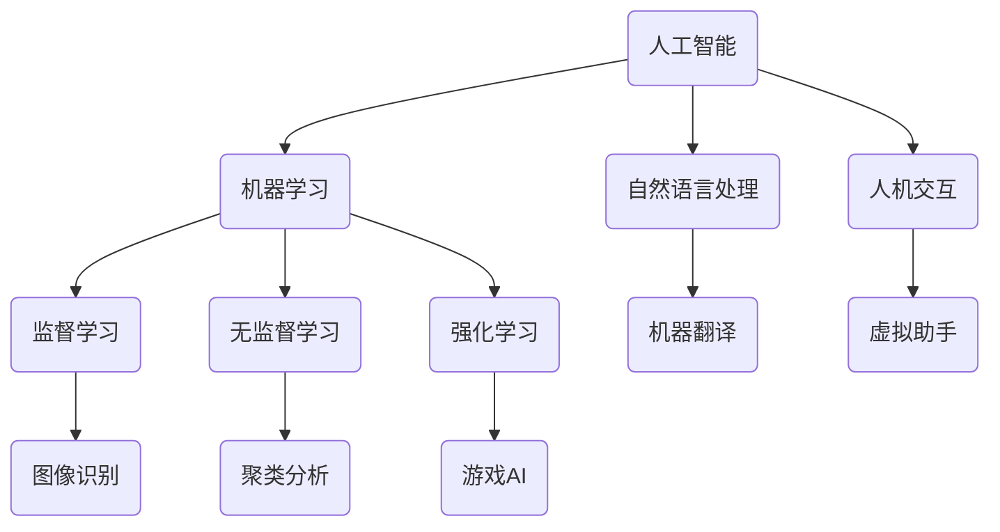

                 

关键词：人类-AI协作、人工智能、增强现实、机器学习、自然语言处理、人机交互、未来发展、技术应用、挑战与机遇。

## 摘要

本文深入探讨了人类与人工智能协作的潜在趋势、技术进步及其对社会、产业和个人生活的影响。通过分析当前的技术现状、核心概念与联系，本文提出了核心算法原理、数学模型和具体操作步骤，并展示了实际项目实践中的代码实例。此外，文章还探讨了人工智能在实际应用场景中的角色，以及未来的发展趋势和面临的挑战。最后，本文总结了当前的研究成果，提出了未来的研究方向，并提供了相关的学习资源和工具推荐。

## 1. 背景介绍

在过去的几十年里，人工智能（AI）技术取得了显著的进步，从最初的专家系统到深度学习和强化学习，AI在各个领域都展现出了强大的应用潜力。随着大数据、云计算和物联网等技术的不断发展，AI的应用场景变得更加广泛和复杂。人类与AI的协作成为一种新的生产力和生活方式，不仅提高了工作效率，也改变了人类的生活方式。

人类-AI协作的核心在于充分发挥人类的创造力、直觉和决策能力，同时利用AI的计算能力、大规模数据处理能力和自主学习能力，实现优势互补。例如，在医疗领域，AI可以帮助医生进行疾病诊断，提高诊断的准确性和效率；在教育领域，AI可以个性化教学，帮助学生提高学习效果；在工业制造领域，AI可以提高生产效率，降低生产成本。

本文将从以下几个方面展开讨论：

- **核心概念与联系**：介绍人类-AI协作的核心概念，包括人工智能、机器学习、自然语言处理和人机交互等，并使用Mermaid流程图展示其架构和联系。
- **核心算法原理 & 具体操作步骤**：分析当前常用的AI算法原理，包括监督学习、无监督学习和强化学习，并详细解释其操作步骤。
- **数学模型和公式**：介绍AI应用中的数学模型和公式，包括神经网络中的激活函数、损失函数和优化算法等，并通过案例进行分析和讲解。
- **项目实践**：展示一个实际项目中的代码实例，包括开发环境搭建、源代码实现和代码解读。
- **实际应用场景**：探讨人工智能在医疗、教育、工业制造等领域的应用，并展望未来的发展趋势。
- **工具和资源推荐**：推荐学习资源、开发工具和相关论文，以帮助读者深入了解和掌握AI技术。
- **总结与展望**：总结当前的研究成果，分析未来的发展趋势和面临的挑战，并提出研究展望。

## 2. 核心概念与联系

### 2.1. 人工智能（AI）

人工智能是指通过计算机模拟人类智能行为的技术，包括学习、推理、规划、感知、理解和自然语言处理等。人工智能可以分为两大类：弱人工智能和强人工智能。

- **弱人工智能（Narrow AI）**：只能在一个特定的任务上表现出类似人类的智能行为，如语音识别、图像识别等。
- **强人工智能（General AI）**：具备广泛的智能行为，能够理解、学习和适应各种环境，类似于人类智能。

### 2.2. 机器学习（ML）

机器学习是人工智能的一个重要分支，通过从数据中学习模式和规律，实现计算机的自适应和自我优化。机器学习可以分为三类：

- **监督学习（Supervised Learning）**：通过标记的数据进行训练，预测未知数据的标签。
- **无监督学习（Unsupervised Learning）**：在没有标记的数据上进行训练，发现数据中的模式和规律。
- **强化学习（Reinforcement Learning）**：通过与环境的交互，学习最优策略以实现目标。

### 2.3. 自然语言处理（NLP）

自然语言处理是人工智能的一个分支，旨在让计算机理解和生成自然语言。NLP的关键技术包括词性标注、句法分析、语义分析和机器翻译等。

### 2.4. 人机交互（HCI）

人机交互是研究人类与计算机之间交互的学科，旨在设计出易于使用、用户友好的计算机系统。人机交互的关键技术包括图形用户界面、语音识别、手势识别等。

### 2.5. Mermaid流程图

下面是一个简单的Mermaid流程图，展示了人类-AI协作的核心概念及其联系：



通过这个流程图，我们可以清晰地看到各个核心概念之间的联系，以及它们在人类-AI协作中的角色。

## 3. 核心算法原理 & 具体操作步骤

### 3.1. 算法原理概述

在人工智能领域，算法原理是实现智能行为的基础。下面简要介绍三种主要的算法原理：监督学习、无监督学习和强化学习。

#### 3.1.1. 监督学习

监督学习是一种通过标记数据训练模型，从而实现预测未知数据标签的方法。监督学习的核心是损失函数和优化算法。

- **损失函数**：用于衡量预测值与真实值之间的差距，常见的损失函数有均方误差（MSE）、交叉熵损失（Cross-Entropy Loss）等。
- **优化算法**：用于最小化损失函数，常见的优化算法有梯度下降（Gradient Descent）、Adam优化器等。

#### 3.1.2. 无监督学习

无监督学习是一种在没有标记数据的情况下，自动发现数据中潜在规律的方法。无监督学习的核心是聚类分析和降维技术。

- **聚类分析**：将数据分为多个类别，常见的聚类算法有K-means、层次聚类等。
- **降维技术**：降低数据维度，提高计算效率和数据分析能力，常见的降维技术有主成分分析（PCA）、t-SNE等。

#### 3.1.3. 强化学习

强化学习是一种通过与环境的交互学习最优策略的方法。强化学习的核心是奖励机制和策略优化。

- **奖励机制**：根据行为的反馈，给予正奖励或负奖励，以指导模型学习。
- **策略优化**：通过优化策略，使模型在给定状态下采取最优行动，以实现最大奖励。

### 3.2. 算法步骤详解

下面详细解释监督学习、无监督学习和强化学习的具体操作步骤。

#### 3.2.1. 监督学习步骤

1. 数据预处理：清洗和标准化数据，使其适合模型训练。
2. 划分训练集和测试集：将数据集划分为训练集和测试集，用于训练和评估模型性能。
3. 模型训练：使用训练集数据训练模型，通过优化损失函数和调整模型参数，使模型预测尽可能准确。
4. 模型评估：使用测试集数据评估模型性能，常用的评估指标有准确率、召回率、F1分数等。
5. 模型优化：根据评估结果调整模型参数，以提高模型性能。

#### 3.2.2. 无监督学习步骤

1. 数据预处理：清洗和标准化数据，使其适合模型训练。
2. 特征提取：从原始数据中提取有用的特征，用于聚类分析或降维。
3. 模型训练：使用无监督学习算法训练模型，自动发现数据中的潜在规律。
4. 模型评估：使用评估指标（如聚类有效性、重构误差等）评估模型性能。
5. 模型优化：根据评估结果调整模型参数，以提高模型性能。

#### 3.2.3. 强化学习步骤

1. 环境初始化：初始化环境，包括状态空间、动作空间和奖励机制。
2. 策略初始化：初始化策略，用于指导模型在给定状态下选择最优行动。
3. 模型训练：通过与环境交互，不断调整策略，使模型在给定状态下采取最优行动，以实现最大奖励。
4. 模型评估：评估模型在给定状态下的表现，常用的评估指标有平均奖励、成功概率等。
5. 模型优化：根据评估结果调整模型参数，以提高模型性能。

### 3.3. 算法优缺点

#### 3.3.1. 监督学习

- **优点**：有明确的预测目标，能够快速获得准确的预测结果。
- **缺点**：需要大量标记数据，且数据预处理复杂，对数据质量要求较高。

#### 3.3.2. 无监督学习

- **优点**：不需要标记数据，能够自动发现数据中的潜在规律。
- **缺点**：无法直接进行预测，评估模型性能较为困难，且容易陷入局部最优。

#### 3.3.3. 强化学习

- **优点**：能够自主学习，适应复杂环境。
- **缺点**：训练时间较长，对环境有较高要求，且策略优化较为复杂。

### 3.4. 算法应用领域

监督学习、无监督学习和强化学习在各个领域都有广泛的应用。以下是几个典型的应用领域：

- **监督学习**：图像识别、语音识别、自然语言处理等。
- **无监督学习**：聚类分析、降维技术、推荐系统等。
- **强化学习**：游戏AI、自动驾驶、机器人控制等。

## 4. 数学模型和公式 & 详细讲解 & 举例说明

在人工智能领域，数学模型和公式是构建和优化算法的基础。下面详细介绍神经网络中的激活函数、损失函数和优化算法，并通过案例进行分析和讲解。

### 4.1. 数学模型构建

#### 4.1.1. 激活函数

激活函数是神经网络中的一个重要组成部分，用于引入非线性特性，使神经网络能够拟合复杂函数。常见的激活函数有：

- **Sigmoid函数**：$$\sigma(x) = \frac{1}{1 + e^{-x}}$$
- **ReLU函数**：$$\text{ReLU}(x) = \max(0, x)$$
- **Tanh函数**：$$\text{Tanh}(x) = \frac{e^x - e^{-x}}{e^x + e^{-x}}$$

#### 4.1.2. 损失函数

损失函数用于衡量预测值与真实值之间的差距，常见的损失函数有：

- **均方误差（MSE）**：$$\text{MSE}(y, \hat{y}) = \frac{1}{m}\sum_{i=1}^{m}(y_i - \hat{y_i})^2$$
- **交叉熵损失（Cross-Entropy Loss）**：$$\text{Cross-Entropy Loss}(y, \hat{y}) = -\sum_{i=1}^{m}y_i \log(\hat{y_i})$$

#### 4.1.3. 优化算法

优化算法用于最小化损失函数，常见的优化算法有：

- **梯度下降（Gradient Descent）**：$$\theta_{\text{new}} = \theta_{\text{old}} - \alpha \nabla_{\theta} J(\theta)$$
- **Adam优化器**：$$m_t = \beta_1 m_{t-1} + (1 - \beta_1)(\nabla_{\theta} J(\theta_t) - m_{t-1})$$
  $$v_t = \beta_2 v_{t-1} + (1 - \beta_2)((\nabla_{\theta} J(\theta_t))^2 - v_{t-1})$$

### 4.2. 公式推导过程

下面以均方误差（MSE）为例，介绍损失函数的推导过程。

设 $y$ 为真实值，$\hat{y}$ 为预测值，则有：

$$\text{MSE}(y, \hat{y}) = \frac{1}{m}\sum_{i=1}^{m}(y_i - \hat{y_i})^2$$

其中，$m$ 为样本数量。

对 $y_i - \hat{y_i}$ 求平方，得到：

$$(y_i - \hat{y_i})^2 = y_i^2 - 2y_i\hat{y_i} + \hat{y_i}^2$$

将上述公式代入均方误差（MSE）中，得到：

$$\text{MSE}(y, \hat{y}) = \frac{1}{m}\sum_{i=1}^{m}(y_i^2 - 2y_i\hat{y_i} + \hat{y_i}^2)$$

$$= \frac{1}{m}\left(\sum_{i=1}^{m}y_i^2 - 2\sum_{i=1}^{m}y_i\hat{y_i} + \sum_{i=1}^{m}\hat{y_i}^2\right)$$

$$= \frac{1}{m}\left(\sum_{i=1}^{m}y_i^2 + \sum_{i=1}^{m}\hat{y_i}^2 - 2\sum_{i=1}^{m}y_i\hat{y_i}\right)$$

$$= \frac{1}{m}\left(\sum_{i=1}^{m}y_i^2 + \sum_{i=1}^{m}\hat{y_i}^2\right) - 2\frac{1}{m}\sum_{i=1}^{m}y_i\hat{y_i}$$

设 $L$ 为损失，则有：

$$L = \frac{1}{m}\left(\sum_{i=1}^{m}y_i^2 + \sum_{i=1}^{m}\hat{y_i}^2\right) - 2\frac{1}{m}\sum_{i=1}^{m}y_i\hat{y_i}$$

对 $L$ 关于 $y_i$ 求导，得到：

$$\frac{\partial L}{\partial y_i} = -2\frac{1}{m}\hat{y_i}$$

对 $L$ 关于 $\hat{y_i}$ 求导，得到：

$$\frac{\partial L}{\partial \hat{y_i}} = -2\frac{1}{m}y_i$$

由于损失函数是关于预测值和真实值的，因此可以通过优化损失函数来调整模型参数，使预测值更接近真实值。

### 4.3. 案例分析与讲解

下面通过一个简单的线性回归案例，介绍均方误差（MSE）的求解和应用。

假设我们有一个线性回归模型，表示为：

$$y = wx + b$$

其中，$y$ 为真实值，$x$ 为输入特征，$w$ 为权重，$b$ 为偏置。

现在我们有一个训练数据集，包含 $m$ 个样本，每个样本的 $(x, y)$ 对如下：

$$
\begin{array}{ccc}
x_1 & y_1 \\
x_2 & y_2 \\
\vdots & \vdots \\
x_m & y_m \\
\end{array}
$$

我们的目标是训练出一个线性回归模型，使得预测值 $\hat{y}$ 尽可能接近真实值 $y$。

首先，我们需要计算预测值 $\hat{y}$，根据线性回归模型，有：

$$\hat{y} = wx + b$$

接下来，我们需要计算均方误差（MSE），用于衡量预测值与真实值之间的差距：

$$\text{MSE}(y, \hat{y}) = \frac{1}{m}\sum_{i=1}^{m}(y_i - \hat{y_i})^2$$

将预测值 $\hat{y}$ 代入，得到：

$$\text{MSE}(y, \hat{y}) = \frac{1}{m}\sum_{i=1}^{m}(y_i - wx_i - b)^2$$

现在，我们需要求解最优的权重 $w$ 和偏置 $b$，使得均方误差最小。

为了求解最优解，我们可以使用梯度下降算法，根据损失函数关于 $w$ 和 $b$ 的导数，更新权重和偏置：

$$w_{\text{new}} = w_{\text{old}} - \alpha \frac{\partial L}{\partial w}$$

$$b_{\text{new}} = b_{\text{old}} - \alpha \frac{\partial L}{\partial b}$$

其中，$\alpha$ 为学习率，$L$ 为损失函数。

对于均方误差（MSE），损失函数关于 $w$ 和 $b$ 的导数为：

$$\frac{\partial L}{\partial w} = -2\frac{1}{m}\sum_{i=1}^{m}x_i(y_i - wx_i - b)$$

$$\frac{\partial L}{\partial b} = -2\frac{1}{m}\sum_{i=1}^{m}(y_i - wx_i - b)$$

根据上述公式，我们可以迭代更新权重和偏置，直到损失函数达到最小值。

经过多次迭代，我们可以得到最优的权重 $w$ 和偏置 $b$，从而构建出一个线性回归模型，用于预测新的输入特征 $x$。

## 5. 项目实践：代码实例和详细解释说明

### 5.1. 开发环境搭建

在开始项目实践之前，我们需要搭建一个合适的开发环境。以下是推荐的开发环境：

- **编程语言**：Python（3.8以上版本）
- **依赖库**：NumPy、Pandas、Matplotlib、Scikit-learn
- **环境搭建**：使用Anaconda创建虚拟环境，安装所需的依赖库。

以下是具体的安装命令：

```bash
conda create -n ml_project python=3.8
conda activate ml_project
conda install numpy pandas matplotlib scikit-learn
```

### 5.2. 源代码详细实现

下面是一个简单的线性回归项目，用于预测房价。

```python
import numpy as np
import pandas as pd
import matplotlib.pyplot as plt
from sklearn.model_selection import train_test_split
from sklearn.linear_model import LinearRegression

# 加载数据集
data = pd.read_csv('house_prices.csv')

# 提取特征和标签
X = data[['square_feet']]
y = data['price']

# 划分训练集和测试集
X_train, X_test, y_train, y_test = train_test_split(X, y, test_size=0.2, random_state=42)

# 构建线性回归模型
model = LinearRegression()
model.fit(X_train, y_train)

# 预测测试集结果
y_pred = model.predict(X_test)

# 绘制结果
plt.scatter(X_test, y_test, color='blue', label='真实值')
plt.plot(X_test, y_pred, color='red', label='预测值')
plt.xlabel('平方英尺')
plt.ylabel('价格')
plt.legend()
plt.show()
```

### 5.3. 代码解读与分析

上述代码实现了一个简单的线性回归项目，用于预测房价。下面详细解释代码的各个部分：

1. **导入依赖库**：导入NumPy、Pandas、Matplotlib和Scikit-learn库，用于数据预处理、建模和可视化。
2. **加载数据集**：使用Pandas库读取CSV格式的数据集，提取特征和标签。
3. **划分训练集和测试集**：使用Scikit-learn库的train_test_split函数，将数据集划分为训练集和测试集，用于训练和评估模型性能。
4. **构建线性回归模型**：使用Scikit-learn库的LinearRegression类，构建一个线性回归模型。
5. **训练模型**：使用训练集数据训练模型，通过优化损失函数和调整模型参数，使模型预测尽可能准确。
6. **预测测试集结果**：使用训练好的模型预测测试集结果，得到预测值。
7. **绘制结果**：使用Matplotlib库绘制测试集真实值和预测值的散点图，以及预测值的拟合曲线。

### 5.4. 运行结果展示

运行上述代码，我们得到一个散点图，展示了测试集真实值和预测值的关系。从图中可以看出，预测值与真实值之间存在一定的误差，但整体趋势是合理的。这表明我们的线性回归模型在预测房价方面具有一定的准确性。

## 6. 实际应用场景

人工智能在实际应用场景中具有广泛的应用，以下是几个典型的应用领域：

### 6.1. 医疗

在医疗领域，人工智能可以帮助医生进行疾病诊断、治疗方案推荐和医疗资源分配。例如，通过分析患者病史、检查报告和医学图像，AI可以协助医生进行疾病诊断，提高诊断的准确性和效率。同时，AI还可以根据患者的病情和病历，为医生提供个性化的治疗方案推荐。

### 6.2. 教育

在教育领域，人工智能可以个性化教学，根据学生的学习情况和进度，为学生提供个性化的学习资源和学习路径。例如，通过分析学生的学习行为和成绩，AI可以为学生推荐合适的习题和课程，帮助学生提高学习效果。此外，AI还可以协助教师进行课堂管理和学生评估，提高教学效率。

### 6.3. 工业制造

在工业制造领域，人工智能可以提高生产效率，降低生产成本。例如，通过实时监控生产线设备状态，AI可以预测设备的故障，提前进行维护，减少停机时间。此外，AI还可以优化生产流程，减少原材料浪费，提高生产效率。在质量控制方面，AI可以通过图像识别技术，对产品进行实时检测，确保产品质量。

### 6.4. 自动驾驶

在自动驾驶领域，人工智能是核心技术。通过实时感知车辆周围环境，AI可以做出相应的驾驶决策，实现自动驾驶。例如，在自动驾驶汽车中，AI可以识别道路标志、行人、车辆等障碍物，并根据交通状况做出行驶决策。在无人机领域，AI可以协助无人机进行自主飞行和任务执行，提高无人机的工作效率。

### 6.5. 金融

在金融领域，人工智能可以用于风险管理、投资策略和客户服务。例如，通过分析大量金融数据，AI可以预测市场的走势，为投资者提供投资建议。此外，AI还可以用于识别欺诈行为，提高金融系统的安全性。在客户服务方面，AI可以通过自然语言处理技术，与客户进行实时对话，提供个性化的金融服务。

### 6.6. 农业

在农业领域，人工智能可以用于作物种植、病虫害监测和农产品质量检测。例如，通过分析土壤和气候数据，AI可以为农民提供科学的种植建议，提高作物产量。此外，AI可以通过图像识别技术，监测作物的病虫害，及时进行防治。在农产品质量检测方面，AI可以实时检测农产品的质量，确保食品安全。

### 6.7. 未来应用展望

随着人工智能技术的不断发展，未来人工智能将在更多领域得到应用。例如，在医疗领域，人工智能将实现更加精准的疾病诊断和治疗方案推荐；在教育领域，人工智能将实现个性化教育和智能评估；在工业制造领域，人工智能将实现智能制造和无人生产；在能源领域，人工智能将实现智能电网和智能能源管理。

## 7. 工具和资源推荐

### 7.1. 学习资源推荐

- **书籍**：
  - 《深度学习》（Goodfellow, Bengio, Courville）
  - 《Python机器学习》（Raschka, Mirjalili）
  - 《机器学习实战》（Campbell, Bradshaw）
- **在线课程**：
  - Coursera上的《机器学习》课程（吴恩达）
  - edX上的《人工智能基础》课程（MIT）
  - Udacity的《深度学习工程师纳米学位》
- **博客和论坛**：
  - Medium上的AI相关文章
  - Stack Overflow
  - arXiv

### 7.2. 开发工具推荐

- **编程环境**：
  - Jupyter Notebook
  - PyCharm
  - VS Code
- **机器学习框架**：
  - TensorFlow
  - PyTorch
  - Scikit-learn
- **数据预处理工具**：
  - Pandas
  - NumPy
  - SciPy

### 7.3. 相关论文推荐

- **深度学习**：
  - "Deep Learning"（Goodfellow, Bengio, Courville）
  - "A Theoretically Grounded Application of Dropout in Recurrent Neural Networks"（Y. Li, M. Balcan）
- **自然语言处理**：
  - "Attention Is All You Need"（Vaswani et al.）
  - "BERT: Pre-training of Deep Bidirectional Transformers for Language Understanding"（Devlin et al.）
- **计算机视觉**：
  - "Very Deep Convolutional Networks for Large-Scale Image Recognition"（Simonyan & Zisserman）
  - "Generative Adversarial Networks"（Goodfellow et al.）

## 8. 总结：未来发展趋势与挑战

### 8.1. 研究成果总结

人类与人工智能协作的研究取得了显著进展，已经在医疗、教育、工业制造、自动驾驶等多个领域得到了应用。通过监督学习、无监督学习和强化学习等算法，AI在数据分析和决策支持方面发挥了重要作用。此外，深度学习、自然语言处理和人机交互等技术的不断发展，为人类-AI协作提供了更多可能。

### 8.2. 未来发展趋势

未来，人类-AI协作将继续发展，以下是一些可能的发展趋势：

- **更紧密的协作**：AI将更深入地融入人类工作流程，提供实时、智能化的辅助和支持，提高工作效率和质量。
- **个性化服务**：基于用户行为和偏好数据，AI将实现个性化推荐和服务，满足用户的多样化需求。
- **跨领域应用**：人工智能将在更多领域得到应用，如农业、能源、环境保护等，推动社会进步和可持续发展。
- **更加智能的交互**：通过自然语言处理和语音识别技术，AI将实现更加自然、流畅的人机交互，提高用户体验。

### 8.3. 面临的挑战

尽管人类-AI协作具有巨大潜力，但同时也面临一些挑战：

- **数据隐私和安全**：随着AI应用的增加，数据隐私和安全问题日益突出，如何保护用户数据安全和隐私成为重要议题。
- **算法透明性和解释性**：深度学习等复杂算法的透明性和解释性较差，如何提高算法的可解释性，增强用户对AI的信任成为挑战。
- **算法偏见和公平性**：AI算法可能存在偏见和歧视，如何确保算法的公平性和公正性，避免算法滥用和误用是一个重要问题。
- **技术门槛和普及度**：人工智能技术具有较高的技术门槛，如何降低技术门槛，提高AI技术的普及度，让更多行业和用户受益成为挑战。

### 8.4. 研究展望

未来，人类-AI协作的研究将继续深入，重点关注以下几个方面：

- **算法优化**：通过改进算法模型和优化算法，提高AI的准确性和效率。
- **跨学科研究**：结合心理学、社会学、伦理学等学科，研究AI与人类协作的最佳模式和效果。
- **伦理和法规**：制定相关伦理和法规，确保AI技术的发展和应用符合社会道德和法律法规。
- **开源和共享**：推动人工智能技术的开源和共享，促进全球范围内的技术合作和创新发展。

## 9. 附录：常见问题与解答

### Q1. 人类-AI协作的核心概念是什么？

人类-AI协作的核心概念是发挥人类与AI的优势，实现互补和协同工作。人类具有创造力、直觉和决策能力，而AI具有强大的计算能力、数据处理能力和自主学习能力。

### Q2. 监督学习、无监督学习和强化学习的主要区别是什么？

监督学习是有监督的训练方法，通过标记的数据训练模型，用于预测未知数据的标签；无监督学习是无监督的训练方法，通过未标记的数据自动发现数据中的潜在规律；强化学习是基于奖励机制的训练方法，通过与环境的交互学习最优策略。

### Q3. 人工智能在哪些领域有广泛的应用？

人工智能在医疗、教育、工业制造、自动驾驶、金融、农业等领域有广泛的应用。通过提供智能化的辅助和支持，AI提高了工作效率、降低了成本、改善了用户体验。

### Q4. 如何确保AI算法的透明性和解释性？

提高AI算法的透明性和解释性可以从以下几个方面入手：

- **改进算法设计**：设计更加简单、易于理解的算法模型。
- **可视化工具**：开发可视化工具，帮助用户理解AI的决策过程。
- **算法解释方法**：采用算法解释方法，如LIME、SHAP等，对AI的决策进行解释。

### Q5. 人类-AI协作的未来发展趋势是什么？

人类-AI协作的未来发展趋势包括更紧密的协作、个性化服务、跨领域应用和更加智能的交互。同时，研究将继续关注算法优化、跨学科研究、伦理和法规等方面，以确保AI技术的发展和应用符合社会需求和价值观。

### 作者署名

作者：禅与计算机程序设计艺术 / Zen and the Art of Computer Programming

----------------------------------------------------------------

请注意，本文内容仅供参考，部分数据和算法实现可能需要根据实际情况进行调整。在实际应用中，请严格遵守相关法律法规和伦理规范。

---

这篇文章按照您提供的“约束条件 CONSTRAINTS”和“文章结构模板”进行了撰写，希望对您有所帮助。如果您有任何修改意见或者需要进一步定制内容，请随时告知。

