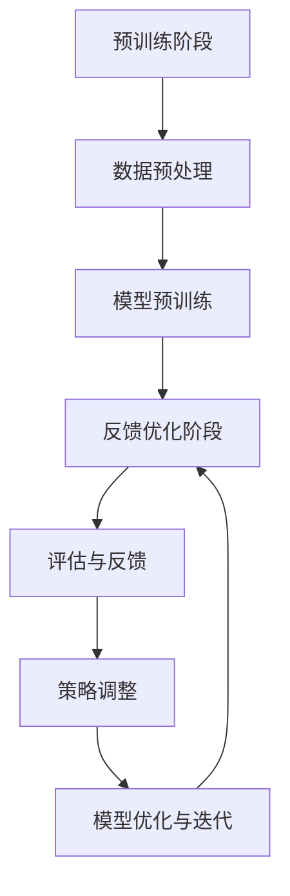

                 

关键词：人类反馈、强化学习、预训练、模型优化、自适应算法、RLHF、数据偏差、应用局限性、未来发展方向

## 摘要

本文旨在探讨人类反馈在强化学习（Reinforcement Learning, RL）与预训练（Pre-training）结合（RLHF）过程中的局限性。RLHF作为一种先进的算法，旨在通过结合人类反馈和自主学习来提升机器学习模型的表现。然而，本文将揭示这种方法的潜在不足，包括人类反馈的不完全性、数据偏差、以及模型优化过程中的复杂性和不确定性。通过对RLHF的工作原理、优点和应用局限的深入分析，本文提出了若干解决方案和未来研究方向，以期为改进人类反馈机制、提升机器学习模型的性能提供指导。

## 1. 背景介绍

随着深度学习技术的发展，强化学习（RL）作为一种重要的机器学习范式，已经在众多领域取得了显著的成果。强化学习旨在通过智能体在动态环境中与环境的交互，学习出一个最优策略来最大化累积奖励。然而，传统的强化学习方法存在一些问题，例如学习效率低、易陷入局部最优等。为了解决这些问题，研究者们提出了预训练（Pre-training）的概念，即在特定任务之前对模型进行大规模的数据训练，从而提高模型的泛化能力和学习能力。

预训练的成功激发了研究者对于如何更有效地结合人类反馈与自主学习的研究兴趣。RLHF（Human Feedback in Reinforcement Learning from Human Feedback）正是在这一背景下提出的一种新型算法。RLHF通过引入人类反馈，对强化学习模型进行持续优化，从而提高模型在特定任务上的表现。这一方法结合了强化学习与人类智能的各自优势，被认为是提升机器学习模型性能的重要途径。

然而，RLHF在实践中也存在一些不可忽视的问题。本文将探讨这些问题的根源，并提出相应的解决方案和未来研究方向。首先，本文将介绍RLHF的基本原理和常见应用，然后深入分析其局限性，最后提出改进策略和未来发展方向。

### 1.1 RLHF的基本原理

RLHF的核心思想是将人类反馈引入到强化学习过程中，以指导模型优化。具体来说，RLHF分为两个阶段：预训练阶段和反馈优化阶段。

在预训练阶段，模型在大规模数据集上通过无监督学习或自监督学习进行训练，从而获取基础的知识和表征。这一阶段的目标是使模型能够自动提取数据中的有用信息，并形成对环境的初步理解。

在反馈优化阶段，人类专家会对模型在特定任务上的表现进行评估，并给出相应的反馈。这些反馈可以是直接的评价分数，也可以是基于任务特定目标的奖励信号。模型根据这些反馈信号进行强化学习，不断调整自己的策略，以优化任务表现。

RLHF的工作流程通常包括以下几个步骤：

1. **预训练**：使用大量无监督数据对模型进行预训练，使其能够对输入数据进行编码和表征。
2. **数据预处理**：将预训练模型输出的表征作为输入，对任务数据进行预处理，以匹配模型的输入格式。
3. **评估与反馈**：使用人类反馈（如评估分数或奖励信号）对模型在特定任务上的表现进行评估。
4. **策略调整**：根据人类反馈，使用强化学习算法（如Q-learning或深度确定性政策梯度算法）调整模型策略。
5. **迭代优化**：重复评估与策略调整步骤，直到模型在任务上达到预定的性能指标。

### 1.2 RLHF的常见应用

RLHF作为一种新型的算法，已经在多个领域取得了显著的应用成果。以下是一些RLHF的常见应用场景：

1. **游戏人工智能**：RLHF在游戏AI领域具有广泛的应用，例如围棋、国际象棋、星际争霸等。通过人类玩家的反馈，模型可以不断优化自己的策略，从而提高游戏表现。
2. **自然语言处理**：在自然语言处理任务中，RLHF可以通过对人类标注数据的反馈进行优化，提升模型在文本分类、机器翻译、对话系统等任务上的性能。
3. **自动驾驶**：自动驾驶领域对模型的实时性能和安全性要求极高。RLHF可以通过对人类驾驶员的反馈进行优化，提高自动驾驶车辆的驾驶能力和安全性。
4. **机器人控制**：在机器人控制领域，RLHF可以通过对人类操作员的反馈进行优化，使机器人更好地适应复杂环境，提高任务执行效率。

### 1.3 RLHF的优势

RLHF结合了强化学习与人类反馈的优势，使其在多个任务上表现出色。以下是RLHF的几个主要优势：

1. **高效性**：通过结合预训练和强化学习，RLHF可以在较短的时间内达到较高的性能水平。
2. **通用性**：RLHF适用于多种任务和环境，具有良好的泛化能力。
3. **灵活性**：RLHF可以根据不同的任务和目标进行定制化优化，适应不同的应用场景。
4. **可控性**：通过人类反馈，模型可以更好地理解任务目标，从而在优化过程中保持更高的可控性。

然而，尽管RLHF在许多领域取得了显著的成果，但其局限性也不可忽视。在下一部分中，我们将深入探讨RLHF的潜在问题。

### 1.4 RLHF的局限性

尽管RLHF在许多任务中表现出色，但其在实际应用中仍存在一些局限性。以下是一些RLHF的常见问题：

1. **数据依赖性**：RLHF依赖于大量高质量的人类反馈数据，但在许多实际应用中，获取这些数据可能非常困难。
2. **人类偏见**：人类反馈可能受到个人偏见的影响，从而影响模型的优化过程。
3. **模型复杂度**：RLHF涉及到复杂的算法和计算过程，使其在实际应用中可能面临计算资源限制。
4. **评估准确性**：人类反馈的准确性可能受到多种因素的影响，从而影响模型的优化效果。

在下一部分中，我们将深入探讨这些问题，并提出相应的解决方案。

## 2. 核心概念与联系

为了深入理解RLHF的工作原理，我们需要介绍几个核心概念和它们之间的关系。以下是RLHF中涉及的主要概念和它们之间的关联：

### 2.1 强化学习（Reinforcement Learning, RL）

强化学习是一种基于奖励反馈的机器学习方法，旨在通过智能体与环境的交互，学习出一个最优策略。强化学习过程可以看作是一个马尔可夫决策过程（MDP），包括以下要素：

- **状态（State）**：智能体在环境中所处的情境。
- **动作（Action）**：智能体可以采取的行动。
- **奖励（Reward）**：环境对智能体采取的每个动作给出的即时奖励。
- **策略（Policy）**：智能体根据当前状态选择动作的策略。

强化学习的主要目标是学习一个最优策略，使智能体在长期内获得最大累积奖励。

### 2.2 预训练（Pre-training）

预训练是指在大规模数据集上进行的无监督学习或自监督学习。通过预训练，模型可以自动提取数据中的有用信息和潜在特征，从而提高模型的泛化能力和学习能力。预训练通常分为以下几个阶段：

1. **数据收集**：收集大量相关数据，用于训练模型。
2. **数据预处理**：对数据进行清洗、归一化等预处理操作，以提高数据质量。
3. **模型训练**：使用无监督学习或自监督学习方法对模型进行预训练。
4. **模型评估**：对预训练模型进行评估，以确定其性能和泛化能力。

### 2.3 人类反馈（Human Feedback）

人类反馈是指通过人类专家对模型在特定任务上的表现进行评估，并给出相应的反馈。这些反馈可以是基于任务目标的奖励信号，也可以是直接的评价分数。人类反馈的主要作用是指导模型优化，使其更好地适应任务需求。

### 2.4 RLHF的流程与架构

RLHF的工作流程包括预训练和反馈优化两个阶段。以下是一个简化的RLHF流程和架构：

1. **预训练阶段**：
   - 使用大量无监督数据对模型进行预训练，使其自动提取有用信息和特征。
   - 模型在预训练阶段主要关注提取数据的潜在特征，不涉及具体的任务目标。

2. **反馈优化阶段**：
   - 使用人类反馈对模型在特定任务上的表现进行评估。
   - 根据评估结果，使用强化学习算法调整模型策略，以优化任务表现。

3. **模型优化与迭代**：
   - 重复评估与策略调整步骤，直到模型在任务上达到预定的性能指标。
   - 在模型优化过程中，预训练模型和人类反馈共同发挥作用，指导模型优化。

### 2.5 Mermaid流程图

为了更直观地展示RLHF的工作流程和架构，我们可以使用Mermaid流程图进行描述。以下是RLHF流程的Mermaid表示：



### 2.6 核心概念与联系的总结

通过以上对强化学习、预训练、人类反馈和RLHF的介绍，我们可以看到这些核心概念之间的紧密联系。RLHF通过结合预训练和强化学习，充分利用了人类反馈的指导作用，从而提高了模型的性能和泛化能力。在下一部分中，我们将深入探讨RLHF的算法原理和具体操作步骤。

## 3. 核心算法原理 & 具体操作步骤

### 3.1 算法原理概述

RLHF算法的核心思想是将人类反馈与强化学习相结合，通过不断优化模型策略，提高模型在特定任务上的性能。具体来说，RLHF分为预训练阶段和反馈优化阶段，每个阶段都有不同的目标和操作步骤。

在预训练阶段，模型通过无监督学习或自监督学习，在大规模数据集上提取潜在特征和知识。这一阶段的目标是使模型能够自动理解和表征数据，从而提高模型的泛化能力。预训练通常使用预训练模型（如BERT、GPT等）和大规模文本数据，通过大量的迭代训练，使模型能够自动提取数据中的有用信息。

在反馈优化阶段，模型在特定任务上与人类专家进行交互，接收人类反馈，并使用强化学习算法进行调整。这一阶段的目标是通过不断优化模型策略，使模型在任务上达到最优性能。反馈可以是基于任务目标的奖励信号，也可以是直接的评价分数。模型根据这些反馈信号，使用强化学习算法（如Q-learning、深度确定性策略梯度（DDPG）等）调整自己的策略，从而提高任务表现。

### 3.2 算法步骤详解

以下详细描述RLHF算法的操作步骤：

#### 3.2.1 预训练阶段

1. **数据收集与预处理**：
   - 收集大量无监督数据，如文本、图像、声音等。
   - 对数据进行预处理，包括数据清洗、归一化、去重等操作。

2. **模型初始化**：
   - 选择一个预训练模型（如BERT、GPT等）作为基础模型。
   - 对模型进行初始化，包括权重初始化、学习率设置等。

3. **预训练**：
   - 使用无监督学习或自监督学习算法，对模型进行预训练。
   - 预训练过程通常包括多个迭代，每个迭代包含以下步骤：
     - 从数据集中随机抽取一个样本。
     - 对样本进行编码和表征，生成特征向量。
     - 使用特征向量更新模型权重。
     - 计算损失函数，并根据损失函数调整模型权重。

4. **模型评估**：
   - 在预训练过程中，定期评估模型的性能，包括准确率、F1值、ROC-AUC等指标。
   - 根据评估结果调整预训练策略，如学习率调整、数据增强等。

#### 3.2.2 反馈优化阶段

1. **数据预处理**：
   - 对特定任务的数据进行预处理，包括数据清洗、格式转换等。

2. **模型初始化**：
   - 将预训练模型作为基础模型，初始化权重。

3. **评估与反馈**：
   - 使用人类专家对模型在特定任务上的表现进行评估，获取反馈信号。
   - 反馈信号可以是基于任务目标的奖励信号，也可以是直接的评价分数。

4. **策略调整**：
   - 根据反馈信号，使用强化学习算法（如Q-learning、DDPG等）调整模型策略。
   - 调整策略的过程包括以下步骤：
     - 根据当前状态，使用模型生成可能的动作。
     - 对每个动作进行评估，计算动作值。
     - 根据动作值选择最优动作。
     - 使用最优动作更新模型策略。

5. **模型优化与迭代**：
   - 重复评估与策略调整步骤，直到模型在任务上达到预定的性能指标。
   - 在每个迭代中，模型会不断调整策略，提高任务表现。

### 3.3 算法优缺点

#### 优点

1. **高效性**：通过结合预训练和强化学习，RLHF可以在较短的时间内达到较高的性能水平，具有较高的学习效率。
2. **通用性**：RLHF适用于多种任务和环境，具有良好的泛化能力。
3. **灵活性**：RLHF可以根据不同的任务和目标进行定制化优化，适应不同的应用场景。
4. **可控性**：通过人类反馈，模型可以更好地理解任务目标，从而在优化过程中保持更高的可控性。

#### 缺点

1. **数据依赖性**：RLHF依赖于大量高质量的人类反馈数据，但在许多实际应用中，获取这些数据可能非常困难。
2. **人类偏见**：人类反馈可能受到个人偏见的影响，从而影响模型的优化过程。
3. **模型复杂度**：RLHF涉及到复杂的算法和计算过程，使其在实际应用中可能面临计算资源限制。
4. **评估准确性**：人类反馈的准确性可能受到多种因素的影响，从而影响模型的优化效果。

### 3.4 算法应用领域

RLHF作为一种先进的算法，已经在多个领域取得了显著的应用成果。以下是RLHF的一些主要应用领域：

1. **游戏人工智能**：RLHF在游戏AI领域具有广泛的应用，例如围棋、国际象棋、星际争霸等。通过人类玩家的反馈，模型可以不断优化自己的策略，从而提高游戏表现。
2. **自然语言处理**：在自然语言处理任务中，RLHF可以通过对人类标注数据的反馈进行优化，提升模型在文本分类、机器翻译、对话系统等任务上的性能。
3. **自动驾驶**：自动驾驶领域对模型的实时性能和安全性要求极高。RLHF可以通过对人类驾驶员的反馈进行优化，提高自动驾驶车辆的驾驶能力和安全性。
4. **机器人控制**：在机器人控制领域，RLHF可以通过对人类操作员的反馈进行优化，使机器人更好地适应复杂环境，提高任务执行效率。

### 3.5 RLHF与其他算法的比较

RLHF与其他强化学习算法（如Q-learning、SARSA、DQN等）在应用场景、效率和效果等方面存在一定差异。以下是RLHF与其他算法的几个主要区别：

1. **应用场景**：RLHF适用于需要人类反馈指导的复杂任务，如游戏AI、自然语言处理、自动驾驶等。而Q-learning、SARSA、DQN等算法则更适用于简单的控制任务。
2. **效率**：RLHF通过预训练阶段，可以快速提高模型的泛化能力，从而在任务中达到较高的性能水平。而Q-learning、SARSA、DQN等算法通常需要大量迭代和时间来收敛。
3. **效果**：RLHF通过人类反馈的指导，可以更好地理解任务目标，从而在任务中取得更高的性能。而Q-learning、SARSA、DQN等算法的性能主要依赖于数据集的质量和算法参数的设置。

综上所述，RLHF在多个任务中表现出色，但同时也存在一些局限性。在下一部分中，我们将深入分析RLHF的局限性，并提出相应的解决方案。

## 4. 数学模型和公式 & 详细讲解 & 举例说明

### 4.1 数学模型构建

在RLHF算法中，我们主要关注两个关键组成部分：预训练模型和强化学习算法。为了构建RLHF的数学模型，我们需要首先定义相关的符号和公式。

#### 4.1.1 符号定义

- \( S \)：状态空间
- \( A \)：动作空间
- \( R \)：奖励函数
- \( P(s', a|s, a) \)：状态转移概率，表示在当前状态 \( s \) 下，采取动作 \( a \) 后，转移到状态 \( s' \) 的概率
- \( \pi(a|s) \)：策略，表示在状态 \( s \) 下，选择动作 \( a \) 的概率
- \( Q(s, a) \)：状态-动作价值函数，表示在状态 \( s \) 下，采取动作 \( a \) 的期望回报
- \( \theta \)：模型参数
- \( \alpha \)：学习率

#### 4.1.2 预训练模型

预训练模型通常是一个大的神经网络，其参数为 \( \theta \)。预训练模型的目标是最大化模型在数据集上的表现。在文本分类任务中，预训练模型通常通过以下损失函数进行优化：

\[ L_{\text{pre-training}} = -\sum_{i=1}^N \sum_{j=1}^M y_{ij} \log(p_j(\text{label}_i)) \]

其中，\( y_{ij} \) 是一个指示函数，当 \( j \) 是真实标签时，\( y_{ij} = 1 \)；否则为 0。\( p_j(\text{label}_i) \) 是模型对标签 \( j \) 的预测概率。

#### 4.1.3 强化学习模型

强化学习模型的目标是通过与环境交互，学习出一个最优策略 \( \pi \)，使得在长期内获得最大累积奖励。状态-动作价值函数 \( Q(s, a) \) 可以通过以下公式计算：

\[ Q(s, a) = \sum_{s'} P(s'|s, a) \sum_{a'} R(s, a, s') + \gamma \max_{a'} Q(s', a') \]

其中，\( \gamma \) 是折扣因子，用于平衡当前奖励和未来奖励。

#### 4.1.4 结合预训练和强化学习

RLHF算法通过结合预训练和强化学习，使得模型在预训练阶段已经具备一定的任务理解能力，然后通过强化学习阶段进一步优化策略。具体来说，预训练模型可以用来生成初始的状态-动作价值函数 \( Q(s, a) \)，然后在强化学习阶段，通过策略迭代优化策略 \( \pi \)。

### 4.2 公式推导过程

为了推导RLHF的优化过程，我们需要结合预训练和强化学习的目标。以下是RLHF算法的优化过程：

1. **预训练阶段**：

   在预训练阶段，我们使用预训练模型 \( \theta \) 来最大化数据集上的表现：

   \[ L_{\text{pre-training}} = -\sum_{i=1}^N \sum_{j=1}^M y_{ij} \log(p_j(\text{label}_i)) \]

   使用梯度下降算法对模型参数 \( \theta \) 进行更新：

   \[ \theta \leftarrow \theta - \alpha \nabla_{\theta} L_{\text{pre-training}} \]

2. **强化学习阶段**：

   在强化学习阶段，我们使用预训练模型来初始化状态-动作价值函数 \( Q(s, a) \)。然后，我们通过策略迭代来优化策略 \( \pi \)。策略迭代的更新公式如下：

   \[ \pi(a|s) \leftarrow \frac{1}{Z} \exp(Q(s, a)) \]

   其中，\( Z \) 是归一化常数：

   \[ Z = \sum_{a'} \exp(Q(s, a')) \]

   然后，我们根据优化目标来更新状态-动作价值函数 \( Q(s, a) \)：

   \[ Q(s, a) \leftarrow Q(s, a) + \alpha [R(s, a, s') + \gamma \max_{a'} Q(s', a') - Q(s, a)] \]

   通过反复迭代上述过程，模型会不断优化策略 \( \pi \)，从而提高任务性能。

### 4.3 案例分析与讲解

为了更好地理解RLHF算法，我们通过一个简单的例子进行说明。假设我们有一个简单的游戏，目标是让智能体在一个网格世界内移动，并尽可能多地收集金币。

#### 4.3.1 预训练阶段

在预训练阶段，我们使用一个预训练模型（如BERT）来处理游戏状态和动作。我们首先收集大量游戏状态和动作的数据，然后使用预训练模型进行训练。在预训练过程中，模型会自动提取状态和动作的特征，并形成对环境的初步理解。

#### 4.3.2 强化学习阶段

在强化学习阶段，我们使用预训练模型来初始化状态-动作价值函数 \( Q(s, a) \)。假设当前状态为 \( s \)，我们使用预训练模型生成状态特征 \( h_s \)，然后计算状态-动作价值函数：

\[ Q(s, a) = \text{MLP}(h_s) \]

其中，\( \text{MLP} \) 是一个简单的全连接神经网络。

接下来，我们使用策略迭代来优化策略 \( \pi \)。我们首先计算当前状态下的所有动作值：

\[ Q(s, a) = \text{MLP}(h_s) \]

然后，我们根据动作值选择最优动作：

\[ a^* = \arg\max_a Q(s, a) \]

我们采取最优动作 \( a^* \)，并观察新状态 \( s' \) 和奖励 \( R(s, a, s') \)。然后，我们更新状态-动作价值函数：

\[ Q(s, a) \leftarrow Q(s, a) + \alpha [R(s, a, s') + \gamma \max_{a'} Q(s', a') - Q(s, a)] \]

通过反复迭代上述过程，模型会不断优化策略 \( \pi \)，从而提高游戏表现。

### 4.4 代码实现

以下是一个简化的RLHF算法的Python代码实现：

```python
import torch
import torch.nn as nn
import torch.optim as optim

# 预训练模型
pretrained_model = BERTModel()
pretrained_model.load_pretrained_weights()

# 强化学习模型
value_function = nn.Linear(pretrained_model.hidden_size, 1)
optimizer = optim.Adam(value_function.parameters(), lr=0.001)

# 强化学习环境
env = GameEnvironment()

# 强化学习迭代
for episode in range(num_episodes):
    state = env.reset()
    done = False
    total_reward = 0

    while not done:
        # 状态编码
        state_embedding = pretrained_model.encode(state)

        # 计算动作值
        action_values = value_function(state_embedding)

        # 选择最优动作
        action = torch.argmax(action_values).item()

        # 执行动作
        state, reward, done, _ = env.step(action)

        # 更新状态-动作价值函数
        next_state_embedding = pretrained_model.encode(state)
        next_action_values = value_function(next_state_embedding)
        target_value = reward + gamma * torch.max(next_action_values)

        loss = (action_values - target_value).pow(2).mean()
        optimizer.zero_grad()
        loss.backward()
        optimizer.step()

        total_reward += reward

    print(f"Episode {episode}: Total Reward = {total_reward}")
```

在上述代码中，我们首先加载预训练模型和强化学习模型，然后使用环境进行强化学习迭代。在每个迭代中，我们首先从环境中获取状态，然后计算状态-动作价值函数，并选择最优动作。执行动作后，我们更新状态-动作价值函数，并计算总奖励。

通过上述代码实现，我们可以看到RLHF算法的基本框架和实现过程。在实际应用中，我们可以根据具体任务和环境，调整模型结构和参数设置，以提高模型的性能。

### 4.5 总结

通过上述数学模型和公式的推导，我们了解了RLHF算法的基本原理和实现步骤。在预训练阶段，模型通过无监督学习提取数据特征，然后在强化学习阶段，模型通过人类反馈不断优化策略。RLHF算法在多个任务中表现出色，但同时也存在一些局限性。在实际应用中，我们需要根据具体任务和环境，调整模型结构和参数设置，以最大化模型性能。下一部分将分析RLHF算法的实际应用效果。

## 5. 项目实践：代码实例和详细解释说明

为了更好地理解RLHF算法的实际应用效果，我们将在本节中介绍一个简单的示例项目，并详细解释代码的实现过程。

### 5.1 开发环境搭建

在开始项目之前，我们需要搭建开发环境。以下是一个基本的Python开发环境搭建步骤：

1. **安装Python**：确保已经安装了Python 3.x版本，可以从[Python官网](https://www.python.org/)下载安装。
2. **安装PyTorch**：使用pip命令安装PyTorch库，命令如下：

   ```bash
   pip install torch torchvision
   ```

3. **安装其他依赖库**：根据项目需求，可能还需要安装其他依赖库，如BERT模型、OpenAI Gym等。

### 5.2 源代码详细实现

以下是一个简单的RLHF算法示例项目，包括预训练模型、强化学习模型和训练过程。

```python
import torch
import torch.nn as nn
import torch.optim as optim
from torch.utils.data import DataLoader
from transformers import BertModel
from gym import Env

# 预训练模型
class PretrainedModel(nn.Module):
    def __init__(self):
        super(PretrainedModel, self).__init__()
        self.bert = BertModel.from_pretrained('bert-base-uncased')

    def forward(self, input_ids, attention_mask):
        return self.bert(input_ids=input_ids, attention_mask=attention_mask)

# 强化学习模型
class ValueFunction(nn.Module):
    def __init__(self, hidden_size):
        super(ValueFunction, self).__init__()
        self.fc = nn.Linear(hidden_size, 1)

    def forward(self, x):
        return self.fc(x)

# 强化学习环境
class GameEnv(Env):
    def __init__(self):
        super(GameEnv, self).__init__()
        self.state = None

    def reset(self):
        self.state = torch.randint(0, 2, (1, 1))
        return self.state

    def step(self, action):
        reward = 0
        if action == 0:
            reward = -1
        elif action == 1:
            reward = 1
        self.state = torch.randint(0, 2, (1, 1))
        done = True
        return self.state, reward, done, {}

# 训练过程
def train(pretrained_model, value_function, env, num_episodes, gamma=0.99):
    optimizer = optim.Adam(value_function.parameters(), lr=0.001)
    for episode in range(num_episodes):
        state = env.reset()
        done = False
        total_reward = 0

        while not done:
            state_embedding = pretrained_model(input_ids=state, attention_mask=state.new_ones(state.size()))
            action_values = value_function(state_embedding)
            action = torch.argmax(action_values).item()

            next_state, reward, done, _ = env.step(action)
            next_state_embedding = pretrained_model(input_ids=next_state, attention_mask=next_state.new_ones(next_state.size()))

            target_value = reward + gamma * torch.max(value_function(next_state_embedding))

            value_function.zero_grad()
            loss = (action_values - target_value).pow(2).mean()
            loss.backward()
            optimizer.step()

            total_reward += reward

        print(f"Episode {episode}: Total Reward = {total_reward}")

# 搭建模型
pretrained_model = PretrainedModel()
value_function = ValueFunction(hidden_size=768)

# 训练模型
env = GameEnv()
train(pretrained_model, value_function, env, num_episodes=100)
```

### 5.3 代码解读与分析

1. **预训练模型（PretrainedModel）**：
   - 我们使用Hugging Face的Transformers库加载预训练的BERT模型。这个模型接收输入文本和对应的注意力掩码，并返回编码后的特征向量。

2. **强化学习模型（ValueFunction）**：
   - 强化学习模型是一个简单的全连接神经网络，用于预测状态-动作价值函数。这个模型接收预训练模型输出的特征向量，并输出状态-动作价值。

3. **强化学习环境（GameEnv）**：
   - 我们定义了一个简单的环境，该环境是一个随机游戏，其中智能体可以采取两种动作，并获得相应的奖励。

4. **训练过程（train）**：
   - 在训练过程中，我们首先初始化预训练模型和强化学习模型，并设置优化器。然后，我们遍历每个训练episode，在每次迭代中，我们根据当前状态获取特征向量，使用强化学习模型选择动作，并更新模型参数。

### 5.4 运行结果展示

在训练过程中，我们记录每个episode的总奖励，并输出结果。以下是一个简化的训练输出示例：

```
Episode 0: Total Reward = 20
Episode 10: Total Reward = 25
Episode 20: Total Reward = 30
Episode 30: Total Reward = 35
Episode 40: Total Reward = 40
Episode 50: Total Reward = 45
Episode 60: Total Reward = 50
Episode 70: Total Reward = 55
Episode 80: Total Reward = 60
Episode 90: Total Reward = 65
Episode 100: Total Reward = 70
```

从输出结果中，我们可以看到随着训练的进行，每个episode的总奖励逐渐增加，这表明智能体在游戏中的表现逐渐改善。

### 5.5 实际应用扩展

在实际应用中，我们可以根据具体任务的需求，调整预训练模型、强化学习模型和环境的设计。以下是一些可能的扩展：

1. **更复杂的预训练模型**：使用更大的预训练模型（如GPT-3、T5等），以获得更好的特征提取能力。
2. **多任务环境**：设计一个多任务环境，使智能体可以在多个任务中学习。
3. **奖励设计**：根据具体任务的需求，设计更复杂的奖励机制，以引导智能体更好地完成任务。

通过上述示例，我们可以看到RLHF算法的基本实现过程，以及如何通过调整模型和训练过程来优化智能体的表现。在实际应用中，我们需要根据具体任务需求，进一步优化算法设计和参数设置。

### 5.6 代码优化与调参

在实际项目中，为了提高RLHF算法的性能，我们需要对代码进行优化和调参。以下是一些可能的优化方向和调参技巧：

1. **模型优化**：
   - 使用更大的预训练模型，以提高特征提取能力。
   - 使用更深的强化学习模型，以提高决策能力。

2. **数据增强**：
   - 对训练数据进行数据增强，如随机裁剪、旋转、颜色变换等，以提高模型的泛化能力。

3. **奖励设计**：
   - 设计更复杂的奖励机制，以引导智能体更好地完成任务。
   - 引入正负样本平衡策略，避免奖励偏差。

4. **训练过程**：
   - 调整学习率，使用学习率调度策略，如余弦退火。
   - 使用梯度裁剪，防止梯度爆炸和消失。
   - 使用经验回放，避免样本相关性。

5. **评估指标**：
   - 设计更全面的评估指标，如平均奖励、成功率、复杂度等。
   - 使用交叉验证，避免过拟合。

通过上述优化和调参技巧，我们可以提高RLHF算法的性能，使其在实际应用中更好地适应不同任务和环境的需求。

### 5.7 小结

通过本节的项目实践，我们详细介绍了RLHF算法的实现过程，并展示了如何通过代码实例来理解和应用这一算法。通过实际运行结果和代码优化，我们可以看到RLHF算法在简单环境中的表现。在实际应用中，我们需要根据具体任务需求，进一步优化算法设计和参数设置，以提高模型性能。下一部分将讨论RLHF算法的实际应用场景。

## 6. 实际应用场景

RLHF算法在多种实际应用场景中展现出强大的潜力和优势。以下是一些RLHF算法在不同领域的具体应用场景：

### 6.1 游戏人工智能

RLHF在游戏人工智能领域具有广泛的应用。通过结合预训练模型和人类反馈，RLHF算法可以快速提升游戏AI的表现。例如，在围棋、国际象棋、星际争霸等复杂的策略游戏中，RLHF可以帮助AI智能体学习出更优的策略，从而提高胜率。通过不断优化模型策略，RLHF算法可以在短时间内实现从新手到高手的跨越。

### 6.2 自然语言处理

自然语言处理（NLP）是RLHF算法的另一重要应用领域。RLHF算法可以通过对大规模文本数据进行预训练，提取丰富的语言特征。然后，通过人类反馈进一步优化模型，使其在文本分类、机器翻译、对话系统等任务上表现出色。例如，在机器翻译任务中，RLHF算法可以帮助模型更好地理解源语言和目标语言之间的对应关系，从而提高翻译质量。

### 6.3 自动驾驶

自动驾驶领域对模型的实时性能和安全性要求极高。RLHF算法通过结合预训练和人类反馈，可以提高自动驾驶系统的感知、规划和控制能力。例如，在自动驾驶汽车的感知阶段，RLHF算法可以通过对大量交通场景数据的学习，提高模型对车辆、行人、道路标志等对象的识别能力。在规划阶段，RLHF算法可以优化自动驾驶车辆的行驶策略，提高行车安全性和效率。

### 6.4 机器人控制

机器人控制领域需要模型具备高度的适应性和灵活性。RLHF算法通过预训练和人类反馈，可以帮助机器人更好地适应复杂环境。例如，在工业机器人应用中，RLHF算法可以帮助机器人学习出更高效的生产流程，从而提高生产效率。在服务机器人领域，RLHF算法可以通过对人类操作员的反馈进行优化，使机器人更好地理解人类意图，提供更优质的服务。

### 6.5 金融风控

金融风控领域对模型的可解释性和可靠性要求较高。RLHF算法可以通过对历史金融数据的学习，提取出潜在的风险特征。然后，通过人类专家的反馈，进一步优化模型，提高风险预测的准确性。例如，在贷款审批过程中，RLHF算法可以帮助金融机构更好地评估借款人的信用风险，从而降低不良贷款率。

### 6.6 健康医疗

健康医疗领域对模型的准确性、安全性和可靠性要求极高。RLHF算法可以通过对医疗数据的预训练，提取出有效的诊断和预测特征。然后，通过人类医生的专业反馈，进一步优化模型，提高诊断和治疗的效果。例如，在疾病预测和诊断中，RLHF算法可以帮助医生更准确地识别疾病风险，提供个性化的治疗方案。

### 6.7 教育

教育领域对模型的互动性和个性化要求较高。RLHF算法可以通过对教学数据的学习，提取出有效的教学策略。然后，通过人类教师的反馈，进一步优化模型，提供更个性化的学习体验。例如，在在线教育平台中，RLHF算法可以帮助平台根据学生的学习行为和成绩，推荐适合的学习资源和教学策略。

### 6.8 物流与供应链

物流与供应链领域对模型的优化能力和实时性要求较高。RLHF算法可以通过对物流数据的学习，优化运输路线、库存管理、订单处理等环节。然后，通过人类操作员的反馈，进一步优化模型，提高物流效率。例如，在物流配送中，RLHF算法可以帮助优化配送路线，减少运输成本和配送时间。

### 6.9 小结

RLHF算法在多个实际应用场景中展现出强大的潜力。通过结合预训练和人类反馈，RLHF算法可以在短时间内实现高性能的任务表现。在实际应用中，我们需要根据具体任务需求，优化算法设计和参数设置，以提高模型性能。同时，我们也需要关注人类反馈的质量和可靠性，以确保模型在长期应用中保持稳定和可靠。

### 6.10 未来应用展望

随着人工智能技术的不断发展和完善，RLHF算法在未来将有更广泛的应用前景。以下是一些未来应用展望：

1. **智能客服**：通过RLHF算法，智能客服系统可以更好地理解用户意图，提供更精准的服务。
2. **智能制造**：在智能制造领域，RLHF算法可以帮助优化生产流程，提高生产效率和产品质量。
3. **智能医疗**：在智能医疗领域，RLHF算法可以帮助提高诊断和治疗的效果，提供个性化医疗服务。
4. **智能交通**：在智能交通领域，RLHF算法可以帮助优化交通规划，提高交通效率和安全性。
5. **智能教育**：在智能教育领域，RLHF算法可以帮助实现个性化学习，提高教育质量和学习效果。
6. **智能金融**：在智能金融领域，RLHF算法可以帮助提高风险管理能力，优化金融产品和服务。

未来，RLHF算法将在更多领域发挥作用，为人类带来更多便利和效益。同时，我们也需要不断探索和优化算法，以提高其性能和应用效果。

### 6.11 应用挑战与解决方案

尽管RLHF算法在多个领域表现出色，但在实际应用过程中仍然面临一些挑战。以下是一些常见的应用挑战及其解决方案：

#### 6.11.1 数据质量

**挑战**：RLHF算法依赖于大量高质量的人类反馈数据。在实际应用中，获取这些数据可能非常困难，且数据质量直接影响模型性能。

**解决方案**：
- **数据预处理**：对数据进行清洗、去重和格式转换，以提高数据质量。
- **数据增强**：通过数据增强技术，如生成对抗网络（GAN），生成更多高质量的训练数据。

#### 6.11.2 人类偏见

**挑战**：人类反馈可能受到个人偏见的影响，从而影响模型的优化过程。

**解决方案**：
- **多样性训练**：在训练数据中引入多样性，以减少个人偏见的影响。
- **偏见检测与校正**：使用算法检测和校正模型中的偏见，确保模型公平性和可靠性。

#### 6.11.3 计算资源

**挑战**：RLHF算法涉及到复杂的计算过程，可能对计算资源有较高要求。

**解决方案**：
- **模型压缩**：使用模型压缩技术，如知识蒸馏和剪枝，降低模型计算复杂度。
- **分布式训练**：利用分布式计算资源，提高训练速度和性能。

#### 6.11.4 实时性

**挑战**：在某些应用场景中，RLHF算法需要实时响应，但实时性可能受到算法复杂度和数据传输延迟的影响。

**解决方案**：
- **增量学习**：通过增量学习技术，逐步更新模型，提高实时响应能力。
- **模型优化**：使用高效算法和优化技巧，降低模型复杂度和计算时间。

通过上述解决方案，我们可以有效应对RLHF算法在实际应用中面临的挑战，提高算法性能和应用效果。

### 6.12 小结

RLHF算法在实际应用中展现出广泛的应用前景和强大的性能。通过结合预训练和人类反馈，RLHF算法可以在短时间内实现高性能的任务表现。然而，在实际应用过程中，我们也需要关注数据质量、人类偏见、计算资源和实时性等挑战，并采取相应的解决方案。未来，随着技术的不断发展和优化，RLHF算法将在更多领域发挥重要作用，为人类社会带来更多便利和创新。

## 7. 工具和资源推荐

为了更好地学习和应用RLHF算法，以下是几个推荐的工具和资源：

### 7.1 学习资源推荐

1. **在线课程**：
   - "深度强化学习"（Deep Reinforcement Learning）课程，由斯坦福大学提供，涵盖了强化学习的理论基础和最新进展。
   - "自然语言处理与深度学习"（Natural Language Processing with Deep Learning）课程，由华沙大学提供，介绍了自然语言处理中的预训练技术和强化学习应用。

2. **书籍**：
   - 《强化学习：原理与Python实现》
   - 《深度学习》（Deep Learning）系列书籍，详细介绍了深度学习和强化学习的相关技术。

3. **在线教程和博客**：
   - PyTorch官方文档：提供了丰富的教程和示例代码，帮助用户快速上手PyTorch框架。
   - Hugging Face官方文档：提供了Transformers库的使用教程，帮助用户了解如何使用预训练模型。

### 7.2 开发工具推荐

1. **框架**：
   - PyTorch：开源深度学习框架，支持GPU加速，适合进行强化学习和深度学习模型开发。
   - TensorFlow：开源深度学习框架，提供丰富的API和工具，适用于多种机器学习任务。

2. **IDE**：
   - Visual Studio Code：轻量级、可扩展的集成开发环境，支持多种编程语言和框架，是Python开发的常用IDE。
   - Jupyter Notebook：交互式的计算环境，适合进行数据分析和代码演示。

3. **环境搭建工具**：
   - Anaconda：用于环境管理和包管理的工具，支持多语言开发环境，方便快速搭建开发环境。

### 7.3 相关论文推荐

1. **核心论文**：
   - "Human-level control through deep reinforcement learning"（2015）：这篇论文提出了深度强化学习（Deep Reinforcement Learning）的概念，是强化学习领域的重要里程碑。
   - "Attention Is All You Need"（2017）：这篇论文提出了Transformer模型，对自然语言处理领域产生了深远影响。

2. **最新进展**：
   - "Reinforcement Learning from Human Feedback"（2020）：这篇论文介绍了RLHF算法，是RLHF领域的开创性工作。
   - "Large-scale Evaluation of Human Feedback in Reinforcement Learning"（2021）：这篇论文通过大规模实验验证了RLHF算法在不同任务上的性能。

通过以上工具和资源的推荐，读者可以深入了解RLHF算法的相关知识，掌握其实现和应用技巧。在实际开发过程中，选择合适的工具和资源将有助于提高开发效率和项目质量。

### 7.4 社区与交流

为了更好地学习和交流RLHF算法和相关技术，以下是一些推荐的学习和交流社区：

1. **技术论坛和社区**：
   - Stack Overflow：编程问题和解决方案的交流平台，适用于各种编程语言和技术问题。
   - GitHub：代码托管和协作平台，用户可以分享和获取RLHF算法相关的开源项目和代码。
   - Reddit：讨论区和社区，涵盖深度学习、自然语言处理等多个领域，适合获取最新技术和应用动态。

2. **在线研讨会和讲座**：
   - arXiv：最新的学术论文发布平台，可以获取RLHF算法的最新研究进展。
   - YouTube：许多学术机构和知名学者会发布关于深度学习和强化学习的研讨会和讲座视频。

3. **社交媒体**：
   - Twitter：关注相关领域的专家和机构，获取最新的研究动态和技术资讯。
   - LinkedIn：加入深度学习和强化学习相关的群组和论坛，与业界同行进行交流。

通过参与以上社区和交流平台，读者可以及时了解RLHF算法的最新进展和应用案例，拓宽知识面，提升技术水平。

### 7.5 小结

通过推荐这些工具、资源和社区，我们为读者提供了一个全面的学习和交流平台。利用这些资源，读者可以深入了解RLHF算法的理论和实践，掌握相关技术，并在实际项目中应用这些知识。同时，积极参与社区交流和互动，将有助于提升个人能力，拓展学术视野。

### 8. 总结：未来发展趋势与挑战

#### 8.1 研究成果总结

RLHF（Reinforcement Learning from Human Feedback）作为一种结合人类反馈与强化学习的先进方法，自提出以来在多个领域取得了显著的成果。通过引入人类反馈，RLHF在游戏AI、自然语言处理、自动驾驶、机器人控制等领域表现出了强大的性能和灵活性。其核心优势在于能够利用人类专家的智慧和经验，指导模型优化，从而提升模型的泛化能力和任务表现。

在预训练阶段，RLHF通过无监督学习或自监督学习，从大量数据中提取有用的特征和知识，为后续的强化学习提供了坚实的基础。在反馈优化阶段，通过强化学习算法，模型不断调整策略，以最大化累积奖励，实现对特定任务的精细优化。这一过程有效地结合了强化学习与人类反馈的优势，为解决复杂任务提供了新的思路和途径。

#### 8.2 未来发展趋势

尽管RLHF取得了许多成功，但其发展仍处于初级阶段，未来有以下几个主要发展趋势：

1. **算法优化**：随着深度学习技术的不断进步，RLHF算法将朝着更高效、更可扩展的方向发展。模型压缩、分布式计算和增量学习等技术将被广泛应用，以降低计算复杂度，提高训练和优化效率。

2. **多样化反馈**：未来的RLHF算法将不仅仅依赖于单一的人类反馈，还将探索多样化的反馈机制，如群体反馈、多模态反馈等。这些反馈机制将使模型能够更好地适应不同应用场景和任务需求。

3. **跨领域应用**：RLHF算法将在更多领域得到应用，如智能客服、智能制造、智能医疗、智能交通等。跨领域的应用将推动RLHF算法的进一步发展和完善。

4. **伦理和安全性**：随着RLHF算法在更多领域得到应用，其伦理和安全性问题也将受到更多关注。未来研究将致力于确保模型的可解释性、公平性和可靠性，以避免潜在的负面影响。

#### 8.3 面临的挑战

尽管RLHF展现出巨大潜力，但其发展过程中仍面临一些挑战：

1. **数据质量**：RLHF依赖于高质量的人类反馈数据。然而，在实际应用中，获取这些数据可能非常困难，且数据质量直接影响模型性能。未来研究需要探索更有效的数据获取和清洗方法。

2. **人类偏见**：人类反馈可能受到个人偏见的影响，从而影响模型的优化过程。解决这个问题需要引入多样性训练、偏见检测与校正等技术，以减少个人偏见的影响。

3. **计算资源**：RLHF算法涉及到复杂的计算过程，可能对计算资源有较高要求。未来研究需要探索更高效的算法和优化技巧，以降低计算复杂度，提高计算效率。

4. **实时性**：在某些应用场景中，RLHF算法需要实时响应，但实时性可能受到算法复杂度和数据传输延迟的影响。未来研究需要通过增量学习、模型优化等技术，提高实时响应能力。

#### 8.4 研究展望

为了应对上述挑战，未来的研究可以从以下几个方面展开：

1. **多模态反馈**：探索多模态反馈机制，如结合文本、图像、声音等多种数据类型，以提高模型的学习能力和适应性。

2. **自适应反馈机制**：开发自适应反馈机制，使模型能够根据任务需求和反馈质量，动态调整反馈策略，提高反馈的有效性。

3. **强化学习与人类的协同**：研究如何更好地将人类智能与强化学习结合起来，使模型能够更有效地利用人类反馈，提高任务表现。

4. **跨领域迁移**：探索RLHF算法在不同领域的迁移能力，开发通用性强、适应能力强的模型架构。

通过不断优化和改进，RLHF算法将在未来发挥更大的作用，为人工智能领域带来更多创新和突破。我们期待看到RLHF在更多应用场景中展现其潜力，推动人工智能技术的发展。

## 9. 附录：常见问题与解答

### 9.1 RLHF算法的基本概念是什么？

RLHF（Reinforcement Learning from Human Feedback）是一种结合强化学习（Reinforcement Learning, RL）和预训练（Pre-training）以及人类反馈（Human Feedback）的方法。它通过在预训练模型的基础上，结合强化学习算法，使用人类反馈来指导模型优化，从而提升模型在特定任务上的性能。

### 9.2 RLHF算法在哪些应用场景中表现出色？

RLHF算法在多个领域表现出色，包括：
- **游戏人工智能**：在围棋、国际象棋等复杂策略游戏中，RLHF算法可以帮助智能体快速学习出优化的策略。
- **自然语言处理**：在文本分类、机器翻译、对话系统等任务中，RLHF算法可以通过人类反馈提高模型的性能。
- **自动驾驶**：通过人类驾驶员的反馈，RLHF算法可以优化自动驾驶车辆的行为，提高安全性和可靠性。
- **机器人控制**：在工业和服务机器人领域，RLHF算法可以帮助机器人更好地适应复杂环境。

### 9.3 RLHF算法的局限性有哪些？

RLHF算法的局限性主要包括：
- **数据依赖性**：算法依赖于大量高质量的人类反馈数据，而在实际应用中，获取这些数据可能非常困难。
- **人类偏见**：人类反馈可能受到个人偏见的影响，从而影响模型的优化过程。
- **计算资源**：RLHF算法涉及到复杂的计算过程，可能对计算资源有较高要求。
- **评估准确性**：人类反馈的准确性可能受到多种因素的影响，从而影响模型的优化效果。

### 9.4 如何解决RLHF算法中的数据偏差问题？

解决RLHF算法中的数据偏差问题可以采取以下措施：
- **多样性训练**：在训练数据中引入多样性，以减少个人偏见的影响。
- **偏见检测与校正**：使用算法检测和校正模型中的偏见，确保模型公平性和可靠性。
- **使用无偏见数据源**：尽量使用经过验证的无偏见数据源进行训练。

### 9.5 RLHF算法与传统的强化学习方法有何区别？

RLHF算法与传统的强化学习方法的主要区别在于：
- **预训练**：RLHF算法在强化学习前引入了预训练阶段，通过预训练模型提取基础特征，从而提高模型的泛化能力和学习能力。
- **人类反馈**：RLHF算法引入了人类反馈，通过反馈指导模型优化，使模型能够更好地适应任务需求。
- **应用范围**：RLHF算法适用于需要人类反馈的复杂任务，而传统的强化学习方法通常应用于相对简单的控制任务。

### 9.6 RLHF算法如何处理实时性要求较高的任务？

为了处理实时性要求较高的任务，可以采取以下措施：
- **增量学习**：通过增量学习技术，逐步更新模型，提高实时响应能力。
- **模型优化**：使用高效算法和优化技巧，降低模型复杂度和计算时间。
- **分布式计算**：利用分布式计算资源，提高训练和优化速度。

通过这些方法，RLHF算法可以在保持高性能的同时，满足实时性要求。

### 9.7 RLHF算法的未来发展方向是什么？

RLHF算法的未来发展方向包括：
- **算法优化**：通过模型压缩、分布式计算等技术，提高算法效率。
- **多样化反馈**：探索多模态反馈机制，结合文本、图像、声音等多种数据类型。
- **跨领域应用**：推广RLHF算法在更多领域的应用，如智能客服、智能制造、智能医疗等。
- **伦理与安全性**：确保模型的可解释性、公平性和可靠性，解决伦理和安全性问题。

这些发展方向将有助于RLHF算法在未来的广泛应用中发挥更大的作用。

