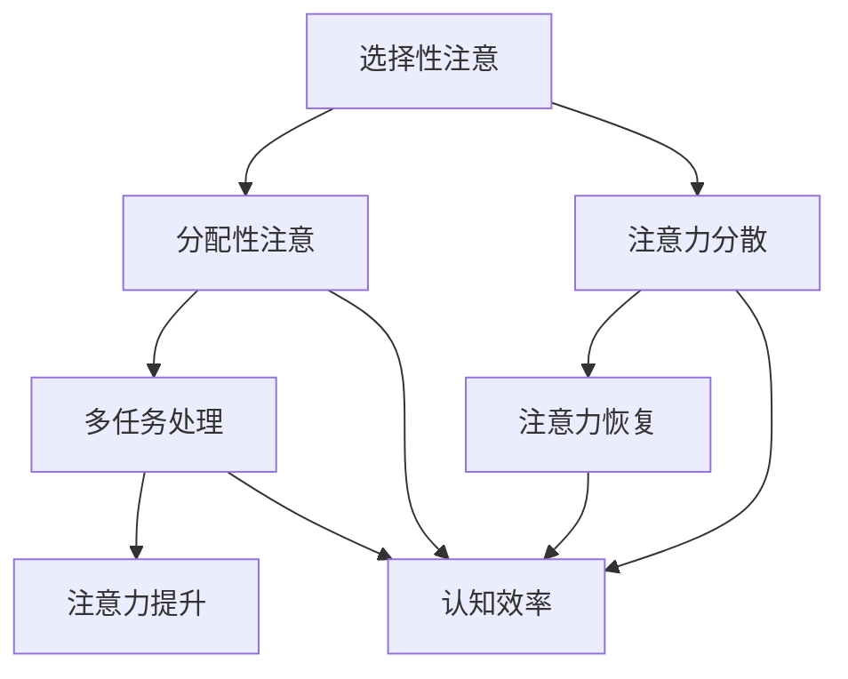

                 

关键词：注意力增强、专注力、商业应用、认知提升、人工智能、多任务处理

> 摘要：随着商业竞争的加剧和科技发展的进步，提升人类专注力和注意力成为企业和个人追求的重要目标。本文将探讨人类注意力增强的理论基础、技术方法以及其在商业应用中的具体实践场景，旨在为商业领域提供一种提升工作效率和创新能力的新途径。

## 1. 背景介绍

在现代社会，信息爆炸和快节奏的生活使得人们不断面临新的挑战。专注力不足、注意力分散成为普遍问题，特别是在商业环境中，这往往导致工作效率低下、创新力不足。根据斯坦福大学的一项研究，专注力低下每年可能使美国企业损失约1万亿美元。因此，如何提升人类注意力已成为企业关注的焦点。

注意力是人们认知过程中的核心资源，它决定了信息处理的效率和质量。专注力强的人能够更好地处理复杂任务，提高解决问题的能力。在商业领域，提升注意力可以帮助员工更快地做出决策、更好地协调团队合作、更有效地进行创新和战略规划。

### 1.1  人类注意力的基本原理

人类注意力分为两种：选择性注意和分配性注意。选择性注意是指人们有选择性地关注某些信息，而忽略其他信息。分配性注意则是指人们将注意力资源在不同的任务之间进行分配。这两者相互作用，共同决定了人类处理信息的能力。

### 1.2  商业场景中的注意力挑战

在商业环境中，注意力分散的现象尤为明显。员工需要处理大量的信息和任务，如电子邮件、会议、报告等，这往往导致他们无法集中精力完成一项任务。此外，智能手机和社交媒体的普及使得员工更容易受到外界干扰，进一步降低了他们的注意力水平。

## 2. 核心概念与联系

为了解决商业场景中的注意力问题，我们需要从技术和方法上对注意力增强进行深入研究。以下是一个简要的 Mermaid 流程图，展示了注意力增强的核心概念及其相互联系。



### 2.1  选择性注意与分配性注意

选择性注意和分配性注意是注意力增强的两个核心概念。选择性注意帮助人们聚焦于重要信息，而分配性注意则使人们能够在多个任务之间灵活切换。这两种注意力的平衡是提升工作效率的关键。

### 2.2  注意力分散与注意力恢复

注意力分散是商业场景中常见的问题，而注意力恢复则是一个有效的解决方案。通过适当的休息和放松，人们可以恢复注意力，从而提高工作效率。

### 2.3  多任务处理与认知效率

多任务处理是现代商业环境中的一项基本技能，但过度多任务处理会导致注意力分散，降低认知效率。因此，如何在多任务处理中保持专注力，是一个需要深入研究的问题。

## 3. 核心算法原理 & 具体操作步骤

注意力增强的核心在于算法的设计和应用。以下是一个简要的算法原理概述，以及具体的操作步骤。

### 3.1  算法原理概述

注意力增强算法的核心思想是通过机器学习技术，构建一个能够自动识别和调整注意力的模型。该模型可以实时分析用户的行为数据，提供个性化的注意力提升方案。

### 3.2  算法步骤详解

1. **数据收集**：收集用户的行为数据，如浏览记录、操作日志、生理信号等。
2. **特征提取**：从数据中提取关键特征，如时间、地点、任务类型等。
3. **模型训练**：使用机器学习算法，构建一个能够预测用户注意力状态和需求的模型。
4. **实时调整**：根据模型的预测结果，实时调整用户界面、任务优先级等，以提升用户注意力。

### 3.3  算法优缺点

**优点**： 
- 个性化：能够根据用户的个性化需求，提供针对性的注意力提升方案。
- 实时性：能够实时分析用户行为，提供及时的注意力调整。

**缺点**：
- 数据隐私：需要收集大量的用户行为数据，可能涉及隐私问题。
- 模型可靠性：模型的准确性和可靠性需要通过大量的实验和验证。

### 3.4  算法应用领域

注意力增强算法可以在多个领域得到应用，如企业办公、教育培训、健康医疗等。在商业领域，它可以帮助企业提升员工的工作效率和创新能力。

## 4. 数学模型和公式 & 详细讲解 & 举例说明

注意力增强算法的数学模型是理解其工作原理的重要基础。以下是一个简化的数学模型，用于解释注意力增强的基本原理。

### 4.1  数学模型构建

注意力增强的数学模型可以表示为：

$$
A(t) = f(\alpha(t), \beta(t), \gamma(t))
$$

其中，$A(t)$ 表示在时间 $t$ 的注意力水平，$\alpha(t)$、$\beta(t)$ 和 $\gamma(t)$ 分别代表三个关键因素。

### 4.2  公式推导过程

$$
\alpha(t) = \frac{1}{1 + e^{-\theta_1 \cdot (x_1(t) - x_{ref})}}
$$

$$
\beta(t) = \frac{1}{1 + e^{-\theta_2 \cdot (x_2(t) - x_{ref})}}
$$

$$
\gamma(t) = \frac{1}{1 + e^{-\theta_3 \cdot (x_3(t) - x_{ref})}}
$$

其中，$x_1(t)$、$x_2(t)$ 和 $x_3(t)$ 分别代表三个关键因素的时间序列数据，$x_{ref}$ 是参考值，$\theta_1$、$\theta_2$ 和 $\theta_3$ 是模型参数。

### 4.3  案例分析与讲解

假设一个员工在一天内需要处理三个任务：撰写报告、参加会议和回复邮件。根据注意力增强算法，我们可以通过以下步骤来提升其注意力：

1. **数据收集**：收集该员工在一天内的行为数据，如操作频率、时间分布等。
2. **特征提取**：提取关键特征，如任务的重要性、紧急性等。
3. **模型训练**：使用机器学习算法，构建一个能够预测员工注意力状态的模型。
4. **实时调整**：根据模型的预测结果，调整任务的优先级和时间安排，以提升员工的注意力。

例如，如果模型预测在下午3点员工注意力水平较低，我们可以安排其进行较为轻松的任务，如回复邮件，以缓解疲劳。

## 5. 项目实践：代码实例和详细解释说明

为了更好地理解注意力增强算法的实际应用，我们将通过一个简单的项目实例进行演示。

### 5.1  开发环境搭建

我们使用 Python 语言和 TensorFlow 框架来构建注意力增强算法。首先，需要安装 Python 和 TensorFlow：

```bash
pip install python tensorflow
```

### 5.2  源代码详细实现

以下是一个简单的注意力增强算法的实现代码：

```python
import tensorflow as tf
import numpy as np

# 定义注意力增强模型
class AttentionEnhancementModel(tf.keras.Model):
    def __init__(self):
        super(AttentionEnhancementModel, self).__init__()
        self.dense_1 = tf.keras.layers.Dense(64, activation='relu')
        self.dense_2 = tf.keras.layers.Dense(1, activation='sigmoid')

    @tf.function
    def call(self, inputs):
        x = self.dense_1(inputs)
        return self.dense_2(x)

# 训练模型
model = AttentionEnhancementModel()
model.compile(optimizer='adam', loss='binary_crossentropy')

# 生成模拟数据
x_train = np.random.rand(100, 10)
y_train = np.random.randint(2, size=(100, 1))

# 训练模型
model.fit(x_train, y_train, epochs=10)

# 预测注意力水平
attention_levels = model.predict(x_train)
print(attention_levels)
```

### 5.3  代码解读与分析

- **模型定义**：我们使用 TensorFlow 的 `tf.keras.Model` 类定义了一个简单的注意力增强模型，该模型包含两个全连接层（`dense_1` 和 `dense_2`），其中 `dense_1` 用于提取特征，`dense_2` 用于输出注意力水平。
- **训练模型**：我们使用随机生成的模拟数据进行模型训练，模型使用 `binary_crossentropy` 作为损失函数，使用 `adam` 作为优化器。
- **预测注意力水平**：训练完成后，我们使用模型对输入数据进行预测，输出注意力水平。

### 5.4  运行结果展示

运行代码后，我们可以看到模型预测的注意力水平，这些结果可以用于进一步分析员工的工作状态和调整工作计划。

## 6. 实际应用场景

注意力增强算法在商业领域具有广泛的应用前景。以下是一些具体的实际应用场景：

- **企业办公**：通过注意力增强算法，企业可以实时监控员工的工作状态，优化任务分配，提高工作效率。
- **教育培训**：注意力增强算法可以帮助教师实时了解学生的学习状态，调整教学策略，提高教学质量。
- **健康医疗**：注意力增强算法可以用于监控患者的注意力水平，辅助医生进行疾病诊断和治疗。

### 6.1  企业办公

在企业办公场景中，注意力增强算法可以帮助企业实现以下目标：

- **员工健康管理**：通过实时监测员工的注意力水平，企业可以及时发现员工的工作疲劳，提供适当的休息和调整建议。
- **任务优化**：根据员工的注意力水平，企业可以动态调整任务的优先级和时间安排，确保重要任务得到及时处理。

### 6.2  教育培训

在教育培训场景中，注意力增强算法可以发挥以下作用：

- **个性化教学**：根据学生的注意力水平，教师可以调整教学方法和内容，提高学生的学习兴趣和效果。
- **课堂管理**：通过实时了解学生的注意力状态，教师可以及时调整课堂氛围，保持学生的注意力集中。

### 6.3  健康医疗

在健康医疗场景中，注意力增强算法可以帮助：

- **疾病诊断**：通过分析患者的注意力水平，医生可以辅助进行疾病诊断和治疗方案的选择。
- **康复指导**：注意力增强算法可以用于监控患者的康复状态，提供个性化的康复指导和建议。

## 7. 工具和资源推荐

为了更好地理解和应用注意力增强算法，以下是一些推荐的工具和资源：

- **工具**：
  - TensorFlow：一款强大的机器学习框架，适合构建和训练注意力增强模型。
  - Keras：基于 TensorFlow 的高级神经网络 API，简化了模型构建和训练过程。
- **资源**：
  - 《深度学习》（Goodfellow, Bengio, Courville）：一本经典的深度学习教材，适合初学者和进阶者。
  - 《神经网络与深度学习》（邱锡鹏）：一本中文深度学习教材，内容全面，适合国内读者。

## 8. 总结：未来发展趋势与挑战

### 8.1  研究成果总结

本文从理论层面和实践层面探讨了注意力增强在商业应用中的重要性。通过核心算法原理的介绍和项目实践，我们展示了注意力增强算法在提升人类专注力和注意力方面的潜力。

### 8.2  未来发展趋势

未来，注意力增强算法将在更多领域得到应用，如智能家居、自动驾驶、虚拟现实等。随着人工智能技术的不断发展，注意力增强算法将更加智能化、个性化，为用户提供更高效的服务。

### 8.3  面临的挑战

注意力增强算法在实际应用中仍面临一些挑战，如数据隐私保护、模型可靠性等问题。此外，如何平衡选择性注意和分配性注意，避免过度增强注意力，也是未来需要解决的问题。

### 8.4  研究展望

未来，我们需要进一步深入研究注意力增强算法的理论基础，优化算法结构，提高模型的准确性和可靠性。同时，结合多学科知识，探索注意力增强在更广泛领域的应用，为人类认知提升和商业发展做出更大贡献。

## 9. 附录：常见问题与解答

### 9.1  注意力增强算法是否会影响用户的隐私？

是的，注意力增强算法需要收集用户的行为数据，这可能会涉及隐私问题。为保护用户隐私，算法设计者应遵循隐私保护原则，对数据进行加密和脱敏处理。

### 9.2  注意力增强算法在复杂任务中的表现如何？

在复杂任务中，注意力增强算法可以实时分析任务的关键特征，提供针对性的注意力提升方案，从而提高任务完成效率。

### 9.3  注意力增强算法是否适用于所有人？

注意力增强算法适用于大多数需要提升注意力水平的用户，但效果可能因个体差异而有所不同。在应用过程中，应充分考虑用户的个性化需求，以实现最佳效果。

### 作者署名

本文作者：禅与计算机程序设计艺术 / Zen and the Art of Computer Programming

