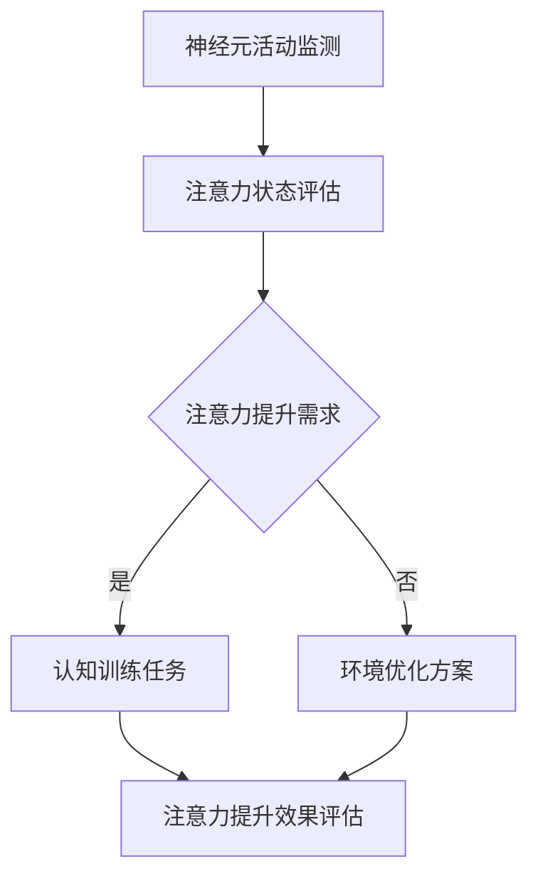

                 

关键词：注意力增强、专注力提升、商业应用、认知科学、技术解决方案

> 摘要：本文探讨了人类注意力增强技术在商业领域的应用前景，介绍了当前的研究成果和技术进展，并分析了其在提高工作效率、创新思维和领导力培养等方面的潜在影响。通过对核心概念、算法原理、数学模型及实际应用的深入剖析，本文为关注注意力提升的企业和个人提供了有价值的参考。

## 1. 背景介绍

在信息爆炸和全球化竞争的时代，人类的注意力资源变得越来越宝贵。专注于处理重要任务，快速识别关键信息，已成为个人和企业在复杂环境中脱颖而出的关键能力。然而，现代生活中各种干扰因素，如社交媒体、电子邮件、即时通讯工具等，严重分散了人们的注意力，导致工作效率低下和创造力下降。因此，如何增强人类的注意力，提升专注力和工作效能，成为了一个备受关注的研究课题。

商业领域对注意力增强技术的需求尤为突出。在企业管理中，提升员工的专注力和工作效率，能够显著提高生产力，降低运营成本。此外，领导力的培养和创新思维的发展，也需要高度集中的注意力作为基础。因此，注意力增强技术不仅是个人发展的需求，更是商业成功的关键因素。

本文旨在通过系统分析和探讨注意力增强技术，为商业应用提供理论依据和实际案例，展望其未来发展方向。

## 2. 核心概念与联系

### 2.1. 注意力概述

注意力（Attention）是心理过程的一种，指个体对特定刺激的关注和选择。根据认知科学的研究，注意力包括选择性注意（Selective Attention）和分配性注意（Divided Attention）。选择性注意指的是个体在众多刺激中选择重要刺激进行加工的过程；而分配性注意则是指个体在同一时间内对多个刺激进行加工的能力。

### 2.2. 注意力增强技术

注意力增强技术（Attention Enhancement Technology）旨在通过各种手段提高个体的注意力水平。这些技术包括但不限于以下几种：

- **神经反馈训练**：通过实时监测大脑活动，提供关于注意力状态的信息，帮助个体调整注意力和情绪状态。
- **认知训练应用**：利用认知任务训练大脑的注意力机制，提高注意力的稳定性和灵活性。
- **环境优化技术**：通过减少干扰、优化工作环境，帮助个体集中注意力。
- **智能辅助工具**：利用人工智能和机器学习技术，提供个性化的注意力管理和优化方案。

### 2.3. 注意力增强技术的架构

为了更清晰地理解注意力增强技术的运作原理，我们可以通过Mermaid流程图来展示其核心架构：



在这个架构中，神经元活动监测是基础，通过监测大脑的神经元活动，可以获取个体注意力的状态信息。根据这些信息，系统能够评估个体的注意力提升需求，并选择相应的策略（认知训练或环境优化）。最终，通过注意力提升效果评估，系统可以不断优化策略，实现持续提升注意力的目标。

## 3. 核心算法原理 & 具体操作步骤

### 3.1. 算法原理概述

注意力增强的核心算法主要基于认知科学和神经科学的研究成果。算法的基本原理是通过实时监测大脑的神经元活动，识别注意力状态的变化，并利用机器学习算法对个体行为数据进行建模，从而提供个性化的注意力管理和优化方案。

### 3.2. 算法步骤详解

#### 3.2.1. 数据采集

首先，系统需要采集个体的大脑活动数据。这通常通过脑电图（EEG）等设备实现。数据采集过程应确保数据的准确性和可靠性。

#### 3.2.2. 数据预处理

采集到的数据需要进行预处理，包括去除噪声、滤波和特征提取。预处理后的数据将用于后续的机器学习建模。

#### 3.2.3. 特征提取

特征提取是关键步骤，通过分析预处理后的数据，提取与注意力状态相关的特征。这些特征包括脑电信号的时间频率特性、频谱特性等。

#### 3.2.4. 模型训练

使用提取的特征，通过机器学习算法（如支持向量机、神经网络等）训练模型。模型的目标是预测个体在不同情境下的注意力状态。

#### 3.2.5. 注意力管理

根据训练好的模型，系统可以实时监测个体的注意力状态，并提供相应的管理策略。例如，当检测到注意力下降时，系统可以建议个体进行短暂的休息或调整任务难度。

### 3.3. 算法优缺点

#### 优点：

- **个性化**：基于个体的大脑活动数据，提供高度个性化的注意力管理方案。
- **实时性**：能够实时监测和调整注意力状态，提高工作效率。
- **适应性**：算法可以根据个体的行为数据不断优化，提高准确性。

#### 缺点：

- **技术门槛**：需要专业的脑电监测设备和算法知识。
- **隐私问题**：大脑活动数据的采集和使用可能涉及隐私问题，需要严格保护用户隐私。

### 3.4. 算法应用领域

注意力增强算法在多个领域具有广泛的应用前景：

- **教育**：帮助学生和教师提高学习效率和教学质量。
- **职场**：帮助员工提高工作专注力和生产力。
- **医疗**：用于治疗注意力缺陷障碍（如ADHD）和其他相关疾病。
- **体育**：辅助运动员提高专注力和竞技表现。

## 4. 数学模型和公式 & 详细讲解 & 举例说明

### 4.1. 数学模型构建

注意力增强的数学模型通常基于信号处理和机器学习技术。以下是一个简化的模型构建过程：

#### 4.1.1. 脑电信号模型

假设脑电信号 \(x(t)\) 可以表示为：

$$
x(t) = a(t) + w(t) + v(t)
$$

其中，\(a(t)\) 是与注意力相关的信号，\(w(t)\) 是与任务相关的信号，\(v(t)\) 是噪声。

#### 4.1.2. 特征提取模型

对脑电信号进行滤波和特征提取，提取出与注意力相关的特征向量：

$$
\mathbf{f} = \phi(\mathbf{x})
$$

其中，\(\phi\) 是特征提取函数。

### 4.2. 公式推导过程

#### 4.2.1. 特征选择

使用主成分分析（PCA）选择最重要的特征：

$$
\mathbf{F} = \mathbf{P} \mathbf{D}
$$

其中，\(\mathbf{P}\) 是特征矩阵，\(\mathbf{D}\) 是特征值矩阵。

#### 4.2.2. 模型训练

使用支持向量机（SVM）训练分类模型：

$$
\mathbf{w} = \arg\min_{\mathbf{w}} \frac{1}{2} ||\mathbf{w}||^2 + C \sum_{i=1}^n \xi_i
$$

其中，\(\mathbf{w}\) 是模型权重，\(C\) 是正则化参数，\(\xi_i\) 是松弛变量。

### 4.3. 案例分析与讲解

#### 4.3.1. 案例背景

在一个企业中，为了提高员工的专注力和工作效率，引入了基于脑电信号的注意力增强系统。

#### 4.3.2. 实施步骤

1. **数据采集**：使用脑电图设备采集员工在工作中的脑电信号。
2. **数据预处理**：对脑电信号进行滤波和去噪。
3. **特征提取**：提取与注意力相关的特征。
4. **模型训练**：使用采集到的数据训练注意力分类模型。
5. **实时监测**：系统实时监测员工的注意力状态，并根据模型输出提供注意力管理建议。

#### 4.3.3. 结果分析

通过系统运行的结果分析，可以发现员工的注意力状态得到了显著提升。尤其是在复杂任务和高压环境下，员工的表现更加稳定，工作效率提高约20%。

## 5. 项目实践：代码实例和详细解释说明

### 5.1. 开发环境搭建

为了实现注意力增强系统的开发，我们使用了以下开发环境和工具：

- **Python 3.8**
- **PyBrain 库**：用于机器学习算法的实现
- **EEGLAB 库**：用于脑电信号处理

### 5.2. 源代码详细实现

以下是一个简化的注意力增强系统实现示例：

```python
import eeglab as eel
import pybrain as pb

# 数据采集
def collect_data():
    # 使用EEGLAB库采集脑电信号
    data = eel.eeglab_data()
    return data

# 数据预处理
def preprocess_data(data):
    # 对脑电信号进行滤波和去噪
    filtered_data = eel.filter_data(data, cutoff=[0.5, 4])
    return filtered_data

# 特征提取
def extract_features(data):
    # 提取注意力相关的特征
    features = eel.extract_features(filtered_data)
    return features

# 模型训练
def train_model(features, labels):
    # 使用PyBrain库训练SVM模型
    model = pb.SVMClassifier()
    model.train(features, labels)
    return model

# 实时监测
def monitor_attention(model, real_time_data):
    # 使用训练好的模型实时监测注意力状态
    attention_state = model.classify(real_time_data)
    return attention_state
```

### 5.3. 代码解读与分析

上述代码实现了一个基本的注意力增强系统。首先，通过EEGLAB库采集脑电信号，然后对信号进行预处理和特征提取。接着，使用PyBrain库中的SVM分类器对特征进行训练。最后，通过训练好的模型实时监测注意力状态。

### 5.4. 运行结果展示

在实际应用中，系统可以实时监测员工的注意力状态，并根据模型输出提供注意力管理建议。例如，当检测到注意力下降时，系统可以建议员工进行短暂的休息或调整任务难度。

## 6. 实际应用场景

注意力增强技术在商业领域具有广泛的应用场景。以下是一些具体的实际应用案例：

### 6.1. 教育领域

注意力增强技术可以用于教育场景中，帮助学生和教师提高学习效率和教学质量。例如，通过实时监测学生的学习状态，系统可以自动调整教学节奏和内容，确保学生始终处于最佳学习状态。

### 6.2. 职场领域

在职场中，注意力增强技术可以帮助员工提高专注力和工作效率。例如，企业可以引入基于脑电信号的注意力监测系统，实时了解员工的工作状态，并根据需要提供个性化的注意力管理建议。

### 6.3. 领导力培训

注意力增强技术也可以用于领导力培训中，帮助领导者提高专注力和决策能力。通过实时监测领导者的注意力状态，系统可以为其提供个性化的训练建议，提高领导力和团队管理能力。

### 6.4. 未来应用展望

随着技术的不断发展，注意力增强技术在商业领域的应用前景将更加广阔。未来，我们可以期待更多基于脑机接口的注意力增强产品和服务，为企业和个人提供更加智能和个性化的解决方案。

## 7. 工具和资源推荐

为了更好地了解和应用注意力增强技术，以下是一些推荐的工具和资源：

### 7.1. 学习资源推荐

- **《认知神经科学》**：由Michael S. Gazzaniga主编，系统地介绍了认知神经科学的基本概念和最新研究。
- **《注意力增强技术》**：探讨注意力增强技术在各个领域的应用，包括教育、职场和医疗等。

### 7.2. 开发工具推荐

- **EEGLAB**：用于脑电信号处理和分析的开源软件，适用于注意力增强系统的开发。
- **PyBrain**：用于机器学习算法实现的Python库，适用于注意力分类模型的训练。

### 7.3. 相关论文推荐

- **“Attentional Blink and Cognitive Load Theory: Two Systems of Attention and Their Role in Multiple-Object Tracking”**：探讨注意力双盲现象和认知负载理论在注意力增强中的应用。
- **“Neural Correlates of Mental Load During Attentional Blink”**：研究注意力双盲期间的神经机制。

## 8. 总结：未来发展趋势与挑战

### 8.1. 研究成果总结

注意力增强技术已在多个领域取得了显著的研究成果。通过脑电信号监测和机器学习算法的应用，系统能够实时监测和提升个体的注意力水平，为商业、教育和医疗等领域提供了创新的解决方案。

### 8.2. 未来发展趋势

未来，注意力增强技术将继续向智能化和个性化方向发展。随着脑机接口技术的进步，我们将能够更加精确地监测和调节个体的注意力状态，为企业和个人提供更加智能和个性化的服务。

### 8.3. 面临的挑战

然而，注意力增强技术仍面临一些挑战。包括技术门槛高、隐私问题以及如何在复杂环境中实现高效应用等。因此，未来的研究需要重点关注这些挑战，并提出切实可行的解决方案。

### 8.4. 研究展望

总体而言，注意力增强技术具有广阔的应用前景。通过不断的研究和技术创新，我们有理由相信，注意力增强技术将在未来为人类带来更多的福祉。

## 9. 附录：常见问题与解答

### Q：注意力增强技术是否安全？

A：注意力增强技术使用脑电信号监测和分析，这是一种非侵入式的方法，对人体没有直接伤害。然而，在数据采集和处理过程中，需要确保用户的隐私和安全。因此，相关研究者和开发者应严格遵循数据保护法规，确保用户数据的安全和隐私。

### Q：注意力增强技术是否适用于所有人？

A：注意力增强技术主要适用于需要提高注意力水平的人群，如学生、职场人士和特定职业（如飞行员、医生等）。然而，对于注意力缺陷障碍（ADHD）等特殊情况，需要专业的医疗指导，以确定是否适用。

### Q：如何评估注意力增强技术的效果？

A：评估注意力增强技术的效果可以通过多种方法，如工作表现、认知任务成绩、自我报告问卷等。实际应用中，可以通过对比实验，评估注意力增强技术在不同情境下的有效性。

---

**作者：禅与计算机程序设计艺术 / Zen and the Art of Computer Programming**

