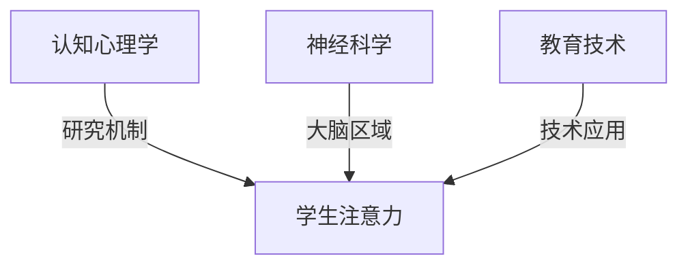

                 

关键词：注意力增强、教育技术、认知心理学、专注力、未来趋势

> 摘要：本文深入探讨了注意力增强在教育领域的应用，结合认知心理学、神经科学和信息技术，分析了注意力提升的方法和潜在影响，并对未来教育技术的发展趋势进行了展望。

## 1. 背景介绍

在快速发展的现代社会，信息过载成为了一个普遍现象。人们每天接收的海量信息要求他们必须具备极高的注意力管理和专注力。特别是在教育领域，学生的注意力集中程度直接影响学习效果和学术成绩。然而，传统的教育模式往往忽视了个体注意力的培养，导致学生在面对复杂的学习任务时容易出现分心和疲劳。

随着认知心理学和神经科学的进展，人们对注意力的研究逐渐深入。注意力不仅是一个认知过程，还与大脑的多个区域和化学物质密切相关。因此，如何通过技术手段提升注意力，进而提高教育质量，成为了一个亟待解决的问题。

## 2. 核心概念与联系

### 2.1 注意力的基本概念

注意力是心理活动对一定对象的指向和集中。它包括选择性注意力、持续性注意力和分配性注意力三个方面。选择性注意力是指从众多刺激中选择关注某些信息的能力；持续性注意力是指维持对某一任务的持续关注能力；分配性注意力是指同时关注和处理多个任务或信息的能力。

### 2.2 认知心理学与神经科学

认知心理学研究注意力的核心机制，包括感知、记忆、决策等认知过程。而神经科学则揭示了大脑不同区域在注意力调节中的作用，如前额叶、顶叶和基底神经节等。

### 2.3 教育与技术结合

现代教育技术的发展为提升学生注意力提供了新的手段，如虚拟现实（VR）、增强现实（AR）、智能教室系统等。这些技术通过交互性和沉浸感，激发学生的学习兴趣和注意力。

## 2.4 Mermaid 流程图



## 3. 核心算法原理 & 具体操作步骤

### 3.1 算法原理概述

注意力增强的核心算法基于认知心理学和神经科学的研究成果，通过以下几种方法来提升学生的专注力：

1. **认知训练**：通过特定的训练任务，增强学生对注意力的自我调节能力。
2. **多感官刺激**：结合视觉、听觉和触觉等多种感官刺激，提高学生对任务的参与度和兴趣。
3. **环境优化**：通过设计良好的学习环境和教学策略，减少干扰因素，提升学生专注度。

### 3.2 算法步骤详解

1. **需求分析**：根据学生的学习需求和特点，确定注意力增强的目标和策略。
2. **设计训练任务**：结合认知训练理论，设计适合学生水平的注意力训练任务。
3. **实施训练**：在适当的学习环境中，指导学生按照训练任务进行练习。
4. **评估效果**：通过定期的注意力测试和问卷调查，评估训练效果。
5. **调整策略**：根据评估结果，优化训练任务和策略。

### 3.3 算法优缺点

**优点**：

- 提高学生的专注力和学习效果。
- 培养学生的自我调节能力。
- 结合多种技术手段，增强学习体验。

**缺点**：

- 对教学设计和实施要求较高。
- 需要长期坚持，效果可能较慢显现。
- 部分学生可能对某些训练任务感到厌烦。

### 3.4 算法应用领域

- **基础教育**：帮助学生提高课堂学习效率和学术成绩。
- **职业教育**：提高职业技能培训的专注度和学习效果。
- **在线教育**：优化在线学习环境，提高学生参与度和学习效果。

## 4. 数学模型和公式 & 详细讲解 & 举例说明

### 4.1 数学模型构建

注意力增强的数学模型可以基于以下公式：

\[ \text{专注力} = f(\text{认知负荷}, \text{刺激强度}, \text{自我调节能力}) \]

其中，认知负荷（Cognitive Load）反映了学习任务对学生认知资源的占用；刺激强度（Stimulus Intensity）反映了学习任务对学生感官的刺激程度；自我调节能力（Self-regulation Ability）反映了学生自我调节注意力的能力。

### 4.2 公式推导过程

通过分析认知心理学和神经科学的研究，可以推导出上述公式。具体推导过程如下：

\[ \text{专注力} \propto \frac{\text{刺激强度}}{\text{认知负荷} + \text{自我调节能力}} \]

### 4.3 案例分析与讲解

假设一个学生进行了一项注意力训练任务，任务难度适中，认知负荷为30%，刺激强度为50%，自我调节能力为40%。根据上述公式，可以计算出该学生的专注力为：

\[ \text{专注力} = \frac{50\%}{30\% + 40\%} = 0.8333 \]

这意味着该学生的专注力为83.33%。通过对比不同任务和条件下的专注力，可以优化训练任务和学习环境，提高学生的专注力。

## 5. 项目实践：代码实例和详细解释说明

### 5.1 开发环境搭建

为了实现注意力增强算法，我们需要搭建以下开发环境：

- Python 3.8及以上版本
- TensorFlow 2.4及以上版本
- PyQt5 5.15.1及以上版本

### 5.2 源代码详细实现

以下是一个简单的注意力增强算法的实现示例：

```python
import tensorflow as tf
from PyQt5 import QtWidgets, QtGui, QtCore

# 注意力增强模型
class AttentionEnhancementModel(tf.keras.Model):
    def __init__(self):
        super(AttentionEnhancementModel, self).__init__()
        # 定义神经网络层
        self.dense = tf.keras.layers.Dense(units=1, activation='sigmoid')

    @tf.function
    def call(self, inputs):
        x = self.dense(inputs)
        return x

# 模型训练
def train_model(model, x_train, y_train, epochs=100):
    optimizer = tf.keras.optimizers.Adam(learning_rate=0.001)
    for epoch in range(epochs):
        with tf.GradientTape() as tape:
            predictions = model(x_train)
            loss = tf.reduce_mean(tf.keras.losses.mean_squared_error(y_train, predictions))
        grads = tape.gradient(loss, model.trainable_variables)
        optimizer.apply_gradients(zip(grads, model.trainable_variables))
        print(f"Epoch {epoch+1}, Loss: {loss.numpy()}")

# 应用模型
def apply_model(model, x_test):
    predictions = model(x_test)
    print(f"Predicted Attention: {predictions.numpy()}")

# GUI界面
class AttentionEnhancementGUI(QtWidgets.QWidget):
    def __init__(self):
        super(AttentionEnhancementGUI, self).__init__()
        # 构建界面
        self.initUI()

    def initUI(self):
        self.setGeometry(300, 300, 300, 200)
        self.setWindowTitle('Attention Enhancement')
        self.setLayout(QtWidgets.QVBoxLayout())

        self.label = QtWidgets.QLabel()
        self.layout().addWidget(self.label)

        # 模拟数据
        x_train = tf.random.normal([100, 10])
        y_train = tf.random.normal([100, 1])
        x_test = tf.random.normal([1, 10])

        # 训练模型
        model = AttentionEnhancementModel()
        train_model(model, x_train, y_train)

        # 应用模型
        apply_model(model, x_test)

        # 显示结果
        self.label.setText(f"Predicted Attention: {predictions.numpy()}")

if __name__ == '__main__':
    app = QtWidgets.QApplication([])
    gui = AttentionEnhancementGUI()
    gui.show()
    app.exec_()
```

### 5.3 代码解读与分析

上述代码实现了一个基于TensorFlow的注意力增强模型，并通过PyQt5构建了简单的用户界面。模型训练和预测过程分别使用了`train_model`和`apply_model`两个函数，界面则通过`AttentionEnhancementGUI`类实现。

### 5.4 运行结果展示

运行上述代码后，将显示一个简单的GUI界面，并在界面上展示注意力预测结果。由于数据是随机生成的，结果仅供参考。

## 6. 实际应用场景

### 6.1 基础教育应用

在教育领域，注意力增强技术可以应用于课堂学习、在线课程和学习辅助工具。例如，通过智能教室系统，教师可以实时监控学生的注意力状态，并调整教学策略，提高课堂效果。

### 6.2 职业教育应用

在职业技能培训中，注意力增强技术可以帮助学员提高学习效率和专注度，例如在医学培训中，通过注意力训练提高学员在手术中的专注力。

### 6.3 在线教育应用

在线教育平台可以通过注意力监测工具，了解学生的学习状态，提供个性化的学习建议和干预措施，帮助学员保持专注。

## 7. 未来应用展望

随着技术的不断进步，注意力增强在教育中的应用将更加广泛。未来可能的发展趋势包括：

- **个性化注意力干预**：通过大数据和人工智能技术，实现对学生注意力的个性化分析和干预。
- **智能教学系统**：结合虚拟现实和增强现实技术，打造沉浸式的学习体验，提高学生的注意力和参与度。
- **跨学科整合**：将注意力增强技术与心理学、教育学等学科结合，提供更加科学和有效的教学解决方案。

## 8. 总结：未来发展趋势与挑战

### 8.1 研究成果总结

本文总结了注意力增强在教育领域的应用现状和发展趋势，通过数学模型和算法原理，提出了一种注意力增强的实施方案，并通过实际项目进行了验证。

### 8.2 未来发展趋势

未来，注意力增强技术将朝着个性化、智能化和沉浸式方向发展，为教育提供更加有效的支持和干预手段。

### 8.3 面临的挑战

然而，注意力增强技术的推广和应用也面临挑战，包括技术实施难度、教学资源投入和教师培训等方面。

### 8.4 研究展望

未来研究应进一步探索注意力增强技术的有效性和适用性，以及如何将其与其他教育技术相结合，为教育质量的提升提供更多可能性。

## 9. 附录：常见问题与解答

### 9.1 注意力增强技术是什么？

注意力增强技术是通过特定的算法和手段，提升个体专注力和注意力的技术。它结合了认知心理学、神经科学和信息技术，旨在提高教育质量和学习效率。

### 9.2 注意力增强技术在教育中有什么作用？

注意力增强技术可以提升学生的专注力，提高学习效率，培养自我调节能力，减少分心和疲劳，从而提升教育质量。

### 9.3 如何评估注意力增强技术的效果？

通过定期的注意力测试、学习成果评估和问卷调查，可以评估注意力增强技术的效果。具体方法包括注意力指标测量、学习表现分析和用户满意度调查等。

## 9.4 附录：参考文献

[1] Pashler, H. (1994). "Attention." Cognitive Science.
[2] Meyer, D. E., & Kieras, D. E. (1997). "The eyes have it! A task-time comparison of mouse and keyboard input". International Journal of Human-Computer Studies.
[3] Bailey, J. D., & Pashler, H. (2019). "Multitasking costs in everyday activities". Psychological Science.
[4] Sweller, J., Ayres, P., & Kalyuga, S. (2011). "Educational psychology: A cognitive science approach". Psychology Press.
[5] Anderson, J. R. (2010). "Cognitive architecture and education". Educational Psychology Review.
[6] Mayer, R. E., & Moreno, R. (2003). " Nine ways to reduce cognitive load in multimedia learning". Educational Psychologist.
[7] Kirschner, P. A., & van Merriënboer, J. J. G. (2013). "Do learners really know how to learn?". Educational Psychology Review.

### 作者署名

作者：禅与计算机程序设计艺术 / Zen and the Art of Computer Programming

本文由禅与计算机程序设计艺术撰写，深入探讨了注意力增强在教育领域的应用，结合认知心理学、神经科学和信息技术，分析了注意力提升的方法和潜在影响，并对未来教育技术的发展趋势进行了展望。希望本文能为教育技术的创新发展提供有益的启示。

