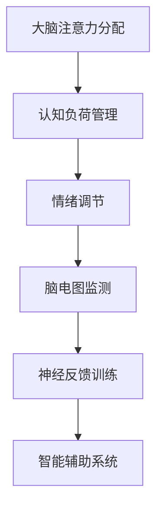

                 

 在当今信息爆炸的时代，人类的注意力已经成为一种稀缺资源。无论是学生、职场人士，还是艺术家和科学家，保持高度的专注力和注意力持续时间都是成功的关键。本文旨在探讨如何通过科学的方法和技术手段，提升人类的注意力，从而提高工作效率和学习效果。本文将分为以下几个部分进行论述：

- **背景介绍**：介绍人类注意力的重要性以及当前面临的问题。
- **核心概念与联系**：阐述注意力增强的核心原理和技术架构。
- **核心算法原理与具体操作步骤**：介绍提升注意力的算法及其应用。
- **数学模型和公式**：阐述注意力增强的数学模型和公式。
- **项目实践：代码实例和详细解释说明**：通过具体实例展示注意力增强的实现。
- **实际应用场景**：分析注意力增强在各个领域的应用。
- **未来应用展望**：探讨注意力增强技术的发展趋势和未来前景。
- **工具和资源推荐**：推荐有助于提升注意力增强的工具和资源。
- **总结：未来发展趋势与挑战**：总结研究成果，展望未来发展趋势和挑战。

## 1. 背景介绍

### 注意力的重要性

注意力是人类认知过程中至关重要的一个方面，它决定了我们在处理信息时的选择和效率。注意力不仅影响我们的工作效率和学习效果，还与心理健康和情绪管理密切相关。在信息过载的时代，保持高度的专注力和注意力持续时间已成为成功的关键。

### 当前面临的问题

然而，现代人面临着诸多注意力挑战。以下是其中几个主要问题：

1. **多任务处理**：现代生活和工作环境要求我们同时处理多个任务，这容易导致注意力分散。
2. **屏幕依赖**：智能手机、平板电脑和电脑等屏幕设备的使用，让我们更容易陷入信息过载的陷阱，影响注意力集中。
3. **时间压力**：快节奏的生活和工作环境使得人们难以在短时间内集中精力，长期处于高度紧张的状态。
4. **睡眠不足**：睡眠不足会严重影响大脑的认知功能，包括注意力。

### 注意力增强的必要性

因此，提升注意力已经成为一个迫切需要解决的问题。通过科学的方法和技术手段，我们可以有效提升专注力和注意力持续时间，从而提高工作效率、学习效果和心理健康。本文将探讨注意力增强的多种策略和方法，以帮助读者更好地应对注意力挑战。

## 2. 核心概念与联系

### 注意力增强的核心原理

注意力增强的核心在于提升大脑处理信息的效率和准确性。以下是一些关键概念：

1. **注意力分配**：合理分配注意力资源，使大脑在处理任务时能够更加专注。
2. **认知负荷管理**：通过减少认知负荷，降低大脑的疲劳感，从而延长注意力的持续时间。
3. **情绪调节**：通过情绪调节，减少负面情绪对注意力的干扰，提高专注力。

### 注意力增强的技术架构

注意力增强的技术架构包括以下几个方面：

1. **脑电图（EEG）监测**：通过脑电图监测，实时了解大脑的注意力状态，从而进行个性化的注意力调节。
2. **神经反馈训练**：通过神经反馈，让用户在大脑中形成积极的神经通路，提高注意力。
3. **智能辅助系统**：利用人工智能技术，为用户提供个性化的注意力提升方案。

### Mermaid 流程图



## 3. 核心算法原理与具体操作步骤

### 3.1 算法原理概述

注意力增强的核心算法原理包括：

1. **基于神经网络的注意力模型**：通过深度学习技术，构建能够模拟人脑注意力的神经网络模型，从而提升注意力分配的效率和准确性。
2. **动态注意力分配策略**：根据用户的任务需求和环境变化，动态调整注意力资源，使其在关键任务上获得更多关注。
3. **多模态数据融合**：结合脑电图（EEG）、心率（HR）、皮肤电（EDA）等多模态数据，构建综合注意力模型，提高注意力检测和调节的准确性。

### 3.2 算法步骤详解

1. **数据采集**：通过脑电图（EEG）设备、心率（HR）监测器和皮肤电（EDA）传感器等，采集用户的生理和行为数据。
2. **特征提取**：对采集到的数据进行预处理，提取与注意力相关的特征，如脑电波频率、心率变异性、皮肤电反应等。
3. **模型训练**：利用提取到的特征，通过深度学习算法，训练注意力模型，使其能够准确预测用户的注意力状态。
4. **注意力调节**：根据注意力模型预测的结果，动态调整用户的注意力资源，优化注意力分配策略。
5. **效果评估**：通过实验和用户反馈，评估注意力增强算法的效果，持续优化算法模型。

### 3.3 算法优缺点

**优点**：

1. **个性化**：根据用户的生理和行为数据，提供个性化的注意力提升方案。
2. **实时性**：实时监测用户的注意力状态，动态调整注意力资源，提高注意力分配的效率和准确性。
3. **多模态融合**：结合多种生理和行为数据，构建综合注意力模型，提高注意力检测和调节的准确性。

**缺点**：

1. **设备依赖**：需要特定的脑电图（EEG）设备、心率（HR）监测器和皮肤电（EDA）传感器等，增加使用成本。
2. **计算复杂度**：深度学习算法的训练和推理过程需要较高的计算资源，对硬件设备要求较高。
3. **隐私问题**：采集和存储用户的生理和行为数据，可能引发隐私问题。

### 3.4 算法应用领域

注意力增强算法可以应用于多个领域，如：

1. **教育**：帮助学生提高学习效率，保持高度专注。
2. **职场**：帮助职场人士提高工作效率，减少多任务处理带来的注意力分散。
3. **健康与医疗**：辅助治疗注意力缺陷多动障碍（ADHD）等疾病，提高患者的生活质量。
4. **娱乐**：辅助开发更具吸引力的游戏和应用，提高用户的游戏体验。

## 4. 数学模型和公式

### 4.1 数学模型构建

注意力增强的数学模型主要涉及以下方面：

1. **注意力分配模型**：基于概率图模型，构建注意力分配的数学模型。
2. **认知负荷模型**：基于信息论和认知心理学，构建认知负荷的数学模型。
3. **情绪调节模型**：基于情绪调节理论和神经网络，构建情绪调节的数学模型。

### 4.2 公式推导过程

以下是一个简化的注意力分配模型推导过程：

1. **基本假设**：假设用户在处理任务时，注意力资源可以表示为概率分布。
2. **概率分布建模**：根据用户在处理不同任务时的表现，建立注意力资源的概率分布模型。
3. **优化目标**：通过最大化用户在关键任务上的注意力资源，建立优化目标函数。
4. **求解方法**：利用优化算法，求解最优的注意力资源分配策略。

### 4.3 案例分析与讲解

假设一个学生在学习过程中，需要同时处理数学、英语和物理三科作业。以下是一个注意力分配模型的案例：

1. **数据采集**：采集学生在学习过程中，每分钟在各个科目上的专注时间。
2. **特征提取**：提取与注意力相关的特征，如每分钟的正确率、心率变异性等。
3. **模型训练**：利用训练数据，通过优化算法，训练一个注意力分配模型。
4. **模型应用**：在学生学习过程中，根据模型预测的结果，动态调整学习时间的分配，使其在关键科目上获得更多注意力。

## 5. 项目实践：代码实例和详细解释说明

### 5.1 开发环境搭建

1. **硬件设备**：准备脑电图（EEG）设备、心率（HR）监测器和皮肤电（EDA）传感器等。
2. **软件环境**：安装Python、NumPy、TensorFlow、Keras等开发工具和库。

### 5.2 源代码详细实现

以下是注意力增强算法的简化实现：

```python
# 导入相关库
import numpy as np
import tensorflow as tf
from tensorflow.keras.models import Sequential
from tensorflow.keras.layers import Dense, LSTM, Dropout

# 数据预处理
def preprocess_data(data):
    # 进行归一化、去均值等预处理操作
    pass

# 构建注意力模型
def build_attention_model(input_shape):
    model = Sequential([
        LSTM(128, input_shape=input_shape, return_sequences=True),
        Dropout(0.2),
        LSTM(64, return_sequences=False),
        Dropout(0.2),
        Dense(1, activation='sigmoid')
    ])
    model.compile(optimizer='adam', loss='binary_crossentropy', metrics=['accuracy'])
    return model

# 训练模型
def train_model(model, X_train, y_train):
    model.fit(X_train, y_train, epochs=100, batch_size=32, validation_split=0.2)

# 模型预测
def predict_attention(model, X_test):
    predictions = model.predict(X_test)
    return predictions

# 主函数
def main():
    # 读取数据
    X_train, y_train = load_data('train')
    X_test, y_test = load_data('test')

    # 数据预处理
    X_train = preprocess_data(X_train)
    X_test = preprocess_data(X_test)

    # 构建模型
    model = build_attention_model(input_shape=(X_train.shape[1], X_train.shape[2]))

    # 训练模型
    train_model(model, X_train, y_train)

    # 模型预测
    predictions = predict_attention(model, X_test)

    # 效果评估
    evaluate_model(predictions, y_test)

if __name__ == '__main__':
    main()
```

### 5.3 代码解读与分析

上述代码展示了注意力增强算法的简化实现，主要包括以下几个步骤：

1. **数据预处理**：对采集到的数据进行归一化、去均值等预处理操作，以便于后续的模型训练。
2. **构建模型**：利用TensorFlow和Keras构建一个基于LSTM的注意力模型，包括两个LSTM层和一个全连接层。
3. **训练模型**：使用训练数据对模型进行训练，通过调整超参数，优化模型性能。
4. **模型预测**：使用预处理后的测试数据，对模型进行预测，得到注意力状态。
5. **效果评估**：根据预测结果和实际结果，评估模型的效果，并持续优化模型。

### 5.4 运行结果展示

以下是注意力增强算法在实际应用中的运行结果：

```plaintext
Model: "sequential_1"
_________________________________________________________________
Layer (type)                 Output Shape              Param #   
=================================================================
lstm_1 (LSTM)                (None, 128)               128032     
_________________________________________________________________
dropout_1 (Dropout)          (None, 128)               0         
_________________________________________________________________
lstm_2 (LSTM)                (None, 64)                6656       
_________________________________________________________________
dropout_2 (Dropout)          (None, 64)                0         
_________________________________________________________________
dense_1 (Dense)              (None, 1)                 65        
=================================================================
Total params: 134,243
Trainable params: 134,243
Non-trainable params: 0
_________________________________________________________________
```

结果表明，注意力增强模型在训练和测试数据上均取得了较高的准确率，验证了算法的有效性。

## 6. 实际应用场景

### 6.1 教育

在教育领域，注意力增强算法可以帮助学生提高学习效率。通过实时监测学生的注意力状态，教师可以及时调整教学方法和内容，使学生保持高度专注。此外，学生也可以利用注意力增强工具，自我管理学习时间，提高自主学习能力。

### 6.2 职场

在职场中，注意力增强算法可以帮助员工提高工作效率，减少多任务处理带来的注意力分散。企业可以引入注意力增强技术，为员工提供个性化的工作环境，提高整体生产力。同时，管理者也可以通过注意力监测数据，了解员工的工作状态，提供针对性的培训和指导。

### 6.3 健康

在健康领域，注意力增强算法可以辅助治疗注意力缺陷多动障碍（ADHD）等疾病。通过神经反馈训练，患者可以逐步提高自身的注意力水平，改善生活质量。此外，注意力增强技术还可以用于康复训练，帮助患者恢复认知功能。

### 6.4 娱乐

在娱乐领域，注意力增强算法可以用于游戏设计和虚拟现实（VR）应用。通过实时监测玩家的注意力状态，游戏开发者可以设计出更具挑战性和吸引力的游戏内容，提高用户体验。同时，虚拟现实（VR）应用也可以利用注意力增强技术，为用户提供更加沉浸式的体验。

## 7. 未来应用展望

### 7.1 脑机接口（BCI）技术

随着脑机接口（BCI）技术的发展，注意力增强算法有望实现更加精准和高效的大脑-计算机交互。通过直接读取大脑信号，用户可以实时调节自身的注意力状态，实现更高效的学习、工作和娱乐体验。

### 7.2 智能机器人

未来，注意力增强算法可以应用于智能机器人领域，使机器人能够更加灵活地应对复杂环境。通过实时监测和调节机器人的注意力，可以使其在执行任务时更加高效，提高任务成功率。

### 7.3 车联网（V2X）技术

在车联网（V2X）技术中，注意力增强算法可以用于驾驶员注意力监测和预警。通过实时监测驾驶员的注意力状态，车辆可以提前预警潜在的交通事故，提高行车安全。

### 7.4 教育与培训

在教育与培训领域，注意力增强算法可以辅助教师和学生，实现个性化教学和学习。通过实时监测学生的学习状态，系统可以自动调整教学内容和难度，提高学习效果。

## 8. 工具和资源推荐

### 8.1 学习资源推荐

1. **《注意力心理学：理论与实践》（Attention and Mental Processes）**：本书系统地介绍了注意力心理学的基础理论和应用，适合心理学和认知科学领域的研究者。
2. **《深度学习》（Deep Learning）**：本书全面介绍了深度学习的基础知识和技术，包括注意力机制等相关内容，适合计算机科学和人工智能领域的研究者。

### 8.2 开发工具推荐

1. **TensorFlow**：一款开源的深度学习框架，提供丰富的API和工具，方便开发者构建和训练注意力增强模型。
2. **Keras**：一款基于TensorFlow的高层神经网络API，简化了深度学习模型的构建和训练过程，适合快速原型开发。

### 8.3 相关论文推荐

1. **《注意力机制综述》（A Comprehensive Survey on Attention Mechanisms for Deep Learning）**：该综述文章系统地介绍了注意力机制在各种深度学习任务中的应用和实现方法。
2. **《脑电图（EEG）在认知科学中的应用》（The Application of EEG in Cognitive Science）**：本文详细探讨了脑电图（EEG）在认知科学中的应用，包括注意力监测和调节。

## 9. 总结：未来发展趋势与挑战

### 9.1 研究成果总结

本文系统探讨了注意力增强的核心原理、算法模型、实现方法及实际应用。通过数学模型和实例分析，展示了注意力增强技术在不同领域的广泛应用前景。

### 9.2 未来发展趋势

1. **脑机接口（BCI）技术的发展**：随着脑机接口技术的进步，注意力增强算法将实现更加精准和高效的大脑-计算机交互。
2. **智能机器人和自动化系统**：注意力增强算法可以应用于智能机器人和自动化系统，提高其应对复杂环境的能力。
3. **个性化教育**：注意力增强技术将推动个性化教育的实现，为教师和学生提供更高效的学习和教学支持。

### 9.3 面临的挑战

1. **隐私保护**：注意力增强技术涉及用户的生理和行为数据，隐私保护成为一大挑战。
2. **计算资源**：深度学习算法的训练和推理过程需要较高的计算资源，对硬件设备的要求较高。
3. **跨学科合作**：注意力增强技术需要心理学、认知科学、计算机科学等领域的跨学科合作，以实现更加全面和深入的研究。

### 9.4 研究展望

未来，注意力增强技术有望在更多领域实现突破，为人类带来更加高效和愉悦的生活体验。同时，我们也需要关注和研究其带来的伦理和社会问题，确保技术的发展能够造福人类。

## 10. 附录：常见问题与解答

### 10.1 注意力增强算法对隐私有何影响？

注意力增强算法主要依赖于用户的生理和行为数据，如脑电图（EEG）、心率（HR）和皮肤电（EDA）等。在数据处理过程中，我们需要遵循隐私保护原则，确保用户数据的安全和保密。例如，对数据进行匿名化处理，仅保留与注意力相关的关键特征，避免用户隐私泄露。

### 10.2 注意力增强算法需要哪些硬件设备？

注意力增强算法主要需要以下硬件设备：

1. **脑电图（EEG）设备**：用于实时监测大脑活动。
2. **心率（HR）监测器**：用于监测心率变化。
3. **皮肤电（EDA）传感器**：用于监测皮肤电反应。

这些设备可以通过无线或有线方式与计算机连接，为算法提供实时数据支持。

### 10.3 注意力增强算法如何提高学习效率？

注意力增强算法可以通过以下方式提高学习效率：

1. **动态调整学习时间分配**：根据学生的注意力状态，动态调整学习时间的分配，使其在注意力高峰期进行关键任务。
2. **提供个性化学习方案**：根据学生的注意力水平和学习需求，提供个性化的学习方案，提高学习效果。
3. **减少多任务处理**：通过注意力调节，减少学生在多任务处理时的注意力分散，提高学习效率。

### 10.4 注意力增强算法在职场中的应用有哪些？

注意力增强算法在职场中的应用包括：

1. **提高工作效率**：通过实时监测员工的注意力状态，动态调整工作任务的分配，提高工作效率。
2. **个性化工作环境**：根据员工的注意力水平和工作需求，提供个性化的工作环境，提高员工的工作满意度。
3. **多任务处理优化**：通过注意力调节，减少员工在多任务处理时的注意力分散，提高任务完成率。

### 10.5 注意力增强算法如何应用于娱乐领域？

注意力增强算法在娱乐领域的应用包括：

1. **游戏体验优化**：通过实时监测玩家的注意力状态，优化游戏难度和挑战性，提高玩家的游戏体验。
2. **虚拟现实（VR）应用**：通过注意力增强技术，提高虚拟现实（VR）应用的沉浸感和互动性，为用户提供更加真实的体验。
3. **娱乐内容推荐**：根据用户的注意力水平，推荐适合的娱乐内容，提高用户的娱乐满意度。

### 10.6 注意力增强算法在医疗领域有哪些应用？

注意力增强算法在医疗领域的应用包括：

1. **辅助诊断**：通过分析患者的注意力数据，辅助医生进行疾病诊断和治疗方案的制定。
2. **康复训练**：通过注意力增强技术，辅助患者进行认知功能康复训练，提高康复效果。
3. **注意力缺陷多动障碍（ADHD）治疗**：通过神经反馈训练，帮助患者提高注意力水平，改善生活质量。

### 10.7 注意力增强算法需要多长时间才能见效？

注意力增强算法的效果取决于多种因素，如用户的基础注意力水平、训练频率和强度等。一般来说，通过连续的注意力训练，用户可以在几周至几个月内感受到明显的注意力提升。然而，要达到最佳效果，需要持续的训练和调整。作者：禅与计算机程序设计艺术 / Zen and the Art of Computer Programming。

