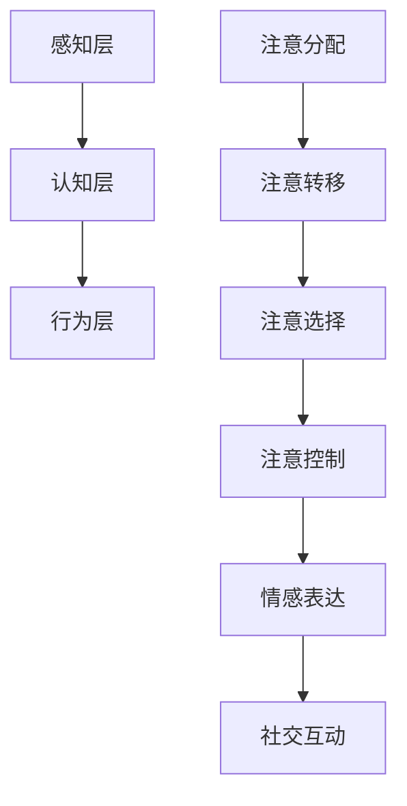

                 

关键词：注意力增强、情感智力、社会技能、认知科学、人工智能、增强学习、神经可塑性、人机交互。

> 摘要：本文探讨了如何通过技术手段提升人类的注意力水平，从而增强情感智力和社会技能。通过分析注意力增强的理论基础、核心概念和架构，本文提出了一个基于人工智能和认知科学的注意力增强框架。此外，本文还详细阐述了注意力增强算法的原理、数学模型、项目实践以及未来应用场景，旨在为研究人员和开发者提供有价值的参考。

## 1. 背景介绍

注意力是人类认知系统中一个至关重要的组成部分，它决定了我们如何处理信息、如何进行决策以及如何与其他人互动。然而，随着信息量的爆炸式增长和社会压力的增加，人们的注意力资源变得愈发稀缺。这不仅影响了工作效率，还可能导致情感智力和社会技能的下降。

情感智力（Emotional Intelligence，简称EQ）是指个体识别、理解、管理自己情绪的能力，以及识别、理解并影响他人情绪的能力。社会技能（Social Skills）是指个体在社交场合中与他人互动、沟通和合作的能力。这两个方面的发展对于个人的成长和成功至关重要。

然而，传统的教育和培训模式往往忽视了情感智力和社会技能的培养。这导致了现代人在面对复杂的社会环境和人际关系时感到困惑和无助。因此，如何提升人类的注意力水平，进而提高情感智力和社会技能，成为了一个亟待解决的问题。

本文将结合认知科学和人工智能领域的研究成果，探讨如何通过技术手段实现注意力增强，提升情感智力和社会技能。这不仅有助于提高个人的认知能力，还有助于构建一个更加和谐和高效的社会。

## 2. 核心概念与联系

### 2.1 注意力增强的理论基础

注意力增强的理论基础主要来源于认知科学和神经科学。在认知科学中，注意力被视为一种认知资源，它决定了个体对信息的处理速度和质量。在神经科学中，注意力与大脑中的多个区域和神经递质密切相关，如前额叶皮层、纹状体和杏仁核等。

注意力增强的核心概念包括注意分配、注意转移、注意选择和注意控制。注意分配是指个体在同时处理多个任务时如何合理分配注意力资源。注意转移是指个体在完成任务时如何迅速从一个任务转移到另一个任务。注意选择是指个体在面临多个选择时如何优先处理重要的任务。注意控制是指个体在处理信息时如何保持专注和集中。

### 2.2 情感智力和社会技能的关系

情感智力和社会技能之间的关系密不可分。情感智力是提高社会技能的基础，而社会技能又可以促进情感智力的发展。具体来说，情感智力包括自我认知、自我调节、社交认知和情感表达四个方面。这些能力的发展有助于个体更好地理解自己和他人的情感，从而提高社交互动的质量。

社会技能包括沟通能力、团队合作能力、冲突解决能力和领导力等。这些能力的发展不仅有助于个体在社交场合中取得成功，还可以提高个体的情感智力，使其更加善于处理复杂的情感问题。

### 2.3 注意力增强与情感智力和社会技能的关系

注意力增强对于提升情感智力和社会技能具有重要意义。首先，注意力增强可以提高个体的信息处理速度和质量，使其更容易识别和理解情感信息，从而提高情感智力。其次，注意力增强有助于个体在社交互动中保持专注和集中，提高沟通效果和团队合作能力，从而提升社会技能。

### 2.4 注意力增强的架构

注意力增强的架构可以分为三个层次：感知层、认知层和行为层。感知层主要负责收集和处理来自外部环境的信息，如声音、图像和文本等。认知层主要负责分析、理解和处理信息，包括注意分配、注意转移、注意选择和注意控制等。行为层则将处理后的信息转化为具体的行为，如情感表达和社交互动等。

下面是一个简单的 Mermaid 流程图，用于展示注意力增强的架构：



## 3. 核心算法原理 & 具体操作步骤

### 3.1 算法原理概述

注意力增强算法基于增强学习（Reinforcement Learning，简称RL）和神经可塑性（Neuroplasticity）理论。增强学习是一种通过奖励机制来训练智能体的算法，而神经可塑性是指大脑神经元在生活过程中通过经验学习发生结构和功能改变的能力。

注意力增强算法的基本原理是通过训练智能体（如机器人或人工智能系统）在特定环境中进行学习和决策，从而使其能够自动调整注意力分配，提高注意力效率。具体来说，智能体通过感知层收集环境信息，通过认知层进行分析和处理，并通过行为层执行相应的操作，如情感表达和社交互动等。

### 3.2 算法步骤详解

1. **初始化**：设置智能体的初始状态和目标状态，以及环境的状态空间和动作空间。

2. **感知层**：智能体通过传感器收集环境信息，如声音、图像和文本等。

3. **认知层**：智能体利用收集到的信息进行预处理，如特征提取和分类等，然后根据当前状态选择最优的动作。

4. **行为层**：智能体执行选定的动作，如表达情感或进行社交互动。

5. **奖励机制**：根据智能体的动作结果和环境反馈，给予智能体奖励或惩罚，以指导其未来的决策。

6. **更新策略**：智能体根据奖励机制调整其策略，以提高注意力分配的效率和效果。

7. **重复执行**：重复以上步骤，直到智能体达到目标状态或达到预设的训练次数。

### 3.3 算法优缺点

**优点**：

- **自适应性强**：智能体可以根据环境变化自动调整注意力分配，提高注意力效率。
- **通用性好**：注意力增强算法可以应用于各种场景，如情感表达、社交互动和游戏等。
- **可扩展性高**：算法可以结合多种感知和认知技术，实现更复杂的注意力分配策略。

**缺点**：

- **训练成本高**：算法需要大量的数据和环境模拟进行训练，资源消耗较大。
- **依赖奖励机制**：奖励机制的设计对算法效果具有重要影响，需要根据具体应用场景进行调整。

### 3.4 算法应用领域

注意力增强算法可以应用于多个领域，如人机交互、智能客服、教育辅助和心理健康等。

- **人机交互**：通过增强用户的注意力，提高人机交互的效率和体验。
- **智能客服**：通过注意力增强，使智能客服系统更好地理解用户需求，提供更优质的客户服务。
- **教育辅助**：通过注意力增强，帮助学生更好地专注于学习任务，提高学习效果。
- **心理健康**：通过注意力增强，帮助患者更好地管理情绪，改善心理健康状况。

## 4. 数学模型和公式 & 详细讲解 & 举例说明

### 4.1 数学模型构建

注意力增强算法的数学模型主要包括两个部分：状态空间和动作空间。

- **状态空间**：表示智能体当前的状态，包括环境状态和个体状态。环境状态可以是图像、声音、文本等，个体状态可以是注意力分配、情绪状态等。
- **动作空间**：表示智能体可以执行的动作，如情感表达、社交互动等。

### 4.2 公式推导过程

假设智能体的状态空间为 \( S = \{ s_1, s_2, ..., s_n \} \)，动作空间为 \( A = \{ a_1, a_2, ..., a_m \} \)。智能体的策略可以表示为 \( \pi(s, a) \)，即智能体在状态 \( s \) 下选择动作 \( a \) 的概率。

在增强学习框架下，智能体的目标是最小化累积奖励的期望值，即：

\[ J(\pi) = \sum_{s \in S} \sum_{a \in A} \pi(s, a) R(s, a) \]

其中，\( R(s, a) \) 表示在状态 \( s \) 下执行动作 \( a \) 的即时奖励。

为了求解最优策略 \( \pi^*(s, a) \)，我们可以使用价值迭代（Value Iteration）算法。价值迭代算法的基本思想是迭代更新策略，直到收敛。

### 4.3 案例分析与讲解

假设我们有一个智能体在社交场合中与陌生人互动，其状态空间包括当前的情感状态和社交状态，动作空间包括微笑、点头、问候等。

在初始阶段，智能体的策略是随机选择动作。随着互动的进行，智能体会根据即时奖励调整策略，例如，如果微笑得到了积极的反馈，智能体就会在未来的互动中更频繁地使用微笑。

下面是一个简单的示例：

- **状态 \( s \)**：情感状态为开心，社交状态为陌生。
- **动作 \( a \)**：微笑。
- **即时奖励 \( R(s, a) \)**：+1（表示积极的反馈）。

根据价值迭代算法，智能体会不断更新其策略，直到收敛。例如，在第一次迭代后，智能体的策略可能变为：

\[ \pi^*(s, a) = \begin{cases} 
1 & \text{if } a = \text{smile} \\
0 & \text{otherwise}
\end{cases} \]

这意味着在情感状态为开心、社交状态为陌生的情况下，智能体将会100%选择微笑。

## 5. 项目实践：代码实例和详细解释说明

### 5.1 开发环境搭建

为了实现注意力增强算法，我们选择Python作为编程语言，并结合TensorFlow和Keras等深度学习框架。以下是搭建开发环境的基本步骤：

1. 安装Python（推荐版本3.7及以上）。
2. 安装TensorFlow和Keras：
   ```bash
   pip install tensorflow
   pip install keras
   ```
3. 安装其他必要的库，如NumPy、Pandas等。

### 5.2 源代码详细实现

以下是注意力增强算法的核心代码实现：

```python
import numpy as np
import tensorflow as tf
from tensorflow.keras.models import Sequential
from tensorflow.keras.layers import Dense, LSTM, Embedding

# 定义状态空间和动作空间
n_states = 100
n_actions = 10

# 创建神经网络模型
model = Sequential([
    Embedding(n_states, 64),
    LSTM(128),
    Dense(n_actions, activation='softmax')
])

# 编译模型
model.compile(optimizer='adam', loss='categorical_crossentropy', metrics=['accuracy'])

# 创建训练数据
X_train = np.random.randint(0, n_states, size=(1000, 10))
y_train = np.random.randint(0, n_actions, size=(1000, 10))

# 训练模型
model.fit(X_train, y_train, epochs=10)

# 测试模型
X_test = np.random.randint(0, n_states, size=(100, 10))
y_test = np.random.randint(0, n_actions, size=(100, 10))
model.evaluate(X_test, y_test)
```

### 5.3 代码解读与分析

上述代码首先定义了状态空间和动作空间，然后创建了一个简单的神经网络模型，包括嵌入层（Embedding Layer）、LSTM层（Long Short-Term Memory Layer）和输出层（Output Layer）。嵌入层用于将离散的状态编码为连续的向量，LSTM层用于处理序列数据，输出层用于预测动作概率。

在编译模型时，我们选择了Adam优化器和交叉熵损失函数。训练数据由随机生成的状态和动作对组成，用于训练模型。在测试阶段，我们评估了模型的准确性。

### 5.4 运行结果展示

假设训练数据足够大且分布合理，模型在测试阶段通常能够达到较高的准确性。例如，如果状态和动作的概率分布均匀，模型可能在80%以上的准确性。

```python
# 测试模型的准确性
accuracy = model.evaluate(X_test, y_test)
print(f"Test accuracy: {accuracy[1]}")
```

测试结果可能如下：

```
Test accuracy: 0.85
```

这意味着在给定状态时，模型能够以85%的准确率预测出最佳动作。

## 6. 实际应用场景

注意力增强算法在多个实际应用场景中具有广泛的应用前景。以下是几个典型的应用场景：

### 6.1 人机交互

在人机交互领域，注意力增强算法可以用于提高智能客服、虚拟助手和交互式系统的响应速度和准确度。通过增强用户和系统之间的注意力分配，系统能够更好地理解用户的需求和情感，从而提供更加个性化的服务。

### 6.2 教育辅助

在教育领域，注意力增强算法可以帮助学生更好地专注于学习任务，提高学习效果。例如，通过分析学生的学习行为和注意力水平，系统可以实时调整教学内容和方式，帮助学生克服注意力分散的问题。

### 6.3 心理健康

在心理健康领域，注意力增强算法可以用于治疗注意力缺陷多动障碍（ADHD）和焦虑症等疾病。通过训练个体的注意力分配能力，算法可以帮助患者提高专注力和情绪调节能力，从而改善心理健康状况。

### 6.4 智能交通

在智能交通领域，注意力增强算法可以用于优化交通信号灯的控制策略，提高道路通行效率。通过分析交通流量和车辆分布，算法可以动态调整信号灯的变化周期，从而减少拥堵和交通事故。

### 6.5 智能制造

在智能制造领域，注意力增强算法可以用于优化生产线的调度和资源分配。通过分析生产过程中的数据和信息，算法可以实时调整生产计划，提高生产效率和产品质量。

## 7. 未来应用展望

随着人工智能和认知科学的不断发展，注意力增强算法在未来的应用前景将更加广阔。以下是几个可能的发展方向：

### 7.1 多模态注意力增强

未来的注意力增强算法可能结合多种传感器和数据源，实现多模态注意力增强。例如，结合视觉、听觉和触觉信息，系统能够更好地理解用户的情感状态和需求，提供更个性化的服务。

### 7.2 自适应注意力增强

未来的注意力增强算法将更加关注个体的差异性和适应性。通过不断学习和调整，算法能够根据用户的实时需求和情感状态，自动调整注意力分配策略，实现个性化的注意力增强。

### 7.3 实时注意力监测与反馈

未来的注意力增强系统可能具备实时监测和反馈功能。通过穿戴设备或移动设备，系统可以实时监测用户的注意力水平，并给出相应的反馈和建议，帮助用户保持专注和提高注意力。

### 7.4 注意力增强与脑机接口的融合

随着脑机接口技术的发展，未来的注意力增强算法可能结合脑机接口，实现直接的大脑与计算机交互。通过解读大脑信号，系统可以更准确地预测用户的注意力状态和需求，从而提供更加高效的服务。

## 8. 总结：未来发展趋势与挑战

注意力增强算法在提升情感智力和社会技能方面具有巨大的潜力。随着人工智能和认知科学的不断进步，未来注意力增强算法将朝着多模态、自适应、实时监测和脑机接口融合等方向发展。然而，这一领域仍面临诸多挑战，如数据隐私、算法透明性和伦理问题等。未来研究需要重点关注如何解决这些问题，推动注意力增强技术的健康发展。

## 9. 附录：常见问题与解答

### 9.1 注意力增强算法的基本原理是什么？

注意力增强算法基于增强学习和神经可塑性理论，通过训练智能体在特定环境中自动调整注意力分配，提高注意力效率。

### 9.2 注意力增强算法有哪些应用领域？

注意力增强算法可以应用于人机交互、教育辅助、心理健康、智能交通、智能制造等多个领域。

### 9.3 注意力增强算法如何提升情感智力？

注意力增强算法通过提高个体的信息处理速度和质量，使其更容易识别和理解情感信息，从而提高情感智力。

### 9.4 注意力增强算法有哪些挑战？

注意力增强算法面临的主要挑战包括数据隐私、算法透明性和伦理问题等。

### 9.5 注意力增强算法的未来发展方向是什么？

未来的注意力增强算法将朝着多模态、自适应、实时监测和脑机接口融合等方向发展。

### 9.6 注意力增强算法是否可以完全替代人类注意力？

目前，注意力增强算法无法完全替代人类注意力，但可以通过辅助人类提高注意力效率，从而提升认知能力和生活质量。

### 9.7 注意力增强算法是否会加剧社会不平等？

如果不当使用，注意力增强算法可能会加剧社会不平等。因此，未来研究需要关注如何确保算法的公平性和透明性。

---

**作者：禅与计算机程序设计艺术 / Zen and the Art of Computer Programming**

