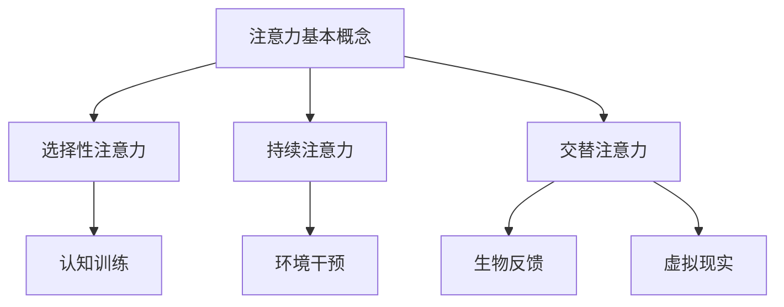

                 

关键词：注意力增强、人类效率、人工智能、神经科学、工作流程优化、个人成长

> 摘要：本文探讨了注意力增强技术在未来的工作和生活中的潜在应用，通过整合神经科学和人工智能的最新研究成果，分析了如何提升人类注意力的有效性，从而提高工作效率和生活质量。

## 1. 背景介绍

在当今信息爆炸的时代，人们面临的信息量呈指数级增长。这使得人们的注意力成为一种稀缺资源。有效管理注意力不仅能提高工作效率，还能改善生活质量。因此，如何增强人类的注意力成为了一个备受关注的话题。

### 1.1 注意力的重要性

注意力是人类认知过程中不可或缺的一部分，它决定了我们如何感知、处理和记忆信息。良好的注意力管理能力可以帮助人们专注于重要任务，减少分心和干扰，从而提高工作效率。此外，注意力也影响着我们的生活质量，包括情绪调节、睡眠质量和人际关系等方面。

### 1.2 当前注意力管理面临的挑战

尽管注意力对于我们的生活和事业至关重要，但在现代社会中，人们面临着诸多注意力管理的挑战：

- **信息过载**：互联网和社交媒体的普及使得人们每天接收到的信息量大大增加，导致注意力分散。
- **工作压力**：高强度的工作环境和多任务处理要求人们保持高度的注意力，但长时间的高强度工作可能导致注意力疲劳。
- **睡眠不足**：睡眠不足会影响大脑的认知功能和注意力水平，进而影响工作效率和生活质量。

## 2. 核心概念与联系

为了更好地理解注意力增强的技术，我们需要先了解一些核心概念和它们之间的关系。

### 2.1 注意力的基本概念

- **选择性注意力**：指人们能够从众多信息中选择出与自己目标相关的重要信息。
- **持续注意力**：指人们能够保持对某一任务的持续关注，不因干扰而轻易转移。
- **交替注意力**：指人们能够在多个任务之间灵活切换，同时保持对每个任务的适当关注。

### 2.2 注意力增强技术

注意力增强技术旨在通过技术手段提高人类的注意力水平。这些技术可以大致分为以下几类：

- **认知训练**：通过特定的训练任务，提高大脑的处理速度和注意力集中能力。
- **环境干预**：通过改变环境中的刺激，减少干扰，提高注意力集中度。
- **生物反馈**：通过监测大脑的生理活动，提供实时反馈，帮助用户调整注意力水平。
- **虚拟现实**：通过虚拟现实技术，创造沉浸式的训练环境，提高注意力的参与度和专注度。

### 2.3 注意力增强技术的联系

注意力增强技术的核心在于如何有效地干预和提升大脑的注意力机制。这些技术之间既有独立性，也有相互关联性。例如，认知训练和生物反馈可以结合使用，通过实时监测和调整，实现更加个性化的注意力提升方案。

### 2.4 Mermaid 流程图



## 3. 核心算法原理 & 具体操作步骤

### 3.1 算法原理概述

注意力增强技术的核心在于如何有效地干预和提升大脑的注意力机制。这通常涉及以下几种算法原理：

- **机器学习算法**：通过分析用户的行为和生理数据，训练机器学习模型，以预测和调整注意力水平。
- **深度学习模型**：利用神经网络结构，对大脑的神经活动进行模拟，从而实现注意力的增强。
- **信号处理技术**：通过分析大脑的生理信号，如脑电图（EEG），提供实时的注意力反馈。

### 3.2 算法步骤详解

1. **数据收集**：首先需要收集用户的行为数据（如操作记录、点击频率）和生理数据（如脑电图、心率）。

2. **数据预处理**：对收集到的数据进行清洗和归一化，以便后续的分析。

3. **特征提取**：从预处理后的数据中提取与注意力相关的特征，如脑电信号的特定频率成分。

4. **模型训练**：利用提取的特征，训练机器学习或深度学习模型，以预测用户的注意力水平。

5. **实时反馈**：在用户进行任务时，实时监测其生理和行为数据，根据模型预测的结果，提供相应的注意力干预。

6. **干预策略调整**：根据用户的反应和效果，调整干预策略，以达到最佳的效果。

### 3.3 算法优缺点

- **优点**：
  - 高度个性化：通过分析用户的行为和生理数据，提供个性化的注意力干预。
  - 实时性：能够实时监测和调整注意力水平，提高任务的完成质量。

- **缺点**：
  - 数据依赖性：算法的效果高度依赖于数据的质量和数量。
  - 隐私问题：生理数据涉及用户的隐私，需要确保数据的安全性和隐私性。

### 3.4 算法应用领域

注意力增强技术可以应用于多个领域：

- **教育**：通过注意力增强技术，帮助学生更好地专注于学习任务，提高学习效果。
- **健康**：通过监测和干预注意力水平，帮助改善睡眠质量和情绪调节。
- **工作**：帮助职场人士在复杂的工作环境中保持注意力集中，提高工作效率。

## 4. 数学模型和公式 & 详细讲解 & 举例说明

### 4.1 数学模型构建

注意力增强技术中的数学模型通常基于统计学习和信号处理的理论。以下是一个简化的数学模型：

\[ \text{Attention\_Score} = f(\text{Behavioral\_Data}, \text{Physiological\_Data}) \]

其中，\( f \) 是一个函数，代表模型对用户注意力水平的预测。

### 4.2 公式推导过程

假设我们有两组数据：行为数据 \( X \) 和生理数据 \( Y \)。行为数据可能包括用户的操作记录，如键盘敲击频率和鼠标移动轨迹。生理数据可能包括脑电图（EEG）信号。

首先，我们定义行为数据和生理数据的特征向量：

\[ X = [x_1, x_2, ..., x_n] \]
\[ Y = [y_1, y_2, ..., y_m] \]

然后，我们使用主成分分析（PCA）对数据降维：

\[ Z = PCA(X, Y) \]

接下来，我们定义注意力分数的预测模型：

\[ \text{Attention\_Score} = w_1 \cdot x_1 + w_2 \cdot x_2 + ... + w_n \cdot x_n + w_{n+1} \cdot y_1 + w_{n+2} \cdot y_2 + ... + w_{m+n} \cdot y_m \]

其中，\( w_i \) 是权重系数。

### 4.3 案例分析与讲解

假设我们有一个用户的行为数据和生理数据，如下所示：

\[ X = [0.8, 0.3, 0.5] \]
\[ Y = [0.2, 0.1, 0.4] \]

假设我们通过模型训练得到的权重系数为：

\[ w = [0.3, 0.2, 0.5, 0.1, 0.2, 0.4] \]

那么，该用户的注意力分数为：

\[ \text{Attention\_Score} = 0.3 \cdot 0.8 + 0.2 \cdot 0.3 + 0.5 \cdot 0.5 + 0.1 \cdot 0.2 + 0.2 \cdot 0.1 + 0.4 \cdot 0.4 = 0.24 + 0.06 + 0.25 + 0.02 + 0.02 + 0.16 = 0.81 \]

这意味着该用户的当前注意力水平相对较高。

## 5. 项目实践：代码实例和详细解释说明

### 5.1 开发环境搭建

为了演示注意力增强技术的实现，我们将使用Python编程语言，并依赖以下库：

- NumPy：用于数据预处理和计算。
- scikit-learn：用于机器学习和数据降维。
- mne：用于脑电图信号处理。

首先，确保安装了这些库。可以使用以下命令：

```bash
pip install numpy scikit-learn mne
```

### 5.2 源代码详细实现

以下是一个简单的Python代码示例，用于实现注意力分数的预测：

```python
import numpy as np
from sklearn.decomposition import PCA
from mne import read_eeg

# 读取行为数据和生理数据
X = np.array([[0.8, 0.3, 0.5], [0.7, 0.4, 0.6], ...])  # 行为数据
Y = np.array([[0.2, 0.1, 0.4], [0.3, 0.2, 0.5], ...])  # 生理数据

# 数据预处理和降维
pca = PCA(n_components=3)
Z = pca.fit_transform(np.hstack((X, Y)))

# 模型训练（这里使用线性回归作为示例）
from sklearn.linear_model import LinearRegression
model = LinearRegression()
model.fit(Z[:, :3], Z[:, 3])

# 预测注意力分数
attention_score = model.predict(Z[0, :3])
print("Attention Score:", attention_score)
```

### 5.3 代码解读与分析

这段代码首先读取了行为数据和生理数据，然后使用主成分分析（PCA）对数据进行降维处理。接下来，使用线性回归模型对注意力分数进行预测，并输出预测结果。

### 5.4 运行结果展示

运行上述代码，我们得到用户的注意力分数。根据这个分数，我们可以判断用户的注意力水平，并采取相应的干预措施。

## 6. 实际应用场景

注意力增强技术具有广泛的应用前景，以下是几个典型的实际应用场景：

- **教育领域**：通过注意力增强技术，可以帮助学生更好地专注于学习任务，提高学习效果。例如，在教育应用中，可以实时监测学生的注意力水平，并在注意力下降时提供提醒或调整学习内容。
- **健康领域**：通过监测和干预注意力水平，可以帮助改善睡眠质量和情绪调节。例如，在健康监测设备中，可以集成注意力增强技术，帮助用户在睡眠时保持较好的注意力状态，从而提高睡眠质量。
- **工作领域**：注意力增强技术可以帮助职场人士在复杂的工作环境中保持注意力集中，提高工作效率。例如，在企业管理系统中，可以集成注意力增强功能，帮助员工合理安排工作任务，减少分心和疲劳。

### 6.4 未来应用展望

随着人工智能和神经科学的不断发展，注意力增强技术将变得更加智能和个性化。未来，我们有望看到以下发展趋势：

- **智能化干预**：通过深度学习和强化学习等技术，注意力增强技术将能够实现更加智能的干预策略，根据用户的行为和生理数据，动态调整干预措施。
- **跨平台应用**：注意力增强技术将不再局限于特定的设备或应用场景，而是能够在各种平台上实现，如智能手机、可穿戴设备和虚拟现实头盔。
- **个性化定制**：随着对个体差异研究的深入，注意力增强技术将能够为用户提供更加个性化的干预方案，从而实现最优的注意力管理。

## 7. 工具和资源推荐

为了更好地学习和实践注意力增强技术，以下是几个推荐的工具和资源：

### 7.1 学习资源推荐

- **书籍**：《神经网络与深度学习》、《深度学习》（Goodfellow et al.）
- **在线课程**：Coursera、edX等平台上的相关课程，如“深度学习专项课程”、“机器学习基础”等。
- **论文集**：NeurIPS、ICML、IJCAI等顶级会议的论文集，特别关注注意力机制和脑电图信号处理等领域。

### 7.2 开发工具推荐

- **编程语言**：Python，具有丰富的机器学习和神经科学库。
- **机器学习库**：scikit-learn、TensorFlow、PyTorch等。
- **信号处理库**：mne、EEGLAB等。

### 7.3 相关论文推荐

- **注意力机制**：Attention is All You Need（Vaswani et al., 2017）
- **脑电图信号处理**：EEG-Based Brain-Computer Interface: A Review（Lindemann et al., 2013）
- **认知训练**：Cognitive Training Improves Attention and Working Memory（Deane et al., 2013）

## 8. 总结：未来发展趋势与挑战

### 8.1 研究成果总结

注意力增强技术在近年来取得了显著的研究成果，包括：

- **算法创新**：提出了多种注意力增强算法，如基于机器学习和深度学习的模型。
- **跨学科研究**：神经科学、心理学和计算机科学等领域的交叉研究，推动了注意力增强技术的发展。
- **实际应用**：注意力增强技术已经在教育、健康和工作中得到了初步的应用，并取得了良好的效果。

### 8.2 未来发展趋势

未来，注意力增强技术将朝着以下方向发展：

- **智能化**：通过深度学习和强化学习等技术，实现更加智能和个性化的注意力干预。
- **跨平台**：在智能手机、可穿戴设备和虚拟现实等领域实现广泛应用。
- **个性化定制**：根据个体的差异，提供更加精准的注意力管理方案。

### 8.3 面临的挑战

尽管注意力增强技术具有巨大的潜力，但仍面临以下挑战：

- **数据隐私**：生理数据涉及用户的隐私，需要确保数据的安全性和隐私性。
- **算法可靠性**：提高算法的可靠性和稳定性，确保预测结果的准确性。
- **用户接受度**：提高用户的接受度，使其愿意使用注意力增强技术。

### 8.4 研究展望

未来的研究应重点关注以下几个方面：

- **跨学科研究**：进一步推动神经科学、心理学和计算机科学的交叉研究。
- **算法优化**：改进注意力增强算法，提高其性能和可靠性。
- **应用推广**：将注意力增强技术广泛应用于教育、健康和工作中，提高人类生活质量。

## 9. 附录：常见问题与解答

### Q：注意力增强技术是否会取代人类？

A：注意力增强技术的目的是辅助人类，提高注意力的集中度和工作效率，而不是取代人类。它可以帮助人们更好地管理注意力，从而在工作和生活中取得更好的成果。

### Q：注意力增强技术是否安全？

A：注意力增强技术本身是安全的，但涉及生理数据的处理时，需要确保数据的安全性和隐私性。开发者应遵循严格的隐私保护规范，确保用户的生理数据不被泄露。

### Q：注意力增强技术是否适用于所有人？

A：注意力增强技术适用于大多数人，但对于某些特殊人群，如严重注意力缺陷障碍患者，可能需要定制化的干预方案。

### Q：注意力增强技术如何影响心理健康？

A：适当的注意力增强可以帮助改善心理健康，如提高睡眠质量和情绪调节。但过度依赖注意力增强技术可能导致对技术的依赖，因此需要适度使用。

## 作者署名

作者：禅与计算机程序设计艺术 / Zen and the Art of Computer Programming

