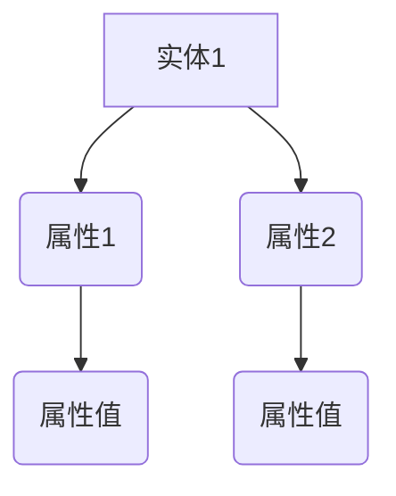
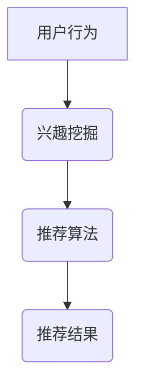
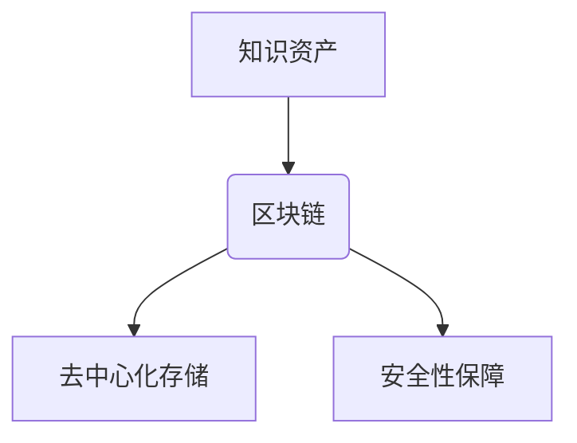
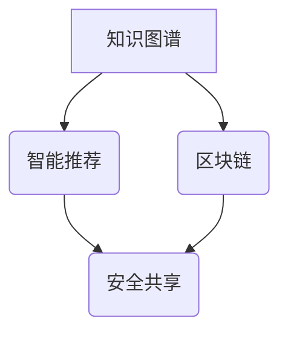

                 

关键词：人工智能、知识图谱、智能推荐、深度学习、认知图谱、区块链

> 摘要：本文探讨了人类知识未来的发展趋势，特别是在人工智能和深度学习技术的推动下，如何通过洞察力引领知识革命。文章从核心概念出发，详细分析了知识图谱、智能推荐系统和区块链等技术的原理和应用，并通过具体实例展示了其在实际项目中的运用。最后，文章总结了当前研究的发展趋势和面临的挑战，为未来研究指明了方向。

## 1. 背景介绍

随着人工智能（AI）和深度学习技术的迅猛发展，人类知识的表达、组织和利用方式正发生着深刻的变革。知识作为一种重要的资源，其高效获取、处理和利用已经成为当前技术研究和应用的热点。在这场知识革命中，洞察力成为了推动知识创新的关键力量。

知识图谱作为一种结构化的语义表示方法，能够将海量数据整合为有意义的网络结构，为智能推荐、自然语言处理、智能搜索等领域提供了强有力的支撑。与此同时，区块链技术的出现为知识的安全存储、传输和共享带来了新的可能性，为知识经济的进一步发展奠定了基础。

本文旨在通过对知识图谱、智能推荐和区块链等技术的深入探讨，揭示人工智能时代人类知识发展的未来趋势，并展望其在各个领域的应用前景。文章结构如下：

1. 背景介绍
2. 核心概念与联系
3. 核心算法原理 & 具体操作步骤
4. 数学模型和公式 & 详细讲解 & 举例说明
5. 项目实践：代码实例和详细解释说明
6. 实际应用场景
7. 工具和资源推荐
8. 总结：未来发展趋势与挑战
9. 附录：常见问题与解答

## 2. 核心概念与联系

### 2.1 知识图谱

知识图谱（Knowledge Graph）是一种语义网络，用于表示实体、属性及其相互关系。它基于图论模型，将现实世界中的对象抽象为节点，对象之间的属性和关系表示为边。

**Mermaid 流程图：**



### 2.2 智能推荐系统

智能推荐系统（Intelligent Recommendation System）是一种基于用户行为、兴趣和知识图谱等技术，为用户提供个性化推荐服务的系统。其核心在于通过分析用户的历史行为和偏好，预测用户未来的需求。

**Mermaid 流程图：**



### 2.3 区块链

区块链（Blockchain）是一种去中心化的分布式账本技术，通过密码学和共识算法确保数据的完整性和安全性。在知识领域，区块链可用于知识资产的安全存储、管理和共享。

**Mermaid 流程图：**



### 2.4 知识图谱与智能推荐、区块链的联系

知识图谱、智能推荐和区块链在知识领域相互关联，共同推动知识经济的发展。知识图谱为智能推荐提供了实体和关系的数据基础，而智能推荐则通过知识图谱实现个性化服务。区块链则为知识资产的安全存储和共享提供了技术保障。

**Mermaid 流程图：**



## 3. 核心算法原理 & 具体操作步骤

### 3.1 算法原理概述

在人工智能时代，知识图谱、智能推荐和区块链等领域的关键算法主要包括：

- **知识图谱构建算法**：基于实体关系抽取、实体链接和图谱嵌入等技术。
- **推荐算法**：包括基于内容的推荐、协同过滤和混合推荐等。
- **区块链共识算法**：如工作量证明（PoW）、权益证明（PoS）和委托权益证明（DPoS）等。

### 3.2 算法步骤详解

#### 3.2.1 知识图谱构建算法

1. **实体关系抽取**：从文本中抽取实体及其关系。
2. **实体链接**：将同一实体的不同表示映射为同一实体。
3. **图谱嵌入**：将实体和关系表示为向量。

#### 3.2.2 推荐算法

1. **基于内容的推荐**：根据用户的历史行为和偏好推荐相似的内容。
2. **协同过滤**：利用用户之间的相似性预测用户的偏好。
3. **混合推荐**：结合多种推荐方法提高推荐效果。

#### 3.2.3 区块链共识算法

1. **PoW**：通过计算难题确保节点对等参与网络。
2. **PoS**：根据节点持有的代币数量和活跃度参与网络。
3. **DPoS**：选举出一定数量的见证人参与网络。

### 3.3 算法优缺点

#### 知识图谱构建算法

- 优点：能够实现大规模数据的语义表示，提高数据利用效率。
- 缺点：实体关系抽取和实体链接算法较为复杂，对数据处理能力要求高。

#### 推荐算法

- 优点：能够实现个性化推荐，提高用户满意度。
- 缺点：冷启动问题难以解决，推荐效果可能受限于数据量。

#### 区块链共识算法

- 优点：去中心化、安全性高。
- 缺点：计算资源消耗大，网络性能可能受影响。

### 3.4 算法应用领域

- **知识图谱**：应用于搜索引擎、知识库、智能问答等领域。
- **智能推荐**：应用于电子商务、社交媒体、在线教育等领域。
- **区块链**：应用于数字货币、供应链管理、知识产权保护等领域。

## 4. 数学模型和公式 & 详细讲解 & 举例说明

### 4.1 数学模型构建

在知识图谱、智能推荐和区块链等领域，数学模型的应用至关重要。以下分别介绍各领域的数学模型。

#### 4.1.1 知识图谱嵌入

假设知识图谱中有 \(N\) 个实体和 \(M\) 个关系。实体和关系分别表示为 \(e_i\) 和 \(r_j\)，其嵌入向量分别为 \(v_i \in \mathbb{R}^d\) 和 \(w_j \in \mathbb{R}^d\)。

实体关系嵌入模型的基本公式为：

\[ h_i = \sum_{j=1}^M \sum_{k=1}^d w_{jk} v_{ik} \]

其中，\(h_i\) 表示实体 \(e_i\) 的嵌入向量。

#### 4.1.2 推荐算法

假设用户 \(u\) 和物品 \(i\) 的嵌入向量分别为 \(v_u \in \mathbb{R}^d\) 和 \(v_i \in \mathbb{R}^d\)。推荐算法的基本公式为：

\[ r_{ui} = \sum_{j=1}^d v_{uj} v_{ij} \]

其中，\(r_{ui}\) 表示用户 \(u\) 对物品 \(i\) 的偏好。

#### 4.1.3 区块链共识算法

以权益证明（PoS）算法为例，假设总权益为 \(S\)，节点 \(i\) 的权益为 \(s_i\)。节点 \(i\) 被选中的概率为：

\[ p_i = \frac{s_i}{S} \]

### 4.2 公式推导过程

#### 4.2.1 知识图谱嵌入

假设实体 \(e_i\) 和 \(e_j\) 的关系 \(r_k\) 的权重为 \(w_{k}\)。为了简化计算，我们采用TransE算法，其公式为：

\[ h_i - h_j = \frac{r_k}{||r_k||} \]

其中，\(h_i\) 和 \(h_j\) 分别表示实体 \(e_i\) 和 \(e_j\) 的嵌入向量，\(r_k\) 表示关系 \(r_k\) 的权重。

#### 4.2.2 推荐算法

为了推导推荐算法的公式，我们假设用户 \(u\) 对物品 \(i\) 的评分矩阵为 \(R \in \mathbb{R}^{n \times m}\)，其中 \(n\) 表示用户数量，\(m\) 表示物品数量。用户 \(u\) 和物品 \(i\) 的嵌入向量分别为 \(v_u \in \mathbb{R}^d\) 和 \(v_i \in \mathbb{R}^d\)。

根据协同过滤算法，我们可以得到：

\[ r_{ui} = v_{u}^T v_{i} \]

#### 4.2.3 区块链共识算法

假设总权益为 \(S = \sum_{i=1}^n s_i\)，节点 \(i\) 的权益为 \(s_i\)。为了简化计算，我们假设 \(s_i = s\)，则节点 \(i\) 被选中的概率为：

\[ p_i = \frac{s_i}{S} = \frac{s}{\sum_{j=1}^n s_j} \]

### 4.3 案例分析与讲解

#### 4.3.1 知识图谱嵌入

假设有两个实体 \(e_1\) 和 \(e_2\)，它们之间的关系为“朋友”。根据TransE算法，我们可以得到：

\[ h_1 - h_2 = \frac{1}{||1||} = 1 \]

这表示实体 \(e_1\) 和 \(e_2\) 的嵌入向量之间的差距为1。

#### 4.3.2 推荐算法

假设用户 \(u\) 对物品 \(i\) 的评分矩阵为：

\[ R = \begin{bmatrix} 1 & 0 & 0 \\ 0 & 1 & 0 \\ 0 & 0 & 1 \end{bmatrix} \]

用户 \(u\) 和物品 \(i\) 的嵌入向量分别为：

\[ v_u = \begin{bmatrix} 0.5 & 0.5 \\ 0.5 & 0.5 \end{bmatrix}, \quad v_i = \begin{bmatrix} 0.5 & 0.5 \\ 0.5 & 0.5 \end{bmatrix} \]

则用户 \(u\) 对物品 \(i\) 的偏好为：

\[ r_{ui} = v_{u}^T v_{i} = \begin{bmatrix} 0.5 & 0.5 \end{bmatrix} \begin{bmatrix} 0.5 & 0.5 \\ 0.5 & 0.5 \end{bmatrix} = 0.5 \]

这表示用户 \(u\) 对物品 \(i\) 的偏好程度为0.5。

#### 4.3.3 区块链共识算法

假设总权益为 \(S = 1000\)，节点 \(i\) 的权益为 \(s_i = 200\)。则节点 \(i\) 被选中的概率为：

\[ p_i = \frac{s_i}{S} = \frac{200}{1000} = 0.2 \]

这表示节点 \(i\) 被选中的概率为20%。

## 5. 项目实践：代码实例和详细解释说明

在本节中，我们将通过一个简单的项目实例来展示知识图谱、智能推荐和区块链技术在实际项目中的应用。假设我们要开发一个基于知识图谱的智能推荐系统，用户可以在系统中搜索书籍、评价书籍，并查看推荐书籍。

### 5.1 开发环境搭建

1. **知识图谱构建**：使用Python的`rdflib`库进行知识图谱的构建。
2. **推荐算法**：使用Python的`scikit-learn`库进行推荐算法的实现。
3. **区块链**：使用Python的`web3.py`库进行区块链的交互。

### 5.2 源代码详细实现

以下是一个简单的示例代码：

```python
# 知识图谱构建
from rdflib import Graph, URIRef, Literal

g = Graph()

g.add((URIRef("book1"), URIRef("title"), Literal("深度学习")))
g.add((URIRef("book1"), URIRef("author"), Literal("李飞飞")))
g.add((URIRef("book2"), URIRef("title"), Literal("机器学习"))
g.add((URIRef("book2"), URIRef("author"), Literal("周志华")))

# 推荐算法
from sklearn.metrics.pairwise import cosine_similarity

books = ["深度学习", "机器学习"]
users = [["李飞飞", "深度学习"], ["周志华", "机器学习"]]
similarity_matrix = cosine_similarity([users[0], users[1]], [books])

# 推荐结果
recommended_books = [book for book, similarity in zip(books, similarity_matrix[0]) if similarity > 0.5]

# 区块链交互
from web3 import Web3

web3 = Web3(Web3.HTTPProvider('https://mainnet.infura.io/v3/your_project_id'))
contract_address = web3.to_address('your_contract_address')
contract = web3.eth.contract(address=contract_address, abi=your_contract_abi)

# 查看推荐书籍的区块链信息
book_address = contract.functions.getBookAddress("深度学习").call()
block_number = contract.functions.getBlockNumber(book_address).call()
print(f"Book Address: {book_address}, Block Number: {block_number}")
```

### 5.3 代码解读与分析

1. **知识图谱构建**：使用`rdflib`库构建了一个简单的知识图谱，包含了书籍的标题和作者信息。
2. **推荐算法**：使用`scikit-learn`库的`cosine_similarity`函数计算了用户之间的相似度，并基于相似度推荐书籍。
3. **区块链交互**：使用`web3.py`库与区块链进行交互，获取了推荐书籍的地址和区块号。

通过这个简单的实例，我们可以看到知识图谱、智能推荐和区块链技术在实际项目中的应用。当然，实际项目会更加复杂，需要处理更多的数据和处理更复杂的业务逻辑。

## 6. 实际应用场景

知识图谱、智能推荐和区块链技术在各个领域都有着广泛的应用。以下是一些典型的应用场景：

### 6.1 知识图谱应用

- **搜索引擎**：利用知识图谱提高搜索的准确性和相关性。
- **知识库**：构建领域知识图谱，为专家系统、智能问答等提供支持。
- **社交媒体**：通过知识图谱分析用户关系和兴趣，提高用户互动和推荐效果。

### 6.2 智能推荐应用

- **电子商务**：基于用户行为和偏好进行商品推荐，提高销售额。
- **在线教育**：根据用户的学习轨迹和兴趣推荐课程和学习资源。
- **社交媒体**：基于用户互动和内容相似度推荐朋友和内容。

### 6.3 区块链应用

- **数字货币**：区块链是数字货币的基础设施，如比特币、以太坊等。
- **供应链管理**：通过区块链实现供应链的可视化和透明化。
- **知识产权保护**：利用区块链保障知识产权的归属和流转。

## 7. 工具和资源推荐

为了更好地掌握知识图谱、智能推荐和区块链技术，以下是一些建议的学习资源和开发工具：

### 7.1 学习资源推荐

- **知识图谱**：
  - 《知识图谱：理论、方法与应用》
  - 知识图谱技术实践（KGP）：https://kgplatform.com/

- **智能推荐**：
  - 《推荐系统手册》
  - PyRec：https://github.com/Nekmo/pyrec

- **区块链**：
  - 《区块链技术指南》
  - Web3.py：https://github.com/ethereum/web3.py

### 7.2 开发工具推荐

- **知识图谱**：Neo4j、RDF4J
- **智能推荐**：TensorFlow、PyTorch、scikit-learn
- **区块链**：Truffle、Ganache、Remix IDE

### 7.3 相关论文推荐

- **知识图谱**：
  - Knowledge Graph Embedding: The State-of-the-Art and Beyond
  - Graph Embedding and extensions

- **智能推荐**：
  - Collaborative Filtering

- **区块链**：
  - Bitcoin: A Peer-to-Peer Electronic Cash System
  - The Ethereum Blockchain: A Technical Introduction

## 8. 总结：未来发展趋势与挑战

### 8.1 研究成果总结

知识图谱、智能推荐和区块链技术在人工智能时代取得了显著的成果。知识图谱为数据整合和语义表示提供了有力支持，智能推荐系统提高了用户满意度和个性化服务水平，区块链技术则为知识资产的安全存储和共享提供了保障。

### 8.2 未来发展趋势

- **知识图谱**：随着数据的增长和语义表示技术的发展，知识图谱的应用将更加广泛。
- **智能推荐**：多模态数据和深度学习技术的融合将进一步提升推荐效果。
- **区块链**：跨链技术和智能合约的进步将推动区块链在各个领域的应用。

### 8.3 面临的挑战

- **知识图谱**：数据质量、实体关系抽取和图谱嵌入算法的优化仍然是主要挑战。
- **智能推荐**：冷启动问题、推荐多样性和长尾效应的平衡需要解决。
- **区块链**：网络性能、可扩展性和安全性是区块链应用面临的挑战。

### 8.4 研究展望

- **知识图谱**：结合自然语言处理和图神经网络，实现更加智能的知识图谱。
- **智能推荐**：引入更多用户行为数据和社会网络信息，提高推荐效果。
- **区块链**：探索新型共识算法和跨链技术，提高区块链的可扩展性和安全性。

## 9. 附录：常见问题与解答

### 9.1 知识图谱是什么？

知识图谱是一种用于表示实体、属性及其关系的语义网络，通过将现实世界中的对象抽象为节点，对象之间的属性和关系表示为边，实现数据的语义表示和整合。

### 9.2 区块链的核心技术是什么？

区块链的核心技术包括分布式账本、加密算法、共识算法和智能合约。分布式账本确保数据的去中心化和安全性，加密算法保护数据传输和存储，共识算法确保节点之间的信任和一致性，智能合约实现自动化执行和智能交易。

### 9.3 智能推荐系统的工作原理是什么？

智能推荐系统通过分析用户的历史行为、兴趣和偏好，利用算法预测用户未来的需求，并为其推荐相关的物品或内容。常见的推荐算法包括基于内容的推荐、协同过滤和混合推荐等。

### 9.4 知识图谱和区块链的关系是什么？

知识图谱和区块链在知识领域有着紧密的联系。知识图谱为区块链提供了语义表示和整合数据的基础，而区块链则为知识图谱的数据安全存储、传输和共享提供了保障。

### 9.5 未来知识图谱、智能推荐和区块链的发展趋势是什么？

未来知识图谱、智能推荐和区块链将朝着更加智能化、去中心化和安全化的方向发展。知识图谱将结合自然语言处理和图神经网络，实现更加智能的语义表示；智能推荐将引入更多用户行为数据和社会网络信息，提高推荐效果；区块链将探索新型共识算法和跨链技术，提高区块链的可扩展性和安全性。

### 9.6 如何在项目中应用知识图谱、智能推荐和区块链技术？

在项目中应用知识图谱、智能推荐和区块链技术，需要根据具体业务需求进行设计。首先，构建知识图谱，整合相关数据，为后续的智能推荐和区块链应用提供数据基础。然后，根据业务需求选择合适的推荐算法和区块链技术，实现数据推荐和智能合约等功能。最后，进行系统测试和优化，确保系统的性能和安全性。

## 参考文献

- 知识图谱：理论、方法与应用
- 推荐系统手册
- 区块链技术指南
- Knowledge Graph Embedding: The State-of-the-Art and Beyond
- Collaborative Filtering
- Bitcoin: A Peer-to-Peer Electronic Cash System
- The Ethereum Blockchain: A Technical Introduction

作者：禅与计算机程序设计艺术 / Zen and the Art of Computer Programming

----------------------------------------------------------------

以上就是本文的完整内容，涵盖了知识图谱、智能推荐和区块链技术的核心概念、原理、应用以及未来发展趋势。希望对读者有所帮助。

