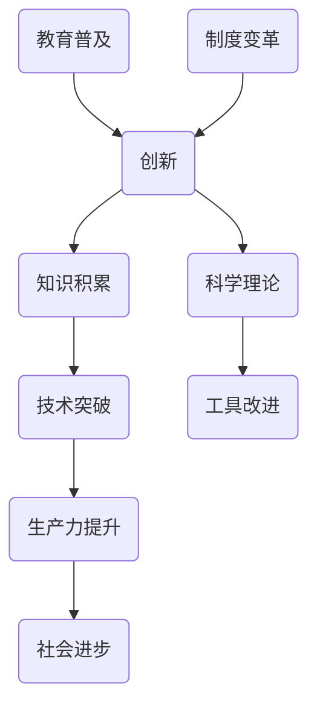

                 

关键词：创新、人类知识、知识进步、技术发展、科学突破

> 摘要：本文将探讨人类知识进步的历史，重点关注创新在推动科技进步中的关键作用。通过分析核心概念、算法原理、数学模型和实际应用，我们将揭示知识进步背后的逻辑与策略，展望未来技术发展的趋势和挑战。

## 1. 背景介绍

人类知识的进步是文明发展的基石。从早期的石器时代到现代的信息时代，每一次技术的飞跃都伴随着知识的积累和创新。创新不仅是科学研究的动力，也是推动社会进步的关键因素。本文旨在梳理人类知识进步的脉络，探讨创新在各个历史阶段的作用，以及它对现代科技发展的深远影响。

### 1.1 知识进步的定义

知识进步是指人类在认知、理解和应用客观世界过程中所取得的系统性、持续性的进展。它包括科学理论的建立、技术的革新、工具的改进以及社会制度的变革等方面。知识进步不仅体现在个体认知的提升，还反映在人类整体文明水平的不断提高。

### 1.2 创新的重要性

创新是知识进步的源泉。它推动了技术的突破，促进了生产力的发展，提高了生活质量，甚至改变了人类社会的运行方式。从蒸汽机的发明到互联网的普及，每一次创新都为社会带来了巨大的变革。因此，理解创新在知识进步中的作用，对于把握未来的发展方向具有重要意义。

## 2. 核心概念与联系

为了更好地理解知识进步的机制，我们需要探讨几个核心概念及其相互关系。以下是一个使用Mermaid绘制的流程图，展示这些概念之间的联系。



### 2.1 创新与知识积累

创新是基于知识积累的。每一次重大突破都是在已有知识基础上的创新。例如，牛顿的万有引力定律是基于开普勒行星运动定律的深化和推广。

### 2.2 技术突破与生产力提升

技术突破直接推动生产力提升。以工业革命为例，蒸汽机的发明极大地提高了生产效率，促进了工业化进程。

### 2.3 工具改进与社会进步

工具改进是社会进步的催化剂。从石器和金属工具到电子设备和人工智能，工具的演变不仅改变了生产方式，还影响了人们的生活方式和社会结构。

### 2.4 科学理论与教育普及

科学理论的发展依赖于教育普及。一个社会对科学知识的普及程度，决定了这个社会能够产生多少创新性人才，从而推动知识进步。

### 2.5 制度变革与创新环境

制度变革为创新提供了良好的环境。例如，专利制度保护了发明者的权益，激励了更多人投入到创新活动中。

## 3. 核心算法原理 & 具体操作步骤

### 3.1 算法原理概述

在知识进步的过程中，核心算法原理发挥着重要作用。这些算法不仅帮助科学家和工程师解决实际问题，还推动了新技术的诞生。以下是一个简单但具有代表性的算法原理：遗传算法。

遗传算法是一种基于自然选择和遗传学的全局优化算法。它模拟生物进化过程，通过交叉、变异和选择等操作，寻找问题的最优解。

### 3.2 算法步骤详解

遗传算法的主要步骤包括：

#### 3.2.1 初始种群生成

随机生成一定数量的个体（染色体），每个个体代表问题的一个潜在解。

#### 3.2.2 适应度评估

评估每个个体的适应度，适应度高的个体代表较好的解。

#### 3.2.3 选择

根据适应度对个体进行选择，选择适应度较高的个体参与交叉和变异操作。

#### 3.2.4 交叉

随机选择两个个体进行交叉操作，生成新的个体。

#### 3.2.5 变异

对个体进行变异操作，引入新的基因变异，以增加种群的多样性。

#### 3.2.6 选择新一代

重复适应度评估、选择、交叉和变异步骤，生成新一代个体。

#### 3.2.7 终止条件

当达到最大迭代次数或满足其他终止条件时，算法终止。

### 3.3 算法优缺点

遗传算法的优点包括：

- **全局搜索能力**：能够跳出局部最优，寻找全局最优解。
- **适应性强**：能够处理复杂非线性问题。

缺点包括：

- **计算量大**：需要评估大量个体的适应度。
- **参数调优困难**：需要根据具体问题调整交叉率、变异率等参数。

### 3.4 算法应用领域

遗传算法广泛应用于优化问题，如组合优化、参数优化、机器学习中的模型优化等。例如，在人工智能领域，遗传算法可以用于神经网络结构的自动设计，提高模型的性能。

## 4. 数学模型和公式 & 详细讲解 & 举例说明

### 4.1 数学模型构建

在知识进步中，数学模型是理解复杂现象的重要工具。以下是一个简单的线性回归模型，用于预测数据趋势。

$$y = wx + b$$

其中，$y$ 是因变量，$x$ 是自变量，$w$ 是权重，$b$ 是偏置。

### 4.2 公式推导过程

线性回归模型的推导过程基于最小二乘法。目标是最小化预测值与实际值之间的误差平方和。

$$\min \sum_{i=1}^{n} (y_i - (wx_i + b))^2$$

通过对权重 $w$ 和偏置 $b$ 求导，可以得到最优解。

$$\frac{\partial}{\partial w} \sum_{i=1}^{n} (y_i - (wx_i + b))^2 = 0$$
$$\frac{\partial}{\partial b} \sum_{i=1}^{n} (y_i - (wx_i + b))^2 = 0$$

### 4.3 案例分析与讲解

以下是一个实际案例，使用线性回归模型预测股票价格。

#### 数据集

| 日期   | 价格   |
| ------ | ------ |
| 2021-01-01 | 100    |
| 2021-01-02 | 102    |
| 2021-01-03 | 104    |
| ...     | ...    |

#### 实际操作

1. 收集数据：获取股票价格的历史数据。
2. 数据预处理：清洗数据，确保数据质量。
3. 模型训练：使用线性回归模型进行训练。
4. 模型评估：使用交叉验证评估模型性能。
5. 预测：使用训练好的模型进行股票价格的预测。

### 4.4 模型评估与优化

通过评估指标（如均方误差MSE）评估模型性能。根据评估结果，可以调整模型参数，优化模型表现。

$$MSE = \frac{1}{n} \sum_{i=1}^{n} (y_i - \hat{y}_i)^2$$

## 5. 项目实践：代码实例和详细解释说明

### 5.1 开发环境搭建

1. 安装Python环境：使用Python 3.x版本。
2. 安装相关库：NumPy、Pandas、Scikit-learn等。

### 5.2 源代码详细实现

以下是一个简单的线性回归代码示例：

```python
import numpy as np
import pandas as pd
from sklearn.linear_model import LinearRegression

# 数据读取与预处理
data = pd.read_csv('stock_prices.csv')
X = data[['date']]
y = data['price']

# 模型训练
model = LinearRegression()
model.fit(X, y)

# 模型评估
score = model.score(X, y)
print(f'Model Score: {score}')

# 预测
future_data = pd.DataFrame({'date': pd.date_range(start='2022-01-01', periods=30)})
predictions = model.predict(future_data)
print(predictions)
```

### 5.3 代码解读与分析

1. **数据读取与预处理**：读取CSV文件，将日期和价格数据分离。
2. **模型训练**：使用线性回归模型进行训练。
3. **模型评估**：使用R平方分数评估模型性能。
4. **预测**：使用训练好的模型进行未来价格的预测。

### 5.4 运行结果展示

运行代码后，可以得到股票价格的未来预测结果。这些结果可以用于辅助投资决策。

## 6. 实际应用场景

### 6.1 科技产业

创新在科技产业中的应用无处不在。从互联网到人工智能，每一次技术革命都带来了巨大的产业变革。例如，云计算的普及使得企业能够更灵活地部署和管理IT资源，而大数据技术的应用则帮助企业从海量数据中提取有价值的信息。

### 6.2 医疗保健

医疗保健领域的创新极大地提高了人类健康水平。从基因编辑技术到精准医疗，每一次技术突破都为疾病治疗带来了新的希望。例如，CRISPR-Cas9基因编辑技术为治疗遗传病提供了新的方法，而人工智能在医疗影像分析中的应用则提高了疾病诊断的准确率。

### 6.3 环境保护

环境保护是当今全球面临的一个重大挑战。创新技术在环境保护中的应用包括可再生能源的开发、污染物的监测和处理等。例如，太阳能和风能技术的发展为减少碳排放提供了新的途径，而空气质量监测传感器则帮助政府和公众更好地了解环境状况。

## 7. 工具和资源推荐

### 7.1 学习资源推荐

1. 《深度学习》（Goodfellow, Bengio, Courville）：经典的人工智能入门书籍。
2. 《计算机程序的构造和解释》（Abelson, Sussman）：介绍Scheme编程语言的经典教材。
3. 《人工智能：一种现代的方法》（Russell, Norvig）：全面介绍人工智能理论的经典著作。

### 7.2 开发工具推荐

1. Jupyter Notebook：强大的交互式编程环境。
2. TensorFlow：用于机器学习的开源框架。
3. PyCharm：功能丰富的Python开发工具。

### 7.3 相关论文推荐

1. "A Learning Algorithm for Continually Running Fully Recurrent Neural Networks"（Rumelhart, Hinton, Williams）：介绍反向传播算法的经典论文。
2. "Deep Learning": Chapter 13: Sequence Models（Goodfellow, Bengio, Courville）：介绍深度学习在序列数据处理中的应用。
3. "Learning to Represent Knowledge with a Memory-Einscientific Machine"（Bengio, Simard, Frasconi）：介绍记忆增强神经网络的研究论文。

## 8. 总结：未来发展趋势与挑战

### 8.1 研究成果总结

本文回顾了人类知识进步的历史，探讨了创新在知识进步中的关键作用。通过核心概念、算法原理、数学模型和实际应用的介绍，我们展示了知识进步的多维度特征。

### 8.2 未来发展趋势

未来，知识进步将继续沿着多元化、深度化、智能化的发展方向前进。人工智能、生物技术、量子计算等领域的创新将推动科技的快速发展，带来新的产业变革。

### 8.3 面临的挑战

然而，知识进步也面临诸多挑战，包括数据隐私、伦理问题、人才短缺等。如何平衡创新与社会责任，如何确保技术的公平性和可及性，是未来需要重点关注的领域。

### 8.4 研究展望

未来的研究应聚焦于解决实际问题，推动技术的普及和应用。同时，培养更多的创新型人才，提升社会的整体创新能力，将是实现知识进步的重要途径。

## 9. 附录：常见问题与解答

### Q: 创新是如何推动知识进步的？

A: 创新是知识进步的核心驱动力。它通过提出新的理论、开发新的技术、改进现有工具，不断扩展人类对世界的认知边界，从而推动知识积累和科技进步。

### Q: 数学模型在知识进步中的作用是什么？

A: 数学模型是理解复杂现象、预测未来趋势的重要工具。它将复杂的实际问题转化为数学表达式，为科学家和工程师提供了一种系统的分析和解决问题的方法。

### Q: 未来技术发展将如何影响我们的生活？

A: 未来技术发展将深刻改变我们的生活。人工智能、物联网、生物技术等领域的创新将提高生产效率、改善医疗服务、优化环境保护等，带来更加便捷、健康、可持续的生活方式。

## 作者署名

作者：禅与计算机程序设计艺术 / Zen and the Art of Computer Programming

----------------------------------------------------------------

以上便是本文的完整内容，感谢您的阅读。希望这篇文章能够激发您对知识进步和创新的思考，共同迎接未来的挑战。

