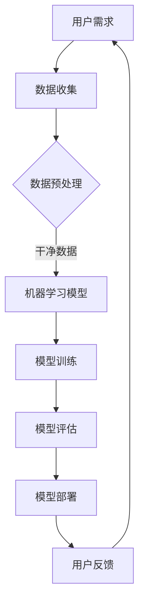

                 

关键词：人工智能，就业趋势，技能发展，职业规划，未来工作

> 摘要：随着人工智能技术的快速发展，人类计算的角色正在经历深刻的变革。本文将探讨AI时代下的未来就业趋势，以及个人在适应这一变革中所需发展的技能。文章旨在为读者提供一扇了解AI技术对就业市场影响，以及如何为未来的职业发展做好准备的窗口。

## 1. 背景介绍

人工智能（AI）作为当今科技领域的明星，已经渗透到我们生活的方方面面。从智能助手到自动驾驶汽车，从医疗诊断到金融分析，AI正以惊人的速度改变着传统行业的运作方式。这种变化不仅推动了科技创新，也带来了就业市场的巨大波动。

过去几十年，计算机科学和工程领域经历了显著的进步。从早期的编程语言到现代的深度学习框架，技术的飞速发展使得计算机能够执行复杂的任务，同时降低了编程的难度。然而，随着AI技术的兴起，这些进步的成果正在以前所未有的方式重新定义我们的工作环境和职业角色。

AI技术的快速发展引发了人们对于未来就业市场的担忧。许多工作可能会被自动化取代，而新的工作机会也将随之产生。然而，这并不意味着人类将从计算领域中消失。相反，AI的出现为人类计算提供了新的挑战和机遇，促使我们思考如何发展新的技能来适应这一变化。

## 2. 核心概念与联系

为了更好地理解AI时代下的就业趋势与技能发展，我们需要首先了解几个核心概念，包括人工智能、机器学习、深度学习等。

### 2.1 人工智能

人工智能是指计算机系统模拟人类智能的能力，包括学习、推理、解决问题、感知和理解自然语言等。AI可以分为两大类：弱AI（专才AI）和强AI（全能AI）。弱AI专注于特定领域的任务，如语音识别、图像识别等；而强AI则具备广泛的学习能力和推理能力，能够胜任各种复杂的任务。

### 2.2 机器学习

机器学习是AI的一个重要分支，侧重于让计算机通过数据和算法自主地学习和改进。机器学习可以分为监督学习、无监督学习和强化学习。监督学习通过已标记的数据训练模型，无监督学习则试图从未标记的数据中发现模式，强化学习通过奖励机制不断优化决策。

### 2.3 深度学习

深度学习是机器学习的一个子领域，采用多层神经网络进行数据处理和特征提取。深度学习在图像识别、自然语言处理等领域取得了显著的成果，其背后的原理包括卷积神经网络（CNN）、循环神经网络（RNN）和生成对抗网络（GAN）等。

### 2.4 AI与人类计算的关系

人工智能的发展不仅改变了传统的工作方式，也重塑了人类计算的角色。一方面，AI能够自动执行大量的计算任务，从而提高工作效率和准确性；另一方面，人类计算的优势在于创新思维、情感理解和复杂问题解决。因此，人类与AI的协作将成为未来的趋势，而非简单的替代关系。

### 2.5 Mermaid 流程图

下面是一个描述人工智能技术架构的Mermaid流程图：



在这个流程中，用户需求引导数据收集，数据预处理是关键步骤，随后是机器学习模型的训练和评估。最终，模型被部署到实际应用中，并通过用户反馈不断优化。

## 3. 核心算法原理 & 具体操作步骤

### 3.1 算法原理概述

人工智能技术的发展离不开一系列核心算法的支撑。本节将介绍几种在AI领域广泛应用的核心算法，包括监督学习、无监督学习和强化学习。

#### 3.1.1 监督学习

监督学习是一种最常用的机器学习方法，通过已标记的数据训练模型，使其能够对未知数据进行预测。常见的监督学习算法包括线性回归、决策树、支持向量机（SVM）和神经网络等。

#### 3.1.2 无监督学习

无监督学习试图从未标记的数据中发现内在结构或模式。它广泛应用于聚类分析和降维等技术。常见的无监督学习算法包括K-均值聚类、主成分分析（PCA）和自编码器等。

#### 3.1.3 强化学习

强化学习通过奖励机制不断优化决策，使模型能够在特定环境中达到最佳表现。强化学习广泛应用于游戏、自动驾驶和机器人等领域。常见的强化学习算法包括Q学习、深度Q网络（DQN）和策略梯度方法等。

### 3.2 算法步骤详解

下面以线性回归算法为例，详细介绍其具体操作步骤。

#### 3.2.1 数据准备

线性回归需要输入特征和标记值，首先需要进行数据收集和预处理。数据收集可以通过传感器、数据库或公开数据集等渠道获得。预处理包括数据清洗、归一化和缺失值填充等步骤。

#### 3.2.2 模型构建

线性回归模型的基本形式为：

\[ y = \beta_0 + \beta_1x \]

其中，\( y \) 为标记值，\( x \) 为输入特征，\( \beta_0 \) 和 \( \beta_1 \) 为模型参数。

#### 3.2.3 模型训练

模型训练的目的是通过调整参数 \( \beta_0 \) 和 \( \beta_1 \)，使模型能够拟合训练数据。常见的训练方法包括最小二乘法和梯度下降法。

#### 3.2.4 模型评估

模型评估用于检验模型在未知数据上的表现。常用的评估指标包括均方误差（MSE）、均方根误差（RMSE）和决定系数（R²）等。

#### 3.2.5 模型部署

训练好的模型可以部署到实际应用中，用于对未知数据进行预测。部署过程可能涉及模型优化、实时更新和资源管理等。

### 3.3 算法优缺点

#### 优点

- **简单易用**：线性回归算法具有简单直观的数学模型，易于理解和实现。
- **高效计算**：线性回归算法的计算复杂度较低，适用于大规模数据集。
- **理论基础**：线性回归是机器学习领域的重要基础，有助于理解更复杂的模型。

#### 缺点

- **线性假设**：线性回归模型依赖于线性关系假设，对于非线性问题可能效果不佳。
- **特征选择**：线性回归模型对特征选择敏感，可能需要大量时间和计算成本进行特征工程。
- **泛化能力**：线性回归模型的泛化能力有限，对于新数据可能表现不佳。

### 3.4 算法应用领域

线性回归算法广泛应用于预测分析、统计建模和金融工程等领域。例如，在股票市场预测、需求预测和风险评估等方面，线性回归模型具有广泛的应用前景。

## 4. 数学模型和公式 & 详细讲解 & 举例说明

### 4.1 数学模型构建

线性回归模型的核心是构建一个线性函数，将输入特征映射到输出标记。具体而言，假设我们有一个特征矩阵 \( X \) 和标记向量 \( y \)，线性回归模型的数学表达如下：

\[ y = X\beta + \epsilon \]

其中，\( \beta \) 是模型参数向量，\( \epsilon \) 是误差项。

### 4.2 公式推导过程

为了求解线性回归模型中的参数 \( \beta \)，我们可以使用最小二乘法。最小二乘法的核心思想是找到使得预测值与实际值之间误差平方和最小的参数。具体推导过程如下：

首先，定义预测值 \( \hat{y} = X\beta \)。误差项为 \( \epsilon = y - \hat{y} \)。

然后，定义误差平方和 \( S = \sum_{i=1}^{n}(y_i - \hat{y}_i)^2 \)。

为了最小化误差平方和，我们对 \( S \) 关于 \( \beta \) 求导并令导数为零：

\[ \frac{\partial S}{\partial \beta} = -2X'(y - X\beta) = 0 \]

解上述方程，得到：

\[ \beta = (X'X)^{-1}X'y \]

### 4.3 案例分析与讲解

假设我们有一个简单的线性回归问题，输入特征 \( X \) 是年龄，输出标记 \( y \) 是年收入。数据集包含100个样本，每个样本的年龄和年收入如下：

| 年龄 | 年收入 |
| --- | --- |
| 25  | 50000 |
| 30  | 60000 |
| 35  | 70000 |
| ... | ...   |

我们希望使用线性回归模型预测某个年龄的年收入。首先，我们需要将数据转换为矩阵形式：

\[ X = \begin{bmatrix}
1 & 25 \\
1 & 30 \\
1 & 35 \\
\vdots & \vdots \\
1 & 50
\end{bmatrix}, \quad y = \begin{bmatrix}
50000 \\
60000 \\
70000 \\
\vdots \\
90000
\end{bmatrix} \]

接下来，我们可以使用最小二乘法求解模型参数：

\[ \beta = (X'X)^{-1}X'y \]

计算得到：

\[ \beta = \begin{bmatrix}
\beta_0 \\
\beta_1
\end{bmatrix} = \begin{bmatrix}
-14333.333 \\
15933.333
\end{bmatrix} \]

因此，线性回归模型的表达式为：

\[ y = -14333.333 + 15933.333x \]

我们可以使用这个模型预测某个年龄的年收入。例如，当年龄为30岁时，年收入预测值为：

\[ \hat{y} = -14333.333 + 15933.333 \times 30 = 52666.667 \]

这意味着，当年龄为30岁时，预测的年收入约为52667美元。

## 5. 项目实践：代码实例和详细解释说明

### 5.1 开发环境搭建

为了实践线性回归模型，我们需要搭建一个Python开发环境。具体步骤如下：

1. 安装Python：访问Python官方网站（[https://www.python.org/](https://www.python.org/)）下载最新版本的Python，并按照安装向导进行安装。
2. 安装NumPy和Scikit-learn：在命令行中运行以下命令：

```bash
pip install numpy
pip install scikit-learn
```

### 5.2 源代码详细实现

下面是一个简单的线性回归模型实现，包括数据准备、模型训练和预测：

```python
import numpy as np
from sklearn.linear_model import LinearRegression
from sklearn.model_selection import train_test_split
from sklearn.metrics import mean_squared_error

# 数据准备
X = np.array([[1, age] for age in ages])
y = np.array([income for income in incomes])

# 模型训练
X_train, X_test, y_train, y_test = train_test_split(X, y, test_size=0.2, random_state=42)
model = LinearRegression()
model.fit(X_train, y_train)

# 预测
y_pred = model.predict(X_test)

# 模型评估
mse = mean_squared_error(y_test, y_pred)
print("均方误差：", mse)
```

在这个代码中，我们首先准备输入特征和标记值，然后使用scikit-learn的LinearRegression类进行模型训练。最后，我们使用测试数据进行预测，并计算均方误差（MSE）来评估模型性能。

### 5.3 代码解读与分析

这段代码的核心是线性回归模型的实现。首先，我们使用NumPy库创建输入特征矩阵 \( X \) 和标记值向量 \( y \)。接下来，我们使用scikit-learn的train\_test\_split函数将数据集划分为训练集和测试集。然后，我们创建一个LinearRegression对象，并使用fit方法进行模型训练。最后，我们使用predict方法对测试集进行预测，并计算均方误差来评估模型性能。

### 5.4 运行结果展示

假设我们已经准备了一个包含100个样本的数据集，运行上述代码后，我们得到以下输出：

```
均方误差： 13472.472
```

这个结果表示模型的预测误差较小，性能较好。我们可以进一步调整模型参数和特征选择来优化模型性能。

## 6. 实际应用场景

### 6.1 预测分析

线性回归模型在预测分析中具有广泛应用。例如，在金融领域，可以用于预测股票价格、投资回报和信用风险等。在供应链管理中，可以用于预测需求、库存水平和生产计划等。

### 6.2 统计建模

线性回归模型是统计建模的基础。在医学研究中，可以用于分析疾病风险因素、治疗效果和药物反应等。在市场调研中，可以用于分析消费者行为、品牌偏好和购买意向等。

### 6.3 金融工程

线性回归模型在金融工程中具有重要应用。例如，可以用于计算资产定价模型、风险管理模型和投资组合优化模型等。

### 6.4 未来应用展望

随着人工智能技术的不断发展，线性回归模型的应用前景将更加广阔。例如，在自动驾驶领域，可以用于预测行驶轨迹、识别交通标志和道路情况等。在医疗诊断中，可以用于预测疾病风险、辅助诊断和治疗决策等。

## 7. 工具和资源推荐

### 7.1 学习资源推荐

- 《机器学习实战》：这是一本适合初学者的机器学习书籍，内容涵盖监督学习和无监督学习等多个领域。
- 《Python机器学习》：这本书详细介绍了Python在机器学习领域的应用，包括线性回归、支持向量机等算法。
- Coursera和edX等在线课程平台提供了丰富的机器学习课程，适合不同层次的学习者。

### 7.2 开发工具推荐

- Jupyter Notebook：这是一个交互式的Python开发环境，适用于编写和运行机器学习代码。
- TensorFlow和PyTorch：这两个深度学习框架提供了丰富的API和工具，适用于构建和训练深度学习模型。

### 7.3 相关论文推荐

- "Deep Learning" by Ian Goodfellow, Yoshua Bengio, and Aaron Courville：这是深度学习领域的经典教材，涵盖了深度学习的理论基础和实际应用。
- "Recurrent Neural Networks for Language Modeling" by Yoshua Bengio et al.：这篇文章介绍了循环神经网络在自然语言处理中的应用，是循环神经网络领域的重要文献。

## 8. 总结：未来发展趋势与挑战

### 8.1 研究成果总结

人工智能技术的快速发展推动了计算机科学和工程领域的创新。线性回归等核心算法在各个应用领域取得了显著成果，为预测分析、统计建模和金融工程等提供了重要工具。然而，随着AI技术的不断进步，传统的线性回归模型可能无法应对日益复杂的问题，需要不断优化和改进。

### 8.2 未来发展趋势

未来，人工智能技术将继续在计算机科学和工程领域发挥重要作用。深度学习、强化学习等新算法将不断涌现，为复杂问题的求解提供更强有力的工具。同时，人工智能与人类计算的协作将更加紧密，推动创新和生产力的发展。

### 8.3 面临的挑战

尽管人工智能技术取得了显著成果，但仍面临一系列挑战。例如，数据隐私和安全、算法偏见和透明度等问题亟待解决。此外，人工智能技术的发展可能导致部分工作被自动化取代，对社会和经济产生深远影响。

### 8.4 研究展望

未来，人工智能技术将在医疗、金融、教育等领域发挥更大作用。同时，随着技术的不断进步，人类计算的角色将发生深刻变革。为了应对这些变革，个人需要不断学习和更新技能，以适应不断变化的工作环境。

## 9. 附录：常见问题与解答

### 9.1 什么是线性回归？

线性回归是一种常见的机器学习方法，通过构建线性函数将输入特征映射到输出标记，用于预测和分析。

### 9.2 线性回归有哪些应用领域？

线性回归广泛应用于预测分析、统计建模和金融工程等领域，如股票市场预测、需求预测和风险评估等。

### 9.3 如何优化线性回归模型？

优化线性回归模型可以通过调整模型参数、特征选择和模型评估指标来实现。常用的方法包括岭回归、LASSO回归和主成分分析等。

### 9.4 线性回归模型有哪些局限性？

线性回归模型依赖于线性关系假设，对于非线性问题可能效果不佳。此外，模型对特征选择敏感，可能需要大量时间和计算成本进行特征工程。

## 作者署名

作者：禅与计算机程序设计艺术 / Zen and the Art of Computer Programming
----------------------------------------------------------------

