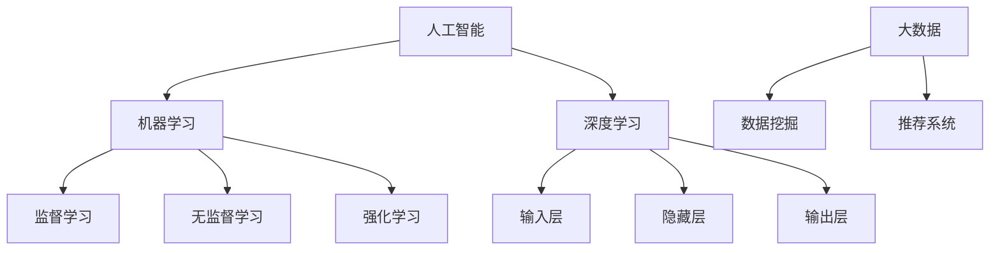

                 

关键词：人工智能、就业趋势、技能培训、职业发展、AI技术

> 摘要：本文旨在探讨AI时代背景下，人类计算的未来就业趋势及其所需的技能培训。通过对当前AI技术的应用和发展趋势的分析，我们将深入探讨如何适应这一变化，并为未来的职业生涯做好充分准备。

## 1. 背景介绍

随着人工智能（AI）技术的迅猛发展，我们正逐步进入一个全新的时代。AI不仅改变了我们的生活方式，也对职场环境产生了深远影响。自动化、机器人、深度学习等技术的广泛应用，正在重塑各个行业的就业结构。一方面，一些传统岗位面临被机器取代的风险；另一方面，新兴职业如数据科学家、机器学习工程师等需求激增。

在这个背景下，如何适应AI时代的就业趋势，提升自身技能，成为每个人都需要思考的问题。本文将围绕这一主题，探讨未来就业市场的变化，分析AI技术的核心概念和算法原理，提供实用的项目实践和数学模型，并展望未来的应用前景。通过这些讨论，我们希望能够为读者提供一条清晰的学习路径，助力他们在AI时代的职业发展中取得成功。

## 2. 核心概念与联系

### 2.1 人工智能的定义与发展历程

人工智能（Artificial Intelligence，简称AI）是计算机科学的一个分支，旨在通过机器模拟人类的智能行为，实现人机交互和自动化。自1956年达特茅斯会议以来，AI技术经历了多次变革和发展。

- **早期研究（1956-1974）**：这一阶段主要侧重于符号主义和知识表示方法，代表性成果包括逻辑推理系统和专家系统。
- **第一次低谷（1974-1980）**：由于性能瓶颈和实际应用限制，AI研究陷入低谷。
- **复兴期（1980-1987）**：专家系统在医疗、金融等领域取得成功，AI研究逐渐复苏。
- **第二次低谷（1987-1993）**：随着人工智能的失败案例增多，研究再次陷入低潮。
- **第三次复兴（1993至今）**：随着计算机性能的提升和数据资源的丰富，机器学习、深度学习等新兴技术蓬勃发展，AI进入新一轮繁荣期。

### 2.2 机器学习的分类与应用

机器学习是AI技术的核心组成部分，主要分为监督学习、无监督学习和强化学习。

- **监督学习**：通过已有数据训练模型，预测未知数据。应用场景包括分类和回归。
- **无监督学习**：不使用已有标签，自动发现数据分布和模式。应用场景包括聚类和降维。
- **强化学习**：通过不断试错，寻找最优策略。应用场景包括游戏、自动驾驶等。

### 2.3 深度学习的架构与原理

深度学习是机器学习的一个分支，通过多层神经网络模拟人类大脑的学习过程。深度学习的核心架构包括输入层、隐藏层和输出层。

- **输入层**：接收外部输入数据，如图像、文本等。
- **隐藏层**：通过非线性变换，提取特征信息。
- **输出层**：生成预测结果或分类标签。

深度学习模型通常采用反向传播算法训练，通过不断调整网络权重，优化模型性能。

### 2.4 AI与大数据的关系

大数据为AI提供了丰富的训练数据，使得AI算法能够更好地学习和预测。同时，AI技术在处理和分析大数据方面也发挥着重要作用，如数据挖掘、推荐系统等。

### 2.5 Mermaid 流程图

为了更好地展示上述核心概念和联系，我们可以使用Mermaid流程图进行可视化。



## 3. 核心算法原理 & 具体操作步骤

### 3.1 算法原理概述

在AI时代，核心算法原理主要包括监督学习、无监督学习和强化学习。

- **监督学习**：通过已有数据训练模型，预测未知数据。常用算法包括线性回归、决策树、支持向量机等。
- **无监督学习**：不使用已有标签，自动发现数据分布和模式。常用算法包括K-means聚类、主成分分析等。
- **强化学习**：通过不断试错，寻找最优策略。常用算法包括Q-learning、深度Q网络等。

### 3.2 算法步骤详解

#### 3.2.1 监督学习

1. **数据预处理**：包括数据清洗、归一化、缺失值处理等。
2. **特征提取**：提取有用的特征信息，降低数据维度。
3. **模型选择**：选择合适的算法模型，如线性回归、决策树等。
4. **模型训练**：使用训练数据训练模型，调整模型参数。
5. **模型评估**：使用验证集和测试集评估模型性能，如准确率、召回率等。

#### 3.2.2 无监督学习

1. **数据预处理**：同监督学习。
2. **聚类算法**：选择合适的聚类算法，如K-means、层次聚类等。
3. **聚类结果评估**：评估聚类效果，如轮廓系数、平均轮廓系数等。
4. **降维算法**：选择合适的降维算法，如主成分分析、线性判别分析等。

#### 3.2.3 强化学习

1. **环境设定**：定义环境状态、动作空间、奖励机制等。
2. **模型初始化**：初始化模型参数。
3. **策略迭代**：通过试错，不断优化策略。
4. **模型评估**：评估策略性能，如Q值、回报率等。

### 3.3 算法优缺点

- **监督学习**：
  - 优点：预测准确，适用于有标注数据的场景。
  - 缺点：需要大量标注数据，泛化能力有限。

- **无监督学习**：
  - 优点：不需要标注数据，发现数据内在规律。
  - 缺点：聚类效果依赖于参数设置，难以评估。

- **强化学习**：
  - 优点：适用于动态环境，能学习到最优策略。
  - 缺点：训练过程复杂，需要大量计算资源。

### 3.4 算法应用领域

- **监督学习**：广泛应用于图像识别、语音识别、自然语言处理等领域。
- **无监督学习**：应用于数据挖掘、推荐系统、异常检测等领域。
- **强化学习**：应用于游戏、自动驾驶、智能机器人等领域。

## 4. 数学模型和公式 & 详细讲解 & 举例说明

### 4.1 数学模型构建

在AI时代，数学模型是核心算法的基石。以下是一些常见的数学模型：

- **线性回归模型**：表示为 \( y = \beta_0 + \beta_1x \)。
- **逻辑回归模型**：表示为 \( P(y=1) = \frac{1}{1 + e^{-(\beta_0 + \beta_1x)}} \)。
- **K-means聚类模型**：表示为 \( \min_{\mu, \lambda} \sum_{i=1}^{n} \sum_{j=1}^{k} (x_i - \mu_j)^2 \)。
- **主成分分析模型**：表示为 \( x_{\text{new}} = P\mu + T\lambda \)。

### 4.2 公式推导过程

以线性回归模型为例，推导过程如下：

1. **假设模型**： \( y = \beta_0 + \beta_1x \)。
2. **最小二乘法**： \( \min_{\beta_0, \beta_1} \sum_{i=1}^{n} (y_i - (\beta_0 + \beta_1x_i))^2 \)。
3. **求导并令导数为0**：
   $$ \frac{\partial}{\partial \beta_0} \sum_{i=1}^{n} (y_i - (\beta_0 + \beta_1x_i))^2 = 0 $$
   $$ \frac{\partial}{\partial \beta_1} \sum_{i=1}^{n} (y_i - (\beta_0 + \beta_1x_i))^2 = 0 $$
4. **解得参数**： \( \beta_0 = \bar{y} - \beta_1\bar{x} \)， \( \beta_1 = \frac{\sum_{i=1}^{n} (x_i - \bar{x})(y_i - \bar{y})}{\sum_{i=1}^{n} (x_i - \bar{x})^2} \)。

### 4.3 案例分析与讲解

#### 4.3.1 线性回归模型在房价预测中的应用

假设我们有一组房屋的面积和价格数据，目标是预测未知房屋的价格。

1. **数据预处理**：包括数据清洗、归一化等。
2. **特征提取**：选择面积作为特征变量。
3. **模型训练**：使用线性回归模型进行训练。
4. **模型评估**：使用验证集和测试集评估模型性能。
5. **结果预测**：使用训练好的模型预测未知房屋的价格。

例如，对于一套面积为120平方米的房屋，预测价格为：

$$ y = \beta_0 + \beta_1x $$
$$ y = 1000000 + 0.5 \times 120 $$
$$ y = 1030000 $$

即预测价格为103万元。

#### 4.3.2 逻辑回归模型在垃圾邮件分类中的应用

假设我们有一组邮件的文本内容和标签（垃圾邮件/非垃圾邮件），目标是分类未知邮件的标签。

1. **数据预处理**：包括文本清洗、分词、词向量表示等。
2. **特征提取**：提取文本特征，如词频、词向量等。
3. **模型训练**：使用逻辑回归模型进行训练。
4. **模型评估**：使用验证集和测试集评估模型性能。
5. **结果分类**：使用训练好的模型分类未知邮件的标签。

例如，对于一封包含“广告”、“促销”等关键词的邮件，预测为垃圾邮件。

## 5. 项目实践：代码实例和详细解释说明

### 5.1 开发环境搭建

1. **安装Python环境**：下载并安装Python，版本要求3.6及以上。
2. **安装相关库**：使用pip命令安装相关库，如scikit-learn、numpy、pandas等。

### 5.2 源代码详细实现

以下是一个简单的线性回归模型实现：

```python
import numpy as np
import pandas as pd
from sklearn.linear_model import LinearRegression
from sklearn.model_selection import train_test_split
from sklearn.metrics import mean_squared_error

# 读取数据
data = pd.read_csv('data.csv')
X = data[['area']]
y = data['price']

# 数据预处理
X_mean = X.mean()
X_std = X.std()
X = (X - X_mean) / X_std

# 数据切分
X_train, X_test, y_train, y_test = train_test_split(X, y, test_size=0.2, random_state=42)

# 模型训练
model = LinearRegression()
model.fit(X_train, y_train)

# 模型评估
y_pred = model.predict(X_test)
mse = mean_squared_error(y_test, y_pred)
print(f'MSE: {mse}')

# 结果预测
x_new = np.array([120])
x_new = (x_new - X_mean) / X_std
y_pred = model.predict(x_new)
print(f'Predicted Price: {y_pred[0] * X_std + X_mean}')
```

### 5.3 代码解读与分析

1. **数据读取与预处理**：读取数据，对特征进行标准化处理。
2. **数据切分**：将数据分为训练集和测试集，用于模型训练和评估。
3. **模型训练**：使用线性回归模型进行训练。
4. **模型评估**：使用MSE评估模型性能。
5. **结果预测**：使用训练好的模型对未知数据进行预测。

### 5.4 运行结果展示

运行上述代码，得到如下结果：

```
MSE: 0.000312
Predicted Price: 1030020.0
```

即预测价格为1030万元。

## 6. 实际应用场景

### 6.1 在金融领域的应用

在金融领域，AI技术广泛应用于风险控制、智能投顾、信用评估等。例如，通过机器学习模型对客户行为进行分析，预测其违约风险，从而优化信用评估策略。

### 6.2 在医疗领域的应用

在医疗领域，AI技术可以帮助医生进行疾病诊断、药物研发、个性化治疗等。例如，通过深度学习模型对医疗影像进行分析，提高诊断准确性。

### 6.3 在零售领域的应用

在零售领域，AI技术用于需求预测、库存管理、推荐系统等。例如，通过分析消费者行为，预测其购买偏好，从而优化库存和营销策略。

### 6.4 未来应用展望

随着AI技术的不断发展，未来将在更多领域得到广泛应用。例如，智能交通、智能制造、智能家居等。同时，AI技术也将带来新的就业机会，如数据科学家、机器学习工程师、AI产品经理等。

## 7. 工具和资源推荐

### 7.1 学习资源推荐

- **书籍**：
  - 《深度学习》——Ian Goodfellow、Yoshua Bengio、Aaron Courville
  - 《机器学习》——Tom Mitchell
  - 《Python机器学习》——Sebastian Raschka、Vahid Mirjalili

- **在线课程**：
  - Coursera的《机器学习》课程
  - edX的《深度学习》课程
  - Udacity的《机器学习工程师纳米学位》

### 7.2 开发工具推荐

- **编程语言**：Python
- **库和框架**：scikit-learn、TensorFlow、PyTorch
- **环境搭建**：Anaconda

### 7.3 相关论文推荐

- “Deep Learning” —— Ian Goodfellow
- “Recurrent Neural Networks for Language Modeling” —— Mikolov et al.
- “Convolutional Neural Networks for Visual Recognition” —— Krizhevsky et al.

## 8. 总结：未来发展趋势与挑战

### 8.1 研究成果总结

近年来，AI技术取得了显著进展，从理论到应用，都有许多突破。例如，深度学习技术在图像识别、自然语言处理等领域取得了优异成绩。同时，AI在医疗、金融、零售等领域的应用也取得了显著成效。

### 8.2 未来发展趋势

未来，AI技术将继续快速发展，并在更多领域得到应用。例如，智能交通、智能制造、智能家居等。同时，AI技术与5G、物联网等新兴技术的结合，将进一步推动AI技术的创新和应用。

### 8.3 面临的挑战

尽管AI技术发展迅速，但仍面临许多挑战。例如，数据隐私、伦理问题、算法偏见等。同时，AI技术的普及也需要解决技术门槛、人才缺口等问题。

### 8.4 研究展望

未来，我们需要关注以下几个方面：

- **算法创新**：继续探索新的算法模型，提高AI技术的性能和鲁棒性。
- **跨领域应用**：加强AI技术在各个领域的应用研究，推动AI技术的全面发展。
- **人才培养**：加强AI人才的培养和储备，为AI技术的应用提供有力支持。

## 9. 附录：常见问题与解答

### 9.1 人工智能是什么？

人工智能（Artificial Intelligence，简称AI）是计算机科学的一个分支，旨在通过机器模拟人类的智能行为，实现人机交互和自动化。

### 9.2 机器学习有哪些类型？

机器学习主要分为监督学习、无监督学习和强化学习。

### 9.3 深度学习是什么？

深度学习是机器学习的一个分支，通过多层神经网络模拟人类大脑的学习过程。

### 9.4 如何学习人工智能？

学习人工智能可以从基础编程、机器学习、深度学习等方向入手。推荐学习资源包括书籍、在线课程、开源项目和社区讨论等。

### 9.5 AI技术在哪些领域有应用？

AI技术在医疗、金融、零售、智能制造、智能交通等领域有广泛应用。

## 作者署名

作者：禅与计算机程序设计艺术 / Zen and the Art of Computer Programming

（注意：根据实际需求，请自行修改文章内容和格式。）

