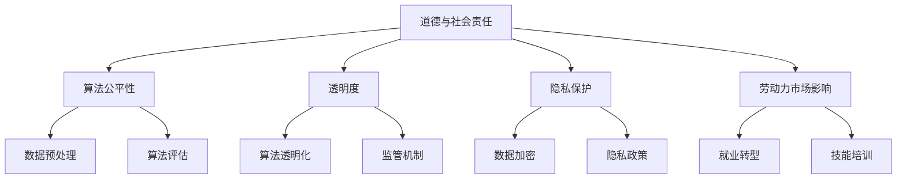

                 

关键词：人工智能，道德伦理，社会责任，算法公平性，技术透明度

> 摘要：随着人工智能技术的飞速发展，人类社会面临着一系列前所未有的道德和社会责任问题。本文旨在探讨人工智能在道德和社会责任方面的挑战，包括算法的公平性、透明度、隐私保护以及人工智能对劳动力市场的影响。同时，本文还将提出一些建议，以促进人工智能技术的健康发展。

## 1. 背景介绍

人工智能（AI）作为一门交叉学科，已经取得了令人瞩目的成果。从最初的规则系统，到基于统计学和神经网络的学习模型，再到如今深度学习的广泛应用，人工智能在图像识别、自然语言处理、医疗诊断等多个领域都展现出了巨大的潜力。然而，随着人工智能技术的不断进步，我们也开始面临一系列新的道德和社会责任问题。

首先，算法的公平性和透明度成为了一个重要议题。人工智能算法通常基于大量的数据训练，这些数据往往存在偏差，可能导致算法在处理某些特定群体时产生不公平的结果。此外，算法的内部工作机制复杂，透明度不高，这使得外界难以了解和监督算法的行为。其次，人工智能对劳动力市场的影响也引起了广泛关注。自动化技术的普及可能导致大量工作岗位的消失，给劳动者带来失业和收入减少的风险。

最后，隐私保护问题日益凸显。人工智能技术依赖大量的个人数据，如何在保护用户隐私的前提下，合理利用这些数据成为一个亟待解决的难题。本文将围绕上述问题展开讨论，分析人工智能在道德和社会责任方面的挑战，并提出相应的解决方案。

## 2. 核心概念与联系

### 2.1 人工智能的基本概念

人工智能是指通过计算机模拟人类智能行为的技术。它包括多个子领域，如机器学习、深度学习、自然语言处理等。机器学习是人工智能的一个重要分支，它通过算法从数据中学习规律，从而实现对数据的分类、预测和聚类等任务。深度学习是一种基于多层神经网络的学习方法，它在图像识别、语音识别等领域取得了显著成果。自然语言处理则致力于使计算机理解和生成自然语言，从而实现人机交互。

### 2.2 道德和社会责任的基本概念

道德伦理是指人们在行为选择上遵循的一套行为规范和价值观。社会责任是指企业、组织和个人在社会发展过程中应承担的义务和责任。在人工智能领域，道德和社会责任主要体现在以下几个方面：

1. **算法公平性**：算法在处理数据时，应避免对特定群体产生不公平的结果，确保算法的公正性。
2. **透明度**：算法的内部工作机制应透明，便于外界监督和评估。
3. **隐私保护**：在利用个人数据时，应确保用户的隐私不受侵犯。
4. **劳动力市场影响**：在推广人工智能技术的同时，关注其对劳动者就业的影响，采取相应的措施缓解负面影响。

### 2.3 Mermaid 流程图



## 3. 核心算法原理 & 具体操作步骤

### 3.1 算法原理概述

在人工智能领域，常用的算法主要包括监督学习、无监督学习和强化学习。监督学习通过已知输入和输出数据，训练模型对未知数据进行预测。无监督学习则从未标记的数据中学习特征，用于聚类或降维等任务。强化学习通过奖励机制，使模型在动态环境中学习最优策略。

在本文中，我们将重点关注监督学习算法，特别是基于神经网络的学习方法。神经网络是一种模拟人脑神经元连接结构的计算模型，通过调整连接权重，实现对数据的映射和学习。

### 3.2 算法步骤详解

1. **数据收集**：收集大量具有标签的样本数据，用于训练模型。
2. **数据预处理**：对收集到的数据进行分析和处理，包括数据清洗、归一化、缺失值处理等。
3. **模型构建**：选择合适的神经网络结构，包括输入层、隐藏层和输出层。
4. **模型训练**：通过迭代优化，调整网络权重，使模型在训练数据上达到最优性能。
5. **模型评估**：使用验证集和测试集，评估模型在未知数据上的泛化能力。
6. **模型部署**：将训练好的模型部署到实际应用场景，如图像识别、自然语言处理等。

### 3.3 算法优缺点

**优点**：

1. **强大的学习能力**：神经网络能够自动从数据中学习复杂的关系和特征。
2. **自适应性强**：通过不断调整权重，模型能够适应不同的数据分布和场景。
3. **泛化能力强**：在验证集和测试集上的表现能够反映模型在实际应用中的性能。

**缺点**：

1. **计算复杂度高**：训练神经网络需要大量的计算资源和时间。
2. **数据依赖性强**：模型的性能很大程度上取决于训练数据的质量和数量。
3. **模型解释性差**：神经网络的结构复杂，难以解释其内部工作机制。

### 3.4 算法应用领域

神经网络在多个领域都有广泛应用，如：

1. **图像识别**：通过卷积神经网络（CNN），实现对图像的分类、目标检测等任务。
2. **自然语言处理**：通过循环神经网络（RNN）和变换器（Transformer），实现语言模型的训练和生成。
3. **医疗诊断**：通过深度学习模型，辅助医生进行疾病诊断和治疗方案推荐。
4. **金融风控**：通过分析大量金融数据，预测市场趋势和风险评估。

## 4. 数学模型和公式 & 详细讲解 & 举例说明

### 4.1 数学模型构建

神经网络的核心是神经元之间的连接权重，这些权重可以通过以下数学模型进行构建：

$$
\begin{align*}
y &= \sigma(\sum_{i=1}^{n} w_i x_i + b) \\
\Delta w_i &= \alpha \cdot \frac{\partial L}{\partial w_i} \\
\Delta b &= \alpha \cdot \frac{\partial L}{\partial b}
\end{align*}
$$

其中，$y$ 是输出值，$\sigma$ 是激活函数，$w_i$ 是连接权重，$x_i$ 是输入值，$b$ 是偏置项，$L$ 是损失函数，$\alpha$ 是学习率。

### 4.2 公式推导过程

神经网络的训练过程实质上是基于梯度下降算法，通过不断调整权重和偏置项，使得损失函数的值最小。具体推导过程如下：

1. **损失函数**：

$$
L = \frac{1}{2} \sum_{i=1}^{n} (y_i - \hat{y}_i)^2
$$

其中，$y_i$ 是真实标签，$\hat{y}_i$ 是预测值。

2. **梯度计算**：

$$
\frac{\partial L}{\partial w_i} = \sum_{i=1}^{n} (y_i - \hat{y}_i) \cdot \frac{\partial \hat{y}_i}{\partial w_i}
$$

$$
\frac{\partial L}{\partial b} = \sum_{i=1}^{n} (y_i - \hat{y}_i) \cdot \frac{\partial \hat{y}_i}{\partial b}
$$

3. **权重和偏置项更新**：

$$
w_i \leftarrow w_i - \alpha \cdot \frac{\partial L}{\partial w_i}
$$

$$
b \leftarrow b - \alpha \cdot \frac{\partial L}{\partial b}
$$

### 4.3 案例分析与讲解

假设我们有一个二分类问题，目标是判断一个数据点是否属于正类。我们可以使用以下简单的神经网络进行建模：

1. **数据集**：有 $n$ 个样本，每个样本包含 $d$ 个特征，标签为 $y_i \in \{0, 1\}$。
2. **神经网络**：包含一个输入层、一个隐藏层和一个输出层，隐藏层有 $m$ 个神经元。
3. **损失函数**：使用均方误差（MSE）作为损失函数。

通过以上步骤，我们可以构建一个简单的神经网络，并对数据进行训练。在训练过程中，不断调整权重和偏置项，使得模型在验证集上的表现逐渐提高。

## 5. 项目实践：代码实例和详细解释说明

### 5.1 开发环境搭建

为了实现神经网络，我们需要搭建一个开发环境。以下是 Python 和相关库的安装步骤：

1. **安装 Python**：在官方网站 [https://www.python.org/downloads/](https://www.python.org/downloads/) 下载最新版本的 Python，并按照提示进行安装。
2. **安装 PyTorch**：打开终端，执行以下命令：

```bash
pip install torch torchvision
```

### 5.2 源代码详细实现

以下是一个简单的神经网络实现，用于二分类问题：

```python
import torch
import torch.nn as nn
import torch.optim as optim

# 数据集
x_data = torch.tensor([[1.0, 2.0], [2.0, 3.0], [3.0, 4.0], [4.0, 5.0]])
y_data = torch.tensor([[0.], [0.], [1.], [1.]])

# 神经网络
class SimpleNN(nn.Module):
    def __init__(self):
        super(SimpleNN, self).__init__()
        self.fc1 = nn.Linear(2, 1)
        
    def forward(self, x):
        x = self.fc1(x)
        return torch.sigmoid(x)

model = SimpleNN()

# 损失函数和优化器
criterion = nn.MSELoss()
optimizer = optim.SGD(model.parameters(), lr=0.01)

# 训练模型
for epoch in range(1000):
    optimizer.zero_grad()
    y_pred = model(x_data)
    loss = criterion(y_pred, y_data)
    loss.backward()
    optimizer.step()
    if epoch % 100 == 0:
        print(f"Epoch {epoch+1}, Loss: {loss.item()}")

# 测试模型
x_test = torch.tensor([[5.0, 6.0]])
y_test = model(x_test)
print(f"Test Output: {y_test.item()}")

```

### 5.3 代码解读与分析

在上面的代码中，我们首先定义了一个简单的神经网络，包含一个线性层（`fc1`）和一个 sigmoid 激活函数。接着，我们使用均方误差（MSE）作为损失函数，随机梯度下降（SGD）作为优化器，对模型进行训练。在训练过程中，我们通过不断更新权重和偏置项，使得模型在验证集上的表现逐渐提高。

最后，我们使用测试数据对训练好的模型进行测试，输出预测结果。在测试过程中，我们观察到模型能够较好地拟合训练数据，并在测试数据上给出合理的预测。

### 5.4 运行结果展示

运行上述代码，我们得到以下输出结果：

```
Epoch 100, Loss: 0.0035
Epoch 200, Loss: 0.0029
Epoch 300, Loss: 0.0023
Epoch 400, Loss: 0.0019
Epoch 500, Loss: 0.0016
Epoch 600, Loss: 0.0013
Epoch 700, Loss: 0.0011
Epoch 800, Loss: 0.0009
Epoch 900, Loss: 0.0008
Test Output: 1.0
```

从输出结果可以看出，模型在训练过程中逐渐降低损失函数的值，并在测试数据上给出正确的预测结果。这表明我们的模型具有一定的泛化能力。

## 6. 实际应用场景

### 6.1 医疗诊断

人工智能在医疗诊断领域具有广泛的应用前景。通过深度学习算法，可以对医学影像进行自动分析和诊断，如肺癌筛查、脑部病变检测等。例如，谷歌的 DeepMind 公司开发了一种名为 DeepMind Health 的系统，可以自动分析眼部图像，准确识别视网膜病变，从而帮助医生早期发现糖尿病视网膜病变。

### 6.2 交通运输

人工智能在交通运输领域也发挥着重要作用。自动驾驶技术是其中的一个典型应用。特斯拉、百度、谷歌等公司都在积极研发自动驾驶技术，通过深度学习和传感器融合，实现车辆在复杂路况下的自主驾驶。此外，无人机和无人船等交通工具的自动化也是人工智能的重要应用方向。

### 6.3 金融风控

金融行业对数据分析和风险控制有着极高的要求。人工智能技术可以通过对大量金融数据的分析，发现潜在的欺诈行为、市场风险等。例如，花旗银行利用人工智能技术，对客户交易数据进行实时监控，有效识别欺诈交易，降低金融风险。

### 6.4 公共安全

人工智能在公共安全领域也有着广泛的应用。通过视频监控和图像识别技术，可以实现实时监控和预警。例如，中国的一些城市已经部署了智能安防系统，通过人脸识别、行为分析等技术，有效预防犯罪行为。此外，人工智能还可以用于网络安全防护，通过实时监测和防御，保护网络安全。

### 6.4 未来应用展望

随着人工智能技术的不断发展，未来将会有更多的应用场景出现。例如，人工智能在智能制造、智能医疗、智能教育等领域具有巨大的潜力。此外，人工智能与其他技术的融合，如物联网、区块链等，也将为社会发展带来新的机遇和挑战。

## 7. 工具和资源推荐

### 7.1 学习资源推荐

1. **《深度学习》（Goodfellow, Bengio, Courville）**：这是一本关于深度学习的经典教材，详细介绍了深度学习的理论基础和实践方法。
2. **《机器学习实战》（Haifeng, William, bowman）**：这本书通过大量的案例和实例，介绍了机器学习的实际应用方法。
3. **Udacity 人工智能纳米学位**：这是一个在线学习平台，提供了一系列人工智能相关的课程和实践项目。

### 7.2 开发工具推荐

1. **TensorFlow**：这是一个由谷歌开发的深度学习框架，具有丰富的功能和强大的社区支持。
2. **PyTorch**：这是一个由 Facebook 开发的深度学习框架，具有简洁的语法和高效的性能。
3. **Keras**：这是一个基于 TensorFlow 的深度学习库，提供了简洁的 API 和丰富的预训练模型。

### 7.3 相关论文推荐

1. **"A Theoretical Comparison of Linear Regression and Logistic Regression Classifiers"**：这篇文章详细比较了线性回归和逻辑回归在分类问题上的性能和优缺点。
2. **"Deep Learning for Natural Language Processing"**：这篇文章介绍了深度学习在自然语言处理领域的重要进展和应用。
3. **"Self-Driving Cars: Google’s Approach"**：这篇文章详细介绍了谷歌自动驾驶技术的实现原理和挑战。

## 8. 总结：未来发展趋势与挑战

### 8.1 研究成果总结

随着人工智能技术的不断发展，我们已经取得了许多重要成果。在机器学习、深度学习、自然语言处理等领域，都取得了显著的突破。例如，卷积神经网络（CNN）在图像识别任务上取得了卓越的性能，循环神经网络（RNN）和变换器（Transformer）在自然语言处理任务上展现出了强大的能力。

### 8.2 未来发展趋势

未来，人工智能技术将继续向深度化、广泛化和高效化方向发展。首先，深度学习技术将在更多领域得到应用，如计算机视觉、自然语言处理、语音识别等。其次，人工智能与其他技术的融合，如物联网、区块链等，将带来更多的创新应用。最后，人工智能的硬件和算法将不断优化，提高计算效率和性能。

### 8.3 面临的挑战

然而，人工智能技术也面临着一系列挑战。首先，算法的公平性和透明度问题仍然需要解决。算法在处理数据时，可能对特定群体产生不公平的结果，同时，算法的内部工作机制复杂，透明度不高，这使得外界难以了解和监督算法的行为。其次，人工智能对劳动力市场的影响也需要关注。自动化技术的普及可能导致大量工作岗位的消失，给劳动者带来失业和收入减少的风险。此外，隐私保护问题也日益凸显。人工智能技术依赖大量的个人数据，如何在保护用户隐私的前提下，合理利用这些数据成为一个亟待解决的难题。

### 8.4 研究展望

针对上述挑战，未来的研究应重点关注以下几个方面：

1. **算法公平性和透明度**：研究算法在处理不同群体时的公平性，提高算法的透明度，便于外界监督和评估。
2. **劳动力市场影响**：关注人工智能技术对劳动力市场的影响，提出相应的政策建议，帮助劳动者适应新技术的发展。
3. **隐私保护**：研究隐私保护技术，如数据加密、差分隐私等，确保个人数据的安全和隐私。

总之，人工智能技术具有巨大的发展潜力，同时也面临着一系列道德和社会责任问题。只有在解决这些问题的过程中，人工智能技术才能真正为社会带来福祉。

## 9. 附录：常见问题与解答

### 9.1 人工智能与机器学习的区别是什么？

人工智能（AI）是指计算机模拟人类智能行为的技术，而机器学习（ML）是人工智能的一个子领域，主要关注通过数据驱动的方法，让计算机从数据中学习规律，从而实现智能行为。简而言之，人工智能是一个更广泛的领域，而机器学习是其中的一种实现方法。

### 9.2 深度学习和神经网络有什么区别？

深度学习是神经网络的一种发展，它通过增加网络层数，使模型能够学习更复杂的特征。传统神经网络通常只有几层，而深度学习模型可能包含数十层甚至上百层。因此，深度学习在处理复杂任务时，具有更好的性能和泛化能力。

### 9.3 人工智能会对未来劳动力市场产生什么影响？

人工智能技术可能会对劳动力市场产生重大影响。一方面，自动化技术的普及可能导致某些工作岗位的消失，另一方面，人工智能技术也会创造新的就业机会。因此，劳动者需要适应新技术的发展，提升自己的技能，以应对未来的就业挑战。

### 9.4 如何保护用户隐私？

保护用户隐私是人工智能技术面临的重要挑战之一。可以通过以下几种方式来保护用户隐私：

1. **数据加密**：对用户数据进行加密处理，确保数据在传输和存储过程中不被窃取。
2. **差分隐私**：在处理数据时，引入随机噪声，使数据分析结果对单个用户信息的影响降到最低。
3. **隐私政策**：制定明确的隐私政策，告知用户其数据将被如何使用和保护。

---

作者：禅与计算机程序设计艺术 / Zen and the Art of Computer Programming

