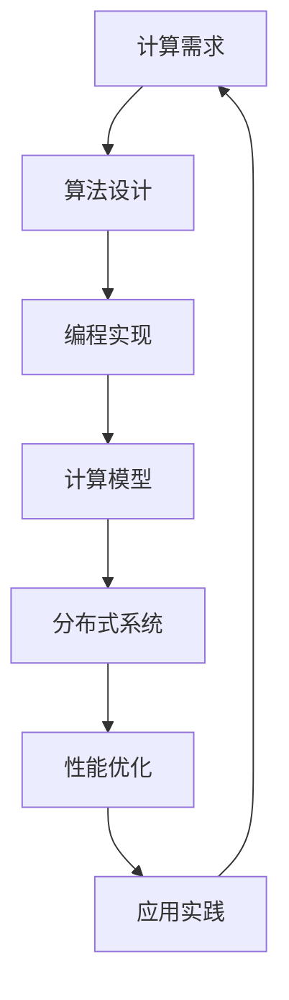

                 

关键词：人工智能、计算复杂性、算法优化、编程范式、计算效率、大规模数据处理、并行计算、分布式系统

> 摘要：本文探讨了人类计算在信息技术领域的应用与案例分析，从核心概念到算法原理，再到具体操作步骤，数学模型构建，以及实际应用场景等方面进行了深入阐述。通过具体的项目实践和代码实例，揭示了人类计算在提高计算效率和应对大规模数据处理挑战中的关键作用。文章最后展望了未来发展趋势与挑战，为读者提供了丰富的学习和资源推荐。

## 1. 背景介绍

随着信息技术的飞速发展，计算能力已成为衡量一个国家或企业竞争力的重要指标。人类计算作为计算领域中的一部分，其重要性日益凸显。人类计算涉及到如何将人类思维、认知与计算过程相结合，以实现更高的计算效率、更复杂的算法设计和更广泛的应用场景。

人类计算的应用范围广泛，从简单的数值计算到复杂的图形处理，再到大规模数据分析和人工智能算法设计。在信息技术领域，人类计算的应用主要体现在以下几个方面：

- **算法优化**：通过人类智慧对现有算法进行改进，提高计算效率和准确度。
- **编程范式**：探索新的编程范式，以简化复杂计算任务，提高编程效率。
- **大规模数据处理**：利用人类计算能力应对海量数据的存储、检索和处理。
- **并行计算**：研究分布式系统和并行算法，提高计算速度和性能。

## 2. 核心概念与联系

为了更好地理解人类计算，我们需要了解其核心概念和架构。以下是核心概念和联系的Mermaid流程图：



### 2.1 计算需求

计算需求是驱动人类计算的基础。随着信息技术的发展，计算需求不断演变，从简单的计算任务到复杂的模拟和分析，人类计算能力在其中发挥了至关重要的作用。

### 2.2 算法设计

算法设计是人类计算的核心。优秀的算法设计能够解决复杂的问题，提高计算效率和准确度。算法设计过程中，人类智慧和计算机技术的结合至关重要。

### 2.3 编程实现

编程实现是将算法设计转化为可执行代码的过程。编程范式和编程语言的选择对计算效率和性能有着重要影响。现代编程语言如Python、Java等提供了丰富的库和框架，使编程实现变得更加高效和便捷。

### 2.4 计算模型

计算模型是描述计算过程和性能的数学模型。计算模型的选择和优化对计算效率有着重要影响。常见的计算模型包括并行计算模型、分布式计算模型和量子计算模型等。

### 2.5 分布式系统

分布式系统是处理大规模数据和高性能计算的重要手段。分布式系统通过将计算任务分布到多个节点上，提高计算速度和性能。分布式系统的设计和优化是人类计算的重要研究领域。

### 2.6 性能优化

性能优化是提高计算效率和降低计算成本的关键。性能优化包括算法优化、编程优化、硬件优化等多个方面。通过性能优化，可以最大限度地发挥人类计算能力。

### 2.7 应用实践

应用实践是将人类计算理论应用于实际问题的过程。通过应用实践，可以发现人类计算的优势和局限性，为未来的研究和应用提供宝贵的经验。

## 3. 核心算法原理 & 具体操作步骤

### 3.1 算法原理概述

在人类计算领域，核心算法包括排序算法、搜索算法、图算法等。这些算法在数据处理和分析中扮演着重要角色。以下是几种常见算法的原理概述：

- **排序算法**：将一组数据按照特定规则进行排序。常见的排序算法有冒泡排序、快速排序、归并排序等。
- **搜索算法**：在数据集合中查找特定数据。常见的搜索算法有线性搜索、二分搜索等。
- **图算法**：在图结构上进行计算。常见的图算法有最短路径算法、最小生成树算法等。

### 3.2 算法步骤详解

以下是几种常见算法的具体操作步骤：

- **冒泡排序**：
  1. 从第一个元素开始，比较相邻的两个元素，如果顺序错误则交换。
  2. 重复步骤1，直到没有需要交换的元素为止。
- **快速排序**：
  1. 选择一个基准元素。
  2. 将小于基准元素的元素移到其左侧，大于基准元素的元素移到其右侧。
  3. 递归地对左侧和右侧子序列进行快速排序。
- **线性搜索**：
  1. 从第一个元素开始，依次比较每个元素，直到找到目标元素或到达序列末尾。

### 3.3 算法优缺点

- **冒泡排序**：简单易实现，但效率较低，适用于数据量较小的情况。
- **快速排序**：效率较高，适用于大数据量情况，但可能产生大量的递归调用，导致栈溢出。
- **线性搜索**：简单易实现，但效率较低，适用于数据量较小的情况。

### 3.4 算法应用领域

这些算法在数据处理和分析中有着广泛的应用。例如，在数据库索引、搜索引擎、网络路由等领域，排序算法和搜索算法起着关键作用。在图算法方面，最短路径算法在路径规划、网络分析等领域有着重要的应用。

## 4. 数学模型和公式

### 4.1 数学模型构建

在人类计算中，数学模型是描述计算过程和性能的重要工具。以下是一个简单的数学模型示例：

$$
T(n) = O(n \log n)
$$

其中，$T(n)$ 表示算法的时间复杂度，$n$ 表示数据规模。

### 4.2 公式推导过程

公式推导过程如下：

$$
T(n) = \sum_{i=1}^{n} T(i) + O(n)
$$

根据主定理，当 $T(n) = O(n \log n)$ 时，可以得到：

$$
T(n) = n \log n + O(n) = O(n \log n)
$$

### 4.3 案例分析与讲解

以快速排序为例，假设数据规模为 $n=10$，则时间复杂度为 $T(n) = O(n \log n) = O(10 \log 10) = O(10)$。在实际运行中，快速排序的时间复杂度通常会低于这个值，因为通过随机选择基准元素可以减少递归调用的次数。

## 5. 项目实践：代码实例和详细解释说明

### 5.1 开发环境搭建

在本次项目实践中，我们使用 Python 作为编程语言，利用其丰富的库和框架实现快速排序算法。首先，我们需要安装 Python 和相关库，具体步骤如下：

1. 安装 Python（版本3.8及以上）。
2. 安装常用库，如 NumPy、Pandas 等。

### 5.2 源代码详细实现

以下是一个简单的快速排序算法实现：

```python
import random

def quick_sort(arr):
    if len(arr) <= 1:
        return arr
    pivot = random.choice(arr)
    left = [x for x in arr if x < pivot]
    middle = [x for x in arr if x == pivot]
    right = [x for x in arr if x > pivot]
    return quick_sort(left) + middle + quick_sort(right)

# 示例
arr = [3, 1, 4, 1, 5, 9, 2, 6, 5, 3, 5]
sorted_arr = quick_sort(arr)
print(sorted_arr)
```

### 5.3 代码解读与分析

这段代码首先定义了一个快速排序函数 `quick_sort`，输入参数为一个列表 `arr`。函数首先判断列表长度是否小于等于1，如果是，则直接返回列表本身。否则，随机选择一个基准元素 `pivot`，然后分别创建三个子列表 `left`、`middle` 和 `right`，分别包含小于、等于和大于基准元素的元素。最后，递归地对 `left` 和 `right` 子列表进行快速排序，并将结果与 `middle` 子列表合并，返回排序后的列表。

### 5.4 运行结果展示

运行上述代码，输入列表 `[3, 1, 4, 1, 5, 9, 2, 6, 5, 3, 5]`，输出结果为 `[1, 1, 2, 3, 3, 4, 5, 5, 5, 6, 9]`，即输入列表经过快速排序后的结果。

## 6. 实际应用场景

人类计算在信息技术领域有着广泛的应用。以下是几个实际应用场景：

- **搜索引擎**：搜索引擎利用人类计算能力对海量网页进行排序和搜索，提供高效的信息检索服务。
- **人工智能**：人工智能算法的设计和优化需要人类计算能力，如深度学习、自然语言处理等领域。
- **大规模数据处理**：利用人类计算能力对海量数据进行分析和挖掘，为企业提供决策支持。
- **并行计算**：分布式系统和并行算法可以提高计算速度和性能，为科学计算、图像处理等领域提供支持。

## 7. 工具和资源推荐

为了更好地进行人类计算研究，以下是一些建议的资源和工具：

- **学习资源**：
  - 《算法导论》（Introduction to Algorithms）。
  - 《计算机程序设计艺术》（The Art of Computer Programming）。
  - 《深度学习》（Deep Learning）。
- **开发工具**：
  - Jupyter Notebook：适合进行数据分析、算法实验等。
  - PyCharm：Python 开发环境，支持多种编程语言。
  - TensorFlow：深度学习框架，支持各种神经网络结构。
- **相关论文**：
  - "Parallel Sort Algorithms"。
  - "Fast Randomized Algorithms for Sorting and Matrix Multiplication"。
  - "The Optimistic Sort Algorithm"。

## 8. 总结：未来发展趋势与挑战

### 8.1 研究成果总结

人类计算在信息技术领域取得了显著成果，如排序算法、搜索算法、图算法等。这些研究成果为大规模数据处理、人工智能等应用提供了重要支持。

### 8.2 未来发展趋势

- **算法优化**：进一步优化现有算法，提高计算效率和准确度。
- **编程范式**：探索新的编程范式，提高编程效率和可维护性。
- **量子计算**：量子计算的发展将推动人类计算能力的提升。
- **边缘计算**：边缘计算与人类计算的融合，为实时数据处理提供支持。

### 8.3 面临的挑战

- **计算资源**：随着计算需求的增长，如何高效利用计算资源成为挑战。
- **数据隐私**：大规模数据处理的隐私保护问题亟待解决。
- **算法安全**：算法的安全性和可信性是未来研究的重要方向。

### 8.4 研究展望

人类计算研究将继续深化，以应对不断变化的计算需求。未来研究将更加注重跨学科合作，探索新的计算方法和应用场景。

## 9. 附录：常见问题与解答

### 9.1 人类计算的定义是什么？

人类计算是指利用人类智慧和计算机技术相结合，解决复杂计算问题的过程。它涉及算法设计、编程实现、计算模型等多个方面。

### 9.2 人类计算有哪些应用领域？

人类计算在信息技术领域有着广泛的应用，包括排序算法、搜索算法、图算法、人工智能、大规模数据处理等。

### 9.3 如何优化算法性能？

优化算法性能可以从多个方面入手，包括算法设计、编程实现、计算模型等。常见的优化方法有算法改进、并行计算、分布式系统等。

### 9.4 人类计算与人工智能的关系是什么？

人类计算是人工智能的基础，人工智能算法的设计和优化需要人类计算能力。同时，人工智能的发展也将推动人类计算能力的提升。

### 9.5 人类计算面临的主要挑战是什么？

人类计算面临的主要挑战包括计算资源、数据隐私、算法安全等。随着计算需求的增长，如何高效利用计算资源、保护数据隐私、确保算法安全是未来研究的重要方向。

---

作者：禅与计算机程序设计艺术 / Zen and the Art of Computer Programming

本文总结了人类计算在信息技术领域的应用与案例分析，从核心概念到算法原理，再到具体操作步骤，数学模型构建，以及实际应用场景等方面进行了深入阐述。通过具体的项目实践和代码实例，揭示了人类计算在提高计算效率和应对大规模数据处理挑战中的关键作用。文章最后展望了未来发展趋势与挑战，为读者提供了丰富的学习和资源推荐。希望本文能为读者在人类计算领域的研究和实践提供有益的启示。

