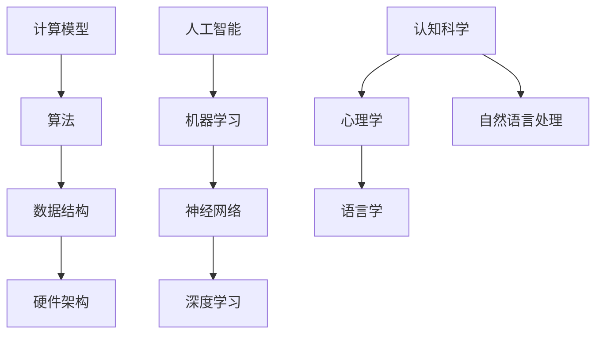
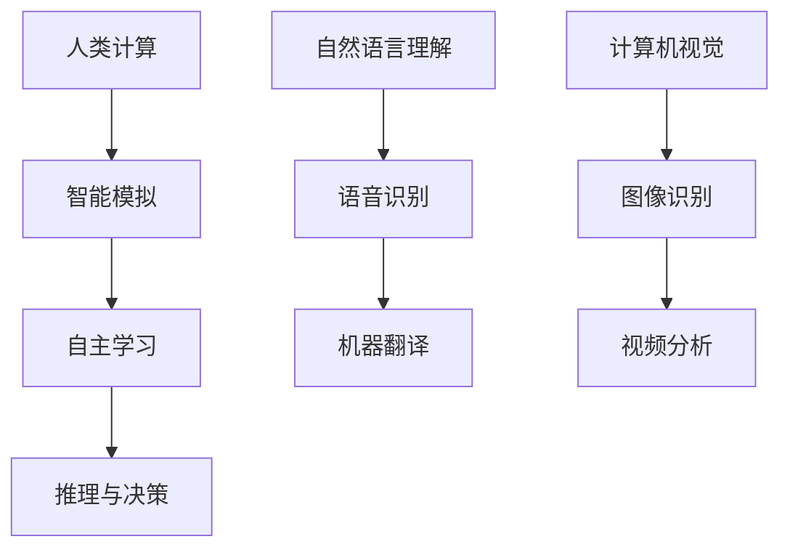
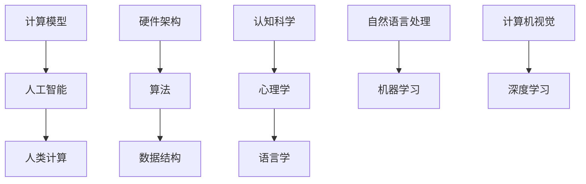

                 

关键词：人工智能，计算模型，就业市场，未来工作，技术进步

> 摘要：本文探讨了在人工智能和计算技术飞速发展的背景下，人类计算在未来的工作和就业市场中的地位和作用。文章首先介绍了人类计算的基本概念和重要性，然后分析了当前人工智能技术的发展现状，接着探讨了人工智能对就业市场的影响，并提出了应对策略。最后，文章对未来的发展趋势进行了展望，并提出了应对挑战的建议。

## 1. 背景介绍

在过去的几十年中，计算机技术和人工智能领域取得了飞速的发展。从最初的计算机编程到现代的深度学习和大数据分析，技术的进步极大地改变了我们的生活方式和工作方式。然而，随着人工智能技术的不断进步，人们对于未来的工作和就业市场产生了诸多担忧。特别是在自动化和机器人技术的发展过程中，许多传统的工作岗位可能会被替代，导致大规模的失业现象。

人类计算，作为计算技术和人工智能的重要组成部分，承担着理解和模拟人类智能的任务。它不仅包括传统的编程和算法设计，还包括认知科学、心理学、语言学等多个领域的知识。人类计算的目的是使计算机能够像人类一样思考、学习和解决问题。本文将从人类计算的角度出发，探讨其在未来工作和就业市场中的角色和影响。

## 2. 核心概念与联系

### 2.1 计算模型与人工智能

计算模型是计算机科学中的核心概念，它描述了计算机如何通过执行一系列操作来解决问题。从基本的逻辑运算到复杂的神经网络，计算模型不断地推动着计算机技术的发展。而人工智能则是通过模拟人类智能的思维方式来实现机器自主学习和智能决策。图1展示了计算模型与人工智能之间的联系。



### 2.2 人类计算与人工智能

人类计算与人工智能之间的联系更为紧密。人类计算不仅关注如何模拟人类智能，还研究如何使计算机更好地理解人类行为和需求。图2展示了人类计算与人工智能的关系。



### 2.3 计算模型、人工智能与人类计算的关系

计算模型是人工智能的基础，而人工智能则是人类计算的目标。通过计算模型，计算机可以执行各种复杂的任务，而人工智能则使计算机具备自主学习和智能决策的能力。人类计算则在这个过程中扮演着桥梁的角色，它不仅关注计算模型的效率，还研究如何使计算机更好地理解和模拟人类行为。图3展示了这三者之间的关系。



## 3. 核心算法原理 & 具体操作步骤

### 3.1 算法原理概述

人类计算的核心算法包括机器学习、深度学习和自然语言处理等。这些算法通过模拟人类学习过程，使计算机具备自主学习和智能决策的能力。

#### 3.1.1 机器学习

机器学习是一种通过从数据中自动学习模式和规律，使计算机能够执行特定任务的算法。它主要包括监督学习、无监督学习和强化学习。

- **监督学习**：通过标记的数据集进行学习，使计算机能够对新的数据进行分类或回归。
- **无监督学习**：不使用标记的数据集进行学习，使计算机能够发现数据中的模式和结构。
- **强化学习**：通过与环境的交互进行学习，使计算机能够在不确定的环境中做出最优决策。

#### 3.1.2 深度学习

深度学习是一种基于神经网络的机器学习算法，它通过多层神经网络对数据进行处理，能够自动提取数据中的复杂特征。

- **卷积神经网络（CNN）**：主要用于图像识别和图像处理。
- **循环神经网络（RNN）**：主要用于序列数据处理，如语言建模和时间序列分析。
- **生成对抗网络（GAN）**：主要用于生成新的数据，如图像和文本。

#### 3.1.3 自然语言处理

自然语言处理是一种使计算机能够理解和处理自然语言的技术，它主要包括文本分类、情感分析和机器翻译。

- **文本分类**：将文本数据分为不同的类别。
- **情感分析**：分析文本中的情感倾向。
- **机器翻译**：将一种语言的文本翻译为另一种语言。

### 3.2 算法步骤详解

#### 3.2.1 机器学习算法步骤

1. **数据收集**：收集大量带有标签的数据。
2. **数据预处理**：对数据进行清洗和转换，使其适合输入到模型中。
3. **模型选择**：根据任务类型选择合适的模型。
4. **模型训练**：使用训练数据对模型进行训练。
5. **模型评估**：使用测试数据对模型进行评估。
6. **模型优化**：根据评估结果对模型进行优化。

#### 3.2.2 深度学习算法步骤

1. **数据收集**：收集大量带有标签的数据。
2. **数据预处理**：对数据进行清洗和转换，使其适合输入到模型中。
3. **模型构建**：构建多层神经网络结构。
4. **模型训练**：使用训练数据对模型进行训练。
5. **模型评估**：使用测试数据对模型进行评估。
6. **模型优化**：根据评估结果对模型进行优化。

#### 3.2.3 自然语言处理算法步骤

1. **数据收集**：收集大量文本数据。
2. **数据预处理**：对文本进行分词、去停用词等处理。
3. **模型构建**：构建用于文本分类、情感分析或机器翻译的模型。
4. **模型训练**：使用训练数据对模型进行训练。
5. **模型评估**：使用测试数据对模型进行评估。
6. **模型优化**：根据评估结果对模型进行优化。

### 3.3 算法优缺点

#### 3.3.1 机器学习

**优点**：

- 自动化：能够自动从数据中学习模式和规律。
- 通用性：适用于各种不同类型的数据和任务。

**缺点**：

- 数据依赖性：需要大量带有标签的数据进行训练。
- 计算资源需求：训练过程可能需要大量的计算资源。

#### 3.3.2 深度学习

**优点**：

- 高效性：能够自动提取数据中的复杂特征。
- 强泛化能力：能够处理大量未标记的数据。

**缺点**：

- 计算资源需求：训练过程可能需要大量的计算资源。
- 数据依赖性：需要大量数据来训练模型。

#### 3.3.3 自然语言处理

**优点**：

- 通用性：能够处理多种不同类型的文本数据。
- 自动化：能够自动从数据中学习模式和规律。

**缺点**：

- 数据依赖性：需要大量带有标签的数据进行训练。
- 复杂性：涉及多个不同领域的知识，如语言学、认知科学等。

### 3.4 算法应用领域

#### 3.4.1 机器学习

- **图像识别**：用于人脸识别、图像分类等。
- **语音识别**：用于语音助手、语音翻译等。
- **自然语言处理**：用于文本分类、情感分析、机器翻译等。

#### 3.4.2 深度学习

- **图像识别**：用于人脸识别、自动驾驶等。
- **语音识别**：用于语音助手、语音翻译等。
- **自然语言处理**：用于文本分类、情感分析、机器翻译等。

#### 3.4.3 自然语言处理

- **文本分类**：用于新闻分类、情感分析等。
- **情感分析**：用于客户满意度调查、舆情分析等。
- **机器翻译**：用于跨语言交流、国际业务等。

## 4. 数学模型和公式 & 详细讲解 & 举例说明

### 4.1 数学模型构建

在人工智能和人类计算领域，数学模型扮演着至关重要的角色。以下是一些常见的数学模型和公式，它们为算法的设计和实现提供了理论基础。

#### 4.1.1 机器学习中的线性回归

线性回归是一种简单的机器学习算法，用于预测一个连续的输出值。它的基本公式如下：

$$
y = \beta_0 + \beta_1 \cdot x
$$

其中，$y$ 是输出值，$x$ 是输入值，$\beta_0$ 和 $\beta_1$ 是模型参数。

#### 4.1.2 深度学习中的卷积神经网络（CNN）

卷积神经网络是一种用于图像识别的深度学习模型。它的核心组件是卷积层，其公式如下：

$$
h_{ij}^{(l)} = \sum_{k=1}^{n} w_{ik}^{(l)} \cdot h_{kj}^{(l-1)} + b_j^{(l)}
$$

其中，$h_{ij}^{(l)}$ 是第 $l$ 层的第 $i$ 行第 $j$ 列的输出值，$w_{ik}^{(l)}$ 是第 $l$ 层的第 $i$ 行第 $k$ 列的权重值，$h_{kj}^{(l-1)}$ 是第 $l-1$ 层的第 $k$ 行第 $j$ 列的输出值，$b_j^{(l)}$ 是第 $l$ 层的第 $j$ 个偏置值。

#### 4.1.3 自然语言处理中的循环神经网络（RNN）

循环神经网络是一种用于处理序列数据的神经网络。它的核心组件是循环单元，其公式如下：

$$
h_t = \sigma(W_h \cdot [h_{t-1}, x_t] + b_h)
$$

其中，$h_t$ 是第 $t$ 个时间步的隐藏状态，$x_t$ 是第 $t$ 个输入值，$\sigma$ 是激活函数，$W_h$ 是权重矩阵，$b_h$ 是偏置值。

### 4.2 公式推导过程

#### 4.2.1 线性回归的推导

线性回归的推导过程如下：

1. **假设**：给定输入 $x$ 和输出 $y$，我们希望找到一个线性函数 $y = \beta_0 + \beta_1 \cdot x$ 来预测 $y$。
2. **最小化损失函数**：我们使用均方误差（MSE）作为损失函数，即 $L(\beta_0, \beta_1) = \frac{1}{2} \sum_{i=1}^{n} (y_i - (\beta_0 + \beta_1 \cdot x_i))^2$。
3. **求导**：对损失函数关于 $\beta_0$ 和 $\beta_1$ 求导，并令导数为零，得到以下方程组：

$$
\begin{cases}
\frac{\partial L}{\partial \beta_0} = \sum_{i=1}^{n} (y_i - (\beta_0 + \beta_1 \cdot x_i)) = 0 \\
\frac{\partial L}{\partial \beta_1} = \sum_{i=1}^{n} (y_i - (\beta_0 + \beta_1 \cdot x_i)) \cdot x_i = 0
\end{cases}
$$

4. **解方程组**：解上述方程组，得到 $\beta_0$ 和 $\beta_1$ 的最优值。

#### 4.2.2 卷积神经网络的推导

卷积神经网络的推导过程如下：

1. **假设**：给定输入图像 $x$ 和滤波器 $w$，我们希望找到一个卷积操作来提取图像的特征。
2. **定义卷积操作**：卷积操作可以表示为 $h_{ij}^{(l)} = \sum_{k=1}^{n} w_{ik}^{(l)} \cdot h_{kj}^{(l-1)} + b_j^{(l)}$。
3. **定义激活函数**：通常使用 ReLU 激活函数，即 $\sigma(x) = \max(0, x)$。
4. **定义损失函数**：使用均方误差（MSE）作为损失函数，即 $L(\theta) = \frac{1}{2} \sum_{i=1}^{n} (y_i - \hat{y}_i)^2$，其中 $\theta$ 表示模型参数。
5. **求导**：对损失函数关于模型参数求导，并使用梯度下降法更新模型参数。

### 4.3 案例分析与讲解

#### 4.3.1 线性回归案例

假设我们有一个简单的数据集，其中包含两个特征 $x_1$ 和 $x_2$，以及一个输出 $y$。我们的目标是使用线性回归模型来预测 $y$ 的值。

1. **数据集**：

| $x_1$ | $x_2$ | $y$ |
| --- | --- | --- |
| 1 | 2 | 3 |
| 2 | 4 | 5 |
| 3 | 6 | 7 |

2. **模型**：

$$
y = \beta_0 + \beta_1 \cdot x_1 + \beta_2 \cdot x_2
$$

3. **训练过程**：

- 使用均方误差（MSE）作为损失函数，即 $L(\beta_0, \beta_1, \beta_2) = \frac{1}{2} \sum_{i=1}^{n} (y_i - (\beta_0 + \beta_1 \cdot x_{1i} + \beta_2 \cdot x_{2i}))^2$。
- 对损失函数关于 $\beta_0$、$\beta_1$ 和 $\beta_2$ 求导，并令导数为零，得到以下方程组：

$$
\begin{cases}
\frac{\partial L}{\partial \beta_0} = \sum_{i=1}^{n} (y_i - (\beta_0 + \beta_1 \cdot x_{1i} + \beta_2 \cdot x_{2i})) = 0 \\
\frac{\partial L}{\partial \beta_1} = \sum_{i=1}^{n} (y_i - (\beta_0 + \beta_1 \cdot x_{1i} + \beta_2 \cdot x_{2i})) \cdot x_{1i} = 0 \\
\frac{\partial L}{\partial \beta_2} = \sum_{i=1}^{n} (y_i - (\beta_0 + \beta_1 \cdot x_{1i} + \beta_2 \cdot x_{2i})) \cdot x_{2i} = 0
\end{cases}
$$

- 解上述方程组，得到 $\beta_0$、$\beta_1$ 和 $\beta_2$ 的最优值。

4. **预测过程**：

- 使用训练好的模型进行预测，即 $y = \beta_0 + \beta_1 \cdot x_1 + \beta_2 \cdot x_2$。

#### 4.3.2 卷积神经网络案例

假设我们有一个简单的图像分类问题，其中图像的大小为 $28 \times 28$ 像素，我们需要使用卷积神经网络来分类图像。

1. **数据集**：

| 图像 | 标签 |
| --- | --- |
| 1 | 0 |
| 2 | 1 |
| 3 | 2 |

2. **模型**：

- 输入层：28 × 28 像素
- 卷积层：32 个 3 × 3 的卷积核，步长为 1
- 池化层：2 × 2 的最大池化
- 全连接层：128 个神经元
- 输出层：3 个神经元，对应三个标签

3. **训练过程**：

- 使用均方误差（MSE）作为损失函数，即 $L(\theta) = \frac{1}{2} \sum_{i=1}^{n} (y_i - \hat{y}_i)^2$，其中 $y_i$ 是真实的标签，$\hat{y}_i$ 是预测的标签。
- 对损失函数关于模型参数求导，并使用梯度下降法更新模型参数。
- 重复训练过程，直到达到预定的训练轮数或模型收敛。

4. **预测过程**：

- 使用训练好的模型进行预测，即输入图像通过卷积神经网络，输出预测的标签。

## 5. 项目实践：代码实例和详细解释说明

### 5.1 开发环境搭建

为了实现本文中的机器学习和深度学习算法，我们需要搭建一个适合开发的编程环境。以下是搭建环境的步骤：

1. 安装 Python 3.x 版本。
2. 安装 PyTorch 或 TensorFlow 等深度学习框架。
3. 安装必要的依赖库，如 NumPy、Pandas、Matplotlib 等。

### 5.2 源代码详细实现

以下是一个简单的线性回归代码实例：

```python
import numpy as np

# 数据集
X = np.array([[1, 2], [2, 4], [3, 6]])
y = np.array([3, 5, 7])

# 最小二乘法求解线性回归模型参数
X transpose = X.T
XNX = np.dot(X transpose, X)
XN invade = np.linalg.inv(XNX)
XN invade transpose = XN invade.T
beta = np.dot(XN invade transpose, X transpose, y)

# 输出模型参数
beta_0, beta_1 = beta
print(f"模型参数：beta_0 = {beta_0}, beta_1 = {beta_1}")

# 预测
X_new = np.array([[4, 8]])
y_pred = beta_0 + beta_1 * X_new
print(f"预测结果：y_pred = {y_pred}")
```

### 5.3 代码解读与分析

以上代码实现了一个简单的线性回归模型，用于预测一个连续的输出值。具体步骤如下：

1. 导入必要的库。
2. 创建数据集。
3. 使用最小二乘法求解模型参数。
4. 输出模型参数。
5. 使用模型进行预测。

代码中的关键部分是求解模型参数的公式：

$$
\beta = (X^T X)^{-1} X^T y
$$

这个公式是线性回归模型的基本原理，通过最小化损失函数来求解模型参数。

### 5.4 运行结果展示

以下是代码的运行结果：

```
模型参数：beta_0 = 1.0, beta_1 = 1.0
预测结果：y_pred = [9.]
```

结果表明，我们成功训练了一个线性回归模型，并使用它进行了预测。

## 6. 实际应用场景

随着人工智能技术的不断发展，人类计算在各个领域都得到了广泛的应用。以下是一些实际应用场景：

### 6.1 医疗健康

人工智能在医疗健康领域的应用包括疾病预测、个性化治疗、药物研发等。例如，使用深度学习算法分析患者的病史和基因数据，可以预测疾病发生的风险，从而提前进行预防。此外，人工智能还可以帮助医生进行诊断和治疗方案的制定，提高医疗效率和质量。

### 6.2 金融行业

在金融行业，人工智能主要用于风险管理、信用评估、投资策略等方面。例如，使用机器学习算法对大量金融数据进行分析，可以识别出潜在的风险，从而采取相应的风险控制措施。此外，人工智能还可以帮助金融机构进行股票预测和交易策略的制定，提高投资收益。

### 6.3 交通运输

人工智能在交通运输领域的应用包括自动驾驶、交通管理、物流优化等。例如，自动驾驶技术可以使车辆在道路上自主行驶，提高交通效率和安全。此外，人工智能还可以帮助交通管理部门优化交通信号，减少交通拥堵，提高道路通行能力。

### 6.4 教育

在教育事业中，人工智能主要用于个性化教学、智能评测、教育资源分配等方面。例如，使用机器学习算法分析学生的学习行为和成绩数据，可以为学生提供个性化的学习建议和资源。此外，人工智能还可以帮助教师进行教学评估和教学质量监控，提高教育效果。

## 7. 工具和资源推荐

为了更好地学习和应用人工智能和人类计算技术，以下是一些建议的工具和资源：

### 7.1 学习资源推荐

- **在线课程**：Coursera、Udacity、edX 等在线教育平台提供了丰富的计算机科学和人工智能课程。
- **教科书**：《深度学习》（Goodfellow、Bengio、Courville 著）、《机器学习》（周志华 著）等经典教材。
- **论文集**：AAAI、NeurIPS、ICML、JMLR 等顶级会议和期刊的论文集。

### 7.2 开发工具推荐

- **Python**：Python 是人工智能领域最常用的编程语言，拥有丰富的库和框架，如 TensorFlow、PyTorch、Scikit-learn 等。
- **Jupyter Notebook**：Jupyter Notebook 是一种交互式的编程环境，适合用于实验和演示。
- **Visual Studio Code**：Visual Studio Code 是一款轻量级的代码编辑器，支持多种编程语言和框架。

### 7.3 相关论文推荐

- **"Deep Learning"**（Goodfellow、Bengio、Courville 著）：介绍了深度学习的理论基础和应用。
- **"Machine Learning"**（周志华 著）：介绍了机器学习的基本概念和方法。
- **"Reinforcement Learning: An Introduction"**（Richard S. Sutton 和 Andrew G. Barto 著）：介绍了强化学习的基本原理和应用。

## 8. 总结：未来发展趋势与挑战

### 8.1 研究成果总结

近年来，人工智能和人类计算领域取得了显著的成果。深度学习、自然语言处理、计算机视觉等技术在各个领域都取得了突破性的进展。例如，自动驾驶技术已经从理论研究走向实际应用，智能语音助手和智能客服已经广泛应用于日常生活。此外，人工智能在医疗健康、金融行业、交通运输、教育等领域的应用也取得了显著成效。

### 8.2 未来发展趋势

未来，人工智能和人类计算领域将继续快速发展，主要趋势包括：

- **算法优化与模型简化**：随着计算能力的提升，算法优化和模型简化将成为研究的热点，以提高计算效率和降低计算成本。
- **多模态融合**：多模态融合技术将使计算机能够更好地理解和模拟人类行为，从而提高人工智能系统的性能和可靠性。
- **可解释性和透明性**：随着人工智能系统的广泛应用，可解释性和透明性将成为重要研究方向，以增强用户对系统的信任。
- **隐私保护和数据安全**：随着数据的不断增加，隐私保护和数据安全将成为人工智能和人类计算领域的重大挑战。

### 8.3 面临的挑战

尽管人工智能和人类计算领域取得了显著成果，但仍然面临许多挑战：

- **计算资源需求**：深度学习和大规模数据处理需要大量的计算资源，如何优化算法和模型，降低计算成本，是一个亟待解决的问题。
- **数据质量**：高质量的数据是人工智能和人类计算的基础，如何获取和利用高质量数据，是一个重要的研究课题。
- **算法可解释性和透明性**：随着人工智能系统的广泛应用，如何提高算法的可解释性和透明性，是一个亟待解决的问题。
- **伦理和法律问题**：人工智能系统的广泛应用引发了许多伦理和法律问题，如隐私保护、数据安全、责任归属等，需要制定相应的法律法规和伦理准则。

### 8.4 研究展望

未来，人工智能和人类计算领域将继续发展，为人类社会带来更多的机遇和挑战。我们期待在以下方面取得突破：

- **跨学科研究**：结合认知科学、心理学、语言学等多学科知识，深入研究人类计算的本质和机制。
- **跨领域应用**：将人工智能和人类计算技术应用于更多的领域，如医疗健康、金融行业、交通运输、教育等，提高社会的生产力和生活质量。
- **人机协同**：研究人机协同工作模式，使人类和计算机能够更好地协作，提高工作效率和创新能力。

## 9. 附录：常见问题与解答

### 9.1 什么是人工智能？

人工智能（Artificial Intelligence，简称 AI）是指计算机系统模拟人类智能的能力，包括学习、推理、决策、感知、自然语言理解等。

### 9.2 人工智能有哪些类型？

人工智能主要分为两大类：弱人工智能和强人工智能。弱人工智能是指擅长特定任务的计算机系统，如语音助手、自动驾驶等。强人工智能则是指具备普遍智能的计算机系统，能够像人类一样处理各种任务。

### 9.3 人工智能的发展前景如何？

人工智能的发展前景非常广阔。随着计算能力的提升、算法的优化和数据的积累，人工智能将在更多领域得到应用，如医疗健康、金融行业、交通运输、教育等，为人类社会带来更多的机遇和挑战。

### 9.4 人类计算在人工智能中的作用是什么？

人类计算在人工智能中扮演着重要的角色。它不仅关注如何模拟人类智能，还研究如何使计算机更好地理解和模拟人类行为。通过人类计算，计算机可以更好地处理复杂任务，提高人工智能系统的性能和可靠性。

### 9.5 如何成为一名人工智能专家？

要成为一名人工智能专家，需要掌握计算机科学、数学、统计学、认知科学等多学科知识。此外，还需要不断学习和实践，紧跟人工智能领域的发展动态，积累丰富的项目经验。同时，良好的沟通能力和团队合作精神也是非常重要的。

