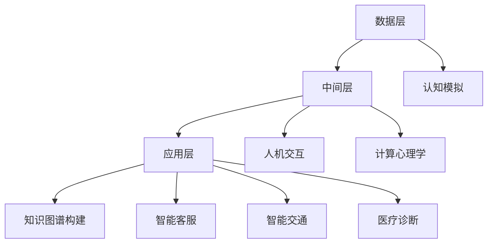

                 

关键词：人工智能、人类计算、机器学习、认知模拟、人机交互、计算心理学、未来技术

> 摘要：本文旨在探讨人类计算的概念及其在人工智能领域的应用。通过分析人类计算的核心概念和原理，我们探讨了如何利用机器学习和认知模拟技术实现人与机器之间的有效交互。文章随后详细讨论了人类计算在各个领域的应用，并提出了未来的发展前景和挑战。

## 1. 背景介绍

人类计算（Human Computation）是计算机科学和人工智能领域的一个重要研究方向。它的核心思想是利用人类智慧来解决机器难以解决的问题，或者通过人类与机器的协作提高整体效率。随着互联网的普及和大数据技术的发展，人类计算在诸多领域展现出了巨大的潜力。

人类计算的概念可以追溯到早期的人工智能研究。早期的AI系统往往依赖于预先编程的规则和算法，这种方式在处理特定领域问题时取得了显著成效。然而，面对复杂多变的现实世界，这些系统往往显得力不从心。人类计算的出现，为AI系统提供了一种全新的思路——将人类的认知能力融入到计算过程中，从而实现更高层次的智能化。

在人工智能领域，人类计算的应用主要包括以下几个方面：

1. **知识增强**：通过人类参与，补充和修正机器学习模型的训练数据，提高模型的准确性和鲁棒性。
2. **认知模拟**：模拟人类思维过程，用于问题求解、决策支持等任务。
3. **人机协作**：结合人类和机器的优势，实现更高效率的任务执行。
4. **交互式学习**：利用人类的反馈，不断优化机器学习算法和学习过程。

## 2. 核心概念与联系

### 2.1 人类计算的核心概念

人类计算的核心概念包括：认知模拟、人机交互、计算心理学和协作系统。

1. **认知模拟**：通过计算机程序模拟人类的思维过程，包括感知、理解、推理和决策等。认知模拟的目标是实现机器对人类思维的近似模拟，从而在复杂任务中发挥类似人类的作用。
   
2. **人机交互**：研究人类与机器之间的交互方式，包括用户界面设计、交互模型和交互体验。人机交互的目标是提高机器的可操作性和用户体验。

3. **计算心理学**：研究人类心理过程与计算机技术之间的关系，包括情感计算、注意力模型和记忆模型等。计算心理学的目标是为人类计算提供理论支持和实践指导。

4. **协作系统**：研究人类与机器之间的协作机制，包括任务分配、决策支持和协同工作等。协作系统的目标是实现人类与机器的紧密协作，最大化整体效能。

### 2.2 人类计算的架构

人类计算的架构可以分为三个主要层次：数据层、中间层和应用层。

1. **数据层**：提供人类计算所需的数据资源，包括文本、图像、声音和传感器数据等。数据层需要处理数据的质量、多样性和实时性等问题。

2. **中间层**：实现数据到知识的高效转换，包括数据清洗、数据挖掘和机器学习等。中间层的核心任务是构建智能模型，用于处理复杂任务。

3. **应用层**：提供具体的应用场景，包括知识图谱构建、智能客服、智能交通和医疗诊断等。应用层需要根据具体场景优化模型和算法，实现最佳效果。

### 2.3 Mermaid 流程图

以下是人类计算架构的Mermaid流程图：



## 3. 核心算法原理 & 具体操作步骤

### 3.1 算法原理概述

人类计算的核心算法主要包括机器学习算法、认知模拟算法和协同过滤算法。以下分别介绍这三种算法的原理。

1. **机器学习算法**：基于数据驱动的方法，通过从数据中学习规律和模式，实现预测和分类。常见的机器学习算法包括决策树、支持向量机和神经网络等。

2. **认知模拟算法**：基于认知心理学的理论，模拟人类的思维过程，包括感知、理解、推理和决策等。常见的认知模拟算法包括感知机、Hopfield网络和神经网络等。

3. **协同过滤算法**：基于用户行为数据，通过挖掘用户之间的相似性，实现个性化推荐。常见的协同过滤算法包括基于用户的协同过滤和基于物品的协同过滤等。

### 3.2 算法步骤详解

1. **机器学习算法步骤**：

   - 数据收集与预处理：收集相关领域的数据，并进行清洗和预处理，包括去除噪声、缺失值填充和特征提取等。
   - 模型训练：选择合适的机器学习算法，对预处理后的数据集进行训练，得到模型参数。
   - 模型评估与优化：使用验证集对训练得到的模型进行评估，并根据评估结果调整模型参数，优化模型性能。

2. **认知模拟算法步骤**：

   - 模型构建：根据认知心理学的理论，构建模拟人类思维的计算机模型。
   - 数据输入：将输入的数据（如文本、图像等）转化为模型可以处理的格式。
   - 模型运行：运行构建好的模型，模拟人类的思维过程。
   - 结果输出：根据模型的输出结果，得到问题的解答或决策。

3. **协同过滤算法步骤**：

   - 用户行为数据收集：收集用户的历史行为数据，如评分、浏览记录等。
   - 模型训练：选择合适的协同过滤算法，对用户行为数据进行训练，得到用户之间的相似性矩阵。
   - 个性化推荐：根据用户的历史行为数据和相似性矩阵，为用户推荐感兴趣的商品或内容。

### 3.3 算法优缺点

1. **机器学习算法**：

   - 优点：基于数据驱动，可以处理大规模数据，适应性强，应用范围广泛。
   - 缺点：对数据质量要求较高，可能存在过拟合现象，模型可解释性较低。

2. **认知模拟算法**：

   - 优点：模拟人类思维过程，具有较高可解释性，可以处理复杂任务。
   - 缺点：模型构建复杂，计算成本较高，适用范围相对较窄。

3. **协同过滤算法**：

   - 优点：基于用户行为数据，推荐结果具有较高相关性，易于实现。
   - 缺点：无法处理新用户或新物品的推荐问题，可能存在冷启动问题。

### 3.4 算法应用领域

1. **机器学习算法**：广泛应用于自然语言处理、计算机视觉、金融风控等领域。

2. **认知模拟算法**：应用于智能客服、智能交通、医疗诊断等领域。

3. **协同过滤算法**：广泛应用于电子商务、社交媒体、推荐系统等领域。

## 4. 数学模型和公式 & 详细讲解 & 举例说明

### 4.1 数学模型构建

在人类计算中，数学模型是核心组成部分，用于描述人类行为、认知过程和计算方法。以下介绍几种常见的数学模型及其构建方法。

1. **线性回归模型**：

   线性回归模型用于分析自变量和因变量之间的关系。其基本形式为：

   $$ y = \beta_0 + \beta_1x_1 + \beta_2x_2 + \ldots + \beta_nx_n $$

   其中，$y$ 为因变量，$x_1, x_2, \ldots, x_n$ 为自变量，$\beta_0, \beta_1, \beta_2, \ldots, \beta_n$ 为模型参数。

   构建步骤：

   - 数据收集与预处理：收集相关领域的数据，并进行清洗和预处理。
   - 模型假设：假设自变量和因变量之间存在线性关系。
   - 模型构建：根据数据特点，选择合适的线性回归模型，如简单线性回归、多元线性回归等。
   - 模型参数估计：使用最小二乘法或其他优化方法，估计模型参数。

2. **贝叶斯网络模型**：

   贝叶斯网络是一种概率图模型，用于表示变量之间的条件依赖关系。其基本形式为：

   $$ P(X_1, X_2, \ldots, X_n) = \prod_{i=1}^{n} P(X_i | X_{pa_i}) $$

   其中，$X_1, X_2, \ldots, X_n$ 为随机变量，$X_{pa_i}$ 为 $X_i$ 的父节点。

   构建步骤：

   - 确定变量和条件依赖关系：根据领域知识，确定变量及其条件依赖关系。
   - 建立概率分布：为每个变量及其条件依赖关系建立概率分布。
   - 模型优化：使用学习算法，如最大似然估计或贝叶斯估计，优化模型参数。

3. **神经网络模型**：

   神经网络是一种模拟人脑神经元连接结构的计算模型，用于复杂函数的逼近和分类。其基本形式为：

   $$ f(x) = \sigma(\sum_{i=1}^{n} w_i \cdot x_i + b) $$

   其中，$f(x)$ 为输出函数，$\sigma$ 为激活函数，$w_i$ 和 $b$ 为模型参数。

   构建步骤：

   - 确定网络结构和参数：根据任务需求，选择合适的网络结构和参数。
   - 初始化模型参数：随机初始化模型参数。
   - 模型训练：使用训练数据，通过反向传播算法优化模型参数。
   - 模型评估与调整：使用验证集评估模型性能，根据评估结果调整模型参数。

### 4.2 公式推导过程

以下以线性回归模型为例，介绍数学公式的推导过程。

假设我们有一个简单线性回归模型：

$$ y = \beta_0 + \beta_1x $$

其中，$y$ 为因变量，$x$ 为自变量，$\beta_0$ 和 $\beta_1$ 为模型参数。

1. **模型假设**：

   假设自变量 $x$ 和因变量 $y$ 之间存在线性关系，即：

   $$ y = \beta_0 + \beta_1x + \epsilon $$

   其中，$\epsilon$ 为误差项。

2. **最小二乘法**：

   为了估计模型参数 $\beta_0$ 和 $\beta_1$，我们使用最小二乘法。最小二乘法的核心思想是使得预测值 $y$ 与实际值 $y$ 之间的误差平方和最小。

   $$ \sum_{i=1}^{n} (y_i - \hat{y}_i)^2 = \sum_{i=1}^{n} (y_i - (\beta_0 + \beta_1x_i))^2 $$

3. **求解参数**：

   为了求解模型参数 $\beta_0$ 和 $\beta_1$，我们对上述误差平方和进行求导，并令导数为零：

   $$ \frac{\partial}{\partial \beta_0} \sum_{i=1}^{n} (y_i - (\beta_0 + \beta_1x_i))^2 = 0 $$

   $$ \frac{\partial}{\partial \beta_1} \sum_{i=1}^{n} (y_i - (\beta_0 + \beta_1x_i))^2 = 0 $$

   通过求解上述方程组，我们可以得到最小二乘估计的模型参数：

   $$ \beta_0 = \frac{\sum_{i=1}^{n} (y_i - \beta_1x_i)}{n} $$

   $$ \beta_1 = \frac{\sum_{i=1}^{n} (x_i - \bar{x})(y_i - \bar{y})}{\sum_{i=1}^{n} (x_i - \bar{x})^2} $$

   其中，$\bar{x}$ 和 $\bar{y}$ 分别为 $x$ 和 $y$ 的均值。

### 4.3 案例分析与讲解

以下以房价预测为例，介绍线性回归模型的应用。

#### 案例背景

某城市房地产市场数据，包括房屋面积、楼层、房龄等特征，以及对应的房价。数据共有1000条记录。

#### 数据处理

1. **数据收集**：

   收集房屋面积、楼层、房龄等数据，以及对应的房价。

2. **数据预处理**：

   - 去除缺失值和异常值。
   - 对数值型特征进行归一化处理。
   - 将类别型特征转换为数值型。

#### 模型训练

1. **数据划分**：

   将数据集划分为训练集和测试集，其中训练集占比70%，测试集占比30%。

2. **模型构建**：

   使用简单线性回归模型，将房价作为因变量，房屋面积作为自变量。

3. **模型训练**：

   使用训练集数据，通过最小二乘法训练模型，得到模型参数。

4. **模型评估**：

   使用测试集数据，评估模型的预测性能，计算均方误差（MSE）：

   $$ MSE = \frac{1}{n} \sum_{i=1}^{n} (\hat{y}_i - y_i)^2 $$

#### 模型解读

根据训练得到的模型参数，可以构建房价预测函数：

$$ \hat{y} = \beta_0 + \beta_1x $$

其中，$\beta_0$ 为截距，$\beta_1$ 为斜率。

例如，当房屋面积为100平方米时，预测房价为：

$$ \hat{y} = \beta_0 + \beta_1 \cdot 100 $$

通过调整模型参数，可以优化预测性能，提高预测精度。

## 5. 项目实践：代码实例和详细解释说明

### 5.1 开发环境搭建

在本项目中，我们将使用Python编程语言，并结合Scikit-learn库实现线性回归模型。以下是开发环境的搭建步骤：

1. 安装Python：

   - 访问Python官方网站（[python.org](https://www.python.org/)）下载Python安装包。
   - 运行安装程序，按照默认设置安装Python。

2. 安装Scikit-learn：

   - 打开终端或命令行窗口。
   - 输入以下命令，安装Scikit-learn库：

     ```bash
     pip install scikit-learn
     ```

### 5.2 源代码详细实现

以下是一段实现线性回归模型的Python代码，包括数据预处理、模型训练和模型评估：

```python
# 导入所需库
import numpy as np
import pandas as pd
from sklearn.linear_model import LinearRegression
from sklearn.model_selection import train_test_split
from sklearn.metrics import mean_squared_error

# 读取数据
data = pd.read_csv('house_price_data.csv')

# 数据预处理
# 去除缺失值和异常值
data.dropna(inplace=True)

# 归一化处理
data['area'] = (data['area'] - data['area'].mean()) / data['area'].std()

# 划分特征和标签
X = data[['area']]
y = data['price']

# 划分训练集和测试集
X_train, X_test, y_train, y_test = train_test_split(X, y, test_size=0.3, random_state=42)

# 模型训练
model = LinearRegression()
model.fit(X_train, y_train)

# 模型评估
y_pred = model.predict(X_test)
mse = mean_squared_error(y_test, y_pred)
print(f'MSE: {mse}')
```

### 5.3 代码解读与分析

1. **数据读取与预处理**：

   - 使用 `pandas` 库读取数据，并进行预处理，包括去除缺失值和异常值。
   - 对数值型特征（房屋面积）进行归一化处理，以消除不同特征之间的尺度差异。

2. **划分特征和标签**：

   - 将数据集划分为特征集（$X$）和标签集（$y$）。在本例中，仅使用房屋面积作为特征，房价作为标签。

3. **划分训练集和测试集**：

   - 使用 `train_test_split` 函数划分训练集和测试集，其中训练集占比70%，测试集占比30%。

4. **模型训练**：

   - 使用 `LinearRegression` 类创建线性回归模型实例，并使用 `fit` 方法训练模型。

5. **模型评估**：

   - 使用 `predict` 方法对测试集进行预测，并计算均方误差（MSE），评估模型性能。

### 5.4 运行结果展示

在运行上述代码后，我们将得到线性回归模型的MSE值。例如，假设MSE为0.25，则表示模型对测试集的预测误差较小，具有较高的预测精度。

## 6. 实际应用场景

人类计算技术已经在多个实际应用场景中取得了显著成果。以下列举几个具有代表性的应用领域。

### 6.1 智能客服

智能客服是利用人类计算技术实现的一种自动化客户服务系统，通过自然语言处理和认知模拟技术，提供24小时不间断的客服支持。智能客服系统可以自动识别用户的问题，理解用户的意图，并给出准确的回答。与传统的电话客服和在线客服相比，智能客服具有响应速度快、处理能力强和成本低的优点。

### 6.2 智能交通

智能交通系统是利用人类计算技术优化交通管理和出行体验的一种方案。通过收集和分析交通数据，智能交通系统可以实时监测交通状况，预测交通流量，并给出最优的出行建议。此外，智能交通系统还可以实现车辆自动驾驶和智能调度，提高道路通行效率和减少交通事故。

### 6.3 医疗诊断

医疗诊断是另一个受益于人类计算技术的领域。通过机器学习和认知模拟技术，医疗诊断系统可以从大量医疗数据中提取有用信息，辅助医生进行诊断和治疗。例如，智能医疗诊断系统可以通过分析患者的病历、影像资料和生物特征，准确判断患者的病情，并提供个性化的治疗方案。

### 6.4 教育与培训

教育与培训领域也广泛应用了人类计算技术。通过认知模拟和个性化推荐技术，教育系统可以根据学生的学习情况和需求，提供个性化的教学资源和辅导。例如，智能教育平台可以根据学生的学习进度和能力，动态调整教学内容和难度，提高学习效果。

## 7. 工具和资源推荐

为了更好地学习和实践人类计算技术，以下推荐一些相关的工具和资源。

### 7.1 学习资源推荐

1. **《人类计算：连接人与机器的桥梁》**：这是一本全面介绍人类计算理论的经典著作，适合对人类计算感兴趣的研究者和工程师。
2. **《机器学习》**：由周志华教授主编的《机器学习》是一本优秀的机器学习教材，涵盖了从基础到高级的机器学习理论和方法。
3. **《深度学习》**：由Goodfellow、Bengio和Courville合著的《深度学习》是一本深度学习领域的权威教材，适合对深度学习有深入了解的读者。

### 7.2 开发工具推荐

1. **Python**：Python是一种广泛应用于人工智能领域的编程语言，具有简洁易读和强大的库支持。
2. **Jupyter Notebook**：Jupyter Notebook是一种交互式的计算环境，方便进行代码编写、调试和分享。
3. **Scikit-learn**：Scikit-learn是一个基于Python的机器学习库，提供了丰富的机器学习算法和工具。

### 7.3 相关论文推荐

1. **“Human Computation: A Survey and Taxonomy”**：该论文对人类计算的研究领域进行了全面的综述，是了解人类计算发展历程和最新进展的重要文献。
2. **“Cognitive Simulation for Human-Automation Teaming”**：该论文探讨了认知模拟在人类-自动化协作中的应用，为人类计算在航空航天和工业自动化等领域的应用提供了理论支持。
3. **“Recommender Systems”**：该论文对推荐系统的研究方法和应用进行了详细介绍，是了解推荐系统原理和实现的重要文献。

## 8. 总结：未来发展趋势与挑战

人类计算技术作为连接人与机器的桥梁，正在不断推动人工智能领域的发展。随着大数据、云计算和物联网等技术的进步，人类计算技术将在更多领域发挥重要作用。

### 8.1 研究成果总结

1. **知识增强**：通过人类参与，提高了机器学习模型的准确性和鲁棒性。
2. **认知模拟**：实现了对人类思维过程的模拟和优化，为复杂问题求解提供了新思路。
3. **人机协作**：通过人类与机器的紧密协作，提高了任务执行效率和用户体验。
4. **交互式学习**：利用人类反馈，不断优化机器学习算法和学习过程。

### 8.2 未来发展趋势

1. **多模态人机交互**：结合语音、图像、手势等多种交互方式，实现更自然、更高效的人机交互。
2. **智能化协作系统**：通过深度学习和强化学习技术，实现更高层次的智能协作。
3. **跨领域应用**：将人类计算技术应用于更多领域，如教育、医疗、金融等，推动各领域智能化发展。
4. **隐私保护与伦理问题**：随着人类计算技术的普及，隐私保护和伦理问题将日益突出，需要加强相关研究和政策制定。

### 8.3 面临的挑战

1. **数据质量与多样性**：人类计算技术对数据质量有较高要求，如何处理多样性和实时性是亟待解决的问题。
2. **模型可解释性**：随着模型复杂度的增加，如何提高模型的可解释性，使其更容易被人类理解和信任是一个重要挑战。
3. **伦理和法律问题**：随着人类计算技术的普及，如何处理隐私保护和伦理问题，确保技术的公正性和透明性，是一个亟待解决的问题。
4. **资源分配与平衡**：在人类与机器之间的协作中，如何合理分配资源和任务，实现最佳效果，是一个关键挑战。

### 8.4 研究展望

未来，人类计算技术将继续向多模态、智能化和跨领域应用发展。同时，如何解决数据质量、模型可解释性和伦理问题，将是一个重要的研究方向。我们期待人类计算技术能够更好地连接人与机器，推动人工智能领域的持续创新与发展。

## 9. 附录：常见问题与解答

### 9.1 人类计算的定义是什么？

人类计算是一种利用人类智慧解决机器难以解决的问题，或通过人类与机器的协作提高整体效率的计算方式。它涵盖了认知模拟、人机交互、计算心理学和协作系统等多个领域。

### 9.2 人类计算有哪些应用领域？

人类计算广泛应用于智能客服、智能交通、医疗诊断、教育与培训等多个领域。通过人类与机器的协作，提高了任务执行效率和用户体验。

### 9.3 机器学习和人类计算有什么区别？

机器学习是一种人工智能技术，通过从数据中学习规律和模式，实现预测和分类。而人类计算则是将人类的认知能力融入到计算过程中，实现更高层次的智能化。机器学习是人类计算技术的一种重要组成部分。

### 9.4 认知模拟算法有哪些？

认知模拟算法包括感知机、Hopfield网络、神经网络等。这些算法模拟人类的思维过程，包括感知、理解、推理和决策等，用于处理复杂任务。

### 9.5 如何处理人类计算中的数据质量问题？

处理人类计算中的数据质量问题，可以从以下几个方面入手：

1. **数据收集**：确保数据来源的多样性和真实性。
2. **数据预处理**：去除噪声、缺失值填充和特征提取等。
3. **数据清洗**：使用数据清洗工具和算法，自动识别和修正错误数据。
4. **数据验证**：使用验证集对模型进行评估，确保模型性能。

## 作者署名

作者：禅与计算机程序设计艺术 / Zen and the Art of Computer Programming

