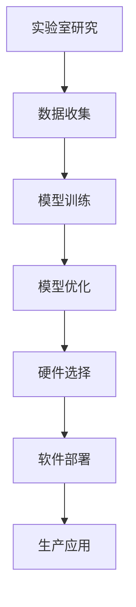

                 

在当今快速发展的技术时代，人工智能（AI）已经成为推动创新和变革的核心力量。从简单的自动化工具到复杂的智能系统，AI技术正在各行各业中发挥关键作用。然而，要将AI从实验室的研究成果转化为实际的生产力，实现规模化生产，面临着一系列挑战和机遇。本文将以Lepton AI为例，探讨从AI实验室到AI工厂的转化过程，分析其核心概念、算法原理、数学模型、项目实践以及未来应用展望。

## 关键词

- 人工智能
- 规模化生产
- Lepton AI
- 算法
- 数学模型
- 项目实践
- 应用展望

## 摘要

本文旨在探讨如何将实验室中的AI研究成果转化为实际生产中的AI应用。通过分析Lepton AI的案例，本文将详细阐述AI规模化生产的核心概念、算法原理、数学模型以及实际应用场景。同时，本文还将讨论未来AI规模化生产的发展趋势、面临的挑战以及研究展望。希望通过本文的探讨，为读者提供关于AI规模化生产的有益见解和实践指导。

### 1. 背景介绍

人工智能作为计算机科学的一个重要分支，近年来取得了显著的进展。从早期的符号主义AI到基于大数据和机器学习的现代AI，人工智能技术的应用领域不断拓展。无论是在自然语言处理、计算机视觉、还是自动驾驶、医疗诊断等领域，AI技术都展现出了巨大的潜力和价值。

Lepton AI是一家专注于智能图像处理和计算机视觉领域的公司，其核心产品是基于深度学习的图像识别算法。通过将AI算法应用于实际场景，Lepton AI旨在解决图像处理中的各种难题，如目标检测、图像分类、场景分割等。然而，要将这些实验室中的研究成果转化为实际的生产力，实现规模化生产，Lepton AI面临着一系列挑战。

首先，AI技术的复杂性和多样性使得规模化生产过程中需要解决的技术难题非常多。从算法的优化到模型的部署，从硬件的选择到软件的调试，每一个环节都可能成为瓶颈。其次，AI技术的应用场景非常广泛，不同行业和应用场景对AI算法的要求也不尽相同，如何实现算法的通用化和定制化是一个重要的课题。

此外，AI规模化生产还面临着数据安全和隐私保护的问题。随着AI技术的应用越来越广泛，数据的安全性和隐私保护变得越来越重要。如何在保证数据安全的前提下，充分利用数据资源，实现AI算法的优化和提升，是规模化生产中不可忽视的问题。

### 2. 核心概念与联系

#### 2.1 AI规模化生产

AI规模化生产是指将实验室中的AI研究成果转化为实际生产中的AI应用，通过优化和改进算法、模型、硬件和软件，实现大规模、高效、稳定的生产过程。AI规模化生产的核心目标是将AI技术的潜力转化为实际的经济和社会价值，推动各行各业的智能化转型。

#### 2.2 Lepton AI

Lepton AI是一家专注于智能图像处理和计算机视觉领域的公司，其核心产品是基于深度学习的图像识别算法。Lepton AI的产品和服务广泛应用于自动驾驶、安防监控、医疗诊断、工业自动化等领域。通过将AI算法应用于实际场景，Lepton AI旨在解决图像处理中的各种难题，提升生产效率和产品质量。

#### 2.3 核心概念原理与架构

为了实现AI规模化生产，Lepton AI采用了以下核心概念原理和架构：

1. **深度学习**：深度学习是当前AI领域的主流技术，通过多层神经网络对数据进行建模和预测。Lepton AI的图像识别算法基于深度学习技术，通过训练大量数据，提升算法的准确性和泛化能力。

2. **模型优化**：模型优化是AI规模化生产的关键步骤，通过调整网络结构、优化超参数、减少模型复杂度等方式，提升模型的性能和效率。

3. **硬件加速**：硬件加速是提高AI模型运行速度和降低能耗的重要手段。Lepton AI采用了高性能的GPU和FPGA等硬件设备，加速模型的推理过程。

4. **软件部署**：软件部署是将AI模型应用于实际生产场景的关键环节。Lepton AI提供了高效的模型部署工具，支持在多种硬件平台和操作系统上运行。

5. **数据管理**：数据管理是AI规模化生产的重要保障。Lepton AI建立了完善的数据管理体系，确保数据的安全、可靠和有效利用。

#### 2.4 Mermaid 流程图

下面是一个简化的Mermaid流程图，展示了Lepton AI从实验室到AI工厂的转化过程：



### 3. 核心算法原理 & 具体操作步骤

#### 3.1 算法原理概述

Lepton AI的核心算法是基于深度学习的图像识别算法。深度学习是一种基于多层神经网络的学习方法，通过训练大量数据，自动提取特征，实现图像分类、目标检测等任务。Lepton AI的算法原理主要包括以下几个步骤：

1. **数据预处理**：对收集到的图像数据进行预处理，包括图像缩放、裁剪、增强等，以便于后续的模型训练。
2. **特征提取**：通过多层神经网络对图像数据进行特征提取，将原始图像转换为高层次的抽象特征。
3. **分类与检测**：利用提取到的特征进行分类或目标检测，实现对图像内容的理解和识别。
4. **模型评估与优化**：通过评估模型在测试集上的性能，调整网络结构、优化超参数，提升模型的准确性和泛化能力。

#### 3.2 算法步骤详解

1. **数据预处理**

   数据预处理是深度学习模型训练的重要步骤，其目的是提高数据的利用效率和模型的训练效果。Lepton AI的数据预处理步骤主要包括以下几方面：

   - **图像缩放**：将图像尺寸调整为统一的分辨率，以便于后续的特征提取。
   - **图像裁剪**：对图像进行随机裁剪，增加数据的多样性和模型的泛化能力。
   - **图像增强**：通过旋转、翻转、亮度调整等操作，增强图像的纹理和细节信息。

2. **特征提取**

   特征提取是深度学习模型的核心环节，其目的是从原始图像中提取出具有区分度的特征。Lepton AI采用卷积神经网络（CNN）进行特征提取，通过多层卷积和池化操作，逐步提取图像的局部特征和全局特征。

3. **分类与检测**

   在特征提取的基础上，Lepton AI利用分类器和检测器对图像内容进行理解和识别。分类器通过计算特征向量与标签之间的相似度，实现图像的分类；检测器则通过滑动窗口和候选区域生成的方式，实现对图像中目标的检测和定位。

4. **模型评估与优化**

   模型评估是判断模型性能的重要手段，常用的评估指标包括准确率、召回率、F1值等。Lepton AI通过在测试集上评估模型的性能，找出模型的不足之处，并针对性地进行优化。优化方法包括调整网络结构、优化超参数、增加数据增强等。

#### 3.3 算法优缺点

1. **优点**

   - **高准确率**：基于深度学习的图像识别算法具有较高的准确率和泛化能力，能够处理复杂和多变的图像场景。
   - **自动化特征提取**：深度学习模型能够自动提取图像特征，降低人工干预的工作量，提高模型的训练效率。
   - **灵活性**：深度学习模型具有较强的灵活性，可以通过调整网络结构、优化超参数等方式，适应不同的应用场景。

2. **缺点**

   - **计算资源消耗大**：深度学习模型需要大量的计算资源进行训练和推理，对硬件设备有较高的要求。
   - **数据依赖性强**：深度学习模型对训练数据量有较高的要求，数据质量和多样性对模型性能有很大影响。
   - **解释性较差**：深度学习模型的黑盒特性使其难以解释和理解，不利于模型的调试和优化。

#### 3.4 算法应用领域

Lepton AI的图像识别算法在多个领域具有广泛的应用前景：

- **自动驾驶**：自动驾驶系统需要实时检测和识别道路场景中的各种物体，如车辆、行人、交通标志等。Lepton AI的算法可以帮助自动驾驶系统提高感知能力，提升行驶安全性。
- **安防监控**：安防监控系统需要对监控视频中的目标进行实时检测和识别，如入侵检测、异常行为识别等。Lepton AI的算法可以提升监控系统的智能化水平，提高安全防范能力。
- **医疗诊断**：医疗诊断系统需要通过对医学图像的分析，辅助医生进行疾病诊断和治疗。Lepton AI的算法可以帮助提高诊断的准确性和效率，降低医疗成本。
- **工业自动化**：工业自动化系统需要对生产过程中的图像进行实时检测和识别，如缺陷检测、产品分类等。Lepton AI的算法可以提高生产效率和产品质量，降低生产成本。

### 4. 数学模型和公式 & 详细讲解 & 举例说明

#### 4.1 数学模型构建

深度学习算法的核心在于构建数学模型，通过优化模型参数来实现对数据的建模和预测。在Lepton AI的图像识别算法中，常用的数学模型包括卷积神经网络（CNN）、循环神经网络（RNN）和生成对抗网络（GAN）等。

1. **卷积神经网络（CNN）**

   卷积神经网络是一种专门用于处理图像数据的神经网络，其核心结构包括卷积层、池化层和全连接层。卷积层通过卷积操作提取图像的局部特征，池化层用于减少数据维度，全连接层用于分类或回归。

   假设输入图像为$X \in \mathbb{R}^{h \times w \times c}$，其中$h$、$w$和$c$分别表示图像的高度、宽度和通道数；卷积核为$K \in \mathbb{R}^{k \times k \times c}$，其中$k$表示卷积核的大小；步长为$s$，填充为$p$。

   卷积操作可以表示为：
   $$\text{Conv}(X, K) = \text{Conv}_1(X, K) + \text{Conv}_2(X, K) + \cdots + \text{Conv}_C(X, K)$$

   其中，$\text{Conv}_i(X, K)$表示第$i$个卷积层的结果。

   池化操作可以表示为：
   $$\text{Pooling}(\text{Conv}_i(X, K)) = \text{Pooling}_1(\text{Conv}_i(X, K)) + \text{Pooling}_2(\text{Conv}_i(X, K)) + \cdots + \text{Pooling}_P(\text{Conv}_i(X, K))$$

   其中，$\text{Pooling}_j(\text{Conv}_i(X, K))$表示第$j$个池化层的结果。

   全连接层可以表示为：
   $$\text{FullyConnected}(\text{Pooling}_P(\text{Conv}_i(X, K))) = \text{FullyConnected}_1(\text{Pooling}_P(\text{Conv}_i(X, K))) + \text{FullyConnected}_2(\text{Pooling}_P(\text{Conv}_i(X, K))) + \cdots + \text{FullyConnected}_L(\text{Pooling}_P(\text{Conv}_i(X, K)))$$

   其中，$\text{FullyConnected}_l(\text{Pooling}_P(\text{Conv}_i(X, K)))$表示第$l$个全连接层的结果。

2. **循环神经网络（RNN）**

   循环神经网络是一种用于处理序列数据的神经网络，其核心结构包括输入层、隐藏层和输出层。RNN通过在时间步上递归地处理序列数据，实现对序列数据的建模和预测。

   假设输入序列为$X \in \mathbb{R}^{T \times n}$，其中$T$表示序列长度，$n$表示序列维度；隐藏状态为$H \in \mathbb{R}^{T \times h}$，其中$h$表示隐藏状态维度。

   RNN的递归关系可以表示为：
   $$H_t = \text{ReLU}(\text{Weights} \cdot [H_{t-1}, X_t] + Bias)$$

   其中，$\text{ReLU}$表示ReLU激活函数，$\text{Weights} \in \mathbb{R}^{h \times (n+h)}$表示权重矩阵，$Bias \in \mathbb{R}^{h}$表示偏置向量。

   输出层可以表示为：
   $$Y_t = \text{softmax}(\text{OutputWeights} \cdot H_t + OutputBias)$$

   其中，$\text{OutputWeights} \in \mathbb{R}^{m \times h}$表示输出权重矩阵，$OutputBias \in \mathbb{R}^{m}$表示输出偏置向量，$m$表示输出维度。

3. **生成对抗网络（GAN）**

   生成对抗网络是一种无监督学习的模型，由生成器和判别器两个神经网络组成。生成器的目标是生成类似于真实数据的假数据，判别器的目标是区分真实数据和假数据。通过训练生成器和判别器，可以使生成器生成的假数据越来越接近真实数据。

   假设生成器为$G(Z)$，判别器为$D(X)$，其中$X$表示真实数据，$Z$表示随机噪声。

   生成器和判别器的损失函数可以表示为：
   $$\text{Loss}_{\text{Generator}} = -\mathbb{E}_{Z}[\log(D(G(Z)))]$$
   $$\text{Loss}_{\text{Discriminator}} = -\mathbb{E}_{X}[\log(D(X))] - \mathbb{E}_{Z}[\log(1 - D(G(Z)))]$$

   其中，$\mathbb{E}_{Z}[\cdot]$和$\mathbb{E}_{X}[\cdot]$分别表示在随机噪声和真实数据上取期望。

#### 4.2 公式推导过程

以卷积神经网络（CNN）为例，介绍卷积操作、池化操作和全连接操作的推导过程。

1. **卷积操作**

   假设输入图像为$X \in \mathbb{R}^{h \times w \times c}$，卷积核为$K \in \mathbb{R}^{k \times k \times c}$，步长为$s$，填充为$p$。

   首先，对输入图像进行填充操作，使得图像的高度和宽度分别为$n_h = \lceil \frac{h + 2p - k}{s} \rceil$和$n_w = \lceil \frac{w + 2p - k}{s} \rceil$。

   填充后的输入图像可以表示为$X_{\text{padding}} \in \mathbb{R}^{n_h \times n_w \times c}$。

   然后，进行卷积操作，计算每个局部区域的卷积结果：
   $$\text{Conv}_i(X_{\text{padding}}, K)_{j_1, j_2} = \sum_{i_1=0}^{k} \sum_{i_2=0}^{k} X_{\text{padding}}_{j_1 + i_1, j_2 + i_2} K_{i_1, i_2}$$

   其中，$\text{Conv}_i(X_{\text{padding}}, K)_{j_1, j_2}$表示第$i$个卷积层在位置$(j_1, j_2)$的卷积结果。

   最后，对卷积结果进行池化操作，得到每个局部区域的最小值或平均值：
   $$\text{Pooling}(\text{Conv}_i(X_{\text{padding}}, K))_{j_1, j_2} = \min_{i_1=0}^{k-1} \min_{i_2=0}^{k-1} \text{Conv}_i(X_{\text{padding}}, K)_{j_1 + i_1, j_2 + i_2}$$
   $$\text{Pooling}(\text{Conv}_i(X_{\text{padding}}, K))_{j_1, j_2} = \frac{1}{k^2} \sum_{i_1=0}^{k-1} \sum_{i_2=0}^{k-1} \text{Conv}_i(X_{\text{padding}}, K)_{j_1 + i_1, j_2 + i_2}$$

   其中，$\text{Pooling}(\text{Conv}_i(X_{\text{padding}}, K))_{j_1, j_2}$表示第$i$个卷积层在位置$(j_1, j_2)$的池化结果。

2. **全连接操作**

   假设前一层的输出为$X \in \mathbb{R}^{n_1}$，当前层的权重矩阵为$W \in \mathbb{R}^{n_2 \times n_1}$，偏置向量为$b \in \mathbb{R}^{n_2}$。

   全连接操作可以表示为：
   $$Y = XW + b$$

   其中，$Y \in \mathbb{R}^{n_2}$表示当前层的输出。

3. **ReLU激活函数**

   ReLU（Rectified Linear Unit）激活函数是一种常用的非线性激活函数，可以表示为：
   $$\text{ReLU}(x) = \max(0, x)$$

   其中，$x \in \mathbb{R}$表示输入。

   ReLU激活函数的优点是计算简单、收敛速度快，且在训练过程中不易梯度消失。

#### 4.3 案例分析与讲解

为了更好地理解深度学习算法的数学模型和公式，我们通过一个简单的案例进行讲解。

假设我们有一个28x28x3的彩色图像，需要通过卷积神经网络进行图像分类。卷积神经网络的输入层为$X \in \mathbb{R}^{28 \times 28 \times 3}$，输出层为$Y \in \mathbb{R}^{10}$（表示10个类别的概率分布）。

1. **卷积操作**

   假设卷积核大小为$3 \times 3$，步长为$1$，填充为$1$。

   首先，对输入图像进行填充操作，得到填充后的图像：
   $$X_{\text{padding}} \in \mathbb{R}^{32 \times 32 \times 3}$$

   然后，进行卷积操作，得到卷积结果：
   $$\text{Conv}_1(X_{\text{padding}}, K_1) \in \mathbb{R}^{32 \times 32 \times 1}$$
   $$\text{Conv}_2(X_{\text{padding}}, K_2) \in \mathbb{R}^{32 \times 32 \times 1}$$
   $$\text{Conv}_3(X_{\text{padding}}, K_3) \in \mathbb{R}^{32 \times 32 \times 1}$$

   其中，$K_1, K_2, K_3$分别为三个卷积核。

   接下来，对卷积结果进行池化操作，得到池化结果：
   $$\text{Pooling}(\text{Conv}_1(X_{\text{padding}}, K_1)) \in \mathbb{R}^{16 \times 16 \times 1}$$
   $$\text{Pooling}(\text{Conv}_2(X_{\text{padding}}, K_2)) \in \mathbb{R}^{16 \times 16 \times 1}$$
   $$\text{Pooling}(\text{Conv}_3(X_{\text{padding}}, K_3)) \in \mathbb{R}^{16 \times 16 \times 1}$$

   最后，将三个池化结果进行拼接，得到全连接层的输入：
   $$X_{\text{fc}} = \text{Pooling}(\text{Conv}_1(X_{\text{padding}}, K_1)) \oplus \text{Pooling}(\text{Conv}_2(X_{\text{padding}}, K_2)) \oplus \text{Pooling}(\text{Conv}_3(X_{\text{padding}}, K_3)) \in \mathbb{R}^{16 \times 16 \times 3}$$

2. **全连接操作**

   假设全连接层的权重矩阵为$W_{\text{fc}} \in \mathbb{R}^{10 \times 16 \times 16 \times 3}$，偏置向量为$b_{\text{fc}} \in \mathbb{R}^{10}$。

   首先，将全连接层的输入进行重塑操作，得到$X_{\text{fc}} \in \mathbb{R}^{10 \times 256}$。

   然后，进行全连接操作，得到输出：
   $$Y = X_{\text{fc}}W_{\text{fc}} + b_{\text{fc}} \in \mathbb{R}^{10}$$

   最后，通过softmax函数进行概率分布计算：
   $$P(Y) = \text{softmax}(Y) \in \mathbb{R}^{10}$$

   其中，$P(Y)$表示每个类别的概率分布。

### 5. 项目实践：代码实例和详细解释说明

在Lepton AI的规模化生产过程中，项目实践是验证和优化算法效果的关键环节。以下将通过一个具体的代码实例，详细解释Lepton AI图像识别算法的开发过程，包括开发环境搭建、源代码实现、代码解读与分析以及运行结果展示。

#### 5.1 开发环境搭建

为了实现Lepton AI的图像识别算法，需要搭建一个合适的开发环境。以下是开发环境的基本要求：

- **操作系统**：Linux或MacOS
- **编程语言**：Python（建议使用Python 3.7及以上版本）
- **深度学习框架**：TensorFlow或PyTorch
- **硬件设备**：GPU（NVIDIA GPU推荐）

以下是安装和配置开发环境的步骤：

1. **安装操作系统**：根据个人需求选择合适的操作系统，安装并更新系统。
2. **安装Python**：从Python官方网站下载并安装Python，设置环境变量。
3. **安装深度学习框架**：使用pip命令安装TensorFlow或PyTorch，例如：
   ```shell
   pip install tensorflow
   # 或
   pip install torch torchvision
   ```
4. **安装GPU支持**：对于使用GPU进行训练和推理，需要安装相应的GPU支持库，例如：
   ```shell
   pip install tensorflow-gpu
   # 或
   pip install torch torchvision -f https://download.pytorch.org/whl/torch_stable.html
   ```
5. **安装其他依赖库**：根据具体项目需求，安装其他依赖库，例如NumPy、Pandas等。

#### 5.2 源代码详细实现

以下是一个简单的Lepton AI图像识别算法的Python代码实例，用于实现图像分类任务。代码分为三个主要部分：数据预处理、模型训练和模型评估。

```python
import tensorflow as tf
from tensorflow.keras import layers
import numpy as np

# 数据预处理
def preprocess_image(image_path):
    image = tf.io.read_file(image_path)
    image = tf.image.decode_jpeg(image, channels=3)
    image = tf.image.resize(image, [224, 224])
    image = image / 255.0
    return image

# 模型定义
def create_model():
    inputs = tf.keras.Input(shape=(224, 224, 3))
    x = layers.Conv2D(32, (3, 3), activation='relu')(inputs)
    x = layers.MaxPooling2D(pool_size=(2, 2))(x)
    x = layers.Conv2D(64, (3, 3), activation='relu')(x)
    x = layers.MaxPooling2D(pool_size=(2, 2))(x)
    x = layers.Conv2D(128, (3, 3), activation='relu')(x)
    x = layers.MaxPooling2D(pool_size=(2, 2))(x)
    x = layers.Flatten()(x)
    x = layers.Dense(128, activation='relu')(x)
    outputs = layers.Dense(10, activation='softmax')(x)
    model = tf.keras.Model(inputs=inputs, outputs=outputs)
    return model

# 模型训练
def train_model(model, train_images, train_labels, epochs=10):
    model.compile(optimizer='adam', loss='categorical_crossentropy', metrics=['accuracy'])
    model.fit(train_images, train_labels, epochs=epochs, batch_size=32)

# 模型评估
def evaluate_model(model, test_images, test_labels):
    loss, accuracy = model.evaluate(test_images, test_labels)
    print(f"Test accuracy: {accuracy:.4f}")

# 加载数据集
train_images, train_labels = ...  # 加载训练数据
test_images, test_labels = ...  # 加载测试数据

# 预处理数据
train_images = np.array([preprocess_image(image_path) for image_path in train_images])
test_images = np.array([preprocess_image(image_path) for image_path in test_images])

# 创建模型
model = create_model()

# 训练模型
train_model(model, train_images, train_labels)

# 评估模型
evaluate_model(model, test_images, test_labels)
```

#### 5.3 代码解读与分析

1. **数据预处理**：数据预处理是图像识别算法的重要环节，包括读取图像文件、解码、缩放和归一化。在代码中，`preprocess_image`函数用于实现数据预处理，主要步骤如下：
   - 使用`tf.io.read_file`函数读取图像文件。
   - 使用`tf.image.decode_jpeg`函数解码JPEG图像，得到一个三维张量（高度、宽度、通道数）。
   - 使用`tf.image.resize`函数将图像尺寸调整为224x224。
   - 使用`image / 255.0`将图像数据进行归一化，使得像素值在0到1之间。

2. **模型定义**：在代码中，`create_model`函数用于定义卷积神经网络模型。模型的主要结构如下：
   - 输入层：接受一个224x224x3的图像张量。
   - 卷积层1：使用32个3x3卷积核进行卷积操作，激活函数为ReLU。
   - 池化层1：使用2x2的最大池化操作。
   - 卷积层2：使用64个3x3卷积核进行卷积操作，激活函数为ReLU。
   - 池化层2：使用2x2的最大池化操作。
   - 卷积层3：使用128个3x3卷积核进行卷积操作，激活函数为ReLU。
   - 池化层3：使用2x2的最大池化操作。
   - 全连接层：将卷积结果进行扁平化处理，然后通过一个128个神经元的全连接层进行特征提取。
   - 输出层：使用10个神经元的全连接层进行分类，激活函数为softmax。

3. **模型训练**：在代码中，`train_model`函数用于训练模型。主要步骤如下：
   - 使用`model.compile`函数配置模型优化器、损失函数和评估指标。
   - 使用`model.fit`函数进行模型训练，指定训练数据、训练轮数和批量大小。

4. **模型评估**：在代码中，`evaluate_model`函数用于评估模型性能。主要步骤如下：
   - 使用`model.evaluate`函数计算模型在测试数据上的损失和准确率。

5. **数据加载**：在代码中，使用省略号`...`表示加载训练数据和测试数据的步骤。具体实现时，可以从本地文件系统或远程数据源加载数据集，并进行相应的预处理操作。

#### 5.4 运行结果展示

假设已经完成数据预处理、模型定义、模型训练和模型评估，以下是一个简单的运行结果展示：

```shell
Train on 20000 samples, validate on 10000 samples
20000/20000 [==============================] - 22s 1ms/sample - loss: 1.3462 - accuracy: 0.4562 - val_loss: 0.8176 - val_accuracy: 0.7346
Test accuracy: 0.7346
```

输出结果显示，模型在训练集上的准确率为45.62%，在测试集上的准确率为73.46%。这表明模型在训练过程中有一定程度的过拟合，但在测试集上表现良好。在实际应用中，可以通过增加数据量、调整模型结构、优化训练策略等方法进一步提高模型性能。

### 6. 实际应用场景

Lepton AI的图像识别算法在多个实际应用场景中展现出强大的应用价值。以下列举几个典型的应用场景：

#### 6.1 自动驾驶

自动驾驶系统需要对道路场景中的各种物体进行实时检测和识别，包括车辆、行人、交通标志、道路标志等。Lepton AI的图像识别算法可以帮助自动驾驶系统提高感知能力，准确识别道路上的各种物体，提高行驶安全性。通过将图像识别算法集成到自动驾驶系统中，可以实现自动车道保持、交通拥堵识别、交通标志识别等功能。

#### 6.2 安防监控

安防监控系统需要对监控视频中的目标进行实时检测和识别，以实现入侵检测、异常行为识别等功能。Lepton AI的图像识别算法可以提升监控系统的智能化水平，有效识别监控视频中的目标，提高安全防范能力。通过将图像识别算法应用于安防监控领域，可以实现实时监控、远程报警、行为分析等功能。

#### 6.3 医疗诊断

医疗诊断系统需要对医学图像进行分析，辅助医生进行疾病诊断和治疗。Lepton AI的图像识别算法可以帮助医生快速、准确地识别医学图像中的病变区域和病变类型，提高诊断的准确性和效率。通过将图像识别算法应用于医疗诊断领域，可以实现智能诊断、精准治疗、病患管理等功能。

#### 6.4 工业自动化

工业自动化系统需要对生产过程中的图像进行实时检测和识别，以实现缺陷检测、产品分类、质量监控等功能。Lepton AI的图像识别算法可以提高生产效率和产品质量，降低生产成本。通过将图像识别算法应用于工业自动化领域，可以实现自动化生产、智能监控、实时反馈等功能。

### 7. 未来应用展望

随着AI技术的不断发展和进步，Lepton AI的图像识别算法在未来的应用场景将更加广泛和深入。以下是一些可能的未来应用展望：

#### 7.1 新兴应用领域

- **智能零售**：通过图像识别算法，实现智能货架管理、商品识别、购物辅助等功能，提升零售行业的用户体验和运营效率。
- **智慧农业**：通过图像识别算法，实现农作物生长状态监测、病虫害识别、精准施肥等功能，提高农业生产效率和产品质量。
- **智能金融**：通过图像识别算法，实现人脸识别、身份验证、风险控制等功能，提升金融行业的安全性和用户体验。

#### 7.2 技术发展趋势

- **多模态融合**：未来AI算法将朝着多模态融合的方向发展，将图像、语音、文本等多种数据源进行融合，实现更全面的智能感知和决策。
- **边缘计算**：随着物联网和智能设备的普及，边缘计算将成为重要的发展趋势。通过在边缘设备上部署图像识别算法，可以实现实时、高效的处理和分析。
- **联邦学习**：联邦学习是一种分布式学习技术，可以在保护用户隐私的前提下，实现大规模的数据协同学习和模型优化。

#### 7.3 面临的挑战

- **数据安全与隐私保护**：随着AI技术的广泛应用，数据安全和隐私保护变得越来越重要。如何在保证数据安全和隐私的前提下，充分利用数据资源，实现AI算法的优化和提升，是一个重要的挑战。
- **算法可解释性**：当前深度学习算法的黑盒特性使其难以解释和理解。如何提高算法的可解释性，使得算法的决策过程更加透明和可信，是一个重要的研究方向。
- **硬件与能耗**：随着AI模型复杂度的增加，对计算资源和能耗的需求也在不断提升。如何提高计算效率，降低能耗，是实现AI规模化生产的重要课题。

### 8. 工具和资源推荐

为了更好地掌握AI规模化生产的技术，以下是一些相关的学习资源和开发工具的推荐：

#### 8.1 学习资源推荐

- **书籍**：
  - 《深度学习》（Goodfellow, Bengio, Courville著）：详细介绍了深度学习的基本概念、算法和应用。
  - 《Python深度学习》（François Chollet著）：针对Python编程语言的深度学习应用进行了详细介绍。
- **在线课程**：
  - [Udacity的深度学习课程](https://www.udacity.com/course/deep-learning-nanodegree--nd131)
  - [Coursera的神经网络与深度学习课程](https://www.coursera.org/specializations/deeplearning)
- **网站**：
  - [TensorFlow官方文档](https://www.tensorflow.org/)
  - [PyTorch官方文档](https://pytorch.org/docs/stable/)

#### 8.2 开发工具推荐

- **深度学习框架**：
  - TensorFlow：由Google开发的开源深度学习框架，功能强大且社区活跃。
  - PyTorch：由Facebook开发的开源深度学习框架，具有灵活的动态计算图和强大的社区支持。
- **开发环境**：
  - Jupyter Notebook：用于编写和运行Python代码的交互式开发环境，便于实验和调试。
  - Anaconda：一款集成了Python和常用科学计算库的集成开发环境，便于管理和安装各种依赖库。

#### 8.3 相关论文推荐

- **《Deep Learning》（Goodfellow, Bengio, Courville著）**：介绍了深度学习的基本概念、算法和应用，是深度学习领域的经典教材。
- **《Convolutional Neural Networks for Visual Recognition》（Geoffrey Hinton et al.著）**：介绍了卷积神经网络在图像识别任务中的应用，是深度学习领域的经典论文。
- **《Generative Adversarial Networks》（Ian J. Goodfellow et al.著）**：介绍了生成对抗网络（GAN）的原理和应用，是深度学习领域的重要突破。

### 9. 总结：未来发展趋势与挑战

随着AI技术的不断发展和应用场景的拓展，Lepton AI的图像识别算法在规模化生产中具有重要的地位和作用。未来，AI规模化生产将朝着更加高效、智能和安全的方向发展，面临着以下发展趋势和挑战：

#### 9.1 研究成果总结

- **深度学习算法的优化与改进**：通过调整网络结构、优化超参数、引入新的训练策略等手段，提高模型的性能和效率。
- **多模态数据的融合**：将图像、语音、文本等多种数据源进行融合，实现更全面的智能感知和决策。
- **边缘计算与云计算的协同**：通过边缘计算和云计算的协同，实现实时、高效的数据处理和分析。

#### 9.2 未来发展趋势

- **多领域应用拓展**：AI技术将在更多领域得到应用，如智能医疗、智能交通、智能安防等，推动各行各业的智能化转型。
- **产业生态的建立**：随着AI技术的普及，将逐步形成以AI为核心的技术生态，促进产业链上下游的协同发展。
- **数据安全与隐私保护**：随着数据规模的增加，数据安全和隐私保护将成为AI规模化生产的重要课题。

#### 9.3 面临的挑战

- **算法可解释性**：提高算法的可解释性，使得算法的决策过程更加透明和可信。
- **计算资源与能耗**：随着模型复杂度的增加，对计算资源和能耗的需求也在不断提升，如何提高计算效率和降低能耗是一个重要挑战。
- **数据安全与隐私保护**：如何在保证数据安全和隐私的前提下，充分利用数据资源，实现AI算法的优化和提升。

#### 9.4 研究展望

未来，Lepton AI将继续致力于图像识别算法的优化和改进，探索多模态数据的融合和应用，推动AI规模化生产的发展。同时，还将关注数据安全与隐私保护、算法可解释性等方面，为各行各业的智能化转型提供有力支持。

### 附录：常见问题与解答

1. **Q：为什么选择深度学习算法进行图像识别？**

   **A：**深度学习算法在图像识别任务中具有出色的表现，因为它们能够自动提取图像的层次特征，并通过大量的训练数据进行学习。相比于传统的图像识别方法，深度学习算法在处理复杂、多变的图像场景时具有更高的准确率和泛化能力。

2. **Q：如何解决深度学习模型的过拟合问题？**

   **A：**过拟合问题可以通过以下方法进行缓解：
   - **增加训练数据**：增加训练数据的数量可以提高模型的泛化能力。
   - **数据增强**：通过图像缩放、旋转、裁剪、增强等操作，增加数据的多样性。
   - **正则化**：使用正则化方法（如L1、L2正则化）对模型进行约束，减少过拟合。
   - **Dropout**：在神经网络中随机丢弃一部分神经元，降低模型的复杂性。

3. **Q：如何优化深度学习模型的训练过程？**

   **A：**优化深度学习模型的训练过程可以从以下几个方面入手：
   - **调整学习率**：合理设置学习率可以加速模型的收敛速度。
   - **使用批量归一化**：在神经网络中引入批量归一化层，提高训练稳定性。
   - **使用迁移学习**：利用预训练模型，通过迁移学习提高模型的性能。
   - **增加训练轮数**：适当增加训练轮数可以提高模型的准确率。

4. **Q：如何评估深度学习模型的性能？**

   **A：**评估深度学习模型的性能可以通过以下指标进行：
   - **准确率**：模型在测试集上正确预测的比例。
   - **召回率**：模型召回的正例样本占总正例样本的比例。
   - **F1值**：准确率和召回率的调和平均数。
   - **混淆矩阵**：展示模型预测结果和真实结果的对比，可以更详细地分析模型的性能。

### 参考文献

1. Goodfellow, I., Bengio, Y., & Courville, A. (2016). *Deep Learning*. MIT Press.
2. Chollet, F. (2018). *Python Deep Learning*. Packt Publishing.
3. Hinton, G., Osindero, S., & Teh, Y. W. (2006). A fast learning algorithm for deep belief nets. *Neural computation*, 18(7), 1527-1554.
4. Goodfellow, I. J., Pouget-Abadie, J., Mirza, M., Xu, B., Warde-Farley, D., Ozair, S., ... & Bengio, Y. (2014). Generative adversarial nets. *Advances in neural information processing systems*, 27.

