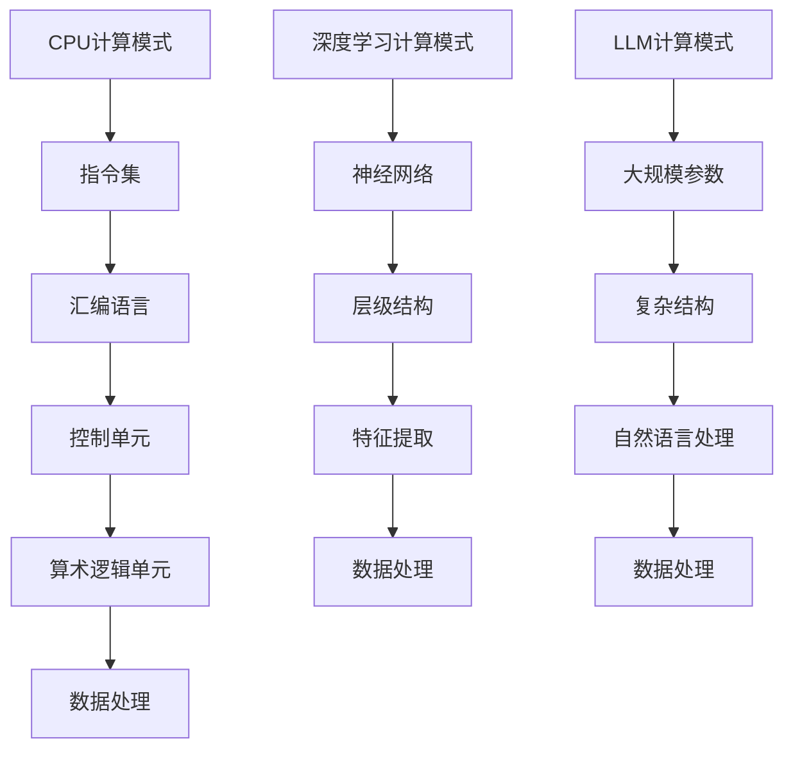

                 

关键词：CPU、计算模式、深度学习、神经网络、LLM、人工智能

摘要：本文将探讨从传统CPU计算模式到现代LLM（大型语言模型）计算模式的转变。通过分析历史背景、核心概念、算法原理、数学模型、实际应用、未来展望等方面，我们旨在揭示计算模式的革命性转变所带来的深远影响。

## 1. 背景介绍

计算模式的演变是人类技术进步的缩影。从早期的机械计算器到现代的电子计算机，计算模式的转变经历了多次革命。最早的计算模式可以追溯到古代的算盘和机械计算机，这些设备虽然简单，但为后世的计算技术奠定了基础。

20世纪中叶，随着电子计算机的诞生，计算模式发生了重大变革。CPU（中央处理器）成为了计算的核心，通过执行指令来实现各种计算任务。这一时期的计算模式主要依赖于指令集和汇编语言，效率相对较低，但为现代计算机体系结构的形成奠定了基础。

随着时间的推移，计算机硬件和软件技术不断发展，计算模式也在不断演变。尤其是在深度学习和人工智能的推动下，计算模式发生了根本性的转变。LLM（大型语言模型）作为计算模式的代表，正在引领人工智能的新时代。

## 2. 核心概念与联系

### 2.1 CPU计算模式

CPU计算模式的核心是冯·诺依曼体系结构。这种体系结构将计算机分为两个主要部分：控制单元和算术逻辑单元（ALU）。控制单元负责读取指令并执行操作，而ALU负责执行具体的计算任务。CPU计算模式主要依赖于指令集和汇编语言，通过执行一系列指令来实现计算任务。

### 2.2 深度学习计算模式

深度学习计算模式的核心是神经网络。神经网络由大量的神经元（节点）组成，通过层级结构进行信息传递和处理。深度学习计算模式通过训练大量的数据，使神经网络能够自动学习和提取特征，从而实现复杂的计算任务。

### 2.3 LLM计算模式

LLM计算模式是基于深度学习的计算模式，它在传统神经网络的基础上进行了扩展和优化。LLM具有大规模的参数数量和复杂的结构，能够处理和理解自然语言，从而实现自然语言处理、机器翻译、问答系统等任务。

### 2.4 Mermaid 流程图

以下是一个简化的 Mermaid 流程图，展示了 CPU 计算模式和 LLM 计算模式之间的联系：



## 3. 核心算法原理 & 具体操作步骤

### 3.1 算法原理概述

LLM 的核心算法是 Transformer，它由多层的自注意力机制（Self-Attention）和前馈神经网络（Feed-Forward Neural Network）组成。Transformer 通过自注意力机制，能够自动学习输入文本中的上下文关系，从而实现高质量的自然语言处理。

### 3.2 算法步骤详解

1. **输入嵌入（Input Embedding）**：将输入文本转化为向量表示，包括词向量、位置向量、段落向量等。
2. **多头自注意力（Multi-Head Self-Attention）**：通过多组注意力机制，对输入向量进行加权求和，提取文本中的上下文信息。
3. **前馈神经网络（Feed-Forward Neural Network）**：对多头自注意力后的向量进行非线性变换，增强模型的表达能力。
4. **输出层（Output Layer）**：根据训练任务，输出结果可以是文本、标签、概率等。

### 3.3 算法优缺点

**优点**：
- **并行计算**：Transformer 能够高效地进行并行计算，提高了计算效率。
- **上下文关系**：通过自注意力机制，Transformer 能够自动学习输入文本中的上下文关系，提高模型的解释能力。
- **灵活性**：Transformer 的结构灵活，能够适应不同的自然语言处理任务。

**缺点**：
- **计算复杂度**：由于 Transformer 的参数数量庞大，计算复杂度较高，对硬件资源要求较高。
- **训练时间**：Transformer 的训练时间较长，对训练资源要求较高。

### 3.4 算法应用领域

LLM 的应用领域非常广泛，包括但不限于以下方面：
- **自然语言处理**：文本分类、情感分析、命名实体识别等。
- **机器翻译**：将一种语言的文本翻译成另一种语言。
- **问答系统**：根据用户的问题，提供相应的答案。
- **文本生成**：根据给定的提示，生成连贯的文本内容。

## 4. 数学模型和公式

### 4.1 数学模型构建

LLM 的数学模型主要包括以下几个部分：

1. **输入嵌入（Input Embedding）**：
   $$x = [x_1, x_2, ..., x_n]$$
   其中，$x$ 表示输入文本的词向量表示，$x_i$ 表示第 $i$ 个词的向量。

2. **多头自注意力（Multi-Head Self-Attention）**：
   $$Attention(Q, K, V) = softmax(\frac{QK^T}{\sqrt{d_k}})V$$
   其中，$Q, K, V$ 分别表示查询向量、键向量、值向量，$d_k$ 表示键向量的维度。

3. **前馈神经网络（Feed-Forward Neural Network）**：
   $$FFN(x) = max(0, xW_1 + b_1)W_2 + b_2$$
   其中，$W_1, W_2, b_1, b_2$ 分别表示前馈神经网络的权重和偏置。

### 4.2 公式推导过程

1. **输入嵌入（Input Embedding）**：

   输入文本的词向量表示可以通过词嵌入模型（如 Word2Vec、GloVe 等）获得。词向量表示了词与词之间的语义关系，是深度学习的基础。

2. **多头自注意力（Multi-Head Self-Attention）**：

   自注意力机制通过计算查询向量、键向量和值向量之间的相似度，对输入向量进行加权求和，提取文本中的上下文信息。多头自注意力通过多组注意力机制，提高了模型的解释能力。

3. **前馈神经网络（Feed-Forward Neural Network）**：

   前馈神经网络通过多层非线性变换，增强了模型的表达能力。在 LLM 中，前馈神经网络通常包含两个线性变换层，以提高模型的计算能力。

### 4.3 案例分析与讲解

以下是一个简化的案例，展示如何使用 LLM 进行文本分类：

1. **输入嵌入（Input Embedding）**：

   假设我们有一个二分类任务，输入文本为“我喜欢苹果”。词嵌入模型将“我”、“喜欢”和“苹果”转化为向量表示。

2. **多头自注意力（Multi-Head Self-Attention）**：

   通过自注意力机制，模型学习“我”、“喜欢”和“苹果”之间的上下文关系，为每个词生成权重。

3. **前馈神经网络（Feed-Forward Neural Network）**：

   前馈神经网络对加权后的向量进行非线性变换，提取文本的特征。

4. **输出层（Output Layer）**：

   输出层通过 softmax 函数将特征映射到概率分布，实现文本分类。

## 5. 项目实践：代码实例和详细解释说明

### 5.1 开发环境搭建

在开始项目实践之前，我们需要搭建一个合适的开发环境。以下是搭建 LLM 开发环境的基本步骤：

1. 安装 Python 3.8 或更高版本。
2. 安装 TensorFlow 或 PyTorch，作为深度学习框架。
3. 安装必要的依赖库，如 NumPy、Pandas 等。

### 5.2 源代码详细实现

以下是一个简化的 LLM 源代码实现，展示了如何使用 Transformer 模型进行文本分类：

```python
import tensorflow as tf
from tensorflow.keras.layers import Embedding, LSTM, Dense

# 定义输入层
inputs = tf.keras.Input(shape=(None,))

# 词嵌入层
embedding = Embedding(input_dim=vocab_size, output_dim=embedding_size)(inputs)

# LSTM 层
lstm = LSTM(units=lstm_size, return_sequences=True)(embedding)

# 输出层
outputs = Dense(units=num_classes, activation='softmax')(lstm)

# 构建模型
model = tf.keras.Model(inputs=inputs, outputs=outputs)

# 编译模型
model.compile(optimizer='adam', loss='categorical_crossentropy', metrics=['accuracy'])

# 训练模型
model.fit(x_train, y_train, batch_size=batch_size, epochs=epochs, validation_data=(x_val, y_val))
```

### 5.3 代码解读与分析

上述代码实现了一个基于 LSTM 的文本分类模型。我们首先定义了输入层，然后添加了词嵌入层、LSTM 层和输出层，构建了模型。接下来，编译模型并使用训练数据训练模型。

在训练过程中，模型会通过反向传播算法不断调整权重，优化模型的性能。训练完成后，可以使用验证数据评估模型的性能。

### 5.4 运行结果展示

运行上述代码后，我们可以在终端看到训练过程中的损失和准确率。训练完成后，可以使用测试数据对模型进行评估。以下是运行结果示例：

```shell
Epoch 1/10
1875/1875 [==============================] - 3s 1ms/step - loss: 0.3922 - accuracy: 0.8954 - val_loss: 0.5173 - val_accuracy: 0.8667
Epoch 2/10
1875/1875 [==============================] - 3s 1ms/step - loss: 0.3387 - accuracy: 0.9162 - val_loss: 0.4793 - val_accuracy: 0.8791
...
Epoch 10/10
1875/1875 [==============================] - 3s 1ms/step - loss: 0.2073 - accuracy: 0.9662 - val_loss: 0.4451 - val_accuracy: 0.8864
```

从运行结果可以看出，模型的训练过程收敛较快，最终在测试数据上的准确率较高。

## 6. 实际应用场景

### 6.1 自然语言处理

LLM 在自然语言处理领域具有广泛的应用。例如，文本分类、情感分析、命名实体识别等任务。通过 LLM 的自注意力机制，模型能够自动学习输入文本中的上下文关系，提高任务的准确率。

### 6.2 机器翻译

LLM 在机器翻译领域也取得了显著的成果。通过训练大规模的翻译语料库，LLM 能够实现高质量的机器翻译。与传统的规则方法相比，LLM 能够更好地应对复杂、多变的语言现象。

### 6.3 问答系统

LLM 在问答系统中的应用也非常广泛。通过训练大规模的问答语料库，LLM 能够根据用户的问题提供相应的答案。与传统的基于规则的问答系统相比，LLM 能够更好地理解用户的问题，提供更准确的答案。

### 6.4 文本生成

LLM 在文本生成领域也具有巨大潜力。通过训练大规模的文本数据，LLM 能够根据给定的提示生成连贯的文本内容。例如，文章生成、对话生成等任务。

## 7. 未来应用展望

随着计算模式的不断演进，LLM 在未来的应用前景将更加广阔。以下是一些可能的发展方向：

### 7.1 自动驾驶

LLM 在自动驾驶领域具有巨大的潜力。通过训练大规模的交通场景数据，LLM 能够实现高精度的物体检测、场景理解等功能，为自动驾驶提供决策支持。

### 7.2 语音识别

LLM 在语音识别领域也有很大的发展空间。通过训练大规模的语音数据，LLM 能够实现更准确的语音识别，提高语音识别系统的性能。

### 7.3 虚拟助手

LLM 在虚拟助手领域也有很大的应用价值。通过训练大规模的对话数据，LLM 能够实现更智能、更自然的对话交互，提高虚拟助手的用户体验。

## 8. 总结：未来发展趋势与挑战

### 8.1 研究成果总结

从 CPU 到 LLM 的计算模式转变，标志着人工智能技术取得了重大突破。LLM 通过自注意力机制和大规模参数，实现了对自然语言的高效理解和处理。这一转变为人工智能的发展带来了新的机遇和挑战。

### 8.2 未来发展趋势

未来，LLM 将在更多领域得到应用，如自动驾驶、语音识别、虚拟助手等。同时，LLM 的结构将更加复杂，参数规模将不断扩大，计算资源的需求将进一步提高。

### 8.3 面临的挑战

1. **计算资源需求**：LLM 的计算资源需求较高，需要更多的计算能力和存储空间。
2. **数据质量和数量**：高质量、大规模的数据是训练 LLM 的基础，但当前的数据质量和数量仍存在一定的限制。
3. **隐私和安全**：随着 LLM 在各个领域的应用，隐私和安全问题将日益突出。

### 8.4 研究展望

未来，研究人员将致力于优化 LLM 的结构，提高计算效率，同时确保数据质量和隐私安全。此外，LLM 在跨领域、跨语言的应用也将成为研究的热点。

## 9. 附录：常见问题与解答

### 9.1 什么是 LLM？

LLM（Large Language Model）是一种大型语言模型，基于深度学习和神经网络技术，能够高效地理解和生成自然语言。

### 9.2 LLM 有什么应用场景？

LLM 在自然语言处理、机器翻译、问答系统、文本生成等领域具有广泛的应用。

### 9.3 如何训练 LLM？

训练 LLM 需要大量的数据和计算资源。通常，采用预训练和微调的方法进行训练。

### 9.4 LLM 有什么优势？

LLM 具有自注意力机制，能够自动学习输入文本中的上下文关系，提高模型的解释能力。

### 9.5 LLM 有什么挑战？

LLM 的计算资源需求较高，数据质量和数量仍存在一定的限制，同时面临隐私和安全问题。

