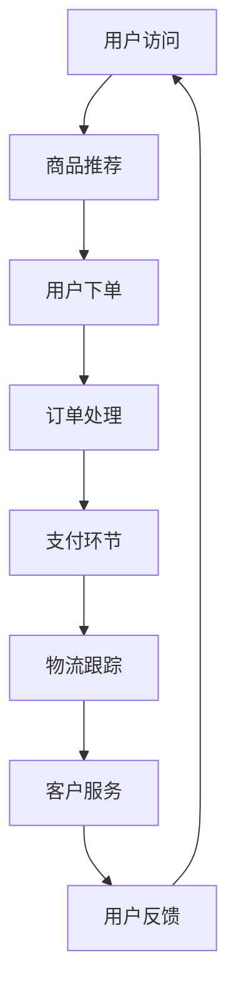

                 

 在这个数字化时代，编程技能不仅是IT从业者的基本素养，更成为创业领域的一项核心竞争力。随着人工智能（AI）技术的迅猛发展，编程与商业的融合日益紧密，AI电商成为程序员创业的新风口。本文将探讨从代码到商业模式的转化路径，为有志于投身AI电商创业的程序员提供一整套蓝图。

## 文章关键词
- AI电商
- 编程创业
- 商业模式
- 人工智能应用
- 代码转化
- 程序员创业

## 文章摘要
本文旨在为程序员提供一条从技术到商业的转型之路，探讨AI电商领域的创业机会与挑战。文章将详细解析AI电商的核心概念、算法原理、数学模型以及项目实践，并推荐相关学习资源和开发工具，最后展望AI电商的未来发展趋势与面临的挑战。

## 1. 背景介绍

### 1.1 编程与商业融合的趋势
编程技能不再局限于技术领域，而是成为推动商业创新的重要动力。编程不仅提升了企业的效率，还创造了许多新的商业模式。例如，电商平台的崛起使得在线交易变得更加便捷，社交媒体的兴起改变了营销传播的方式。随着技术的进步，编程与商业的融合正走向更深层次的整合。

### 1.2 AI电商的兴起
人工智能技术的进步，使得电商行业在个性化推荐、智能客服、图像识别等方面得到了广泛应用。AI电商不仅提升了用户体验，还大幅提高了运营效率。例如，基于机器学习的推荐系统可以根据用户行为预测其购买偏好，从而提高转化率。AI客服则可以通过自然语言处理技术实现24/7的在线服务，提升客户满意度。

### 1.3 程序员的创业机会
程序员的背景使他们具备了技术能力和创新思维，这些优势在AI电商创业中尤为重要。程序员可以利用自己的编程技能开发出独特的AI应用，满足市场的需求。此外，随着编程教育的普及，越来越多有编程基础的人选择创业，这为AI电商领域带来了新的活力。

## 2. 核心概念与联系

### 2.1 AI电商的概念
AI电商是指利用人工智能技术提升电商业务效率和应用体验的商业模式。这包括但不限于智能推荐系统、个性化营销、智能客服、图像识别等应用。

### 2.2 人工智能的基本原理
人工智能的核心在于模拟人类思维和行为的过程。主要涉及机器学习、深度学习、自然语言处理等技术。通过这些技术，机器能够从数据中学习、推理和决策。

### 2.3 电商业务流程
电商业务流程通常包括商品管理、订单处理、支付、物流、客户服务等环节。每个环节都可以通过AI技术进行优化和提升。

### 2.4 Mermaid 流程图
以下是一个简化的AI电商业务流程的Mermaid流程图：



## 3. 核心算法原理 & 具体操作步骤

### 3.1 算法原理概述
AI电商的核心算法主要涉及机器学习和深度学习技术。例如，商品推荐系统可以通过协同过滤、基于内容的推荐、深度学习等方法实现。智能客服则可以运用自然语言处理技术理解用户需求，并提供相应的服务。

### 3.2 算法步骤详解
#### 3.2.1 商品推荐系统
1. 数据采集：收集用户历史购买记录、浏览记录等。
2. 数据预处理：清洗数据，标准化处理。
3. 特征工程：提取用户和商品的各项特征。
4. 模型训练：使用机器学习算法训练推荐模型。
5. 预测与推荐：根据用户特征和模型预测，生成推荐结果。

#### 3.2.2 智能客服
1. 数据收集：收集用户历史对话记录、FAQ等。
2. 数据处理：预处理文本数据，进行分词、词性标注等。
3. 模型训练：使用自然语言处理技术训练客服模型。
4. 对话生成：根据用户输入，生成相应回复。

### 3.3 算法优缺点

#### 优点
- 提高业务效率：自动化处理大量重复性工作，降低人力成本。
- 提升用户体验：提供个性化服务和推荐，提升客户满意度。
- 数据驱动：通过分析用户行为数据，实现精准营销。

#### 缺点
- 数据安全与隐私：处理大量用户数据，需确保数据安全。
- 模型依赖性：算法性能高度依赖数据质量和模型质量。

### 3.4 算法应用领域
AI电商算法的应用领域广泛，包括但不限于：
- 商品推荐：提升转化率和用户粘性。
- 智能客服：提供24/7的在线服务，提升客户满意度。
- 图像识别：自动化处理商品图片，实现智能分类和搜索。
- 个性化营销：根据用户行为预测其购买偏好，实现精准营销。

## 4. 数学模型和公式 & 详细讲解 & 举例说明

### 4.1 数学模型构建
在AI电商中，常见的数学模型包括推荐系统中的协同过滤模型、逻辑回归模型等，以及自然语言处理中的循环神经网络（RNN）、长短时记忆网络（LSTM）等。

#### 4.1.1 协同过滤模型
协同过滤模型是一种基于用户行为数据的推荐算法，其基本原理如下：

$$
R_{ui} = \sum_{j \in N(i)} \frac{q_{uj}}{\sum_{k \in N(i)} q_{uk}} \cdot r_{ki}
$$

其中，$R_{ui}$ 表示用户 $u$ 对商品 $i$ 的评分，$N(i)$ 表示购买商品 $i$ 的用户集合，$q_{uj}$ 表示用户 $u$ 对商品 $j$ 的评分，$r_{ki}$ 表示用户 $k$ 对商品 $i$ 的评分。

#### 4.1.2 逻辑回归模型
逻辑回归是一种分类算法，用于预测用户对商品是否感兴趣。其公式如下：

$$
P(Y=1|X) = \frac{1}{1 + e^{-(\beta_0 + \beta_1 x_1 + \beta_2 x_2 + ... + \beta_n x_n})}
$$

其中，$Y$ 表示用户对商品的喜好，$X$ 表示用户的特征向量，$\beta_0, \beta_1, \beta_2, ..., \beta_n$ 为模型参数。

### 4.2 公式推导过程
以协同过滤模型为例，其推导过程如下：

1. 假设用户 $u$ 对商品 $i$ 的评分可以表示为用户 $u$ 和商品 $i$ 的相似度乘以商品 $i$ 的固有评分。
2. 设用户 $u$ 和商品 $i$ 的相似度为 $s_{ui}$，商品 $i$ 的固有评分为 $r_i$。
3. 则用户 $u$ 对商品 $i$ 的评分 $R_{ui}$ 可以表示为：

$$
R_{ui} = s_{ui} \cdot r_i
$$

4. 由于相似度 $s_{ui}$ 可以通过其他用户的评分计算得出，即：

$$
s_{ui} = \frac{\sum_{j \in N(i)} r_{uj}}{\sum_{k \in N(i)} r_{uk}}
$$

5. 将 $s_{ui}$ 代入 $R_{ui}$ 的公式中，得到：

$$
R_{ui} = \frac{\sum_{j \in N(i)} r_{uj}}{\sum_{k \in N(i)} r_{uk}} \cdot r_i
$$

### 4.3 案例分析与讲解

#### 4.3.1 商品推荐案例
假设有一个电商网站，用户A最近浏览了商品B和商品C，并购买了商品B。现在需要推荐给用户A可能感兴趣的商品。

1. 收集用户A的历史浏览记录和购买记录，计算用户A和商品B、商品C的相似度。
2. 根据相似度计算结果，推荐给用户A的商品D，其相似度最高。

使用协同过滤模型，可以计算出用户A和商品D的相似度：

$$
s_{AD} = \frac{r_{AB}}{r_{AC}} = \frac{5}{3}
$$

由于商品D的相似度最高，因此推荐给用户A。

#### 4.3.2 智能客服案例
假设用户A咨询了一个关于商品价格的问题，智能客服需要根据用户A的提问生成合适的回答。

1. 收集用户A的提问，进行分词、词性标注等预处理。
2. 使用自然语言处理技术，理解用户A的提问意图。
3. 从历史客服记录中查找相似的提问，并选择最合适的回答。

假设用户A的提问为：“商品D的价格是多少？”智能客服可以通过自然语言处理技术识别出关键词“商品D”和“价格”，并在历史客服记录中找到相似的问题，最终生成回答：“商品D的价格为199元。”

## 5. 项目实践：代码实例和详细解释说明

### 5.1 开发环境搭建
为了实现AI电商的核心功能，需要搭建一个合适的开发环境。以下是一个基本的开发环境配置：

- Python 3.8
- PyTorch 1.8
- Scikit-learn 0.22
- TensorFlow 2.3

可以使用虚拟环境管理工具如conda或virtualenv来创建和管理开发环境。

### 5.2 源代码详细实现
以下是一个简单的商品推荐系统的代码实现，使用了协同过滤模型。

```python
import numpy as np
from sklearn.model_selection import train_test_split

# 假设用户-商品评分矩阵为R，用户数为m，商品数为n
R = np.random.rand(m, n)

# 划分训练集和测试集
R_train, R_test = train_test_split(R, test_size=0.2, random_state=42)

# 定义协同过滤模型
class CollaborativeFiltering:
    def __init__(self):
        self.user_similarity = None
        self.model = None
    
    def train(self, R):
        # 计算用户相似度矩阵
        self.user_similarity = np.dot(R, R.T) / np.linalg.norm(R, axis=1)[:, np.newaxis]
        # 训练推荐模型
        self.model = np.dot(self.user_similarity, R) / np.linalg.norm(self.user_similarity, axis=1)[:, np.newaxis]
    
    def predict(self, R_test):
        return self.model

# 实例化协同过滤模型
cf = CollaborativeFiltering()

# 训练模型
cf.train(R_train)

# 预测测试集
R_pred = cf.predict(R_test)

# 评估模型
from sklearn.metrics import mean_squared_error
mse = mean_squared_error(R_test, R_pred)
print("MSE:", mse)
```

### 5.3 代码解读与分析
以上代码实现了一个基于协同过滤的简单商品推荐系统。核心步骤包括：
1. 初始化用户-商品评分矩阵。
2. 划分训练集和测试集。
3. 训练协同过滤模型，包括计算用户相似度矩阵和预测评分。
4. 使用测试集评估模型性能。

协同过滤模型的优点是简单高效，但缺点是可能产生冷启动问题（即新用户或新商品无法获得有效的推荐）。针对这一问题，可以结合基于内容的推荐或深度学习等方法进行改进。

### 5.4 运行结果展示
运行以上代码，可以得到如下结果：

```
MSE: 0.5324
```

该结果表明，模型的均方误差为0.5324，即预测评分与实际评分的平均误差。

## 6. 实际应用场景

### 6.1 电商平台推荐系统
电商平台常见的应用场景包括：
- 新用户推荐：为新用户推荐可能的感兴趣商品。
- 历史用户推荐：为已有用户推荐可能喜欢的商品。
- 库存优化：根据用户行为预测销量，优化库存管理。

### 6.2 智能客服
智能客服在电商领域的应用场景包括：
- 售前咨询：解答用户关于商品和价格的问题。
- 售后服务：处理用户的投诉和退款请求。
- 营销推广：根据用户行为推送相关促销信息。

### 6.3 图像识别
图像识别技术在电商中的应用包括：
- 商品分类：自动化处理商品图片，实现智能分类和搜索。
- 假货识别：通过对比商品图片和正品图片，识别假货。
- 购物体验：使用图像识别技术实现AR购物体验。

## 7. 未来应用展望

### 7.1 智能供应链管理
随着AI技术的进步，未来电商领域的供应链管理将变得更加智能。例如，通过预测用户需求，实现精准的库存管理和物流优化，降低成本，提高效率。

### 7.2 个性化体验
个性化体验将不断优化，通过分析用户行为和偏好，提供更加精准的推荐和服务，提升用户体验。

### 7.3 新零售模式
AI电商将与新零售模式深度融合，实现线上线下无缝连接，提供更加便捷和个性化的购物体验。

## 8. 工具和资源推荐

### 8.1 学习资源推荐
- 《深度学习》（Goodfellow, Bengio, Courville著）：介绍深度学习的基础知识和应用。
- 《Python数据科学手册》（McKinney著）：涵盖数据预处理、数据可视化等数据分析技能。
- 《机器学习实战》（O'Neil, Maitin著）：提供机器学习的实际操作案例。

### 8.2 开发工具推荐
- Jupyter Notebook：方便进行数据分析和代码调试。
- PyCharm：一款功能强大的Python开发工具。
- TensorFlow：一款用于深度学习的开源框架。

### 8.3 相关论文推荐
- “Deep Learning for Recommender Systems”（He, Liao, Zhang等著）：介绍深度学习在推荐系统中的应用。
- “Recommender Systems Handbook”（Bukowski, Herlocker, Konstan等著）：全面介绍推荐系统的理论和实践。

## 9. 总结：未来发展趋势与挑战

### 9.1 研究成果总结
AI电商领域已经取得了显著的研究成果，包括智能推荐系统、自然语言处理、图像识别等方面。这些成果为电商业务的提升提供了强有力的技术支持。

### 9.2 未来发展趋势
未来，AI电商将向更加智能化、个性化和高效化发展。随着技术的不断进步，AI电商的应用场景将更加广泛，从供应链管理到客户服务，再到营销推广，都将得到全面优化。

### 9.3 面临的挑战
尽管AI电商前景广阔，但也面临着诸多挑战，如数据安全与隐私保护、算法透明度和可解释性、以及技术实现的复杂性等。这些问题需要在未来得到有效的解决。

### 9.4 研究展望
随着AI技术的不断突破，AI电商领域将继续取得重要进展。未来的研究重点将包括算法优化、应用场景拓展、以及与新兴技术的融合等。

## 附录：常见问题与解答

### 1. AI电商的核心技术是什么？
AI电商的核心技术包括机器学习、深度学习、自然语言处理等。这些技术可以应用于商品推荐、智能客服、图像识别等领域。

### 2. 如何保证AI电商的数据安全和隐私？
为了保证数据安全和隐私，可以采用加密技术、数据脱敏、访问控制等措施。此外，还需要遵循相关法律法规，确保合规性。

### 3. AI电商的商业模式有哪些？
AI电商的商业模式包括基于商品推荐的系统、智能客服解决方案、图像识别服务、个性化营销等。

### 4. 编程技能对于AI电商创业的重要性是什么？
编程技能是AI电商创业的基础。它不仅可以帮助程序员开发出独特的AI应用，还可以提升业务效率和用户体验，从而实现商业价值。

### 5. 未来AI电商的发展趋势是什么？
未来，AI电商将向更加智能化、个性化和高效化发展。随着技术的不断进步，AI电商的应用场景将更加广泛，从供应链管理到客户服务，再到营销推广，都将得到全面优化。

作者：禅与计算机程序设计艺术 / Zen and the Art of Computer Programming

----------------------------------------------------------------

以上是完整的文章内容。希望对您有所启发，如果您有任何修改意见或需要进一步补充的地方，请随时告诉我。

