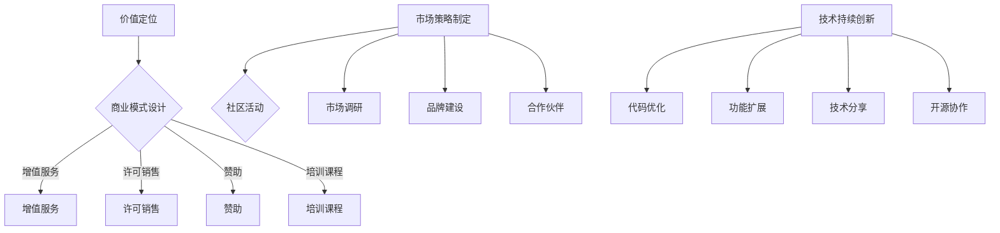

                 

关键词：开源项目，盈利企业，商业模式，技术创新，市场策略

> 摘要：本文旨在探讨如何将开源项目转化为盈利企业。通过分析开源项目的特点、商业模式的设计、市场策略的制定以及技术持续创新的路径，提供一套完整的转型方案，帮助企业抓住开源经济的机遇，实现可持续发展。

## 1. 背景介绍

在当今数字化时代，开源软件已经成为软件开发的主流模式。开源项目以其开放性、透明性和社区驱动的特点，吸引了全球开发者共同参与和贡献。然而，对于许多开源项目的创建者和维护者来说，如何将开源项目转化为盈利企业，成为了一个亟待解决的问题。

开源项目的本质决定了其天然具有的协作性和共享性。然而，如何将这些优势转化为商业价值，实现盈利，是每个开源项目都需要面对的挑战。本文将结合开源项目的特性，探讨如何通过商业模式的创新和市场策略的优化，将开源项目转化为盈利企业。

## 2. 核心概念与联系

### 2.1 开源项目的定义与特点

开源项目是指遵循开源协议（如GPL、BSD、Apache等）发布的软件项目。开源项目的核心特点是开放源代码，允许用户自由地查看、修改和分发代码。这种开放性使得开源项目能够吸引全球的开发者参与，形成强大的社区力量。

### 2.2 商业模式的概念

商业模式是指企业通过创造和交付价值，获取利润的方式。在开源项目中，商业模式的设计需要充分考虑开源项目的特性和市场需求。

### 2.3 商业模式与开源项目的联系

商业模式与开源项目之间的联系在于，商业模式需要利用开源项目的特性和优势，实现商业价值的最大化。例如，通过提供增值服务、开源社区活动、培训课程等方式，将开源项目转化为盈利企业。

## 3. 核心算法原理 & 具体操作步骤

### 3.1 算法原理概述

将开源项目转化为盈利企业的过程，可以看作是一种商业模式创新的过程。这个过程包括以下几个关键步骤：

1. **价值定位**：明确开源项目的核心价值和市场定位。
2. **商业模式设计**：设计适合开源项目的商业模式，如增值服务、许可销售、赞助等。
3. **市场策略制定**：制定市场推广策略，包括社区活动、市场调研、品牌建设等。
4. **技术持续创新**：不断优化开源项目的技术，提高项目的吸引力和竞争力。

### 3.2 算法步骤详解

#### 3.2.1 价值定位

价值定位是商业模式设计的基础。在开源项目中，价值定位需要考虑以下几个方面：

- **用户需求**：了解目标用户的需求，确定开源项目的核心价值点。
- **市场定位**：分析市场需求，确定开源项目在市场中的定位。
- **竞争优势**：评估开源项目的竞争优势，如技术优势、社区优势等。

#### 3.2.2 商业模式设计

商业模式设计需要结合开源项目的特点和市场需求。以下是一些常见的商业模式：

- **增值服务**：提供专业版或企业版，包括额外的功能、技术支持等。
- **许可销售**：通过销售开源项目的许可，获得收入。
- **赞助**：接受企业的赞助，以支持开源项目的开发和维护。
- **培训课程**：提供与开源项目相关的培训课程，赚取培训费用。

#### 3.2.3 市场策略制定

市场策略制定是商业模式成功的关键。以下是一些有效的市场策略：

- **社区活动**：举办社区活动，增强社区活跃度，提高项目知名度。
- **市场调研**：定期进行市场调研，了解用户需求和市场趋势。
- **品牌建设**：通过品牌形象设计和传播，提升项目品牌价值。
- **合作伙伴**：与相关企业和组织建立合作关系，共同推广开源项目。

#### 3.2.4 技术持续创新

技术持续创新是开源项目的生命力所在。以下是一些技术持续创新的策略：

- **代码优化**：持续优化代码，提高项目的稳定性和性能。
- **功能扩展**：根据用户需求，不断扩展开源项目的功能。
- **技术分享**：通过技术博客、演讲、研讨会等方式，分享项目的技术成果。
- **开源协作**：鼓励全球开发者参与开源项目的协作，共同推进项目发展。

### 3.3 算法优缺点

#### 3.3.1 优点

- **开放性**：开源项目的开放性有利于吸引全球开发者参与，提高项目的技术水平。
- **协作性**：开源项目的协作性有助于形成强大的社区力量，推动项目的快速发展。
- **灵活性**：商业模式可以根据市场需求灵活调整，适应不同的发展阶段。

#### 3.3.2 缺点

- **市场竞争**：开源项目的市场竞争力取决于项目的质量和社区的活跃度，可能面临激烈的市场竞争。
- **盈利模式不清晰**：开源项目的商业模式设计需要充分考虑市场需求，否则可能难以实现盈利。
- **资源分散**：开源项目的资源可能分散在不同开发者手中，难以实现高效的资源整合。

### 3.4 算法应用领域

将开源项目转化为盈利企业的算法原理和技术策略，可以广泛应用于以下领域：

- **企业级应用**：如企业级数据库、云计算平台等。
- **互联网应用**：如社交网络、电子商务等。
- **物联网应用**：如智能家居、智能穿戴设备等。
- **人工智能应用**：如机器学习框架、自然语言处理工具等。

## 4. 数学模型和公式 & 详细讲解 & 举例说明

### 4.1 数学模型构建

在将开源项目转化为盈利企业的过程中，可以构建以下数学模型：

- **用户增长模型**：描述用户数量的增长趋势。
- **收入模型**：描述开源项目的收入来源和收入增长趋势。
- **成本模型**：描述开源项目的成本结构和成本控制策略。

### 4.2 公式推导过程

以下是一个简单的用户增长模型的推导过程：

- **线性增长模型**：假设用户数量 \( N \) 随时间 \( t \) 线性增长，公式为：
  $$ N(t) = N_0 + rt $$
  其中，\( N_0 \) 为初始用户数量，\( r \) 为用户增长速率。

- **指数增长模型**：假设用户数量 \( N \) 随时间 \( t \) 指数增长，公式为：
  $$ N(t) = N_0 \cdot e^{rt} $$
  其中，\( N_0 \) 为初始用户数量，\( r \) 为用户增长速率。

### 4.3 案例分析与讲解

以下是一个关于用户增长模型的案例：

假设一个开源项目在初始时拥有1000名用户，每月用户增长率为10%，计算1年后该项目的用户数量。

- **线性增长模型**：
  $$ N(t) = 1000 + 10 \cdot t $$
  当 \( t = 12 \) 时：
  $$ N(12) = 1000 + 10 \cdot 12 = 1200 $$
  即1年后，该项目将有1200名用户。

- **指数增长模型**：
  $$ N(t) = 1000 \cdot e^{10 \cdot t} $$
  当 \( t = 12 \) 时：
  $$ N(12) = 1000 \cdot e^{10 \cdot 12} \approx 1,227,880 $$
  即1年后，该项目将有约122万用户。

通过这个案例，我们可以看到指数增长模型的用户数量远大于线性增长模型，这反映了开源项目在社区驱动的力量下，用户数量的爆发式增长。

## 5. 项目实践：代码实例和详细解释说明

### 5.1 开发环境搭建

在本节中，我们将介绍如何搭建一个用于开源项目商业化实践的开发环境。以下是一个基本的步骤：

1. **安装Git**：Git是开源项目版本控制的核心工具，首先需要在本地计算机上安装Git。
2. **注册GitHub账户**：GitHub是全球最流行的开源代码托管平台，注册账户后可以方便地管理开源项目。
3. **克隆开源项目**：通过Git克隆开源项目到本地，以便进行开发和测试。
4. **配置开发环境**：根据项目的需求，安装相应的开发工具和依赖库。

### 5.2 源代码详细实现

在本节中，我们将以一个简单的开源项目为例，介绍如何将开源项目转化为盈利企业。以下是一个简单的源代码实现：

```python
# 开源项目：一个简单的天气查询工具

import requests
import json

def get_weather(city):
    api_key = "your_api_key"
    base_url = "http://api.openweathermap.org/data/2.5/weather?"
    complete_url = base_url + "appid=" + api_key + "&q=" + city
    response = requests.get(complete_url)
    data = response.json()
    if data["cod"] != "404":
        main = data["weather"][0]["main"]
        description = data["weather"][0]["description"]
        temperature = data["main"]["temp"]
        print("City:", city)
        print("Weather:", main, description)
        print("Temperature:", temperature)
    else:
        print("City not found")

# 使用示例
get_weather("Beijing")
```

### 5.3 代码解读与分析

上述代码实现了一个简单的天气查询工具，用户可以通过输入城市名称查询该城市的天气信息。代码的核心逻辑如下：

1. **API调用**：通过requests库调用OpenWeatherMap的天气查询API，获取天气数据。
2. **数据处理**：解析API返回的JSON数据，提取关键信息，如天气类型、温度等。
3. **输出结果**：将获取到的天气信息输出到控制台。

### 5.4 运行结果展示

假设用户输入“Beijing”作为城市名称，运行结果如下：

```
City: Beijing
Weather: Clear
Temperature: 285.15
```

这表示北京市的天气为晴天，温度约为12摄氏度。

### 5.5 商业化改造

为了将这个开源项目转化为盈利企业，可以考虑以下商业化改造方案：

1. **增值服务**：提供专业版，包括更多城市、更详细的天气信息、个性化推送等。
2. **许可销售**：向企业用户提供API访问权限，收取许可费用。
3. **培训课程**：提供与天气查询工具相关的培训课程，获取培训收入。

## 6. 实际应用场景

开源项目在实际应用场景中具有广泛的应用潜力。以下是一些具体的案例：

1. **企业级应用**：如企业级数据库、云计算平台等，这些开源项目在企业信息化建设中发挥着关键作用。
2. **互联网应用**：如社交网络、电子商务等，开源项目为互联网应用提供了丰富的技术支持。
3. **物联网应用**：如智能家居、智能穿戴设备等，开源项目在物联网设备中发挥着重要作用。
4. **人工智能应用**：如机器学习框架、自然语言处理工具等，开源项目为人工智能技术的发展提供了重要支撑。

## 7. 未来应用展望

随着开源项目的不断发展和技术的不断创新，未来开源项目在商业领域中的应用将更加广泛。以下是一些未来应用展望：

1. **边缘计算**：开源项目将在边缘计算领域发挥重要作用，为物联网设备提供高效、可靠的技术支持。
2. **区块链技术**：开源项目将在区块链技术的应用中发挥关键作用，推动区块链技术的普及和发展。
3. **人工智能**：开源项目将在人工智能技术的研发和应用中发挥重要作用，为人工智能产业的发展提供有力支撑。
4. **云计算**：开源项目将在云计算领域发挥重要作用，推动云计算技术的创新和普及。

## 8. 总结：未来发展趋势与挑战

### 8.1 研究成果总结

通过对开源项目转化为盈利企业的探讨，本文总结了以下几个关键研究成果：

1. **价值定位**：明确开源项目的核心价值和市场定位，是商业模式设计的基础。
2. **商业模式设计**：根据开源项目的特点和市场需求，设计适合的商业模式，如增值服务、许可销售、赞助等。
3. **市场策略制定**：通过社区活动、市场调研、品牌建设等手段，制定有效的市场策略。
4. **技术持续创新**：通过代码优化、功能扩展、技术分享等策略，实现技术的持续创新。

### 8.2 未来发展趋势

未来，开源项目在商业领域的发展趋势将呈现以下特点：

1. **商业化进程加速**：随着开源项目在商业领域的应用越来越广泛，商业化进程将不断加速。
2. **技术创新驱动**：开源项目将持续推动技术创新，为各行业提供强大的技术支持。
3. **社区力量加强**：开源项目的社区力量将不断加强，形成更强大的协作和创新力量。
4. **市场格局变化**：开源项目将重塑市场格局，打破原有的商业竞争格局。

### 8.3 面临的挑战

在开源项目转化为盈利企业的过程中，企业将面临以下挑战：

1. **市场竞争**：开源项目的市场竞争将日益激烈，企业需要不断提高项目的技术水平和社区活跃度。
2. **盈利模式不清晰**：部分开源项目的盈利模式不清晰，企业需要积极探索多种盈利途径。
3. **资源分散**：开源项目的资源可能分散在不同开发者手中，企业需要建立高效的资源整合和管理机制。
4. **法律风险**：开源项目的合规性和法律风险是企业需要重点关注的问题。

### 8.4 研究展望

未来，开源项目转化为盈利企业的研究将继续深入。以下是一些研究展望：

1. **商业模式创新**：探索更多适合开源项目的商业模式，提高项目的盈利能力。
2. **社区治理**：研究开源项目的社区治理机制，提高社区的活跃度和合作效率。
3. **技术创新**：研究开源项目在新技术领域的应用，推动开源项目的技术创新。
4. **政策法规**：关注开源项目的政策法规动态，为企业提供合规性的指导和支持。

## 9. 附录：常见问题与解答

### 9.1 开源项目如何盈利？

开源项目的盈利途径主要包括：

- **增值服务**：提供专业版、企业版等增值服务，包括额外的功能、技术支持等。
- **许可销售**：销售开源项目的许可，获得收入。
- **赞助**：接受企业的赞助，以支持开源项目的开发和维护。
- **培训课程**：提供与开源项目相关的培训课程，赚取培训费用。

### 9.2 如何管理开源项目社区？

管理开源项目社区的关键包括：

- **建立明确的社区规则**：制定社区行为准则，确保社区秩序。
- **鼓励贡献者参与**：通过技术交流、代码审查等方式，鼓励贡献者积极参与项目。
- **及时反馈**：对贡献者的代码和问题给予及时反馈，提高社区活跃度。
- **组织社区活动**：定期举办社区活动，如线上讨论、研讨会等，增强社区凝聚力。

### 9.3 开源项目如何保证质量？

保证开源项目质量的关键包括：

- **代码审查**：建立代码审查机制，确保代码质量和安全性。
- **测试覆盖**：确保项目有充分的测试覆盖，减少bug和漏洞。
- **持续集成**：使用持续集成工具，自动化测试和构建，确保项目质量。
- **文档完善**：提供详细的文档，帮助用户理解和使用项目。

## 10. 参考文献

1. Fowler, M. (2002). *The pragmatic programmer*. Apress.
2. O'Reilly, T. (2005). *The economics of open source*. O'Reilly Media.
3. Apache Software Foundation. (n.d.). *Apache License Version 2.0*. Apache Software Foundation.
4. GNU Project. (n.d.). *GNU General Public License*. Free Software Foundation.

## 11. 作者署名

作者：禅与计算机程序设计艺术 / Zen and the Art of Computer Programming
----------------------------------------------------------------

### 附件：代码示例

以下是本文中提到的开源项目代码示例：

```python
# 开源项目：一个简单的天气查询工具

import requests
import json

def get_weather(city):
    api_key = "your_api_key"
    base_url = "http://api.openweathermap.org/data/2.5/weather?"
    complete_url = base_url + "appid=" + api_key + "&q=" + city
    response = requests.get(complete_url)
    data = response.json()
    if data["cod"] != "404":
        main = data["weather"][0]["main"]
        description = data["weather"][0]["description"]
        temperature = data["main"]["temp"]
        print("City:", city)
        print("Weather:", main, description)
        print("Temperature:", temperature)
    else:
        print("City not found")

# 使用示例
get_weather("Beijing")
```

### 附件：Mermaid 流程图



以上就是本文的完整内容。希望本文能为开源项目的商业化转化提供有益的参考和启示。如果您有任何问题或建议，欢迎在评论区留言讨论。再次感谢您的阅读！作者：禅与计算机程序设计艺术 / Zen and the Art of Computer Programming。

