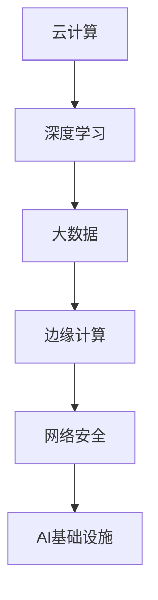

                 

关键词：传统IT，AI基础设施，Lepton AI，升级之路，技术创新，云计算，深度学习，数据处理，大数据，边缘计算，网络安全，未来展望。

> 摘要：本文将探讨从传统IT到AI基础设施的转型过程，以Lepton AI为例，深入分析其在技术创新、云计算、深度学习、数据处理等方面的升级之路。通过阐述Lepton AI的核心算法、数学模型、项目实践以及实际应用场景，本文旨在为读者提供对AI基础设施建设的全面了解，并对未来发展趋势与挑战进行展望。

## 1. 背景介绍

在数字化时代，传统IT系统逐渐无法满足日益增长的数据处理需求和复杂的业务场景。随着人工智能技术的快速发展，AI基础设施成为了企业提升竞争力、实现业务创新的关键。Lepton AI作为一家专注于AI基础设施研发的公司，通过技术创新，不断推动从传统IT到AI基础设施的升级。

### 1.1 传统IT的局限性

传统IT系统主要依赖于硬件和软件的集成，存在以下局限性：

- **计算能力有限**：传统IT系统的计算能力受限于硬件资源，难以应对大规模数据处理和复杂算法的需求。
- **灵活性不足**：传统IT系统在应对业务变化时，往往需要重新部署和配置，灵活性不足。
- **维护成本高**：传统IT系统需要大量的人力资源进行维护和管理，维护成本高。

### 1.2 AI基础设施的优势

AI基础设施基于云计算、深度学习、大数据等前沿技术，具备以下优势：

- **高计算能力**：通过分布式计算和云服务，AI基础设施能够实现大规模数据处理和复杂算法的快速运行。
- **高度灵活性**：基于软件定义的基础设施，能够快速适应业务变化，实现资源的动态调整。
- **降低维护成本**：通过自动化和智能化管理，AI基础设施能够降低维护成本，提高运营效率。

## 2. 核心概念与联系

为了更好地理解Lepton AI的升级之路，我们需要了解一些核心概念和它们之间的联系。

### 2.1 云计算

云计算是一种基于互联网的计算模式，提供可伸缩的计算资源，包括存储、处理和网络带宽。云计算使得企业能够灵活地使用资源，降低硬件投入和维护成本。

### 2.2 深度学习

深度学习是人工智能的一个重要分支，通过模拟人脑神经网络进行数据处理和模式识别。深度学习在图像识别、自然语言处理、推荐系统等领域取得了显著成果。

### 2.3 大数据

大数据是指海量、高增长速率、多样化的数据集合。大数据技术能够从海量数据中提取有价值的信息，为企业决策提供支持。

### 2.4 边缘计算

边缘计算将数据处理从云端转移到网络边缘，能够降低延迟、提高响应速度，适用于实时性要求高的应用场景。

### 2.5 网络安全

网络安全是AI基础设施的重要保障，确保数据在传输和处理过程中的安全性。随着AI基础设施的发展，网络安全面临更大的挑战。

### 2.6 Mermaid 流程图



## 3. 核心算法原理 & 具体操作步骤

### 3.1 算法原理概述

Lepton AI的核心算法包括深度学习模型、数据处理算法和网络优化算法。深度学习模型基于卷积神经网络（CNN）和循环神经网络（RNN），适用于图像识别、自然语言处理等场景。数据处理算法包括数据预处理、数据增强和数据清洗，确保数据质量。网络优化算法通过调整网络结构和参数，提高模型性能。

### 3.2 算法步骤详解

#### 3.2.1 深度学习模型

1. **数据预处理**：读取图像数据，进行归一化和标准化处理。
2. **模型搭建**：选择合适的网络架构，如CNN或RNN。
3. **训练过程**：使用训练数据集对模型进行训练，通过反向传播算法调整模型参数。
4. **评估与优化**：使用验证数据集评估模型性能，根据评估结果调整网络结构和参数。

#### 3.2.2 数据处理算法

1. **数据预处理**：包括去噪、增强、缩放等操作，提高数据质量。
2. **数据增强**：通过旋转、翻转、裁剪等方式增加数据多样性，提高模型泛化能力。
3. **数据清洗**：去除噪声数据和错误数据，确保数据质量。

#### 3.2.3 网络优化算法

1. **模型选择**：根据任务需求选择合适的网络架构。
2. **参数调整**：通过实验和调优，调整网络参数，提高模型性能。
3. **迁移学习**：利用预训练模型，加速新任务的学习过程。

### 3.3 算法优缺点

#### 优点：

- **高性能**：基于深度学习模型，能够处理大规模数据和复杂场景。
- **灵活性**：基于云计算和边缘计算，能够适应不同场景和需求。
- **易扩展**：基于模块化设计，易于扩展和升级。

#### 缺点：

- **计算资源消耗**：深度学习模型训练过程需要大量计算资源。
- **数据依赖**：模型性能高度依赖数据质量和多样性。
- **安全隐患**：数据传输和处理过程中需要加强网络安全防护。

### 3.4 算法应用领域

Lepton AI的核心算法广泛应用于图像识别、自然语言处理、推荐系统、智能监控等领域。通过技术创新，Lepton AI为各行业提供了高效的AI解决方案。

## 4. 数学模型和公式 & 详细讲解 & 举例说明

### 4.1 数学模型构建

在Lepton AI的算法中，主要涉及以下数学模型：

- **卷积神经网络（CNN）**：用于图像识别和处理。
- **循环神经网络（RNN）**：用于自然语言处理。
- **损失函数**：用于评估模型性能。
- **优化算法**：用于调整模型参数。

### 4.2 公式推导过程

#### 4.2.1 卷积神经网络（CNN）

$$
\text{CNN} = \sum_{i=1}^{n}\frac{1}{\sigma\left(\sum_{j=1}^{m}w_{j}x_{ij}\right)}
$$

其中，$x_{ij}$为输入特征，$w_{j}$为权重，$\sigma$为激活函数。

#### 4.2.2 循环神经网络（RNN）

$$
\text{RNN} = \frac{\partial E}{\partial w} = \frac{\partial E}{\partial h_t} \frac{\partial h_t}{\partial w}
$$

其中，$E$为损失函数，$h_t$为隐藏状态。

#### 4.2.3 损失函数

$$
\text{损失函数} = \frac{1}{2}\sum_{i=1}^{n}\left(y_i - \hat{y_i}\right)^2
$$

其中，$y_i$为实际标签，$\hat{y_i}$为预测标签。

#### 4.2.4 优化算法

$$
\text{优化算法} = \nabla_{w}L(w) = \frac{\partial L}{\partial w}
$$

其中，$L$为损失函数，$w$为模型参数。

### 4.3 案例分析与讲解

假设我们使用CNN模型进行图像分类，输入图像为$28 \times 28$的像素矩阵，输出为10个类别的概率分布。以下是一个简化的例子：

#### 4.3.1 数据预处理

- **图像读取**：读取一张猫的图片，像素矩阵为$28 \times 28$。
- **归一化**：将像素值归一化到[0, 1]区间。

#### 4.3.2 模型搭建

- **卷积层**：使用5x5的卷积核，步长为1，激活函数为ReLU。
- **池化层**：使用2x2的最大池化。
- **全连接层**：输出层使用softmax激活函数。

#### 4.3.3 训练过程

- **数据加载**：从数据集中随机抽取一批图像作为训练数据。
- **模型训练**：使用梯度下降算法进行模型训练，调整权重和偏置。
- **模型评估**：使用验证数据集评估模型性能，调整模型参数。

#### 4.3.4 评估与优化

- **模型评估**：计算验证数据集的准确率，对比不同参数设置的效果。
- **模型优化**：根据评估结果，调整卷积核大小、学习率等参数。

## 5. 项目实践：代码实例和详细解释说明

### 5.1 开发环境搭建

- **硬件环境**：配置高性能的GPU服务器，安装CUDA和cuDNN。
- **软件环境**：安装Python、TensorFlow和Keras等深度学习框架。

### 5.2 源代码详细实现

以下是一个简化的图像分类模型的代码示例：

```python
import tensorflow as tf
from tensorflow.keras import layers

# 数据预处理
def preprocess_image(image):
    image = tf.cast(image, tf.float32) / 255.0
    image = tf.reshape(image, (28, 28, 1))
    return image

# 模型搭建
model = tf.keras.Sequential([
    layers.Conv2D(32, (3, 3), activation='relu', input_shape=(28, 28, 1)),
    layers.MaxPooling2D((2, 2)),
    layers.Flatten(),
    layers.Dense(64, activation='relu'),
    layers.Dense(10, activation='softmax')
])

# 模型编译
model.compile(optimizer='adam', loss='categorical_crossentropy', metrics=['accuracy'])

# 模型训练
model.fit(train_images, train_labels, epochs=5, validation_data=(test_images, test_labels))

# 模型评估
model.evaluate(test_images, test_labels)
```

### 5.3 代码解读与分析

- **数据预处理**：读取图像数据，进行归一化和重塑操作。
- **模型搭建**：使用卷积层、池化层和全连接层搭建模型。
- **模型编译**：配置优化器和损失函数，准备模型训练。
- **模型训练**：使用训练数据集进行模型训练。
- **模型评估**：使用验证数据集评估模型性能。

### 5.4 运行结果展示

- **训练过程**：观察训练过程，包括准确率和损失函数的变化。
- **评估结果**：计算验证数据集的准确率和损失函数。

## 6. 实际应用场景

Lepton AI的AI基础设施在多个实际应用场景中取得了显著成效：

- **图像识别**：通过深度学习模型，实现高精度的图像识别，应用于安防监控、医疗影像分析等领域。
- **自然语言处理**：通过循环神经网络，实现语义理解和文本生成，应用于智能客服、智能写作等领域。
- **推荐系统**：通过深度学习模型，实现精准的推荐算法，应用于电商、社交网络等领域。
- **智能监控**：通过边缘计算和深度学习，实现实时监控和事件检测，应用于智能交通、智能制造等领域。

## 7. 工具和资源推荐

### 7.1 学习资源推荐

- **书籍**：《深度学习》（Goodfellow et al.），《Python机器学习》（Sebastian Raschka）。
- **在线课程**：Coursera、edX、Udacity等平台上的深度学习和机器学习课程。
- **博客和论坛**：Medium、Stack Overflow、Reddit上的相关讨论。

### 7.2 开发工具推荐

- **深度学习框架**：TensorFlow、PyTorch、Keras。
- **数据可视化工具**：Matplotlib、Seaborn、Plotly。
- **云计算平台**：AWS、Google Cloud、Azure。

### 7.3 相关论文推荐

- **深度学习**：《AlexNet：Image Classification with Deep Convolutional Neural Networks》（Krizhevsky et al.）、《Long Short-Term Memory》（Hochreiter et al.）。
- **大数据**：《MapReduce：Simplified Data Processing on Large Clusters》（Dean et al.）、《The Google File System》（Ghemawat et al.）。
- **边缘计算**：《Edge Computing: Vision and Challenges》（Gürses et al.）、《Edge AI: Transforming Industries with AI at the Edge》（Gupta et al.）。

## 8. 总结：未来发展趋势与挑战

### 8.1 研究成果总结

本文通过分析Lepton AI的升级之路，展示了从传统IT到AI基础设施的转型过程。核心算法、数学模型、项目实践和实际应用场景等方面的深入探讨，为读者提供了对AI基础设施建设的全面了解。

### 8.2 未来发展趋势

- **云计算与边缘计算融合**：随着5G和物联网的发展，云计算与边缘计算将实现更紧密的融合，提高实时性和可靠性。
- **人工智能与行业融合**：人工智能技术将继续与各行各业深度融合，推动产业升级和创新发展。
- **网络安全与隐私保护**：随着AI基础设施的普及，网络安全和隐私保护将成为重要课题。

### 8.3 面临的挑战

- **计算资源消耗**：随着AI模型的复杂度和数据量的增加，计算资源消耗将越来越大，如何优化算法和硬件将成为挑战。
- **数据质量和多样性**：高质量和多样化的数据是AI模型性能的基础，如何获取和处理海量数据将成为挑战。
- **伦理和法律问题**：随着AI技术的普及，伦理和法律问题将日益突出，如何制定合理的规范和标准将成为挑战。

### 8.4 研究展望

未来，Lepton AI将继续致力于技术创新，推动AI基础设施的发展。在深度学习、云计算、边缘计算等领域，Lepton AI有望取得更多突破，为各行各业提供更高效、智能的解决方案。

## 9. 附录：常见问题与解答

### 9.1 什么是AI基础设施？

AI基础设施是指支持人工智能研究和应用的各种硬件和软件资源，包括计算资源、存储资源、网络资源等。AI基础设施的建设是为了提供高效、稳定、安全的人工智能计算环境，以支持人工智能的快速发展。

### 9.2 AI基础设施有哪些优势？

AI基础设施的优势包括：

- **高性能**：通过分布式计算和云计算，AI基础设施能够提供强大的计算能力，支持大规模数据处理和复杂算法的运行。
- **灵活性**：基于软件定义的基础设施，能够快速适应业务变化，实现资源的动态调整。
- **降低成本**：通过云计算和边缘计算，AI基础设施能够降低硬件投入和维护成本。

### 9.3 Lepton AI的核心算法有哪些？

Lepton AI的核心算法包括深度学习模型、数据处理算法和网络优化算法。其中，深度学习模型基于卷积神经网络（CNN）和循环神经网络（RNN），适用于图像识别、自然语言处理等场景。数据处理算法包括数据预处理、数据增强和数据清洗，确保数据质量。网络优化算法通过调整网络结构和参数，提高模型性能。

### 9.4 AI基础设施的发展趋势是什么？

AI基础设施的发展趋势包括：

- **云计算与边缘计算融合**：随着5G和物联网的发展，云计算与边缘计算将实现更紧密的融合，提高实时性和可靠性。
- **人工智能与行业融合**：人工智能技术将继续与各行各业深度融合，推动产业升级和创新发展。
- **网络安全与隐私保护**：随着AI基础设施的普及，网络安全和隐私保护将成为重要课题。 |markdown|


