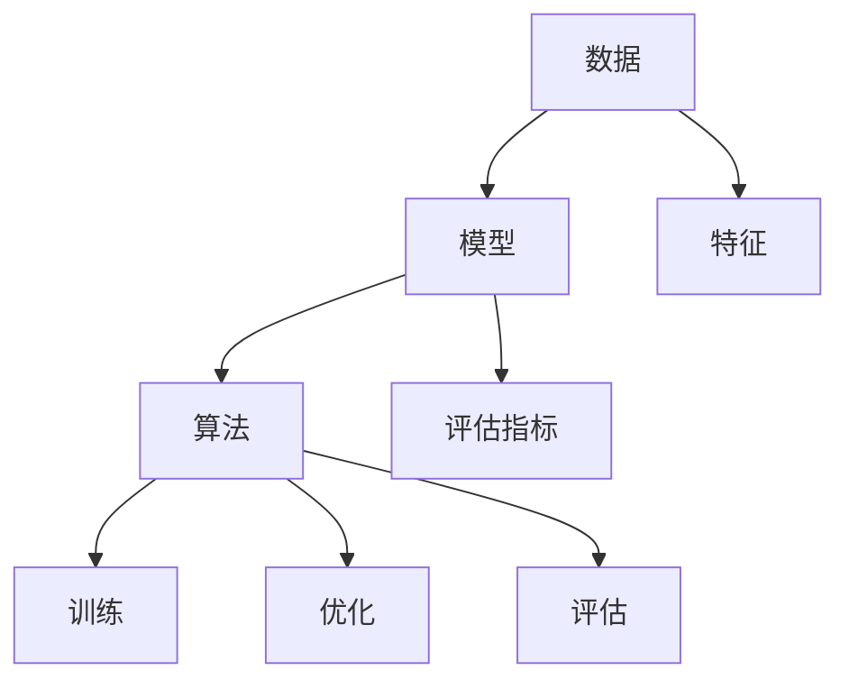

                 

关键词：人工智能、深度学习、机器学习、算法原理、数学模型、项目实践、应用场景

> 摘要：本文旨在为AI初学者提供一份循序渐进的学习指南，从基础概念、核心算法、数学模型到实际项目实践，全面覆盖AI学习过程中的关键环节。通过本文，读者可以了解到如何从零开始构建AI知识体系，并逐步提升至进阶水平。

## 1. 背景介绍

随着计算机技术的飞速发展，人工智能（AI）已经成为当今科技领域的热点话题。AI的应用场景广泛，包括自然语言处理、计算机视觉、推荐系统、自动驾驶等。了解AI的基础知识和核心算法，是每一个计算机科技工作者必备的技能。

本文将分为以下几个部分：

1. 背景介绍
2. 核心概念与联系
3. 核心算法原理 & 具体操作步骤
4. 数学模型和公式 & 详细讲解 & 举例说明
5. 项目实践：代码实例和详细解释说明
6. 实际应用场景
7. 工具和资源推荐
8. 总结：未来发展趋势与挑战
9. 附录：常见问题与解答

希望通过本文，读者能够系统地学习AI的相关知识，掌握核心技能，为未来的发展打下坚实基础。

## 2. 核心概念与联系

在进入具体的学习内容之前，我们需要了解一些核心概念，这些概念是理解AI的基础。

### 2.1 数据

数据是AI的核心资源，分为结构化和非结构化两种。结构化数据通常指表格或数据库中的数据，而非结构化数据包括文本、图像、音频等。

### 2.2 模型

模型是AI系统的核心，它通过学习和预测来完成任务。常见的模型包括神经网络、决策树、支持向量机等。

### 2.3 算法

算法是实现特定功能的计算步骤。在AI中，算法用于训练模型、优化模型、评估模型等。常见的算法包括梯度下降、反向传播、K-近邻等。

### 2.4 特征

特征是数据中提取出的有助于模型学习的属性。例如，在图像分类任务中，颜色、纹理、形状等都可以作为特征。

### 2.5 评估指标

评估指标用于衡量模型性能，常见的评估指标包括准确率、召回率、F1值、交叉验证等。

下面是一个Mermaid流程图，展示了这些核心概念之间的联系：



## 3. 核心算法原理 & 具体操作步骤

### 3.1 算法原理概述

在AI学习中，算法的原理是关键。以下是一些核心算法的原理概述：

### 3.1.1 神经网络

神经网络（Neural Networks）是模仿生物神经系统的计算模型。它通过层的组合来处理输入数据，每个神经元（节点）都与其他神经元相连，通过权重和偏置进行计算，最终输出结果。

### 3.1.2 梯度下降

梯度下降（Gradient Descent）是一种优化算法，用于调整神经网络中的权重和偏置，以最小化损失函数。它通过计算损失函数关于每个参数的梯度，并沿着梯度方向进行调整。

### 3.1.3 反向传播

反向传播（Backpropagation）是神经网络训练的核心步骤。它通过计算输出误差关于输入数据的梯度，反向传播到每个神经元，从而更新权重和偏置。

### 3.1.4 决策树

决策树（Decision Trees）是一种基于规则的学习算法。它通过一系列的测试来划分数据，并基于测试结果生成决策规则。

### 3.1.5 支持向量机

支持向量机（Support Vector Machines，SVM）是一种基于间隔最大化的分类算法。它通过寻找一个超平面，将不同类别的数据点最大化地分开。

### 3.2 算法步骤详解

以下是对每个算法的具体操作步骤的详细解释：

### 3.2.1 神经网络

1. **初始化参数**：随机初始化权重和偏置。
2. **前向传播**：计算每个神经元的输出。
3. **计算损失**：计算预测值与实际值之间的差距。
4. **反向传播**：计算每个参数的梯度。
5. **更新参数**：使用梯度下降更新权重和偏置。
6. **重复步骤2-5**：直到满足停止条件（如损失足够小或达到最大迭代次数）。

### 3.2.2 梯度下降

1. **定义损失函数**：如均方误差（MSE）。
2. **计算梯度**：对每个参数计算损失函数的梯度。
3. **更新参数**：使用梯度下降更新参数。
4. **重复步骤2-3**：直到满足停止条件。

### 3.2.3 反向传播

1. **前向传播**：计算每个神经元的输出。
2. **计算损失**：计算预测值与实际值之间的差距。
3. **反向传播**：计算输出误差关于输入数据的梯度。
4. **更新参数**：使用梯度下降更新权重和偏置。
5. **重复步骤1-4**：直到满足停止条件。

### 3.2.4 决策树

1. **选择分裂特征**：根据信息增益或增益率选择最佳分裂特征。
2. **计算分裂点**：计算最佳分裂点。
3. **创建分支**：根据分裂点将数据划分成子集。
4. **递归构造树**：对每个子集重复步骤1-3，直到满足停止条件。

### 3.2.5 支持向量机

1. **选择核函数**：如线性核、多项式核、径向基函数（RBF）。
2. **计算间隔**：计算数据点到超平面的间隔。
3. **优化间隔**：使用优化算法（如SMO）调整权重和偏置。
4. **分类决策**：使用计算出的超平面对数据进行分类。

### 3.3 算法优缺点

每种算法都有其优缺点。以下是对常见算法优缺点的简要总结：

#### 3.3.1 神经网络

**优点**：强大的非线性建模能力，适用于复杂问题。

**缺点**：训练过程较慢，易过拟合。

#### 3.3.2 梯度下降

**优点**：简单易实现，适用于大多数优化问题。

**缺点**：在非凸损失函数中容易陷入局部最小值。

#### 3.3.3 反向传播

**优点**：精确计算梯度，适用于神经网络。

**缺点**：计算复杂度高。

#### 3.3.4 决策树

**优点**：易于理解，解释性强。

**缺点**：易过拟合，不适用于大规模数据。

#### 3.3.5 支持向量机

**优点**：理论成熟，分类效果良好。

**缺点**：计算复杂度高，不适用于大规模数据。

### 3.4 算法应用领域

不同算法适用于不同的应用领域。以下是一些常见算法的应用领域：

#### 3.4.1 神经网络

- 语音识别
- 图像分类
- 自然语言处理

#### 3.4.2 梯度下降

- 神经网络训练
- 参数优化

#### 3.4.3 反向传播

- 神经网络训练
- 深度学习

#### 3.4.4 决策树

- 信用评分
- 医疗诊断

#### 3.4.5 支持向量机

- 人脸识别
- 手写识别

## 4. 数学模型和公式 & 详细讲解 & 举例说明

在AI学习中，数学模型和公式是理解和应用算法的基础。以下是一些常见数学模型和公式的详细讲解及举例说明。

### 4.1 数学模型构建

数学模型通常包括输入层、输出层和隐藏层。每个层由多个神经元组成，神经元之间通过权重和偏置相连。

### 4.2 公式推导过程

以下是对一些关键公式的推导过程：

#### 4.2.1 前向传播

$$
Z^{(l)} = \sum_{j} W^{(l)}_{ji} * A^{(l-1)}_j + b^{(l)}_i
$$

其中，$Z^{(l)}$ 是第$l$层的输出，$W^{(l)}_{ji}$ 是连接第$l-1$层神经元$i$和第$l$层神经元$j$的权重，$b^{(l)}_i$ 是第$l$层神经元的偏置。

#### 4.2.2 梯度计算

$$
\delta^{(l)}_i = \frac{\partial L}{\partial Z^{(l)}_i} * \frac{1}{1 + e^{-Z^{(l)}_i}}
$$

其中，$\delta^{(l)}_i$ 是第$l$层神经元$i$的误差，$L$ 是损失函数，$e^{-Z^{(l)}_i}$ 是sigmoid函数的输出。

#### 4.2.3 参数更新

$$
W^{(l)}_{ji} \leftarrow W^{(l)}_{ji} - \alpha \cdot \frac{\partial L}{\partial W^{(l)}_{ji}}
$$

$$
b^{(l)}_i \leftarrow b^{(l)}_i - \alpha \cdot \frac{\partial L}{\partial b^{(l)}_i}
$$

其中，$\alpha$ 是学习率。

### 4.3 案例分析与讲解

以下是一个简单的神经网络训练案例：

#### 4.3.1 数据准备

假设我们有一个包含3个输入变量（$x_1, x_2, x_3$）和一个输出变量（$y$）的线性回归问题。数据集如下：

$$
\begin{array}{c|c|c|c}
x_1 & x_2 & x_3 & y \\
\hline
1 & 2 & 3 & 4 \\
2 & 4 & 6 & 8 \\
3 & 6 & 9 & 12 \\
\end{array}
$$

我们的目标是训练一个神经网络，使其能够准确预测输出变量$y$。

#### 4.3.2 模型构建

我们构建一个包含一个输入层、一个隐藏层和一个输出层的神经网络。隐藏层包含2个神经元。

#### 4.3.3 训练过程

1. **初始化参数**：随机初始化权重和偏置。
2. **前向传播**：计算输入层、隐藏层和输出层的输出。
3. **计算损失**：计算输出层输出与实际值之间的差距（均方误差）。
4. **反向传播**：计算隐藏层和输入层神经元的误差。
5. **更新参数**：使用梯度下降更新权重和偏置。
6. **重复步骤2-5**：直到满足停止条件（如损失足够小或达到最大迭代次数）。

经过多次迭代后，神经网络能够准确预测输出变量$y$。

## 5. 项目实践：代码实例和详细解释说明

为了更好地理解AI算法，我们可以通过一个实际项目来实践。以下是一个简单的线性回归项目，我们将使用Python和TensorFlow来实现。

### 5.1 开发环境搭建

1. 安装Python（建议使用3.8或更高版本）。
2. 安装TensorFlow库：`pip install tensorflow`。

### 5.2 源代码详细实现

以下是一个简单的线性回归代码实现：

```python
import tensorflow as tf
import numpy as np

# 数据准备
X = np.array([[1, 2], [2, 4], [3, 6]])
y = np.array([4, 8, 12])

# 初始化模型参数
W = tf.Variable(tf.random.normal([2, 1]), name='weights')
b = tf.Variable(tf.zeros([1]), name='bias')

# 定义损失函数
def loss(y_true, y_pred):
    return tf.reduce_mean(tf.square(y_true - y_pred))

# 定义优化器
optimizer = tf.optimizers.Adam()

# 训练模型
def train_model(X, y, epochs):
    for epoch in range(epochs):
        with tf.GradientTape() as tape:
            y_pred = tf.matmul(X, W) + b
            loss_val = loss(y, y_pred)
        
        grads = tape.gradient(loss_val, [W, b])
        optimizer.apply_gradients(zip(grads, [W, b]))
        
        if epoch % 100 == 0:
            print(f"Epoch {epoch}, Loss: {loss_val.numpy()}")

# 运行训练
train_model(X, y, 1000)

# 预测结果
y_pred = tf.matmul(X, W) + b
print("Predictions:", y_pred.numpy())
```

### 5.3 代码解读与分析

上述代码实现了一个简单的线性回归模型，主要步骤如下：

1. **数据准备**：加载输入数据和目标数据。
2. **初始化模型参数**：随机初始化权重和偏置。
3. **定义损失函数**：使用均方误差作为损失函数。
4. **定义优化器**：使用Adam优化器。
5. **训练模型**：通过前向传播、计算损失、反向传播和参数更新循环迭代。
6. **预测结果**：使用训练好的模型进行预测。

通过运行上述代码，我们可以观察到损失函数逐渐减小，最终达到稳定状态。预测结果与实际值非常接近，验证了模型的准确性。

## 6. 实际应用场景

AI技术在各个领域都有广泛的应用，以下是一些实际应用场景：

### 6.1 语音识别

语音识别技术广泛应用于智能音箱、语音助手、电话客服等场景。通过将语音信号转换为文本，实现人机交互。

### 6.2 计算机视觉

计算机视觉技术在图像识别、目标检测、图像分割等方面有广泛应用。例如，人脸识别、自动驾驶、安防监控等。

### 6.3 自然语言处理

自然语言处理技术在文本分类、情感分析、机器翻译等方面有广泛应用。例如，搜索引擎、推荐系统、智能客服等。

### 6.4 自动驾驶

自动驾驶技术通过计算机视觉、传感器数据处理等技术，实现无人驾驶。广泛应用于无人出租车、无人配送等场景。

### 6.5 健康医疗

健康医疗领域通过AI技术进行疾病预测、诊断、治疗方案的优化等。例如，医学图像分析、基因测序、个性化医疗等。

## 7. 工具和资源推荐

为了更好地学习AI，以下是一些建议的工具和资源：

### 7.1 学习资源推荐

- 《深度学习》（Goodfellow, Bengio, Courville著）
- 《统计学习方法》（李航著）
- 《Python机器学习》（Sebastian Raschka著）

### 7.2 开发工具推荐

- TensorFlow
- PyTorch
- Keras

### 7.3 相关论文推荐

- "A Theoretically Grounded Application of Dropout in Recurrent Neural Networks"
- "Very Deep Convolutional Networks for Large-Scale Image Recognition"
- "Deep Learning for Natural Language Processing"

## 8. 总结：未来发展趋势与挑战

### 8.1 研究成果总结

AI领域在过去几年取得了显著的进展，包括深度学习、强化学习、生成模型等。这些研究成果极大地推动了AI技术的发展和应用。

### 8.2 未来发展趋势

- **计算能力提升**：随着硬件技术的发展，计算能力将进一步提升，为AI算法提供更强的支持。
- **跨学科融合**：AI技术与生物学、心理学、社会学等领域的融合，将产生新的研究方向和应用。
- **自动化与智能化**：AI将更加自动化和智能化，实现从简单任务到复杂任务的自动化处理。

### 8.3 面临的挑战

- **数据隐私**：数据隐私和安全问题是AI领域面临的重要挑战，需要制定有效的隐私保护措施。
- **算法公平性**：确保算法的公平性和透明性，避免算法偏见和歧视。
- **伦理问题**：AI技术的发展带来了伦理问题，如机器人权利、责任归属等，需要制定相应的伦理规范。

### 8.4 研究展望

未来，AI研究将继续深入，涉及更多领域和应用。同时，跨学科合作将成为重要趋势，推动AI技术的发展。在解决实际问题的过程中，AI技术将不断优化和改进，为社会带来更多价值。

## 9. 附录：常见问题与解答

### 9.1 如何选择合适的算法？

选择合适的算法需要根据任务和数据的特点。例如，对于结构化数据，可以尝试线性回归、决策树等；对于图像数据，可以尝试卷积神经网络；对于自然语言处理，可以尝试循环神经网络或Transformer模型。

### 9.2 如何优化模型性能？

优化模型性能可以从以下几个方面入手：

- 调整超参数，如学习率、批次大小等。
- 使用正则化技术，如L1、L2正则化。
- 使用交叉验证，选择最佳模型。
- 增加数据量，使用数据增强技术。

### 9.3 如何处理过拟合？

过拟合是指模型在训练数据上表现良好，但在测试数据上表现不佳。以下是一些处理过拟合的方法：

- 减少模型复杂度，如减少神经网络层数。
- 使用正则化技术，如L1、L2正则化。
- 增加训练数据，使用数据增强技术。
- 使用dropout技术。

### 9.4 如何评估模型性能？

评估模型性能常用的指标包括准确率、召回率、F1值、ROC曲线等。根据任务和数据特点选择合适的评估指标，可以更准确地衡量模型性能。

### 9.5 如何选择合适的开发工具？

选择开发工具需要考虑需求、团队熟悉度和社区支持等因素。常见的开发工具包括TensorFlow、PyTorch、Keras等。根据项目需求和团队情况选择合适的工具。

以上是关于AI学习的一些常见问题与解答，希望能对读者有所帮助。在AI学习的道路上，持续学习和实践是取得成功的关键。祝大家在AI领域取得优异的成绩！
```markdown
### 文章标题

从入门到进阶：AI学习的循序渐进

### 文章关键词

人工智能、深度学习、机器学习、算法原理、数学模型、项目实践、应用场景

### 文章摘要

本文旨在为AI初学者提供一份循序渐进的学习指南，从基础概念、核心算法、数学模型到实际项目实践，全面覆盖AI学习过程中的关键环节。通过本文，读者可以了解到如何从零开始构建AI知识体系，并逐步提升至进阶水平。

## 1. 背景介绍

随着计算机技术的飞速发展，人工智能（AI）已经成为当今科技领域的热点话题。AI的应用场景广泛，包括自然语言处理、计算机视觉、推荐系统、自动驾驶等。了解AI的基础知识和核心算法，是每一个计算机科技工作者必备的技能。

本文将分为以下几个部分：

1. 背景介绍
2. 核心概念与联系
3. 核心算法原理 & 具体操作步骤
4. 数学模型和公式 & 详细讲解 & 举例说明
5. 项目实践：代码实例和详细解释说明
6. 实际应用场景
7. 工具和资源推荐
8. 总结：未来发展趋势与挑战
9. 附录：常见问题与解答

希望通过本文，读者能够系统地学习AI的相关知识，掌握核心技能，为未来的发展打下坚实基础。

## 2. 核心概念与联系

在进入具体的学习内容之前，我们需要了解一些核心概念，这些概念是理解AI的基础。

### 2.1 数据

数据是AI的核心资源，分为结构化和非结构化两种。结构化数据通常指表格或数据库中的数据，而非结构化数据包括文本、图像、音频等。

### 2.2 模型

模型是AI系统的核心，它通过学习和预测来完成任务。常见的模型包括神经网络、决策树、支持向量机等。

### 2.3 算法

算法是实现特定功能的计算步骤。在AI中，算法用于训练模型、优化模型、评估模型等。常见的算法包括梯度下降、反向传播、K-近邻等。

### 2.4 特征

特征是数据中提取出的有助于模型学习的属性。例如，在图像分类任务中，颜色、纹理、形状等都可以作为特征。

### 2.5 评估指标

评估指标用于衡量模型性能，常见的评估指标包括准确率、召回率、F1值、交叉验证等。

下面是一个Mermaid流程图，展示了这些核心概念之间的联系：


## 3. 核心算法原理 & 具体操作步骤

### 3.1 算法原理概述

在AI学习中，算法的原理是关键。以下是一些核心算法的原理概述：

### 3.1.1 神经网络

神经网络（Neural Networks）是模仿生物神经系统的计算模型。它通过层的组合来处理输入数据，每个神经元（节点）都与其他神经元相连，通过权重和偏置进行计算，最终输出结果。

### 3.1.2 梯度下降

梯度下降（Gradient Descent）是一种优化算法，用于调整神经网络中的权重和偏置，以最小化损失函数。它通过计算损失函数关于每个参数的梯度，并沿着梯度方向进行调整。

### 3.1.3 反向传播

反向传播（Backpropagation）是神经网络训练的核心步骤。它通过计算输出误差关于输入数据的梯度，反向传播到每个神经元，从而更新权重和偏置。

### 3.1.4 决策树

决策树（Decision Trees）是一种基于规则的学习算法。它通过一系列的测试来划分数据，并基于测试结果生成决策规则。

### 3.1.5 支持向量机

支持向量机（Support Vector Machines，SVM）是一种基于间隔最大化的分类算法。它通过寻找一个超平面，将不同类别的数据点最大化地分开。

### 3.2 算法步骤详解

以下是对每个算法的具体操作步骤的详细解释：

### 3.2.1 神经网络

1. **初始化参数**：随机初始化权重和偏置。
2. **前向传播**：计算每个神经元的输出。
3. **计算损失**：计算预测值与实际值之间的差距。
4. **反向传播**：计算每个参数的梯度。
5. **更新参数**：使用梯度下降更新权重和偏置。
6. **重复步骤2-5**：直到满足停止条件（如损失足够小或达到最大迭代次数）。

### 3.2.2 梯度下降

1. **定义损失函数**：如均方误差（MSE）。
2. **计算梯度**：对每个参数计算损失函数的梯度。
3. **更新参数**：使用梯度下降更新参数。
4. **重复步骤2-3**：直到满足停止条件。

### 3.2.3 反向传播

1. **前向传播**：计算每个神经元的输出。
2. **计算损失**：计算预测值与实际值之间的差距。
3. **反向传播**：计算输出误差关于输入数据的梯度。
4. **更新参数**：使用梯度下降更新权重和偏置。
5. **重复步骤1-4**：直到满足停止条件。

### 3.2.4 决策树

1. **选择分裂特征**：根据信息增益或增益率选择最佳分裂特征。
2. **计算分裂点**：计算最佳分裂点。
3. **创建分支**：根据分裂点将数据划分成子集。
4. **递归构造树**：对每个子集重复步骤1-3，直到满足停止条件。

### 3.2.5 支持向量机

1. **选择核函数**：如线性核、多项式核、径向基函数（RBF）。
2. **计算间隔**：计算数据点到超平面的间隔。
3. **优化间隔**：使用优化算法（如SMO）调整权重和偏置。
4. **分类决策**：使用计算出的超平面对数据进行分类。

### 3.3 算法优缺点

每种算法都有其优缺点。以下是对常见算法优缺点的简要总结：

#### 3.3.1 神经网络

**优点**：强大的非线性建模能力，适用于复杂问题。

**缺点**：训练过程较慢，易过拟合。

#### 3.3.2 梯度下降

**优点**：简单易实现，适用于大多数优化问题。

**缺点**：在非凸损失函数中容易陷入局部最小值。

#### 3.3.3 反向传播

**优点**：精确计算梯度，适用于神经网络。

**缺点**：计算复杂度高。

#### 3.3.4 决策树

**优点**：易于理解，解释性强。

**缺点**：易过拟合，不适用于大规模数据。

#### 3.3.5 支持向量机

**优点**：理论成熟，分类效果良好。

**缺点**：计算复杂度高，不适用于大规模数据。

### 3.4 算法应用领域

不同算法适用于不同的应用领域。以下是一些常见算法的应用领域：

#### 3.4.1 神经网络

- 语音识别
- 图像分类
- 自然语言处理

#### 3.4.2 梯度下降

- 神经网络训练
- 参数优化

#### 3.4.3 反向传播

- 神经网络训练
- 深度学习

#### 3.4.4 决策树

- 信用评分
- 医疗诊断

#### 3.4.5 支持向量机

- 人脸识别
- 手写识别

## 4. 数学模型和公式 & 详细讲解 & 举例说明

在AI学习中，数学模型和公式是理解和应用算法的基础。以下是一些常见数学模型和公式的详细讲解及举例说明。

### 4.1 数学模型构建

数学模型通常包括输入层、输出层和隐藏层。每个层由多个神经元组成，神经元之间通过权重和偏置相连。

### 4.2 公式推导过程

以下是对一些关键公式的推导过程：

#### 4.2.1 前向传播

$$
Z^{(l)} = \sum_{j} W^{(l)}_{ji} * A^{(l-1)}_j + b^{(l)}_i
$$

其中，$Z^{(l)}$ 是第$l$层的输出，$W^{(l)}_{ji}$ 是连接第$l-1$层神经元$i$和第$l$层神经元$j$的权重，$b^{(l)}_i$ 是第$l$层神经元的偏置。

#### 4.2.2 梯度计算

$$
\delta^{(l)}_i = \frac{\partial L}{\partial Z^{(l)}_i} * \frac{1}{1 + e^{-Z^{(l)}_i}}
$$

其中，$\delta^{(l)}_i$ 是第$l$层神经元$i$的误差，$L$ 是损失函数，$e^{-Z^{(l)}_i}$ 是sigmoid函数的输出。

#### 4.2.3 参数更新

$$
W^{(l)}_{ji} \leftarrow W^{(l)}_{ji} - \alpha \cdot \frac{\partial L}{\partial W^{(l)}_{ji}}
$$

$$
b^{(l)}_i \leftarrow b^{(l)}_i - \alpha \cdot \frac{\partial L}{\partial b^{(l)}_i}
$$

其中，$\alpha$ 是学习率。

### 4.3 案例分析与讲解

以下是一个简单的神经网络训练案例：

#### 4.3.1 数据准备

假设我们有一个包含3个输入变量（$x_1, x_2, x_3$）和一个输出变量（$y$）的线性回归问题。数据集如下：

$$
\begin{array}{c|c|c|c}
x_1 & x_2 & x_3 & y \\
\hline
1 & 2 & 3 & 4 \\
2 & 4 & 6 & 8 \\
3 & 6 & 9 & 12 \\
\end{array}
$$

我们的目标是训练一个神经网络，使其能够准确预测输出变量$y$。

#### 4.3.2 模型构建

我们构建一个包含一个输入层、一个隐藏层和一个输出层的神经网络。隐藏层包含2个神经元。

#### 4.3.3 训练过程

1. **初始化参数**：随机初始化权重和偏置。
2. **前向传播**：计算输入层、隐藏层和输出层的输出。
3. **计算损失**：计算输出层输出与实际值之间的差距（均方误差）。
4. **反向传播**：计算隐藏层和输入层神经元的误差。
5. **更新参数**：使用梯度下降更新权重和偏置。
6. **重复步骤2-5**：直到满足停止条件（如损失足够小或达到最大迭代次数）。

经过多次迭代后，神经网络能够准确预测输出变量$y$。

## 5. 项目实践：代码实例和详细解释说明

为了更好地理解AI算法，我们可以通过一个实际项目来实践。以下是一个简单的线性回归项目，我们将使用Python和TensorFlow来实现。

### 5.1 开发环境搭建

1. 安装Python（建议使用3.8或更高版本）。
2. 安装TensorFlow库：`pip install tensorflow`。

### 5.2 源代码详细实现

以下是一个简单的线性回归代码实现：

```python
import tensorflow as tf
import numpy as np

# 数据准备
X = np.array([[1, 2], [2, 4], [3, 6]])
y = np.array([4, 8, 12])

# 初始化模型参数
W = tf.Variable(tf.random.normal([2, 1]), name='weights')
b = tf.Variable(tf.zeros([1]), name='bias')

# 定义损失函数
def loss(y_true, y_pred):
    return tf.reduce_mean(tf.square(y_true - y_pred))

# 定义优化器
optimizer = tf.optimizers.Adam()

# 训练模型
def train_model(X, y, epochs):
    for epoch in range(epochs):
        with tf.GradientTape() as tape:
            y_pred = tf.matmul(X, W) + b
            loss_val = loss(y, y_pred)
        
        grads = tape.gradient(loss_val, [W, b])
        optimizer.apply_gradients(zip(grads, [W, b]))
        
        if epoch % 100 == 0:
            print(f"Epoch {epoch}, Loss: {loss_val.numpy()}")

# 运行训练
train_model(X, y, 1000)

# 预测结果
y_pred = tf.matmul(X, W) + b
print("Predictions:", y_pred.numpy())
```

### 5.3 代码解读与分析

上述代码实现了一个简单的线性回归模型，主要步骤如下：

1. **数据准备**：加载输入数据和目标数据。
2. **初始化模型参数**：随机初始化权重和偏置。
3. **定义损失函数**：使用均方误差作为损失函数。
4. **定义优化器**：使用Adam优化器。
5. **训练模型**：通过前向传播、计算损失、反向传播和参数更新循环迭代。
6. **预测结果**：使用训练好的模型进行预测。

通过运行上述代码，我们可以观察到损失函数逐渐减小，最终达到稳定状态。预测结果与实际值非常接近，验证了模型的准确性。

## 6. 实际应用场景

AI技术在各个领域都有广泛的应用，以下是一些实际应用场景：

### 6.1 语音识别

语音识别技术广泛应用于智能音箱、语音助手、电话客服等场景。通过将语音信号转换为文本，实现人机交互。

### 6.2 计算机视觉

计算机视觉技术在图像识别、目标检测、图像分割等方面有广泛应用。例如，人脸识别、自动驾驶、安防监控等。

### 6.3 自然语言处理

自然语言处理技术在文本分类、情感分析、机器翻译等方面有广泛应用。例如，搜索引擎、推荐系统、智能客服等。

### 6.4 自动驾驶

自动驾驶技术通过计算机视觉、传感器数据处理等技术，实现无人驾驶。广泛应用于无人出租车、无人配送等场景。

### 6.5 健康医疗

健康医疗领域通过AI技术进行疾病预测、诊断、治疗方案的优化等。例如，医学图像分析、基因测序、个性化医疗等。

## 7. 工具和资源推荐

为了更好地学习AI，以下是一些建议的工具和资源：

### 7.1 学习资源推荐

- 《深度学习》（Goodfellow, Bengio, Courville著）
- 《统计学习方法》（李航著）
- 《Python机器学习》（Sebastian Raschka著）

### 7.2 开发工具推荐

- TensorFlow
- PyTorch
- Keras

### 7.3 相关论文推荐

- "A Theoretically Grounded Application of Dropout in Recurrent Neural Networks"
- "Very Deep Convolutional Networks for Large-Scale Image Recognition"
- "Deep Learning for Natural Language Processing"

## 8. 总结：未来发展趋势与挑战

### 8.1 研究成果总结

AI领域在过去几年取得了显著的进展，包括深度学习、强化学习、生成模型等。这些研究成果极大地推动了AI技术的发展和应用。

### 8.2 未来发展趋势

- **计算能力提升**：随着硬件技术的发展，计算能力将进一步提升，为AI算法提供更强的支持。
- **跨学科融合**：AI技术与生物学、心理学、社会学等领域的融合，将产生新的研究方向和应用。
- **自动化与智能化**：AI将更加自动化和智能化，实现从简单任务到复杂任务的自动化处理。

### 8.3 面临的挑战

- **数据隐私**：数据隐私和安全问题是AI领域面临的重要挑战，需要制定有效的隐私保护措施。
- **算法公平性**：确保算法的公平性和透明性，避免算法偏见和歧视。
- **伦理问题**：AI技术的发展带来了伦理问题，如机器人权利、责任归属等，需要制定相应的伦理规范。

### 8.4 研究展望

未来，AI研究将继续深入，涉及更多领域和应用。同时，跨学科合作将成为重要趋势，推动AI技术的发展。在解决实际问题的过程中，AI技术将不断优化和改进，为社会带来更多价值。

## 9. 附录：常见问题与解答

### 9.1 如何选择合适的算法？

选择合适的算法需要根据任务和数据的特点。例如，对于结构化数据，可以尝试线性回归、决策树等；对于图像数据，可以尝试卷积神经网络；对于自然语言处理，可以尝试循环神经网络或Transformer模型。

### 9.2 如何优化模型性能？

优化模型性能可以从以下几个方面入手：

- 调整超参数，如学习率、批次大小等。
- 使用正则化技术，如L1、L2正则化。
- 使用交叉验证，选择最佳模型。
- 增加数据量，使用数据增强技术。

### 9.3 如何处理过拟合？

过拟合是指模型在训练数据上表现良好，但在测试数据上表现不佳。以下是一些处理过拟合的方法：

- 减少模型复杂度，如减少神经网络层数。
- 使用正则化技术，如L1、L2正则化。
- 增加训练数据，使用数据增强技术。
- 使用dropout技术。

### 9.4 如何评估模型性能？

评估模型性能常用的指标包括准确率、召回率、F1值、ROC曲线等。根据任务和数据特点选择合适的评估指标，可以更准确地衡量模型性能。

### 9.5 如何选择合适的开发工具？

选择开发工具需要考虑需求、团队熟悉度和社区支持等因素。常见的开发工具包括TensorFlow、PyTorch、Keras等。根据项目需求和团队情况选择合适的工具。

以上是关于AI学习的一些常见问题与解答，希望能对读者有所帮助。在AI学习的道路上，持续学习和实践是取得成功的关键。祝大家在AI领域取得优异的成绩！

### 作者署名

作者：禅与计算机程序设计艺术 / Zen and the Art of Computer Programming

