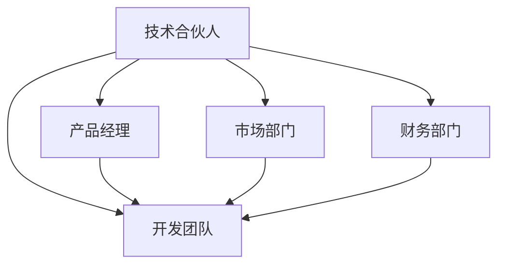
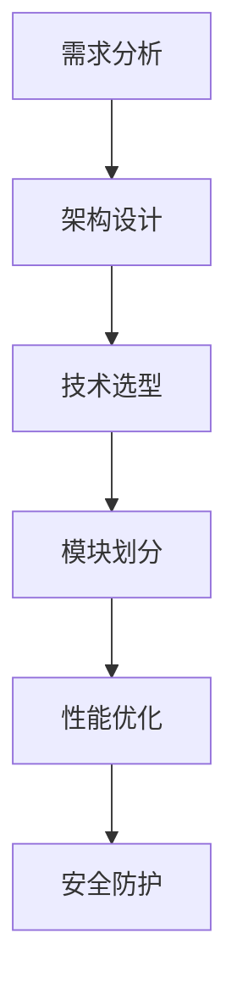

                 

关键词：技术合伙人、职业发展、团队建设、领导力、项目管理、技术能力、创新思维。

> 摘要：本文旨在探讨技术员工如何通过不断提升自身技术能力和领导力，从普通员工成长为技术合伙人，从而在职业发展中迈出重要的一步。文章将结合实际案例，详细分析成长路径、所需技能和面临挑战，为有志于此的读者提供有价值的参考和指导。

## 1. 背景介绍

在当今快速发展的信息技术行业，技术合伙人这个职位越来越受到重视。技术合伙人通常是指在创业公司或技术团队中，具有深厚技术背景，能够带领团队进行技术开发和创新的高级技术人员。他们不仅需要具备卓越的技术能力，还需要拥有出色的领导力和项目管理能力。

随着人工智能、大数据、云计算等新兴技术的兴起，技术合伙人在企业中的角色和影响力日益增强。他们不仅是技术团队的灵魂人物，也是企业战略规划和发展方向的关键决策者。因此，从员工到技术合伙人的晋升，不仅是一次职业地位的提升，更是个人能力和价值的认可。

本文将从以下几个方面展开讨论：

1. 技术合伙人的核心技能和素质。
2. 从员工到技术合伙人的成长路径。
3. 面临的挑战和解决方案。
4. 未来发展趋势与展望。

希望通过本文的探讨，能够为广大有志于成为技术合伙人的技术人员提供一些有益的启示和帮助。

## 2. 核心概念与联系

### 2.1 技术合伙人的核心技能

技术合伙人需要具备多方面的技能，以下是其中几个关键的技能点：

1. **技术深度与广度**：技术合伙人必须对某一领域有深入的了解，同时具备跨领域的知识，能够理解和应用不同的技术解决方案。
2. **领导力和团队管理**：技术合伙人需要具备优秀的领导力，能够激励团队成员，协调各方资源，确保项目顺利进行。
3. **项目管理能力**：技术合伙人需要能够制定项目计划，管理项目进度，控制项目风险，确保项目按时交付。
4. **创新思维**：技术合伙人需要具备创新精神，能够带领团队探索新技术，推动产品创新和业务模式创新。
5. **商业意识**：技术合伙人需要理解商业逻辑，能够将技术优势转化为商业价值，推动企业的发展。

### 2.2 技术合伙人角色在团队中的联系

技术合伙人在团队中的角色是多元的，他们不仅是技术专家，还需要承担领导者和决策者的角色。以下是技术合伙人角色在团队中的一些联系：

1. **与产品经理的协作**：技术合伙人需要与产品经理密切合作，理解产品需求，提供技术实现方案，确保产品满足市场需求。
2. **与开发团队的沟通**：技术合伙人需要与开发团队成员保持良好的沟通，指导技术方向，解决技术难题，提升团队整体技术水平。
3. **与市场部门的互动**：技术合伙人需要了解市场动态，参与市场调研，将市场反馈转化为技术改进的方向。
4. **与财务部门的协调**：技术合伙人需要关注项目成本，确保技术投入与商业回报相匹配。

### 2.3 Mermaid 流程图

为了更直观地展示技术合伙人角色在团队中的联系，以下是一个简化的 Mermaid 流程图：



在这个流程图中，技术合伙人作为核心节点，与各个部门紧密相连，共同推动项目的成功。

## 3. 核心算法原理 & 具体操作步骤

### 3.1 算法原理概述

技术合伙人所需的核心算法原理主要包括以下几个方面：

1. **算法设计与优化**：能够设计高效、可扩展的算法，并对其进行优化，以满足项目需求。
2. **代码质量与性能分析**：具备分析代码质量的能力，能够优化代码结构，提升代码性能。
3. **数据处理与分析**：掌握数据处理和分析的方法，能够从大量数据中提取有价值的信息。
4. **系统架构设计**：具备系统架构设计能力，能够根据业务需求设计合理的技术架构。

### 3.2 算法步骤详解

以下是一个简单的算法步骤，用于描述技术合伙人如何进行系统架构设计：

1. **需求分析**：理解业务需求，明确系统需要实现的功能。
2. **架构设计**：根据需求设计系统的整体架构，包括前端、后端、数据库等。
3. **技术选型**：选择适合项目的技术栈，确保系统的可扩展性和稳定性。
4. **模块划分**：将系统划分为多个模块，确保每个模块的功能独立且可测试。
5. **性能优化**：对系统进行性能优化，提升系统响应速度和处理能力。
6. **安全防护**：确保系统的安全性，防止数据泄露和系统攻击。

### 3.3 算法优缺点

1. **优点**：
   - **高效性**：通过优化算法，提高系统的运行效率。
   - **扩展性**：合理的设计使得系统易于扩展，能够应对未来业务需求。
   - **安全性**：系统的安全性得到保障，降低潜在风险。

2. **缺点**：
   - **复杂度高**：系统的设计和优化过程较为复杂，需要丰富的经验和技能。
   - **维护难度**：系统上线后，需要持续维护和优化，确保其稳定运行。

### 3.4 算法应用领域

算法原理和技术在多个领域有广泛应用：

1. **金融领域**：用于风险控制、投资策略优化等。
2. **电商领域**：用于推荐系统、库存管理、用户行为分析等。
3. **医疗领域**：用于疾病预测、诊断、治疗方案优化等。
4. **物联网领域**：用于设备管理、数据采集与处理等。

### 3.5 Mermaid 流程图

以下是一个简化的 Mermaid 流程图，展示算法原理在系统架构设计中的应用：



## 4. 数学模型和公式 & 详细讲解 & 举例说明

### 4.1 数学模型构建

在系统架构设计中，常用的数学模型包括：

1. **线性规划模型**：用于优化资源分配，确保系统资源的最大化利用。
2. **神经网络模型**：用于机器学习，提升系统的智能程度。
3. **图论模型**：用于网络优化，确保系统的高效通信。

### 4.2 公式推导过程

以下是一个简化的线性规划模型公式推导过程：

1. **目标函数**：最大化或最小化某个指标，如成本、时间等。
   \[ \max Z = c^T x \]
   其中，\( c \) 为目标函数系数，\( x \) 为变量。

2. **约束条件**：满足特定条件，如资源限制、时间限制等。
   \[ a_i^T x \le b_i \]
   其中，\( a_i \) 为约束条件系数，\( b_i \) 为约束条件常数。

3. **解的求解**：使用线性规划算法求解最优解。
   \[ x = \arg \min \frac{1}{2} \| Ax - b \|_2^2 \]

### 4.3 案例分析与讲解

以下是一个简单的案例，用于展示线性规划模型的应用：

**案例**：一家电商公司需要优化物流配送路线，确保包裹能够尽快送达。

1. **目标函数**：最小化总配送时间。
   \[ \min Z = t_1 + t_2 + t_3 \]
   其中，\( t_1 \)、\( t_2 \)、\( t_3 \) 分别为三个配送路线的时间。

2. **约束条件**：
   \[ s_1 + s_2 + s_3 = 1 \]
   \[ d_1 + d_2 + d_3 = 100 \]
   其中，\( s_1 \)、\( s_2 \)、\( s_3 \) 分别为三个配送路线的选择（0或1），\( d_1 \)、\( d_2 \)、\( d_3 \) 为三个配送路线的配送距离。

3. **解的求解**：使用线性规划算法求解最优解。

通过求解，可以得到最优的配送路线，确保包裹能够尽快送达。

## 5. 项目实践：代码实例和详细解释说明

### 5.1 开发环境搭建

在进行项目实践之前，需要搭建一个合适的开发环境。以下是基本的步骤：

1. **安装开发工具**：选择合适的集成开发环境（IDE），如 Eclipse、VS Code 等。
2. **配置编程语言**：安装目标编程语言的开发环境，如 Java、Python 等。
3. **安装依赖库**：根据项目需求，安装相应的依赖库，如数据库驱动、Web 框架等。

### 5.2 源代码详细实现

以下是一个简单的 Java 项目，用于实现一个简单的用户管理系统。代码如下：

```java
public class UserManagementSystem {
    private List<User> users;

    public UserManagementSystem() {
        users = new ArrayList<>();
    }

    public void addUser(User user) {
        users.add(user);
    }

    public void deleteUser(User user) {
        users.remove(user);
    }

    public List<User> getUsers() {
        return users;
    }
}

public class User {
    private String username;
    private String password;

    public User(String username, String password) {
        this.username = username;
        this.password = password;
    }

    public String getUsername() {
        return username;
    }

    public String getPassword() {
        return password;
    }
}
```

### 5.3 代码解读与分析

1. **类与对象**：在 Java 中，使用类（Class）来定义对象（Object）。在上面的代码中，`UserManagementSystem` 类用于管理用户，`User` 类用于定义用户对象。

2. **方法**：类中包含方法（Method），用于实现特定功能。在 `UserManagementSystem` 类中，`addUser` 方法用于添加用户，`deleteUser` 方法用于删除用户，`getUsers` 方法用于获取所有用户。

3. **集合**：使用集合（Collection）来存储和管理对象。在上面的代码中，`List<User>` 类型的 `users` 集合用于存储用户对象。

### 5.4 运行结果展示

1. **添加用户**：执行 `addUser` 方法，将用户添加到系统中。
2. **删除用户**：执行 `deleteUser` 方法，从系统中删除用户。
3. **获取用户列表**：执行 `getUsers` 方法，获取系统中所有用户。

以上是项目实践的基本步骤和代码实现。在实际开发过程中，还需要考虑异常处理、性能优化、安全性等多个方面。

## 6. 实际应用场景

### 6.1 技术合伙人在初创公司中的角色

在初创公司中，技术合伙人通常扮演多重角色，既是技术专家，也是团队的领导者。他们需要：

1. **技术决策**：负责技术路线的选择和技术的长远规划。
2. **团队领导**：管理团队，激励团队成员，确保项目顺利进行。
3. **资源协调**：协调内外部资源，包括资金、人力资源、技术资源等。
4. **业务支持**：与技术团队和其他部门紧密合作，确保技术支持业务发展。

### 6.2 技术合伙人在大型企业中的角色

在大型企业中，技术合伙人通常担任更高级别的职位，如首席技术官（CTO）或技术副总裁。他们需要：

1. **技术战略**：制定公司的技术发展战略，推动技术革新。
2. **团队管理**：管理技术团队，提升团队的技术能力。
3. **项目管理**：负责大型项目的规划和管理，确保项目按时交付。
4. **业务拓展**：与技术团队和其他部门合作，推动业务创新和增长。

### 6.3 技术合伙人在不同行业中的应用

技术合伙人在不同行业中的应用有所不同：

1. **金融行业**：技术合伙人负责构建安全的金融交易系统和数据分析平台，确保金融业务的顺利进行。
2. **医疗行业**：技术合伙人负责开发医疗信息化系统和医疗数据分析工具，提升医疗服务的效率和质量。
3. **电商行业**：技术合伙人负责构建高效的电商平台，优化用户购物体验，提升销售业绩。
4. **物联网行业**：技术合伙人负责开发物联网设备和系统，实现物联网数据的收集、处理和应用。

## 7. 工具和资源推荐

### 7.1 学习资源推荐

1. **《深度学习》**：由 Ian Goodfellow 等人编写的深度学习入门经典。
2. **《设计模式：可复用面向对象软件的基础》**：由 Erich Gamma 等人编写的面向对象设计模式经典。
3. **《代码大全》**：由 Steve McConnell 编写的软件工程经典，重点介绍了代码质量的重要性。

### 7.2 开发工具推荐

1. **Git**：分布式版本控制系统，用于代码管理和协作开发。
2. **Docker**：容器化技术，用于简化应用部署和运行环境。
3. **Kubernetes**：容器编排工具，用于自动化部署和管理容器化应用。

### 7.3 相关论文推荐

1. **《谷歌如何做工程》**：谷歌公司分享的工程实践，包括技术管理、代码质量、团队协作等方面。
2. **《Netflix技术博客》**：Netflix 公开的技术博客，涵盖云计算、微服务、数据存储等多个领域。
3. **《美团技术团队博客》**：美团点评的技术团队博客，分享在电商、金融、餐饮等领域的实践经验。

## 8. 总结：未来发展趋势与挑战

### 8.1 研究成果总结

技术合伙人在过去几十年中，在信息技术领域发挥着越来越重要的作用。他们不仅推动了技术革新，还为企业创造了巨大的商业价值。随着人工智能、大数据、云计算等技术的不断发展，技术合伙人的角色和影响力将更加显著。

### 8.2 未来发展趋势

1. **技术创新**：技术合伙人将继续推动技术创新，探索新的技术领域，为企业创造更多的商业机会。
2. **数字化转型**：随着数字化转型的加速，技术合伙人将在数字化转型过程中发挥关键作用，帮助企业实现业务模式创新。
3. **跨界融合**：技术合伙人将跨领域融合，推动不同行业的技术创新和应用，实现产业协同发展。

### 8.3 面临的挑战

1. **技术复杂性**：随着技术的不断发展，技术合伙人需要不断更新知识体系，应对技术复杂性。
2. **人才竞争**：优秀的技术合伙人将成为各大企业争夺的焦点，人才竞争将更加激烈。
3. **管理挑战**：技术合伙人需要具备出色的管理能力，有效管理团队，确保项目的顺利进行。

### 8.4 研究展望

未来，技术合伙人将在信息技术领域继续发挥重要作用。随着新技术的不断涌现，技术合伙人将不断创新，推动技术进步，为企业创造更大的价值。同时，技术合伙人也需要不断提升自身能力，应对不断变化的行业挑战。

## 9. 附录：常见问题与解答

### 9.1 如何成为一名优秀的技术合伙人？

**答案**：成为一名优秀的技术合伙人需要以下几个方面的能力：

1. **技术深度与广度**：不断学习新技术，提升自身技术水平。
2. **领导力和团队管理**：提升领导力，学会管理团队，推动项目进展。
3. **项目管理能力**：掌握项目管理方法，确保项目按时交付。
4. **创新思维**：保持创新意识，不断探索新的技术方向。
5. **商业意识**：理解商业逻辑，将技术优势转化为商业价值。

### 9.2 技术合伙人在团队中的角色是什么？

**答案**：技术合伙人在团队中的角色包括：

1. **技术专家**：负责技术方向的选择和技术的长远规划。
2. **领导者**：管理团队，激励团队成员，确保项目顺利进行。
3. **协调者**：协调内外部资源，确保项目的顺利实施。
4. **业务支持者**：与技术团队和其他部门合作，推动业务创新和增长。

### 9.3 技术合伙人的薪酬水平如何？

**答案**：技术合伙人的薪酬水平取决于多种因素，如企业规模、行业地位、个人能力等。一般来说，技术合伙人的薪酬相对较高，包括基本工资、绩效奖金、股权激励等。

### 9.4 技术合伙人在职业发展中的优势和劣势是什么？

**优势**：

1. **薪酬水平较高**：技术合伙人通常享有较高的薪酬和福利。
2. **职业发展空间大**：技术合伙人可以在企业中担任更高层次的职位。
3. **影响力较大**：技术合伙人可以影响企业的技术方向和业务发展。

**劣势**：

1. **责任重大**：技术合伙人需要承担较大的责任和压力。
2. **需要不断学习**：技术合伙人需要不断更新知识体系，应对技术复杂性。
3. **管理挑战**：技术合伙人需要具备出色的管理能力，有效管理团队。


# 作者：禅与计算机程序设计艺术 / Zen and the Art of Computer Programming

感谢您的阅读，希望本文能够为您的职业发展提供一些启示和帮助。如果您有任何问题或建议，欢迎在评论区留言。祝您在技术道路上越走越远！

