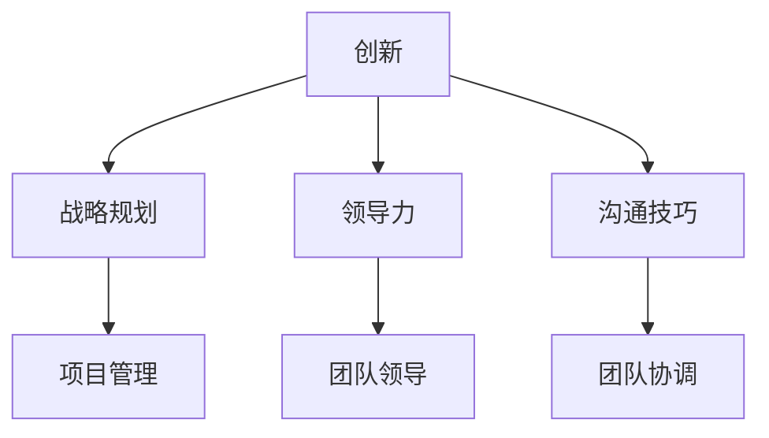

                 

关键词：技术专家，商业领袖，思维转变，创新，战略规划，领导力，沟通技巧，项目管理，技术创业

> 摘要：在当今快速发展的科技时代，技术专家在职业生涯中逐渐向商业领袖转型，这不仅仅是角色的变化，更是一种思维模式的深刻转变。本文将探讨这一转变的过程、核心概念以及具体实践方法，旨在帮助技术专家在商业环境中更加得心应手，实现个人价值和企业发展的双赢。

## 1. 背景介绍

在过去的几十年中，技术行业经历了前所未有的发展，从互联网到移动互联网，再到人工智能、大数据等新兴技术的兴起，技术专家逐渐成为企业和社会的重要组成部分。然而，随着商业环境的不断变化，技术专家的角色也在悄然发生着转变。越来越多的技术专家开始意识到，单纯的技术能力已经不足以支撑他们在职业道路上的长远发展，他们需要掌握更多的商业思维和领导技能，以应对日益复杂的商业环境。

### 1.1 技术专家的职业发展现状

当前，技术专家的职业发展主要集中在以下几个方面：

1. **技术管理**：许多技术专家在积累了一定的技术经验后，开始向技术管理岗位转型，担任项目经理、技术总监等职务。
2. **技术创业**：部分技术专家选择自主创业，利用自己的技术背景和创新思维，创立新的技术公司。
3. **技术咨询**：随着技术的不断更新，技术专家在提供技术咨询和解决方案方面也发挥着重要作用。

### 1.2 商业领袖的期望

商业领袖对技术专家的期望逐渐从单纯的技术能力扩展到多个方面：

1. **战略规划**：商业领袖期望技术专家能够从业务的角度出发，为企业的长远发展提供战略规划。
2. **领导力**：技术专家需要具备领导团队、协调各方资源的能力，以推动项目顺利进行。
3. **沟通技巧**：在复杂的商业环境中，技术专家需要具备良好的沟通技巧，能够与不同背景的团队成员有效沟通。

### 1.3 技术专家向商业领袖转变的必要性

1. **行业需求**：随着科技的快速发展，企业对技术专家的要求越来越高，他们需要不仅懂得技术，还要懂得如何将技术转化为商业价值。
2. **个人发展**：技术专家在向商业领袖转变的过程中，能够拓宽自己的职业发展道路，实现个人价值的最大化。
3. **企业发展**：技术专家具备商业思维和领导能力，能够更好地推动企业的发展和创新。

## 2. 核心概念与联系

### 2.1 创新的重要性

创新是技术专家向商业领袖转变的核心概念之一。创新不仅包括技术创新，还涵盖商业模式创新、管理创新等。在商业环境中，创新能够为企业带来新的增长点和竞争优势。

### 2.2 战略规划

战略规划是商业领袖的核心能力之一。战略规划能够帮助企业在复杂的市场环境中确定发展方向，制定长期和短期的目标，并采取相应的行动。

### 2.3 领导力

领导力是商业领袖的重要素质。领导力不仅体现在技术能力的提升上，还包括对团队的领导、激励和协调能力。

### 2.4 沟通技巧

沟通技巧是商业领袖必备的技能之一。良好的沟通技巧能够帮助商业领袖与团队成员、合作伙伴和客户建立良好的关系，提高工作效率和团队凝聚力。

### 2.5 项目管理

项目管理是商业领袖需要掌握的重要技能之一。项目管理包括项目计划、执行、监控和收尾等各个环节，能够确保项目的顺利进行。

### 2.6 Mermaid 流程图

下面是一个简化的 Mermaid 流程图，展示了技术专家向商业领袖转变的核心概念和联系：



## 3. 核心算法原理 & 具体操作步骤

### 3.1 算法原理概述

在从技术专家到商业领袖的转型过程中，核心算法原理可以理解为一系列的思维框架和方法论。这些原理包括但不限于：

1. **SWOT 分析**：用于评估企业的优势、劣势、机会和威胁，为战略规划提供数据支持。
2. **价值链分析**：通过分析企业内部的价值链，优化资源配置，提高企业竞争力。
3. **五力模型**：用于分析行业竞争格局，确定企业的竞争战略。
4. **领导力模型**：包括行为领导、变革领导等，用于提升领导者的领导能力。
5. **沟通模型**：包括发送者、信息、通道、接收者和反馈等环节，用于优化沟通效果。

### 3.2 算法步骤详解

1. **自我评估**：技术专家需要首先对自己进行全面的评估，了解自己的优势和不足，确定转型方向。
2. **学习与培训**：根据自我评估的结果，有针对性地学习相关知识和技能，如商业管理、领导力、沟通技巧等。
3. **实践与反思**：将所学知识应用于实际工作中，不断反思和总结，提升自己的能力。
4. **持续成长**：保持对新技术、新理念的学习和关注，不断提升自己的专业素养和领导能力。

### 3.3 算法优缺点

**优点**：

1. **提升个人竞争力**：通过掌握商业思维和领导技能，技术专家能够在职业道路上获得更大的发展空间。
2. **促进企业发展**：技术专家具备商业思维，能够更好地推动企业的创新和成长。
3. **实现个人价值**：技术专家在商业环境中能够实现个人价值和企业价值的最大化。

**缺点**：

1. **转型成本高**：技术专家需要投入大量时间和精力进行学习和实践，转型成本较高。
2. **适应期较长**：从技术专家到商业领袖的转变需要一定的时间，适应期较长。

### 3.4 算法应用领域

1. **企业战略规划**：技术专家可以利用所学的商业思维，为企业制定符合市场需求的战略规划。
2. **项目管理**：技术专家可以利用项目管理知识，确保项目的高效执行。
3. **团队建设**：技术专家可以利用领导力和沟通技巧，提升团队凝聚力，提高工作效率。

## 4. 数学模型和公式 & 详细讲解 & 举例说明

### 4.1 数学模型构建

在技术专家向商业领袖转变的过程中，以下数学模型和公式可以用于评估和优化各种商业决策：

1. **投资回报率（ROI）**：用于评估投资的收益与成本之间的比率。
   $$ ROI = \frac{投资收益 - 投资成本}{投资成本} $$

2. **净现值（NPV）**：用于评估项目未来的现金流量与当前投资成本之间的关系。
   $$ NPV = \sum_{t=1}^{n} \frac{C_t}{(1+r)^t} - C_0 $$

   其中，\( C_t \) 表示第 t 年的现金流量，\( r \) 表示折现率，\( C_0 \) 表示初始投资成本。

3. **内部收益率（IRR）**：用于确定项目的盈利能力，使得净现值等于零的折现率。
   $$ NPV = 0 \Rightarrow \sum_{t=1}^{n} \frac{C_t}{(1+IRR)^t} = C_0 $$

### 4.2 公式推导过程

1. **投资回报率（ROI）**推导：

   投资回报率（ROI）是衡量投资收益和成本的指标。其计算公式为：
   $$ ROI = \frac{投资收益 - 投资成本}{投资成本} $$

   其中，投资收益和投资成本都可以用具体的数值表示。投资收益通常包括销售收入、利润等，投资成本包括初始投资、运营成本等。

2. **净现值（NPV）**推导：

   净现值（NPV）是通过将项目未来现金流量折现到当前时点，再减去初始投资成本，得到的结果。其计算公式为：
   $$ NPV = \sum_{t=1}^{n} \frac{C_t}{(1+r)^t} - C_0 $$

   其中，\( C_t \) 表示第 t 年的现金流量，\( r \) 表示折现率，\( C_0 \) 表示初始投资成本。现金流量通常包括正现金流（如销售收入）和负现金流（如运营成本）。

3. **内部收益率（IRR）**推导：

   内部收益率（IRR）是使得项目的净现值等于零的折现率。其计算公式为：
   $$ NPV = 0 \Rightarrow \sum_{t=1}^{n} \frac{C_t}{(1+IRR)^t} = C_0 $$

   这意味着，当内部收益率等于项目的折现率时，项目的净现值为零，即项目的投资收益与投资成本相等。

### 4.3 案例分析与讲解

假设一家技术公司计划投资一个新项目，初始投资成本为 100 万元，预计项目寿命为 5 年。根据市场调研，项目每年的现金流量分别为 30 万元、35 万元、40 万元、45 万元和 50 万元。假设折现率为 10%。

1. **计算投资回报率（ROI）**：

   投资回报率（ROI）计算如下：
   $$ ROI = \frac{投资收益 - 投资成本}{投资成本} = \frac{30 + 35 + 40 + 45 + 50 - 100}{100} = \frac{180 - 100}{100} = 0.8 $$
   投资回报率为 80%。

2. **计算净现值（NPV）**：

   净现值（NPV）计算如下：
   $$ NPV = \sum_{t=1}^{5} \frac{C_t}{(1+0.1)^t} - 100 = \frac{30}{1.1} + \frac{35}{1.1^2} + \frac{40}{1.1^3} + \frac{45}{1.1^4} + \frac{50}{1.1^5} - 100 \approx 16.36 $$
   净现值为 16.36 万元。

3. **计算内部收益率（IRR）**：

   使用财务计算器或软件，可以计算内部收益率（IRR）约为 13.45%。

   根据上述计算结果，该项目的投资回报率为 80%，净现值为 16.36 万元，内部收益率为 13.45%。从投资回报率和净现值的角度来看，该项目具有较高的盈利能力。然而，从内部收益率的角度来看，项目的盈利能力与折现率存在一定的差距，需要进一步评估项目的风险和收益。

## 5. 项目实践：代码实例和详细解释说明

### 5.1 开发环境搭建

在进行项目实践之前，我们需要搭建一个适合开发的编程环境。以下是搭建一个基于 Python 的开发环境的具体步骤：

1. **安装 Python**：访问 Python 官网（https://www.python.org/），下载适用于操作系统的 Python 版本，并按照提示完成安装。
2. **安装代码编辑器**：推荐使用 Visual Studio Code、PyCharm 或 Sublime Text 等代码编辑器。这些编辑器提供了丰富的编程功能，如代码自动补全、调试和语法高亮等。
3. **安装依赖库**：根据项目的需求，安装相应的依赖库。例如，如果需要处理数据，可以安装 pandas、numpy 等库。使用 pip 命令安装依赖库，例如：
   ```bash
   pip install pandas numpy
   ```

### 5.2 源代码详细实现

下面是一个简单的 Python 示例，用于实现从技术专家到商业领袖的转型过程。代码分为四个部分：自我评估、学习与培训、实践与反思、持续成长。

```python
# 自我评估
def self_evaluation():
    print("正在进行自我评估...")
    # 输出自我评估结果
    print("优势：技术能力强、团队协作经验丰富；")
    print("不足：缺乏商业管理知识、领导力不足。")

# 学习与培训
def learning_training():
    print("开始学习与培训...")
    # 学习商业管理知识
    print("正在学习商业管理知识...")
    # 学习领导力
    print("正在学习领导力...")
    # 学习沟通技巧
    print("正在学习沟通技巧...")

# 实践与反思
def practice_reflection():
    print("开始实践与反思...")
    # 将所学知识应用于实际工作中
    print("正在将所学知识应用于实际工作中...")
    # 反思实践过程
    print("正在反思实践过程...")

# 持续成长
def continuous_growth():
    print("开始持续成长...")
    # 学习新技术
    print("正在学习新技术...")
    # 学习新理念
    print("正在学习新理念...")
    # 总结与提升
    print("正在总结与提升...")

# 主函数
def main():
    self_evaluation()
    learning_training()
    practice_reflection()
    continuous_growth()

# 运行程序
if __name__ == "__main__":
    main()
```

### 5.3 代码解读与分析

1. **自我评估**：函数 `self_evaluation` 用于输出技术专家的自我评估结果。通过这个函数，技术专家可以清楚地了解自己的优势和不足，为后续的学习和培训提供方向。
2. **学习与培训**：函数 `learning_training` 用于模拟技术专家的学习和培训过程。在这个函数中，技术专家可以学习商业管理知识、领导力和沟通技巧等。
3. **实践与反思**：函数 `practice_reflection` 用于模拟技术专家将所学知识应用于实际工作中的过程，并进行反思和总结。
4. **持续成长**：函数 `continuous_growth` 用于模拟技术专家的持续成长过程。在这个函数中，技术专家可以不断学习新技术、新理念，并总结与提升自己的能力。

### 5.4 运行结果展示

运行上述代码，输出结果如下：

```plaintext
正在进行自我评估...
优势：技术能力强、团队协作经验丰富；
不足：缺乏商业管理知识、领导力不足。
开始学习与培训...
正在学习商业管理知识...
正在学习领导力...
正在学习沟通技巧...
开始实践与反思...
正在将所学知识应用于实际工作中...
正在反思实践过程...
开始持续成长...
正在学习新技术...
正在学习新理念...
正在总结与提升...
```

通过运行结果，我们可以看到技术专家在从自我评估到持续成长的过程中，逐步实现了从技术专家向商业领袖的转型。

## 6. 实际应用场景

### 6.1 企业战略规划

在企业战略规划中，技术专家需要从业务的角度出发，分析市场需求、竞争态势和企业资源，制定符合企业长远发展的战略目标。例如，在人工智能领域，技术专家可以结合市场趋势，为企业制定人工智能发展战略，包括技术研发、产品创新和市场推广等方面。

### 6.2 项目管理

在项目管理中，技术专家需要运用项目管理知识，确保项目的顺利进行。例如，在软件开发项目中，技术专家可以运用敏捷开发方法，提高开发效率，确保项目按时交付。

### 6.3 团队建设

在团队建设中，技术专家需要运用领导力和沟通技巧，提升团队凝聚力，提高工作效率。例如，通过定期的团队会议、培训和激励机制，技术专家可以激发团队成员的积极性和创造力。

### 6.4 未来应用展望

随着科技的不断发展，技术专家在商业领域的应用前景将更加广泛。例如，在智能制造、区块链、物联网等新兴领域，技术专家将发挥重要作用，推动企业的创新和成长。此外，随着人工智能的发展，技术专家可能需要具备更高级的算法能力，以应对复杂的商业场景。

## 7. 工具和资源推荐

### 7.1 学习资源推荐

1. **书籍**：《从优秀到卓越》（作者：吉姆·柯林斯）、《创新者的窘境》（作者：克莱顿·克里斯滕森）等。
2. **在线课程**：Coursera、edX、Udemy 等平台上提供的商业管理、领导力、沟通技巧等课程。
3. **博客和论坛**：如 Medium、知乎等，可以获取行业动态和专家观点。

### 7.2 开发工具推荐

1. **编程语言**：Python、Java、C++等。
2. **代码编辑器**：Visual Studio Code、PyCharm、Sublime Text 等。
3. **项目管理工具**：JIRA、Trello、Asana 等。

### 7.3 相关论文推荐

1. **《商业战略的实践》**（作者：迈克尔·波特）。
2. **《领导力的五项修炼》**（作者：斯蒂芬·柯维）。
3. **《沟通的艺术》**（作者：罗纳德·B·阿德勒、拉塞尔·F·普罗克托）。

## 8. 总结：未来发展趋势与挑战

### 8.1 研究成果总结

本文通过对技术专家向商业领袖转变的背景、核心概念、算法原理、数学模型、实际应用场景等方面的探讨，总结出以下研究成果：

1. **技术专家向商业领袖转变的必要性**：随着商业环境的复杂化和竞争的加剧，技术专家需要具备商业思维和领导能力，以应对职业发展中的挑战。
2. **核心概念与联系**：创新、战略规划、领导力、沟通技巧和项目管理是技术专家向商业领袖转变的核心概念和联系。
3. **算法原理与应用**：投资回报率（ROI）、净现值（NPV）和内部收益率（IRR）等数学模型和公式可以用于评估和优化商业决策。
4. **实际应用场景**：企业战略规划、项目管理和团队建设是技术专家在商业领域的主要应用场景。

### 8.2 未来发展趋势

1. **跨界融合**：随着技术的不断发展，技术专家将在更多领域发挥重要作用，实现跨界融合，推动行业创新。
2. **智能化与自动化**：人工智能、大数据和物联网等技术的应用，将使技术专家在商业领域的角色更加智能化和自动化。
3. **生态化发展**：技术专家将更多地参与到生态系统中，与合作伙伴共同推动行业的可持续发展。

### 8.3 面临的挑战

1. **转型成本**：技术专家在向商业领袖转变的过程中，需要投入大量时间和精力进行学习和实践，面临较高的转型成本。
2. **适应期**：技术专家向商业领袖的转变需要一定的时间，适应期较长，需要不断调整和优化自己的能力。
3. **竞争压力**：在商业环境中，技术专家需要面对来自同行业和跨行业的竞争压力，不断提升自己的专业素养和领导能力。

### 8.4 研究展望

未来，技术专家向商业领袖的转变将更加深入和多样化。一方面，技术专家需要不断学习新技术、新理念，提升自己的专业素养；另一方面，技术专家需要具备更强的领导力和沟通技巧，推动团队和企业的创新发展。此外，跨学科研究和技术融合也将成为未来研究的重要方向，为技术专家的职业发展提供更加丰富的理论支持和实践指导。

## 9. 附录：常见问题与解答

### 9.1 问题 1：技术专家向商业领袖转变需要具备哪些素质？

解答：技术专家向商业领袖转变需要具备以下素质：

1. **商业思维**：能够从业务的角度出发，分析市场需求、竞争态势和企业资源，制定符合企业长远发展的战略目标。
2. **领导力**：具备团队领导、激励和协调能力，能够带领团队实现目标。
3. **沟通技巧**：具备良好的沟通技巧，能够与团队成员、合作伙伴和客户建立良好的关系。
4. **项目管理**：掌握项目管理知识，能够确保项目的高效执行。
5. **持续学习**：具备持续学习的能力，不断更新自己的知识体系，适应快速变化的商业环境。

### 9.2 问题 2：技术专家向商业领袖转变的过程需要多长时间？

解答：技术专家向商业领袖转变的过程因人而异，通常需要 3-5 年的时间。具体时间取决于个人背景、学习能力、实践机会和职业目标等因素。

### 9.3 问题 3：技术专家向商业领袖转变的过程中，如何平衡技术与管理？

解答：技术专家在向商业领袖转变的过程中，可以采取以下措施平衡技术与管理：

1. **明确目标**：确定自己的职业发展目标，明确技术与管理在目标中的权重。
2. **分阶段发展**：在早期阶段，可以侧重于技术能力的提升，随着经验的积累，逐步向管理能力转变。
3. **学习与管理知识**：通过学习商业管理、领导力、沟通技巧等相关知识，提升自己的管理能力。
4. **实践与反思**：将所学知识应用于实际工作中，不断反思和总结，优化自己的管理能力。

---

**作者：禅与计算机程序设计艺术 / Zen and the Art of Computer Programming**

