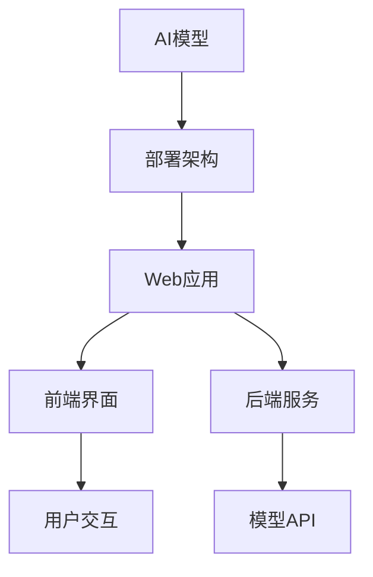
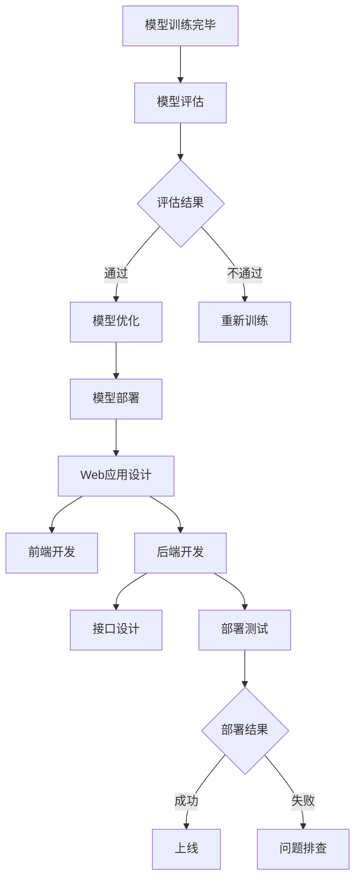

                 

关键词：人工智能，模型部署，Web应用开发，架构设计，性能优化，安全性，最佳实践

> 摘要：本文深入探讨了AI模型从开发到部署，再到Web应用开发的整个过程。首先介绍了AI模型部署的核心概念和架构设计，随后详细阐述了模型部署的流程与策略，并探讨了如何通过Web应用将AI模型与用户互动。最后，文章总结了模型部署及Web应用开发中的关键点，展望了未来的发展趋势与挑战。

## 1. 背景介绍

在当今数字化时代，人工智能（AI）技术已经成为推动各个行业进步的重要力量。从简单的自动化任务到复杂的决策支持系统，AI技术的应用范围不断扩大。然而，AI技术的落地并非易事，尤其是将AI模型从实验室环境成功部署到实际生产环境中。这不仅需要深入理解AI模型的原理和性能，还需要掌握模型部署的流程、策略和工具。

Web应用开发则是AI模型落地的重要渠道。通过Web应用，用户可以方便地与AI模型交互，实现实时数据分析和智能决策。然而，Web应用开发不仅要考虑用户界面和交互设计，还需要关注模型部署的效率、可靠性和安全性。

本文旨在系统地介绍AI模型部署及Web应用开发的整个过程，帮助读者理解如何从模型开发到产品交付的全流程，并掌握关键技术和最佳实践。

## 2. 核心概念与联系

### 2.1 AI模型部署

AI模型部署是指将训练好的模型集成到实际应用中，使其能够在生产环境中运行并提供服务。部署的核心目标是确保模型的高效性、可靠性和安全性。

### 2.2 Web应用开发

Web应用开发是构建用户与AI模型互动的平台。它包括前端界面设计、后端服务实现以及与AI模型的接口设计。

### 2.3 关系图

下面是一个简化的AI模型部署与Web应用开发的关系图，展示了两者之间的紧密联系。



### 2.4 Mermaid 流程图

以下是详细的Mermaid流程图，展示了AI模型部署与Web应用开发的主要步骤。



## 3. 核心算法原理 & 具体操作步骤

### 3.1 算法原理概述

AI模型部署的核心在于将训练好的模型转化为可以在生产环境中运行的形式。这个过程通常包括模型转换、容器化、服务化等多个步骤。

### 3.2 算法步骤详解

1. **模型转换**：将模型从训练环境转换为适合部署的格式。例如，从PyTorch转换为ONNX或TensorFlow Lite。

2. **容器化**：使用Docker等容器技术将模型和服务打包，确保部署环境与开发环境一致。

3. **服务化**：使用Kubernetes等编排工具将容器部署到集群中，实现自动化管理和扩展。

4. **接口设计**：设计API接口，使Web应用可以方便地调用模型服务。

### 3.3 算法优缺点

- **优点**：提高了模型的可移植性和可扩展性，便于维护和管理。

- **缺点**：部署过程相对复杂，需要一定的技术积累。

### 3.4 算法应用领域

AI模型部署广泛应用于图像识别、自然语言处理、推荐系统等多个领域。

## 4. 数学模型和公式 & 详细讲解 & 举例说明

### 4.1 数学模型构建

在模型部署过程中，常用的数学模型包括线性回归、神经网络等。

### 4.2 公式推导过程

以神经网络为例，其前向传播过程可以表示为：

$$
Z = \sigma(WX + b)
$$

其中，$Z$ 表示输出，$\sigma$ 表示激活函数，$W$ 和 $b$ 分别为权重和偏置。

### 4.3 案例分析与讲解

假设我们使用神经网络对图像进行分类，输入为 $784$ 维的特征向量，输出为 $10$ 个类别概率。我们通过调整网络结构、激活函数和优化器等参数，提高模型的分类性能。

## 5. 项目实践：代码实例和详细解释说明

### 5.1 开发环境搭建

在项目实践部分，我们使用Python和Docker进行模型部署。

### 5.2 源代码详细实现

以下是使用TensorFlow和Docker进行模型部署的示例代码：

```python
# Model Deployment with TensorFlow and Docker
import tensorflow as tf
from tensorflow.keras.models import load_model
import docker

# Load the trained model
model = load_model('model.h5')

# Push the model to Docker
client = docker.from_env()
image = client.images.build(path='model.dockerfile', tag='model:latest')

# Run the container
container = client.containers.run(image='model:latest', ports={'5000': 5000})

# Start the Flask app
app = flask.Flask(__name__)

@app.route('/predict', methods=['POST'])
def predict():
    data = flask.request.get_json()
    input_data = np.array([data['features']])
    prediction = model.predict(input_data)
    return {'prediction': prediction.tolist()}

if __name__ == '__main__':
    app.run(host='0.0.0.0', port=5000)
```

### 5.3 代码解读与分析

上述代码首先加载训练好的模型，然后将其推送到Docker容器中。接着，使用Flask框架搭建Web服务，通过HTTP接口提供模型预测功能。

### 5.4 运行结果展示

运行代码后，用户可以通过浏览器或Postman等工具访问 `/predict` 接口，获取模型的预测结果。

## 6. 实际应用场景

AI模型部署及Web应用开发在实际应用中具有广泛的应用，例如：

- **医疗诊断**：利用深度学习模型进行疾病预测和诊断。
- **金融风控**：使用AI模型进行信用评估和风险评估。
- **智能推荐**：通过推荐系统提供个性化的内容推荐。

## 7. 工具和资源推荐

### 7.1 学习资源推荐

- **《深度学习》（Goodfellow, Bengio, Courville）**：系统介绍了深度学习的理论和实践。
- **《机器学习》（周志华）**：详细讲解了机器学习的基本概念和算法。

### 7.2 开发工具推荐

- **TensorFlow**：适用于研究和生产环境的深度学习框架。
- **PyTorch**：易于使用且具有强大功能的深度学习框架。

### 7.3 相关论文推荐

- **“Docker: A Container Engine for the Modern Datacenter”**：介绍了Docker的基本概念和原理。
- **“Kubernetes: Container Scheduler and Management”**：讲解了Kubernetes的核心功能和使用方法。

## 8. 总结：未来发展趋势与挑战

### 8.1 研究成果总结

AI模型部署及Web应用开发已经取得了显著成果，但仍然面临许多挑战。

### 8.2 未来发展趋势

随着硬件性能的提升和云计算技术的发展，AI模型部署的效率将进一步提高。同时，自动化部署工具和平台的成熟也将推动AI模型的广泛应用。

### 8.3 面临的挑战

- **性能优化**：如何提高模型部署的效率和响应速度。
- **安全性**：如何确保模型和用户数据的安全。
- **可解释性**：如何提高模型的可解释性，增强用户信任。

### 8.4 研究展望

未来，AI模型部署及Web应用开发将朝着更加智能化、安全化和高效化的方向发展，为各个行业带来更多的创新和变革。

## 9. 附录：常见问题与解答

### 9.1 如何选择模型部署工具？

选择模型部署工具时，需要考虑模型的类型、性能要求和部署环境。TensorFlow Serving和PyTorch Serve是常用的开源模型部署工具。

### 9.2 如何确保模型部署的安全性？

确保模型部署的安全性可以从以下几个方面入手：

- **数据加密**：对传输和存储的数据进行加密。
- **访问控制**：设置严格的访问权限，防止未授权访问。
- **审计日志**：记录模型调用的详细信息，便于追踪和审计。

### 9.3 如何优化模型部署的性能？

优化模型部署的性能可以从以下几个方面进行：

- **模型压缩**：使用模型压缩技术减小模型体积，提高部署速度。
- **并行计算**：利用GPU等硬件加速模型计算。
- **负载均衡**：使用负载均衡器均衡模型服务的访问压力。

---

作者：禅与计算机程序设计艺术 / Zen and the Art of Computer Programming
```markdown


