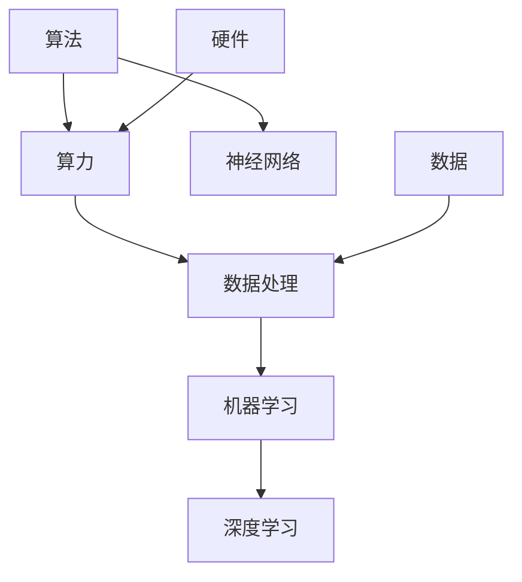

                 

关键词：人工智能，算法，算力，深度学习，计算模型，数据处理，技术发展，算法优化，未来展望

摘要：本文将深入探讨人工智能（AI）从算法到算力的发展历程，剖析核心算法原理，分析数学模型和公式，并通过实际项目实践进行代码实例讲解。此外，文章还将展望AI在实际应用场景中的未来发展趋势，以及面临的挑战和未来研究方向。

## 1. 背景介绍

人工智能作为计算机科学领域的一个分支，旨在使计算机模拟人类的智能行为。随着计算机性能的提升和算法的进步，AI技术逐渐渗透到各行各业，推动社会进步。从最初的符号主义、知识表示到如今的深度学习和神经网络，AI技术经历了翻天覆地的变化。

算力，作为计算能力的简称，是支撑AI发展的重要基石。随着硬件技术的不断演进，算力得到了大幅提升，为AI算法的优化和复杂模型的训练提供了强大支持。本文将围绕算法和算力的关系，探讨AI发展的全景图。

## 2. 核心概念与联系

为了更好地理解AI的发展，我们需要了解一些核心概念及其之间的联系。以下是一个简化的Mermaid流程图，展示了这些概念的基本结构：



### 2.1 算法与算力的关系

算法是指导计算机解决问题的一系列有序步骤。算力则是计算机处理数据的能力，是算法得以实现的基础。算法和算力的关系可以类比为“设计图纸”和“建筑材料”，设计再精妙，没有足够的建筑材料也难以实现。

### 2.2 数据处理与机器学习

数据处理是AI的基础，机器学习则是利用数据从经验中学习，从而改进算法。随着数据的增长，机器学习模型需要更强的算力来训练和处理这些数据。

### 2.3 深度学习与神经网络

深度学习是机器学习的一个分支，强调多层神经网络的使用。神经网络模拟人脑的工作方式，通过调整神经元之间的连接权重来学习数据。

### 2.4 硬件与数据

硬件技术的发展，如GPU、TPU等专用计算硬件，为AI提供了强大的算力支持。而大量数据的收集和处理，则为AI提供了丰富的训练资源。

## 3. 核心算法原理 & 具体操作步骤

### 3.1 算法原理概述

在深度学习中，核心算法是神经网络。神经网络通过多层感知器（MLP）结构，对输入数据进行前向传播和反向传播，不断调整权重，以达到训练目标。

### 3.2 算法步骤详解

1. **数据预处理**：对数据进行清洗、归一化等处理，以便输入到神经网络中。
2. **构建模型**：定义神经网络结构，包括输入层、隐藏层和输出层。
3. **前向传播**：将输入数据传递到神经网络中，通过各层计算，得到输出结果。
4. **计算误差**：通过输出结果与真实值的对比，计算损失函数的值。
5. **反向传播**：将误差传递回网络，更新权重和偏置。
6. **迭代训练**：重复上述步骤，直到满足训练目标。

### 3.3 算法优缺点

**优点**：
- **强泛化能力**：神经网络能够通过调整权重来适应不同的数据分布。
- **并行计算**：神经网络可以在多处理器系统中进行并行计算，提高计算效率。

**缺点**：
- **计算资源需求大**：训练复杂的神经网络需要大量的计算资源和时间。
- **对数据质量要求高**：数据的质量直接影响到模型的性能。

### 3.4 算法应用领域

神经网络广泛应用于图像识别、自然语言处理、语音识别等领域。随着算力的提升，神经网络的模型复杂度和应用范围也在不断扩大。

## 4. 数学模型和公式

在深度学习中，数学模型和公式是核心组成部分。以下是一个简化的数学模型：

### 4.1 数学模型构建

神经网络中的每个神经元可以表示为：

$$
z_i = \sum_{j=1}^{n} w_{ij} \cdot x_j + b_i
$$

其中，$z_i$是神经元$i$的输出，$w_{ij}$是连接权重，$x_j$是神经元$j$的输入，$b_i$是偏置。

### 4.2 公式推导过程

神经网络的损失函数通常使用均方误差（MSE）：

$$
J = \frac{1}{2} \sum_{i=1}^{m} (\hat{y}_i - y_i)^2
$$

其中，$\hat{y}_i$是预测值，$y_i$是真实值，$m$是样本数量。

### 4.3 案例分析与讲解

假设有一个简单的神经网络，用于分类问题。输入数据是一个2维向量，输出是一个1维向量。以下是训练过程中的几个步骤：

1. **初始化权重**：随机初始化权重和偏置。
2. **前向传播**：将输入数据传递到神经网络，得到输出结果。
3. **计算误差**：通过输出结果和真实值的对比，计算损失函数的值。
4. **反向传播**：将误差传递回网络，更新权重和偏置。
5. **迭代训练**：重复上述步骤，直到损失函数值满足要求。

## 5. 项目实践：代码实例

以下是一个简单的神经网络训练代码实例：

```python
import numpy as np

# 初始化参数
np.random.seed(42)
n_input = 2
n_output = 1
n_hidden = 3
weights_input_hidden = np.random.randn(n_input, n_hidden)
weights_hidden_output = np.random.randn(n_hidden, n_output)
bias_hidden = np.random.randn(n_hidden)
bias_output = np.random.randn(n_output)

# 前向传播
def forwardPropagation(x, weights_input_hidden, weights_hidden_output, bias_hidden, bias_output):
    hidden_layer = sigmoid(np.dot(x, weights_input_hidden) + bias_hidden)
    output_layer = sigmoid(np.dot(hidden_layer, weights_hidden_output) + bias_output)
    return output_layer

# 反向传播
def backwardPropagation(x, y, output_layer, hidden_layer, weights_input_hidden, weights_hidden_output, bias_hidden, bias_output):
    d_output_layer = output_layer - y
    d_hidden_layer = np.dot(d_output_layer, weights_hidden_output.T) * sigmoid_derivative(hidden_layer)
    
    d_weights_input_hidden = np.dot(x.T, d_hidden_layer)
    d_weights_hidden_output = np.dot(hidden_layer.T, d_output_layer)
    d_bias_hidden = np.sum(d_hidden_layer, axis=0)
    d_bias_output = np.sum(d_output_layer, axis=0)
    
    return d_weights_input_hidden, d_weights_hidden_output, d_bias_hidden, d_bias_output

# 激活函数
def sigmoid(x):
    return 1 / (1 + np.exp(-x))

# 激活函数的导数
def sigmoid_derivative(x):
    return x * (1 - x)

# 训练神经网络
def train(x, y, epochs=1000, learning_rate=0.1):
    for epoch in range(epochs):
        output_layer = forwardPropagation(x, weights_input_hidden, weights_hidden_output, bias_hidden, bias_output)
        d_weights_input_hidden, d_weights_hidden_output, d_bias_hidden, d_bias_output = backwardPropagation(x, y, output_layer, hidden_layer, weights_input_hidden, weights_hidden_output, bias_hidden, bias_output)
        
        weights_input_hidden -= learning_rate * d_weights_input_hidden
        weights_hidden_output -= learning_rate * d_weights_hidden_output
        bias_hidden -= learning_rate * d_bias_hidden
        bias_output -= learning_rate * d_bias_output

# 测试神经网络
def test(x):
    return forwardPropagation(x, weights_input_hidden, weights_hidden_output, bias_hidden, bias_output)

# 数据集
x_data = np.array([[0, 0], [0, 1], [1, 0], [1, 1]])
y_data = np.array([[0], [1], [1], [0]])

# 训练模型
train(x_data, y_data)

# 测试模型
predictions = [test(x) for x in x_data]
print(predictions)
```

## 6. 实际应用场景

AI技术已广泛应用于各个领域，如医疗、金融、制造业等。以下是一些具体的实际应用场景：

### 6.1 医疗

- **诊断辅助**：使用深度学习模型对医学影像进行诊断，如肿瘤检测、肺炎诊断等。
- **个性化治疗**：根据患者的基因信息和病史，提供个性化的治疗方案。

### 6.2 金融

- **风险控制**：使用机器学习模型预测金融市场的波动，从而进行风险控制。
- **智能投顾**：根据用户的投资偏好和历史数据，提供个性化的投资建议。

### 6.3 制造业

- **质量检测**：使用深度学习模型检测生产线上的缺陷，提高产品质量。
- **生产优化**：通过数据分析，优化生产流程，提高生产效率。

## 7. 未来应用展望

随着AI技术的不断发展和算力的提升，未来AI将在更多领域发挥重要作用。以下是一些未来应用展望：

### 7.1 自动驾驶

自动驾驶技术是AI应用的一个重要领域。随着传感器和算力的提升，自动驾驶技术将逐步成熟，实现真正的无人驾驶。

### 7.2 人工智能助手

人工智能助手将在办公、生活等领域发挥重要作用，如智能客服、智能家居等。

### 7.3 人工智能安全

随着AI技术的发展，人工智能安全将成为一个重要研究方向，确保AI系统的可靠性和安全性。

## 8. 工具和资源推荐

### 8.1 学习资源推荐

- **《深度学习》**：由Ian Goodfellow、Yoshua Bengio和Aaron Courville编写的经典教材，适合初学者入门。
- **《神经网络与深度学习》**：李航编写的中文教材，深入浅出地介绍了神经网络和深度学习的基本概念和原理。

### 8.2 开发工具推荐

- **TensorFlow**：谷歌开发的开源深度学习框架，适用于各种深度学习任务。
- **PyTorch**：Facebook开发的开源深度学习框架，具有灵活的动态计算图。

### 8.3 相关论文推荐

- **“A Theoretical Analysis of the Benefits of Weight Normalization for Deep Learning”**：分析了权重归一化在深度学习中的作用。
- **“High-Performance Training of Deep Neural Networks”**：探讨了如何提高深度神经网络的训练性能。

## 9. 总结：未来发展趋势与挑战

随着AI技术的不断发展和算力的提升，AI将在未来发挥越来越重要的作用。然而，AI技术也面临着一些挑战，如数据隐私、算法透明度和可解释性等。未来的研究方向包括：

- **算法优化**：通过改进算法和模型结构，提高AI模型的性能和效率。
- **硬件发展**：开发更高效的硬件，提升AI计算能力。
- **伦理与法律**：建立完善的AI伦理和法律框架，确保AI技术的合理使用和安全性。

## 10. 附录：常见问题与解答

### 10.1 什么是深度学习？

深度学习是一种机器学习的方法，通过多层神经网络模拟人脑的工作方式，对数据进行自动学习和特征提取。

### 10.2 深度学习和机器学习的区别是什么？

机器学习是更广泛的领域，包括深度学习在内。深度学习是机器学习的一个分支，强调多层神经网络的使用。

### 10.3 如何选择深度学习框架？

选择深度学习框架时，需要考虑项目需求、开发经验和个人偏好。常见的深度学习框架有TensorFlow和PyTorch等。

## 作者署名

作者：禅与计算机程序设计艺术 / Zen and the Art of Computer Programming
```

