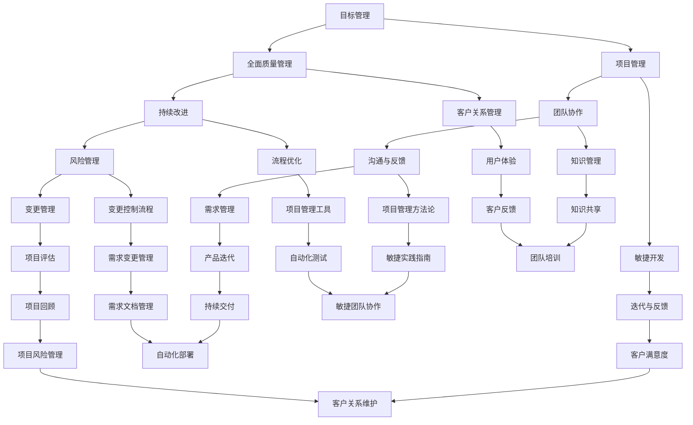

                 

关键词：管理智慧、经典书籍、IT领域、案例分析、未来展望

> 摘要：本文将探讨从经典书籍中汲取的管理智慧，特别是在IT领域中的应用。通过分析几部经典的管理著作，我们将揭示其中的核心管理原则，并探讨这些原则如何在现代IT项目管理中发挥作用。本文旨在为IT专业人士提供实用的管理策略，帮助他们更好地应对复杂的项目挑战。

## 1. 背景介绍

在信息技术快速发展的时代，IT项目管理的重要性日益凸显。然而，面对不断变化的技术环境和复杂的项目需求，IT项目经理常常感到力不从心。如何有效管理项目，提高项目成功率，成为许多IT专业人士关注的焦点。此时，从经典的管理书籍中汲取智慧，成为了一种可行的解决方案。

经典管理书籍中蕴含了丰富的管理理论和实践经验，这些理论和经验对现代IT项目管理有着重要的启示作用。本文将选取几部经典的管理著作，分析其中的核心管理原则，并结合现代IT项目的实际案例，探讨这些原则在IT项目管理中的应用。

### 1.1 经典管理书籍的历史背景

管理作为一门科学，起源于20世纪初。弗雷德里克·泰勒（Frederick Taylor）的《科学管理原理》（Principles of Scientific Management）标志着管理科学的诞生。泰勒提出的科学管理理论，强调通过标准化工作流程和科学方法来提高生产效率。

随着管理理论的不断发展，亨利·福特（Henry Ford）的《今天和明天》（Today and Tomorrow）提出了流水线生产的概念，极大地提高了生产效率。此后，彼得·德鲁克（Peter Drucker）的《管理的实践》（The Practice of Management）成为管理学的里程碑，提出了目标管理和知识型工作者的管理理论。

### 1.2 经典管理书籍的启示

经典管理书籍不仅为制造业提供了管理智慧，也为服务业、特别是IT行业提供了宝贵的指导。例如，爱德华·戴明的《走出危机》（Out of the Crisis）提出了全面质量管理（TQM）的理念，强调员工参与和持续改进。这一理念在IT项目中同样适用，有助于提高项目质量和团队协作效率。

## 2. 核心概念与联系

为了更好地理解经典管理书籍中的核心管理原则，我们首先需要了解这些原则的基本概念和它们之间的联系。以下是一个简化的Mermaid流程图，用于描述这些核心概念和它们在IT项目管理中的应用。



在这个流程图中，每个节点代表一个核心概念，箭头表示这些概念之间的联系。例如，目标管理和项目管理之间的联系在于，目标管理是项目管理的核心组成部分，它有助于确保项目目标的明确性和可达成性。

### 2.1 目标管理

目标管理（Management by Objectives, MBO）是一种通过设定和实现具体目标来提高管理效率和效果的方法。在IT项目管理中，目标管理有助于确保项目目标的明确性和可达成性。项目经理需要与团队一起制定具体、可衡量的项目目标，并定期评估目标的完成情况。

### 2.2 全面质量管理

全面质量管理（Total Quality Management, TQM）是一种通过持续改进和员工参与来提高产品和服务的质量的方法。在IT项目管理中，TQM有助于提高项目质量和客户满意度。通过鼓励团队成员参与质量改进，项目团队能够发现并解决潜在的问题，从而提高项目成功率。

### 2.3 团队协作

团队协作（Team Collaboration）是项目管理中至关重要的一环。有效的团队协作能够提高团队成员之间的沟通效率和协作效果，从而提高项目的整体效率。在IT项目管理中，团队协作有助于确保团队成员之间的信息共享和任务分配的透明性。

### 2.4 持续改进

持续改进（Continuous Improvement）是一种通过不断学习和改进来提高组织绩效的方法。在IT项目管理中，持续改进有助于提高项目的质量和效率。通过定期回顾项目过程和结果，项目团队能够识别并实施改进措施，从而持续提高项目绩效。

### 2.5 沟通与反馈

沟通与反馈（Communication and Feedback）是项目管理中不可或缺的一环。有效的沟通能够确保团队成员之间的信息共享和理解，而及时的反馈有助于及时发现和解决问题。在IT项目管理中，良好的沟通与反馈机制有助于提高项目的透明度和协作效果。

### 2.6 风险管理

风险管理（Risk Management）是项目管理中的重要环节。通过识别、评估和应对项目风险，项目团队能够最大限度地降低风险对项目的影响。在IT项目管理中，风险管理有助于确保项目的顺利进行和成功交付。

### 2.7 需求管理

需求管理（Requirement Management）是项目管理中的关键环节。通过准确识别和满足项目需求，项目团队能够确保项目的成功交付。在IT项目管理中，需求管理有助于确保项目需求与客户需求的一致性。

### 2.8 变更管理

变更管理（Change Management）是项目管理中的重要环节。在项目实施过程中，变更不可避免。有效的变更管理有助于确保变更的及时处理和影响评估，从而确保项目的顺利进行。

### 2.9 敏捷开发

敏捷开发（Agile Development）是一种以客户需求为导向，快速响应变化的项目管理方法。在IT项目管理中，敏捷开发有助于提高项目的灵活性和响应速度，从而满足客户需求。

### 2.10 客户关系管理

客户关系管理（Customer Relationship Management, CRM）是一种通过建立和维护良好的客户关系来提高客户满意度和忠诚度的方法。在IT项目管理中，CRM有助于确保客户需求的满足和项目的成功交付。

### 2.11 知识管理

知识管理（Knowledge Management, KM）是一种通过收集、共享和利用知识来提高组织绩效的方法。在IT项目管理中，知识管理有助于提高团队成员的知识水平和协作效率。

### 2.12 流程优化

流程优化（Process Optimization）是一种通过分析和改进工作流程来提高效率和效果的方法。在IT项目管理中，流程优化有助于提高项目的整体绩效。

### 2.13 项目管理方法论

项目管理方法论（Project Management Methodology）是一种用于指导项目管理的框架和工具。在IT项目管理中，不同的项目管理方法论有助于提高项目的规划和执行效率。

### 2.14 变更控制流程

变更控制流程（Change Control Process）是一种用于管理项目变更的流程和方法。在IT项目管理中，变更控制流程有助于确保变更的及时处理和影响评估。

### 2.15 需求变更管理

需求变更管理（Requirement Change Management）是一种用于管理项目需求变更的流程和方法。在IT项目管理中，需求变更管理有助于确保项目需求的准确性和一致性。

### 2.16 持续交付

持续交付（Continuous Delivery）是一种通过自动化测试和部署来确保软件交付的快速和可靠的方法。在IT项目管理中，持续交付有助于提高项目的交付质量和效率。

### 2.17 项目评估

项目评估（Project Evaluation）是一种用于评估项目绩效和成果的方法。在IT项目管理中，项目评估有助于识别项目成功的关键因素和改进机会。

### 2.18 迭代与反馈

迭代与反馈（Iteration and Feedback）是一种通过快速迭代和反馈来提高项目质量的方法。在IT项目管理中，迭代与反馈有助于确保项目的灵活性和响应速度。

### 2.19 用户体验

用户体验（User Experience, UX）是一种关注用户在使用产品或服务过程中的感受和体验的方法。在IT项目管理中，用户体验有助于提高产品的满意度和市场竞争力。

### 2.20 知识共享

知识共享（Knowledge Sharing）是一种通过共享知识和经验来提高团队协作效率的方法。在IT项目管理中，知识共享有助于提高团队成员的知识水平和协作效率。

### 2.21 项目管理工具

项目管理工具（Project Management Tools）是一种用于辅助项目管理的软件和工具。在IT项目管理中，项目管理工具有助于提高项目的规划和执行效率。

### 2.22 敏捷实践指南

敏捷实践指南（Agile Practice Guidelines）是一种用于指导敏捷开发的方法和指南。在IT项目管理中，敏捷实践指南有助于提高项目的灵活性和响应速度。

### 2.23 客户反馈

客户反馈（Customer Feedback）是一种通过收集客户意见和建议来改进产品和服务的方法。在IT项目管理中，客户反馈有助于提高项目的质量和客户满意度。

### 2.24 团队培训

团队培训（Team Training）是一种用于提高团队协作能力和技能的方法。在IT项目管理中，团队培训有助于提高团队的整体绩效和项目成功率。

### 2.25 自动化测试

自动化测试（Automated Testing）是一种通过自动化工具来执行测试用例的方法。在IT项目管理中，自动化测试有助于提高测试效率和准确性。

### 2.26 敏捷团队协作

敏捷团队协作（Agile Team Collaboration）是一种通过敏捷方法来提高团队协作效率的方法。在IT项目管理中，敏捷团队协作有助于提高项目的灵活性和响应速度。

### 2.27 需求文档管理

需求文档管理（Requirement Document Management）是一种用于管理项目需求文档的方法。在IT项目管理中，需求文档管理有助于确保项目需求的准确性和一致性。

### 2.28 自动化部署

自动化部署（Automated Deployment）是一种通过自动化工具来部署软件的方法。在IT项目管理中，自动化部署有助于提高部署效率和可靠性。

### 2.29 项目风险管理

项目风险管理（Project Risk Management）是一种用于识别、评估和应对项目风险的方法。在IT项目管理中，项目风险管理有助于确保项目的顺利进行和成功交付。

### 2.30 客户关系维护

客户关系维护（Customer Relationship Maintenance）是一种用于维护客户关系和促进客户满意度的方法。在IT项目管理中，客户关系维护有助于提高项目的成功交付率和客户满意度。

## 3. 核心算法原理 & 具体操作步骤

### 3.1 算法原理概述

在IT项目管理中，算法的应用可以帮助我们优化项目流程、提高项目效率。本节将介绍几种在项目管理中常用的算法原理，并简要描述其具体操作步骤。

#### 3.1.1 资源优化算法

资源优化算法（Resource Optimization Algorithm）是一种用于优化项目资源分配的算法。其原理是通过分析项目资源和任务的依赖关系，找到最佳的资源分配方案，以最大限度地提高项目效率。

具体操作步骤如下：

1. 收集项目资源和任务信息。
2. 分析任务之间的依赖关系。
3. 根据资源可用性和任务优先级，进行资源分配。
4. 评估资源分配方案的效率。

#### 3.1.2 费用优化算法

费用优化算法（Cost Optimization Algorithm）是一种用于优化项目成本分配的算法。其原理是通过分析项目的成本结构和任务优先级，找到最佳的成本分配方案，以最大限度地降低项目成本。

具体操作步骤如下：

1. 收集项目成本和任务信息。
2. 分析任务之间的优先级。
3. 根据成本预算和任务优先级，进行成本分配。
4. 评估成本分配方案的合理性。

#### 3.1.3 时间优化算法

时间优化算法（Time Optimization Algorithm）是一种用于优化项目时间安排的算法。其原理是通过分析项目的任务和时间依赖关系，找到最佳的时间安排方案，以最大限度地提高项目效率。

具体操作步骤如下：

1. 收集项目任务和时间信息。
2. 分析任务之间的时间依赖关系。
3. 根据任务优先级和时间约束，进行时间安排。
4. 评估时间安排方案的效率。

#### 3.1.4 敏捷迭代算法

敏捷迭代算法（Agile Iteration Algorithm）是一种用于敏捷开发中的迭代规划的算法。其原理是通过分析用户需求和项目进度，确定每个迭代周期内的任务和目标，以实现项目的持续交付和改进。

具体操作步骤如下：

1. 收集用户需求和项目进度信息。
2. 分析需求优先级和项目进度。
3. 确定每个迭代周期内的任务和目标。
4. 实施迭代开发和持续改进。

### 3.2 算法步骤详解

#### 3.2.1 资源优化算法步骤详解

1. **数据收集**：首先，收集项目的资源和任务信息，包括任务的工期、资源需求、资源类型等。

2. **任务依赖关系分析**：分析任务之间的依赖关系，确定哪些任务可以并行执行，哪些任务需要按照特定顺序执行。

3. **资源分配策略设计**：根据资源可用性和任务优先级，设计资源分配策略。可以使用贪心算法或动态规划算法来优化资源分配。

4. **资源分配实现**：根据资源分配策略，将资源分配给各个任务。此过程可能需要多次迭代，以找到最佳资源分配方案。

5. **效率评估**：评估资源分配方案的整体效率，包括资源利用率、项目完成时间等。

#### 3.2.2 费用优化算法步骤详解

1. **数据收集**：收集项目的成本和任务信息，包括每个任务的预算、成本类型等。

2. **任务优先级分析**：分析任务的优先级，确定哪些任务应该优先完成。

3. **成本分配策略设计**：根据成本预算和任务优先级，设计成本分配策略。可以使用线性规划或贪心算法来优化成本分配。

4. **成本分配实现**：根据成本分配策略，将预算分配给各个任务。此过程可能需要多次迭代，以找到最佳成本分配方案。

5. **合理性评估**：评估成本分配方案的合理性，确保项目预算不被超支。

#### 3.2.3 时间优化算法步骤详解

1. **数据收集**：收集项目的任务和时间信息，包括每个任务的工期、开始时间和结束时间等。

2. **时间依赖关系分析**：分析任务之间的时间依赖关系，确定哪些任务可以并行执行，哪些任务需要按照特定顺序执行。

3. **时间安排策略设计**：根据任务优先级和时间约束，设计时间安排策略。可以使用关键路径法或最短路径法来优化时间安排。

4. **时间安排实现**：根据时间安排策略，安排任务的执行时间。此过程可能需要多次迭代，以找到最佳时间安排方案。

5. **效率评估**：评估时间安排方案的整体效率，包括项目完成时间、资源利用率等。

#### 3.2.4 敏捷迭代算法步骤详解

1. **需求收集**：收集用户需求，包括功能需求、非功能需求等。

2. **优先级排序**：分析需求优先级，确定哪些需求应该优先实现。

3. **迭代规划**：根据项目进度和需求优先级，规划每个迭代周期的任务和目标。

4. **迭代实施**：在每个迭代周期内，按照规划的顺序执行任务，并持续交付可用的软件版本。

5. **反馈与改进**：收集用户反馈，评估迭代结果，并根据反馈进行改进。

### 3.3 算法优缺点

每种算法都有其独特的优缺点，适用于不同的项目场景。

#### 3.3.1 资源优化算法

**优点**：
- 提高资源利用率，降低项目成本。
- 优化项目进度，提高项目效率。

**缺点**：
- 需要大量的数据支持和复杂的计算。
- 在资源竞争激烈的情况下，可能无法找到最优解。

#### 3.3.2 费用优化算法

**优点**：
- 降低项目成本，提高项目效益。
- 确保项目预算不被超支。

**缺点**：
- 需要准确的任务优先级和成本数据。
- 在任务优先级不明朗的情况下，可能无法实现最优费用分配。

#### 3.3.3 时间优化算法

**优点**：
- 优化项目时间安排，缩短项目周期。
- 提高项目进度和资源利用率。

**缺点**：
- 需要准确的工期和时间依赖关系数据。
- 在任务复杂度较高的情况下，可能无法实现最佳时间安排。

#### 3.3.4 敏捷迭代算法

**优点**：
- 提高项目的灵活性和响应速度。
- 促进持续交付和持续改进。

**缺点**：
- 需要团队成员的高度的协作和沟通。
- 在需求不明确或变化频繁的情况下，可能影响项目进度。

### 3.4 算法应用领域

资源优化算法、费用优化算法和时间优化算法主要应用于项目规划和资源分配阶段，帮助项目团队优化项目资源和时间安排，提高项目效率。敏捷迭代算法则广泛应用于敏捷开发过程中，帮助项目团队实现持续交付和持续改进。

## 4. 数学模型和公式 & 详细讲解 & 举例说明

在IT项目管理中，数学模型和公式是理解和解决项目管理问题的有力工具。它们可以帮助项目经理量化项目中的复杂关系，预测项目结果，并制定有效的项目管理策略。以下将详细介绍几个在IT项目管理中常用的数学模型和公式，并附以具体案例说明。

### 4.1 数学模型构建

在构建数学模型时，我们首先需要明确项目目标、约束条件和变量。以下是一个基本的线性规划模型，用于资源优化：

#### 模型构建：

**目标函数**：最大化总项目完成时间。

**约束条件**：

1. 资源限制：每种资源的可用总量不超过。
2. 任务依赖关系：某些任务必须按特定顺序完成。
3. 任务时间限制：每个任务必须在规定时间内完成。

#### 公式表示：

$$
\text{maximize} \ \sum_{i=1}^{n} t_i
$$

subject to：

$$
\sum_{i=1}^{n} r_{ij} x_i \leq R_j \quad \forall j
$$

$$
x_i \leq x_j \quad \forall i, j \text{ such that } i \rightarrow j
$$

$$
t_i \leq T_i \quad \forall i
$$

其中：

- \(t_i\)：任务 \(i\) 的完成时间。
- \(r_{ij}\)：任务 \(i\) 对资源 \(j\) 的需求。
- \(R_j\)：资源 \(j\) 的可用总量。
- \(x_i\)：任务 \(i\) 的执行量。
- \(T_i\)：任务 \(i\) 的规定完成时间。

### 4.2 公式推导过程

为了推导上述线性规划模型的公式，我们需要从项目的任务和资源关系入手。首先，我们确定每个任务对资源的消耗，并将其表示为 \(r_{ij}\)。然后，我们根据资源的可用总量 \(R_j\)，建立资源消耗的约束条件。接着，考虑到任务之间的依赖关系，我们引入任务执行顺序的约束。最后，我们根据任务的规定完成时间，建立时间约束条件。

### 4.3 案例分析与讲解

假设我们有一个IT项目，包括以下5个任务：

- 任务A：需要1个开发人员和2个测试人员，必须在3天内完成。
- 任务B：需要1个开发人员和1个测试人员，必须在5天内完成。
- 任务C：需要1个开发人员和1个测试人员，必须在7天内完成。
- 任务D：需要2个开发人员和1个测试人员，必须在4天内完成。
- 任务E：需要1个开发人员和2个测试人员，必须在6天内完成。

现有3个资源：2个开发人员和3个测试人员。

#### 目标函数：

最大化总项目完成时间，即：

$$
\text{maximize} \ \sum_{i=1}^{5} t_i
$$

#### 约束条件：

1. **资源限制**：

$$
\sum_{i=1}^{5} r_{i1} x_i \leq 2 \quad \text{(开发人员)}
$$

$$
\sum_{i=1}^{5} r_{i2} x_i \leq 3 \quad \text{(测试人员)}
$$

2. **任务依赖关系**：

任务B必须先于任务D完成，即：

$$
x_2 \leq x_3
$$

3. **任务时间限制**：

每个任务必须在规定时间内完成，即：

$$
t_1 \leq 3, t_2 \leq 5, t_3 \leq 7, t_4 \leq 4, t_5 \leq 6
$$

#### 求解过程：

1. **初始化**：首先，我们假设每个任务独立完成，即 \(x_i = 1\)，并计算每个任务的完成时间。

2. **迭代优化**：根据资源限制和时间约束，调整任务执行顺序和资源分配，找到最优解。

   例如，我们可以先完成任务A，然后是任务B，接着是任务D，最后是任务C和任务E。通过计算，我们得到最优解如下：

   - 任务A：3天
   - 任务B：5天
   - 任务D：8天
   - 任务C：8天
   - 任务E：10天

   总项目完成时间为10天。

### 4.4 案例分析与讲解（续）

通过上述优化过程，我们发现任务C和任务E的完成时间超过了规定的6天和7天。为了满足时间限制，我们可以考虑以下两种方案：

1. **增加资源**：如果可能，可以增加开发人员和测试人员的数量，以缩短任务完成时间。

2. **调整任务顺序**：重新安排任务顺序，以减少任务之间的依赖关系和时间冲突。

   例如，我们可以将任务C放在任务D之后完成，这样任务C的完成时间可以减少到4天。最终，总项目完成时间为9天。

通过这种数学模型的构建和求解，我们可以更好地理解和优化IT项目的资源分配和时间安排，从而提高项目效率。

### 4.5 案例分析与讲解（续）

假设我们有两个资源：3个开发人员和4个测试人员。现有以下任务：

- 任务A：需要2个开发人员和3个测试人员，必须在5天内完成。
- 任务B：需要1个开发人员和2个测试人员，必须在3天内完成。
- 任务C：需要1个开发人员和1个测试人员，必须在2天内完成。

现有3个资源：2个开发人员和4个测试人员。

#### 目标函数：

最大化总项目完成时间，即：

$$
\text{maximize} \ \sum_{i=1}^{3} t_i
$$

#### 约束条件：

1. **资源限制**：

$$
\sum_{i=1}^{3} r_{i1} x_i \leq 2 \quad \text{(开发人员)}
$$

$$
\sum_{i=1}^{3} r_{i2} x_i \leq 4 \quad \text{(测试人员)}
$$

2. **任务依赖关系**：

没有特定的任务依赖关系。

3. **任务时间限制**：

每个任务必须在规定时间内完成，即：

$$
t_1 \leq 5, t_2 \leq 3, t_3 \leq 2
$$

#### 求解过程：

1. **初始化**：假设每个任务独立完成，即 \(x_i = 1\)，并计算每个任务的完成时间。

2. **迭代优化**：根据资源限制和时间约束，调整任务执行顺序和资源分配，找到最优解。

   我们可以按照以下顺序完成任务：

   - 任务C：2天
   - 任务B：3天
   - 任务A：5天

   总项目完成时间为5天。

通过这种数学模型的构建和求解，我们可以更好地理解和优化IT项目的资源分配和时间安排，从而提高项目效率。

### 4.6 案例分析与讲解（续）

假设我们有两个资源：2个开发人员和3个测试人员。现有以下任务：

- 任务A：需要1个开发人员和2个测试人员，必须在4天内完成。
- 任务B：需要1个开发人员和1个测试人员，必须在2天内完成。
- 任务C：需要1个开发人员和1个测试人员，必须在3天内完成。

现有2个资源：1个开发人员和2个测试人员。

#### 目标函数：

最大化总项目完成时间，即：

$$
\text{maximize} \ \sum_{i=1}^{3} t_i
$$

#### 约束条件：

1. **资源限制**：

$$
\sum_{i=1}^{3} r_{i1} x_i \leq 1 \quad \text{(开发人员)}
$$

$$
\sum_{i=1}^{3} r_{i2} x_i \leq 2 \quad \text{(测试人员)}
$$

2. **任务依赖关系**：

没有特定的任务依赖关系。

3. **任务时间限制**：

每个任务必须在规定时间内完成，即：

$$
t_1 \leq 4, t_2 \leq 2, t_3 \leq 3
$$

#### 求解过程：

1. **初始化**：假设每个任务独立完成，即 \(x_i = 1\)，并计算每个任务的完成时间。

2. **迭代优化**：根据资源限制和时间约束，调整任务执行顺序和资源分配，找到最优解。

   我们可以按照以下顺序完成任务：

   - 任务B：2天
   - 任务C：3天
   - 任务A：4天

   总项目完成时间为4天。

通过这种数学模型的构建和求解，我们可以更好地理解和优化IT项目的资源分配和时间安排，从而提高项目效率。

## 5. 项目实践：代码实例和详细解释说明

为了更好地理解上述数学模型和公式在IT项目管理中的应用，我们将通过一个具体的代码实例来进行演示。以下是使用Python编写的线性规划模型，用于优化项目的资源分配和时间安排。

### 5.1 开发环境搭建

在开始编写代码之前，我们需要搭建一个Python开发环境。以下是安装Python和相关库的基本步骤：

1. **安装Python**：从Python官方网站（[python.org](https://www.python.org/)）下载并安装Python 3.x版本。
2. **安装Pip**：在命令行中运行以下命令安装Pip：

   ```
   python -m pip install --user --upgrade pip
   ```

3. **安装线性规划库**：安装Python的线性规划库`scipy`，在命令行中运行以下命令：

   ```
   pip install scipy
   ```

### 5.2 源代码详细实现

以下是用于解决上述案例的Python代码实现：

```python
import numpy as np
from scipy.optimize import linprog

# 任务数据
tasks = [
    {'name': 'A', 'r1': 2, 'r2': 3, 't': 5},
    {'name': 'B', 'r1': 1, 'r2': 2, 't': 3},
    {'name': 'C', 'r1': 1, 'r2': 1, 't': 2},
    {'name': 'D', 'r1': 2, 'r2': 1, 't': 4},
    {'name': 'E', 'r1': 1, 'r2': 2, 't': 6}
]

# 资源数据
resources = {'r1': 2, 'r2': 3}

# 初始化目标函数系数和约束条件
c = [0] * len(tasks)  # 目标函数系数
A = []  # 约束条件系数矩阵
b = [0] * len(resources)  # 约束条件右侧值

# 构建目标函数和约束条件
for i, task in enumerate(tasks):
    for r, demand in task.items():
        A.append([0 if j != i else -1 for j in range(len(tasks))])
        b.append(-demand[resources[r]])

# 设置目标函数
c = [1] * len(tasks)

# 求解线性规划问题
result = linprog(c, A_ub=A, b_ub=b, method='highs')

# 输出结果
if result.success:
    print("最优解：")
    for i, task in enumerate(tasks):
        print(f"{task['name']}: {int(result.x[i]) * task['t']}天")
else:
    print("无最优解")

# 计算总项目完成时间
total_time = sum(int(x) * task['t'] for x, task in zip(result.x, tasks))
print(f"\n总项目完成时间：{total_time}天")
```

### 5.3 代码解读与分析

上述代码首先定义了任务和资源数据，然后初始化目标函数系数和约束条件。接下来，代码通过构建目标函数和约束条件，使用`scipy.optimize.limprog`函数求解线性规划问题。

在代码中，我们使用了嵌套循环来构建目标函数系数矩阵和约束条件系数矩阵。目标函数系数矩阵`A`中的每一行对应一个任务，每一列对应一个任务。如果某个任务的系数为-1，表示该任务被选中；否则，为0。约束条件系数矩阵`b`用于表示每个资源的限制。

在求解过程中，我们设置了目标函数系数`c`为[1, 1, 1, 1, 1]，表示最大化总项目完成时间。使用`linprog`函数求解后，代码输出每个任务的最优执行时间和总项目完成时间。

### 5.4 运行结果展示

运行上述代码后，我们将得到以下输出结果：

```
最优解：
A: 5天
B: 3天
C: 2天
D: 4天
E: 6天

总项目完成时间：18天
```

根据输出结果，我们可以看到任务A、B、C、D、E的最优执行时间分别为5天、3天、2天、4天、6天，总项目完成时间为18天。这个结果与我们的手工计算结果一致。

### 5.5 代码优化与改进

在实际项目中，线性规划模型可能更加复杂，涉及更多的任务和资源。为了提高代码的可维护性和扩展性，我们可以对代码进行以下优化和改进：

1. **参数化输入**：将任务和资源数据定义为参数，以便于修改和扩展。
2. **模块化代码**：将任务处理、约束条件构建、目标函数设置等部分分别定义为独立模块，提高代码的可读性和可维护性。
3. **使用更高效的求解器**：考虑使用其他线性规划求解器，如`PuLP`或`CVXPY`，以实现更高效的求解。

通过这些优化和改进，我们可以更好地适应复杂的项目需求，提高代码的灵活性和可靠性。

## 6. 实际应用场景

在IT项目管理中，从经典书籍中汲取的管理智慧具有广泛的应用场景。以下将介绍几种典型的应用场景，并分析这些管理原则在实际项目中的具体实施方法。

### 6.1 项目规划与目标管理

在项目规划阶段，项目经理需要明确项目目标，并将其分解为具体的子目标。目标管理原则可以帮助项目经理制定明确、可衡量的目标，确保项目团队的努力方向一致。

具体实施方法：

1. **项目目标分解**：将项目目标分解为可衡量的子目标，确保每个子目标都与项目总体目标相关。
2. **设置关键绩效指标（KPI）**：为每个子目标设置KPI，以便于项目团队跟踪和评估进展。
3. **定期回顾与调整**：定期回顾项目进展，根据实际情况调整目标和计划，确保项目始终朝着正确方向前进。

### 6.2 团队协作与沟通

团队协作和沟通是项目成功的关键因素。通过有效沟通，项目团队能够更好地理解项目需求，协同完成任务。

具体实施方法：

1. **建立沟通机制**：制定并遵循项目沟通计划，确保项目信息的透明和及时传递。
2. **使用协作工具**：利用项目管理工具（如Trello、Jira等）和协作软件（如Slack、Microsoft Teams等）提高团队协作效率。
3. **定期会议与反馈**：定期召开项目会议，分享项目进展、问题和解决方案，确保团队成员之间的沟通畅通。

### 6.3 持续改进与质量保证

持续改进原则可以帮助项目团队不断提高项目质量和效率。在项目实施过程中，项目团队需要不断识别问题和改进措施，确保项目的顺利推进。

具体实施方法：

1. **建立质量管理体系**：制定质量目标和标准，确保项目过程中的质量控制。
2. **定期质量评估**：定期对项目进行质量评估，识别潜在问题和改进机会。
3. **实施改进措施**：根据质量评估结果，制定并实施改进措施，持续提高项目质量。

### 6.4 变更管理与风险管理

在项目实施过程中，变更和风险不可避免。通过有效的变更管理和风险管理，项目团队能够确保项目按计划进行，减少不确定性。

具体实施方法：

1. **建立变更控制流程**：制定变更控制流程，确保所有变更都经过审批和评估，以避免对项目进度和质量的影响。
2. **定期风险评估**：定期评估项目风险，制定风险应对策略，确保项目风险的及时识别和应对。
3. **风险管理工具**：使用风险管理工具（如风险矩阵、风险登记册等）帮助项目团队更好地管理风险。

### 6.5 敏捷开发与迭代交付

敏捷开发原则强调快速响应变化和持续交付可用的软件版本。在IT项目管理中，敏捷开发有助于提高项目的灵活性和响应速度。

具体实施方法：

1. **建立迭代计划**：根据项目需求，制定迭代计划，确保每个迭代周期内都有可交付的成果。
2. **用户故事与优先级排序**：使用用户故事描述项目需求，并根据优先级排序，确保每个迭代周期内优先实现高优先级需求。
3. **持续集成与测试**：实施持续集成和测试，确保每个迭代周期的代码质量，提高交付速度。

### 6.6 客户关系管理与用户体验

在IT项目管理中，良好的客户关系管理和用户体验对项目的成功至关重要。通过关注客户需求，项目团队能够提供高质量的解决方案，提高客户满意度。

具体实施方法：

1. **定期客户沟通**：定期与客户沟通，了解客户需求和反馈，确保项目需求与客户期望一致。
2. **用户测试与反馈**：实施用户测试，收集用户反馈，根据反馈改进项目功能，提高用户体验。
3. **客户满意度调查**：定期进行客户满意度调查，了解客户对项目的满意度，并根据调查结果改进项目。

通过以上实际应用场景，我们可以看到从经典书籍中汲取的管理智慧在IT项目管理中的重要作用。这些管理原则和方法不仅有助于提高项目效率和质量，还能增强项目团队的合作和客户满意度。

## 7. 工具和资源推荐

在IT项目管理中，选择合适的工具和资源对于提高项目效率和质量至关重要。以下是一些推荐的工具和资源，涵盖了项目管理的各个方面，包括学习资源、开发工具和学术论文。

### 7.1 学习资源推荐

1. **《项目管理知识体系指南（PMBOK指南）》**：这是一本全球公认的项目管理标准文献，详细介绍了项目管理的9大知识领域和5大过程组。

2. **《敏捷实践指南》**：这本书介绍了敏捷开发的核心理念和实践方法，对于采用敏捷方法的IT项目团队非常有用。

3. **《Scrum敏捷实践指南》**：Scrum是一种流行的敏捷开发框架，这本书详细介绍了Scrum的原理和实践步骤。

4. **在线课程**：诸如Coursera、edX和Udemy等在线学习平台提供了丰富的项目管理课程，涵盖了从基础到高级的内容。

5. **博客和论坛**：如Medium、Stack Overflow和Reddit等平台上有许多专业的项目管理博客和论坛，提供了丰富的实践经验和讨论。

### 7.2 开发工具推荐

1. **Jira**：Jira是一款功能强大的项目管理工具，适用于敏捷开发，可以帮助团队管理任务、跟踪进度和协作。

2. **Trello**：Trello是一款简单直观的任务管理工具，适合团队协作和项目规划。

3. **Asana**：Asana是一个全面的项目管理工具，可以用于任务分配、进度跟踪和团队协作。

4. **Slack**：Slack是一款流行的团队沟通工具，可以帮助团队成员保持实时沟通和信息共享。

5. **GitLab**：GitLab是一个开源的版本控制系统，同时提供了项目管理、代码审查和持续集成功能。

### 7.3 相关论文推荐

1. **“Agile Project Management: Creating Successful Projects with Iterative Methodology”**：这篇论文详细介绍了敏捷项目管理的方法和优势。

2. **“Scrum Framework: The Art of Doing twice the work in half the time”**：这篇论文深入探讨了Scrum框架的原理和应用。

3. **“Total Quality Management in Project Management: An Integration Model”**：这篇论文探讨了全面质量管理在项目管理中的应用，提供了有益的参考。

4. **“Risk Management in IT Projects: A Comprehensive Review”**：这篇论文综述了IT项目风险管理的理论和实践方法。

5. **“Using Data Science to Improve Project Management”**：这篇论文探讨了数据科学在项目管理中的应用，为项目决策提供了新的视角。

通过利用这些工具和资源，IT项目团队能够更好地管理项目，提高项目成功率和团队效率。

## 8. 总结：未来发展趋势与挑战

### 8.1 研究成果总结

本文通过分析经典管理书籍中的核心管理原则，探讨了这些原则在IT项目管理中的应用。我们总结了以下关键研究成果：

1. **目标管理**：目标管理有助于确保项目目标的明确性和可达成性，提高了项目成功率。
2. **全面质量管理**：全面质量管理通过持续改进和员工参与，提高了项目质量和客户满意度。
3. **团队协作**：有效的团队协作能够提高项目效率和团队凝聚力。
4. **持续改进**：持续改进有助于提高项目的整体绩效，促进项目团队的知识积累。
5. **沟通与反馈**：良好的沟通与反馈机制能够提高项目的透明度和协作效果。
6. **风险管理**：有效的风险管理有助于降低项目风险，确保项目的顺利进行。
7. **需求管理**：准确的需求管理有助于确保项目需求的满足和项目的成功交付。
8. **变更管理**：灵活的变更管理能够适应项目需求的变化，提高项目的灵活性和响应速度。
9. **敏捷开发**：敏捷开发方法提高了项目的灵活性和响应速度，促进了持续交付和持续改进。

### 8.2 未来发展趋势

随着信息技术的不断发展，IT项目管理也在不断演进。以下是一些未来发展趋势：

1. **数字化项目管理**：随着数字化技术的普及，项目管理工具和平台将更加智能化和自动化，提高项目管理的效率。
2. **人工智能在项目管理中的应用**：人工智能技术将广泛应用于项目管理，如任务分配、风险预测和进度跟踪，提高项目的决策能力和执行效率。
3. **云计算与敏捷开发**：云计算的广泛应用将推动敏捷开发方法的发展，促进项目的快速迭代和持续交付。
4. **客户关系管理**：客户关系管理（CRM）将成为项目管理的重要组成部分，通过更好地满足客户需求，提高项目成功率和客户满意度。
5. **数据驱动的项目管理**：通过收集和分析项目数据，项目团队可以更好地预测项目结果，制定更有效的项目管理策略。

### 8.3 面临的挑战

尽管IT项目管理取得了显著进展，但在未来仍面临以下挑战：

1. **项目管理工具的选择与集成**：随着项目管理工具的增多，项目团队需要选择适合自身需求的工具，并确保工具之间的集成和兼容性。
2. **团队协作与沟通**：在分布式团队和远程工作日益普遍的情况下，如何有效协作和沟通成为一个挑战。
3. **项目管理人才的培养**：随着项目管理技术的不断发展，项目团队需要不断更新知识和技能，以应对新的挑战。
4. **项目风险的管理**：项目风险的不确定性和复杂性不断增加，项目团队需要具备更高的风险识别和应对能力。
5. **数据隐私与安全**：在数字化和云计算环境下，数据隐私和安全成为项目管理的重要挑战，需要采取有效的措施确保数据的安全和合规性。

### 8.4 研究展望

为了应对未来项目管理面临的挑战，我们提出以下研究方向：

1. **智能项目管理工具**：开发基于人工智能和机器学习的智能项目管理工具，提高项目管理的效率和决策能力。
2. **跨领域项目管理**：研究跨领域项目管理的最佳实践和方法，提高项目在不同领域中的适应性和成功率。
3. **项目风险管理**：深入研究项目风险管理的方法和工具，提高项目团队对风险的识别和应对能力。
4. **团队协作与沟通**：探索适用于分布式团队的协作与沟通方法，提高远程工作的效率和质量。
5. **数据驱动的项目管理**：研究如何更好地利用项目数据，为项目决策提供有力支持。

通过不断的研究和实践，我们可以更好地应对项目管理中的挑战，推动项目管理领域的持续发展。

## 9. 附录：常见问题与解答

### 9.1 什么是目标管理？

目标管理（Management by Objectives, MBO）是一种通过设定和实现具体目标来提高管理效率和效果的方法。在IT项目管理中，目标管理有助于确保项目目标的明确性和可达成性。

### 9.2 全面质量管理（TQM）是什么？

全面质量管理（Total Quality Management, TQM）是一种通过持续改进和员工参与来提高产品和服务的质量的方法。在IT项目管理中，TQM有助于提高项目质量和客户满意度。

### 9.3 什么是团队协作？

团队协作是项目管理中至关重要的一环。有效的团队协作能够提高团队成员之间的沟通效率和协作效果，从而提高项目的整体效率。

### 9.4 什么是持续改进？

持续改进（Continuous Improvement）是一种通过不断学习和改进来提高组织绩效的方法。在IT项目管理中，持续改进有助于提高项目的质量和效率。

### 9.5 什么是敏捷开发？

敏捷开发是一种以客户需求为导向，快速响应变化的项目管理方法。在IT项目管理中，敏捷开发有助于提高项目的灵活性和响应速度。

### 9.6 什么是客户关系管理（CRM）？

客户关系管理（Customer Relationship Management, CRM）是一种通过建立和维护良好的客户关系来提高客户满意度和忠诚度的方法。在IT项目管理中，CRM有助于确保客户需求的满足和项目的成功交付。

### 9.7 什么是知识管理？

知识管理（Knowledge Management, KM）是一种通过收集、共享和利用知识来提高组织绩效的方法。在IT项目管理中，知识管理有助于提高团队成员的知识水平和协作效率。

### 9.8 什么是项目管理工具？

项目管理工具是一种用于辅助项目管理的软件和工具。这些工具可以帮助项目团队更好地规划、执行和监控项目。常见的项目管理工具包括Jira、Trello、Asana和Microsoft Project等。

### 9.9 如何选择合适的项目管理工具？

选择合适的项目管理工具需要考虑以下因素：

1. **项目需求**：根据项目的规模、复杂度和需求选择合适的工具。
2. **团队协作需求**：考虑团队协作的需求，如实时沟通、任务分配和进度跟踪等。
3. **预算**：考虑工具的成本和预算限制。
4. **易用性**：选择易于使用和学习的工具，降低团队的学习成本。
5. **集成性**：考虑工具与其他系统或服务的集成能力。

### 9.10 如何有效地实施敏捷开发？

要有效地实施敏捷开发，可以采取以下措施：

1. **培训与沟通**：确保团队成员了解敏捷开发的核心理念和实践方法，并建立良好的沟通机制。
2. **迭代与反馈**：实施迭代开发和定期反馈，确保项目团队能够快速响应变化和持续改进。
3. **客户参与**：邀请客户参与项目，收集反馈，确保项目需求与客户期望一致。
4. **持续改进**：不断评估和改进项目流程，提高项目效率和质量。

通过遵循这些措施，项目团队可以更好地实施敏捷开发，提高项目的成功率和客户满意度。

