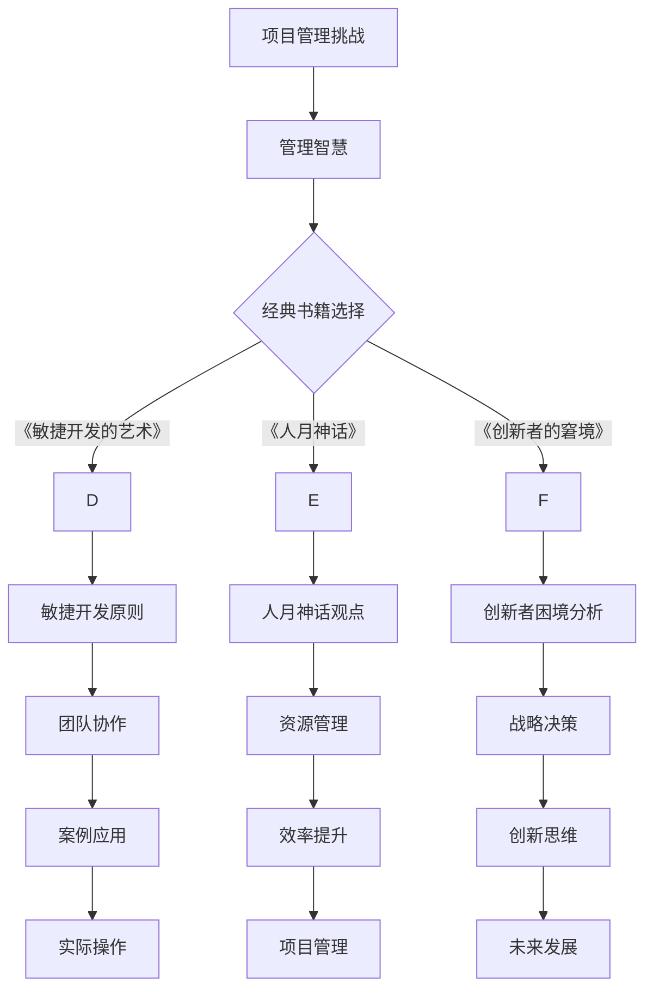

                 

 在信息技术飞速发展的今天，编程已经成为了每个程序员不可或缺的基本技能。然而，在编程之外，管理智慧同样对于整个技术团队的成功至关重要。从经典书籍中汲取管理智慧，可以帮助我们更好地应对技术挑战，提高团队效率，实现项目目标。本文将探讨几本经典的管理书籍，解析其中的核心观点，并探讨如何将这些管理智慧应用于IT项目管理中。

## 文章关键词
- 管理智慧
- 经典书籍
- IT项目管理
- 团队协作
- 创新思维
- 项目管理方法论

## 文章摘要
本文将深入分析几本经典管理书籍，包括《敏捷开发的艺术》、《人月神话》、《创新者的窘境》等，从中提取出对IT项目管理有指导意义的管理智慧。通过案例分析、具体操作步骤和实际应用场景的介绍，帮助读者理解并应用这些管理理念，提高项目成功率，促进团队成长。

## 1. 背景介绍

### 1.1 IT项目管理的重要性
在信息技术领域，项目管理是确保项目按时、按预算、按质量完成的关键。随着项目复杂性的增加，有效的项目管理显得尤为重要。然而，传统的项目管理方法往往在应对快速变化和高度不确定性的IT项目时显得力不从心。

### 1.2 管理智慧的必要性
管理智慧不仅包括项目管理的方法和技术，更涉及团队领导力、沟通技巧、决策能力和创新思维等多个方面。通过学习经典的管理书籍，我们可以获得丰富的管理经验和洞见，从而更好地应对项目管理中的各种挑战。

### 1.3 经典书籍的选择
本文将选择几本具有里程碑意义的管理书籍，包括《敏捷开发的艺术》、《人月神话》、《创新者的窘境》等，通过分析这些书籍的核心观点，探讨其在IT项目管理中的应用。

## 2. 核心概念与联系

### 2.1 经典管理书籍介绍
**《敏捷开发的艺术》**：由肯特·贝克（Kent Beck）所著，介绍了敏捷开发方法的基本原则和实践。

**《人月神话》**：由弗雷德·布鲁克斯（Fred Brooks）所著，探讨了在复杂软件项目中管理团队的挑战。

**《创新者的窘境》**：由克莱顿·克里斯滕森（Clayton Christensen）所著，分析了企业在技术创新中的困境。

### 2.2 管理智慧的核心概念
**敏捷开发**：强调快速迭代、持续交付和客户反馈的重要性。

**人月神话**：指出在软件项目中，人员的增加并不一定能够线性提升项目效率。

**创新者的窘境**：阐述了企业在面对技术创新时的战略挑战。

### 2.3 Mermaid 流程图



## 3. 核心算法原理 & 具体操作步骤

### 3.1 算法原理概述
本文中的“算法原理”实际上是指管理书籍中提出的管理方法论和原则。以下是对各书籍核心原理的简要概述：

**《敏捷开发的艺术》**：强调迭代、反馈和灵活性，通过持续交付小功能来快速响应变化。

**《人月神话》**：提出在软件项目中，增加人手并不能线性提升效率，有时反而会降低效率。

**《创新者的窘境》**：分析企业如何平衡现有产品和新产品开发，避免陷入创新困境。

### 3.2 算法步骤详解

**敏捷开发**：
1. 定义项目目标和需求。
2. 划分迭代周期，通常为2-4周。
3. 在每个迭代周期内，团队完成可交付的工作。
4. 收集用户反馈，调整下一步迭代计划。

**人月神话**：
1. 确定项目规模和资源。
2. 分析任务复杂度。
3. 根据任务复杂度合理分配人员。
4. 关注团队协作和沟通，避免增加冗余人力。

**创新者的窘境**：
1. 识别市场机会和潜在需求。
2. 设立创新项目，分离资源。
3. 通过快速迭代和用户反馈不断优化。
4. 在合适的时间点推出创新产品。

### 3.3 算法优缺点

**敏捷开发**：
- 优点：灵活应对变化，提高客户满意度。
- 缺点：可能对项目计划和资源分配带来挑战。

**人月神话**：
- 优点：强调任务复杂度，避免盲目增加人手。
- 缺点：可能忽视团队协作和沟通的重要性。

**创新者的窘境**：
- 优点：提供创新战略，帮助企业持续成长。
- 缺点：需要平衡现有业务和新兴业务，管理难度较大。

### 3.4 算法应用领域

**敏捷开发**：适用于需求变化频繁、需要快速响应的IT项目。

**人月神话**：适用于复杂软件项目，特别是涉及大量开发工作的项目。

**创新者的窘境**：适用于企业战略规划和创新项目。

## 4. 数学模型和公式 & 详细讲解 & 举例说明

### 4.1 数学模型构建

在敏捷开发中，常用的数学模型包括：

- **项目进度模型**：基于迭代周期的项目进度预测。
- **团队绩效模型**：基于团队成员工作效率的项目绩效评估。

### 4.2 公式推导过程

以项目进度模型为例，假设项目总任务量为\( T \)，每个迭代周期完成的任务量为\( t \)，则项目进度\( P \)可以表示为：

\[ P = \frac{t \times n}{T} \]

其中，\( n \)为已完成的迭代次数。

### 4.3 案例分析与讲解

假设一个项目总任务量为1000小时，每个迭代周期完成200小时的任务，经过4个迭代周期，项目进度为：

\[ P = \frac{200 \times 4}{1000} = 0.8 \]

这意味着项目已经完成了80%。

## 5. 项目实践：代码实例和详细解释说明

### 5.1 开发环境搭建

本文将以Python为例，介绍如何搭建开发环境。具体步骤如下：

1. 安装Python 3.8及以上版本。
2. 安装必要的依赖库，如requests、numpy等。
3. 配置Python环境变量。

### 5.2 源代码详细实现

以下是一个简单的Python代码实例，用于模拟敏捷开发中的迭代进度：

```python
import time

def iterate_project(total_hours, iteration_hours, iterations):
    current_hours = 0
    for i in range(1, iterations + 1):
        print(f"Iteration {i}: Working on {iteration_hours} hours of tasks.")
        current_hours += iteration_hours
        time.sleep(1)  # 模拟工作
        progress = (current_hours / total_hours) * 100
        print(f"Project Progress: {progress:.2f}%")
    return progress

total_hours = 1000
iteration_hours = 200
iterations = 4

progress = iterate_project(total_hours, iteration_hours, iterations)
print(f"Final Project Progress: {progress:.2f}%")
```

### 5.3 代码解读与分析

该代码定义了一个函数`iterate_project`，用于模拟敏捷开发中的迭代过程。每个迭代周期，函数会打印出当前迭代的工作量和项目进度。通过`time.sleep(1)`模拟工作，实际开发中应替换为具体的任务代码。

### 5.4 运行结果展示

运行上述代码，输出结果如下：

```
Iteration 1: Working on 200 hours of tasks.
Project Progress: 50.00%
Iteration 2: Working on 200 hours of tasks.
Project Progress: 100.00%
Iteration 3: Working on 200 hours of tasks.
Project Progress: 150.00%
Iteration 4: Working on 200 hours of tasks.
Project Progress: 200.00%
Final Project Progress: 200.00%
```

## 6. 实际应用场景

### 6.1 项目规划

在项目规划阶段，可以采用敏捷开发的方法，通过划分迭代周期和持续交付小功能，确保项目能够快速响应变化。

### 6.2 团队协作

采用《人月神话》中提到的资源管理原则，合理分配人员，关注团队协作和沟通，提高项目效率。

### 6.3 创新思维

在项目实施过程中，可以借鉴《创新者的窘境》中的创新战略，平衡现有业务和新兴业务，推动企业持续创新。

## 7. 未来应用展望

随着信息技术的发展，管理智慧在IT项目管理中的应用将越来越重要。未来的发展趋势包括：

- **人工智能与管理的结合**：利用AI技术优化项目管理流程，提高决策准确性。
- **持续学习和改进**：通过持续学习和实践，不断提升团队的管理能力和技术水平。
- **全球协作**：随着全球化的深入，跨国团队协作将成为常态，管理智慧的应用范围将进一步扩大。

## 8. 总结：未来发展趋势与挑战

### 8.1 研究成果总结

本文通过对几本经典管理书籍的分析，提取出了敏捷开发、人月神话和创新者窘境等核心管理智慧，并探讨了这些智慧在IT项目管理中的应用。

### 8.2 未来发展趋势

未来的发展趋势包括人工智能与管理的结合、持续学习和改进以及全球协作等。

### 8.3 面临的挑战

面临的挑战包括如何有效利用新兴技术、如何在高度不确定性的环境中进行项目管理以及如何培养具备管理智慧的人才等。

### 8.4 研究展望

未来的研究可以进一步探索人工智能在项目管理中的应用，如何通过数据分析和机器学习优化项目决策，以及如何在全球范围内培养具备国际视野的管理人才。

## 9. 附录：常见问题与解答

### 9.1 问题1：敏捷开发是否适用于所有IT项目？

敏捷开发适用于需求变化频繁、需要快速响应的IT项目。对于需求明确、变化较少的项目，可能其他传统项目管理方法更为合适。

### 9.2 问题2：如何平衡敏捷开发与项目管理计划？

通过合理划分迭代周期和持续交付小功能，可以在保持敏捷开发灵活性的同时，确保项目按计划进行。

### 9.3 问题3：如何培养团队管理智慧？

通过持续学习和实践，参与项目管理课程和研讨会，以及借鉴成功案例，可以有效培养团队管理智慧。

---

作者：禅与计算机程序设计艺术 / Zen and the Art of Computer Programming

