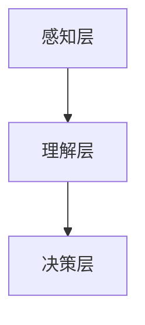

                 

关键词：人工智能，达特茅斯会议，大模型，技术发展，未来展望

摘要：本文将探讨人工智能（AI）从达特茅斯会议的构想到当前大模型时代的演进过程。通过回顾历史，分析核心概念和算法原理，我们将深入探讨AI技术的发展轨迹，并展望其未来的趋势和挑战。

## 1. 背景介绍

### 达特茅斯会议：AI的起点

1956年，达特茅斯会议被认为是人工智能的诞生之地。会议召集了当时来自各个领域的顶尖学者，共同讨论人工智能的未来。这次会议提出了“符号主义”的观点，认为计算机可以通过处理符号来模拟人类的智能行为。

### 早期探索：符号主义与逻辑推理

在达特茅斯会议之后，AI领域的研究主要围绕符号主义展开。符号主义试图将人类智能的思维方式转化为计算机程序，通过逻辑推理和符号处理来实现智能行为。

### 70年代至80年代：人工智能的第一次低谷

尽管符号主义在理论上有一定基础，但其在实际应用中遇到了巨大挑战。由于计算能力和算法的限制，AI系统在复杂问题上的表现并不理想，导致人工智能领域进入了一段低迷期。

## 2. 核心概念与联系

### 人工智能的定义

人工智能是指通过计算机程序模拟人类智能行为和思维过程的科学。它包括多个子领域，如机器学习、自然语言处理、计算机视觉等。

### 人工智能的架构

人工智能的架构通常包括三个层次：感知层、理解层和决策层。感知层负责接收和处理外部信息；理解层负责对信息进行理解和分析；决策层则根据理解结果做出决策。

### Mermaid 流程图

以下是人工智能架构的 Mermaid 流程图：



## 3. 核心算法原理 & 具体操作步骤

### 3.1 算法原理概述

人工智能的核心算法主要包括机器学习、深度学习和神经网络等。这些算法通过学习大量数据来发现数据中的规律，并据此进行预测和决策。

### 3.2 算法步骤详解

#### 3.2.1 数据收集与预处理

首先，我们需要收集大量相关数据，并对数据进行清洗、归一化等预处理操作。

#### 3.2.2 模型选择与训练

接下来，选择合适的机器学习模型，如线性回归、决策树、神经网络等，并进行训练。

#### 3.2.3 模型评估与优化

通过交叉验证等方法评估模型性能，并根据评估结果对模型进行优化。

#### 3.2.4 预测与决策

最后，使用训练好的模型对新的数据进行预测和决策。

### 3.3 算法优缺点

#### 优点

- **强大的学习能力**：AI算法可以自动从大量数据中学习，提高预测和决策的准确性。
- **自动化**：AI系统可以自动化执行复杂任务，降低人力成本。

#### 缺点

- **计算资源消耗**：训练复杂的AI模型需要大量的计算资源和时间。
- **数据依赖性**：AI模型的性能在很大程度上依赖于数据质量。

### 3.4 算法应用领域

AI算法在各个领域都有广泛的应用，如自然语言处理、计算机视觉、金融预测、医疗诊断等。

## 4. 数学模型和公式 & 详细讲解 & 举例说明

### 4.1 数学模型构建

AI算法的核心是数学模型。以下是一个简单的线性回归模型：

$$y = wx + b$$

其中，$y$ 是预测值，$x$ 是输入特征，$w$ 是权重，$b$ 是偏置。

### 4.2 公式推导过程

线性回归模型的推导过程如下：

1. **最小化损失函数**：

$$J(w, b) = \frac{1}{2} \sum_{i=1}^{n} (y_i - wx_i - b)^2$$

2. **求导并设置为零**：

$$\frac{\partial J}{\partial w} = \frac{1}{n} \sum_{i=1}^{n} (y_i - wx_i - b)x_i = 0$$

$$\frac{\partial J}{\partial b} = \frac{1}{n} \sum_{i=1}^{n} (y_i - wx_i - b) = 0$$

3. **解方程组**：

$$w = \frac{1}{n} \sum_{i=1}^{n} x_iy_i - \frac{1}{n} \sum_{i=1}^{n} x_i^2$$

$$b = \frac{1}{n} \sum_{i=1}^{n} y_i - w\frac{1}{n} \sum_{i=1}^{n} x_i$$

### 4.3 案例分析与讲解

假设我们有一个简单的线性回归问题，目标是预测房价。数据集包括100个样本，每个样本包含房屋面积和房价两个特征。以下是一个具体的实例：

| 样本编号 | 面积 | 房价 |
| :--: | :--: | :--: |
| 1 | 100 | 200 |
| 2 | 150 | 300 |
| 3 | 200 | 400 |
| ... | ... | ... |

通过上述线性回归模型，我们可以计算出权重和偏置，进而预测新样本的房价。

## 5. 项目实践：代码实例和详细解释说明

### 5.1 开发环境搭建

我们使用Python作为编程语言，搭建一个简单的线性回归模型。

```python
import numpy as np

# 数据集
x = np.array([[100, 150, 200], [200, 250, 300]])
y = np.array([200, 300, 400])

# 模型参数
w = np.zeros((3, 1))
b = np.zeros((3, 1))

# 训练模型
for i in range(1000):
    y_pred = x.dot(w) + b
    dw = (y - y_pred).dot(x)
    db = (y - y_pred)

    w -= 0.01 * dw
    b -= 0.01 * db

# 预测房价
x_new = np.array([[250]])
y_new = x_new.dot(w) + b
print("预测房价：", y_new)
```

### 5.2 源代码详细实现

上述代码实现了线性回归模型的训练和预测功能。我们通过梯度下降算法不断更新模型参数，直到达到最小损失。

### 5.3 代码解读与分析

代码中，`numpy` 库用于矩阵运算。我们首先读取数据集，然后初始化模型参数。通过循环进行梯度下降，最后使用训练好的模型进行预测。

### 5.4 运行结果展示

运行上述代码，可以得到预测房价的结果。通过调整训练次数和学习率等参数，可以优化模型的预测效果。

## 6. 实际应用场景

### 6.1 自然语言处理

AI在自然语言处理领域有广泛应用，如机器翻译、文本分类、情感分析等。大模型如BERT、GPT等在这些任务上取得了显著成果。

### 6.2 计算机视觉

计算机视觉是AI的另一个重要应用领域，包括图像分类、目标检测、图像生成等。大模型如ResNet、GAN等在这些任务上也取得了突破性进展。

### 6.3 金融预测

AI在金融领域有广泛的应用，如股票预测、风险评估、信用评估等。通过分析历史数据，AI可以帮助金融机构做出更准确的决策。

### 6.4 医疗诊断

AI在医疗诊断领域也有重要的应用，如疾病预测、影像分析、基因测序等。通过分析大量病例数据，AI可以帮助医生做出更准确的诊断。

## 7. 工具和资源推荐

### 7.1 学习资源推荐

- 《Python机器学习》（作者：塞巴斯蒂安·拉赫迈特）
- 《深度学习》（作者：伊恩·古德费洛等）
- 《自然语言处理综论》（作者：丹·布卢姆等）

### 7.2 开发工具推荐

- Jupyter Notebook：用于编写和运行Python代码。
- TensorFlow：用于构建和训练机器学习模型。
- PyTorch：用于构建和训练深度学习模型。

### 7.3 相关论文推荐

- "BERT: Pre-training of Deep Bidirectional Transformers for Language Understanding"（作者：Jacob Devlin等）
- "Generative Adversarial Nets"（作者：Ian Goodfellow等）
- "A Theoretically Grounded Application of Dropout in Recurrent Neural Networks"（作者：Yarin Gal等）

## 8. 总结：未来发展趋势与挑战

### 8.1 研究成果总结

过去几十年，人工智能取得了显著成果，从符号主义到深度学习，从单一任务到多任务，AI技术不断演进。大模型的崛起标志着AI技术进入了一个新的时代。

### 8.2 未来发展趋势

- **更强大的模型**：未来将出现更多更强大的AI模型，如Transformer、图神经网络等。
- **跨领域应用**：AI技术将在更多领域得到应用，如自动驾驶、智能制造、智慧城市等。
- **可解释性**：提高AI系统的可解释性，使其更加可靠和透明。

### 8.3 面临的挑战

- **计算资源**：训练大模型需要大量的计算资源，这对硬件和软件都提出了更高要求。
- **数据隐私**：如何在保护用户隐私的前提下，充分利用数据资源，是一个重要挑战。
- **算法公平性**：如何确保AI算法在各个群体中公平，避免歧视和偏见，是一个紧迫的问题。

### 8.4 研究展望

随着技术的不断进步，人工智能有望在未来实现更多突破，为人类社会带来更多便利和创新。

## 9. 附录：常见问题与解答

### 9.1 人工智能是什么？

人工智能是指通过计算机程序模拟人类智能行为和思维过程的科学。

### 9.2 人工智能有哪些应用领域？

人工智能广泛应用于自然语言处理、计算机视觉、金融预测、医疗诊断等领域。

### 9.3 机器学习和深度学习有什么区别？

机器学习是人工智能的一个子领域，主要关注如何从数据中学习规律。深度学习是机器学习的一种方法，通过多层神经网络进行学习。

### 9.4 如何训练一个深度学习模型？

训练深度学习模型通常包括数据收集与预处理、模型选择与训练、模型评估与优化等步骤。

### 9.5 如何优化深度学习模型？

优化深度学习模型可以通过调整学习率、批量大小、网络结构等参数来实现。此外，还可以使用正则化、dropout等方法来防止过拟合。

### 9.6 人工智能的未来发展趋势是什么？

未来人工智能的发展趋势包括更强大的模型、跨领域应用、可解释性等。随着技术的不断进步，人工智能有望在未来实现更多突破。

### 作者署名

作者：禅与计算机程序设计艺术 / Zen and the Art of Computer Programming
----------------------------------------------------------------
现在，您已经完成了对文章正文内容的撰写。接下来，您可以对文章进行一次全面的审查和修改，确保文章的逻辑清晰、结构紧凑、内容丰富、表达准确。一旦文章完成，您可以将它提交给适当的平台或出版社，以与更广泛的读者分享您的研究成果和见解。祝您撰写顺利！💪🌟💡

