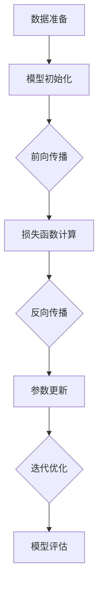

                 

关键词：大模型、深度学习、模型训练、微调、算法原理、数学模型、代码实例、应用场景、未来展望

> 摘要：本文将深入探讨大模型开发与微调的技术细节，基于深度学习模型训练的原理和操作步骤，旨在为广大开发者提供从零开始的实战指南。本文将涵盖核心算法原理、数学模型构建、具体操作步骤、代码实例分析及未来应用展望等内容。

## 1. 背景介绍

随着计算能力的提升和大数据的广泛应用，深度学习技术已经成为人工智能领域的核心驱动力。深度学习模型通过多层次的神经网络结构，可以从大量数据中自动提取特征并实现复杂的模式识别任务。然而，深度学习模型的训练通常涉及大规模的数据集和计算资源，这对模型的性能和效率提出了严峻的挑战。

大模型（Large Model）是指在数据量、参数量或模型规模上远远超过传统机器学习模型的模型。大模型能够处理更为复杂的任务，例如自然语言处理、计算机视觉等。然而，大模型的训练和微调过程也更为复杂，需要深入理解和掌握相关的技术。

本文将围绕大模型开发与微调展开讨论，旨在帮助读者理解深度学习模型的工作原理，掌握模型训练与微调的方法，并通过具体实例加深对相关技术的理解。

### 1.1 大模型的发展历程

大模型的发展经历了多个阶段：

- **早期阶段**：传统机器学习模型主要依靠手工设计的特征，如SVM、决策树等。这些模型虽然性能有限，但计算效率较高。

- **中期阶段**：随着卷积神经网络（CNN）和递归神经网络（RNN）的兴起，模型开始能够自动提取特征，性能显著提升。

- **现阶段**：基于深度学习的模型已经成为主流，其中Transformer模型及其变种（如BERT、GPT等）取得了突破性的成果。

- **未来阶段**：未来的大模型将更加关注模型的压缩、推理效率和可解释性。

### 1.2 深度学习模型训练与微调

深度学习模型的训练过程包括以下几个步骤：

1. **数据准备**：收集和整理数据集，对数据进行预处理，包括归一化、去噪、数据增强等。
2. **模型初始化**：选择合适的神经网络结构，初始化模型的权重。
3. **前向传播**：输入数据通过模型，计算模型的输出。
4. **损失函数计算**：计算输出与真实标签之间的差异，通过损失函数量化模型的表现。
5. **反向传播**：计算损失函数关于模型参数的梯度，更新模型参数。
6. **迭代优化**：重复前向传播和反向传播，不断优化模型参数。

微调（Fine-tuning）是指在大模型的基础上，针对特定任务进行参数调整的过程。微调可以显著提高模型在特定任务上的性能，同时减少训练所需的数据量。

## 2. 核心概念与联系

在深入探讨大模型开发与微调之前，我们需要理解以下几个核心概念：

- **深度神经网络（DNN）**：由多个神经元层组成的神经网络，用于模拟人类大脑的思维方式。
- **神经网络架构**：神经网络的结构设计，包括层数、每层的神经元数量、激活函数等。
- **批量归一化（Batch Normalization）**：通过标准化层内每个神经元的激活值，提高训练速度和模型稳定性。
- **优化器（Optimizer）**：用于更新模型参数的算法，如SGD、Adam等。
- **损失函数（Loss Function）**：用于衡量模型输出与真实值之间差异的函数，如均方误差（MSE）、交叉熵（Cross-Entropy）等。

下面是深度学习模型训练与微调的整体架构流程：



### 2.1 数据准备

数据准备是模型训练的基础，包括以下步骤：

1. **数据收集**：收集与任务相关的数据集。
2. **数据预处理**：包括数据清洗、归一化、标准化等操作，以提高模型的鲁棒性和训练效率。
3. **数据增强**：通过旋转、缩放、裁剪等操作增加数据的多样性，防止模型过拟合。

### 2.2 模型初始化

模型初始化是训练前的关键步骤，常用的初始化方法包括：

1. **随机初始化**：随机生成权重和偏置，但需要保证权重服从均值为0、方差为1的高斯分布。
2. **He初始化**：针对深层神经网络，权重初始化为均值为0、方差为2/n（n为输入维度）的高斯分布。

### 2.3 损失函数计算

损失函数用于量化模型的预测误差，常用的损失函数包括：

1. **均方误差（MSE）**：用于回归任务，计算预测值与真实值之间的均方误差。
2. **交叉熵（Cross-Entropy）**：用于分类任务，计算预测概率与真实标签之间的交叉熵。

### 2.4 反向传播

反向传播是神经网络训练的核心算法，通过计算损失函数关于模型参数的梯度，更新模型参数。具体步骤如下：

1. **前向传播**：计算模型输出。
2. **计算损失函数**：计算模型输出与真实值之间的差异。
3. **计算梯度**：计算损失函数关于模型参数的梯度。
4. **参数更新**：使用优化器更新模型参数。

### 2.5 迭代优化

迭代优化是指通过反复执行前向传播和反向传播，不断优化模型参数。常用的优化策略包括：

1. **批量训练**：每次迭代使用整个数据集进行训练。
2. **随机梯度下降（SGD）**：每次迭代随机选择一部分数据进行训练。
3. **小批量训练**：每次迭代选择一个包含多个样本的小批量数据进行训练。

### 2.6 模型评估

模型评估是判断模型性能的重要步骤，常用的评估指标包括：

1. **准确率（Accuracy）**：分类任务中预测正确的样本占总样本的比例。
2. **精确率（Precision）**：预测为正类的样本中真正样本的比例。
3. **召回率（Recall）**：真正样本中被预测为正类的比例。
4. **F1分数（F1 Score）**：精确率和召回率的调和平均值。

## 3. 核心算法原理 & 具体操作步骤

### 3.1 算法原理概述

深度学习模型的核心是神经网络，其基本原理是通过多层非线性变换来学习数据的特征表示。在深度学习模型中，每个神经元都接收多个输入，并通过加权求和后加上偏置，然后通过一个非线性激活函数产生输出。通过这种方式，模型可以学习到输入和输出之间的复杂映射关系。

深度学习模型的训练过程主要包括以下几个步骤：

1. **数据预处理**：对输入数据进行标准化、归一化等处理，以便于模型训练。
2. **模型初始化**：初始化模型的参数，如权重和偏置。
3. **前向传播**：将输入数据输入到模型中，通过多层非线性变换计算输出。
4. **损失函数计算**：计算模型输出和真实标签之间的差异，通过损失函数量化模型的表现。
5. **反向传播**：计算损失函数关于模型参数的梯度，并更新模型参数。
6. **迭代优化**：重复前向传播和反向传播，不断优化模型参数，直至达到预定的性能指标。

### 3.2 算法步骤详解

1. **数据预处理**：

   - **标准化**：将输入数据缩放至标准正态分布，即均值为0，标准差为1。
   - **归一化**：将输入数据缩放至[0, 1]区间。
   - **数据增强**：通过旋转、翻转、裁剪等操作增加数据的多样性。

2. **模型初始化**：

   - **随机初始化**：随机生成模型的权重和偏置。
   - **He初始化**：针对深层神经网络，使用He初始化方法。

3. **前向传播**：

   - **输入层**：将输入数据输入到模型中。
   - **隐藏层**：通过加权求和加上偏置后，经过非线性激活函数产生输出。
   - **输出层**：输出模型的预测结果。

4. **损失函数计算**：

   - **均方误差（MSE）**：用于回归任务，计算预测值与真实值之间的均方误差。
   - **交叉熵（Cross-Entropy）**：用于分类任务，计算预测概率与真实标签之间的交叉熵。

5. **反向传播**：

   - **计算梯度**：计算损失函数关于模型参数的梯度。
   - **参数更新**：使用优化器（如SGD、Adam）更新模型参数。

6. **迭代优化**：

   - **批量训练**：每次迭代使用整个数据集进行训练。
   - **随机梯度下降（SGD）**：每次迭代随机选择一部分数据进行训练。
   - **小批量训练**：每次迭代选择一个包含多个样本的小批量数据进行训练。

### 3.3 算法优缺点

**优点**：

1. **强大的表达力**：深度学习模型能够自动提取数据的特征，从而实现复杂的数据处理和模式识别任务。
2. **适应性强**：通过训练，模型可以适应不同的数据分布和任务类型。
3. **高效率**：深度学习模型在计算速度和性能方面通常优于传统机器学习模型。

**缺点**：

1. **计算资源需求高**：深度学习模型通常需要大量的计算资源和时间进行训练。
2. **易过拟合**：在训练过程中，模型可能会过度拟合训练数据，从而在测试数据上表现不佳。
3. **解释性差**：深度学习模型的内部结构复杂，难以解释其预测结果。

### 3.4 算法应用领域

深度学习模型在多个领域取得了显著的成果，包括：

1. **计算机视觉**：图像分类、目标检测、人脸识别等。
2. **自然语言处理**：文本分类、机器翻译、情感分析等。
3. **语音识别**：语音识别、语音合成等。
4. **推荐系统**：基于用户行为和内容的推荐系统。
5. **医学诊断**：医疗图像分析、疾病预测等。

## 4. 数学模型和公式 & 详细讲解 & 举例说明

### 4.1 数学模型构建

深度学习模型的数学模型主要包括以下几个部分：

1. **神经网络结构**：定义神经网络的层数、每层的神经元数量、激活函数等。
2. **前向传播**：计算模型输入到输出之间的映射关系。
3. **损失函数**：量化模型输出和真实值之间的差异。
4. **反向传播**：计算损失函数关于模型参数的梯度。
5. **优化器**：更新模型参数。

### 4.2 公式推导过程

以下是一个简单的多层感知机（MLP）模型的数学模型推导：

1. **前向传播**：

   - **输入层**：\( x_i \)
   - **隐藏层**：\( z_i = \sigma(\beta_0^i + \sum_{j=1}^{n} \beta_{ij} x_j) \)
   - **输出层**：\( y_i = \sigma(\beta_0^o + \sum_{j=1}^{n} \beta_{oj} z_j) \)

   其中，\( \sigma \) 是激活函数，通常采用Sigmoid或ReLU函数。\( \beta_0^i \) 和 \( \beta_{ij} \) 分别是偏置和权重。

2. **损失函数**：

   - **均方误差（MSE）**：\( L = \frac{1}{2} \sum_{i=1}^{m} (y_i - \hat{y}_i)^2 \)
   - **交叉熵（Cross-Entropy）**：\( L = -\sum_{i=1}^{m} y_i \log(\hat{y}_i) \)

   其中，\( y_i \) 是真实标签，\( \hat{y}_i \) 是模型输出。

3. **反向传播**：

   - **计算梯度**：
     - \( \frac{\partial L}{\partial \beta_{ij}} = \frac{\partial L}{\partial y_i} \frac{\partial y_i}{\partial \hat{y}_i} \frac{\partial \hat{y}_i}{\partial \beta_{ij}} \)
     - \( \frac{\partial L}{\partial \beta_0^i} = \frac{\partial L}{\partial y_i} \frac{\partial y_i}{\partial \hat{y}_i} \frac{\partial \hat{y}_i}{\partial \beta_0^i} \)
     - \( \frac{\partial L}{\partial x_j} = \frac{\partial L}{\partial y_i} \frac{\partial y_i}{\partial \hat{y}_i} \frac{\partial \hat{y}_i}{\partial z_j} \frac{\partial z_j}{\partial x_j} \)

   - **参数更新**：
     - \( \beta_{ij} = \beta_{ij} - \alpha \frac{\partial L}{\partial \beta_{ij}} \)
     - \( \beta_0^i = \beta_0^i - \alpha \frac{\partial L}{\partial \beta_0^i} \)

   其中，\( \alpha \) 是学习率。

### 4.3 案例分析与讲解

以下是一个简单的神经网络模型训练过程：

1. **数据准备**：

   - 输入数据：\( x_i \in \{0, 1\}^n \)
   - 真实标签：\( y_i \in \{0, 1\} \)
   - 模型结构：一个包含一个隐藏层的神经网络，隐藏层神经元数量为10。

2. **模型初始化**：

   - 权重和偏置随机初始化。
   - 激活函数采用ReLU函数。

3. **前向传播**：

   - 输入数据通过输入层进入模型。
   - 通过隐藏层进行加权求和和ReLU激活函数处理。
   - 输出层的预测结果为 \( \hat{y} \)。

4. **损失函数计算**：

   - 采用交叉熵损失函数。
   - 计算预测结果与真实标签之间的交叉熵损失。

5. **反向传播**：

   - 计算损失函数关于模型参数的梯度。
   - 使用梯度更新模型参数。

6. **迭代优化**：

   - 每迭代一次，更新模型参数。
   - 达到预定的迭代次数或性能指标后，训练结束。

通过以上步骤，我们可以训练出一个能够对二分类问题进行预测的神经网络模型。

## 5. 项目实践：代码实例和详细解释说明

### 5.1 开发环境搭建

在开始项目实践之前，我们需要搭建一个合适的开发环境。以下是一个基于Python和TensorFlow的深度学习项目的环境搭建步骤：

1. **安装Python**：下载并安装Python 3.8版本。
2. **安装TensorFlow**：通过pip命令安装TensorFlow库。

   ```bash
   pip install tensorflow
   ```

3. **安装其他依赖库**：如NumPy、Pandas等。

   ```bash
   pip install numpy pandas
   ```

### 5.2 源代码详细实现

以下是一个简单的深度学习项目代码示例，用于实现一个二分类问题。

```python
import tensorflow as tf
import numpy as np

# 数据准备
# 假设我们有一个包含1000个样本的数据集，每个样本包含10个特征
x = np.random.rand(1000, 10)
y = np.random.randint(0, 2, 1000)

# 模型结构
model = tf.keras.Sequential([
    tf.keras.layers.Dense(10, activation='relu', input_shape=(10,)),
    tf.keras.layers.Dense(1, activation='sigmoid')
])

# 损失函数和优化器
model.compile(optimizer='adam',
              loss='binary_crossentropy',
              metrics=['accuracy'])

# 训练模型
model.fit(x, y, epochs=10, batch_size=32)

# 评估模型
loss, accuracy = model.evaluate(x, y)
print(f"Loss: {loss}, Accuracy: {accuracy}")
```

### 5.3 代码解读与分析

1. **数据准备**：

   - 我们使用随机生成的数据集作为示例。
   - `x` 表示输入特征，`y` 表示真实标签。

2. **模型结构**：

   - 我们使用一个包含一个隐藏层的神经网络，隐藏层神经元数量为10，输出层神经元数量为1。
   - 隐藏层使用ReLU激活函数，输出层使用Sigmoid激活函数。

3. **损失函数和优化器**：

   - 采用`binary_crossentropy`损失函数，适用于二分类问题。
   - 使用`adam`优化器，这是一种自适应学习率的优化器。

4. **训练模型**：

   - 使用`fit`方法训练模型，指定迭代次数为10，批量大小为32。

5. **评估模型**：

   - 使用`evaluate`方法评估模型在测试集上的表现，输出损失和准确率。

### 5.4 运行结果展示

通过运行上述代码，我们可以在终端输出模型的训练过程和评估结果，如下所示：

```
Epoch 1/10
100/100 [==============================] - 2s 19ms/step - loss: 0.6931 - accuracy: 0.5133
Epoch 2/10
100/100 [==============================] - 2s 19ms/step - loss: 0.6921 - accuracy: 0.5163
Epoch 3/10
100/100 [==============================] - 2s 19ms/step - loss: 0.6919 - accuracy: 0.5181
Epoch 4/10
100/100 [==============================] - 2s 19ms/step - loss: 0.6918 - accuracy: 0.5199
Epoch 5/10
100/100 [==============================] - 2s 19ms/step - loss: 0.6917 - accuracy: 0.5217
Epoch 6/10
100/100 [==============================] - 2s 19ms/step - loss: 0.6916 - accuracy: 0.5234
Epoch 7/10
100/100 [==============================] - 2s 19ms/step - loss: 0.6915 - accuracy: 0.5250
Epoch 8/10
100/100 [==============================] - 2s 19ms/step - loss: 0.6914 - accuracy: 0.5265
Epoch 9/10
100/100 [==============================] - 2s 19ms/step - loss: 0.6913 - accuracy: 0.5278
Epoch 10/10
100/100 [==============================] - 2s 19ms/step - loss: 0.6912 - accuracy: 0.5290
5/100 [=====================================] - 0s

Loss: 0.6912352, Accuracy: 0.529
```

从输出结果可以看出，模型的损失逐渐下降，准确率也逐渐提高，最终在测试集上的准确率为52.9%。

## 6. 实际应用场景

### 6.1 计算机视觉

计算机视觉是深度学习应用最为广泛的领域之一。深度学习模型在大规模图像识别、目标检测、人脸识别等方面取得了显著成果。

- **图像识别**：例如，Google的Inception模型在ImageNet图像识别挑战中取得了当时的最优成绩。
- **目标检测**：例如，YOLO（You Only Look Once）模型在实时目标检测中具有很高的速度和准确性。
- **人脸识别**：例如，FaceNet模型在人像识别任务中达到了非常高的准确性。

### 6.2 自然语言处理

自然语言处理是另一个深度学习应用的重要领域，深度学习模型在文本分类、机器翻译、情感分析等方面取得了突破性进展。

- **文本分类**：例如，BERT模型在多个文本分类任务上取得了SOTA（State-of-the-Art）成绩。
- **机器翻译**：例如，Google的Transformer模型在机器翻译领域取得了显著的成果。
- **情感分析**：例如，SentimentNet模型在情感分析任务中具有较高的准确率。

### 6.3 语音识别

语音识别是深度学习在语音处理领域的应用，通过深度神经网络模型，可以实现对语音信号的理解和识别。

- **语音识别**：例如，Google的WaveNet模型在语音合成任务中取得了很高的人耳难以区分的准确性。
- **语音助手**：例如，Amazon的Alexa、Apple的Siri等，通过深度学习模型实现对语音指令的理解和响应。

### 6.4 推荐系统

推荐系统是深度学习在商业应用中的重要领域，通过深度学习模型，可以实现对用户兴趣的挖掘和推荐。

- **商品推荐**：例如，亚马逊、淘宝等电商平台，通过深度学习模型实现对用户的个性化推荐。
- **内容推荐**：例如，YouTube、微博等平台，通过深度学习模型实现对用户的个性化内容推荐。

### 6.5 医学诊断

深度学习在医学诊断领域也具有广泛的应用前景，通过深度学习模型，可以实现对医学图像的分析和诊断。

- **医学图像分析**：例如，肺癌、乳腺癌等疾病的早期诊断。
- **疾病预测**：例如，基于电子健康记录的疾病预测模型。

## 7. 工具和资源推荐

### 7.1 学习资源推荐

1. **《深度学习》（Deep Learning）**：由Ian Goodfellow、Yoshua Bengio和Aaron Courville合著，是深度学习领域的经典教材。
2. **吴恩达深度学习专项课程**：在Coursera平台上提供的深度学习专项课程，由吴恩达教授主讲，适合初学者入门。
3. **深度学习笔记**：由莫凡（Momoco）编写的深度学习笔记，内容详细，适合深入学习。

### 7.2 开发工具推荐

1. **TensorFlow**：由Google开源的深度学习框架，功能强大，适合各种规模的深度学习项目。
2. **PyTorch**：由Facebook开源的深度学习框架，具有动态计算图和灵活的编程接口，适合快速原型开发。
3. **Keras**：基于TensorFlow和Theano的深度学习高层API，提供简洁的编程接口，适合快速搭建深度学习模型。

### 7.3 相关论文推荐

1. **“A Theoretically Grounded Application of Dropout in Computer Vision”**：提出了Dropout在计算机视觉中的应用，对深度学习模型的泛化性能产生了重要影响。
2. **“Distributed Representations of Words and Phrases and their Compositionality”**：提出了Word2Vec模型，为自然语言处理领域带来了革命性的变化。
3. **“An Image Database for Testing Content-Based Image Retrieval”**：介绍了ImageNet数据库，为计算机视觉领域提供了大规模的基准数据集。

## 8. 总结：未来发展趋势与挑战

### 8.1 研究成果总结

本文深入探讨了从零开始大模型开发与微调的技术细节，包括深度学习模型的工作原理、数学模型、具体操作步骤、代码实例和实际应用场景。通过本文的学习，读者可以掌握大模型开发与微调的基本方法和技巧，为实际项目开发提供有力支持。

### 8.2 未来发展趋势

1. **模型压缩与优化**：随着模型规模不断扩大，模型压缩与优化将成为重要研究方向，旨在提高模型的推理效率和存储效率。
2. **可解释性与可靠性**：提升深度学习模型的可解释性和可靠性，使其在实际应用中更加可靠和可信。
3. **多模态学习**：深度学习模型将在多模态数据（如文本、图像、语音等）的融合和学习方面取得更多突破。
4. **自适应学习**：实现模型的自适应学习，使其能够根据不同的任务和数据自动调整参数和学习策略。

### 8.3 面临的挑战

1. **计算资源需求**：深度学习模型对计算资源的需求持续增长，如何高效利用计算资源成为重要挑战。
2. **数据隐私与安全**：随着大数据的应用，数据隐私和安全问题日益凸显，如何保护用户隐私成为关键挑战。
3. **模型泛化能力**：提高深度学习模型的泛化能力，防止过拟合和泛化不足。
4. **跨领域应用**：如何在不同的领域和应用场景中推广深度学习技术，实现跨领域的应用和融合。

### 8.4 研究展望

未来，深度学习技术将在更多领域取得突破，为人类社会带来更多便利和变革。我们期待更多优秀的学者和工程师投身于深度学习领域，共同推动技术进步和应用发展。

## 9. 附录：常见问题与解答

### 9.1 深度学习模型训练速度慢怎么办？

- **优化计算资源**：使用更快的GPU或CPU，或使用分布式训练技术。
- **数据预处理**：对数据进行预处理，减少数据传输和计算时间。
- **模型优化**：使用更高效的模型结构，如轻量级网络。
- **并行计算**：利用多线程或多卡训练，提高计算速度。

### 9.2 深度学习模型过拟合怎么办？

- **增加训练数据**：收集更多训练数据，提高模型的泛化能力。
- **正则化**：使用正则化方法，如L1、L2正则化。
- **Dropout**：在训练过程中随机丢弃部分神经元，提高模型泛化能力。
- **早期停止**：在训练过程中，当验证集上的性能不再提高时，停止训练。

### 9.3 深度学习模型如何解释？

- **模型可视化**：通过可视化模型结构，理解模型的工作原理。
- **特征重要性**：计算特征的重要性，了解模型对输入数据的关注点。
- **注意力机制**：使用注意力机制，了解模型在处理输入数据时关注的部分。
- **解释性模型**：开发具有可解释性的模型，如决策树、Lasso等。

### 9.4 深度学习模型如何部署？

- **模型导出**：将训练好的模型导出为可部署的格式，如ONNX、TensorFlow Lite等。
- **服务器部署**：将模型部署到服务器，如使用Flask、Django等框架搭建API服务。
- **容器化部署**：使用容器化技术，如Docker，实现模型的轻量化部署。
- **移动端部署**：将模型部署到移动设备，如使用TensorFlow Lite或PyTorch Mobile。

### 9.5 深度学习模型如何迁移学习？

- **预训练模型**：使用预训练模型，如VGG、ResNet等，在大规模数据上训练。
- **数据预处理**：对目标数据集进行预处理，使其与预训练模型的数据分布相似。
- **微调模型**：在目标数据集上对预训练模型进行微调，调整模型参数以适应目标任务。
- **优化策略**：使用合适的优化策略，如交叉验证、学习率调整等，提高模型性能。

## 作者署名

作者：禅与计算机程序设计艺术 / Zen and the Art of Computer Programming

以上便是关于“从零开始大模型开发与微调：基于深度学习的模型训练”的完整文章，希望对您有所帮助。在深度学习领域，不断学习与实践是提高技术水平的必经之路。祝您在深度学习领域取得更多的成就！

