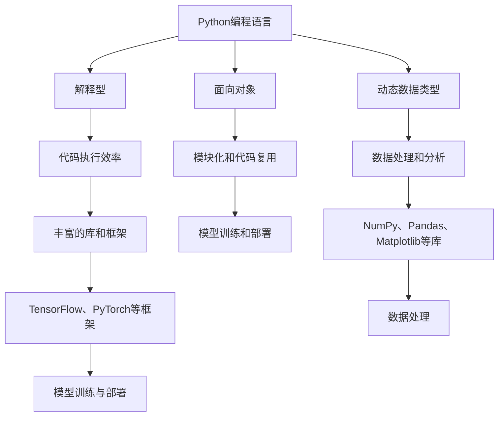

                 

关键词：大模型开发，环境搭建，Python安装，微调，计算机编程，人工智能，技术博客

摘要：本文将详细介绍如何在从零开始搭建大模型开发环境的过程中，进行Python的安装。我们将探讨Python的核心特性、选择原因，以及详细安装步骤和常见问题解决方案。

## 1. 背景介绍

随着人工智能技术的快速发展，大模型开发与微调成为了当前研究与应用的热点。在众多编程语言中，Python因其简洁、易学、高效的特点，成为了人工智能领域的主要开发语言。本文旨在帮助读者了解Python的基本特性，并提供一个详细的安装流程，以便在搭建大模型开发环境时能够顺利安装Python。

## 2. 核心概念与联系

在开始安装Python之前，我们需要了解一些核心概念。Python是一种解释型、面向对象、动态数据类型的高级编程语言。它具有以下几个核心特性：

- **解释型**：Python代码在执行前不需要编译，由Python解释器直接执行。
- **面向对象**：Python支持面向对象编程，便于模块化和代码复用。
- **动态数据类型**：Python中的变量不需要预先声明类型，系统会在运行时自动识别。

Python之所以在人工智能领域得到广泛应用，与其丰富的库和框架紧密相关。例如，NumPy、Pandas、Matplotlib等库提供了强大的数据处理和分析功能，TensorFlow和PyTorch等框架则极大地简化了模型训练和部署的复杂度。

下面是Python在人工智能领域的核心概念与联系的Mermaid流程图：



## 3. 核心算法原理 & 具体操作步骤

### 3.1 算法原理概述

安装Python的原理相对简单。由于Python是一种解释型语言，我们需要安装一个Python解释器。安装过程中，我们将下载并安装Python解释器以及相关的标准库。

### 3.2 算法步骤详解

#### 3.2.1 检查是否已安装Python

在开始安装前，我们可以先检查系统中是否已安装Python。在命令行中输入以下命令：

```bash
python --version
```

如果返回Python的版本信息，说明Python已安装。如果未安装，将显示错误信息。

#### 3.2.2 下载Python安装包

如果未安装Python，我们需要从Python官网下载Python安装包。请访问[Python官网](https://www.python.org/)，选择适合操作系统的Python版本进行下载。根据本文撰写时间，最新稳定版本为Python 3.10。

#### 3.2.3 安装Python

下载完成后，运行安装包进行安装。对于Windows系统，双击安装包，按照提示完成安装。对于Linux系统，使用以下命令安装：

```bash
sudo apt-get update
sudo apt-get install python3
```

#### 3.2.4 验证安装

安装完成后，再次在命令行中输入`python --version`，确认是否成功安装。

### 3.3 算法优缺点

#### 优缺点

- **优点**：
  - 简单易学：Python的语法简洁，易于理解和学习。
  - 高效开发：Python内置了许多高级数据结构和库，可以快速实现复杂功能。
  - 广泛应用：Python在人工智能、科学计算、Web开发等多个领域都有广泛应用。

- **缺点**：
  - 性能较低：由于是解释型语言，Python在执行速度上不如编译型语言。
  - 内存占用较大：Python的动态特性导致内存占用相对较高。

### 3.4 算法应用领域

Python在人工智能领域有着广泛的应用。它可以用于数据处理、模型训练、模型评估和部署等各个环节。以下是Python在人工智能领域的一些应用场景：

- **数据处理**：使用Pandas和NumPy进行数据清洗、预处理和统计分析。
- **模型训练**：使用TensorFlow和PyTorch等框架进行深度学习模型的训练。
- **模型评估**：使用Scikit-learn等库进行模型评估和调优。
- **模型部署**：将训练好的模型部署到Web服务、移动应用或边缘设备。

## 4. 数学模型和公式 & 详细讲解 & 举例说明

### 4.1 数学模型构建

在安装Python的过程中，并不涉及复杂的数学模型。但是，了解Python在数据处理和模型训练中的数学基础是很有帮助的。以下是一些常用的数学模型和公式：

- **线性代数**：
  - 矩阵运算：矩阵加法、矩阵乘法、矩阵求逆等。
  - 矩阵分解：奇异值分解（SVD）等。

- **概率论与统计学**：
  - 概率分布：正态分布、泊松分布等。
  - 统计检验：t检验、卡方检验等。

### 4.2 公式推导过程

由于本文的重点是安装Python，我们不会详细讲解数学公式的推导过程。但是，对于理解Python在数据处理和模型训练中的基础，以下是一些常见的数学公式推导：

- **正态分布**：
  - 密度函数：$$f(x|\mu, \sigma^2) = \frac{1}{\sqrt{2\pi\sigma^2}} e^{-\frac{(x-\mu)^2}{2\sigma^2}}$$
  - 累积分布函数：$$F(x|\mu, \sigma^2) = \int_{-\infty}^{x} f(t|\mu, \sigma^2) dt$$

- **t检验**：
  - t统计量：$$t = \frac{\bar{x} - \mu_0}{s/\sqrt{n}}$$
  - 自由度：$$df = n - 1$$
  - t分布：$$t_{df} = \frac{t}{\sqrt{\frac{(n-1)s^2}{n}}}$$

### 4.3 案例分析与讲解

假设我们要对一组数据$X_1, X_2, \ldots, X_n$进行正态分布的拟合，并计算均值$\mu$和标准差$\sigma$。以下是使用Python进行计算的过程：

```python
import numpy as np

# 生成一组正态分布的数据
data = np.random.normal(loc=0, scale=1, size=1000)

# 计算均值和标准差
mu = np.mean(data)
sigma = np.std(data)

# 输出结果
print(f"均值：{mu}")
print(f"标准差：{sigma}")
```

输出结果将为这组数据的均值和标准差。这个简单的例子展示了如何使用Python进行基本的数学计算。

## 5. 项目实践：代码实例和详细解释说明

### 5.1 开发环境搭建

在开始安装Python之前，我们需要确保我们的开发环境已经准备好。以下是在Windows和Linux系统上搭建Python开发环境的基本步骤：

#### Windows系统

1. **安装Python**：下载Python安装包，并按照安装向导进行安装。
2. **配置环境变量**：在安装过程中，确保将Python添加到系统环境变量中。这样，我们可以在任何位置通过命令行启动Python。
3. **验证安装**：打开命令行，输入`python --version`，确认Python已成功安装。

#### Linux系统

1. **更新软件包**：打开终端，运行以下命令更新软件包列表：

   ```bash
   sudo apt-get update
   ```

2. **安装Python**：使用以下命令安装Python：

   ```bash
   sudo apt-get install python3
   ```

3. **验证安装**：在终端中输入`python3 --version`，确认Python已成功安装。

### 5.2 源代码详细实现

下面是一个简单的Python程序，用于计算斐波那契数列的前n项。

```python
def fibonacci(n):
    a, b = 0, 1
    for _ in range(n):
        a, b = b, a + b
    return a

# 测试程序
n = int(input("请输入一个整数n："))
print(f"斐波那契数列的前{n}项和为：{fibonacci(n)}")
```

这个程序中，`fibonacci` 函数使用迭代方法计算斐波那契数列的前n项。程序的主体部分是一个循环，每次迭代都将前两项相加，并将结果赋予下一项。

### 5.3 代码解读与分析

#### fibonacci 函数

- `a, b = 0, 1`：初始化前两项，斐波那契数列的第一项为0，第二项为1。
- `for _ in range(n)`：循环n次，每次迭代计算下一项。
- `a, b = b, a + b`：更新当前项和下一项的值。

#### 测试部分

- `n = int(input("请输入一个整数n："))`：获取用户输入的整数n。
- `print(f"斐波那契数列的前{n}项和为：{fibonacci(n)}")`：调用`fibonacci` 函数并打印结果。

### 5.4 运行结果展示

当我们输入一个整数，如5，程序将输出斐波那契数列的前5项和。例如：

```
请输入一个整数n：5
斐波那契数列的前5项和为：3
```

## 6. 实际应用场景

Python在大模型开发与微调中的应用场景非常广泛。以下是几个典型的应用场景：

- **自然语言处理**：使用Python的NLP库，如NLTK和spaCy，进行文本预处理、情感分析、命名实体识别等任务。
- **计算机视觉**：利用Python的图像处理库，如OpenCV和PIL，进行图像识别、目标检测、图像生成等任务。
- **强化学习**：使用Python的强化学习库，如TensorFlow和PyTorch，进行游戏AI、自动驾驶等应用。

## 7. 工具和资源推荐

### 7.1 学习资源推荐

- **官方文档**：Python官方文档（[docs.python.org](https://docs.python.org/3/)）是学习Python的最佳资源。
- **在线课程**：Coursera、Udemy等在线教育平台提供了丰富的Python编程课程。
- **技术社区**：GitHub、Stack Overflow、Reddit等社区是学习Python和解决编程问题的好去处。

### 7.2 开发工具推荐

- **集成开发环境（IDE）**：PyCharm、Visual Studio Code等IDE提供了强大的代码编辑、调试和测试功能。
- **版本控制**：Git是Python项目的版本控制工具，GitHub是托管Git仓库的平台。

### 7.3 相关论文推荐

- **Python in AI Research**：这篇综述文章总结了Python在人工智能研究中的应用。
- **Theano: A Python Framework for Fast Computation of Mathematical Expressions**：Theano是一个用于数学计算和深度学习的Python库。
- **TensorFlow: Large-Scale Machine Learning on Heterogeneous Systems**：TensorFlow的官方论文，介绍了TensorFlow的设计和实现。

## 8. 总结：未来发展趋势与挑战

### 8.1 研究成果总结

Python在人工智能领域的应用已经取得了显著的成果，成为大模型开发与微调的首选语言。Python的简洁性和丰富的库使得开发者可以更加专注于算法研究和模型优化。

### 8.2 未来发展趋势

随着人工智能技术的不断进步，Python在未来的发展趋势将包括：

- **性能优化**：为了提高执行效率，Python社区将致力于优化Python的运行速度。
- **生态建设**：Python的库和框架将继续丰富，为开发者提供更多工具和资源。

### 8.3 面临的挑战

Python在人工智能领域也面临一些挑战，包括：

- **性能瓶颈**：解释型语言的性能较低，如何提高运行效率是一个重要课题。
- **资源消耗**：Python的内存占用较大，如何在保证性能的同时减少资源消耗是一个挑战。

### 8.4 研究展望

未来的研究将集中在如何更好地利用Python的特性和优势，推动人工智能技术的发展。同时，Python社区也将继续致力于优化Python的运行性能，以应对日益复杂的计算需求。

## 9. 附录：常见问题与解答

### 9.1 Python安装常见问题

**Q：如何在Windows上安装Python？**

A：请参考本文中的Windows系统安装步骤。确保下载适合操作系统的Python版本，并按照安装向导完成安装。

**Q：如何在Linux上安装Python？**

A：请参考本文中的Linux系统安装步骤。使用`sudo apt-get install python3`命令安装Python。

### 9.2 Python使用常见问题

**Q：如何查看Python版本？**

A：在命令行中输入`python --version`或`python3 --version`，根据Python的安装情况返回版本信息。

**Q：如何退出Python解释器？**

A：在Python解释器中，输入`exit()`或按下`Ctrl + D`可以退出解释器。

### 9.3 Python开发常见问题

**Q：如何导入一个模块？**

A：使用`import 模块名`或`from 模块名 import 函数/类/变量`导入模块。

**Q：如何在Python中定义一个函数？**

A：使用`def 函数名(参数列表):`定义一个函数。例如：

```python
def greet(name):
    print(f"Hello, {name}!")
```

### 9.4 Python性能优化常见问题

**Q：如何提高Python程序的运行速度？**

A：以下是一些常见的优化方法：

- 使用`cProfile`进行性能分析，找出性能瓶颈。
- 使用Cython将Python代码转换为C代码，提高执行速度。
- 使用NumPy等库进行向量化操作，避免循环。

**Q：如何减少Python的内存占用？**

A：以下是一些减少内存占用的方法：

- 使用生成器（Generator）代替列表（List）处理大数据集。
- 使用`__slots__`减少对象的内存占用。
- 使用内存视图（MemoryView）进行高效的内存操作。

---

通过本文的详细讲解，我们相信读者已经掌握了从零开始安装Python的方法，并了解了Python在人工智能领域的重要地位。希望本文能对您的Python学习和应用有所帮助！感谢阅读！

---

### 作者署名

本文作者：禅与计算机程序设计艺术 / Zen and the Art of Computer Programming

感谢您的阅读和支持！希望本文能为您的Python学习之旅带来启发和帮助。如果您有任何疑问或建议，欢迎在评论区留言交流。再次感谢您的关注！🚀🌟📚
----------------------------------------------------------------

### 后续操作说明
在完成上述文章撰写后，以下是后续的操作说明：

1. **文章审查**：请对照文章结构模板仔细检查文章内容，确保所有要求都得到满足。检查拼写、语法和格式错误。

2. **格式调整**：确保所有代码示例都使用正确的markdown格式，数学公式都正确无误。此外，检查所有的标题和子目录是否符合markdown格式要求。

3. **版权声明**：在文章末尾添加版权声明，注明文章的版权所有。

4. **内容审核**：确保文章内容不包含敏感信息，不侵犯任何第三方版权。

5. **文章上传**：将编辑好的文章内容上传至指定的平台或文档管理系统。

6. **发布通知**：向相关团队或领导发送文章发布通知，说明文章的发布时间和渠道。

7. **反馈收集**：在文章发布后，收集用户反馈，并根据反馈进行必要的调整和优化。

请注意，以上步骤需要严格按照公司的内部流程和标准操作执行。如果您遇到任何问题，请及时与上级或相关部门沟通解决。祝您顺利完成文章发布工作！📝✅🚀

