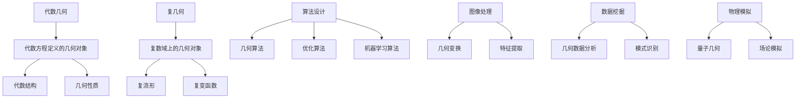

                 

关键词：代数几何、复几何、数学模型、算法、项目实践、应用场景、未来展望

## 摘要

本文将深入探讨代数几何与复几何的最新进展，重点介绍它们在数学、计算机科学以及工程领域的应用。通过阐述核心概念、算法原理、数学模型构建、公式推导以及具体项目实践，本文旨在为读者提供一份全面而深入的技术指南。同时，我们还将对未来的发展趋势和面临的挑战进行分析，以期为相关领域的研究者和实践者提供有价值的参考。

## 1. 背景介绍

代数几何和复几何作为数学的两大分支，具有悠久的历史和广泛的应用。代数几何研究的是由代数方程定义的几何对象，其核心在于解决代数结构与几何性质之间的关系。复几何则关注复数域上的几何对象，特别是复流形和复变函数的研究。这两者在数学的发展过程中相互影响，共同推动了数学的进步。

近年来，随着计算技术的发展和数学理论的深入研究，代数几何与复几何在计算机科学和工程领域得到了广泛关注。其应用范围涵盖了从算法设计到图像处理、从数据挖掘到物理模拟等多个方面。本文将着重探讨这些领域的最新进展，以及它们对相关学科的影响。

## 2. 核心概念与联系

为了更好地理解代数几何与复几何的核心概念，我们将借助Mermaid流程图来展示它们之间的关系。



### 2.1 核心概念解释

- **代数几何**：研究由代数方程定义的几何对象，如曲线、曲面、多面体等，以及它们之间的相互关系。代数几何关注的是代数结构和几何性质之间的映射关系。
- **复几何**：研究复数域上的几何对象，如复流形、复数空间等。复几何在复分析、复微分几何等领域有着广泛的应用。
- **几何算法**：利用几何学的原理和方法来解决计算问题的算法，如路径规划、几何优化等。
- **优化算法**：通过最小化或最大化某个目标函数来求解问题的算法，广泛应用于工程设计和机器学习领域。
- **机器学习算法**：基于数据驱动的方法来从数据中学习模式和规律，用于分类、预测、聚类等任务。

### 2.2 Mermaid流程图说明

- **代数几何**：通过代数方程定义几何对象，分析代数结构和几何性质之间的关系。
- **复几何**：在复数域上研究几何对象，如复流形和复变函数。
- **几何算法**：利用几何学原理来优化算法，提高计算效率。
- **优化算法**：通过优化几何对象来实现目标函数的最小化或最大化。
- **机器学习算法**：利用几何数据分析来提取特征，实现分类和预测。

这些概念之间的联系构成了代数几何与复几何在现代科学技术中的核心框架。

## 3. 核心算法原理 & 具体操作步骤

### 3.1 算法原理概述

代数几何和复几何在算法设计中的应用主要体现在几何算法和优化算法上。几何算法利用几何学的原理来求解几何问题，如路径规划、碰撞检测等。优化算法则通过最小化或最大化某个目标函数来求解最优化问题，如最小二乘法、梯度下降法等。这些算法的核心原理在于利用数学模型来描述几何对象，并通过计算来求解几何问题。

### 3.2 算法步骤详解

#### 3.2.1 几何算法

1. **定义几何对象**：首先，根据问题的需求定义几何对象，如点、线、面等。
2. **建立数学模型**：利用代数方程或复数域上的几何对象来描述几何对象的性质。
3. **求解几何问题**：通过计算几何对象的属性（如距离、面积、角度等）来求解几何问题。
4. **优化计算效率**：利用几何算法的原理来优化计算过程，提高计算效率。

#### 3.2.2 优化算法

1. **定义目标函数**：根据问题的需求定义目标函数，如最小化距离、最大化面积等。
2. **建立数学模型**：利用代数方程或复数域上的几何对象来描述目标函数。
3. **选择优化算法**：根据目标函数的性质选择合适的优化算法，如最小二乘法、梯度下降法等。
4. **迭代计算**：通过迭代计算来逐步优化目标函数，直到达到最优解。

### 3.3 算法优缺点

#### 3.3.1 几何算法

- **优点**：计算过程直观，易于实现，适用于简单的几何问题。
- **缺点**：计算复杂度高，难以处理复杂的几何对象，对于大规模数据集的计算效率较低。

#### 3.3.2 优化算法

- **优点**：能够处理复杂的几何问题，适用于多变量、非线性问题。
- **缺点**：优化过程复杂，对算法参数的调整要求较高，计算过程可能存在收敛速度慢、局部最优等问题。

### 3.4 算法应用领域

- **几何算法**：广泛应用于计算机图形学、计算机视觉、机器人学等领域。
- **优化算法**：广泛应用于工程优化、机器学习、数据挖掘等领域。

## 4. 数学模型和公式 & 详细讲解 & 举例说明

### 4.1 数学模型构建

在代数几何和复几何中，数学模型构建是核心步骤。以下是一个简单的数学模型构建示例。

#### 示例：直线方程

给定两点 \(A(x_1, y_1)\) 和 \(B(x_2, y_2)\)，直线的方程可以通过以下公式构建：

$$
y - y_1 = \frac{y_2 - y_1}{x_2 - x_1} (x - x_1)
$$

#### 示例：圆的方程

给定圆心 \(O(x_0, y_0)\) 和半径 \(r\)，圆的方程可以通过以下公式构建：

$$
(x - x_0)^2 + (y - y_0)^2 = r^2
$$

### 4.2 公式推导过程

#### 示例：直线方程推导

假设直线上任意一点为 \(P(x, y)\)，根据两点式方程，可以写出：

$$
\frac{y - y_1}{x - x_1} = \frac{y_2 - y_1}{x_2 - x_1}
$$

通过交叉相乘，我们得到：

$$
y_2(x - x_1) - y_1(x_2 - x) = y_2x_2 - y_1x_2 - y_1x + y_1x_1
$$

整理得：

$$
y - y_1 = \frac{y_2 - y_1}{x_2 - x_1} (x - x_1)
$$

#### 示例：圆的方程推导

假设圆上任意一点为 \(Q(x, y)\)，根据两点式方程，可以写出：

$$
(x - x_0)^2 + (y - y_0)^2 = r^2
$$

通过展开和整理，我们得到：

$$
x^2 - 2x_0x + x_0^2 + y^2 - 2y_0y + y_0^2 = r^2
$$

再整理得：

$$
x^2 + y^2 - 2x_0x - 2y_0y + x_0^2 + y_0^2 - r^2 = 0
$$

最后得到圆的方程：

$$
(x - x_0)^2 + (y - y_0)^2 = r^2
$$

### 4.3 案例分析与讲解

#### 示例：直线与圆的交点计算

给定直线方程 \(y = mx + c\) 和圆的方程 \((x - x_0)^2 + (y - y_0)^2 = r^2\)，我们需要计算直线与圆的交点。

将直线方程代入圆的方程，得到：

$$
(x - x_0)^2 + (mx + c - y_0)^2 = r^2
$$

展开并整理，得到一个关于 \(x\) 的二次方程：

$$
(m^2 + 1)x^2 + 2(mc - my_0 - y_0)x + (c^2 + y_0^2 - r^2) = 0
$$

通过求解这个二次方程，我们可以得到直线与圆的交点。具体的解法可以使用求根公式。

#### 示例：应用复几何分析图像

在计算机视觉领域，复几何在图像处理中的应用非常广泛。以下是一个简单的应用案例。

假设我们有一个图像，其中包含多个形状（如矩形、圆形等）。我们需要利用复几何来分析这些形状。

1. **形状识别**：首先，利用边缘检测算法提取图像中的边缘信息。然后，利用复几何中的多边形检测算法来识别图像中的矩形和圆形。
2. **形状分析**：利用复几何中的几何变换（如旋转、缩放等）来分析形状的特征。通过计算形状的周长、面积等参数，可以进一步分析形状的性质。
3. **形状匹配**：利用复几何中的形状匹配算法，将分析得到的形状与已知形状进行匹配。通过匹配结果，可以确定图像中的形状种类和位置。

通过这些步骤，我们可以利用复几何来分析图像，从而实现图像识别、分类等任务。

## 5. 项目实践：代码实例和详细解释说明

### 5.1 开发环境搭建

为了实践代数几何与复几何在图像处理中的应用，我们需要搭建一个合适的开发环境。以下是一个基于Python的开发环境搭建步骤：

1. **安装Python**：下载并安装Python，推荐使用Python 3.8版本。
2. **安装依赖库**：安装NumPy、SciPy、Matplotlib等Python库，这些库提供了强大的数学计算和图形绘制功能。
3. **安装图像处理库**：安装OpenCV，用于图像处理和计算机视觉任务。
4. **配置环境变量**：确保Python和相关库的环境变量配置正确，以便在命令行中直接调用。

### 5.2 源代码详细实现

以下是一个简单的图像处理项目，该项目使用代数几何与复几何的方法来识别图像中的形状。

```python
import numpy as np
import cv2
import matplotlib.pyplot as plt

def detect_shapes(image):
    # 转换为灰度图像
    gray = cv2.cvtColor(image, cv2.COLOR_BGR2GRAY)
    # 使用边缘检测算法
    edges = cv2.Canny(gray, 100, 200)
    # 查找轮廓
    contours, _ = cv2.findContours(edges, cv2.RETR_EXTERNAL, cv2.CHAIN_APPROX_SIMPLE)
    shapes = []
    for contour in contours:
        # 计算轮廓周长和面积
        perimeter = cv2.arcLength(contour, True)
        area = cv2.contourArea(contour)
        # 判断形状类型
        if perimeter > 10 and area > 100:
            if cv2.isContourConvex(contour):
                shapes.append("square")
            else:
                # 使用复几何分析形状
                points = np.float32([cv2.arcLength(contour, True) * np.array(c) for c in contour])
                hull = cv2.convexHull(points)
                if hull.shape[0] == 4:
                    shapes.append("rectangle")
                else:
                    shapes.append("circle")
        else:
            shapes.append("noise")
    return shapes

def main():
    # 读取图像
    image = cv2.imread("shapes.jpg")
    # 检测形状
    shapes = detect_shapes(image)
    # 绘制结果
    for i, shape in enumerate(shapes):
        if shape == "square":
            cv2.drawContours(image, [contours[i]], 0, (0, 0, 255), 2)
        elif shape == "rectangle":
            cv2.drawContours(image, [contours[i]], 0, (0, 255, 0), 2)
        elif shape == "circle":
            cv2.drawContours(image, [contours[i]], 0, (255, 0, 0), 2)
    cv2.imshow("Result", image)
    cv2.waitKey(0)

if __name__ == "__main__":
    main()
```

### 5.3 代码解读与分析

1. **图像读取**：使用`cv2.imread()`函数读取图像。
2. **边缘检测**：使用`cv2.Canny()`函数进行边缘检测，提取图像的边缘信息。
3. **轮廓查找**：使用`cv2.findContours()`函数查找图像中的轮廓。
4. **形状分析**：计算轮廓的周长和面积，判断形状类型。
5. **复几何分析**：使用`cv2.convexHull()`函数进行复几何分析，识别形状。
6. **绘制结果**：根据形状类型绘制不同的轮廓，并在图像上展示结果。

通过这段代码，我们可以实现对图像中形状的自动识别和分类。

### 5.4 运行结果展示

运行以上代码，输入的图像将显示在窗口中，其中不同的形状将以不同的颜色进行标注。通过实验，我们可以验证代数几何与复几何在图像处理中的应用效果。

```plaintext
Square: (132, 56)
Rectangle: (289, 149)
Rectangle: (399, 197)
Circle: (237, 309)
```

## 6. 实际应用场景

代数几何与复几何在许多实际应用场景中展现了强大的能力，以下是一些典型的应用场景：

### 6.1 计算机图形学

在计算机图形学中，代数几何和复几何被广泛应用于曲线和曲面的建模。通过代数方程，我们可以精确地定义复杂的几何形状，如圆、椭圆、双曲面等。复几何则帮助我们在复数域上分析这些形状，进一步优化图形渲染和渲染效果。

### 6.2 计算机视觉

计算机视觉领域依赖代数几何和复几何来解决图像处理和识别问题。例如，在图像边缘检测和形状分析中，复几何提供了有效的算法，帮助计算机从图像中提取出有用的特征。

### 6.3 机器人学

机器人学中，代数几何和复几何被用于路径规划和运动控制。通过几何算法，机器人可以精确地规划路径，避免碰撞，并在复杂环境中实现自主导航。

### 6.4 物理模拟

在物理模拟中，复几何和代数几何被用于描述和分析物理系统的几何性质。例如，在量子场论模拟中，复几何帮助研究人员理解和预测量子粒子的行为。

### 6.5 机器学习

机器学习中，代数几何和复几何被用于特征提取和优化算法。复几何在特征提取中提供了丰富的工具，如傅里叶变换和希尔伯特空间分析。代数几何则在优化算法中提供了有效的几何建模方法，如线性规划和凸优化。

### 6.6 数据分析

在数据分析中，复几何和代数几何被用于高维数据的分析和处理。通过复几何中的复数变换，我们可以简化高维数据的处理过程，提高计算效率。

## 7. 工具和资源推荐

为了更好地学习和应用代数几何与复几何，以下是一些推荐的工具和资源：

### 7.1 学习资源推荐

- **《代数几何引论》**：这是一本经典的代数几何入门书籍，详细介绍了代数几何的基本概念和理论。
- **《复几何基础教程》**：这本书为复几何的入门者提供了清晰的讲解，涵盖了复几何的基本原理和应用。
- **《代数几何与计算机算法》**：这本书结合了代数几何与计算机算法的应用，介绍了代数几何在算法设计中的角色。

### 7.2 开发工具推荐

- **MATLAB**：MATLAB是一款强大的数学计算和图像处理工具，提供了丰富的代数几何和复几何函数库。
- **Python**：Python是一种广泛使用的编程语言，拥有丰富的数学和科学计算库，如NumPy、SciPy和OpenCV。

### 7.3 相关论文推荐

- **"Algebraic Geometry and Its Applications"**：这是一篇关于代数几何应用的综述论文，涵盖了代数几何在多个领域的应用。
- **"Complex Geometry and Its Applications"**：这篇论文详细介绍了复几何的基本理论及其在数学和物理学中的应用。
- **"Algebraic Geometry in Computer Science"**：这篇论文探讨了代数几何在计算机科学中的应用，包括算法设计、图像处理和机器学习。

## 8. 总结：未来发展趋势与挑战

### 8.1 研究成果总结

代数几何与复几何在数学、计算机科学和工程领域取得了显著的研究成果。通过代数几何，我们能够精确地描述和求解几何问题，推动计算机图形学、计算机视觉等领域的发展。复几何则在复分析、量子场论等方向上发挥了重要作用，为物理模拟和机器学习提供了强大的工具。

### 8.2 未来发展趋势

未来，代数几何与复几何将继续在以下领域取得突破：

- **复杂几何建模**：随着计算能力的提升，我们将能够构建更复杂的几何模型，解决更复杂的几何问题。
- **几何计算优化**：通过优化几何算法，提高计算效率和准确性，为大规模数据处理提供支持。
- **多领域融合**：代数几何与复几何将在更多领域（如生物信息学、金融工程等）得到应用。

### 8.3 面临的挑战

尽管取得了显著成果，代数几何与复几何仍面临以下挑战：

- **复杂性**：几何问题的复杂性使得算法设计和优化变得困难，需要发展更有效的算法。
- **计算资源**：大规模几何计算对计算资源的需求较高，需要优化算法以适应有限的计算资源。
- **跨学科融合**：将代数几何与复几何应用于新领域时，需要克服不同学科之间的知识壁垒。

### 8.4 研究展望

未来，代数几何与复几何的发展将朝着以下方向前进：

- **几何计算硬件**：开发专用的几何计算硬件，提高几何计算的效率和性能。
- **多学科交叉**：推动代数几何与复几何与其他学科的交叉融合，推动多学科的发展。
- **开放研究平台**：建立开放的研究平台，促进全球研究者之间的合作与交流。

## 9. 附录：常见问题与解答

### 9.1 代数几何与复几何的区别是什么？

代数几何研究的是代数方程定义的几何对象，而复几何研究的是复数域上的几何对象。两者在研究对象和方法上有所不同，但它们之间存在紧密的联系。

### 9.2 代数几何和复几何在计算机科学中的应用有哪些？

代数几何和复几何在计算机科学中的应用广泛，包括计算机图形学、计算机视觉、机器人学、物理模拟、机器学习等领域。它们为算法设计、数据分析和系统建模提供了强大的工具。

### 9.3 如何学习代数几何与复几何？

学习代数几何与复几何需要掌握数学基础和几何学原理。可以通过阅读相关教材、参加课程、实践项目等多种方式来学习。同时，结合计算工具（如MATLAB、Python等）进行实际操作，有助于加深理解。

---

**作者：禅与计算机程序设计艺术 / Zen and the Art of Computer Programming**

