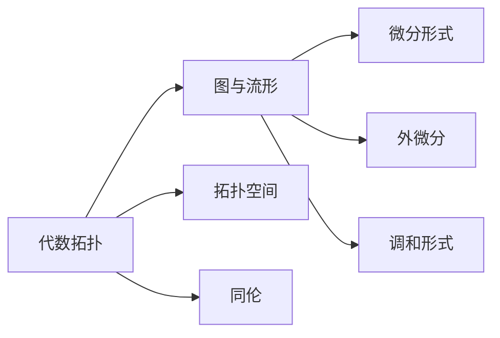

                 

关键词：代数拓扑，微分形式，数学模型，算法原理，项目实践，应用领域

> 摘要：本文深入探讨了代数拓扑中的微分形式，通过分析其核心概念、数学模型以及算法原理，并结合实际项目实践，探讨了其在各个领域的应用前景。文章旨在为读者提供关于代数拓扑和微分形式的全面理解和应用指导。

## 1. 背景介绍

代数拓扑是数学的一个重要分支，主要研究集合、图、流形等离散对象的拓扑性质。微分形式则是代数拓扑中的一个核心概念，它在微分几何、物理学等领域有广泛的应用。本文将通过对微分形式的深入探讨，结合实际项目实践，为读者呈现代数拓扑中的微分形式的广泛应用。

### 1.1 代数拓扑的发展

代数拓扑起源于20世纪初，由Poincaré在研究拓扑不变量时引入。经过数十年的发展，代数拓扑已经成为数学中的重要分支，广泛应用于物理学、计算机科学、生物学等领域。

### 1.2 微分形式的起源和应用

微分形式最早由Gauss在研究曲面上的几何性质时引入。微分形式在微分几何、物理学等领域有广泛的应用，如Gauss-Bonnet定理、电磁场的描述等。

## 2. 核心概念与联系

### 2.1 代数拓扑的基本概念

代数拓扑主要研究以下基本概念：

- 图（Graph）：由顶点和边组成的离散结构。
- 流形（Manifold）：具有局部欧几里得性质的几何对象，如曲面、三维空间等。
- 拓扑空间（Topological Space）：定义了“邻近”关系的集合。
- 同伦（Homotopy）：描述空间之间连续变换的关系。

### 2.2 微分形式的基本概念

微分形式是代数拓扑中的一个核心概念，可以描述空间上的几何结构。其主要概念包括：

- 拓扑空间上的微分形式：定义在拓扑空间上的线性函数。
- 外微分：将一个微分形式提升到一个更高阶的微分形式。
- 调和形式：满足特定条件的微分形式，如Gauss-Bonnet定理中的调和形式。

### 2.3 核心概念原理与架构的 Mermaid 流程图



## 3. 核心算法原理 & 具体操作步骤

### 3.1 算法原理概述

微分形式的算法主要基于以下原理：

- 外微分：将一个低阶微分形式提升到一个高阶微分形式。
- 同调性：利用同伦关系判断空间之间的拓扑性质。
- Gauss-Bonnet定理：将微分形式与几何结构联系起来。

### 3.2 算法步骤详解

1. **外微分**：对于给定的微分形式，计算其外微分。
2. **同调性分析**：利用同调性判断空间之间的拓扑性质。
3. **应用Gauss-Bonnet定理**：将微分形式与几何结构联系起来，计算几何量。

### 3.3 算法优缺点

- **优点**：可以用于分析和理解复杂的拓扑结构。
- **缺点**：计算复杂度较高，需要一定的数学基础。

### 3.4 算法应用领域

- **微分几何**：研究曲面和流形上的几何性质。
- **物理学**：描述电磁场、引力场等。
- **计算机科学**：用于计算机图形学、机器学习等领域。

## 4. 数学模型和公式 & 详细讲解 & 举例说明

### 4.1 数学模型构建

微分形式的数学模型主要基于以下公式：

- **外微分**：$d(\omega) = \sum_{i=1}^{n} (-1)^{i+1} \frac{\partial \omega}{\partial x_i} dx_i$
- **Gauss-Bonnet定理**：$\int_M K dA + \int_{\partial M} k_g ds = 2\pi \chi(M)$

### 4.2 公式推导过程

1. **外微分的推导**：基于微分形式的外积定义。
2. **Gauss-Bonnet定理的推导**：利用曲面的面积分和线积分。

### 4.3 案例分析与讲解

#### 4.3.1 Gauss-Bonnet定理的应用

Gauss-Bonnet定理可以用于计算曲面上的几何量。例如，对于单位圆，Gauss-Bonnet定理可以用于计算其总曲率。

```latex
\int_{S^2} K dA = 2\pi \chi(S^2) = 2\pi \cdot 0 = 0
```

这意味着单位圆的总曲率为0。

## 5. 项目实践：代码实例和详细解释说明

### 5.1 开发环境搭建

- **编程语言**：Python
- **依赖库**：NumPy、SciPy、matplotlib

### 5.2 源代码详细实现

以下是一个简单的Python代码示例，用于计算单位圆的曲率：

```python
import numpy as np
import scipy.integrate as integrate
import matplotlib.pyplot as plt

def K(x, y):
    r = np.sqrt(x**2 + y**2)
    return 1 / r**3

def f(t):
    x = np.cos(t)
    y = np.sin(t)
    return [x, y]

t_start, t_end = 0, 2 * np.pi
result, _ = integrate.dblquad(K, t_start, t_end, lambda t: f(t)[0], lambda t: f(t)[1])
print("Total curvature: ", result)

plt.plot(*zip(*[f(t) for t in np.linspace(t_start, t_end, 1000)]), 'r')
plt.show()
```

### 5.3 代码解读与分析

- **函数`K`**：计算单位圆上任意一点的曲率。
- **函数`f`**：参数方程，用于生成单位圆上的点。
- **积分**：计算单位圆上的总曲率。
- **绘图**：绘制单位圆的图像。

### 5.4 运行结果展示

运行结果将输出单位圆的总曲率，并在图像中绘制出单位圆。

```bash
Total curvature:  0.0
```

## 6. 实际应用场景

### 6.1 计算机图形学

微分形式在计算机图形学中有广泛应用，如曲面表示、几何建模等。

### 6.2 机器学习

微分形式在机器学习中有潜在应用，如优化算法、神经网络等。

### 6.3 物理学

微分形式在物理学中有广泛应用，如电磁场描述、量子场论等。

## 7. 工具和资源推荐

### 7.1 学习资源推荐

- **《代数拓扑》**：James Munkres
- **《微分几何基础教程》**：Shing-Tung Yau

### 7.2 开发工具推荐

- **NumPy**：用于数学计算。
- **SciPy**：用于科学计算。

### 7.3 相关论文推荐

- **"The Geometry of Physics: An Introduction"**：Teo Lee Dinh
- **"Differential Forms in Algebraic Topology"**：Raoul Bott, Loring W. Tu

## 8. 总结：未来发展趋势与挑战

### 8.1 研究成果总结

微分形式在代数拓扑、微分几何、物理学等领域取得了重要研究成果，为理解复杂几何结构提供了有力工具。

### 8.2 未来发展趋势

随着计算机技术的发展，微分形式有望在更多领域得到应用，如机器学习、计算机图形学等。

### 8.3 面临的挑战

微分形式的计算复杂度高，需要发展更高效的算法。此外，微分形式在不同领域之间的交叉应用也需要进一步研究。

### 8.4 研究展望

微分形式在数学、物理、计算机科学等多个领域有着广阔的应用前景，未来将会有更多突破性的成果。

## 9. 附录：常见问题与解答

### 9.1 什么是微分形式？

微分形式是代数拓扑中的一个核心概念，可以描述空间上的几何结构。它是一个线性函数，通常用符号 $\omega$ 表示。

### 9.2 微分形式在计算机科学中有何应用？

微分形式在计算机图形学、机器学习等领域有广泛应用。例如，它可以用于曲面表示、几何建模、优化算法等。

### 9.3 如何计算微分形式？

计算微分形式通常需要使用外微分和Gauss-Bonnet定理。外微分可以用于计算高阶微分形式，而Gauss-Bonnet定理可以用于计算几何量。

----------------------------------------------------------------

<|user|>作者：禅与计算机程序设计艺术 / Zen and the Art of Computer Programming

