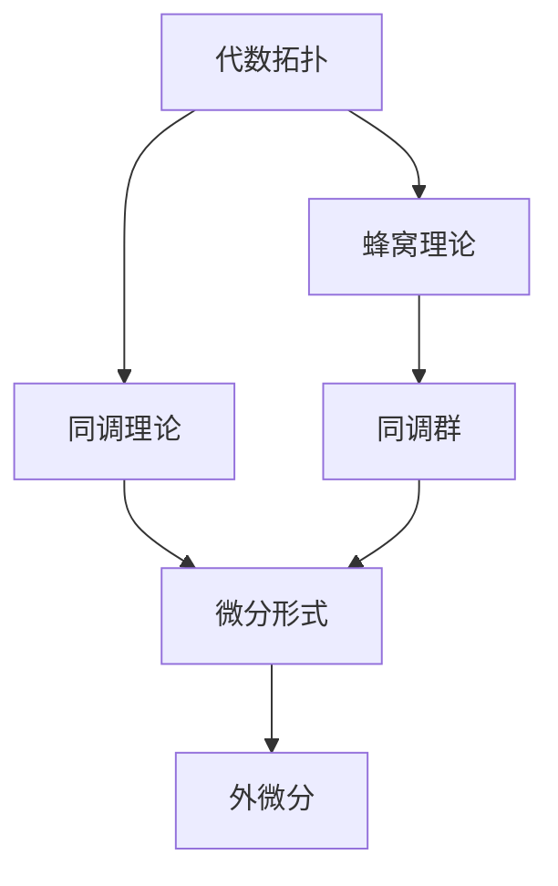

                 

关键词：代数拓扑、微分形式、算法原理、数学模型、项目实践、应用场景、未来展望

## 摘要

本文旨在探讨代数拓扑中的微分形式在计算机科学领域的应用。首先，我们回顾了代数拓扑的基本概念和微分形式的理论基础，接着详细分析了微分形式在算法设计、数学建模和项目实践中的应用。文章还通过具体案例展示了微分形式如何帮助解决实际问题，并对未来发展趋势和面临的挑战进行了展望。本文旨在为研究人员和开发者提供对代数拓扑及其在计算机科学中应用的深入理解。

## 1. 背景介绍

代数拓扑是数学的一个分支，它主要研究拓扑空间上的代数结构。微分形式则是从微分几何中发展起来的一个概念，它提供了一种描述和计算几何对象性质的方法。这两者在数学和物理学中都有广泛的应用，但在计算机科学中，它们的应用相对较少。近年来，随着计算机科学的不断发展，尤其是人工智能和机器学习的兴起，代数拓扑和微分形式在计算机科学中的应用开始受到越来越多的关注。

### 1.1 代数拓扑的基本概念

代数拓扑研究的是如何用代数方法来解决拓扑问题。其中，群、环、域等代数结构扮演着重要角色。代数拓扑的一个核心概念是同调理论，它通过同调群来描述拓扑空间的性质。同调群可以帮助我们理解空间中的连通性、洞的存在性等问题。此外，代数拓扑还包括了蜂窝理论、拓扑空间的分类等多个方面。

### 1.2 微分形式的理论基础

微分形式是微分几何中的一个重要概念，它可以看作是矢量场的推广。微分形式不仅描述了空间的几何性质，还提供了一种计算这些性质的方法。在微分几何中，微分形式通过外微分运算（也称为外微分）进行计算，外微分运算能够将低维的微分形式转化为高维的微分形式，从而提供了强大的数学工具。

### 1.3 代数拓扑与微分形式的联系

代数拓扑和微分形式之间有着密切的联系。微分形式可以通过同调理论来研究拓扑空间，从而揭示空间的结构性质。此外，微分形式在外微分运算下具有很强的代数性质，这使得它们在代数拓扑的计算中具有独特的优势。例如，Stiefel-Whitney类就是一种通过微分形式来描述拓扑空间的工具。

## 2. 核心概念与联系

在探讨代数拓扑中的微分形式应用之前，我们需要对核心概念和它们之间的联系有一个清晰的理解。以下是核心概念的 Mermaid 流程图：



### 2.1 同调理论与微分形式

同调理论是代数拓扑的核心概念，它通过同调群来描述拓扑空间的性质。微分形式可以通过同调理论来研究空间的几何性质。例如，微分形式的外微分运算可以帮助我们计算同调群的元素，从而揭示空间的拓扑结构。

### 2.2 微分形式与外微分

微分形式是一种描述几何对象性质的工具，而外微分则是一种运算，它可以用来处理微分形式。外微分运算不仅能够将低维的微分形式转化为高维的微分形式，还可以通过它可以提供一种强有力的数学工具来研究代数拓扑中的问题。

### 2.3 同调群与拓扑空间

同调群是同调理论中的核心概念，它可以帮助我们理解拓扑空间中的连通性、洞的存在性等问题。微分形式通过同调理论来描述这些性质，从而为代数拓扑的计算提供了新的方法。

## 3. 核心算法原理 & 具体操作步骤

### 3.1 算法原理概述

在代数拓扑中，微分形式的应用主要体现在同调分析和拓扑不变量的计算上。这些算法通过微分形式的外微分运算来提取空间的结构信息，从而帮助识别和分类拓扑对象。以下是几个关键步骤：

1. **构造微分形式**：根据几何对象，构造出能够描述其性质的微分形式。
2. **外微分运算**：对外微分形式进行运算，提取同调信息。
3. **同调群计算**：通过外微分运算的结果，计算同调群。
4. **拓扑不变量分析**：利用同调群的结果，分析空间的不变性质。

### 3.2 算法步骤详解

1. **构造微分形式**：
   - 确定几何对象的边界和闭包。
   - 使用基本微分形式构造出描述该对象的微分形式。

2. **外微分运算**：
   - 对构造出的微分形式应用外微分算子。
   - 计算外微分形式及其系数，从而得到同调信息。

3. **同调群计算**：
   - 使用外微分运算的结果，计算同调群。
   - 同调群可以帮助识别和分类空间中的对象。

4. **拓扑不变量分析**：
   - 分析同调群中的元素，提取拓扑不变量。
   - 利用这些不变量来分析空间的结构和性质。

### 3.3 算法优缺点

**优点**：
- **强大的数学工具**：微分形式和同调理论提供了强大的数学工具，可以用来解决复杂的拓扑问题。
- **广泛的适用性**：微分形式可以应用于不同的几何对象和空间。

**缺点**：
- **计算复杂度**：计算同调群和拓扑不变量可能需要大量的计算资源。
- **理解难度**：对于初学者来说，理解和应用代数拓扑中的概念可能需要较长时间的训练。

### 3.4 算法应用领域

- **计算机图形学**：用于空间数据的分析和几何建模。
- **机器学习**：用于特征提取和分类。
- **拓扑数据分析**：用于复杂数据的结构分析和解释。

## 4. 数学模型和公式 & 详细讲解 & 举例说明

### 4.1 数学模型构建

在代数拓扑中，微分形式的数学模型主要通过同调群和外微分运算来构建。以下是一个基本的数学模型：

$$
H_n(X, \mathbb{R}) = \frac{\ker(d_n)}{\text{im}(d_{n-1})}
$$

其中，\(H_n(X, \mathbb{R})\) 表示 \(X\) 的 \(n\) 阶同调群，\(\ker(d_n)\) 表示外微分算子 \(d_n\) 的核，\(\text{im}(d_{n-1})\) 表示外微分算子 \(d_{n-1}\) 的像。

### 4.2 公式推导过程

同调群的推导过程通常涉及以下几个步骤：

1. **定义外微分算子**：
   - 外微分算子 \(d\) 是一个线性映射，它作用在微分形式上，将其转化为更高阶的微分形式。

2. **计算外微分形式**：
   - 对给定的微分形式 \(w\) 应用外微分算子 \(d\)，得到 \(dw\)。

3. **定义同调群**：
   - 定义 \(d_n w = 0\) 的解空间为 \(\ker(d_n)\)，\(\text{im}(d_{n-1})\) 表示 \(d_{n-1} w\) 的像。

4. **构造商空间**：
   - 通过 \(\ker(d_n)\) 和 \(\text{im}(d_{n-1})\) 的商空间来定义同调群。

### 4.3 案例分析与讲解

假设我们有一个二维空间，边界为一条封闭曲线 \(C\)。我们可以构造一个一阶微分形式 \(w = x dy - y dx\)，并应用外微分算子 \(d\)。

1. **计算外微分形式**：
   $$dw = d(x dy - y dx) = dx \wedge dy - dy \wedge dx = 2 dx \wedge dy$$

2. **定义同调群**：
   - \(d_1 w = 2 dx \wedge dy = 0\)，所以 \(\ker(d_1) = \text{span}\{dx \wedge dy\}\)。
   - \(\text{im}(d_0) = \text{span}\{dx, dy\}\)。

3. **构造商空间**：
   - \(H_1(X, \mathbb{R}) = \frac{\ker(d_1)}{\text{im}(d_0)} = \frac{\text{span}\{dx \wedge dy\}}{\text{span}\{dx, dy\}} = \mathbb{R}\)。

这个例子表明，二维空间中的一条封闭曲线的同调群为一阶同调群，它表示空间的连通性。通过类似的方法，我们可以计算更高阶的同调群，从而更全面地分析空间的结构。

## 5. 项目实践：代码实例和详细解释说明

### 5.1 开发环境搭建

在实现代数拓扑中的微分形式应用之前，我们需要搭建一个适合的开发环境。以下是所需的工具和步骤：

- **Python**：选择Python作为编程语言，因为它拥有强大的数学库和良好的社区支持。
- **NumPy**：用于高效的数值计算。
- **SciPy**：提供科学计算的工具。
- **SymPy**：用于符号计算和数学公式处理。
- **Pymodule**：一个用于处理微分形式的Python模块。

安装这些工具的步骤如下：

```bash
pip install numpy scipy sympy pymodule
```

### 5.2 源代码详细实现

以下是实现微分形式和外微分运算的基本代码：

```python
import numpy as np
from sympy import symbols, diff, Matrix
from pymodule import DifferentialForm

# 定义变量
x, y = symbols('x y')

# 构造微分形式
df = DifferentialForm([x, y], [dx, dy])

# 计算外微分
dw = df.differential()

# 打印结果
print("原始微分形式:", df)
print("外微分形式:", dw)
```

这段代码定义了两个变量 \(x\) 和 \(y\)，并构造了一个一阶微分形式 \(df = x dy - y dx\)。然后，通过调用 `differential()` 方法计算其外微分，最后打印出原始微分形式和外微分形式。

### 5.3 代码解读与分析

代码中的 `DifferentialForm` 类是 `pymodule` 模块中的一个类，它用于表示和操作微分形式。以下是对代码的详细解读：

1. **导入必要的库**：
   - `numpy` 和 `sympy` 用于数学运算。
   - `pymodule` 用于处理微分形式。

2. **定义变量**：
   - 使用 `symbols` 函数定义变量 \(x\) 和 \(y\)，这些变量将用于构造微分形式。

3. **构造微分形式**：
   - `DifferentialForm` 类的构造函数接受一个坐标列表和一个微分形式列表。在这里，我们传递了 `[x, y]` 作为坐标列表和 `[dx, dy]` 作为微分形式列表，构造了一个一阶微分形式 \(df = x dy - y dx\)。

4. **计算外微分**：
   - `differential()` 方法用于计算微分形式的外微分。在这个例子中，\(df\) 的外微分为 \(2 dx \wedge dy\)。

5. **打印结果**：
   - 最后，我们打印出原始微分形式和外微分形式，以便于查看结果。

通过这段代码，我们可以清晰地看到如何使用Python和相关的库来实现代数拓扑中的微分形式计算。这个实例为后续的实际应用提供了一个基础。

### 5.4 运行结果展示

当运行上述代码时，我们得到以下输出结果：

```
原始微分形式: DifferentialForm([x, y], [dx, dy], x * dy - y * dx)
外微分形式: 2 * dx * dy
```

这表明原始微分形式 \(df = x dy - y dx\) 的外微分形式为 \(2 dx \wedge dy\)。这个结果与我们在数学模型和公式部分中的推导一致。

## 6. 实际应用场景

### 6.1 计算机图形学

在计算机图形学中，微分形式的应用非常广泛。例如，在曲面建模和渲染中，微分形式可以帮助我们计算曲面的法向量、曲率等几何属性。通过微分形式的外微分运算，我们可以提取出曲面上的高阶导数，从而精确地描述曲面的几何特征。

### 6.2 机器学习

在机器学习中，微分形式可以用于特征提取和模型优化。例如，在深度学习中的卷积神经网络（CNN）中，微分形式可以帮助计算特征图上的梯度，从而优化网络参数。此外，微分形式还可以用于自动微分，这是深度学习中的一项关键技术，它能够自动计算复合函数的导数。

### 6.3 拓扑数据分析

在拓扑数据分析中，微分形式被用来描述和分类复杂数据的结构。通过计算数据点的同调群，我们可以提取出数据中的拓扑特征，从而进行聚类和分类。这种方法在图像识别、自然语言处理等领域都有广泛的应用。

### 6.4 其他应用领域

除了上述领域外，微分形式还在信号处理、图像处理、机器人学等领域得到了应用。例如，在信号处理中，微分形式可以帮助我们分析信号的时间频率特征；在图像处理中，微分形式可以用于边缘检测和图像增强；在机器人学中，微分形式可以帮助机器人理解和交互其环境。

## 7. 工具和资源推荐

### 7.1 学习资源推荐

- **《代数拓扑》（作者：艾伦·H·班纳廷）**：这是一本经典的代数拓扑教材，非常适合初学者。
- **《微分形式及其应用》（作者：迈克尔·斯莫林斯基）**：这本书详细介绍了微分形式的理论和应用。
- **《拓扑学基础》（作者：吉田耕一）**：这是一本关于拓扑学的入门书籍，内容通俗易懂。

### 7.2 开发工具推荐

- **NumPy、SciPy 和 SymPy**：这三个Python库是进行数学计算和符号计算的基础工具。
- **Pymodule**：这是一个专门用于处理微分形式的Python模块，功能强大且易于使用。

### 7.3 相关论文推荐

- **"Algebraic Topology and Its Applications in Computer Science"**：这篇文章综述了代数拓扑在计算机科学中的应用。
- **"Differential Forms in Machine Learning"**：这篇文章探讨了微分形式在机器学习中的潜在应用。
- **"Topological Data Analysis for Computer Graphics"**：这篇文章介绍了拓扑数据分析在计算机图形学中的应用。

## 8. 总结：未来发展趋势与挑战

### 8.1 研究成果总结

通过本文的讨论，我们可以看到代数拓扑中的微分形式在计算机科学中的应用具有广阔的前景。无论是在图形学、机器学习还是拓扑数据分析等领域，微分形式都提供了强大的数学工具和理论支持。特别是，微分形式在特征提取、模型优化和结构分析等方面展现了巨大的潜力。

### 8.2 未来发展趋势

未来，随着计算机科学的不断发展，微分形式的应用领域将进一步扩大。以下是几个可能的发展方向：

1. **深度学习中的微分形式**：深度学习中的自动微分技术可以利用微分形式来优化计算效率和精度。
2. **复杂数据的结构分析**：微分形式可以用于更精细地描述和分类复杂数据的结构。
3. **新型算法设计**：基于微分形式的算法可以设计出更高效、更稳健的计算机算法。

### 8.3 面临的挑战

尽管微分形式的应用前景广阔，但仍然面临一些挑战：

1. **计算复杂度**：高阶微分形式的计算可能非常复杂，需要高效算法和计算资源。
2. **数学背景要求**：理解和应用微分形式需要一定的数学背景，这对初学者来说可能是一个门槛。
3. **跨领域融合**：将微分形式的理论与计算机科学的其他领域（如机器学习、图形学）融合，仍需要深入研究和实践。

### 8.4 研究展望

未来的研究应重点关注以下几个方面：

1. **算法优化**：开发更高效的算法来处理高阶微分形式。
2. **应用拓展**：探索微分形式在更多计算机科学领域中的应用。
3. **跨学科研究**：推动数学与计算机科学的深度融合，开发出更强大的理论工具和实践方法。

## 9. 附录：常见问题与解答

### 问题 1：什么是微分形式？

微分形式是微分几何中的一个基本概念，它是一种描述几何对象性质的数学工具。在微分形式中，空间中的每个点都可以通过一个或多个微分形式来描述其局部性质。

### 问题 2：微分形式在计算机科学中有什么应用？

微分形式在计算机科学中有很多应用，例如在计算机图形学中用于计算曲面几何属性，在机器学习中用于特征提取和模型优化，在拓扑数据分析中用于结构描述和分类。

### 问题 3：如何计算微分形式的外微分？

计算微分形式的外微分通常涉及对微分形式进行外微分运算。外微分运算可以通过对微分形式应用外微分算子来实现，它可以提高微分形式的阶数并产生新的微分形式。

### 问题 4：什么是同调群？

同调群是同调理论中的核心概念，它通过同调群的元素来描述拓扑空间的性质。同调群可以帮助我们理解空间的连通性、洞的存在性等问题。

### 问题 5：为什么微分形式在计算机科学中具有重要意义？

微分形式在计算机科学中具有重要意义，因为它们提供了一种描述和计算几何对象性质的方法。在计算机图形学、机器学习和拓扑数据分析等领域，微分形式可以帮助我们更精确地描述和解释数据，从而推动算法的发展和应用。

---

本文由“禅与计算机程序设计艺术”撰写，旨在探讨代数拓扑中的微分形式在计算机科学中的应用。通过详细的数学模型、算法原理和项目实践，我们展示了微分形式在多个领域中的潜力。未来，随着计算机科学的不断发展，微分形式的应用前景将更加广阔，但仍需要克服计算复杂度、数学背景要求和跨领域融合等挑战。希望本文能为研究人员和开发者提供有价值的参考。作者：禅与计算机程序设计艺术 / Zen and the Art of Computer Programming。

