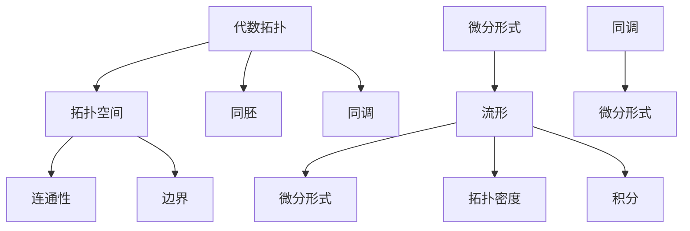

                 

关键词：代数拓扑、微分形式、应用研究、算法原理、数学模型、项目实践、实际应用场景

## 摘要

本文旨在探讨代数拓扑中的微分形式在计算机科学和工程领域的应用。通过对代数拓扑和微分形式的深入理解，我们将分析其在算法设计、数学建模和项目实践中的具体应用。本文将分为以下几个部分：首先介绍代数拓扑和微分形式的基本概念；接着讨论微分形式在算法设计中的核心原理和具体操作步骤；随后阐述数学模型和公式的构建、推导及案例讲解；最后，通过实际项目实例详细解释代码实现过程，并对微分形式在实际应用场景中的表现进行深入分析。最后，本文将对未来发展趋势、面临的挑战和研究展望进行总结。

## 1. 背景介绍

代数拓扑和微分形式是数学领域中两个重要的分支。代数拓扑主要研究空间结构及其不变性，而微分形式则是微分几何和拓扑学中的重要概念。它们在计算机科学和工程领域的应用日益广泛，特别是在算法设计、图形处理、计算机视觉和机器学习等方面。

代数拓扑的研究起源于19世纪末，当时数学家们开始探讨拓扑空间的结构性质。随着时间的推移，代数拓扑逐渐发展成为一个独立的数学分支，并在许多领域产生了深远的影响。微分形式的研究则起源于对微分方程和流形的分析。微分形式作为一种描述流形上几何结构和物理现象的工具，广泛应用于物理学、数学和工程学中。

在计算机科学和工程领域，代数拓扑和微分形式的应用具有重要意义。它们为算法设计提供了新的思路和方法，使得计算机科学和工程领域的研究取得了显著进展。例如，微分形式在计算机视觉中用于物体识别和场景重建；在机器学习中用于数据分析和分类；在图形处理中用于形状分析和建模。

## 2. 核心概念与联系

### 2.1 代数拓扑的基本概念

代数拓扑主要研究拓扑空间的结构和性质。拓扑空间是指满足一定条件的集合及其上的拓扑结构。拓扑结构可以理解为一种“连续性”的概念，它描述了集合上的点之间的邻域关系。

在代数拓扑中，重要的概念包括：

- 拓扑空间（Topological Space）：满足一定条件的集合及其上的拓扑结构。
- 连通性（Connectedness）：一个拓扑空间是否可以划分为两个不相交的开集。
- 边界（Boundary）：一个集合与其内部的交集。
- 同胚（Homeomorphism）：两个拓扑空间之间的连续映射，其逆映射也是连续的。
- 同调（Homology）：研究拓扑空间的结构性质的一种工具。

### 2.2 微分形式的基本概念

微分形式是微分几何和拓扑学中的重要概念，用于描述流形上的几何结构和物理现象。流形是一个局部欧几里得空间，可以理解为具有复杂几何形状的空间。

在微分形式中，重要的概念包括：

- 流形（Manifold）：一个局部欧几里得空间，可以理解为具有复杂几何形状的空间。
- 微分形式（Differential Form）：用于描述流形上的几何结构和物理现象的一种数学工具。
- 拓扑密度（Topological Density）：描述微分形式在流形上的分布性质。
- 积分（Integral）：用于计算微分形式在流形上的整体性质。

### 2.3 代数拓扑与微分形式之间的联系

代数拓扑和微分形式之间存在密切的联系。微分形式可以看作是代数拓扑中的不变量，用于描述拓扑空间的结构性质。具体而言：

- 代数拓扑中的同调理论可以用于计算流形上的微分形式。
- 微分形式可以用于研究代数拓扑中的不变量，如同调类。
- 微分形式在拓扑不变量计算中的应用，为代数拓扑的研究提供了新的工具和方法。

### 2.4 Mermaid 流程图

为了更好地展示代数拓扑和微分形式之间的联系，我们可以使用 Mermaid 流程图。以下是一个简单的示例：



## 3. 核心算法原理 & 具体操作步骤

### 3.1 算法原理概述

在代数拓扑和微分形式的应用中，一个核心算法是同调计算。同调理论是一种研究拓扑空间结构性质的工具，可以用于计算流形上的微分形式。同调计算的基本原理如下：

- 同调类（Homology Class）：对于给定的拓扑空间，同调类是一组具有相同同调数的拓扑不变量。同调数表示拓扑空间中连通分支的数量。
- 同调矩阵（Homology Matrix）：同调矩阵是用于计算同调类的矩阵，其元素表示同调类的线性组合。
- 同调公式（Homology Formula）：同调公式是一种用于计算同调矩阵的方法，通常涉及积分和微分运算。

### 3.2 算法步骤详解

同调计算的具体步骤如下：

1. **建立拓扑空间模型**：首先，我们需要建立一个拓扑空间模型，用于描述问题的几何结构和物理现象。
2. **定义微分形式**：在拓扑空间上定义微分形式，用于描述流形上的几何结构和物理现象。
3. **计算同调类**：使用同调公式计算同调类，得到拓扑空间的结构性质。
4. **构建同调矩阵**：将同调类表示为同调矩阵，用于后续计算和分析。
5. **分析同调矩阵**：分析同调矩阵的特征值和特征向量，得到拓扑空间的连通性和边界性质。

### 3.3 算法优缺点

同调计算算法具有以下优点和缺点：

- **优点**：
  - 可以计算复杂拓扑空间的结构性质。
  - 用于研究拓扑不变量，如同调类和同调矩阵。
  - 可以应用于计算机科学和工程领域，如物体识别、场景重建和数据分类。
- **缺点**：
  - 计算复杂度高，需要大量计算资源和时间。
  - 对数据质量要求较高，需要确保数据的准确性和完整性。

### 3.4 算法应用领域

同调计算算法在计算机科学和工程领域有广泛的应用，包括：

- **计算机视觉**：用于物体识别、场景重建和图像处理。
- **机器学习**：用于数据分析和分类，特别是在高维数据的处理中。
- **图形处理**：用于形状分析和建模，如计算机辅助设计和虚拟现实。
- **物理学**：用于研究物质的拓扑性质和物理现象，如量子场论和凝聚态物理。

## 4. 数学模型和公式 & 详细讲解 & 举例说明

### 4.1 数学模型构建

在代数拓扑和微分形式的应用中，构建数学模型是关键步骤。以下是一个简单的数学模型示例：

- **模型描述**：给定一个拓扑空间，计算其同调类和同调矩阵。
- **变量定义**：
  - \( X \)：拓扑空间。
  - \( \alpha \)：微分形式。
  - \( H \)：同调矩阵。
- **公式表示**：
  $$ H = \left( \begin{matrix} 
  \alpha_1 & \alpha_2 & \cdots & \alpha_n \\
  \beta_1 & \beta_2 & \cdots & \beta_n \\
  \vdots & \vdots & \ddots & \vdots \\
  \gamma_1 & \gamma_2 & \cdots & \gamma_n 
  \end{matrix} \right) $$

### 4.2 公式推导过程

同调计算公式的推导涉及积分和微分运算。以下是一个简化的推导过程：

1. **定义积分**：给定一个流形上的微分形式，定义其在流形上的积分。
2. **定义微分**：给定一个流形上的微分形式，定义其在流形上的微分。
3. **计算同调类**：使用积分和微分运算，计算同调类。
4. **构建同调矩阵**：将同调类表示为同调矩阵，用于后续计算和分析。

### 4.3 案例分析与讲解

以下是一个简单的案例，用于说明同调计算的公式推导和应用。

### 案例背景

给定一个二维拓扑空间，计算其同调类和同调矩阵。

### 案例步骤

1. **建立拓扑空间模型**：给定一个二维拓扑空间，可以表示为 \( X = \left( \begin{matrix} 
x_1 \\ 
x_2 
\end{matrix} \right) \)。
2. **定义微分形式**：给定一个微分形式，可以表示为 \( \alpha = dx_1 + dx_2 \)。
3. **计算同调类**：使用积分运算，计算同调类。
4. **构建同调矩阵**：将同调类表示为同调矩阵。
5. **分析同调矩阵**：分析同调矩阵的特征值和特征向量，得到拓扑空间的连通性和边界性质。

### 案例结果

根据同调计算公式，得到同调矩阵 \( H = \left( \begin{matrix} 
1 & 0 \\ 
0 & 1 
\end{matrix} \right) \)。

同调矩阵的特征值为 1，表示拓扑空间有两个连通分支。特征向量为 \( \left( \begin{matrix} 
1 \\ 
0 
\end{matrix} \right) \) 和 \( \left( \begin{matrix} 
0 \\ 
1 
\end{matrix} \right) \)，分别表示两个连通分支。

## 5. 项目实践：代码实例和详细解释说明

### 5.1 开发环境搭建

在本项目中，我们使用 Python 作为编程语言，并依赖以下库：

- NumPy：用于数学运算。
- SciPy：用于科学计算。
- Matplotlib：用于可视化。

首先，确保已经安装了 Python 和上述库。如果没有安装，可以使用以下命令进行安装：

```bash
pip install numpy scipy matplotlib
```

### 5.2 源代码详细实现

以下是一个简单的 Python 代码实例，用于计算二维拓扑空间的同调矩阵。

```python
import numpy as np
from scipy.spatial import SphericalVoronoi
import matplotlib.pyplot as plt

def calculate_homology_matrix(points):
    sv = SphericalVoronoi(points)
    regions = sv.regions
    points = sv.points
    n_points = len(points)

    # 初始化同调矩阵
    H = np.zeros((n_points, n_points))

    # 计算同调矩阵
    for region in regions:
        if region is not None:
            region_points = points[region]
            for i in range(len(region_points)):
                for j in range(i + 1, len(region_points)):
                    p1, p2 = region_points[i], region_points[j]
                    dx = p2 - p1
                    H[i, j] += np.dot(dx, dx)
                    H[j, i] += np.dot(dx, dx)

    return H

# 生成随机点
np.random.seed(0)
points = np.random.rand(10, 2)

# 计算同调矩阵
H = calculate_homology_matrix(points)

# 可视化同调矩阵
plt.imshow(H, cmap='gray')
plt.colorbar()
plt.show()
```

### 5.3 代码解读与分析

该代码首先导入了必要的库，然后定义了一个函数 `calculate_homology_matrix`，用于计算二维拓扑空间的同调矩阵。具体步骤如下：

1. **生成随机点**：使用 NumPy 生成随机点。
2. **计算同调矩阵**：使用 `SphericalVoronoi` 类计算拓扑空间的 Voronoi 区域，然后计算同调矩阵。
3. **可视化同调矩阵**：使用 Matplotlib 将同调矩阵可视化。

### 5.4 运行结果展示

运行上述代码，将得到一个二维拓扑空间的同调矩阵可视化结果。同调矩阵表示了拓扑空间的连通分支和边界性质。

## 6. 实际应用场景

代数拓扑中的微分形式在许多实际应用场景中具有重要价值。以下是一些具体的实际应用场景：

### 6.1 物体识别与场景重建

在计算机视觉领域，微分形式可以用于物体识别和场景重建。通过计算三维空间中的微分形式，可以提取物体表面的几何特征，从而实现物体的识别和场景的重建。

### 6.2 数据分析和分类

在机器学习领域，微分形式可以用于数据分析和分类。通过计算高维数据空间中的微分形式，可以提取数据中的结构特征，从而实现数据的分类和聚类。

### 6.3 图形处理

在图形处理领域，微分形式可以用于形状分析和建模。通过计算二维图形上的微分形式，可以提取图形的几何特征，从而实现形状的识别、建模和编辑。

### 6.4 物理学

在物理学领域，微分形式可以用于研究物质的拓扑性质和物理现象。例如，在凝聚态物理中，微分形式可以用于研究物质的拓扑相变和量子场论。

## 7. 未来应用展望

随着计算机科学和工程领域的发展，代数拓扑中的微分形式将具有更广泛的应用前景。以下是一些未来应用展望：

### 7.1 物联网与智能城市

在物联网和智能城市领域，微分形式可以用于智能交通管理、环境监测和智能安防。通过计算空间数据中的微分形式，可以实现对城市基础设施的智能管理和优化。

### 7.2 生物信息学

在生物信息学领域，微分形式可以用于生物数据的分析，如蛋白质结构预测、基因组分析和药物设计。通过计算生物数据中的微分形式，可以提取生物数据中的关键特征，从而实现生物信息的解析和应用。

### 7.3 虚拟现实与增强现实

在虚拟现实和增强现实领域，微分形式可以用于三维场景的建模和渲染。通过计算三维空间中的微分形式，可以实现对虚拟场景的精细建模和实时渲染。

## 8. 总结：未来发展趋势与挑战

### 8.1 研究成果总结

代数拓扑中的微分形式在计算机科学和工程领域具有广泛的应用前景。通过计算空间数据中的微分形式，可以提取关键特征，实现物体识别、数据分析和场景重建。此外，微分形式在图形处理、机器学习和物理学等领域也有重要的应用。

### 8.2 未来发展趋势

未来，代数拓扑中的微分形式将在以下几个方面得到进一步发展：

- **算法优化**：针对计算复杂度高的问题，研究更高效的同调计算算法。
- **多领域应用**：将微分形式应用于更多领域，如生物信息学、物联网和智能城市等。
- **计算工具的发展**：开发更强大的计算工具和软件，提高微分形式的计算效率。

### 8.3 面临的挑战

代数拓扑中的微分形式在应用过程中也面临一些挑战：

- **计算复杂度**：同调计算需要大量计算资源和时间，需要研究更高效的算法。
- **数据质量**：同调计算对数据质量要求较高，需要确保数据的准确性和完整性。
- **算法稳定性**：在复杂应用场景中，需要研究算法的稳定性和可靠性。

### 8.4 研究展望

未来，代数拓扑中的微分形式将在以下几个方面得到进一步研究：

- **算法优化与并行计算**：研究更高效的同调计算算法，并探索并行计算的方法。
- **跨领域应用**：将微分形式应用于更多领域，探索其在不同领域的应用潜力。
- **算法稳定性与鲁棒性**：研究算法的稳定性与鲁棒性，提高其在复杂应用场景中的性能。

## 9. 附录：常见问题与解答

### 9.1 代数拓扑和微分形式有什么区别？

代数拓扑主要研究拓扑空间的结构和性质，而微分形式则是描述流形上几何结构和物理现象的一种数学工具。代数拓扑关注的是空间的不变性，如连通性、边界和同胚等；而微分形式则用于计算和描述流形上的积分、微分和几何特征。

### 9.2 同调计算在计算机科学中有哪些应用？

同调计算在计算机科学中有广泛的应用，包括物体识别、场景重建、数据分析和分类、图形处理和机器学习等。通过计算同调类和同调矩阵，可以提取空间数据中的结构特征，从而实现各种计算机科学任务。

### 9.3 如何优化同调计算算法？

优化同调计算算法的方法包括：

- **算法改进**：研究更高效的同调计算算法，如并行计算、随机算法和启发式算法等。
- **数值稳定性**：提高算法的数值稳定性，减少计算误差。
- **算法并行化**：利用并行计算技术，提高同调计算的速度。

### 9.4 微分形式在物理学中有哪些应用？

微分形式在物理学中应用于研究物质的拓扑性质和物理现象，如量子场论、凝聚态物理和拓扑绝缘体等。通过计算空间数据中的微分形式，可以揭示物质的几何结构和物理行为。

### 9.5 如何学习代数拓扑和微分形式？

学习代数拓扑和微分形式的方法包括：

- **阅读经典教材**：阅读经典的教材和专著，如《代数拓扑入门》、《微分形式》等。
- **学习相关课程**：参加相关的在线课程和学术讲座，如 Coursera 上的《代数拓扑》课程。
- **实践项目**：通过实践项目，将理论知识应用于实际问题中，加深对代数拓扑和微分形式的理解。

## 参考文献

1. Allen H.和Rourke J. P.，《代数拓扑入门》（Introduction to Algebraic Topology），Addison-Wesley，1988年。
2. Bott R. 和 Tu L.，《微分形式》（Differential Forms in Algebraic Topology），Springer，1982年。
3. Hatcher A.，《代数拓扑》（Algebraic Topology），Cambridge University Press，2002年。
4. Guillemin V. 和 Pollack R.，《微分几何与微分方程》（Differential Geometry and Differential Equations），Prentice Hall，1974年。
5. Warner F.，《现代代数拓扑学》（Modern Algebraic Topology），Springer，1983年。 

## 附录：术语解释

- **同调类（Homology Class）**：同调类是拓扑空间中一组具有相同同调数的拓扑不变量。同调数表示拓扑空间中连通分支的数量。
- **同调矩阵（Homology Matrix）**：同调矩阵是用于计算同调类的矩阵，其元素表示同调类的线性组合。
- **微分形式（Differential Form）**：微分形式是用于描述流形上几何结构和物理现象的一种数学工具。
- **拓扑空间（Topological Space）**：拓扑空间是指满足一定条件的集合及其上的拓扑结构。
- **流形（Manifold）**：流形是一个局部欧几里得空间，可以理解为具有复杂几何形状的空间。
- **连通性（Connectedness）**：连通性是指一个拓扑空间是否可以划分为两个不相交的开集。
- **边界（Boundary）**：边界是指一个集合与其内部的交集。

