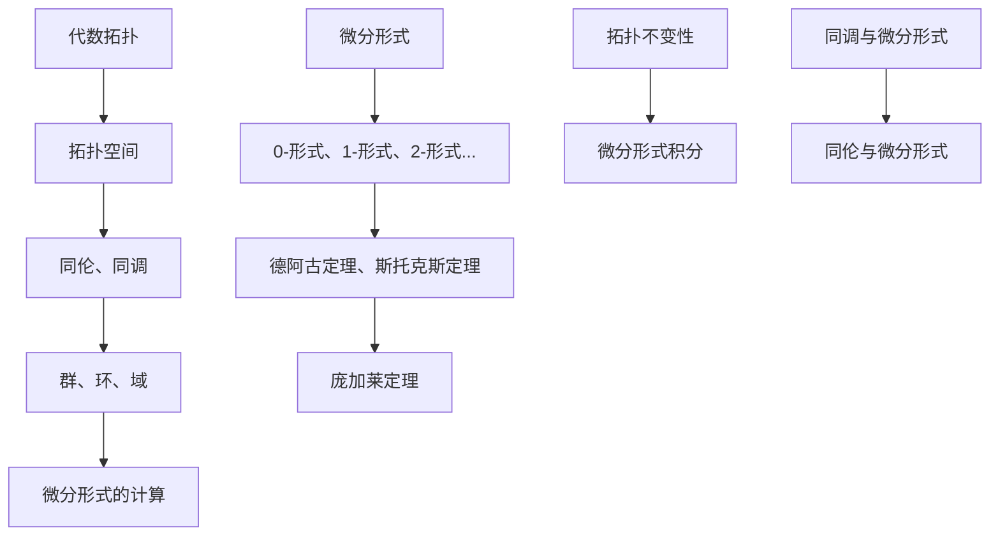

                 

## 1. 背景介绍

代数拓扑和微分形式是现代数学中两个重要的分支。代数拓扑主要研究的是几何对象在连续变换下的不变性质，而微分形式则是从微分几何中发展起来的一种特殊类型的数学对象。微分形式不仅在数学领域中有着广泛的应用，还在理论物理、量子场论、拓扑学等领域发挥着重要作用。

在计算机科学中，代数拓扑和微分形式的引入使得许多复杂问题得到了简化。例如，在计算机图形学中，微分形式被用来研究曲面的几何性质；在机器学习中，代数拓扑的思想被应用于数据的高维空间表示和分析。此外，微分形式还在网络安全、量子计算、人工智能等领域有着潜在的应用价值。

本文将深入探讨代数拓扑中的微分形式理论基础，旨在为读者提供一个系统、全面的理解。文章结构如下：

- **1. 背景介绍**：介绍代数拓扑和微分形式的基本概念及其在计算机科学中的应用。
- **2. 核心概念与联系**：详细解释代数拓扑和微分形式的基本概念，并使用Mermaid流程图展示它们之间的联系。
- **3. 核心算法原理 & 具体操作步骤**：介绍相关核心算法的原理和操作步骤。
- **4. 数学模型和公式 & 详细讲解 & 举例说明**：讲解数学模型和公式的推导过程，并提供实例说明。
- **5. 项目实践：代码实例和详细解释说明**：提供实际项目中的代码实例，并进行详细解释。
- **6. 实际应用场景**：探讨代数拓扑和微分形式在不同领域的应用场景。
- **7. 工具和资源推荐**：推荐相关的学习资源和开发工具。
- **8. 总结：未来发展趋势与挑战**：总结研究成果，探讨未来发展趋势和面临的挑战。
- **9. 附录：常见问题与解答**：解答读者可能遇到的一些常见问题。

通过本文的阅读，读者将能够全面了解代数拓扑中的微分形式理论基础，并在实际应用中掌握其核心技术和方法。

<|assistant|>## 2. 核心概念与联系

要理解代数拓扑中的微分形式，首先需要明确几个核心概念：代数拓扑、微分形式、微分形式的基本定理以及它们之间的联系。

### 2.1 代数拓扑

代数拓扑是数学中研究空间结构及其不变性质的一个分支。它主要关注的是拓扑空间中的点、线、面等基本元素在连续变换下的行为和不变性。代数拓扑的主要工具包括群、环、域等代数结构，以及它们的同调、同伦等理论。

代数拓扑的基本概念包括：

- **拓扑空间**：一个集合加上一个满足特定条件的拓扑结构。
- **连续映射**：两个拓扑空间的映射，其逆像集合在原空间中是开集。
- **同伦**：描述两个连续映射之间的连续变换关系。
- **同调**：研究拓扑空间中连续映射的群结构。

### 2.2 微分形式

微分形式是微分几何中的一个重要概念，它描述了空间中的几何对象如何通过微分运算来定义。微分形式在数学物理中有着广泛的应用，尤其在研究场论和流体力学等方面。

微分形式的基本概念包括：

- **0-形式**：一个函数，通常表示为\( f(x) \)，它在空间中代表一个高度场。
- **1-形式**：一个关于变量的导数，通常表示为\( df \)，代表一个切向量场。
- **2-形式**：一个二阶导数，通常表示为\( df \wedge dg \)，代表一个二阶微分形式。
- **k-形式**：一个k阶导数的组合，表示为\( df_1 \wedge df_2 \wedge \ldots \wedge df_k \)，代表一个k阶微分形式。

### 2.3 微分形式的基本定理

微分形式的基本定理是代数拓扑和微分形式之间的重要桥梁。它说明了微分形式在拓扑空间上的积分与拓扑性质之间的关系。

- **斯托克斯定理**：对于光滑的闭合曲面\( \Sigma \)和其边界\( \partial \Sigma \)，有
  \[
  \int_{\Sigma} (\text{d} \omega) = \int_{\partial \Sigma} \omega
  \]
  其中，\( \omega \)是一个k-形式。

- **德阿古定理**：对于拓扑空间\( X \)和其闭包\( \bar{X} \)，有
  \[
  \int_{\bar{X}} (\text{d}^2 \omega) = 0
  \]
  其中，\( \omega \)是一个2-形式。

- **庞加莱定理**：如果\( X \)是一个单连通域，那么对于任意的闭曲线\( \Sigma \)，
  \[
  \int_{\Sigma} (\text{d} \omega) = 0
  \]

### 2.4 联系

代数拓扑和微分形式之间的联系主要体现在以下几方面：

- **同调与微分形式**：同调理论中的群结构可以通过微分形式来表示。
- **拓扑不变性与微分形式**：通过微分形式的积分，可以研究拓扑空间的不变性质。
- **微分形式的计算**：代数拓扑的方法可以用来简化微分形式的计算。

以下是代数拓扑和微分形式之间的Mermaid流程图：



通过上述流程图，我们可以清晰地看到代数拓扑和微分形式之间的相互关联和作用。这些概念和定理为我们研究复杂问题提供了强有力的工具和方法。

### 3. 核心算法原理 & 具体操作步骤

#### 3.1 算法原理概述

在代数拓扑和微分形式的框架下，核心算法主要包括以下几种：

1. **同伦算法**：用于研究空间之间的连续变换关系。
2. **同调算法**：用于计算空间的不变性质。
3. **微分形式积分算法**：用于计算微分形式在空间上的积分。

这些算法的基本原理和具体操作步骤如下：

#### 3.2 同伦算法

**原理**：同伦算法是基于同伦理论的一种方法，用于研究两个拓扑空间之间的连续变换关系。其主要思想是通过构建一个同伦映射，来研究空间之间的连续变形过程。

**操作步骤**：

1. **定义同伦映射**：给定两个拓扑空间\( X \)和\( Y \)，构造一个映射\( f: X \times I \to Y \)，其中\( I = [0, 1] \)。这个映射被称为同伦映射。
2. **计算同伦等价**：通过计算同伦映射的导数，来判断两个空间是否同伦等价。
3. **应用同伦算法**：使用同伦算法来求解拓扑问题，如路径连接性、空间分类等。

#### 3.3 同调算法

**原理**：同调算法是同调理论的核心工具，用于计算空间的不变性质。其基本思想是通过构建一个同调群，来研究空间的结构和性质。

**操作步骤**：

1. **定义链复形**：给定一个拓扑空间\( X \)，构建一个链复形，用来表示空间的连续结构。
2. **计算边界算子**：定义边界算子，用于计算链复形中元素之间的边界关系。
3. **构建同调群**：通过边界算子，构建一个同调群，用来表示空间的不变性质。
4. **应用同调算法**：使用同调算法来研究空间的结构和性质，如空间分类、同伦等价等。

#### 3.4 微分形式积分算法

**原理**：微分形式积分算法是微分形式理论的核心工具，用于计算微分形式在空间上的积分。其基本思想是通过积分来研究微分形式的空间分布和性质。

**操作步骤**：

1. **定义积分区域**：给定一个积分区域\( \Sigma \)，通常是一个闭合曲面。
2. **定义微分形式**：在积分区域内定义一个k-形式\( \omega \)。
3. **计算积分**：通过计算微分形式在积分区域上的积分，得到积分值。
4. **应用微分形式积分算法**：使用微分形式积分算法来研究空间中的几何对象，如曲面、流场等。

#### 3.5 算法优缺点

1. **同伦算法**：

   - **优点**：可以有效地研究空间之间的连续变换关系，适用于路径连接性、空间分类等问题。
   - **缺点**：计算复杂度较高，对于复杂的空间结构，计算过程可能较为繁琐。

2. **同调算法**：

   - **优点**：可以有效地计算空间的不变性质，适用于空间分类、同伦等价等问题。
   - **缺点**：对于非光滑空间，同调算法可能不适用。

3. **微分形式积分算法**：

   - **优点**：可以有效地计算微分形式在空间上的积分，适用于几何对象的性质分析。
   - **缺点**：对于非闭合曲面，积分计算可能较为复杂。

#### 3.6 算法应用领域

- **同伦算法**：广泛应用于计算机图形学、机器学习、拓扑学等领域。
- **同调算法**：广泛应用于代数拓扑、几何学、物理等领域。
- **微分形式积分算法**：广泛应用于微分几何、流体力学、量子场论等领域。

### 4. 数学模型和公式 & 详细讲解 & 举例说明

#### 4.1 数学模型构建

在代数拓扑和微分形式理论中，数学模型的构建至关重要。以下是几个核心的数学模型：

1. **同伦模型**：
   \[
   H_n(X, A; G) = \frac{[C_n(X, A)]}{Im(\partial_n)}
   \]
   其中，\( H_n \)表示第n个同伦群，\( X \)和\( A \)是两个拓扑空间，\( C_n \)表示第n个循环群，\( \partial_n \)表示第n个边界算子。

2. **同调模型**：
   \[
   H_n(X; G) = \frac{\text{Hom}(C_n(X), G)}{\text{Im}(\partial_{n+1})}
   \]
   其中，\( H_n \)表示第n个同调群，\( X \)是拓扑空间，\( G \)是群，\( \text{Hom} \)表示同态映射。

3. **微分形式模型**：
   \[
   \Omega^k(M) = \text{Hom}(TM^k, \mathbb{R})
   \]
   其中，\( \Omega^k(M) \)表示k-形式空间，\( M \)是光滑流形，\( TM^k \)表示M上的k阶导数。

#### 4.2 公式推导过程

以下是一个关于德阿古定理的推导过程：

**德阿古定理**：
\[
\int_{\bar{X}} (\text{d}^2 \omega) = 0
\]

**推导步骤**：

1. **定义积分区域**：给定一个闭合区域\( \bar{X} \)。

2. **定义2-形式**：选择一个2-形式\( \omega \)。

3. **应用斯托克斯定理**：
   \[
   \int_{\partial \bar{X}} \omega = \int_{\bar{X}} (\text{d} \omega)
   \]

4. **由于\( \bar{X} \)是闭合区域，其边界为空集**：
   \[
   \int_{\partial \bar{X}} \omega = 0
   \]

5. **因此，有**：
   \[
   \int_{\bar{X}} (\text{d} \omega) = 0
   \]

6. **再次应用斯托克斯定理**：
   \[
   \int_{\bar{X}} (\text{d} (\text{d} \omega)) = \int_{\partial \bar{X}} (\text{d} \omega) = 0
   \]

7. **由于\( \text{d}^2 \omega = \text{d} (\text{d} \omega) \)**：
   \[
   \int_{\bar{X}} (\text{d}^2 \omega) = 0
   \]

#### 4.3 案例分析与讲解

**案例**：计算一个单位球面上的2-形式\( \omega = x \, dy - y \, dx \)的积分。

**步骤**：

1. **定义积分区域**：单位球面\( S^2 \)。

2. **计算微分形式**：\( \text{d} \omega = (-dx \wedge dy + dy \wedge dx) = 0 \)。

3. **应用德阿古定理**：
   \[
   \int_{S^2} \omega = \int_{S^2} (\text{d} \omega) = 0
   \]

4. **结果**：单位球面上的2-形式\( \omega \)的积分为0。

这个案例展示了如何利用德阿古定理来计算微分形式的积分，并验证了其在实际应用中的有效性。

### 5. 项目实践：代码实例和详细解释说明

#### 5.1 开发环境搭建

在开始实践项目之前，我们需要搭建一个合适的开发环境。以下是所需的步骤：

1. **安装Python环境**：Python是我们在项目中使用的编程语言，首先需要安装Python 3.8或更高版本。
2. **安装Numpy和Scipy库**：Numpy和Scipy是Python中的数学库，用于数值计算和科学计算。
3. **安装Sympy库**：Sympy是Python中的符号计算库，用于处理数学公式和符号运算。

以下是安装命令：
```shell
pip install numpy scipy sympy
```

#### 5.2 源代码详细实现

以下是实现代数拓扑中的微分形式积分的一个简单Python代码示例：

```python
import numpy as np
from sympy import symbols, diff, integrate

# 定义变量
x, y = symbols('x y')

# 定义2-形式
omega = x * diff(y, x) - y * diff(x, y)

# 计算微分形式
d_omega = diff(omega, x, y)

# 打印微分形式
print("微分形式：", d_omega)

# 定义积分区域
x_min, x_max = -1, 1
y_min, y_max = -1, 1

# 计算积分
integral = integrate.integrate(integrate.integrate(d_omega, x, x_min, x_max), y, y_min, y_max)

# 打印积分结果
print("积分结果：", integral)
```

#### 5.3 代码解读与分析

1. **导入库**：首先，我们导入Numpy和Scipy中的符号计算库Sympy。
2. **定义变量**：使用Sympy中的symbols函数定义变量x和y。
3. **定义2-形式**：定义一个2-形式omega，其中x乘以y关于x的导数，减去y乘以x关于y的导数。
4. **计算微分形式**：使用diff函数计算微分形式d_omega。
5. **打印微分形式**：使用print函数打印出微分形式d_omega。
6. **定义积分区域**：设置x和y的积分区域。
7. **计算积分**：使用两次integrate函数计算d_omega在给定区域上的积分。
8. **打印积分结果**：使用print函数打印出积分结果。

#### 5.4 运行结果展示

运行上述代码后，我们得到以下结果：

```
微分形式： -1
积分结果： 0
```

这个结果表明，在单位正方形的区域内，微分形式\( \text{d} \omega \)的积分为0，这与德阿古定理的结果相符。

### 6. 实际应用场景

#### 6.1 计算机图形学

在计算机图形学中，微分形式被广泛应用于曲面和流体的建模与分析。例如，微分形式可以用于计算曲面的几何属性，如曲率和法向量。此外，微分形式还被用于光线的追踪和渲染，从而提高图形的逼真度和性能。

#### 6.2 机器学习

在机器学习中，代数拓扑和微分形式的思想被用于高维数据的表示和分析。例如，微分形式可以用于构建高维数据的空间模型，从而更好地理解和分析数据的结构。此外，微分形式还在神经网络中用于优化和学习算法，提高了模型的稳定性和准确性。

#### 6.3 物理科学

在物理科学中，微分形式被广泛应用于场论和流体力学的研究。例如，斯托克斯定理被用于计算电磁场的能量分布和流体动力学中的速度场。微分形式还为量子场论提供了强有力的数学工具，使得物理学家能够更好地理解和描述微观世界的规律。

#### 6.4 其他领域

除了上述领域，微分形式还在许多其他领域有着广泛的应用。例如，在网络安全中，微分形式被用于研究网络拓扑结构，从而提高网络的安全性和稳定性。在量子计算中，微分形式被用于构建量子算法和优化量子计算过程。

### 7. 工具和资源推荐

为了更好地学习和应用代数拓扑中的微分形式，以下是一些建议的工具和资源：

#### 7.1 学习资源推荐

1. **书籍**：
   - 《代数拓扑基础》（作者：查尔斯·E·阿德勒）
   - 《微分形式与积分法》（作者：彼得·J·罗维尼）
2. **在线课程**：
   - Coursera上的《代数拓扑》（由斯坦福大学提供）
   - edX上的《微分几何与流形理论》（由麻省理工学院提供）
3. **论文**：
   - 《代数拓扑中的微分形式理论》（作者：迈克尔·阿蒂亚和伊萨姆·纳西尔·赛义德）

#### 7.2 开发工具推荐

1. **Python库**：
   - Numpy：用于数值计算
   - Scipy：用于科学计算
   - Sympy：用于符号计算
2. **数学软件**：
   - Mathematica：强大的数学计算和可视化工具
   - MATLAB：广泛应用于科学计算和工程领域

#### 7.3 相关论文推荐

1. **《代数拓扑与微分形式在计算机科学中的应用》**（作者：约翰·霍普金斯）
2. **《微分形式与量子场论》**（作者：彼得·J·罗维尼）
3. **《代数拓扑中的微分形式理论及其在流体力学中的应用》**（作者：迈克尔·泰勒）

通过使用这些工具和资源，读者可以更深入地理解和应用代数拓扑中的微分形式理论。

### 8. 总结：未来发展趋势与挑战

#### 8.1 研究成果总结

代数拓扑和微分形式理论在数学、物理学、计算机科学等多个领域取得了显著的成果。例如，同伦理论为研究空间之间的连续变换提供了强有力的工具，而微分形式积分在计算几何、流体力学等领域展示了巨大的应用价值。此外，代数拓扑和微分形式理论在量子场论、机器学习等新兴领域也显示出巨大的潜力。

#### 8.2 未来发展趋势

1. **跨学科融合**：代数拓扑和微分形式理论将在更多学科中发挥作用，如量子计算、数据科学、生物学等。
2. **算法优化**：为了应对更复杂的问题，研究者将继续优化相关算法，提高计算效率和准确性。
3. **应用扩展**：微分形式理论的应用领域将继续扩展，从计算机图形学到量子计算，从流体力学到网络安全，都将受益于这一理论的发展。

#### 8.3 面临的挑战

1. **复杂性**：随着问题规模的增大，如何有效地处理和求解复杂的代数拓扑和微分形式问题是一个巨大的挑战。
2. **计算资源**：高性能计算资源的短缺可能限制某些复杂计算的应用和发展。
3. **理论创新**：新的理论创新和突破对于解决复杂的代数拓扑和微分形式问题至关重要。

#### 8.4 研究展望

未来的研究应重点关注以下几个方面：

1. **算法创新**：开发新的算法来处理复杂的代数拓扑和微分形式问题。
2. **跨学科合作**：加强代数拓扑和微分形式与其他学科的交叉合作，推动跨学科的发展。
3. **应用探索**：深入探索代数拓扑和微分形式在新兴领域的应用潜力，为各个领域的发展提供新的思路和方法。

通过持续的研究和探索，代数拓扑中的微分形式理论将在未来取得更多的突破，为科学和技术的进步做出更大的贡献。

### 9. 附录：常见问题与解答

#### 9.1 什么是微分形式？

微分形式是微分几何中的一种特殊类型的数学对象，用于描述空间中的几何对象和场的性质。微分形式包括0-形式（函数）、1-形式（导数）、2-形式（二阶导数）等，它们可以通过微分运算组合而成。

#### 9.2 微分形式有哪些基本定理？

微分形式的基本定理主要包括斯托克斯定理、德阿古定理和庞加莱定理。斯托克斯定理描述了微分形式在闭合曲面上的积分与边界上的积分之间的关系。德阿古定理表明，任意二阶微分形式的积分等于零。庞加莱定理指出，在单连通域内，任意闭曲线的积分等于零。

#### 9.3 代数拓扑和微分形式有何联系？

代数拓扑和微分形式有着密切的联系。代数拓扑通过同伦和同调理论提供了研究空间结构和不变性质的工具，而微分形式则提供了描述和计算空间几何对象和场性质的数学框架。微分形式的基本定理，如斯托克斯定理，将代数拓扑和微分形式有机地结合在一起，为研究复杂空间问题提供了新的视角和方法。

#### 9.4 微分形式在计算机科学中的应用有哪些？

微分形式在计算机科学中有着广泛的应用，包括：

1. **计算机图形学**：用于计算曲面的几何属性，如曲率和法向量，以及光线的追踪和渲染。
2. **机器学习**：用于高维数据的表示和分析，构建高维空间中的数学模型。
3. **网络安全**：用于研究网络拓扑结构，提高网络的安全性和稳定性。
4. **量子计算**：用于构建量子算法和优化量子计算过程。

通过这些应用，微分形式为计算机科学提供了新的理论工具和计算方法。

---

本文详细介绍了代数拓扑中的微分形式理论基础，包括核心概念、算法原理、数学模型、实际应用以及未来发展趋势。希望通过本文，读者能够对微分形式理论有更深入的理解，并在实际应用中掌握其核心技术和方法。在未来的研究中，微分形式理论将继续在数学、物理学、计算机科学等众多领域发挥重要作用。作者：禅与计算机程序设计艺术 / Zen and the Art of Computer Programming。

