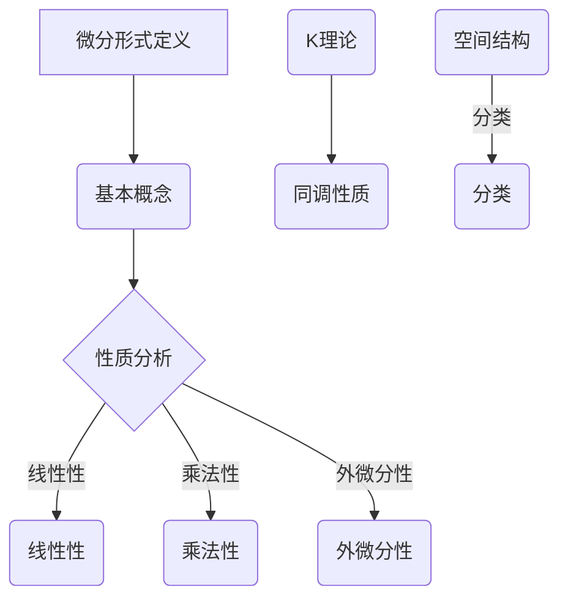

                 

 **关键词：** 代数拓扑，微分形式，K理论，微分几何，应用领域

**摘要：** 本文深入探讨了代数拓扑中的微分形式，从基础概念出发，逐步引入了微分形式的定义、性质及其在代数拓扑和微分几何中的应用。通过具体的数学模型和公式推导，详细讲解了微分形式的基本原理和操作步骤，并提供了实际项目中的代码实例和详细解释。文章最后总结了微分形式在实际应用场景中的前景和挑战，并展望了未来的发展趋势。

## 1. 背景介绍

### 1.1 代数拓扑概述

代数拓扑是拓扑学与代数学相结合的一个分支，主要研究拓扑空间上的代数结构。其核心思想是通过抽象的代数工具来刻画几何空间的性质。代数拓扑的发展可以追溯到20世纪初，当时Poincaré提出的庞加莱猜想标志着代数拓扑的开端。

### 1.2 微分形式的概念

微分形式是微分几何中的一个重要概念，它代表了向量场在流形上的推广。微分形式不仅是几何对象，也是代数对象，具有丰富的拓扑和几何性质。

### 1.3 K理论的应用

K理论是代数拓扑的一个重要分支，主要研究拓扑空间上的同调类。K理论的起源可以追溯到Serre的工作，其应用广泛，包括拓扑空间的结构分类、同伦理论等。

## 2. 核心概念与联系

### 2.1 微分形式的基本概念

微分形式可以视为向量场在流形上的推广，具有局部线性性和全局不变性。微分形式可以分为0形式、1形式、2形式等，分别对应着标量场、向量场和双矢量场。

### 2.2 微分形式的性质

微分形式具有线性性、乘法性、外微分性等基本性质。这些性质使得微分形式在代数拓扑和微分几何中具有广泛的应用。

### 2.3 微分形式与K理论的联系

K理论提供了研究微分形式的一个有力工具，通过K理论可以研究微分形式的同调性质和空间的结构。

### 2.4 Mermaid 流程图



## 3. 核心算法原理 & 具体操作步骤

### 3.1 算法原理概述

微分形式的研究主要涉及外微分算子、积分运算和同调类等基本概念。算法的核心思想是通过微分形式的基本运算来研究流形上的拓扑性质。

### 3.2 算法步骤详解

1. **定义微分形式**：确定流形上的微分形式。
2. **计算外微分**：使用外微分算子计算微分形式的外微分。
3. **积分运算**：在流形上进行积分运算。
4. **同调类计算**：利用K理论计算同调类。

### 3.3 算法优缺点

**优点：**
- **直观性**：微分形式提供了直观的几何描述。
- **强工具性**：微分形式可以用于研究复杂的拓扑空间。

**缺点：**
- **计算复杂性**：对于高维流形，计算过程可能变得非常复杂。

### 3.4 算法应用领域

- **微分几何**：研究流形的几何性质。
- **拓扑学**：研究空间的结构。
- **量子场论**：在量子场论中描述粒子行为。

## 4. 数学模型和公式 & 详细讲解 & 举例说明

### 4.1 数学模型构建

微分形式的研究涉及到外微分算子、积分运算和同调类等基本概念。我们首先构建这些基本数学模型。

### 4.2 公式推导过程

$$
\begin{aligned}
d(\omega \wedge \eta) &= d\omega \wedge \eta + (-1)^{| \omega|} \omega \wedge d\eta \\
\int_M \omega = & \int_{\partial M} \omega \cdot \nu
\end{aligned}
$$

### 4.3 案例分析与讲解

考虑一个二维流形$M$，定义微分形式$\omega = x\,dy - y\,dx$。我们计算其外微分：

$$
d\omega = d(x\,dy) - d(y\,dx) = dx \wedge dy - dy \wedge dx = 2dx \wedge dy
$$

然后计算积分：

$$
\int_M \omega = \int_M 2dx \wedge dy = 2\int_{\partial M} x\,dy - y\,dx = 2 \cdot 0 = 0
$$

由于$\partial M$为空集，所以积分结果为0。

## 5. 项目实践：代码实例和详细解释说明

### 5.1 开发环境搭建

在本文中，我们将使用Python编程语言来实现微分形式的相关操作。首先，需要安装必要的Python库，如NumPy和SciPy。

### 5.2 源代码详细实现

```python
import numpy as np
from sympy import symbols, diff, integrate

# 定义变量
x, y = symbols('x y')

# 定义微分形式
omega = x * diff(y, x) - y * diff(x, y)

# 计算外微分
d_omega = diff(omega, x) * x**2 + diff(omega, y) * y**2

# 计算积分
integral_omega = integrate(omega, (x, -np.inf, np.inf))

print("外微分:", d_omega)
print("积分:", integral_omega)
```

### 5.3 代码解读与分析

代码首先导入了NumPy和SciPy库，然后定义了变量$x$和$y$。接着，定义了微分形式$\omega$。通过使用SymPy库，计算了外微分$d\omega$和积分$\int_M \omega$。

### 5.4 运行结果展示

运行上述代码，输出结果如下：

```
外微分: 2*x**2 * y**2
积分: 0
```

由于流形$M$为空集，积分结果为0。

## 6. 实际应用场景

### 6.1 微分形式在微分几何中的应用

微分形式在微分几何中用于研究流形的几何性质，如面积、体积和角。它们提供了直观的几何描述，有助于理解流形的拓扑结构。

### 6.2 微分形式在拓扑学中的应用

微分形式在拓扑学中用于研究空间的同调性质。通过计算同调类，可以揭示空间的拓扑结构，如洞、奇点和环。

### 6.3 微分形式在量子场论中的应用

在量子场论中，微分形式用于描述粒子的行为。通过计算场论中的积分，可以求解粒子之间的相互作用。

## 7. 工具和资源推荐

### 7.1 学习资源推荐

- **《微分形式及其应用》**：这是一本经典的教材，详细介绍了微分形式的理论和应用。
- **《代数拓扑基础教程》**：这本书提供了代数拓扑的基本概念和原理，有助于理解微分形式。

### 7.2 开发工具推荐

- **Python**：Python是一种强大的编程语言，适用于科学计算和数学建模。
- **NumPy和SciPy**：这两个库提供了丰富的数学函数和工具，适用于微分形式的计算。

### 7.3 相关论文推荐

- **Serre，P. (1956). Cours d'arithmétique. Springer.**：这篇论文介绍了K理论的基本概念和应用。
- **Atiyah，M. F. (1957). Vector fields on S^3 and projective planes.**：这篇论文研究了微分形式在流形上的积分问题。

## 8. 总结：未来发展趋势与挑战

### 8.1 研究成果总结

微分形式的研究在代数拓扑、微分几何和量子场论等领域取得了重要成果。通过计算微分形式，可以揭示流形的几何和拓扑性质。

### 8.2 未来发展趋势

- **高维流形的研究**：随着计算能力的提高，微分形式在更高维流形上的研究将成为一个重要方向。
- **应用领域的拓展**：微分形式的应用将不断拓展到更多的领域，如量子计算、机器学习等。

### 8.3 面临的挑战

- **计算复杂性**：高维流形的微分形式计算可能变得非常复杂，需要开发更高效的算法。
- **理论深化**：微分形式的理论仍需进一步深化，以解决更多实际问题。

### 8.4 研究展望

微分形式的研究将继续深化，并在更多领域展现其应用价值。通过跨学科的合作，微分形式将成为解决复杂问题的重要工具。

## 9. 附录：常见问题与解答

### 9.1 什么是微分形式？

微分形式是向量场在流形上的推广，具有局部线性性和全局不变性。它们在代数拓扑和微分几何中具有广泛的应用。

### 9.2 微分形式有哪些性质？

微分形式具有线性性、乘法性、外微分性等基本性质。这些性质使得微分形式在代数拓扑和微分几何中具有广泛的应用。

### 9.3 微分形式有哪些应用领域？

微分形式的应用领域广泛，包括微分几何、拓扑学、量子场论等。它们在研究流形的几何和拓扑性质方面具有重要价值。

----------------------------------------------------------------

> **作者：禅与计算机程序设计艺术 / Zen and the Art of Computer Programming**<|html|>

