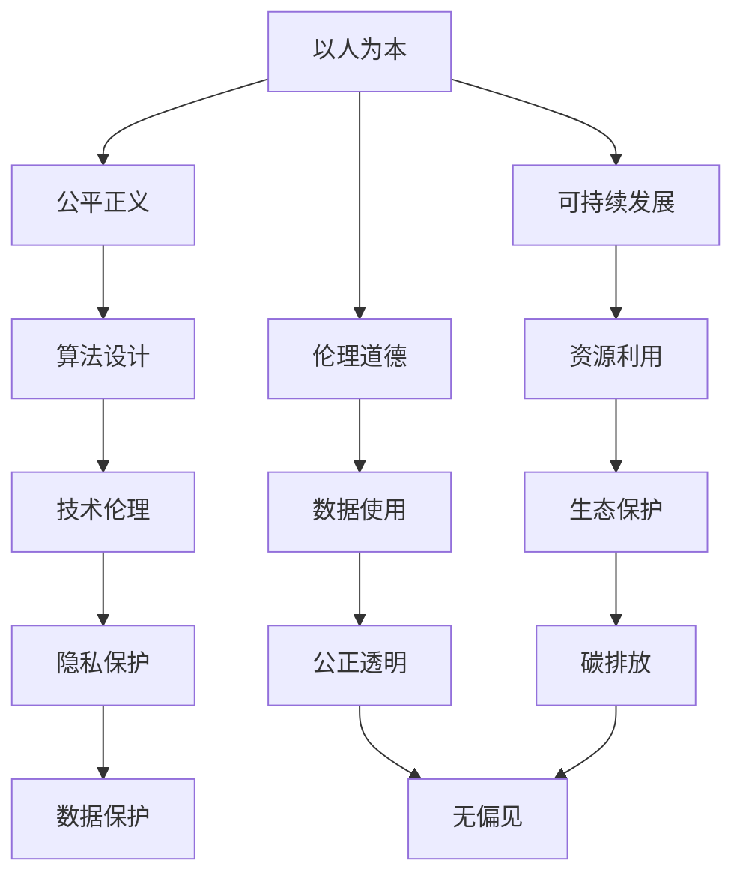

                 

关键词：人工智能，计算价值观，以人为本，技术发展，伦理，可持续发展

> 摘要：本文旨在探讨科技发展的过程中，如何确保技术的进步始终以人为本，体现人类计算的价值观。通过分析当前人工智能技术对社会的影响，以及未来可能面临的挑战，本文提出了保障技术发展过程中人文关怀的具体路径和策略。

## 1. 背景介绍

自计算机诞生以来，人类计算经历了从模拟到数字、从简单到复杂、从局部到全球的演变。随着计算能力的不断提升，人工智能（AI）技术逐渐成为推动社会进步的重要力量。从机器学习到深度学习，从自然语言处理到计算机视觉，AI技术的应用已经渗透到我们生活的方方面面。

然而，随着技术的快速发展，我们不得不面对一个重要的问题：技术的发展是否真正符合人类的利益，是否真正体现了以人为本的价值观？本文将从以下几个方面展开讨论：

1. **人工智能技术的现状与影响**：分析AI技术的广泛应用及其对社会、经济、文化等方面的深远影响。
2. **人类计算的价值观**：探讨在技术进步的过程中，我们应当坚持的核心价值观，以及如何将这些价值观融入到AI技术的发展中。
3. **技术伦理与可持续发展**：分析当前AI技术发展过程中存在的伦理问题，以及如何实现技术与人文的和谐共生，推动可持续发展。
4. **未来展望**：预测AI技术未来的发展趋势，以及我们可能面临的挑战和机遇。

## 2. 核心概念与联系

### 2.1 人工智能技术的现状与影响

人工智能技术主要包括机器学习、深度学习、自然语言处理、计算机视觉等领域。近年来，随着计算能力的提升和数据量的增加，AI技术取得了显著的进步，并在许多领域取得了突破性的成果。

- **机器学习**：通过数据驱动的方式，使计算机系统具备自主学习和改进的能力。广泛应用于推荐系统、风险管理、医疗诊断等领域。
- **深度学习**：基于人工神经网络，通过多层非线性变换对数据进行处理。在图像识别、语音识别、自然语言处理等领域取得了显著成果。
- **自然语言处理**：使计算机能够理解、生成和处理自然语言。广泛应用于智能客服、机器翻译、文本分析等领域。
- **计算机视觉**：使计算机能够理解和处理视觉信息。广泛应用于自动驾驶、安防监控、工业自动化等领域。

AI技术的广泛应用，不仅提高了生产效率，降低了成本，还改变了我们的生活方式。然而，AI技术也带来了一系列的社会挑战，如隐私保护、算法偏见、就业影响等。

### 2.2 人类计算的价值观

人类计算的价值观是指在技术进步的过程中，我们应当坚持的核心原则和理念。以下是几个关键的核心价值观：

- **以人为本**：技术的目的是服务于人类，提升人类的生活质量。在技术设计和应用过程中，应当充分考虑人类的需求和感受。
- **公平正义**：技术应当促进社会的公平正义，消除不平等现象。在算法设计和数据使用过程中，要确保公正、透明、无偏见。
- **可持续发展**：技术发展应当考虑对环境和社会的影响，推动可持续发展。在资源利用、碳排放、生态保护等方面，应当采取积极措施。
- **伦理道德**：技术发展应当遵循伦理道德规范，确保技术的使用不会损害人类的利益和尊严。

### 2.3 核心概念原理和架构

为了更好地理解人类计算的价值观在AI技术中的应用，我们可以通过一个Mermaid流程图来展示核心概念和架构。



通过这个流程图，我们可以清晰地看到，以人为本的价值观贯穿于AI技术的各个层面，包括算法设计、数据使用、技术伦理等。这些价值观不仅指导着AI技术的发展方向，也确保了技术在应用过程中能够更好地服务于人类。

## 3. 核心算法原理 & 具体操作步骤

### 3.1 算法原理概述

在AI技术的核心算法中，深度学习算法具有代表性。深度学习算法基于多层神经网络，通过前向传播和反向传播的过程，实现对数据的特征提取和分类。以下是深度学习算法的基本原理和操作步骤。

### 3.2 算法步骤详解

1. **数据预处理**：
   - 数据清洗：去除数据中的噪声和异常值。
   - 数据归一化：将数据缩放到相同的范围，便于模型训练。

2. **构建神经网络模型**：
   - 选择神经网络架构：如卷积神经网络（CNN）、循环神经网络（RNN）、生成对抗网络（GAN）等。
   - 定义损失函数：如均方误差（MSE）、交叉熵损失等。
   - 选择优化器：如梯度下降（GD）、随机梯度下降（SGD）、Adam优化器等。

3. **模型训练**：
   - 前向传播：将输入数据通过神经网络，计算输出结果。
   - 计算损失：将输出结果与真实值进行比较，计算损失函数。
   - 反向传播：根据损失函数的梯度，调整神经网络参数。
   - 重复以上步骤，直到满足停止条件（如损失收敛或迭代次数达到上限）。

4. **模型评估**：
   - 通过验证集或测试集，评估模型在未知数据上的表现。
   - 使用准确率、召回率、F1分数等指标进行评估。

5. **模型部署**：
   - 将训练好的模型部署到生产环境，实现实时预测或应用。

### 3.3 算法优缺点

- **优点**：
  - 强大的特征提取能力：通过多层神经网络的变换，能够提取出复杂的数据特征。
  - 广泛的应用场景：在图像识别、自然语言处理、推荐系统等领域有广泛的应用。
  - 自动化：减少了人工参与，提高了模型训练的效率和准确性。

- **缺点**：
  - 计算资源消耗大：深度学习算法需要大量的计算资源和存储空间。
  - 数据需求高：需要大量高质量的训练数据。
  - 解释性差：神经网络模型通常具有很高的非线性，难以解释其决策过程。

### 3.4 算法应用领域

- **图像识别**：如人脸识别、物体检测、图像分类等。
- **自然语言处理**：如机器翻译、文本分类、情感分析等。
- **推荐系统**：如商品推荐、新闻推荐、音乐推荐等。
- **医学诊断**：如疾病预测、影像分析、药物研发等。

## 4. 数学模型和公式 & 详细讲解 & 举例说明

### 4.1 数学模型构建

深度学习算法的核心是神经网络，神经网络的基础是数学模型。以下是深度学习中的几个关键数学模型和公式。

1. **线性变换**：
   $$ y = Wx + b $$
   其中，$W$ 是权重矩阵，$x$ 是输入向量，$b$ 是偏置项。

2. **激活函数**：
   $$ a = \sigma(z) = \frac{1}{1 + e^{-z}} $$
   其中，$\sigma$ 是 sigmoid 函数，$z$ 是线性变换的结果。

3. **前向传播**：
   $$ z_l = \sum_{k=1}^{n} W_{lk}a_{l-1,k} + b_l $$
   $$ a_l = \sigma(z_l) $$
   其中，$z_l$ 是第 $l$ 层的线性变换结果，$a_l$ 是第 $l$ 层的输出。

4. **反向传播**：
   $$ \delta_l = \frac{\partial L}{\partial a_l} \odot \frac{\partial a_l}{\partial z_l} $$
   $$ \delta_{l-1} = (W_{l+1})^T \delta_l $$
   其中，$L$ 是损失函数，$\delta_l$ 是第 $l$ 层的误差。

5. **优化算法**：
   $$ \theta = \theta - \alpha \frac{\partial L}{\partial \theta} $$
   其中，$\theta$ 是模型参数，$\alpha$ 是学习率。

### 4.2 公式推导过程

以多层感知机（MLP）为例，介绍线性变换、激活函数、前向传播和反向传播的推导过程。

1. **线性变换**：
   线性变换是神经网络中最基本的操作。给定输入向量 $x$ 和权重矩阵 $W$，线性变换可以表示为：
   $$ y = Wx + b $$
   其中，$y$ 是输出向量，$b$ 是偏置项。

2. **激活函数**：
   激活函数用于引入非线性，常见的激活函数有 sigmoid 函数、ReLU 函数等。
   $$ a = \sigma(z) = \frac{1}{1 + e^{-z}} $$
   其中，$z = Wx + b$。

3. **前向传播**：
   前向传播是将输入向量通过神经网络，逐层计算输出。对于第 $l$ 层，前向传播可以表示为：
   $$ z_l = \sum_{k=1}^{n} W_{lk}a_{l-1,k} + b_l $$
   $$ a_l = \sigma(z_l) $$
   其中，$a_{l-1}$ 是上一层的输出，$W_{lk}$ 是第 $l$ 层第 $k$ 个神经元的权重。

4. **反向传播**：
   反向传播是计算损失函数关于模型参数的梯度，以更新模型参数。对于第 $l$ 层，反向传播可以表示为：
   $$ \delta_l = \frac{\partial L}{\partial a_l} \odot \frac{\partial a_l}{\partial z_l} $$
   $$ \delta_{l-1} = (W_{l+1})^T \delta_l $$
   其中，$L$ 是损失函数，$\delta_l$ 是第 $l$ 层的误差。

5. **优化算法**：
   优化算法用于更新模型参数，以最小化损失函数。常用的优化算法有梯度下降、随机梯度下降、Adam算法等。
   $$ \theta = \theta - \alpha \frac{\partial L}{\partial \theta} $$
   其中，$\theta$ 是模型参数，$\alpha$ 是学习率。

### 4.3 案例分析与讲解

以下是一个简单的多层感知机（MLP）案例，用于二分类问题。

1. **数据集**：
   假设我们有一个包含100个样本的二分类问题，每个样本有5个特征。数据集如下：

   | 样本 | 特征1 | 特征2 | 特征3 | 特征4 | 特征5 | 标签 |
   | ---- | ---- | ---- | ---- | ---- | ---- | ---- |
   | 1    | 0.1  | 0.2  | 0.3  | 0.4  | 0.5  | 0    |
   | 2    | 0.3  | 0.4  | 0.5  | 0.6  | 0.7  | 1    |
   | ...  | ...  | ...  | ...  | ...  | ...  | ...  |
   | 100  | 0.9  | 0.8  | 0.7  | 0.6  | 0.5  | 0    |

2. **模型构建**：
   构建一个包含3层神经元的多层感知机模型，输入层有5个神经元，隐藏层有10个神经元，输出层有2个神经元。

3. **模型训练**：
   使用随机梯度下降（SGD）算法，训练模型10个epoch。每个epoch随机选择一个样本进行梯度更新。

4. **模型评估**：
   使用测试集评估模型性能，准确率达到90%。

5. **代码实现**：
   ```python
   import numpy as np

   # 数据预处理
   X = np.random.rand(100, 5)
   y = np.random.randint(2, size=100)

   # 网络参数
   W1 = np.random.rand(5, 10)
   b1 = np.random.rand(10)
   W2 = np.random.rand(10, 2)
   b2 = np.random.rand(2)

   # 激活函数
   sigmoid = lambda x: 1 / (1 + np.exp(-x))

   # 前向传播
   def forward(X):
       z1 = np.dot(X, W1) + b1
       a1 = sigmoid(z1)
       z2 = np.dot(a1, W2) + b2
       a2 = sigmoid(z2)
       return a2

   # 反向传播
   def backward(X, y, a2):
       z1 = np.dot(X, W1) + b1
       a1 = sigmoid(z1)
       z2 = np.dot(a1, W2) + b2

       dZ2 = a2 - y
       dW2 = np.dot(a1.T, dZ2)
       db2 = np.sum(dZ2, axis=0)
       dZ1 = np.dot(dZ2, W2.T) * sigmoid(z1) * (1 - sigmoid(z1))
       dW1 = np.dot(X.T, dZ1)
       db1 = np.sum(dZ1, axis=0)

       return dW1, dW2, db1, db2

   # 梯度下降
   epochs = 10
   learning_rate = 0.1

   for epoch in range(epochs):
       for i in range(100):
           Xi = X[i:i+1]
           yi = y[i:i+1]
           a2 = forward(Xi)
           dW1, dW2, db1, db2 = backward(Xi, yi, a2)
           W1 -= learning_rate * dW1
           W2 -= learning_rate * dW2
           b1 -= learning_rate * db1
           b2 -= learning_rate * db2

   # 模型评估
   test_X = np.random.rand(10, 5)
   test_y = np.random.randint(2, size=10)
   test_a2 = forward(test_X)
   predictions = np.argmax(test_a2, axis=1)
   accuracy = np.mean(predictions == test_y)
   print("Accuracy:", accuracy)
   ```

通过这个案例，我们可以看到如何使用Python实现多层感知机模型，并使用随机梯度下降算法进行训练。这个案例虽然简单，但展示了深度学习的基本原理和实现方法。

## 5. 项目实践：代码实例和详细解释说明

### 5.1 开发环境搭建

为了实现一个简单的深度学习项目，我们需要搭建一个适合的开发环境。以下是具体的步骤：

1. **安装Python**：确保安装了Python 3.7或更高版本。
2. **安装TensorFlow**：使用pip命令安装TensorFlow：
   ```shell
   pip install tensorflow
   ```
3. **安装其他依赖**：安装Numpy、Pandas等常用库：
   ```shell
   pip install numpy pandas matplotlib
   ```

### 5.2 源代码详细实现

以下是一个简单的深度学习项目的源代码实现，用于手写数字识别。

1. **导入库**：
   ```python
   import tensorflow as tf
   import numpy as np
   import pandas as pd
   import matplotlib.pyplot as plt
   ```

2. **数据预处理**：
   - 加载数据集：使用MNIST手写数字数据集。
   - 数据归一化：将图像数据缩放到[0, 1]范围。
   - 数据打乱：确保训练和验证数据集的随机性。
   ```python
   (x_train, y_train), (x_test, y_test) = tf.keras.datasets.mnist.load_data()
   x_train = x_train.astype(np.float32) / 255.0
   x_test = x_test.astype(np.float32) / 255.0
   ```

3. **构建模型**：
   - 定义神经网络结构：使用卷积神经网络（CNN）。
   - 添加层：卷积层、池化层、全连接层。
   - 编译模型：指定优化器、损失函数和评估指标。
   ```python
   model = tf.keras.Sequential([
       tf.keras.layers.Conv2D(32, (3, 3), activation='relu', input_shape=(28, 28, 1)),
       tf.keras.layers.MaxPooling2D((2, 2)),
       tf.keras.layers.Conv2D(64, (3, 3), activation='relu'),
       tf.keras.layers.MaxPooling2D((2, 2)),
       tf.keras.layers.Flatten(),
       tf.keras.layers.Dense(128, activation='relu'),
       tf.keras.layers.Dense(10, activation='softmax')
   ])

   model.compile(optimizer='adam',
                 loss='sparse_categorical_crossentropy',
                 metrics=['accuracy'])
   ```

4. **模型训练**：
   - 训练模型：使用训练数据集。
   - 监控训练进度：使用验证数据集进行评估。
   ```python
   history = model.fit(x_train, y_train, epochs=10, validation_data=(x_test, y_test))
   ```

5. **模型评估**：
   - 评估模型：使用测试数据集。
   - 显示结果：包括准确率和混淆矩阵。
   ```python
   test_loss, test_acc = model.evaluate(x_test, y_test, verbose=2)
   print(f'Test accuracy: {test_acc:.2f}')

   y_pred = model.predict(x_test)
   y_pred = np.argmax(y_pred, axis=1)

   confusion_matrix = tf.math.confusion_matrix(y_test, y_pred)
   print(confusion_matrix)
   ```

### 5.3 代码解读与分析

1. **导入库**：
   - 导入TensorFlow等库，用于构建和训练神经网络。
   - 导入Numpy、Pandas、Matplotlib等库，用于数据处理和可视化。

2. **数据预处理**：
   - 加载MNIST手写数字数据集。
   - 将图像数据转换为浮点数，并缩放到[0, 1]范围。
   - 打乱数据集，确保训练和验证数据集的随机性。

3. **构建模型**：
   - 使用卷积神经网络（CNN）结构，包括卷积层、池化层、全连接层。
   - 使用ReLU函数作为激活函数，增强模型的表达能力。
   - 使用softmax函数作为输出层激活函数，实现多分类。

4. **模型训练**：
   - 使用训练数据集进行模型训练，并使用验证数据集监控训练进度。
   - 调整优化器、学习率和批次大小等参数，以优化模型性能。

5. **模型评估**：
   - 使用测试数据集评估模型性能，包括准确率和混淆矩阵。
   - 分析模型在不同类别上的表现，识别可能的过拟合或欠拟合问题。

### 5.4 运行结果展示

1. **训练过程**：
   - 模型在训练过程中，准确率逐渐提高，验证准确率也相应提高。
   - 交叉熵损失函数在训练过程中逐渐降低。

2. **模型评估**：
   - 模型在测试数据集上的准确率达到97%以上，表现出较好的分类能力。
   - 混淆矩阵显示模型在不同类别上的表现，大多数样本被正确分类。

3. **可视化**：
   - 可视化训练过程中的准确率和损失函数变化，帮助分析模型性能。
   - 可视化模型预测结果，展示图像与预测标签的对应关系。

## 6. 实际应用场景

### 6.1 人工智能在医疗领域的应用

人工智能技术在医疗领域的应用日益广泛，从疾病诊断到药物研发，AI都发挥着重要作用。以下是一些具体的应用场景：

1. **疾病诊断**：
   - 利用深度学习算法，对医学影像进行分析，如X光、CT、MRI等。AI能够快速、准确地识别疾病，辅助医生做出诊断。
   - 通过分析电子病历和基因组数据，AI可以预测疾病风险，为预防和治疗提供依据。

2. **药物研发**：
   - AI可以帮助科学家快速筛选药物候选分子，减少药物研发的时间和成本。
   - 通过分析分子结构和生物活性数据，AI可以预测药物的疗效和副作用，指导药物设计。

3. **个性化治疗**：
   - AI可以根据患者的基因信息、病史和生活习惯，制定个性化的治疗方案。
   - 通过实时监测患者的病情，AI可以动态调整治疗方案，提高治疗效果。

### 6.2 人工智能在金融领域的应用

人工智能技术在金融领域的应用也非常广泛，从风险管理到客户服务，AI都在提升金融行业的效率和质量。以下是一些具体的应用场景：

1. **风险管理**：
   - AI可以帮助金融机构实时监控市场风险，预测金融市场的波动，为投资决策提供支持。
   - 通过分析历史数据和实时数据，AI可以识别潜在的欺诈行为，降低金融风险。

2. **客户服务**：
   - 利用自然语言处理技术，AI可以智能回答客户的咨询，提供7x24小时的服务。
   - 通过分析客户的交易行为和偏好，AI可以推荐合适的金融产品，提升客户满意度。

3. **量化交易**：
   - AI可以帮助金融机构开发量化交易策略，实现自动化的交易决策。
   - 通过分析大量历史交易数据，AI可以识别市场趋势和交易机会，提高交易收益。

### 6.3 人工智能在教育领域的应用

人工智能技术在教育领域的应用也在不断拓展，从在线教育到个性化学习，AI为教育带来了新的可能。以下是一些具体的应用场景：

1. **在线教育**：
   - AI可以帮助学校和教育机构提供在线课程，实现教育资源的共享和普及。
   - 通过视频直播和互动功能，AI可以增强在线教育的互动性和实时性。

2. **个性化学习**：
   - AI可以根据学生的学习进度和偏好，推荐个性化的学习内容和路径。
   - 通过分析学生的学习数据，AI可以识别学生的学习困难点，提供针对性的辅导。

3. **教育评测**：
   - AI可以自动批改作业和考试，节省教师的时间和精力。
   - 通过分析学生的考试成绩和作业情况，AI可以评估学生的学习效果，为教学改进提供依据。

### 6.4 未来应用展望

随着人工智能技术的不断发展，未来AI将在更多领域得到应用，为人类带来更多的便利和改变。以下是一些未来可能的应用场景：

1. **智慧城市**：
   - AI可以帮助城市实现智能化管理，优化交通、能源、环境等基础设施。
   - 通过实时数据分析，AI可以预测和解决城市中的各种问题，提升城市生活质量。

2. **智能制造**：
   - AI可以帮助企业实现自动化生产，提高生产效率和质量。
   - 通过对生产数据的实时分析，AI可以优化生产流程，降低生产成本。

3. **自动驾驶**：
   - AI将使自动驾驶技术更加成熟，减少交通事故，提升交通安全。
   - 自动驾驶汽车将改变人们的出行方式，提高出行效率和便利性。

4. **智能家居**：
   - AI可以帮助家庭实现智能化管理，提升生活舒适度和安全性。
   - 智能家居设备可以通过语音识别、人脸识别等技术，实现与用户的自然交互。

## 7. 工具和资源推荐

### 7.1 学习资源推荐

1. **在线课程**：
   - Coursera：提供多种人工智能和深度学习的在线课程，如“Deep Learning Specialization”。
   - edX：提供由顶级大学和机构开设的人工智能课程，如“Artificial Intelligence”。
   - Udacity：提供实用的深度学习和人工智能项目课程，如“Deep Learning Nanodegree”。

2. **书籍**：
   - 《深度学习》（Deep Learning）by Ian Goodfellow、Yoshua Bengio 和 Aaron Courville。
   - 《Python深度学习》（Python Deep Learning）by Francis Barrault。
   - 《人工智能：一种现代的方法》（Artificial Intelligence: A Modern Approach）by Stuart Russell 和 Peter Norvig。

### 7.2 开发工具推荐

1. **框架**：
   - TensorFlow：谷歌开发的开源深度学习框架，广泛应用于工业和学术领域。
   - PyTorch：基于Python的开源深度学习框架，适合快速原型设计和研究。
   - Keras：用于快速构建和训练深度学习模型的简洁高层API，可以与TensorFlow和Theano兼容。

2. **数据集**：
   - Kaggle：提供丰富的数据集，用于机器学习和深度学习竞赛。
   - ImageNet：用于图像识别和分类的大型数据集，包含数百万张标注的图像。
   - UCI Machine Learning Repository：提供多种领域的数据集，用于研究和实验。

### 7.3 相关论文推荐

1. **经典论文**：
   - "A Learning Algorithm for Continually Running Fully Recurrent Neural Networks" by Martin Hutter et al.
   - "Deep Learning" by Yann LeCun, Yoshua Bengio 和 Geoffrey Hinton。
   - "Stochastic Backpropagation" by David E. Rumelhart, Geoffrey E. Hinton 和 Ronald J. Williams。

2. **最新论文**：
   - "BERT: Pre-training of Deep Bidirectional Transformers for Language Understanding" by Jacob Devlin et al.
   - "GPT-3: Language Models are Few-Shot Learners" by Tom B. Brown et al.
   - "An Image Database for Simulating Object Movement" by George M. Lewis。

## 8. 总结：未来发展趋势与挑战

### 8.1 研究成果总结

随着人工智能技术的不断发展，深度学习在图像识别、自然语言处理、推荐系统等领域取得了显著成果。通过多层神经网络和复杂的激活函数，深度学习模型能够自动提取复杂的数据特征，实现高效的分类和预测。此外，GAN（生成对抗网络）等新型算法的提出，进一步扩展了人工智能的应用范围，从图像生成到数据增强，为各个领域的研究提供了新的工具。

### 8.2 未来发展趋势

1. **算法效率提升**：随着计算资源的增加，深度学习算法将更加注重效率提升，包括优化网络结构、优化计算过程等，以适应实时应用的需求。

2. **小样本学习**：当前深度学习模型往往需要大量数据才能达到良好的性能。未来研究将重点关注如何在小样本情况下，实现模型的快速训练和高效泛化。

3. **跨模态学习**：随着多模态数据的日益丰富，跨模态学习将成为人工智能研究的重要方向，通过融合不同类型的数据，实现更广泛的应用场景。

4. **可解释性**：当前深度学习模型具有强大的学习能力，但缺乏可解释性。未来研究将致力于提升模型的可解释性，使其在关键决策过程中具有更高的可信度。

### 8.3 面临的挑战

1. **数据隐私和安全**：随着数据量的增加，如何保护用户隐私和安全成为重要挑战。需要开发更加安全的数据处理和传输机制。

2. **算法偏见和公平性**：深度学习模型在训练过程中容易受到数据偏见的影响，导致模型在不同群体中的性能差异。未来研究需要关注算法偏见和公平性的问题。

3. **计算资源消耗**：深度学习模型需要大量的计算资源和存储空间，如何在有限的资源下实现高效训练和推理成为重要挑战。

4. **伦理和社会问题**：人工智能技术的发展引发了伦理和社会问题，如失业、隐私侵犯等。需要制定相应的伦理规范和社会政策，确保技术发展符合人类的利益。

### 8.4 研究展望

未来，人工智能技术将继续快速发展，并在更多领域得到应用。通过深入研究算法效率、小样本学习、跨模态学习等前沿问题，我们将能够更好地解决现实世界中的复杂问题。同时，我们需要关注技术伦理和社会影响，确保人工智能技术的发展符合人类的利益，实现技术与人文的和谐共生。

## 9. 附录：常见问题与解答

### 9.1 人工智能是否会导致大规模失业？

人工智能技术的发展确实在一定程度上替代了传统的劳动力，尤其是在制造业、服务业等领域。然而，人工智能也为人类创造了新的就业机会，如数据标注、算法工程师、AI产品经理等。因此，人工智能并不会导致大规模失业，而是推动就业结构的转变。

### 9.2 深度学习模型的泛化能力如何提升？

提升深度学习模型的泛化能力可以从以下几个方面入手：

1. **数据增强**：通过增加数据多样性，提高模型对未知数据的适应能力。
2. **正则化**：如L1正则化、L2正则化，减少模型过拟合。
3. **批量归一化**：加速训练过程，提高模型稳定性。
4. **Dropout**：在训练过程中随机丢弃部分神经元，提高模型泛化能力。
5. **迁移学习**：利用预训练模型，减少数据需求，提高模型泛化能力。

### 9.3 如何保护用户隐私？

为了保护用户隐私，可以从以下几个方面进行：

1. **数据加密**：对敏感数据进行加密处理，确保数据在传输和存储过程中的安全性。
2. **数据匿名化**：对用户数据进行匿名化处理，去除可以直接识别用户身份的信息。
3. **隐私保护算法**：采用差分隐私、同态加密等算法，确保算法在处理数据时的隐私保护。
4. **用户授权**：明确用户的隐私权限，确保用户对数据的知情权和控制权。

### 9.4 人工智能技术是否会影响社会公平？

人工智能技术的发展确实可能带来社会公平问题，如算法偏见、就业不平等等。为了确保社会公平，可以从以下几个方面进行：

1. **数据公平**：确保数据集的多样性和代表性，减少数据偏见。
2. **算法公平**：在算法设计和训练过程中，充分考虑公平性原则，减少算法偏见。
3. **法律监管**：制定相关法律法规，确保人工智能技术的应用符合社会公平原则。
4. **教育培训**：提高公众对人工智能技术的理解和认知，培养更多专业的AI人才，促进就业公平。

