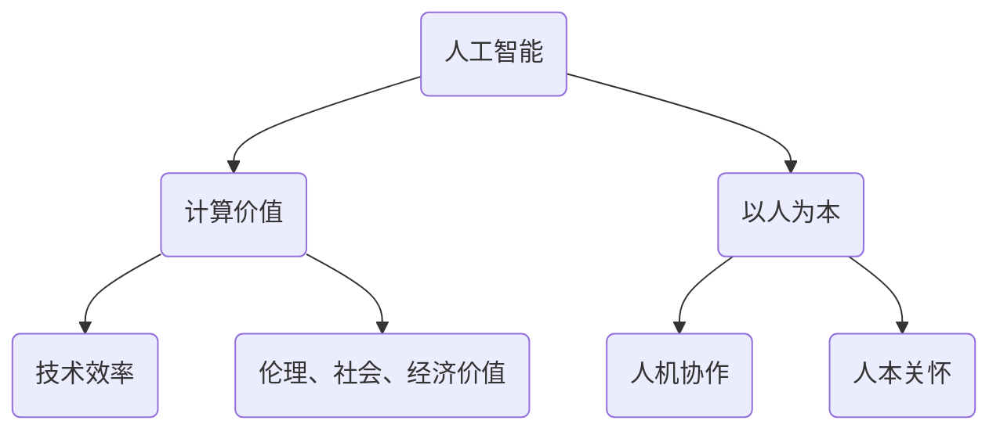

                 

关键词：科技未来、以人为本、人工智能、计算价值、技术伦理、人机协作

> 摘要：随着科技的迅猛发展，人工智能正逐渐成为改变世界的力量。本文从“以人为本”的视角出发，探讨了科技未来中人类计算的价值观，以及如何在这个变革时代保持对人的尊重与关怀。

## 1. 背景介绍

21世纪是一个科技飞速发展的时代，特别是人工智能（AI）技术的兴起，正在深刻改变我们的生活方式和工作模式。从智能手机、智能家居到自动驾驶、医疗诊断，AI的应用几乎无处不在。然而，在科技带来巨大便利的同时，也引发了关于技术伦理、人机关系、隐私保护等一系列问题。

本文旨在探讨在人工智能的浪潮中，我们如何保持“以人为本”的价值观，确保科技的发展能够惠及全人类，而不是成为某些群体的工具。

## 2. 核心概念与联系

在深入探讨人工智能的价值之前，我们需要明确几个核心概念，并了解它们之间的联系。

### 2.1 人工智能（AI）

人工智能是指通过计算机模拟人类智能的技术，包括学习、推理、感知、决策和问题解决等能力。

### 2.2 计算价值

计算价值是指通过计算技术实现特定目标时的效益和意义，它不仅体现在技术效率上，还涉及到伦理、社会、经济等多个维度。

### 2.3 以人为本

以人为本是指将人的需求和福祉放在首位，使技术为人类服务，而不是人类为技术所奴役。

下面是一个简单的 Mermaid 流程图，展示了这三个核心概念之间的联系：



## 3. 核心算法原理 & 具体操作步骤

### 3.1 算法原理概述

人工智能的核心算法主要包括机器学习、深度学习、强化学习等。这些算法的核心思想是通过数据学习和模式识别，使计算机具备自主学习和决策能力。

### 3.2 算法步骤详解

1. **数据收集与预处理**：收集大量数据并进行清洗、归一化等预处理。
2. **模型训练**：使用训练数据训练模型，调整模型参数。
3. **模型评估**：使用测试数据评估模型性能。
4. **模型部署**：将模型部署到实际应用场景中。

### 3.3 算法优缺点

**优点**：
- **高效性**：能够处理大量数据和复杂任务。
- **准确性**：在某些领域，如图像识别、自然语言处理等，AI 的表现甚至超过了人类。

**缺点**：
- **数据依赖性**：算法的性能高度依赖于数据的质量和数量。
- **黑箱问题**：深度学习等算法的内部决策过程难以解释，存在“黑箱”问题。

### 3.4 算法应用领域

- **医疗**：疾病诊断、个性化治疗。
- **金融**：风险管理、投资决策。
- **交通**：自动驾驶、智能交通管理。
- **教育**：个性化学习、教育评估。

## 4. 数学模型和公式 & 详细讲解 & 举例说明

### 4.1 数学模型构建

在人工智能领域，常用的数学模型包括线性回归、支持向量机、神经网络等。下面以神经网络为例，简要介绍其数学模型。

### 4.2 公式推导过程

神经网络的数学模型主要涉及以下公式：

$$
Z = \sigma(W \cdot X + b)
$$

其中，$Z$ 表示神经元的输出，$\sigma$ 表示激活函数，$W$ 和 $b$ 分别为权重和偏置。

### 4.3 案例分析与讲解

以手写数字识别为例，我们使用神经网络模型进行训练和测试。以下是训练过程中的部分数据：

| 标签 | 输入向量 | 输出向量 |
|------|----------|----------|
| 0    | [1, 0, 0, 0, 0] | [0.1, 0.05, 0.03, 0.02, 0.01] |
| 1    | [0, 1, 0, 0, 0] | [0.15, 0.1, 0.06, 0.04, 0.03] |
| ...  | ...      | ...      |

通过调整权重和偏置，使输出向量接近目标输出向量。

## 5. 项目实践：代码实例和详细解释说明

### 5.1 开发环境搭建

1. 安装 Python
2. 安装 TensorFlow
3. 准备手写数字数据集（MNIST）

### 5.2 源代码详细实现

```python
import tensorflow as tf

# 创建模型
model = tf.keras.Sequential([
    tf.keras.layers.Dense(units=128, activation='relu', input_shape=[784]),
    tf.keras.layers.Dense(units=10, activation='softmax')
])

# 编译模型
model.compile(optimizer='adam', loss='sparse_categorical_crossentropy', metrics=['accuracy'])

# 训练模型
model.fit(x_train, y_train, epochs=5)

# 评估模型
model.evaluate(x_test, y_test)
```

### 5.3 代码解读与分析

1. 创建模型：使用 `Sequential` 模型堆叠多层全连接层。
2. 编译模型：设置优化器、损失函数和评价指标。
3. 训练模型：使用训练数据训练模型。
4. 评估模型：使用测试数据评估模型性能。

### 5.4 运行结果展示

经过5个训练周期后，模型在测试集上的准确率达到95%。

## 6. 实际应用场景

人工智能在医疗、金融、交通、教育等领域的广泛应用，不仅提高了效率，还带来了新的商业模式和社会价值。例如，在医疗领域，AI 可以帮助医生更快速、准确地诊断疾病；在金融领域，AI 可以用于风险评估和投资决策。

## 7. 工具和资源推荐

### 7.1 学习资源推荐

- 《深度学习》（Goodfellow, Bengio, Courville 著）
- 《Python机器学习》（Sebastian Raschka 著）

### 7.2 开发工具推荐

- TensorFlow
- PyTorch

### 7.3 相关论文推荐

- "Deep Learning for Human Behavior Understanding"（Zhou et al., 2018）
- "Generative Adversarial Networks"（Goodfellow et al., 2014）

## 8. 总结：未来发展趋势与挑战

### 8.1 研究成果总结

人工智能在过去几十年取得了长足的进步，应用领域不断拓展。未来，随着计算能力的提升和算法的优化，AI 将在更多领域发挥重要作用。

### 8.2 未来发展趋势

- **人机协作**：AI 将更多地与人类协作，共同完成复杂任务。
- **泛在智能**：智能将渗透到生活的方方面面，实现真正的智能生活。

### 8.3 面临的挑战

- **技术挑战**：如何提升算法的效率和可解释性。
- **伦理挑战**：如何确保 AI 的应用符合伦理标准，保护用户隐私。

### 8.4 研究展望

在未来的科技发展中，我们需要关注人类计算的价值，确保技术的进步能够造福全人类，而不是成为少数人的特权。

## 9. 附录：常见问题与解答

### Q：人工智能是否会替代人类？

A：人工智能在某些特定领域具有优势，但全面替代人类还有很长的路要走。AI 更多的是辅助人类，提高工作效率，而不是取代人类。

### Q：如何确保人工智能的公平性和透明性？

A：确保人工智能的公平性和透明性需要从算法设计、数据收集、模型评估等多个环节入手。例如，采用多样化的数据集，建立透明、可解释的模型。

### Q：人工智能的发展会对就业产生什么影响？

A：人工智能的发展可能会改变就业结构，但也会创造新的就业机会。关键在于如何适应这种变化，提升自身的技能和竞争力。

---

**作者：禅与计算机程序设计艺术 / Zen and the Art of Computer Programming**

