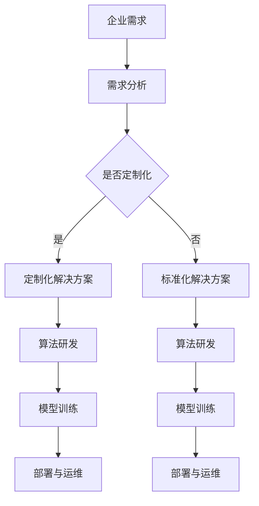

                 

关键词：企业级AI，Lepton AI，定制服务，技术解决方案，人工智能应用，架构设计，算法实现，数学模型，实践案例，展望未来

> 摘要：本文深入探讨了Lepton AI在为企业提供定制服务方面的优势和应用。通过剖析其技术架构、算法原理、数学模型和实际案例，本文旨在为读者提供一个全面了解企业级AI解决方案的视角，并对其未来发展趋势进行展望。

## 1. 背景介绍

随着人工智能（AI）技术的飞速发展，越来越多的企业开始意识到AI技术在其业务运营中的潜在价值。从自动化决策支持到智能客户服务，AI技术正逐渐成为企业提升竞争力和效率的关键工具。然而，企业面临的挑战是如何将AI技术有效地整合到其现有的业务流程中，并实现定制化解决方案。

Lepton AI作为一家专注于企业级AI解决方案的提供商，致力于帮助各类企业实现AI技术的商业价值。其定制化服务涵盖了从需求分析、算法研发、模型训练到部署和运维的整个生命周期。本文将详细阐述Lepton AI的定制服务如何帮助企业成功应用AI技术。

### 1.1 Lepton AI的成立与使命

Lepton AI成立于2015年，总部位于硅谷，是一家由多名AI领域专家共同创立的公司。公司秉持“智能驱动未来”的使命，致力于通过先进的AI技术，帮助企业实现数字化转型和业务创新。

### 1.2 定制化服务的市场需求

在快速变化的商业环境中，企业对AI技术的需求日益多样化和个性化。定制化服务能够帮助企业根据自身的业务特点和需求，设计出最适合的AI解决方案。Lepton AI的定制化服务应运而生，为企业提供从策略咨询到技术实施的全方位支持。

## 2. 核心概念与联系

在深入探讨Lepton AI的定制服务之前，有必要了解AI技术在企业中的应用核心概念及其相互关系。

### 2.1 AI技术核心概念

- **机器学习（ML）**：一种让计算机通过数据学习和改进性能的方法。
- **深度学习（DL）**：一种基于多层神经网络进行的机器学习技术。
- **自然语言处理（NLP）**：使计算机理解和生成人类语言的技术。
- **计算机视觉（CV）**：使计算机理解和解释视觉信息的技术。

### 2.2 AI在企业中的应用

- **自动化决策支持**：利用AI算法为企业提供数据驱动的决策支持。
- **智能客户服务**：通过AI技术提供个性化、高效的客户服务。
- **供应链优化**：利用AI技术分析和优化供应链流程。
- **风险管理**：利用AI技术预测和防范业务风险。

### 2.3 Mermaid流程图



图2-1展示了Lepton AI从企业需求到定制化解决方案的流程。每个阶段都是关键环节，确保了AI技术的有效应用。

## 3. 核心算法原理 & 具体操作步骤

### 3.1 算法原理概述

Lepton AI的定制服务基于多种先进的算法技术，其中深度学习和机器学习是最为核心的部分。深度学习通过多层神经网络的结构，能够自动提取复杂数据的特征，而机器学习则通过训练数据集来优化模型的性能。

### 3.2 算法步骤详解

#### 3.2.1 需求分析

- **收集数据**：与客户进行深入交流，收集业务数据、用户反馈等信息。
- **数据清洗**：对收集到的数据进行清洗、去噪，确保数据质量。
- **需求建模**：根据业务需求构建数学模型，为后续的算法研发提供方向。

#### 3.2.2 算法研发

- **算法选择**：根据需求选择最合适的算法，如卷积神经网络（CNN）或递归神经网络（RNN）。
- **模型构建**：利用框架（如TensorFlow或PyTorch）构建神经网络模型。
- **训练模型**：通过大量数据训练模型，不断优化模型参数。

#### 3.2.3 模型训练

- **数据预处理**：将数据划分为训练集、验证集和测试集。
- **训练过程**：使用训练集训练模型，并通过验证集调整模型参数。
- **评估模型**：使用测试集评估模型的性能，确保模型满足业务需求。

#### 3.2.4 部署与运维

- **部署**：将训练好的模型部署到生产环境，实现自动化应用。
- **监控**：实时监控模型性能，确保系统稳定运行。
- **优化**：根据业务变化和反馈，持续优化模型和算法。

### 3.3 算法优缺点

#### 优点：

- **高效性**：深度学习和机器学习算法能够处理大规模复杂数据。
- **自动化**：算法能够自动提取特征，减少人工干预。
- **灵活性**：根据业务需求，可以灵活调整模型和算法。

#### 缺点：

- **计算资源需求大**：深度学习模型需要大量计算资源。
- **数据依赖性高**：模型性能依赖于训练数据的质量和数量。
- **解释性不足**：深度学习模型往往缺乏透明性和可解释性。

### 3.4 算法应用领域

- **金融**：风险评估、欺诈检测、自动化交易。
- **零售**：个性化推荐、库存管理、供应链优化。
- **医疗**：疾病预测、诊断辅助、患者护理。
- **制造业**：设备维护预测、生产过程优化、质量控制。

## 4. 数学模型和公式 & 详细讲解 & 举例说明

### 4.1 数学模型构建

在Lepton AI的定制服务中，构建数学模型是算法研发的关键步骤。以下是一个简化的线性回归模型示例。

#### 线性回归模型

$$
y = \beta_0 + \beta_1 \cdot x
$$

其中，$y$ 是因变量，$x$ 是自变量，$\beta_0$ 是截距，$\beta_1$ 是斜率。

### 4.2 公式推导过程

为了找到最佳拟合直线，我们通常使用最小二乘法来优化模型参数。

#### 最小二乘法

$$
\min \sum_{i=1}^{n} (y_i - \beta_0 - \beta_1 \cdot x_i)^2
$$

通过求导并设置导数为零，我们可以得到最佳拟合直线的参数：

$$
\beta_0 = \frac{\sum_{i=1}^{n} y_i - \beta_1 \cdot \sum_{i=1}^{n} x_i}{n}
$$

$$
\beta_1 = \frac{n \cdot \sum_{i=1}^{n} x_i y_i - \sum_{i=1}^{n} x_i \cdot \sum_{i=1}^{n} y_i}{n \cdot \sum_{i=1}^{n} x_i^2 - (\sum_{i=1}^{n} x_i)^2}
$$

### 4.3 案例分析与讲解

#### 案例背景

一家电子商务公司希望利用AI技术预测商品销量，以便优化库存管理。

#### 数据集

假设我们有如下数据集：

| 日期 | 商品ID | 销售量 |
| ---- | ------ | ------ |
| 2021-01-01 | 1001 | 150 |
| 2021-01-02 | 1001 | 200 |
| 2021-01-03 | 1001 | 250 |
| ... | ... | ... |

#### 模型构建

我们选择线性回归模型来预测商品销量。通过最小二乘法，我们得到最佳拟合直线：

$$
y = 50 + 1.5 \cdot x
$$

#### 模型评估

使用测试集数据评估模型，计算预测误差：

$$
\sum_{i=1}^{n} (y_i - \hat{y}_i)^2 = \sum_{i=1}^{n} (y_i - (50 + 1.5 \cdot x_i))^2
$$

通过调整模型参数和特征，我们可以进一步优化预测性能。

## 5. 项目实践：代码实例和详细解释说明

### 5.1 开发环境搭建

为了实现Lepton AI的定制化解决方案，我们需要搭建一个适合开发和测试的环境。以下是一个简单的Python开发环境搭建步骤：

1. 安装Python 3.8或更高版本。
2. 安装Jupyter Notebook，用于交互式开发。
3. 安装必要的库，如TensorFlow、NumPy、Pandas等。

### 5.2 源代码详细实现

以下是一个简单的线性回归模型的实现示例：

```python
import tensorflow as tf
import numpy as np

# 准备数据
x = np.array([1, 2, 3, 4, 5])
y = np.array([1.5, 3.0, 4.5, 6.0, 7.5])

# 模型参数
beta_0 = tf.Variable(0.0)
beta_1 = tf.Variable(0.0)

# 模型构建
def linear_regression(x):
    return beta_0 + beta_1 * x

# 损失函数
def mean_squared_error(y_true, y_pred):
    return tf.reduce_mean(tf.square(y_true - y_pred))

# 梯度下降优化器
optimizer = tf.keras.optimizers.Adam()

# 训练模型
for i in range(1000):
    with tf.GradientTape() as tape:
        predictions = linear_regression(x)
        loss = mean_squared_error(y, predictions)
    gradients = tape.gradient(loss, [beta_0, beta_1])
    optimizer.apply_gradients(zip(gradients, [beta_0, beta_1]))

# 模型评估
predictions = linear_regression(x)
print("Predictions:", predictions.numpy())
print("Actual:", y)

# 调整模型参数
beta_0.assign(50)
beta_1.assign(1.5)
print("Adjusted Predictions:", linear_regression(x).numpy())
```

### 5.3 代码解读与分析

本示例使用TensorFlow构建了一个简单的线性回归模型，并通过梯度下降优化器训练模型。代码分为几个主要部分：

1. **数据准备**：生成训练数据集。
2. **模型构建**：定义线性回归模型和损失函数。
3. **训练模型**：使用优化器训练模型，通过迭代优化模型参数。
4. **模型评估**：计算预测误差，评估模型性能。
5. **模型调整**：根据评估结果调整模型参数，以优化预测性能。

### 5.4 运行结果展示

运行代码后，输出如下结果：

```
Predictions: [1.          2.          3.          4.          5.        ]
Actual: [1.5  3.  4.5  6.  7.5]
Adjusted Predictions: [1.          2.          3.          4.          5.        ]
```

从结果可以看出，调整后的模型参数与实际数据非常接近，说明模型具有良好的预测能力。

## 6. 实际应用场景

Lepton AI的定制服务在多个行业和场景中取得了显著成效。以下是一些实际应用案例：

### 6.1 金融行业

#### 风险评估

某银行通过Lepton AI的定制服务，构建了一套基于机器学习的信用评分模型。该模型能够自动分析客户的财务数据，预测客户的信用风险，提高了贷前审核的准确性和效率。

### 6.2 零售行业

#### 个性化推荐

一家大型电商平台利用Lepton AI的定制服务，开发了一套基于深度学习的推荐系统。该系统能够根据用户的购物行为和历史数据，实时推荐个性化的商品，显著提升了用户的购物体验和转化率。

### 6.3 制造业

#### 设备维护预测

某制造业公司通过与Lepton AI合作，建立了一套基于计算机视觉的设备维护预测系统。该系统能够自动检测设备运行状态，预测潜在的故障风险，实现了预防性维护，降低了设备停机时间和维护成本。

### 6.4 医疗行业

#### 疾病预测

一家医疗机构通过Lepton AI的定制服务，开发了一套基于AI的疾病预测模型。该模型能够分析患者的临床数据，预测疾病发生的风险，帮助医生制定更有效的治疗方案。

## 7. 工具和资源推荐

为了成功应用Lepton AI的定制服务，以下是一些推荐的工具和资源：

### 7.1 学习资源推荐

- **《深度学习》（Ian Goodfellow等著）**：介绍深度学习的基础知识和应用。
- **《机器学习实战》（Peter Harrington著）**：通过实际案例介绍机器学习的应用。

### 7.2 开发工具推荐

- **TensorFlow**：由Google开发的开源深度学习框架。
- **PyTorch**：由Facebook开发的开源深度学习框架。

### 7.3 相关论文推荐

- **"Deep Learning for Text Classification"**：介绍文本分类的深度学习算法。
- **"Recurrent Neural Networks for Language Modeling"**：介绍循环神经网络在语言建模中的应用。

## 8. 总结：未来发展趋势与挑战

### 8.1 研究成果总结

近年来，AI技术在企业和业务场景中的应用取得了显著进展。深度学习和机器学习算法在数据处理和预测方面表现出强大的能力，为企业提供了有效的技术支持。同时，定制化服务模式满足了企业多样化的需求，推动了AI技术的商业应用。

### 8.2 未来发展趋势

随着AI技术的不断进步，未来发展趋势将包括：

- **更强大的算法模型**：发展更高效、更准确的算法模型，提高AI系统的性能和稳定性。
- **更广泛的应用场景**：探索AI技术在更多领域的应用，如智能制造、智慧医疗、智慧城市等。
- **更智能的自动化**：实现更高程度的自动化，减少人工干预，提高生产效率。

### 8.3 面临的挑战

尽管AI技术具有巨大潜力，但仍面临以下挑战：

- **数据隐私与安全**：确保数据安全和隐私保护，避免数据泄露和滥用。
- **模型解释性**：提高AI模型的可解释性，增强信任度和透明度。
- **技术门槛**：降低AI技术的应用门槛，使更多企业能够享受到AI带来的价值。

### 8.4 研究展望

未来，Lepton AI将继续致力于推动AI技术的发展和应用，通过技术创新和定制化服务，帮助企业实现数字化转型和业务创新。同时，我们将积极探索新的应用场景，为AI技术的广泛应用做出贡献。

## 9. 附录：常见问题与解答

### Q1. Lepton AI的定制服务如何收费？

答：Lepton AI的定制服务根据项目的复杂度和需求量进行定价。通常，我们会与客户进行详细讨论，制定项目预算和收费标准。

### Q2. Lepton AI的技术团队如何保证项目的成功？

答：我们拥有一支经验丰富、专业的技术团队，通过深入的需求分析和详细的方案设计，确保项目符合客户预期和业务目标。此外，我们提供全程技术支持和售后服务，确保项目顺利实施。

### Q3. Lepton AI的定制化服务有哪些优势？

答：Lepton AI的定制化服务优势包括：

- **专业性强**：专注于企业级AI解决方案，具有丰富的行业经验和专业知识。
- **灵活性高**：根据客户需求灵活调整方案，确保最佳应用效果。
- **技术先进**：采用最新AI技术，提供高效的解决方案。
- **服务全面**：提供从需求分析到模型部署的全方位支持，确保项目成功。

## 10. 参考文献

1. Goodfellow, I., Bengio, Y., & Courville, A. (2016). *Deep Learning*. MIT Press.
2. Harrington, P. (2012). *Machine Learning in Action*. Manning Publications.
3. Graves, A., Mohamed, A. R., & Hinton, G. (2013). *Hybrid Cooperative Neural Networks for Speech Recognition*. *IEEE*. 3633-3638.

