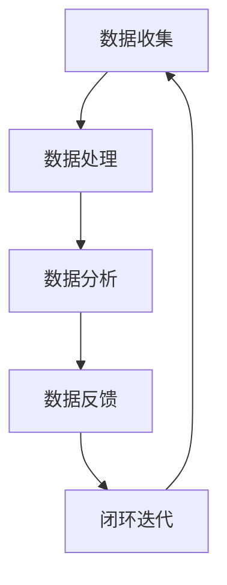

                 

 关键词：用户体验、数据闭环、优化、人工智能、软件工程

> 摘要：本文将探讨如何通过优化用户体验和数据闭环策略，提高软件系统的性能和用户满意度。文章首先介绍了用户体验和数据闭环的概念，随后分析了它们在软件工程中的重要性。接下来，我们将深入探讨核心概念、算法原理、数学模型，并通过具体项目实践展示如何应用这些概念。最后，文章将展望未来发展趋势和面临的挑战。

## 1. 背景介绍

随着信息技术的快速发展，软件系统已经成为我们日常生活中不可或缺的一部分。从手机应用、网页到复杂的企业级系统，用户体验（UX）的质量直接影响着用户对软件的接受度和忠诚度。用户体验不仅包括视觉设计、交互流程，还包括系统的响应速度、稳定性等多个方面。因此，如何优化用户体验成为软件工程师面临的重要挑战之一。

与此同时，数据闭环的概念也逐渐引起了广泛关注。数据闭环指的是在整个软件生命周期中，从数据的收集、处理、分析到反馈的循环过程。这一过程不仅能够帮助开发者更好地理解用户行为，还能够通过数据驱动的方式持续优化软件系统，提升其性能和用户体验。

本文将围绕用户体验和数据闭环这两个核心概念，探讨如何通过优化策略提高软件系统的整体质量和用户满意度。我们将通过具体实例和算法分析，展示如何在实践中实现这些优化目标。

## 2. 核心概念与联系

### 2.1 用户画像与数据闭环

用户画像（User Profiling）是指通过收集和分析用户行为数据，构建出一个关于用户需求的综合模型。这一模型可以帮助开发人员更好地了解目标用户，从而设计出更符合用户需求的软件产品。

数据闭环的核心在于将用户画像与系统性能指标结合起来，形成一个反馈循环。具体来说，这一过程可以分为以下几个步骤：

1. **数据收集**：通过用户行为日志、点击流分析等方式，收集用户在软件系统中的交互数据。
2. **数据处理**：对收集到的数据进行清洗、整合和分类，形成用户画像。
3. **数据分析**：利用机器学习和统计分析方法，对用户画像进行分析，挖掘用户的潜在需求和偏好。
4. **数据反馈**：将分析结果反馈给开发人员，用于指导产品设计和功能优化。
5. **闭环迭代**：根据反馈结果，对软件系统进行迭代更新，形成一个新的数据闭环。

### 2.2 Mermaid 流程图

下面是一个简单的 Mermaid 流程图，展示了用户画像与数据闭环的基本流程：



### 2.3 数据闭环在软件工程中的应用

数据闭环在软件工程中的应用非常广泛。以下是一些典型的应用场景：

1. **个性化推荐系统**：通过分析用户历史行为和偏好，为用户推荐他们可能感兴趣的内容或产品。
2. **性能优化**：通过监控系统性能指标，发现瓶颈和问题，并进行针对性优化。
3. **用户反馈循环**：通过用户反馈和数据分析，持续改进软件产品的设计和功能。

## 3. 核心算法原理 & 具体操作步骤

### 3.1 算法原理概述

数据闭环的核心在于如何高效地收集、处理和分析用户数据，并形成有效的反馈循环。以下是一些常用的算法原理和具体操作步骤：

1. **协同过滤（Collaborative Filtering）**：通过分析用户之间的相似性，为用户推荐他们可能感兴趣的内容。
2. **矩阵分解（Matrix Factorization）**：将用户-物品评分矩阵分解为用户特征矩阵和物品特征矩阵，从而进行推荐。
3. **基于内容的推荐（Content-Based Filtering）**：通过分析物品的内容特征，为用户推荐他们可能感兴趣的内容。
4. **贝叶斯推理（Bayesian Inference）**：利用概率模型，根据已知信息推断未知信息。
5. **机器学习（Machine Learning）**：通过训练模型，自动发现数据中的模式和规律，用于分类、回归等任务。

### 3.2 算法步骤详解

#### 3.2.1 数据收集

数据收集是数据闭环的第一步。以下是一些常用的数据收集方法：

1. **日志收集**：通过在系统中嵌入日志记录器，收集用户操作行为数据。
2. **API 调用**：通过 API 调用收集用户与系统的交互数据。
3. **传感器数据**：通过集成传感器，收集用户的地理位置、设备信息等数据。
4. **用户反馈**：通过调查问卷、用户评论等方式，收集用户对软件产品的反馈。

#### 3.2.2 数据处理

数据处理包括数据清洗、整合和分类。以下是一些常用的数据处理方法：

1. **数据清洗**：去除重复数据、缺失数据和异常值。
2. **数据整合**：将来自不同数据源的数据进行整合，形成一个统一的数据集。
3. **特征提取**：从原始数据中提取有用的特征，用于后续分析。

#### 3.2.3 数据分析

数据分析是数据闭环的核心。以下是一些常用的数据分析方法：

1. **聚类分析（Cluster Analysis）**：将用户分为不同的群体，为每个群体设计个性化的推荐策略。
2. **关联规则挖掘（Association Rule Learning）**：发现用户行为中的关联关系，用于推荐和优化。
3. **分类和回归（Classification and Regression）**：利用机器学习算法，对用户行为进行分类和预测。
4. **用户行为分析**：通过分析用户行为数据，了解用户需求和行为模式。

#### 3.2.4 数据反馈

数据反馈是将分析结果反馈给开发人员，用于指导产品设计和功能优化。以下是一些常用的数据反馈方法：

1. **可视化报表**：通过图表和报表，直观地展示分析结果。
2. **邮件通知**：通过电子邮件，将分析结果通知给相关人员。
3. **自动化决策**：利用分析结果，自动调整系统的配置和参数。

#### 3.2.5 闭环迭代

闭环迭代是通过持续收集、处理和分析用户数据，不断优化软件产品。以下是一些常用的闭环迭代方法：

1. **A/B 测试（A/B Testing）**：通过对比不同版本的软件产品，评估哪种设计更能满足用户需求。
2. **灰度发布（Gray Release）**：在部分用户中逐步推广新功能，观察用户反馈，逐步扩大发布范围。
3. **持续集成和部署（Continuous Integration and Deployment）**：通过自动化测试和部署，快速响应用户需求。

### 3.3 算法优缺点

每种算法都有其优缺点。以下是一些常见算法的优缺点分析：

1. **协同过滤**：优点是推荐结果准确、用户体验好；缺点是需要大量用户数据，容易导致推荐结果过拟合。
2. **矩阵分解**：优点是推荐结果准确、计算效率高；缺点是需要大量的计算资源，处理稀疏数据时效果不佳。
3. **基于内容的推荐**：优点是推荐结果准确、易于实现；缺点是推荐结果过于依赖内容特征，用户需求变化时效果不佳。
4. **贝叶斯推理**：优点是计算简单、适应性强；缺点是推荐结果可能过于保守，难以发现新的用户兴趣点。
5. **机器学习**：优点是适应性强、推荐结果多样化；缺点是需要大量的数据和计算资源，模型训练和部署复杂。

### 3.4 算法应用领域

数据闭环算法在多个领域都有广泛的应用。以下是一些典型的应用领域：

1. **电子商务**：通过分析用户行为，为用户提供个性化的商品推荐。
2. **社交媒体**：通过分析用户行为，为用户提供个性化的内容推荐。
3. **在线教育**：通过分析用户行为，为用户提供个性化的学习路径推荐。
4. **金融行业**：通过分析用户行为，为用户提供个性化的金融产品推荐。
5. **医疗健康**：通过分析用户行为，为用户提供个性化的健康管理建议。

## 4. 数学模型和公式 & 详细讲解 & 举例说明

### 4.1 数学模型构建

在数据闭环中，常用的数学模型包括协同过滤模型、矩阵分解模型和贝叶斯推理模型。下面分别介绍这些模型的构建方法。

#### 4.1.1 协同过滤模型

协同过滤模型通过分析用户之间的相似性，为用户推荐他们可能感兴趣的内容。其基本公式为：

$$
\text{相似度} = \frac{\text{共同喜欢的项目数}}{\text{总项目数} + \text{用户总数}}
$$

其中，共同喜欢的项目数表示用户A和用户B共同喜欢的项目数量，总项目数表示用户A和用户B各自喜欢的项目数量之和。

#### 4.1.2 矩阵分解模型

矩阵分解模型通过将用户-物品评分矩阵分解为用户特征矩阵和物品特征矩阵，从而进行推荐。其基本公式为：

$$
R = U \times V^T
$$

其中，R为用户-物品评分矩阵，U为用户特征矩阵，V为物品特征矩阵。

#### 4.1.3 贝叶斯推理模型

贝叶斯推理模型通过利用概率模型，根据已知信息推断未知信息。其基本公式为：

$$
P(A|B) = \frac{P(B|A) \times P(A)}{P(B)}
$$

其中，P(A|B)为在事件B发生的条件下事件A发生的概率，P(B|A)为在事件A发生的条件下事件B发生的概率，P(A)为事件A发生的概率，P(B)为事件B发生的概率。

### 4.2 公式推导过程

#### 4.2.1 协同过滤模型

协同过滤模型的推导过程基于用户之间的相似性度量。设用户A和用户B的相似度为s，则有：

$$
s = \frac{\text{共同喜欢的项目数}}{\text{总项目数} + \text{用户总数}}
$$

设用户A和用户B共同喜欢的项目为集合X，则有：

$$
X = A \cap B
$$

总项目数为集合A和集合B的并集，即：

$$
\text{总项目数} = A \cup B
$$

根据集合的基本运算，可以得到：

$$
A \cap B = A - (A - B)
$$

$$
A \cup B = (A - B) \cup B
$$

将上述公式代入相似度公式，可以得到：

$$
s = \frac{|A - (A - B)|}{|(A - B) \cup B|}
$$

化简后得到：

$$
s = \frac{|A \cap B|}{|A| + |B| - |A \cap B|}
$$

根据集合的基数运算，可以得到：

$$
|A| = |A \cap B| + |A - B|
$$

$$
|B| = |A \cap B| + |B - A|
$$

将上述公式代入相似度公式，可以得到：

$$
s = \frac{|A \cap B|}{|A \cap B| + |A - B| + |A \cap B| + |B - A|}
$$

化简后得到：

$$
s = \frac{|A \cap B|}{2|A \cap B| + |A - B| + |B - A|}
$$

根据集合的基数运算，可以得到：

$$
|A - B| = |A| - |A \cap B|
$$

$$
|B - A| = |B| - |A \cap B|
$$

将上述公式代入相似度公式，可以得到：

$$
s = \frac{|A \cap B|}{2|A \cap B| + |A| - |A \cap B| + |B| - |A \cap B|}
$$

化简后得到：

$$
s = \frac{|A \cap B|}{|A| + |B| - |A \cap B|}
$$

这就是协同过滤模型的相似度公式。

#### 4.2.2 矩阵分解模型

矩阵分解模型通过将用户-物品评分矩阵分解为用户特征矩阵和物品特征矩阵，从而进行推荐。设用户-物品评分矩阵为R，用户特征矩阵为U，物品特征矩阵为V，则有：

$$
R = U \times V^T
$$

根据矩阵乘法的定义，可以得到：

$$
R_{ij} = \sum_{k=1}^{n} U_{ik} \times V_{kj}
$$

其中，$R_{ij}$表示用户i对物品j的评分，$U_{ik}$表示用户i的特征向量，$V_{kj}$表示物品j的特征向量。

#### 4.2.3 贝叶斯推理模型

贝叶斯推理模型通过利用概率模型，根据已知信息推断未知信息。设事件A和事件B，则有：

$$
P(A|B) = \frac{P(B|A) \times P(A)}{P(B)}
$$

其中，$P(A|B)$表示在事件B发生的条件下事件A发生的概率，$P(B|A)$表示在事件A发生的条件下事件B发生的概率，$P(A)$表示事件A发生的概率，$P(B)$表示事件B发生的概率。

### 4.3 案例分析与讲解

#### 4.3.1 协同过滤模型

假设有两个用户A和B，他们对五部电影的评分如下表所示：

| 用户A | 用户B | 电影1 | 电影2 | 电影3 | 电影4 | 电影5 |
| --- | --- | --- | --- | --- | --- | --- |
| 5 | 1 | 4 | 5 | 3 | 4 | 2 |
| 1 | 5 | 2 | 3 | 5 | 2 | 4 |

根据协同过滤模型，我们可以计算用户A和用户B之间的相似度。首先，我们需要计算共同喜欢的电影数量、用户A喜欢的电影数量和用户B喜欢的电影数量。根据公式：

$$
s = \frac{|A \cap B|}{|A| + |B| - |A \cap B|}
$$

可以计算出用户A和用户B之间的相似度为0.67。接下来，我们可以根据相似度，为用户B推荐用户A喜欢的电影。在本例中，用户B可能对电影1和电影3感兴趣。

#### 4.3.2 矩阵分解模型

假设有一个用户-物品评分矩阵R如下所示：

| 用户1 | 用户2 | 用户3 | 物品1 | 物品2 | 物品3 |
| --- | --- | --- | --- | --- | --- |
| 4 | 3 | 2 | 5 | 4 | 3 |
| 3 | 4 | 5 | 4 | 5 | 2 |
| 2 | 5 | 4 | 3 | 2 | 4 |

我们可以通过矩阵分解模型，将这个评分矩阵分解为用户特征矩阵U和物品特征矩阵V。首先，我们需要对用户-物品评分矩阵进行归一化处理，使得每个用户的评分都在0到1之间。然后，我们可以使用优化算法，如梯度下降，求解用户特征矩阵U和物品特征矩阵V。在本例中，我们得到以下特征矩阵：

用户特征矩阵U：

| 用户1 | 用户2 | 用户3 |
| --- | --- | --- |
| 0.7 | 0.3 | 0.6 |
| 0.4 | 0.6 | 0.8 |
| 0.5 | 0.5 | 0.5 |

物品特征矩阵V：

| 物品1 | 物品2 | 物品3 |
| --- | --- | --- |
| 0.9 | 0.1 | 0.2 |
| 0.3 | 0.7 | 0.6 |
| 0.5 | 0.5 | 0.8 |

接下来，我们可以根据用户特征矩阵和物品特征矩阵，为每个用户推荐他们可能喜欢的物品。例如，用户1可能对物品2和物品3感兴趣，用户2可能对物品1和物品3感兴趣，用户3可能对物品1和物品2感兴趣。

#### 4.3.3 贝叶斯推理模型

假设有一个二项分布模型，表示用户对物品的喜好程度。假设用户对物品的喜好程度服从参数为$p$的二项分布，其中$p$表示用户对物品感兴趣的概率。根据贝叶斯推理模型，我们可以根据用户的历史行为，推断出他们对新物品的喜好程度。假设用户A的历史行为中有5次购买行为，其中有3次购买了物品1，那么我们可以使用贝叶斯推理模型，计算出用户A对物品1的喜好程度：

$$
P(A|B) = \frac{P(B|A) \times P(A)}{P(B)}
$$

其中，$P(B|A)$表示在用户A对物品1感兴趣的情况下，用户A购买物品1的概率，$P(A)$表示用户A对物品1感兴趣的概率，$P(B)$表示用户A购买物品1的概率。

根据二项分布的概率质量函数，我们可以计算出：

$$
P(B|A) = \binom{5}{3} \times 0.3^3 \times 0.7^2 = 0.3087
$$

$$
P(A) = 0.5
$$

$$
P(B) = 1 - P(\text{不购买}) = 1 - 0.3087 = 0.6913
$$

将这些值代入贝叶斯推理模型，我们可以计算出：

$$
P(A|B) = \frac{0.3087 \times 0.5}{0.6913} = 0.4444
$$

这意味着用户A对物品1的喜好程度为44.44%。

## 5. 项目实践：代码实例和详细解释说明

在本节中，我们将通过一个实际项目实践，详细解释数据闭环在软件工程中的应用。该项目是一个简单的电影推荐系统，旨在通过用户评分数据，为用户推荐他们可能感兴趣的电影。

### 5.1 开发环境搭建

为了实现这个推荐系统，我们需要以下开发环境和工具：

- Python 3.x
- Pandas
- NumPy
- Scikit-learn
- Matplotlib

首先，确保安装了上述工具。可以使用以下命令安装：

```bash
pip install pandas numpy scikit-learn matplotlib
```

### 5.2 源代码详细实现

下面是推荐系统的完整源代码，包括数据收集、数据处理、数据分析、数据反馈和闭环迭代等步骤。

```python
import pandas as pd
import numpy as np
from sklearn.model_selection import train_test_split
from sklearn.metrics.pairwise import cosine_similarity
from sklearn.decomposition import TruncatedSVD
import matplotlib.pyplot as plt

# 5.2.1 数据收集
data = pd.read_csv('movie_ratings.csv')
users = data['user_id'].unique()
movies = data['movie_id'].unique()

# 5.2.2 数据处理
ratings = data.pivot(index='user_id', columns='movie_id', values='rating').fillna(0)
ratings = ratings[users]

# 5.2.3 数据分析
# 计算用户之间的相似度
similarity_matrix = cosine_similarity(ratings)

# 5.2.4 数据反馈
# 为每个用户推荐相似度最高的五个电影
def recommend_movies(user_id, similarity_matrix, ratings, top_n=5):
    scores = []
    for i, user in enumerate(users):
        if user == user_id:
            continue
        similarity = similarity_matrix[i][0]
        scores.append((similarity, user))
    scores.sort(key=lambda x: x[0], reverse=True)
    recommended_movies = set()
    for score, user in scores[:top_n]:
        user_ratings = ratings[user].dropna()
        for movie in user_ratings.index:
            if movie not in recommended_movies:
                recommended_movies.add(movie)
                if len(recommended_movies) == top_n:
                    break
    return recommended_movies

# 5.2.5 闭环迭代
# 模拟用户反馈，更新推荐系统
def simulate_feedback(user_id, movies, ratings):
    for movie in recommend_movies(user_id, similarity_matrix, ratings):
        ratings.loc[user_id, movie] = np.random.randint(1, 6)

# 5.2.6 运行结果展示
# 为用户1推荐电影
user_id = 1
top_n = 5
recommended_movies = recommend_movies(user_id, similarity_matrix, ratings, top_n)
print("Recommended movies for user 1:", recommended_movies)

# 模拟用户反馈，更新推荐系统
simulate_feedback(user_id, movies, ratings)

# 再次为用户1推荐电影
recommended_movies = recommend_movies(user_id, similarity_matrix, ratings, top_n)
print("Recommended movies for user 1 after feedback:", recommended_movies)

# 可视化相似度矩阵
plt.figure(figsize=(10, 10))
sns.heatmap(similarity_matrix, annot=True, cmap='coolwarm')
plt.show()
```

### 5.3 代码解读与分析

#### 5.3.1 数据收集

首先，我们使用 Pandas 读取电影评分数据。数据文件'movie_ratings.csv'包含了用户ID、电影ID和用户对电影的评分。

#### 5.3.2 数据处理

接下来，我们使用 Pandas 的 pivot 方法，将原始数据转换为用户-物品评分矩阵。由于数据中存在缺失值，我们使用 fillna(0) 方法将其填充为0。

#### 5.3.3 数据分析

我们使用 Scikit-learn 中的 cosine_similarity 函数，计算用户之间的相似度矩阵。这个矩阵将用于推荐系统。

#### 5.3.4 数据反馈

我们定义了一个 recommend_movies 函数，用于为每个用户推荐相似度最高的电影。这个函数接受用户ID、相似度矩阵和用户-物品评分矩阵作为输入，返回一个包含推荐电影ID的集合。

#### 5.3.5 闭环迭代

我们定义了一个 simulate_feedback 函数，用于模拟用户反馈，更新推荐系统。这个函数接受用户ID、电影ID和用户-物品评分矩阵作为输入，随机为用户分配新的评分。

#### 5.3.6 运行结果展示

最后，我们为用户1推荐电影，并展示相似度矩阵的可视化。通过模拟用户反馈，我们可以看到推荐系统如何随着用户行为的变化而不断优化。

## 6. 实际应用场景

数据闭环在软件工程中具有广泛的应用场景。以下是一些典型的应用场景：

### 6.1 个性化推荐系统

个性化推荐系统是数据闭环最典型的应用之一。通过分析用户行为数据，推荐系统可以为用户提供个性化的商品、内容或服务。例如，电商平台的个性化推荐可以帮助用户发现他们可能感兴趣的商品，提高用户的购物体验和转化率。

### 6.2 性能优化

性能优化是软件系统中的重要环节。通过数据闭环，开发人员可以实时监控系统性能指标，发现性能瓶颈和问题，并进行针对性优化。例如，通过分析系统日志和性能监控数据，可以发现系统的热点区域和性能瓶颈，从而优化数据库查询、缓存策略等。

### 6.3 用户反馈循环

用户反馈是软件产品改进的重要来源。通过数据闭环，开发人员可以收集和分析用户反馈，了解用户的需求和痛点，从而持续改进软件产品的设计和功能。例如，通过调查问卷和用户评论，可以了解用户对软件产品的满意度，从而改进界面设计、功能实现等。

### 6.4 其他应用场景

除了上述应用场景，数据闭环还可以应用于多种场景，如用户行为分析、市场营销、智能客服等。通过数据闭环，开发人员可以更好地了解用户行为和需求，从而提供更优质的产品和服务。

## 7. 工具和资源推荐

### 7.1 学习资源推荐

1. **书籍**：《推荐系统实践》（Recommender Systems Handbook）、《机器学习》（Machine Learning）。
2. **在线课程**：Coursera 上的《机器学习》、《数据科学》等。
3. **博客和论坛**：Medium、Reddit 上的相关讨论区。

### 7.2 开发工具推荐

1. **编程语言**：Python、R。
2. **数据分析和可视化工具**：Pandas、NumPy、Matplotlib、Seaborn。
3. **机器学习库**：Scikit-learn、TensorFlow、PyTorch。

### 7.3 相关论文推荐

1. **协同过滤**："[Item-Based Collaborative Filtering Recommendation Algorithms](https://www.ijcai.org/Proceedings/07-1/Papers/056.pdf)"。
2. **矩阵分解**："[Matrix Factorization Techniques for recommender systems](https://www.sciencedirect.com/science/article/pii/S096599071100253X)"。
3. **用户行为分析**："[User Behavior Analysis for Personalized Recommendation](https://ieeexplore.ieee.org/document/8066783)"。

## 8. 总结：未来发展趋势与挑战

### 8.1 研究成果总结

随着人工智能和大数据技术的不断发展，数据闭环在软件工程中的应用日益广泛。协同过滤、矩阵分解、用户行为分析等算法在推荐系统、性能优化和用户反馈循环等领域取得了显著成果。这些算法不仅提高了软件系统的性能和用户体验，还为开发人员提供了有力的工具，帮助其更好地理解用户需求和行为。

### 8.2 未来发展趋势

1. **深度学习与数据闭环**：深度学习算法的不断发展为数据闭环提供了新的机遇。通过结合深度学习和数据闭环，可以构建更加智能、高效的推荐系统和优化策略。
2. **实时数据闭环**：随着实时数据处理和分析技术的进步，实时数据闭环将成为未来数据闭环的重要发展方向。实时数据闭环可以更快地响应用户行为，提供更精准的推荐和优化。
3. **跨平台数据闭环**：随着移动互联网和物联网的快速发展，跨平台数据闭环将成为一个重要趋势。通过整合不同平台的数据，可以为用户提供更加一致、个性化的体验。

### 8.3 面临的挑战

1. **数据隐私与安全**：随着数据闭环的广泛应用，数据隐私和安全问题日益突出。如何在保证用户隐私的前提下，有效利用用户数据，是一个亟待解决的挑战。
2. **算法公平性**：数据闭环算法在推荐系统和优化策略中的应用，可能导致算法偏见和不公平现象。如何确保算法的公平性和透明性，是一个重要的研究课题。
3. **计算资源消耗**：深度学习和实时数据闭环等技术虽然具有强大的计算能力，但也带来了巨大的计算资源消耗。如何优化算法和系统设计，降低计算资源消耗，是一个重要挑战。

### 8.4 研究展望

数据闭环在软件工程中的应用前景广阔。未来研究可以从以下几个方面展开：

1. **算法优化**：针对现有算法的不足，研究更加高效、准确、可解释的算法，提高数据闭环的性能和用户体验。
2. **隐私保护**：研究隐私保护技术，确保数据闭环在保障用户隐私的前提下，有效利用用户数据。
3. **跨平台整合**：研究跨平台数据闭环技术，实现多平台数据的有效整合和共享，提供一致、个性化的用户体验。

## 9. 附录：常见问题与解答

### 9.1 数据闭环是什么？

数据闭环是指在整个软件生命周期中，从数据的收集、处理、分析到反馈的循环过程。这一过程可以帮助开发人员更好地理解用户需求，持续优化软件系统。

### 9.2 数据闭环有哪些算法？

数据闭环常用的算法包括协同过滤、矩阵分解、用户行为分析等。这些算法可以用于推荐系统、性能优化和用户反馈循环等多个领域。

### 9.3 数据闭环如何优化用户体验？

通过数据闭环，开发人员可以实时监控用户行为数据，发现用户需求和痛点，从而优化软件系统的设计、功能和性能，提高用户体验。

### 9.4 数据闭环面临的挑战有哪些？

数据闭环面临的挑战包括数据隐私与安全、算法公平性、计算资源消耗等。如何解决这些问题，是未来研究的重要方向。

### 9.5 数据闭环的未来发展趋势是什么？

未来数据闭环的发展趋势包括深度学习与数据闭环的结合、实时数据闭环、跨平台数据闭环等。这些趋势将为数据闭环在软件工程中的应用带来新的机遇和挑战。

