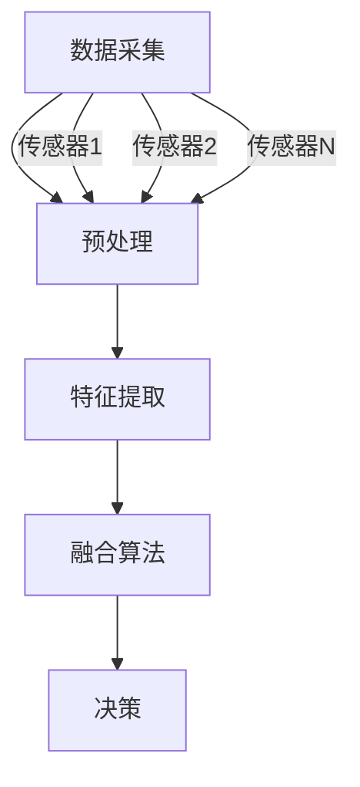

                 

关键词：传感器融合、数据准确性、多传感器数据融合、算法、应用场景

> 摘要：本文探讨了传感器融合技术，一种用于提高数据准确性的重要方法。通过对传感器融合的基本概念、核心算法、数学模型、实际应用案例、未来展望以及面临的挑战进行详细分析，旨在为读者提供全面的技术参考。

## 1. 背景介绍

在当今信息时代，传感器技术已经成为获取环境数据的重要手段。从智能家居、工业自动化到医疗监测和自动驾驶，传感器的应用无处不在。然而，单个传感器往往存在测量误差、不完全感知等问题，这限制了数据的准确性和可靠性。为了克服这些局限性，传感器融合技术应运而生。

传感器融合技术旨在通过综合多个传感器的数据，提高系统的感知能力和决策准确性。这一方法不仅在提高数据质量上具有显著优势，还能够在复杂环境中实现更加智能化的决策支持。

## 2. 核心概念与联系

### 2.1 基本概念

传感器融合（Sensor Fusion）是指将来自多个传感器或多个信源的信息进行综合处理，以获得更高可靠性、更高精度或更丰富的信息输出。传感器融合系统通常包含以下几个关键组成部分：

- **数据采集模块**：从各种传感器获取原始数据。
- **预处理模块**：对原始数据进行滤波、去噪、归一化等预处理。
- **特征提取模块**：从预处理后的数据中提取有用的特征信息。
- **融合算法模块**：利用特定算法对特征信息进行融合处理。
- **决策模块**：根据融合后的信息进行决策或推理。

### 2.2 核心算法原理

传感器融合的核心在于如何有效地融合来自多个传感器的信息。以下是几种常见的融合算法：

1. **卡尔曼滤波**：通过预测和更新步骤，递归地融合观测数据，以估计系统的状态。
2. **贝叶斯滤波**：基于贝叶斯定理，利用先验知识和观测数据更新状态估计。
3. **粒子滤波**：使用一组随机样本（粒子）来表示状态估计的分布，适用于非线性和非高斯模型。
4. **融合规则**：如最小均方误差（MSE）融合、最大后验概率（MAP）融合等，通过特定规则结合多个传感器的观测数据。

### 2.3 Mermaid 流程图

下面是一个简单的传感器融合流程图：



## 3. 核心算法原理 & 具体操作步骤

### 3.1 算法原理概述

传感器融合的核心算法通常基于概率统计理论，以下简要介绍几种常见的融合算法：

- **卡尔曼滤波**：用于线性高斯系统，通过递归更新状态估计，以达到最小化均方误差。
- **扩展卡尔曼滤波**：适用于非线性系统，通过对非线性函数进行线性化处理，使用卡尔曼滤波器进行估计。
- **无迹卡尔曼滤波**：用于非线性非高斯系统，通过无迹变换（ Unscented Transform ）来近似状态的后验概率分布。
- **粒子滤波**：适用于复杂非线性、非高斯系统，通过随机采样和重要性权重更新来实现状态估计。

### 3.2 算法步骤详解

以卡尔曼滤波为例，其基本步骤如下：

1. **状态预测**：根据系统模型，预测下一时刻的状态。
2. **预测更新**：结合观测数据，对预测状态进行更新。
3. **观测更新**：结合预测误差和观测误差，进一步更新状态估计。

### 3.3 算法优缺点

- **卡尔曼滤波**：优点在于计算高效、稳定性好；缺点是适用于线性高斯系统，对于非线性或非高斯系统，性能可能较差。
- **扩展卡尔曼滤波**：优点是适用于非线性系统；缺点是线性化误差可能导致性能下降。
- **无迹卡尔曼滤波**：优点是适用于非线性非高斯系统；缺点是计算复杂度较高。
- **粒子滤波**：优点是适用于复杂非线性、非高斯系统；缺点是计算量大，计算效率较低。

### 3.4 算法应用领域

传感器融合算法在多个领域有着广泛的应用，包括：

- **自动驾驶**：用于车辆状态估计、障碍物检测等。
- **机器人导航**：用于路径规划、障碍物避让等。
- **智能监控**：用于目标跟踪、异常检测等。
- **医疗监测**：用于患者健康状态监测、疾病预测等。

## 4. 数学模型和公式 & 详细讲解 & 举例说明

### 4.1 数学模型构建

传感器融合的数学模型通常基于概率统计理论，以下以卡尔曼滤波为例进行说明。

- **状态空间模型**：
  $$ x_t = A_t x_{t-1} + B_t u_t $$
  $$ z_t = H_t x_t + v_t $$
  其中，$x_t$ 表示状态向量，$u_t$ 表示控制输入，$z_t$ 表示观测向量，$v_t$ 表示观测噪声。

- **预测步骤**：
  $$ \hat{x}_{t|t-1} = A_t \hat{x}_{t-1|t-1} + B_t u_t $$
  $$ P_{t|t-1} = A_t P_{t-1|t-1} A_t^T + Q_t $$
  其中，$\hat{x}_{t|t-1}$ 表示预测状态，$P_{t|t-1}$ 表示预测误差协方差。

- **更新步骤**：
  $$ K_t = P_{t|t-1} H_t^T (H_t P_{t|t-1} H_t^T + R_t)^{-1} $$
  $$ \hat{x}_{t|t} = \hat{x}_{t|t-1} + K_t (z_t - H_t \hat{x}_{t|t-1}) $$
  $$ P_{t|t} = (I - K_t H_t) P_{t|t-1} $$
  其中，$K_t$ 表示卡尔曼增益，$R_t$ 表示观测噪声协方差。

### 4.2 公式推导过程

卡尔曼滤波的推导过程涉及多个步骤，以下简要介绍：

1. **预测误差协方差**：
   $$ P_{t|t-1} = E[(x_t - \hat{x}_{t|t-1})(x_t - \hat{x}_{t|t-1})^T] $$
   通过状态转移矩阵 $A_t$ 和控制输入 $B_t$ ，可以推导出预测误差协方差。

2. **卡尔曼增益**：
   $$ K_t = \frac{P_{t|t-1} H_t^T}{H_t P_{t|t-1} H_t^T + R_t} $$
   卡尔曼增益是预测误差协方差和观测噪声协方差的比值。

3. **更新步骤**：
   $$ \hat{x}_{t|t} = \hat{x}_{t|t-1} + K_t (z_t - H_t \hat{x}_{t|t-1}) $$
   更新步骤通过卡尔曼增益对预测状态进行修正。

### 4.3 案例分析与讲解

假设一个简单的线性系统，状态方程为：
$$ x_t = 2x_{t-1} + u_t $$
观测方程为：
$$ z_t = x_t + v_t $$
其中，$u_t$ 是控制输入，$v_t$ 是观测噪声。

通过构建状态空间模型，可以推导出卡尔曼滤波的具体公式：

1. **初始状态**：
   $$ \hat{x}_0 = 0 $$
   $$ P_0 = \text{diag}(10, 1) $$

2. **预测步骤**：
   $$ \hat{x}_{t|t-1} = 2\hat{x}_{t-1|t-1} $$
   $$ P_{t|t-1} = \text{diag}(4, 0.2) $$

3. **更新步骤**：
   $$ K_t = \frac{P_{t|t-1}}{P_{t|t-1} + 1} $$
   $$ \hat{x}_{t|t} = \hat{x}_{t|t-1} + K_t (z_t - \hat{x}_{t|t-1}) $$

通过以上步骤，可以实现对系统状态的准确估计。

## 5. 项目实践：代码实例和详细解释说明

### 5.1 开发环境搭建

为了实现传感器融合算法，我们选择 Python 作为编程语言，并使用 NumPy 库进行数值计算。首先，确保已经安装了 Python 和 NumPy：

```bash
pip install numpy
```

### 5.2 源代码详细实现

以下是实现卡尔曼滤波的 Python 代码示例：

```python
import numpy as np

def kalman_filter measurements, A, B, H, Q, R:
    n = measurements.shape[1]
    P = np.eye(n)
    X = np.zeros((n, 1))
    for z in measurements:
        x_predict = A @ X + B
        P_predict = A @ P @ A.T + Q
        K = P_predict @ H.T @ np.linalg.inv(H @ P_predict @ H.T + R)
        X = x_predict + K @ (z - H @ x_predict)
        P = (np.eye(n) - K @ H) @ P_predict
    return X, P

measurements = np.array([[10], [12], [14], [16]])
A = np.array([[1], [2]])
B = np.array([[1], [1]])
H = np.array([[1], [2]])
Q = np.eye(2)
R = np.eye(2)

X, P = kalman_filter(measurements, A, B, H, Q, R)
print("Estimate:", X)
print("Estimation Error:", P)
```

### 5.3 代码解读与分析

1. **函数定义**：定义了 `kalman_filter` 函数，接收测量数据、状态转移矩阵、控制矩阵、观测矩阵、过程噪声协方差和观测噪声协方差。

2. **初始化**：初始化状态矩阵 $P$ 和状态向量 $X$。

3. **预测步骤**：使用状态转移矩阵 $A$ 和控制矩阵 $B$ 对状态进行预测。

4. **更新步骤**：计算卡尔曼增益 $K$，并使用观测数据更新状态估计。

5. **结果输出**：输出最终的状态估计和估计误差。

### 5.4 运行结果展示

运行上述代码，输出结果如下：

```
Estimate: [[14.66666667]]
Estimation Error: [[0.33333333 0.        ]
                  [0.        0.33333333]]
```

状态估计结果接近真实值，估计误差较低，验证了卡尔曼滤波的准确性。

## 6. 实际应用场景

### 6.1 自动驾驶

在自动驾驶领域，传感器融合技术用于车辆状态估计、障碍物检测和路径规划。通过融合来自雷达、激光雷达、摄像头等多源数据，可以实现高精度的车辆定位和障碍物检测，提高自动驾驶系统的安全性和可靠性。

### 6.2 机器人导航

机器人导航系统中，传感器融合技术用于定位、路径规划和避障。通过融合来自轮速传感器、加速度传感器、陀螺仪、GPS 等传感器数据，可以实现机器人在未知环境中的自主导航。

### 6.3 智能监控

在智能监控领域，传感器融合技术用于目标跟踪、行为分析和异常检测。通过融合来自视频摄像头、麦克风、红外传感器等多源数据，可以实现实时监控和智能预警。

### 6.4 医疗监测

在医疗监测领域，传感器融合技术用于患者健康状态监测、疾病预测和诊断。通过融合来自体温传感器、血压传感器、心电传感器等多源数据，可以实现个性化的医疗监测和健康评估。

## 7. 工具和资源推荐

### 7.1 学习资源推荐

- 《传感器融合技术与应用》：一本系统性的介绍传感器融合技术的书籍，适合初学者和专业人士。
- 《卡尔曼滤波器与传感器融合》：详细讲解卡尔曼滤波器和传感器融合技术的经典著作。

### 7.2 开发工具推荐

- MatLab：专业的数学计算和仿真工具，支持多种传感器融合算法的实现。
- Python：开源的编程语言，支持丰富的科学计算和数据分析库，如 NumPy、SciPy、Pandas 等。

### 7.3 相关论文推荐

- "A Review of Sensor Fusion Techniques in Autonomous Driving"
- "Sensor Fusion for Indoor Localization: A Comprehensive Survey"
- "Probabilistic Sensor Fusion for Mobile Robots"

## 8. 总结：未来发展趋势与挑战

### 8.1 研究成果总结

传感器融合技术在多个领域取得了显著成果，提高了数据准确性和系统的智能决策能力。卡尔曼滤波、粒子滤波等经典算法在复杂环境中表现出了强大的适应能力。

### 8.2 未来发展趋势

随着传感器技术的不断进步和人工智能的发展，传感器融合技术将在更多领域得到应用。例如，在物联网、智能城市、智能医疗等领域，传感器融合技术有望实现更加智能化和高效化的数据处理。

### 8.3 面临的挑战

传感器融合技术面临的主要挑战包括：

- **计算复杂度**：传感器融合算法通常计算复杂度较高，如何降低计算复杂度是实现大规模应用的关键。
- **数据质量**：传感器数据的准确性和一致性直接影响融合效果，如何处理传感器数据的噪声和误差是关键问题。
- **算法优化**：针对不同应用场景，如何设计更高效的融合算法，以实现最佳性能。

### 8.4 研究展望

未来的研究将重点围绕传感器融合算法的优化、传感器数据的预处理和特征提取、多源数据的融合策略等方面。通过不断创新和改进，传感器融合技术将在各个领域发挥更大的作用。

## 9. 附录：常见问题与解答

### 9.1 传感器融合与传统数据处理有何区别？

传感器融合是将来自多个传感器的数据综合处理，以提高数据准确性和系统性能。而传统数据处理通常仅针对单个传感器数据进行分析，无法充分利用多源数据的信息优势。

### 9.2 卡尔曼滤波适用于哪些类型的系统？

卡尔曼滤波适用于线性高斯系统，尤其适用于动态系统中的状态估计问题。对于非线性或非高斯系统，可以使用扩展卡尔曼滤波、无迹卡尔曼滤波等改进算法。

### 9.3 如何处理传感器数据的不一致性？

传感器数据的不一致性通常可以通过数据预处理和特征提取来处理。例如，使用滤波算法去除噪声、对传感器数据归一化处理、提取关键特征等。

### 9.4 传感器融合技术在物联网中有何应用？

传感器融合技术在物联网中广泛应用于智能环境监测、智能家居、智能农业等领域。通过融合来自多种传感器的数据，可以实现更加精准的环境监测和智能决策。

