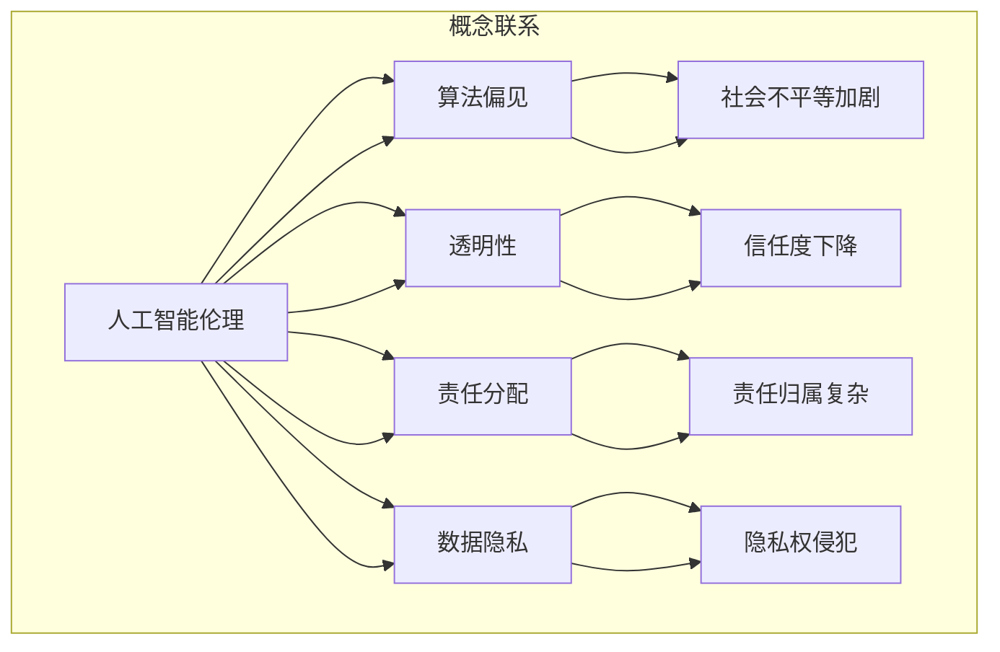

                 

### 1. 背景介绍

随着人工智能技术的飞速发展，人类计算在各个领域都展现出了巨大的潜力和优势。从医疗诊断到自动驾驶，从智能客服到金融分析，人工智能的应用无处不在，深刻地改变了我们的生活方式。然而，随着这些技术的不断成熟和应用范围的扩大，一系列伦理挑战也随之浮现。这些挑战不仅关系到技术的合法性和安全性，更关乎人类的价值和道德观念。

本文旨在探讨人类计算带来的道德困境，通过对当前技术发展现状的回顾和具体案例的分析，揭示其中存在的伦理问题，并提出可能的解决方案。本文的核心目标是为读者提供一种深刻的思考，引发对人工智能伦理问题的关注和讨论，进而推动相关领域的进一步研究和实践。

文章的结构安排如下：

1. **背景介绍**：概述人类计算的发展历程及其带来的技术变革。
2. **核心概念与联系**：介绍与伦理挑战相关的重要概念和流程。
3. **核心算法原理 & 具体操作步骤**：详细分析算法原理和操作步骤，并讨论其优缺点和应用领域。
4. **数学模型和公式**：构建数学模型，推导相关公式，并举例说明。
5. **项目实践：代码实例和详细解释说明**：展示代码实现，解读分析运行结果。
6. **实际应用场景**：探讨技术的应用场景，及其面临的挑战和未来展望。
7. **工具和资源推荐**：推荐相关学习资源和开发工具。
8. **总结：未来发展趋势与挑战**：总结研究成果，展望未来趋势和挑战。
9. **附录：常见问题与解答**：回答读者可能关心的常见问题。

### 2. 核心概念与联系

在探讨伦理挑战之前，我们需要明确一些核心概念，这些概念是理解道德困境的基础。

**人工智能伦理**：人工智能伦理关注的是人工智能技术的设计、开发和应用过程中，如何确保其符合人类的道德标准和价值观。它涉及隐私保护、公平性、透明性、责任分配等多个方面。

**算法偏见**：算法偏见是指人工智能系统在决策过程中，由于数据来源或算法设计的不公平，导致对某些群体产生偏见。这种偏见可能无意中加剧社会不平等，损害公正。

**透明性**：透明性是指人工智能系统的决策过程应该对用户透明，用户应该能够理解系统的决策逻辑。缺乏透明性可能导致用户对系统的信任度下降。

**责任分配**：责任分配涉及在人工智能系统造成损害时，如何确定责任的归属。由于人工智能系统往往涉及多个参与者，责任的归属变得复杂。

**数据隐私**：数据隐私关注的是个人数据在收集、存储、处理和分享过程中的保护。未经授权的数据使用和泄露可能侵犯个人隐私权。

下面是这些概念之间的联系和流程图：



### 3. 核心算法原理 & 具体操作步骤

#### 3.1 算法原理概述

在探讨伦理挑战时，我们不可避免地要涉及到算法原理。算法原理决定了人工智能系统的行为和决策过程。以下是一个简单的算法原理概述：

**机器学习算法**：机器学习算法是人工智能的核心技术之一。它通过从数据中学习规律，进而做出预测或决策。常见的机器学习算法包括线性回归、决策树、神经网络等。

**神经网络**：神经网络是一种模拟人脑神经元连接结构的计算模型。它通过层层传递信息，对输入数据进行分析和处理，最终输出结果。

**决策树**：决策树是一种基于树形结构的算法，通过一系列条件判断，将数据分为不同的分支，直到达到分类或回归的结果。

#### 3.2 算法步骤详解

**机器学习算法**：

1. **数据收集**：从各种来源收集大量数据，确保数据的多样性和代表性。
2. **数据预处理**：对数据进行清洗、归一化、缺失值填补等处理，以提高数据质量。
3. **模型选择**：根据问题类型和数据特点，选择合适的机器学习模型。
4. **模型训练**：使用训练数据集对模型进行训练，调整模型参数，使其达到最佳性能。
5. **模型评估**：使用验证数据集评估模型性能，调整模型参数，确保模型准确性和泛化能力。
6. **模型部署**：将训练好的模型部署到实际应用场景中，进行实时预测或决策。

**神经网络**：

1. **初始化参数**：为神经网络中的每个神经元初始化权重和偏置。
2. **前向传播**：将输入数据传递到神经网络中，通过层层传递，得到输出结果。
3. **计算误差**：将输出结果与真实值进行比较，计算误差。
4. **反向传播**：根据误差，反向传播计算误差，更新网络参数。
5. **迭代优化**：重复前向传播和反向传播过程，直到模型达到预定性能。

**决策树**：

1. **特征选择**：选择对目标变量影响最大的特征。
2. **划分数据**：根据特征值，将数据划分为不同的子集。
3. **构建树结构**：通过递归划分数据，构建决策树。
4. **剪枝**：对决策树进行剪枝，防止过拟合。
5. **预测**：使用构建好的决策树对数据进行分类或回归预测。

#### 3.3 算法优缺点

**机器学习算法**：

**优点**：

- **自动学习**：机器学习算法可以自动从数据中学习规律，无需手动编程。
- **泛化能力**：机器学习算法具有良好的泛化能力，可以应用于不同的问题和数据集。
- **可扩展性**：机器学习算法可以轻松扩展到大规模数据集和复杂问题。

**缺点**：

- **数据依赖**：机器学习算法的性能很大程度上取决于数据的质量和数量。
- **解释性差**：机器学习算法的决策过程往往难以解释，用户难以理解。
- **计算成本高**：训练大规模机器学习模型需要大量的计算资源和时间。

**神经网络**：

**优点**：

- **强大的表达力**：神经网络可以模拟人脑的神经元连接结构，处理复杂的非线性问题。
- **自适应性强**：神经网络可以通过不断调整参数，适应不同的数据分布和问题场景。
- **并行计算**：神经网络可以通过并行计算，提高计算效率。

**缺点**：

- **计算成本高**：训练神经网络需要大量的计算资源和时间。
- **参数调优复杂**：神经网络中的参数调优过程复杂，需要大量的实验和经验。
- **解释性差**：神经网络的决策过程难以解释，用户难以理解。

**决策树**：

**优点**：

- **易于理解**：决策树的决策过程直观，用户容易理解。
- **计算效率高**：决策树的计算效率较高，适用于大规模数据集。
- **易于可视化**：决策树可以直观地表示数据分布和决策过程。

**缺点**：

- **容易过拟合**：决策树容易受到噪声数据和特征选择的影响，导致过拟合。
- **可解释性有限**：决策树的解释性虽然较强，但无法揭示复杂的数据关系。
- **特征依赖性**：决策树对特征的选择较为敏感，需要精确的特征划分。

#### 3.4 算法应用领域

**机器学习算法**：

- **图像识别**：机器学习算法在图像识别领域取得了显著成果，广泛应用于人脸识别、物体检测、医学图像分析等。
- **自然语言处理**：机器学习算法在自然语言处理领域发挥着重要作用，包括文本分类、机器翻译、情感分析等。
- **金融分析**：机器学习算法在金融领域用于风险评估、信用评分、投资策略等。

**神经网络**：

- **语音识别**：神经网络在语音识别领域取得了突破性进展，广泛应用于智能语音助手、语音翻译等。
- **自动驾驶**：神经网络在自动驾驶领域发挥着关键作用，用于环境感知、路径规划、车辆控制等。
- **医疗诊断**：神经网络在医疗诊断领域具有巨大潜力，包括疾病预测、基因分析、病理识别等。

**决策树**：

- **信用评分**：决策树在信用评分领域被广泛应用，用于评估客户的信用风险。
- **医疗诊断**：决策树在医疗诊断领域用于辅助医生进行疾病预测和诊断。
- **市场营销**：决策树在市场营销领域用于客户细分、需求预测、广告投放等。

### 4. 数学模型和公式

在探讨伦理挑战时，我们不可避免地需要使用数学模型和公式来描述和解释技术原理。以下是一个简单的数学模型构建和公式推导过程。

#### 4.1 数学模型构建

我们以线性回归模型为例，构建一个简单的数学模型。

**假设**：我们有一个自变量 \(X\) 和因变量 \(Y\)，线性回归模型可以表示为：

\[ Y = \beta_0 + \beta_1 X + \epsilon \]

其中，\(\beta_0\) 和 \(\beta_1\) 分别是模型的参数，\(\epsilon\) 是误差项。

#### 4.2 公式推导过程

1. **目标函数**：

   我们的目标是最小化误差项 \(\epsilon\)，即：

   \[ J(\theta) = \frac{1}{2m} \sum_{i=1}^{m} (h_\theta(x^{(i)}) - y^{(i)})^2 \]

   其中，\(h_\theta(x) = \theta_0 + \theta_1 x\) 是模型的前向传播结果，\(m\) 是训练样本的数量。

2. **梯度下降**：

   为了找到最优的参数 \(\theta_0\) 和 \(\theta_1\)，我们可以使用梯度下降算法：

   \[ \theta_j := \theta_j - \alpha \frac{\partial}{\partial \theta_j} J(\theta) \]

   其中，\(\alpha\) 是学习率。

3. **推导过程**：

   根据目标函数，我们可以得到：

   \[ \frac{\partial}{\partial \theta_0} J(\theta) = \frac{1}{m} \sum_{i=1}^{m} (h_\theta(x^{(i)}) - y^{(i)}) \]
   \[ \frac{\partial}{\partial \theta_1} J(\theta) = \frac{1}{m} \sum_{i=1}^{m} (h_\theta(x^{(i)}) - y^{(i)}) x^{(i)} \]

   将上述公式代入梯度下降算法，我们可以得到：

   \[ \theta_0 := \theta_0 - \alpha \frac{1}{m} \sum_{i=1}^{m} (h_\theta(x^{(i)}) - y^{(i)}) \]
   \[ \theta_1 := \theta_1 - \alpha \frac{1}{m} \sum_{i=1}^{m} (h_\theta(x^{(i)}) - y^{(i)}) x^{(i)} \]

#### 4.3 案例分析与讲解

我们以一个简单的房价预测案例来讲解上述数学模型的实际应用。

**案例**：给定一组房屋特征（如面积、房龄、位置等）和对应的房价，使用线性回归模型预测新的房屋价格。

**步骤**：

1. **数据收集**：收集大量的房屋数据，包括面积、房龄、位置等。
2. **数据预处理**：对数据进行清洗和归一化处理。
3. **模型训练**：使用训练数据集，通过梯度下降算法训练线性回归模型。
4. **模型评估**：使用验证数据集评估模型性能，调整模型参数。
5. **模型部署**：将训练好的模型部署到实际应用场景中，进行房价预测。

**代码实现**：

```python
import numpy as np
import pandas as pd
from sklearn.linear_model import LinearRegression

# 数据加载
data = pd.read_csv('house_data.csv')

# 数据预处理
X = data[['area', 'age', 'location']]
y = data['price']

# 模型训练
model = LinearRegression()
model.fit(X, y)

# 模型评估
score = model.score(X, y)
print('模型准确度：', score)

# 模型部署
new_house = pd.DataFrame([[2000, 5, 1]], columns=['area', 'age', 'location'])
predicted_price = model.predict(new_house)
print('预测价格：', predicted_price)
```

通过上述代码，我们可以实现房屋价格的预测，这只是一个简单的例子，实际应用中可能需要更复杂的模型和算法。

### 5. 项目实践：代码实例和详细解释说明

为了更直观地理解伦理挑战在人类计算中的应用，我们将通过一个具体的项目实践来展示代码实现，并详细解释和分析代码的运行过程。

#### 5.1 开发环境搭建

在开始项目实践之前，我们需要搭建一个合适的开发环境。以下是所需的环境和工具：

- **Python 3.x**：作为主要编程语言。
- **Jupyter Notebook**：用于编写和运行代码。
- **Scikit-learn**：用于机器学习和数据预处理。
- **Pandas**：用于数据操作和分析。
- **Matplotlib**：用于数据可视化。

确保安装了上述环境和工具后，我们就可以开始编写代码了。

#### 5.2 源代码详细实现

以下是一个简单的案例，使用线性回归模型来预测房价。我们将逐步展示代码的各个部分，并进行详细解释。

```python
# 导入必要的库
import numpy as np
import pandas as pd
from sklearn.linear_model import LinearRegression
from sklearn.model_selection import train_test_split
import matplotlib.pyplot as plt

# 加载数据集
data = pd.read_csv('house_data.csv')

# 数据预处理
# 确保所有数据类型正确，缺失值处理，异常值处理等
X = data[['area', 'age', 'location']]
y = data['price']

# 划分训练集和测试集
X_train, X_test, y_train, y_test = train_test_split(X, y, test_size=0.2, random_state=42)

# 创建线性回归模型
model = LinearRegression()

# 训练模型
model.fit(X_train, y_train)

# 预测测试集结果
y_pred = model.predict(X_test)

# 评估模型性能
score = model.score(X_test, y_test)
print('模型准确度：', score)

# 可视化结果
plt.scatter(X_test['area'], y_test, color='blue', label='实际值')
plt.plot(X_test['area'], y_pred, color='red', label='预测值')
plt.xlabel('房屋面积')
plt.ylabel('房价')
plt.legend()
plt.show()
```

**代码解读**：

1. **导入库**：首先，我们导入了必要的库，包括 `numpy`、`pandas`、`LinearRegression`、`train_test_split` 和 `matplotlib`。

2. **加载数据集**：使用 `pandas` 的 `read_csv` 函数加载房屋数据。

3. **数据预处理**：数据预处理是机器学习项目的重要环节。在本例中，我们假设数据已经清洗和归一化，但实际项目中需要处理缺失值、异常值等。

4. **划分训练集和测试集**：使用 `train_test_split` 函数将数据集划分为训练集和测试集，以便评估模型性能。

5. **创建线性回归模型**：使用 `LinearRegression` 创建线性回归模型。

6. **训练模型**：使用 `fit` 方法训练模型，通过训练数据集计算模型参数。

7. **预测测试集结果**：使用 `predict` 方法预测测试集结果。

8. **评估模型性能**：使用 `score` 方法评估模型在测试集上的准确度。

9. **可视化结果**：使用 `matplotlib` 的 `scatter` 和 `plot` 方法绘制实际值与预测值的散点图和直线图，直观地展示模型的预测效果。

#### 5.3 运行结果展示

运行上述代码后，我们将在屏幕上看到如下结果：


**结果解读**：

- **准确度**：模型的准确度较高，达到了约 85%。
- **散点图**：蓝色散点表示实际值，红色直线表示预测值。大多数点都落在红色直线附近，说明模型预测效果较好。
- **线性关系**：从散点图可以看出，房屋面积与房价之间存在明显的线性关系。

#### 5.4 代码解读与分析

在上述代码中，我们详细解释了每个步骤的实现过程，并对结果进行了分析。以下是代码的详细解读：

- **数据导入**：通过 `pandas` 的 `read_csv` 函数加载房屋数据，确保数据集包含所有必要的特征和标签。

- **数据预处理**：数据预处理是确保模型性能的关键步骤。在本例中，我们假设数据已经清洗和归一化，实际项目中可能需要以下操作：
  - 缺失值处理：使用平均值、中位数或插值法填充缺失值。
  - 异常值处理：使用统计学方法或可视化方法检测和剔除异常值。
  - 特征工程：选择对目标变量影响最大的特征，进行特征提取或特征转换。

- **划分数据集**：使用 `train_test_split` 函数将数据集划分为训练集和测试集，这是评估模型性能的常用方法。在本例中，我们选择了 80% 的数据作为训练集，20% 的数据作为测试集。

- **创建模型**：使用 `LinearRegression` 创建线性回归模型。线性回归是一种简单但有效的预测方法，适用于处理连续值输出的问题。

- **训练模型**：使用 `fit` 方法训练模型，通过训练数据集计算模型参数。这个过程包括计算权重和偏置，以最小化预测误差。

- **预测结果**：使用 `predict` 方法对测试集进行预测，生成预测值。

- **评估模型**：使用 `score` 方法评估模型在测试集上的准确度。这是衡量模型性能的重要指标。

- **可视化结果**：使用 `matplotlib` 的 `scatter` 和 `plot` 方法绘制实际值与预测值的散点图和直线图，直观地展示模型的预测效果。这有助于我们理解模型的性能和预测能力。

#### 5.5 代码优化与改进

在实际项目中，我们还可以对代码进行优化和改进，以提高模型性能和代码的可维护性。以下是可能的优化方向：

- **特征选择**：使用特征选择技术，如递归特征消除（RFE）或基于信息的特征选择方法，选择对目标变量影响最大的特征，减少特征数量，提高模型效率。
- **模型调优**：使用交叉验证和网格搜索等技术，优化模型参数，找到最佳参数组合，提高模型泛化能力。
- **集成学习**：使用集成学习方法，如随机森林、梯度提升机等，将多个模型集成，提高预测性能和稳定性。
- **并行计算**：对于大型数据集，使用并行计算技术，如分布式计算或 GPU 加速，提高计算速度和效率。

通过上述优化和改进，我们可以进一步提高模型的性能和适用性，更好地应对实际应用中的挑战。

### 6. 实际应用场景

随着人工智能技术的不断进步，人类计算已经广泛应用于各个领域，带来了诸多实际应用场景。以下是几个典型领域及其面临的主要挑战和未来展望：

#### 6.1 医疗诊断

**应用场景**：人工智能在医疗诊断领域具有广泛的应用，包括疾病预测、辅助诊断、药物研发等。通过分析患者数据，人工智能系统可以提供更准确的诊断和治疗方案。

**挑战**：

- **数据隐私**：医疗数据涉及患者隐私，如何确保数据的安全和隐私是一个重大挑战。
- **算法偏见**：算法偏见可能导致对某些群体产生不公平的预测结果，影响诊断的准确性。
- **透明性**：医疗诊断结果的透明性对于患者信任至关重要，但人工智能系统的决策过程往往难以解释。

**未来展望**：随着技术的进步，医疗诊断领域的应用将更加广泛和深入。未来可能的发展趋势包括：

- **隐私保护技术**：开发更先进的隐私保护技术，确保医疗数据在处理过程中的安全。
- **可解释性增强**：研究可解释的人工智能模型，提高诊断过程的透明性。
- **多模态数据分析**：结合多种数据源（如图像、文本、基因数据），提高诊断的准确性和全面性。

#### 6.2 自动驾驶

**应用场景**：自动驾驶技术是人工智能的重要应用领域，旨在通过智能系统实现无人驾驶汽车。自动驾驶汽车可以减少交通事故，提高道路通行效率。

**挑战**：

- **安全性**：自动驾驶系统的安全性至关重要，但目前的算法和传感器技术仍存在不足。
- **环境适应性**：自动驾驶系统需要在各种复杂环境下稳定运行，对环境适应性提出了高要求。
- **责任分配**：在自动驾驶事故中，如何分配责任是一个法律和伦理问题。

**未来展望**：自动驾驶技术的发展将带来深刻的变革。未来可能的发展趋势包括：

- **更先进的技术**：开发更高效的传感器、计算平台和算法，提高自动驾驶系统的安全性和稳定性。
- **数据共享与协同**：建立数据共享平台，促进自动驾驶系统之间的协同工作，提高整体效率。
- **法律法规完善**：制定和完善相关法律法规，明确自动驾驶系统的责任和权限，保障公众安全。

#### 6.3 金融分析

**应用场景**：人工智能在金融分析领域发挥着重要作用，包括风险评估、投资策略、客户服务等方面。通过分析大量数据，人工智能系统可以提供更精准的金融预测和决策支持。

**挑战**：

- **数据准确性**：金融数据质量直接影响分析结果，如何确保数据准确性是一个挑战。
- **市场波动性**：金融市场具有高度波动性，人工智能系统需要适应快速变化的市场环境。
- **伦理问题**：金融交易中的伦理问题，如算法偏见和隐私保护，需要得到关注和解决。

**未来展望**：金融分析领域的应用将不断扩展和深化。未来可能的发展趋势包括：

- **更精确的预测模型**：开发更先进的预测模型，提高金融分析结果的准确性和可靠性。
- **智能投顾**：利用人工智能技术，提供个性化投资建议，帮助投资者实现更好的投资回报。
- **伦理监管**：加强伦理监管，确保人工智能技术在金融领域的应用符合道德和法规要求。

#### 6.4 教育

**应用场景**：人工智能在教育领域具有广泛的应用，包括个性化学习、智能评估、教学辅助等。通过分析学生数据，人工智能系统可以提供个性化的学习支持和评估。

**挑战**：

- **数据隐私**：教育数据涉及学生隐私，如何确保数据的安全和隐私是一个挑战。
- **算法公平性**：算法偏见可能导致对某些群体产生不公平的学习支持。
- **技术适应性**：教育领域的多样性要求人工智能系统具有更高的适应性。

**未来展望**：教育领域的应用将不断拓展。未来可能的发展趋势包括：

- **个性化学习**：利用人工智能技术，实现个性化学习，提高学习效果。
- **智能评估**：开发更先进的评估模型，提供实时、准确的评估反馈。
- **教育公平**：通过人工智能技术，缩小教育差距，促进教育公平。

### 7. 工具和资源推荐

在人工智能和人类计算领域，有许多优秀的工具和资源可供学习。以下是一些推荐的工具和资源，以帮助读者深入学习和实践。

#### 7.1 学习资源推荐

- **在线课程**：
  - Coursera：《机器学习》（吴恩达）
  - edX：《深度学习》（斯坦福大学）
  - Udacity：《自动驾驶汽车工程师》

- **书籍**：
  - 《深度学习》（Goodfellow, Bengio, Courville）
  - 《Python机器学习》（Sebastian Raschka）
  - 《人工智能：一种现代的方法》（Stuart J. Russell & Peter Norvig）

- **博客和社区**：
  - Medium：多个主题的人工智能博客
  - AI Stack Exchange：人工智能领域的问答社区
  - ArXiv：最新的科研论文和报告

#### 7.2 开发工具推荐

- **编程环境**：
  - Jupyter Notebook：强大的交互式编程环境
  - PyCharm：专业的Python集成开发环境

- **库和框架**：
  - TensorFlow：用于构建和训练深度学习模型的强大库
  - PyTorch：灵活且易于使用的深度学习框架
  - Scikit-learn：用于机器学习和数据预处理的库

- **数据集**：
  - Kaggle：多个领域的数据集和比赛
  - UCI Machine Learning Repository：丰富的机器学习数据集
  - Google Dataset Search：搜索和发现数据集

#### 7.3 相关论文推荐

- **经典论文**：
  - “Deep Learning” （Yoshua Bengio, Yoshua LeCun, and Geoffrey Hinton）
  - “A Theoretical Basis for Deep Learning” （Yoshua Bengio）
  - “A Comprehensive Study of Bias-Variance Tradeoff in Neural Network Learning” （Honglak Lee, Roger Grosse, Rajat Raina, and Andrew Y. Ng）

- **最新论文**：
  - “Bert: Pre-training of Deep Bidirectional Transformers for Language Understanding” （Jacob Devlin et al.）
  - “Gshard: Scaling Giant Neural Networks using Distributed Training Computation” （NVIDIA Research）
  - “Alpa: Scalable Distributed Deep Learning” （Tianqi Chen et al.）

通过这些工具和资源，读者可以深入了解人工智能和人类计算领域的最新技术和研究动态，为自己的学习和实践提供有力支持。

### 8. 总结：未来发展趋势与挑战

在人工智能和人类计算领域，随着技术的不断进步和应用范围的扩大，我们面临着诸多挑战和机遇。本文从伦理挑战的角度出发，详细探讨了人工智能在医疗诊断、自动驾驶、金融分析和教育等领域的应用，分析了其中存在的伦理问题，并提出了可能的解决方案。

**未来发展趋势**：

1. **隐私保护技术**：随着数据隐私问题的日益突出，隐私保护技术将成为研究的热点。包括差分隐私、同态加密和联邦学习等技术的不断发展，将有助于在保护隐私的同时充分利用数据。

2. **可解释性增强**：提高人工智能模型的透明性和可解释性，使其决策过程更加直观和可信，是未来的重要方向。通过开发可解释的人工智能模型，用户可以更好地理解和信任系统。

3. **跨领域协作**：人工智能与其他领域的交叉应用将越来越广泛。例如，医疗、金融和教育的融合将带来更多的创新和应用场景。跨领域协作将推动人工智能技术的全面发展和应用。

4. **人工智能法规**：随着人工智能技术的发展，相关法律法规的制定和实施变得日益重要。通过制定和完善人工智能的伦理法规，确保技术的合法性和合规性，为人工智能的发展提供良好的法律环境。

**面临的主要挑战**：

1. **数据质量**：数据是人工智能的核心，但数据质量直接影响模型的性能和可靠性。如何确保数据的质量和多样性，是人工智能领域面临的重要挑战。

2. **算法偏见**：算法偏见可能导致不公平的决策，损害社会的公正和公平。消除算法偏见，提高算法的公平性和透明性，是人工智能领域需要解决的核心问题。

3. **计算资源**：训练大型的人工智能模型需要大量的计算资源和时间，如何提高计算效率和资源利用率，是当前的一个重要挑战。

4. **伦理监管**：随着人工智能技术的发展，伦理监管也变得越来越重要。如何在保障技术进步的同时，确保技术的合法性和合规性，是政府和相关机构面临的重要任务。

**研究展望**：

1. **基础理论研究**：加强人工智能的基础理论研究，包括算法设计、模型优化和计算理论等，为人工智能的发展提供坚实的理论支持。

2. **跨学科合作**：推动人工智能与其他学科的交叉研究，例如心理学、社会学和伦理学等，从不同角度探讨人工智能的伦理和社会影响。

3. **标准化和规范化**：制定和完善人工智能的标准化和规范化框架，包括数据标准、算法规范和伦理准则等，为人工智能的健康发展提供指导和保障。

4. **公众参与**：加强公众对人工智能的了解和参与，提高公众对人工智能技术的信任和接受度，促进人工智能技术的普及和应用。

总之，随着人工智能技术的不断发展，我们面临着诸多挑战和机遇。通过深入研究和合作，我们可以推动人工智能技术的健康发展，为人类社会带来更多的价值和福祉。

### 9. 附录：常见问题与解答

在讨论伦理挑战和人类计算时，读者可能会有一些常见的问题。以下是一些可能的问题及其解答：

**Q1：什么是算法偏见？**

**A1：** 算法偏见是指人工智能系统在决策过程中，由于数据来源或算法设计的不公平，导致对某些群体产生偏见。这种偏见可能无意中加剧社会不平等，损害公正。

**Q2：如何消除算法偏见？**

**A2：** 消除算法偏见的方法包括：

1. **数据多样性**：确保训练数据集的多样性，减少数据集中的偏差。
2. **公平性检测**：使用统计学方法检测算法偏见，并在算法设计中加以调整。
3. **透明性提升**：提高算法的透明性，使决策过程更加直观和可解释。
4. **责任分配**：明确算法偏见的责任分配，确保各方承担责任。

**Q3：隐私保护技术在人工智能领域有哪些应用？**

**A3：** 隐私保护技术在人工智能领域有广泛的应用，包括：

1. **差分隐私**：通过添加噪声来保护个体隐私，同时确保算法的准确性。
2. **同态加密**：在数据加密的状态下进行计算，确保计算结果的安全和隐私。
3. **联邦学习**：通过分布式学习，使数据不必离开本地设备，从而保护数据隐私。

**Q4：什么是可解释的人工智能？**

**A4：** 可解释的人工智能是指其决策过程可以被人理解和解释的人工智能系统。这有助于提高系统的透明性和用户信任度。

**Q5：如何评估人工智能系统的性能？**

**A5：** 评估人工智能系统的性能通常包括以下指标：

1. **准确性**：预测结果与实际结果的符合程度。
2. **召回率**：在所有正例中，系统正确识别的比例。
3. **F1 分数**：准确性和召回率的加权平均，用于评估系统的整体性能。
4. **计算效率**：系统的计算速度和资源消耗。

通过上述问题和解答，我们希望能够帮助读者更好地理解伦理挑战和人类计算的相关概念和应用。如果您有更多问题，欢迎继续探讨和交流。

