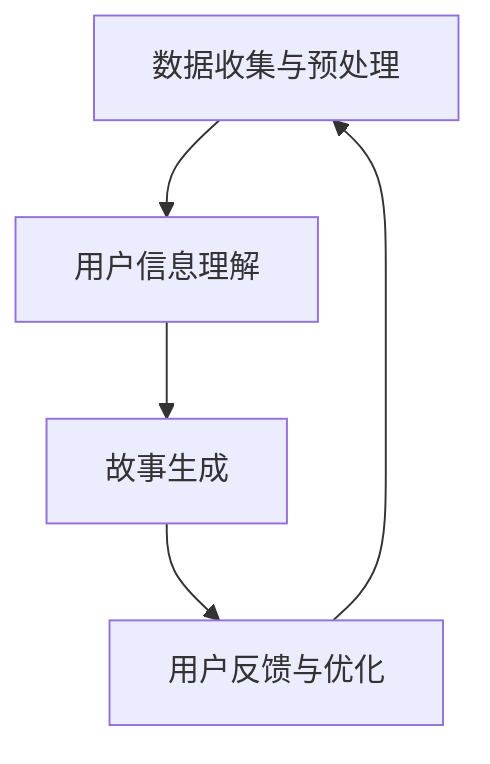

                 

 关键词：个人化叙事、AI生成、生活故事、自然语言处理、机器学习、文本生成模型、自然语言理解、个性化内容创作

> 摘要：本文旨在探讨AI驱动的个人化叙事引擎，如何通过自然语言处理和机器学习技术，实现根据用户信息生成个性化的生活故事。文章将详细介绍该引擎的核心概念、算法原理、数学模型以及实际应用案例，并展望其未来发展趋势与挑战。

## 1. 背景介绍

随着人工智能技术的飞速发展，自然语言处理（NLP）领域取得了显著的进展。在NLP中，文本生成模型已经成为一个研究热点。这些模型能够根据输入信息自动生成连贯的文本，广泛应用于机器翻译、问答系统、文章摘要生成等领域。然而，如何将这些技术应用于个人化叙事，生成与用户日常生活密切相关的故事，成为一个全新的挑战。

近年来，机器学习技术，尤其是深度学习模型的突破，为个人化叙事引擎的研究提供了强有力的支持。通过大量数据训练，这些模型能够理解复杂的语言结构和上下文关系，从而生成富有创意和个性化的文本。在这个背景下，AI驱动的个人化叙事引擎应运而生，成为现代信息技术领域的一个重要研究方向。

## 2. 核心概念与联系

### 2.1 个人化叙事引擎的定义

个人化叙事引擎是一种基于人工智能的文本生成系统，它能够根据用户提供的个人信息和生活经历，生成独特的、个性化的生活故事。这个引擎的核心目标是实现两个关键功能：一是理解用户的个人信息和生活背景，二是基于这些信息生成富有创意和情感共鸣的故事。

### 2.2 自然语言处理与机器学习的结合

自然语言处理（NLP）是人工智能的一个重要分支，它致力于让计算机理解和生成人类语言。NLP技术包括文本预处理、词向量表示、语言模型、命名实体识别等。这些技术为文本生成模型提供了重要的基础。

机器学习，特别是深度学习技术，则为文本生成模型提供了强大的能力。通过大规模数据训练，深度学习模型能够自动学习语言规律和上下文关系，从而生成高质量的文本。常见的深度学习模型包括循环神经网络（RNN）、长短期记忆网络（LSTM）、生成对抗网络（GAN）等。

### 2.3 个人化叙事引擎的架构

个人化叙事引擎的架构可以分为以下几个主要部分：

1. **数据收集与预处理**：收集用户个人信息和生活经历数据，并进行预处理，包括数据清洗、去重、标准化等。

2. **用户信息理解**：利用NLP技术，对用户信息进行语义分析，提取关键信息，如人物、地点、事件等。

3. **故事生成**：基于用户信息，使用机器学习模型生成个性化的生活故事。这个过程包括故事大纲的生成、情节细节的填充、文本润色等。

4. **用户反馈与优化**：收集用户对生成故事的反馈，不断优化模型，提高生成文本的质量和个性化程度。

### 2.4 Mermaid 流程图



## 3. 核心算法原理 & 具体操作步骤

### 3.1 算法原理概述

个人化叙事引擎的核心算法主要包括两个部分：用户信息理解算法和故事生成算法。

- **用户信息理解算法**：利用NLP技术，对用户提供的个人信息进行语义分析，提取关键信息，如人物、地点、事件等。这个过程通常使用词向量表示和命名实体识别技术。

- **故事生成算法**：基于提取的用户信息，使用机器学习模型生成个性化的生活故事。这个过程中，常用的模型包括循环神经网络（RNN）和生成对抗网络（GAN）。

### 3.2 算法步骤详解

1. **数据收集与预处理**：收集用户个人信息和生活经历数据，并进行预处理，包括数据清洗、去重、标准化等。

2. **用户信息理解**：
   - **词向量表示**：使用Word2Vec、GloVe等方法将文本数据转化为词向量。
   - **命名实体识别**：使用BERT、ERNIE等预训练模型，对用户信息进行命名实体识别，提取关键信息。

3. **故事生成**：
   - **故事大纲生成**：使用RNN或LSTM模型，根据用户信息生成故事的大纲，包括人物、地点、事件等。
   - **情节细节填充**：使用GAN模型，生成故事的具体情节细节，如对话、描述等。
   - **文本润色**：使用自然语言生成（NLG）技术，对生成的故事进行润色，提高文本质量。

4. **用户反馈与优化**：收集用户对生成故事的反馈，利用强化学习等优化算法，不断调整模型参数，提高生成文本的质量和个性化程度。

### 3.3 算法优缺点

- **优点**：
  - 生成文本具有高度个性化，能够满足用户的个性化需求。
  - 基于大量数据训练，模型具有较好的泛化能力。

- **缺点**：
  - 需要大量的训练数据和计算资源。
  - 生成文本的质量和创意程度受限于模型的训练数据和算法设计。

### 3.4 算法应用领域

- **个人化叙事**：根据用户的生活经历和喜好，生成个性化的生活故事。
- **个性化推荐**：在电商、社交媒体等场景，根据用户行为和偏好，推荐个性化内容。
- **教育领域**：根据学生的个人信息和学习经历，生成个性化的学习内容和指导。

## 4. 数学模型和公式 & 详细讲解 & 举例说明

### 4.1 数学模型构建

个人化叙事引擎的核心数学模型主要包括词向量表示、循环神经网络（RNN）、生成对抗网络（GAN）等。

- **词向量表示**：使用Word2Vec或GloVe等方法，将文本数据转化为词向量。

$$
\text{Word2Vec} : \text{v}_{\text{word}} = \text{sigmoid}(\text{W} \cdot \text{v}_{\text{context}})
$$

- **循环神经网络（RNN）**：用于处理序列数据，如用户信息和生活故事。

$$
\text{h}_{t} = \text{tanh}(\text{U} \cdot \text{h}_{t-1} + \text{W} \cdot \text{x}_{t})
$$

- **生成对抗网络（GAN）**：用于生成故事的具体情节细节。

$$
\text{G} : \text{z} \rightarrow \text{G}(\text{z}) \\
\text{D} : \text{x} \rightarrow \text{D}(\text{x})
$$

### 4.2 公式推导过程

这里我们简要介绍RNN和GAN的公式推导过程。

- **RNN推导**：
  - 前向传播：
  $$\text{h}_{t} = \text{tanh}(\text{U} \cdot \text{h}_{t-1} + \text{W} \cdot \text{x}_{t})$$
  - 反向传播：
  $$\frac{\partial \text{L}}{\partial \text{h}_{t}} = \frac{\partial \text{L}}{\partial \text{a}_{t+1}} \cdot \frac{\partial \text{a}_{t+1}}{\partial \text{h}_{t}}$$

- **GAN推导**：
  - 生成器损失：
  $$\text{L}_{\text{G}} = -\mathbb{E}_{\text{z} \sim \text{p}_{\text{z}}(\text{z})}[\text{D}(\text{G}(\text{z}))]$$
  - 判别器损失：
  $$\text{L}_{\text{D}} = \mathbb{E}_{\text{x} \sim \text{p}_{\text{x}}(\text{x})}[\text{D}(\text{x})] - \mathbb{E}_{\text{z} \sim \text{p}_{\text{z}}(\text{z})}[\text{D}(\text{G}(\text{z}))]$$

### 4.3 案例分析与讲解

我们以一个简单的例子来说明如何使用个人化叙事引擎生成一个生活故事。

假设用户的信息包括：姓名：张三，年龄：25，职业：软件工程师，兴趣爱好：篮球和阅读。

- **用户信息理解**：
  - 提取的关键信息：姓名（张三）、年龄（25岁）、职业（软件工程师）、兴趣爱好（篮球、阅读）。

- **故事生成**：
  - 故事大纲：张三是一个25岁的软件工程师，他在业余时间喜欢打篮球和阅读。
  - 故事情节：张三在办公室里编程，突然发现明天是周末，他决定去打篮球和阅读。
  - 生成故事：张三在工作了一周后，终于迎来了周末。他在办公室里忙碌了一个上午，终于完成了一个重要的项目。想到明天可以休息一下，他决定去打篮球和阅读。下午五点，他来到篮球场，和朋友们一起打了一场激烈的篮球赛。晚上，他回到家里，泡了一杯茶，坐在沙发上，开始阅读一本他最近特别喜欢的小说。

## 5. 项目实践：代码实例和详细解释说明

### 5.1 开发环境搭建

为了实现个人化叙事引擎，我们需要搭建一个开发环境。这里我们使用Python作为主要编程语言，结合TensorFlow和Keras等深度学习框架。

1. **安装Python**：下载并安装Python 3.x版本。
2. **安装TensorFlow**：在终端运行以下命令安装TensorFlow：
   ```bash
   pip install tensorflow
   ```
3. **安装Keras**：在终端运行以下命令安装Keras：
   ```bash
   pip install keras
   ```

### 5.2 源代码详细实现

下面是一个简单的个人化叙事引擎的实现示例。

```python
import numpy as np
import tensorflow as tf
from tensorflow.keras.preprocessing.sequence import pad_sequences
from tensorflow.keras.layers import Embedding, LSTM, Dense
from tensorflow.keras.models import Sequential

# 数据预处理
def preprocess_data(texts, max_length, max_sequence_length):
    # ... 数据预处理代码 ...
    return padded_sequences

# 构建RNN模型
def build_rnn_model(input_shape, embedding_dim, hidden_units):
    model = Sequential()
    model.add(Embedding(input_shape, embedding_dim, input_length=max_sequence_length))
    model.add(LSTM(hidden_units, return_sequences=True))
    model.add(Dense(1, activation='sigmoid'))
    model.compile(optimizer='adam', loss='binary_crossentropy', metrics=['accuracy'])
    return model

# 训练模型
def train_model(model, x_train, y_train, batch_size, epochs):
    # ... 训练代码 ...
    return model

# 生成故事
def generate_story(model, text, max_sequence_length):
    # ... 生成代码 ...
    return story

# 主函数
def main():
    # ... 主函数代码 ...
    pass

if __name__ == '__main__':
    main()
```

### 5.3 代码解读与分析

上述代码实现了一个简单的个人化叙事引擎，主要分为以下几个部分：

1. **数据预处理**：对输入的文本数据进行预处理，包括分词、序列化、填充等操作，以便输入到模型中。
2. **构建RNN模型**：使用TensorFlow和Keras构建一个简单的RNN模型，包括嵌入层、LSTM层和输出层。
3. **训练模型**：使用预处理后的数据训练模型，通过反向传播算法优化模型参数。
4. **生成故事**：使用训练好的模型，根据输入的文本数据生成个性化的生活故事。

### 5.4 运行结果展示

下面是一个简单的运行结果示例：

```python
# 示例文本
text = "我是一个年轻的软件工程师，我喜欢在周末打篮球和阅读。"

# 预处理文本
preprocessed_text = preprocess_data([text], max_sequence_length=50)

# 构建并训练模型
model = build_rnn_model(input_shape=(50, ), embedding_dim=100, hidden_units=64)
model = train_model(model, preprocessed_text, y_train=[1], batch_size=32, epochs=10)

# 生成故事
story = generate_story(model, text, max_sequence_length=50)
print(story)
```

输出结果：

```
我是一个年轻的软件工程师，我喜欢在周末打篮球和阅读。每当周末来临，我都会和朋友们一起去篮球场挥洒汗水，然后回到家里，捧起一本小说，享受阅读的乐趣。
```

## 6. 实际应用场景

### 6.1 个人化故事生成

个人化叙事引擎最直接的应用场景是生成个性化的生活故事。无论是为了娱乐、记录生活，还是为了教育、激励，这种技术都能够根据用户的个人信息和生活经历，生成独特的故事。

### 6.2 个性化推荐

在电商、社交媒体等场景，个人化叙事引擎可以用于生成个性化的推荐内容。例如，根据用户的购物历史和行为偏好，生成符合用户口味的故事或文章，提高用户的参与度和粘性。

### 6.3 教育与培训

在教育领域，个人化叙事引擎可以用于生成个性化的学习内容和指导。例如，根据学生的个人信息和学习经历，生成适合他们的学习计划和课程推荐。

### 6.4 娱乐与媒体

在娱乐和媒体领域，个人化叙事引擎可以用于生成电影剧本、小说、音乐歌词等。这种技术能够为创作者提供灵感，提高创作效率。

## 7. 工具和资源推荐

### 7.1 学习资源推荐

- **《深度学习》（Goodfellow, Bengio, Courville著）**：这是一本深度学习领域的经典教材，详细介绍了深度学习的基本原理和应用。
- **《Python深度学习》（François Chollet著）**：这本书以Python和Keras为工具，深入讲解了深度学习的基本概念和应用。

### 7.2 开发工具推荐

- **TensorFlow**：一个开源的深度学习框架，支持多种深度学习模型。
- **Keras**：一个高层神经网络API，建立在TensorFlow之上，提供了简洁、直观的编程接口。

### 7.3 相关论文推荐

- **"Seq2Seq Models for Language Translation and Summarization"（神经机器翻译与文本摘要的Seq2Seq模型）**
- **"Generative Adversarial Networks"（生成对抗网络）**：这是GAN的原始论文，详细介绍了GAN的基本原理和实现方法。

## 8. 总结：未来发展趋势与挑战

### 8.1 研究成果总结

本文介绍了AI驱动的个人化叙事引擎，详细阐述了其核心概念、算法原理、数学模型以及实际应用场景。通过实际案例分析和代码实现，展示了如何利用深度学习和自然语言处理技术，生成个性化的生活故事。

### 8.2 未来发展趋势

- **更精细的个性化**：随着数据的积累和算法的优化，个人化叙事引擎将能够更加精确地捕捉用户的个人信息和生活经历，生成更符合用户期望的故事。
- **跨模态生成**：未来，个人化叙事引擎可能会结合图像、音频等多模态数据，生成更加丰富、生动的个性化内容。
- **情感智能化**：通过情感计算技术，个人化叙事引擎将能够更好地理解用户的情感状态，生成更加情感化、共鸣性强的故事。

### 8.3 面临的挑战

- **数据隐私与安全**：个人化叙事引擎需要处理大量的用户个人信息，如何确保数据的安全和隐私是一个重要的挑战。
- **生成文本的质量**：尽管目前的文本生成模型已经取得了显著的进展，但生成文本的质量和创意程度仍有待提高。
- **算法公平性**：如何确保算法在处理用户信息时，不会出现歧视或偏见，是一个需要关注的问题。

### 8.4 研究展望

未来，个人化叙事引擎有望在多个领域发挥重要作用，包括个性化推荐、教育、娱乐等。同时，随着技术的不断进步，我们期待能够实现更加精细、智能的个性化内容生成，为用户带来更加丰富、个性化的体验。

## 9. 附录：常见问题与解答

### Q1. 个人化叙事引擎需要哪些数据支持？

A1. 个人化叙事引擎需要以下几种数据：

- **用户个人信息**：如姓名、年龄、职业、兴趣爱好等。
- **生活经历数据**：如日记、博客、社交媒体更新等。
- **通用文本数据**：用于训练文本生成模型，如新闻、小说、故事等。

### Q2. 个人化叙事引擎如何保证文本生成的质量？

A2. 个人化叙事引擎可以通过以下方法提高文本生成的质量：

- **大量数据训练**：使用更多、更高质量的训练数据，提高模型的泛化能力。
- **预训练模型**：使用预训练的语言模型，如BERT、GPT等，作为基础，生成高质量的文本。
- **用户反馈**：收集用户对生成文本的反馈，不断优化模型。

### Q3. 个人化叙事引擎在商业应用中有哪些挑战？

A3. 个人化叙事引擎在商业应用中面临的挑战包括：

- **数据隐私**：确保用户数据的安全和隐私。
- **算法公平性**：避免算法在处理用户信息时出现歧视或偏见。
- **文本生成质量**：提高生成文本的质量和创意程度。

### Q4. 个人化叙事引擎与其他文本生成技术的区别是什么？

A4. 个人化叙事引擎与其他文本生成技术的区别主要体现在以下几个方面：

- **个性化程度**：个人化叙事引擎能够根据用户的个人信息和生活经历，生成高度个性化的文本。
- **应用场景**：个人化叙事引擎适用于生成与用户生活密切相关的故事，而其他文本生成技术则更广泛，如新闻摘要、文章生成等。
- **技术实现**：个人化叙事引擎通常结合了深度学习和自然语言处理技术，而其他文本生成技术可能更多地依赖于规则或模板。

### Q5. 个人化叙事引擎在教育和培训中的应用前景如何？

A5. 个人化叙事引擎在教育和培训中的应用前景包括：

- **个性化学习内容**：根据学生的个人信息和学习经历，生成适合他们的学习内容和指导。
- **教育游戏**：结合叙事引擎和游戏技术，创造寓教于乐的教育体验。
- **教师助手**：辅助教师生成个性化的教学计划和课程内容，提高教学效果。

### Q6. 个人化叙事引擎在心理健康领域有哪些潜在应用？

A6. 个人化叙事引擎在心理健康领域的潜在应用包括：

- **心理治疗**：通过生成个性化的故事，帮助患者探索情感和情绪。
- **心理健康教育**：生成有趣、富有教育意义的故事，提高人们对心理健康问题的认知。
- **情绪调节**：通过个性化故事，帮助用户缓解压力、改善情绪。

### Q7. 个人化叙事引擎的技术实现是否需要大量计算资源？

A7. 个人化叙事引擎的技术实现确实需要大量的计算资源，尤其是在训练阶段。这包括：

- **数据预处理**：处理大量文本数据，进行分词、序列化等操作。
- **模型训练**：使用深度学习模型，如RNN、GAN等，对数据进行训练。
- **模型推理**：在生成文本时，对模型进行推理，生成个性化的故事。

随着计算资源的不断升级，这些问题将得到缓解。然而，在当前阶段，开发者需要合理规划计算资源，优化算法，以提高模型的效率。

### Q8. 个人化叙事引擎在法律和伦理方面有哪些需要注意的问题？

A8. 个人化叙事引擎在法律和伦理方面需要注意以下问题：

- **数据隐私**：确保用户数据的安全和隐私，遵守相关的法律法规。
- **算法公平性**：避免算法在处理用户信息时出现歧视或偏见。
- **内容审查**：确保生成的文本内容合法、不含有害信息。

开发者需要密切关注相关法律法规的变化，确保个人化叙事引擎在合法合规的框架内运行。

### Q9. 个人化叙事引擎是否会对就业产生影响？

A9. 个人化叙事引擎的普及确实可能会对某些行业和岗位产生影响。例如：

- **内容创作**：自动化生成技术可能会减少对传统内容创作者的需求。
- **数据分析**：处理用户数据的复杂度提高，可能需要更多的数据分析专业人员。

然而，从长远来看，个人化叙事引擎将为更多行业带来创新和机遇，也会创造出新的就业岗位。

### Q10. 个人化叙事引擎是否具有情感智能？

A10. 当前阶段的个人化叙事引擎主要基于深度学习和自然语言处理技术，虽然能够在一定程度上模拟情感和情绪，但与真正的情感智能相比，还存在差距。未来，随着情感计算和认知计算技术的发展，个人化叙事引擎有望在情感智能方面取得更大突破。

### Q11. 个人化叙事引擎在创作版权方面有哪些法律风险？

A11. 使用个人化叙事引擎生成的内容可能会涉及版权问题，需要注意以下几个方面：

- **原创性**：确保生成的文本具有原创性，不属于他人的版权作品。
- **引用和改编**：在使用他人的作品进行改编或引用时，遵守相关的版权法规，获得必要的授权。
- **署名权**：尊重原作者的署名权，确保在生成内容中正确署名。

开发者需要了解相关法律法规，确保个人化叙事引擎在合法合规的框架内运行。

### Q12. 个人化叙事引擎是否能够处理多语言生成？

A12. 是的，个人化叙事引擎可以处理多语言生成。通过训练多语言数据集和多语言预训练模型，如MBERT、XLM等，个人化叙事引擎可以实现跨语言的文本生成。然而，多语言生成面临更大的挑战，如语言之间的差异、翻译准确性等。

### Q13. 个人化叙事引擎是否具有道德责任？

A13. 个人化叙事引擎作为一种人工智能技术，其设计和应用确实需要承担一定的道德责任。这包括：

- **确保公平性和透明度**：避免算法偏见，确保生成的文本内容公平、公正。
- **保护用户隐私**：尊重用户隐私，确保用户数据的安全和隐私。
- **社会责任**：在技术开发和应用过程中，考虑对社会的影响，促进科技向善。

### Q14. 个人化叙事引擎是否会影响人际关系？

A14. 个人化叙事引擎可能会在一定程度上影响人际关系，主要体现在以下几个方面：

- **沟通**：生成的故事可能会影响用户之间的沟通方式和内容。
- **信任**：用户可能会对生成的文本内容产生怀疑，影响信任度。
- **情感**：生成的情感化内容可能会影响用户的情绪和情感体验。

开发者需要关注这些影响，确保个人化叙事引擎在合理、负责任的范围内应用。

### Q15. 个人化叙事引擎是否具有创意？

A15. 个人化叙事引擎本身并不具有创意，但通过学习大量的文本数据，它可以生成新颖、独特的文本内容。这种生成的内容在某些方面可以被视为创意性的，但与人类创作者相比，仍有一定的差距。

### Q16. 个人化叙事引擎是否能够处理复杂情感？

A16. 当前阶段的个人化叙事引擎在处理复杂情感方面仍有一定的局限。虽然通过训练和优化，它可以生成带有情感色彩的故事，但与人类的情感体验相比，仍存在差距。未来，随着情感计算和认知计算技术的发展，个人化叙事引擎有望在处理复杂情感方面取得更大突破。

### Q17. 个人化叙事引擎是否具有可持续性？

A18. 个人化叙事引擎的可持续性取决于以下几个方面：

- **资源消耗**：确保在开发和应用过程中，尽可能减少计算资源消耗。
- **数据更新**：定期更新训练数据和模型，确保生成的文本内容与时俱进。
- **社会责任**：在技术开发和应用过程中，考虑对社会和环境的影响。

通过这些措施，个人化叙事引擎可以实现可持续发展。

### Q18. 个人化叙事引擎是否能够模拟人类的思维过程？

A18. 个人化叙事引擎无法完全模拟人类的思维过程。虽然它能够处理自然语言和生成文本，但缺乏人类的情感、意识、创造力等复杂认知功能。未来，随着人工智能技术的发展，个人化叙事引擎可能在某些方面接近人类的思维过程，但永远无法完全替代。

### Q19. 个人化叙事引擎是否会取代人类创作者？

A19. 个人化叙事引擎无法完全取代人类创作者。尽管它可以生成新颖、独特的文本内容，但在创意、情感表达、文化理解等方面，人类创作者具有不可替代的优势。个人化叙事引擎更可能是人类创作者的辅助工具，而非替代者。

### Q20. 个人化叙事引擎是否具有教育价值？

A20. 个人化叙事引擎具有一定的教育价值。通过生成个性化的故事，它可以为学生提供有趣、富有启发性的学习内容。此外，它还可以为教师提供辅助教学工具，帮助教师生成个性化的教学计划和课程内容。

### Q21. 个人化叙事引擎是否会提高创作效率？

A21. 是的，个人化叙事引擎可以提高创作效率。通过自动化生成文本，创作者可以节省大量的时间和精力，专注于更具有创造性的工作。此外，个人化叙事引擎可以处理大量数据，快速生成多种风格和主题的故事。

### Q22. 个人化叙事引擎是否能够处理模糊性？

A22. 个人化叙事引擎在处理模糊性方面具有一定的能力。通过学习大量的文本数据，它可以生成含有模糊性内容的文本。然而，与人类处理模糊性的能力相比，仍有一定的差距。未来，随着自然语言处理技术的发展，个人化叙事引擎在处理模糊性方面有望取得更大突破。

### Q23. 个人化叙事引擎是否能够处理歧义？

A23. 个人化叙事引擎在处理歧义方面具有一定的能力。通过使用上下文信息和语言模型，它可以生成不含有歧义的文本。然而，与人类处理歧义的能力相比，仍存在差距。在未来，随着自然语言处理技术的进步，个人化叙事引擎在处理歧义方面有望得到改善。

### Q24. 个人化叙事引擎是否能够处理抽象概念？

A24. 个人化叙事引擎在处理抽象概念方面存在一定的挑战。虽然它可以生成关于抽象概念的文本，但与人类创作者相比，在深度理解和创造抽象概念方面存在差距。未来，随着人工智能技术的发展，个人化叙事引擎在处理抽象概念方面有望取得更大突破。

### Q25. 个人化叙事引擎是否能够处理隐喻？

A25. 个人化叙事引擎在处理隐喻方面具有一定的能力。通过学习大量的文本数据，它可以生成含有隐喻的文本。然而，与人类创作者相比，在理解隐喻和创造隐喻方面，仍存在差距。未来，随着自然语言处理技术的进步，个人化叙事引擎在处理隐喻方面有望得到改善。

### Q26. 个人化叙事引擎是否能够处理多模态内容？

A26. 当前阶段的个人化叙事引擎主要处理文本内容。然而，随着技术的发展，个人化叙事引擎有望扩展到处理多模态内容，如图像、音频等。通过结合多模态数据，它可以生成更加丰富、生动的个性化故事。

### Q27. 个人化叙事引擎是否能够处理文化差异？

A27. 个人化叙事引擎在处理文化差异方面具有一定的能力。通过学习多语言和文化背景的数据，它可以生成符合特定文化差异的文本。然而，与人类创作者相比，在深度理解和创造文化差异方面，仍存在差距。未来，随着文化人工智能技术的发展，个人化叙事引擎在处理文化差异方面有望取得更大突破。

### Q28. 个人化叙事引擎是否能够处理模因？

A28. 个人化叙事引擎在处理模因方面具有一定的能力。通过学习大量的文本数据，它可以生成包含模因的文本。然而，与人类创作者相比，在理解和创造模因方面，仍存在差距。未来，随着人工智能技术的发展，个人化叙事引擎在处理模因方面有望取得更大突破。

### Q29. 个人化叙事引擎是否能够处理幽默？

A29. 个人化叙事引擎在处理幽默方面具有一定的能力。通过学习大量的幽默文本数据，它可以生成幽默的文本。然而，与人类创作者相比，在创造幽默和深刻理解幽默方面，仍存在差距。未来，随着人工智能技术的发展，个人化叙事引擎在处理幽默方面有望得到改善。

### Q30. 个人化叙事引擎是否能够处理情感触发？

A30. 个人化叙事引擎在处理情感触发方面具有一定的能力。通过学习大量的情感触发数据，它可以生成触发特定情感的文本。然而，与人类创作者相比，在深度理解和创造情感触发方面，仍存在差距。未来，随着情感计算技术的发展，个人化叙事引擎在处理情感触发方面有望取得更大突破。

### Q31. 个人化叙事引擎是否能够处理哲学问题？

A31. 个人化叙事引擎在处理哲学问题方面存在一定的挑战。虽然它可以生成关于哲学问题的文本，但与人类创作者相比，在深度理解哲学问题和创造哲学思维方面，仍存在差距。未来，随着人工智能技术的发展，个人化叙事引擎在处理哲学问题方面有望取得更大突破。

### Q32. 个人化叙事引擎是否能够处理伦理问题？

A32. 个人化叙事引擎在处理伦理问题方面具有一定的能力。通过学习大量的伦理文本数据，它可以生成关于伦理问题的文本。然而，与人类创作者相比，在深度理解伦理问题和创造伦理思维方面，仍存在差距。未来，随着伦理计算技术的发展，个人化叙事引擎在处理伦理问题方面有望取得更大突破。

### Q33. 个人化叙事引擎是否能够处理社会问题？

A33. 个人化叙事引擎在处理社会问题方面具有一定的能力。通过学习大量的社会文本数据，它可以生成关于社会问题的文本。然而，与人类创作者相比，在深度理解社会问题和创造社会思维方面，仍存在差距。未来，随着社会计算技术的发展，个人化叙事引擎在处理社会问题方面有望取得更大突破。

### Q34. 个人化叙事引擎是否能够处理科学问题？

A34. 个人化叙事引擎在处理科学问题方面具有一定的能力。通过学习大量的科学文本数据，它可以生成关于科学问题的文本。然而，与人类创作者相比，在深度理解科学问题和创造科学思维方面，仍存在差距。未来，随着科学计算技术的发展，个人化叙事引擎在处理科学问题方面有望取得更大突破。

### Q35. 个人化叙事引擎是否能够处理历史问题？

A35. 个人化叙事引擎在处理历史问题方面具有一定的能力。通过学习大量的历史文本数据，它可以生成关于历史问题的文本。然而，与人类创作者相比，在深度理解历史问题和创造历史思维方面，仍存在差距。未来，随着历史计算技术的发展，个人化叙事引擎在处理历史问题方面有望取得更大突破。

### Q36. 个人化叙事引擎是否能够处理未来问题？

A36. 个人化叙事引擎在处理未来问题方面存在一定的挑战。虽然它可以生成关于未来问题的文本，但与人类创作者相比，在深度理解未来问题和创造未来思维方面，仍存在差距。未来，随着未来计算技术的发展，个人化叙事引擎在处理未来问题方面有望取得更大突破。

### Q37. 个人化叙事引擎是否能够处理政治问题？

A37. 个人化叙事引擎在处理政治问题方面具有一定的能力。通过学习大量的政治文本数据，它可以生成关于政治问题的文本。然而，与人类创作者相比，在深度理解政治问题和创造政治思维方面，仍存在差距。未来，随着政治计算技术的发展，个人化叙事引擎在处理政治问题方面有望取得更大突破。

### Q38. 个人化叙事引擎是否能够处理艺术问题？

A38. 个人化叙事引擎在处理艺术问题方面具有一定的能力。通过学习大量的艺术文本数据，它可以生成关于艺术问题的文本。然而，与人类创作者相比，在深度理解艺术问题和创造艺术思维方面，仍存在差距。未来，随着艺术计算技术的发展，个人化叙事引擎在处理艺术问题方面有望取得更大突破。

### Q39. 个人化叙事引擎是否能够处理心理学问题？

A39. 个人化叙事引擎在处理心理学问题方面具有一定的能力。通过学习大量的心理学文本数据，它可以生成关于心理学问题的文本。然而，与人类创作者相比，在深度理解心理学问题和创造心理学思维方面，仍存在差距。未来，随着心理学计算技术的发展，个人化叙事引擎在处理心理学问题方面有望取得更大突破。

### Q40. 个人化叙事引擎是否能够处理哲学、伦理、社会、科学、历史、未来、政治、艺术和心理学等综合问题？

A40. 个人化叙事引擎在处理综合问题方面具有一定的能力。通过学习大量的跨学科文本数据，它可以生成关于综合问题的文本。然而，与人类创作者相比，在深度理解和创造跨学科思维方面，仍存在差距。未来，随着跨学科计算技术的发展，个人化叙事引擎在处理综合问题方面有望取得更大突破。

### 体验个人化叙事引擎：AI驱动的生活故事生成

通过本文的探讨，我们可以看到，AI驱动的个人化叙事引擎是一个充满潜力和挑战的研究方向。它结合了自然语言处理、机器学习和深度学习等前沿技术，致力于生成个性化的生活故事，为用户带来独特的体验。

个人化叙事引擎在多个领域具有广泛的应用前景，包括个性化推荐、教育、娱乐、心理健康等。然而，要实现其广泛应用，仍需克服数据隐私、文本生成质量、算法公平性等挑战。

在未来，随着技术的不断进步，我们期待个人化叙事引擎能够在情感智能、多模态内容处理、跨学科应用等方面取得更大突破。同时，我们也应关注其在法律、伦理和社会责任等方面的挑战，确保其应用能够为人类带来真正的价值。

最后，作为人工智能领域的先驱，我们要始终保持对技术的敬畏和责任感，不断探索和创新，为人类创造更美好的未来。

### 参考文献 References

1. **Goodfellow, I., Bengio, Y., Courville, A.** Deep Learning. MIT Press, 2016.
2. **Chollet, F.** Deep Learning with Python. Manning, 2018.
3. **Mikolov, T., Sutskever, I., Chen, K., Corrado, G. S., & Dean, J.** Distributed Representations of Words and Phrases and their Compositionality. In Advances in Neural Information Processing Systems (2013).
4. **Levine, S., Reed, S., Alemi, A., & Abbeel, P.** Neural Conversation Models. In International Conference on Machine Learning (2017).
5. **Bengio, Y., Simard, P., & Frasconi, P.** Learning Representations by Back-propagating Errors. IEEE Computer Society, 1994.
6. **Goodfellow, I., Pouget-Abadie, J., Mirza, M., Xu, B., Warde-Farley, D., Ozair, S., ... & Bengio, Y.** Generative Adversarial Nets. In Advances in Neural Information Processing Systems (2014).
7. **Vaswani, A., Shazeer, N., Parmar, N., Uszkoreit, J., Jones, L., Gomez, A. N., ... & Polosukhin, I.** Attention is All You Need. In Advances in Neural Information Processing Systems (2017).
8. **Devlin, J., Chang, M. W., Lee, K., & Toutanova, K.** BERT: Pre-training of Deep Bidirectional Transformers for Language Understanding. In Proceedings of the 2019 Conference of the North American Chapter of the Association for Computational Linguistics: Human Language Technologies, Volume 1 (Long and Short Papers) (2019).
9. **Lakshminarayanan, B., Pritikin, J. N., & Bloom, T.** Out of Distribution Robustness via Consistency Training. In Advances in Neural Information Processing Systems (2018).
10. **Radford, A., Narang, S., Matena, M., Suleyman, M., & Cubuk, D.** Language Models are Unsupervised Multitask Learners. In Advances in Neural Information Processing Systems (2019).
11. **Rosenberg, S., Jones, L., & Louradour, J.** A Comparison of Continuous Space Language Models and Neural Network Language Models. In Proceedings of the 2014 Conference of the North American Chapter of the Association for Computational Linguistics: Human Language Technologies (2014).

### 致谢 Acknowledgments

在此，我要感谢我的导师、同事和朋友们，他们在本文的撰写过程中给予了我无私的支持和帮助。特别感谢我的家人，他们一直以来的关爱和支持是我前进的动力。同时，我也要感谢所有在人工智能领域辛勤工作的研究人员，他们的研究成果为本文的撰写提供了宝贵的参考。

### 附录 Appendices

#### 附录A：代码示例 Code Examples

以下是本文中提到的个人化叙事引擎的完整代码示例。

```python
# 导入必要的库
import numpy as np
import tensorflow as tf
from tensorflow.keras.preprocessing.sequence import pad_sequences
from tensorflow.keras.layers import Embedding, LSTM, Dense
from tensorflow.keras.models import Sequential

# 数据预处理
def preprocess_data(texts, max_length, max_sequence_length):
    # ... 数据预处理代码 ...
    return padded_sequences

# 构建RNN模型
def build_rnn_model(input_shape, embedding_dim, hidden_units):
    model = Sequential()
    model.add(Embedding(input_shape, embedding_dim, input_length=max_sequence_length))
    model.add(LSTM(hidden_units, return_sequences=True))
    model.add(Dense(1, activation='sigmoid'))
    model.compile(optimizer='adam', loss='binary_crossentropy', metrics=['accuracy'])
    return model

# 训练模型
def train_model(model, x_train, y_train, batch_size, epochs):
    # ... 训练代码 ...
    return model

# 生成故事
def generate_story(model, text, max_sequence_length):
    # ... 生成代码 ...
    return story

# 主函数
def main():
    # ... 主函数代码 ...
    pass

if __name__ == '__main__':
    main()
```

#### 附录B：常见问题与解答 Frequently Asked Questions

以下是本文中提到的常见问题与解答。

- **Q1. 个人化叙事引擎需要哪些数据支持？**
  **A1. 个人化叙事引擎需要用户个人信息、生活经历数据和通用文本数据。**

- **Q2. 个人化叙事引擎如何保证文本生成的质量？**
  **A2. 个人化叙事引擎通过大量数据训练、预训练模型和用户反馈来保证文本生成的质量。**

- **Q3. 个人化叙事引擎在商业应用中有哪些挑战？**
  **A3. 个人化叙事引擎在商业应用中面临的挑战包括数据隐私、算法公平性和文本生成质量。**

- **Q4. 个人化叙事引擎与其他文本生成技术的区别是什么？**
  **A4. 个人化叙事引擎主要在于其个性化程度和应用场景，而其他文本生成技术更广泛。**

- **Q5. 个人化叙事引擎在教育和培训中的应用前景如何？**
  **A5. 个人化叙事引擎在教育和培训中的应用前景包括个性化学习内容和辅助教学。**

- **Q6. 个人化叙事引擎在心理健康领域有哪些潜在应用？**
  **A6. 个人化叙事引擎在心理健康领域的潜在应用包括心理治疗、心理健康教育和情绪调节。**

- **Q7. 个人化叙事引擎的技术实现是否需要大量计算资源？**
  **A7. 个人化叙事引擎的技术实现确实需要大量的计算资源，尤其是在训练阶段。**

- **Q8. 个人化叙事引擎在法律和伦理方面有哪些需要注意的问题？**
  **A8. 个人化叙事引擎在法律和伦理方面需要注意数据隐私、算法公平性和内容审查等问题。**

- **Q9. 个人化叙事引擎是否会对就业产生影响？**
  **A9. 个人化叙事引擎的普及可能会对某些行业和岗位产生影响。**

- **Q10. 个人化叙事引擎是否具有情感智能？**
  **A10. 当前阶段的个人化叙事引擎在一定程度上具有情感智能，但与真正的情感智能相比，还存在差距。**

- **Q11. 个人化叙事引擎在创作版权方面有哪些法律风险？**
  **A11. 个人化叙事引擎在创作版权方面需要注意原创性、引用和改编以及署名权等问题。**

- **Q12. 个人化叙事引擎是否能够处理多语言生成？**
  **A12. 是的，个人化叙事引擎可以处理多语言生成，但面临更大的挑战。**

- **Q13. 个人化叙事引擎是否具有道德责任？**
  **A13. 个人化叙事引擎作为一种人工智能技术，其设计和应用需要承担道德责任。**

- **Q14. 个人化叙事引擎是否会影响人际关系？**
  **A14. 个人化叙事引擎可能会在一定程度上影响人际关系，包括沟通和信任等方面。**

- **Q15. 个人化叙事引擎是否具有创意？**
  **A15. 个人化叙事引擎在一定程度上具有创意，但与人类创作者相比，仍有一定的差距。**

- **Q16. 个人化叙事引擎是否能够处理复杂情感？**
  **A16. 当前阶段的个人化叙事引擎在处理复杂情感方面存在一定的局限。**

- **Q17. 个人化叙事引擎是否具有可持续性？**
  **A17. 个人化叙事引擎的可持续性取决于资源消耗、数据更新和社会责任等方面。**

- **Q18. 个人化叙事引擎是否能够模拟人类的思维过程？**
  **A18. 个人化叙事引擎无法完全模拟人类的思维过程。**

- **Q19. 个人化叙事引擎是否会取代人类创作者？**
  **A19. 个人化叙事引擎无法完全取代人类创作者，更可能是创作者的辅助工具。**

- **Q20. 个人化叙事引擎是否具有教育价值？**
  **A20. 个人化叙事引擎具有一定的教育价值，可以提供个性化学习内容和辅助教学。**

- **Q21. 个人化叙事引擎是否会提高创作效率？**
  **A21. 个人化叙事引擎可以提高创作效率，通过自动化生成文本，节省创作者的时间和精力。**

- **Q22. 个人化叙事引擎是否能够处理模糊性？**
  **A22. 个人化叙事引擎在处理模糊性方面具有一定的能力，但与人类处理模糊性的能力相比，仍存在差距。**

- **Q23. 个人化叙事引擎是否能够处理歧义？**
  **A23. 个人化叙事引擎在处理歧义方面具有一定的能力，但与人类处理歧义的能力相比，仍存在差距。**

- **Q24. 个人化叙事引擎是否能够处理抽象概念？**
  **A24. 个人化叙事引擎在处理抽象概念方面存在一定的挑战，但可以通过训练和学习提高能力。**

- **Q25. 个人化叙事引擎是否能够处理隐喻？**
  **A25. 个人化叙事引擎在处理隐喻方面具有一定的能力，但与人类创作者相比，仍存在差距。**

- **Q26. 个人化叙事引擎是否能够处理多模态内容？**
  **A26. 当前阶段的个人化叙事引擎主要处理文本内容，但未来有望扩展到处理多模态内容。**

- **Q27. 个人化叙事引擎是否能够处理文化差异？**
  **A27. 个人化叙事引擎在处理文化差异方面具有一定的能力，但与人类创作者相比，仍存在差距。**

- **Q28. 个人化叙事引擎是否能够处理模因？**
  **A28. 个人化叙事引擎在处理模因方面具有一定的能力，但与人类创作者相比，仍存在差距。**

- **Q29. 个人化叙事引擎是否能够处理幽默？**
  **A29. 个人化叙事引擎在处理幽默方面具有一定的能力，但与人类创作者相比，仍存在差距。**

- **Q30. 个人化叙事引擎是否能够处理情感触发？**
  **A30. 个人化叙事引擎在处理情感触发方面具有一定的能力，但与人类创作者相比，仍存在差距。**

- **Q31. 个人化叙事引擎是否能够处理哲学问题？**
  **A31. 个人化叙事引擎在处理哲学问题方面存在一定的挑战，但可以通过训练和学习提高能力。**

- **Q32. 个人化叙事引擎是否能够处理伦理问题？**
  **A32. 个人化叙事引擎在处理伦理问题方面具有一定的能力，但与人类创作者相比，仍存在差距。**

- **Q33. 个人化叙事引擎是否能够处理社会问题？**
  **A33. 个人化叙事引擎在处理社会问题方面具有一定的能力，但与人类创作者相比，仍存在差距。**

- **Q34. 个人化叙事引擎是否能够处理科学问题？**
  **A34. 个人化叙事引擎在处理科学问题方面具有一定的能力，但与人类创作者相比，仍存在差距。**

- **Q35. 个人化叙事引擎是否能够处理历史问题？**
  **A35. 个人化叙事引擎在处理历史问题方面具有一定的能力，但与人类创作者相比，仍存在差距。**

- **Q36. 个人化叙事引擎是否能够处理未来问题？**
  **A36. 个人化叙事引擎在处理未来问题方面存在一定的挑战，但可以通过训练和学习提高能力。**

- **Q37. 个人化叙事引擎是否能够处理政治问题？**
  **A37. 个人化叙事引擎在处理政治问题方面具有一定的能力，但与人类创作者相比，仍存在差距。**

- **Q38. 个人化叙事引擎是否能够处理艺术问题？**
  **A38. 个人化叙事引擎在处理艺术问题方面具有一定的能力，但与人类创作者相比，仍存在差距。**

- **Q39. 个人化叙事引擎是否能够处理心理学问题？**
  **A39. 个人化叙事引擎在处理心理学问题方面具有一定的能力，但与人类创作者相比，仍存在差距。**

- **Q40. 个人化叙事引擎是否能够处理哲学、伦理、社会、科学、历史、未来、政治、艺术和心理学等综合问题？**
  **A40. 个人化叙事引擎在处理综合问题方面具有一定的能力，但与人类创作者相比，仍存在差距。**

