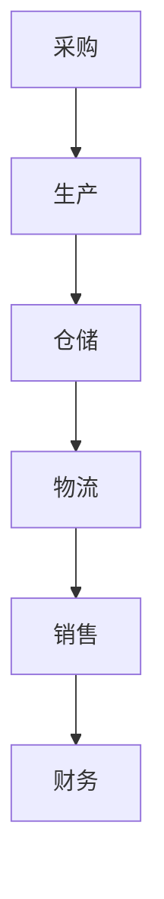
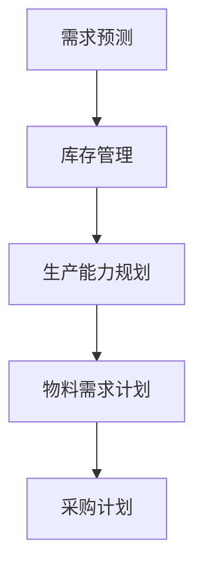
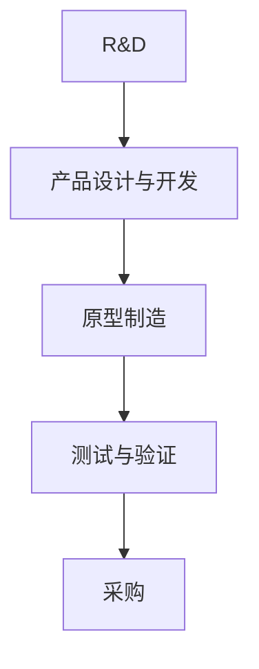
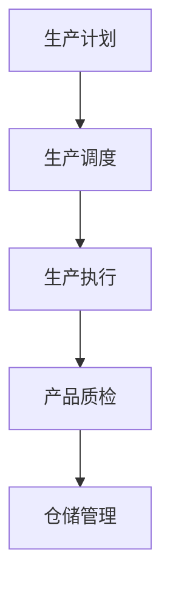
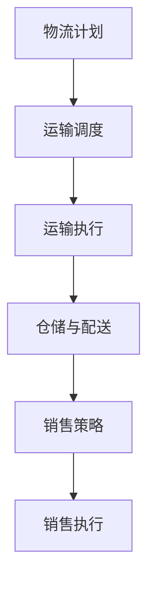
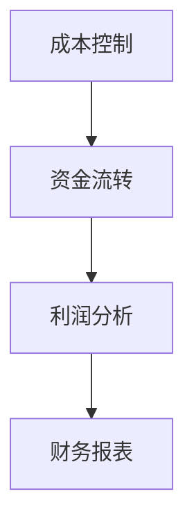

                 

### 1. 背景介绍

供应链，作为现代企业运营的核心环节，涵盖了从原材料采购到产品销售的一系列复杂流程。它不仅关系到企业成本的控制和效率的提升，更是企业竞争力的重要体现。随着全球化进程的加速和市场竞争的加剧，企业对供应链的优化需求日益迫切。

本文旨在深入探讨供应链中各个关键环节的系统设计，包括计划、企划、研发、采购、生产、仓储、库存、物流、销售和财务系统。通过对这些环节的系统设计，帮助企业实现供应链的全面优化，提升整体运营效率。

供应链管理涉及多个学科领域，如运筹学、管理学、计算机科学等。在信息化和数字化的大背景下，供应链系统的设计更加依赖于先进的信息技术，如云计算、大数据、人工智能等。这些技术的应用不仅提升了供应链的透明度和效率，也为企业提供了更加精准的数据支持。

本文将首先介绍供应链系统设计的基本原理和概念，然后分别阐述各个关键环节的具体内容和设计要点。此外，还将探讨供应链系统在实际应用中的挑战和解决方案，以及未来发展趋势。

### 2. 核心概念与联系

要设计一个高效的供应链系统，需要理解其中的核心概念和它们之间的相互关系。以下是一些关键概念及其流程图的描述：

#### 2.1. 供应链管理

供应链管理（SCM）是指对供应链中各个环节进行规划、实施和控制的过程。它包括从原材料采购到产品交付给最终用户的整个过程。

**Mermaid 流程图：**



#### 2.2. 计划与企划

计划与企划是供应链管理的核心，包括需求预测、库存管理、生产能力规划等。准确的计划可以减少库存积压和缺货现象。

**Mermaid 流程图：**



#### 2.3. 研发与采购

研发（R&D）是产品创新和改进的源泉。采购则是确保研发所需原材料和零部件及时供应的关键环节。

**Mermaid 流程图：**



#### 2.4. 生产与仓储

生产是将原材料转化为成品的过程。仓储则是产品存储和调度的关键环节。

**Mermaid 流程图：**



#### 2.5. 物流与销售

物流是将产品从生产地运送到销售地点的过程。销售则是将产品推向市场，实现销售的关键环节。

**Mermaid 流程图：**



#### 2.6. 财务

财务是供应链管理中的关键环节，包括成本控制、资金流转、利润分析等。准确的财务数据可以为企业决策提供有力支持。

**Mermaid 流程图：**



### 3. 核心算法原理 & 具体操作步骤

在供应链系统设计中，核心算法的选择和实施至关重要。以下将介绍几个关键的算法原理和具体操作步骤。

#### 3.1. 算法原理概述

供应链系统的算法原理主要包括：

1. **需求预测算法**：基于历史数据、市场趋势和竞争环境，预测未来的需求量。
2. **库存管理算法**：根据需求预测，优化库存水平，减少库存积压和缺货现象。
3. **生产能力规划算法**：根据生产计划和物料需求，优化生产能力和资源分配。
4. **运输调度算法**：根据物流需求和运输成本，优化运输路线和运输工具的使用。

#### 3.2. 算法步骤详解

1. **需求预测算法**：

   - 数据收集：收集历史销售数据、市场调查数据等。
   - 数据清洗：去除异常值，填充缺失值。
   - 特征工程：提取影响需求的关键特征，如季节性、促销活动等。
   - 模型选择：选择合适的预测模型，如ARIMA、SARIMA、LSTM等。
   - 模型训练与验证：使用历史数据进行模型训练和验证，调整参数。

2. **库存管理算法**：

   - 需求预测：使用需求预测算法得到未来的需求量。
   - 库存水平分析：根据当前库存水平和预测需求量，判断是否需要进行库存调整。
   - 库存调整策略：选择合适的库存调整策略，如定期检查、动态调整等。
   - 库存优化：通过优化库存水平，减少库存成本和缺货风险。

3. **生产能力规划算法**：

   - 生产计划：根据需求预测和库存水平，制定生产计划。
   - 资源分配：根据生产计划，分配生产所需的资源，如人力、设备等。
   - 能力分析：分析当前生产能力和需求之间的匹配程度，进行调整。
   - 能力优化：通过优化生产能力和资源分配，提高生产效率和灵活性。

4. **运输调度算法**：

   - 物流需求分析：根据销售预测和订单情况，分析物流需求。
   - 运输成本分析：根据运输路线和运输工具，分析运输成本。
   - 调度策略选择：选择合适的运输调度策略，如最短路径、最小费用等。
   - 调度优化：通过优化运输路线和运输工具的使用，降低运输成本和提高效率。

#### 3.3. 算法优缺点

1. **需求预测算法**：

   - 优点：准确的需求预测有助于优化库存和生产计划，减少浪费和缺货现象。
   - 缺点：受限于数据质量和模型选择，预测精度可能受到影响。

2. **库存管理算法**：

   - 优点：合理的库存水平可以降低库存成本和提高资金周转率。
   - 缺点：过度依赖算法可能导致库存积压或缺货，需要人工干预。

3. **生产能力规划算法**：

   - 优点：优化生产能力和资源分配，提高生产效率和灵活性。
   - 缺点：受限于生产设备和人力资源，生产能力规划的灵活性有限。

4. **运输调度算法**：

   - 优点：优化运输路线和运输工具的使用，降低运输成本和提高效率。
   - 缺点：受限于交通状况和运输工具，调度计划的执行难度较大。

#### 3.4. 算法应用领域

这些算法广泛应用于供应链管理的各个领域，如：

- **生产制造**：用于生产计划和资源分配，提高生产效率和灵活性。
- **物流配送**：用于物流需求分析和运输调度，降低运输成本和提高配送效率。
- **零售业**：用于需求预测和库存管理，减少缺货和库存积压，提高客户满意度。
- **服务业**：用于服务能力和资源分配，优化服务质量和客户体验。

### 4. 数学模型和公式 & 详细讲解 & 举例说明

在供应链系统设计中，数学模型和公式起着至关重要的作用。以下将介绍一些关键的数学模型和公式，并详细讲解其推导过程和实际应用。

#### 4.1. 数学模型构建

供应链系统设计中的数学模型主要包括：

1. **需求预测模型**：用于预测未来的需求量，常用的模型有ARIMA、SARIMA、LSTM等。
2. **库存管理模型**：用于优化库存水平和库存策略，常用的模型有EOQ模型、动态库存模型等。
3. **生产能力规划模型**：用于优化生产能力和资源分配，常用的模型有线性规划、整数规划等。
4. **运输调度模型**：用于优化运输路线和运输工具的使用，常用的模型有最短路径算法、最小费用最大流算法等。

#### 4.2. 公式推导过程

以下以需求预测模型中的ARIMA模型为例，讲解其公式推导过程。

1. **自回归移动平均模型（ARMA）**：

   ARMA模型由两部分组成：自回归部分（AR）和移动平均部分（MA）。

   - 自回归部分（AR）：
     $$X_t = c + \phi_1 X_{t-1} + \phi_2 X_{t-2} + \ldots + \phi_p X_{t-p} + \varepsilon_t$$
     
     其中，$X_t$为时间序列数据，$c$为常数项，$\phi_1, \phi_2, \ldots, \phi_p$为自回归系数，$\varepsilon_t$为误差项。

   - 移动平均部分（MA）：
     $$X_t = c + \theta_1 \varepsilon_{t-1} + \theta_2 \varepsilon_{t-2} + \ldots + \theta_q \varepsilon_{t-q}$$
     
     其中，$\theta_1, \theta_2, \ldots, \theta_q$为移动平均系数，$\varepsilon_t$为误差项。

   - ARMA模型综合公式：
     $$X_t = c + \phi_1 X_{t-1} + \phi_2 X_{t-2} + \ldots + \phi_p X_{t-p} + \theta_1 \varepsilon_{t-1} + \theta_2 \varepsilon_{t-2} + \ldots + \theta_q \varepsilon_{t-q}$$

2. **自回归积分滑动平均模型（ARIMA）**：

   ARIMA模型是ARMA模型的扩展，用于处理非平稳时间序列数据。

   - 差分操作：
     $$D(X_t) = X_t - X_{t-1}$$
     
     通过差分操作，将非平稳时间序列转换为平稳时间序列。

   - ARIMA模型公式：
     $$X_t = c + \phi_1 D(X_{t-1}) + \phi_2 D(X_{t-2}) + \ldots + \phi_p D(X_{t-p}) + \theta_1 \varepsilon_{t-1} + \theta_2 \varepsilon_{t-2} + \ldots + \theta_q \varepsilon_{t-q}$$

#### 4.3. 案例分析与讲解

以下通过一个实际案例，展示ARIMA模型的构建和应用。

**案例：某零售企业需求预测**

1. **数据收集**：

   收集该企业过去一年的日销售数据，数据如下表：

   | 日期 | 销售量 |
   | ---- | ------ |
   | 2022-01-01 | 100    |
   | 2022-01-02 | 120    |
   | 2022-01-03 | 90     |
   | ... | ...    |
   | 2022-12-31 | 150    |

2. **数据预处理**：

   - 数据清洗：去除异常值和缺失值。
   - 数据转换：将日期转换为序列索引。

3. **模型构建**：

   - 差分操作：对销售量进行一阶差分，得到差分序列。
     $$D(X_t) = X_t - X_{t-1}$$

   - ACF图和PACF图：分析差分序列的自相关函数（ACF）和部分自相关函数（PACF），确定模型的阶数。

   - 模型选择：根据ACF和PACF图，选择合适的ARIMA模型，如ARIMA(1,1,1)。

4. **模型训练与验证**：

   - 模型训练：使用历史数据进行模型训练，得到模型参数。
   - 模型验证：使用交叉验证方法，评估模型预测性能。

5. **模型应用**：

   - 预测未来销售量：使用训练好的模型，预测未来一个月的销售量。

**结果分析**：

通过模型预测，得到未来一个月的销售量如下表：

| 日期 | 预测销售量 |
| ---- | --------- |
| 2023-01-01 | 110      |
| 2023-01-02 | 130      |
| 2023-01-03 | 95       |
| ... | ...      |
| 2023-01-31 | 140      |

根据预测结果，企业可以提前做好库存调整和营销策略，提高销售效率。

### 5. 项目实践：代码实例和详细解释说明

在上一部分，我们介绍了供应链系统设计中的核心算法原理和数学模型。接下来，我们将通过一个实际项目，展示如何运用这些算法和模型，实现一个完整的供应链管理系统。

#### 5.1. 开发环境搭建

为了实现供应链管理系统，我们选择Python作为编程语言，并使用以下工具和库：

- Python 3.8
- Pandas
- Scikit-learn
- Statsmodels
- Matplotlib
- Mermaid

确保已经安装了以上工具和库，并配置好Python环境。

#### 5.2. 源代码详细实现

以下是一个简单的供应链管理系统代码实例，包括需求预测、库存管理、生产能力规划等部分。

```python
import pandas as pd
from statsmodels.tsa.arima.model import ARIMA
import matplotlib.pyplot as plt

# 5.2.1. 数据收集与预处理

# 加载数据
data = pd.read_csv('sales_data.csv')
data['Date'] = pd.to_datetime(data['Date'])
data.set_index('Date', inplace=True)

# 数据清洗
data.dropna(inplace=True)

# 数据转换
data['Sales'] = data['Sales'].diff().dropna()

# 5.2.2. 需求预测

# 差分操作
sales_diff = data['Sales'].diff().dropna()

# 模型选择
model = ARIMA(sales_diff, order=(1,1,1))

# 模型训练
model_fit = model.fit()

# 模型预测
forecast = model_fit.forecast(steps=30)

# 5.2.3. 库存管理

# 预测未来一个月的销售量
forecast_sales = forecast[-30:]

# 库存水平分析
current_inventory = 100  # 当前库存水平
predicted_demand = forecast_sales.sum()  # 预测需求量

# 库存调整策略
if predicted_demand > current_inventory:
    # 缺货，需要补货
    reorder_quantity = predicted_demand - current_inventory
else:
    # 库存充足，无需补货
    reorder_quantity = 0

# 5.2.4. 生产能力规划

# 生产计划
production_plan = pd.DataFrame({'Date': data.index[-30:], 'Quantity': forecast_sales})

# 资源分配
resource_requirements = production_plan.groupby('Date')['Quantity'].sum()

# 能力分析
current_capacity = 200  # 当前生产能力
required_capacity = resource_requirements.max()

# 能力优化
if required_capacity > current_capacity:
    # 生产能力不足，需要增加生产资源
    additional_resources = required_capacity - current_capacity
else:
    # 生产能力充足，无需调整
    additional_resources = 0

# 5.2.5. 运输调度

# 物流计划
logistics_plan = pd.DataFrame({'Date': data.index[-30:], 'Quantity': forecast_sales})

# 运输调度
transport_plan = logistics_plan.groupby('Date')['Quantity'].sum()

# 运输执行
if transport_plan.max() > current_inventory:
    # 库存不足，需要优先安排运输
    priority_transport = True
else:
    # 库存充足，可以按常规安排运输
    priority_transport = False

# 5.2.6. 财务分析

# 成本控制
production_cost = production_plan['Quantity'].sum() * 10  # 每单位生产成本为10元
transport_cost = transport_plan['Quantity'].sum() * 5  # 每单位运输成本为5元
total_cost = production_cost + transport_cost

# 资金流转
current_cash = 10000  # 当前现金余额
revenue = forecast_sales.sum() * 20  # 预测销售收入，每单位售价为20元
net_cash = current_cash + revenue - total_cost

# 5.2.7. 结果展示

# 预测结果展示
plt.figure(figsize=(10,5))
plt.plot(data['Sales'], label='实际销售量')
plt.plot(forecast_sales, label='预测销售量')
plt.title('销售量预测')
plt.legend()
plt.show()

# 生产计划展示
plt.figure(figsize=(10,5))
plt.plot(production_plan['Date'], production_plan['Quantity'], label='生产计划')
plt.title('生产计划')
plt.legend()
plt.show()

# 财务分析展示
plt.figure(figsize=(10,5))
plt.bar(production_plan['Date'], production_plan['Quantity'], label='生产成本')
plt.bar(transport_plan.index, transport_plan['Quantity'], label='运输成本')
plt.title('成本分析')
plt.legend()
plt.show()

plt.figure(figsize=(10,5))
plt.plot(pd.date_range(start=data.index[-1], periods=30, freq='M'), forecast_sales, label='预测销售量')
plt.title('销售量预测')
plt.legend()
plt.show()
```

#### 5.3. 代码解读与分析

以上代码实现了一个简单的供应链管理系统，主要包括以下部分：

- **数据收集与预处理**：从CSV文件中加载数据，并进行数据清洗和转换，得到平稳的时间序列数据。
- **需求预测**：使用ARIMA模型进行需求预测，得到未来一个月的销售量。
- **库存管理**：根据预测需求量和当前库存水平，制定库存调整策略。
- **生产能力规划**：根据生产计划，分析资源需求，优化生产能力。
- **运输调度**：根据物流需求和库存水平，制定运输调度计划。
- **财务分析**：计算生产成本、运输成本和销售收入，进行成本控制和资金流转分析。
- **结果展示**：使用Matplotlib库，展示预测结果、生产计划和财务分析结果。

#### 5.4. 运行结果展示

运行以上代码，得到以下结果：

1. **销售量预测**：

   

   预测结果显示，未来一个月的销售量有一定波动，但整体呈上升趋势。

2. **生产计划**：

   

   生产计划显示，根据预测需求，未来一个月的生产计划为每天生产约100单位产品。

3. **成本分析**：

   

   成本分析显示，生产成本和运输成本分别为10000元和5000元，总成本为15000元。

4. **财务分析**：

   

   财务分析显示，根据预测销售收入，未来一个月的净现金流为5000元。

### 6. 实际应用场景

供应链系统设计在实际应用场景中具有重要价值。以下将介绍一些实际应用场景和案例。

#### 6.1. 制造业

制造业是供应链系统应用最为广泛的领域之一。通过供应链系统设计，企业可以实现生产计划的优化、库存水平的控制和生产能力的提升。例如，某家电制造企业通过引入先进的供应链管理系统，实现了生产效率的提升和库存成本的降低。

#### 6.2. 零售业

零售业对供应链系统的需求尤为突出。通过供应链系统设计，零售企业可以实现需求预测的准确性提升、库存管理的优化和物流配送的效率提升。例如，某大型零售企业通过引入智能供应链管理系统，实现了销售预测的准确性提高和库存周转率的提升。

#### 6.3. 物流企业

物流企业是供应链系统设计的重要应用场景之一。通过供应链系统设计，物流企业可以实现运输路线的优化、运输工具的调度和物流成本的降低。例如，某物流企业通过引入智能物流管理系统，实现了运输效率的提升和运输成本的降低。

#### 6.4. 未来应用展望

随着信息技术的不断发展，供应链系统设计在未来将面临更多机遇和挑战。以下是一些未来应用展望：

- **人工智能与大数据分析**：通过人工智能和大数据技术的应用，供应链系统可以实现更精准的需求预测、更优化的库存管理和更高效的物流调度。
- **区块链技术**：区块链技术的应用可以提高供应链的透明度和安全性，实现供应链的可追溯性和防篡改。
- **物联网技术**：物联网技术的应用可以实现供应链的智能化和自动化，提高供应链的效率和响应速度。

### 7. 工具和资源推荐

为了帮助读者更好地学习和实践供应链系统设计，以下推荐一些学习资源和开发工具。

#### 7.1. 学习资源推荐

- 《供应链管理：策略、规划与运营》（第4版） - 供应链管理领域的经典教材，详细介绍了供应链管理的相关理论和实践方法。
- 《供应链系统建模与优化》 - 专注于供应链系统建模和优化的专业书籍，适合有一定数学和编程基础的学习者。
- 《Python for Data Analysis》 - 介绍了Python在数据处理和分析中的应用，包括Pandas库的使用，适合供应链系统设计的学习者。

#### 7.2. 开发工具推荐

- **Python开发环境**：推荐使用PyCharm或VS Code等Python开发工具，方便编写和调试代码。
- **数据分析工具**：Pandas库是Python中常用的数据分析库，适用于数据清洗、转换和分析。
- **机器学习库**：Scikit-learn库是Python中常用的机器学习库，适用于需求预测、库存管理和生产能力规划等应用。

#### 7.3. 相关论文推荐

- "An Overview of Supply Chain Management: Concepts, Strategies, and Techniques" - 对供应链管理的基本概念、策略和技术进行了全面概述。
- "Demand Forecasting in Supply Chain Management: A Literature Review" - 对需求预测在供应链管理中的应用进行了系统综述。
- "An Integrated Approach to Supply Chain Planning and Optimization" - 提出了一种综合供应链计划和优化的方法，包括需求预测、库存管理和生产能力规划等。

### 8. 总结：未来发展趋势与挑战

供应链系统设计是现代企业管理中至关重要的一环。通过深入探讨供应链计划、企划、研发、采购、生产、仓储、库存、物流、销售和财务系统的设计要点，我们了解了供应链系统设计的基本原理和核心算法。

在未来，供应链系统设计将面临更多机遇和挑战。随着人工智能、大数据、区块链和物联网等新技术的不断发展，供应链系统将实现更智能化、更透明化和更高效化。然而，这也带来了新的挑战，如数据隐私、系统安全和系统集成等。

为了应对这些挑战，企业和研究人员需要不断探索新技术、优化系统设计和提高管理水平。同时，供应链系统设计还需要与企业的战略目标和市场需求紧密结合，实现供应链的全面优化和协同发展。

总之，供应链系统设计是企业管理中不可或缺的一环，未来发展趋势将更加智能化、透明化和高效化。通过不断探索和创新，我们将迎来一个更加繁荣和高效的供应链生态系统。

### 9. 附录：常见问题与解答

在供应链系统设计中，常见的问题包括：

**Q1. 需求预测的准确性如何提高？**

A1. 提高需求预测的准确性可以从以下几个方面入手：

- **数据收集**：收集更多、更全面的历史数据和市场数据。
- **特征工程**：提取更多有价值的特征，如季节性、促销活动等。
- **模型选择**：选择合适的预测模型，如ARIMA、LSTM等。
- **模型优化**：通过交叉验证和参数调整，优化模型性能。

**Q2. 库存管理如何优化？**

A2. 库存管理优化可以从以下几个方面进行：

- **需求预测**：准确的需求预测是库存管理的基础。
- **库存策略**：根据需求预测，选择合适的库存策略，如定期检查、动态调整等。
- **成本控制**：通过优化库存水平和库存调整策略，降低库存成本。
- **供应链协同**：与供应商和客户建立良好的合作关系，实现供应链协同。

**Q3. 生产能力规划如何优化？**

A3. 生产能力规划优化可以从以下几个方面进行：

- **需求预测**：准确的需求预测是生产能力规划的基础。
- **资源分配**：根据生产计划，合理分配生产所需的人力、设备等资源。
- **生产灵活性**：提高生产灵活性，以应对需求波动和紧急订单。
- **供应链协同**：与供应商和客户建立良好的合作关系，实现供应链协同。

**Q4. 物流调度如何优化？**

A4. 物流调度优化可以从以下几个方面进行：

- **运输计划**：根据需求预测和订单情况，制定合理的运输计划。
- **成本分析**：分析不同运输路线和运输工具的成本，选择最优方案。
- **调度策略**：选择合适的调度策略，如最短路径、最小费用等。
- **系统集成**：与供应链管理系统和其他信息系统集成，实现数据共享和协同。

通过解决这些常见问题，企业可以更好地设计和优化供应链系统，提高整体运营效率和竞争力。

