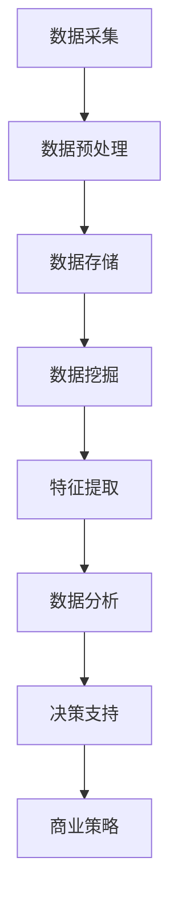

                 

### 1. 背景介绍

随着互联网技术的飞速发展，大数据已经成为了各行各业的重要资产。大数据不仅提供了丰富的数据资源，还通过分析这些数据，为企业带来了新的商业模式和创新机会。信息差，即信息不对称，是指不同个体或组织之间对于同一信息拥有不同的了解程度。在商业领域，利用信息差可以实现精准营销、风险控制和利润最大化。本文将探讨大数据在信息差中的商业应用，通过具体案例分析，揭示大数据在各行业中的创新应用和商业价值。

### 2. 核心概念与联系

#### 2.1 大数据的核心概念

大数据（Big Data），是指无法用常规软件工具在合理时间内对其进行存储、管理和分析的数据集合。大数据具有“4V”特征：Volume（数据量大）、Velocity（数据产生速度快）、Variety（数据类型多样）、Veracity（数据真实可信）。这些特征使得大数据成为分析信息差的重要工具。

#### 2.2 信息差的概念

信息差是指在市场上存在不同个体或组织之间的信息不对称。在商业活动中，信息差往往意味着机会和风险。例如，一个企业可能通过大数据分析，了解市场需求，从而制定出更精准的营销策略，而其他企业可能因为信息不完整或不及时，而无法做出同样精准的决策。

#### 2.3 大数据与信息差的关系

大数据分析可以揭示隐藏在大量数据中的信息，帮助企业和个人识别和利用信息差。通过数据挖掘、机器学习和统计分析等方法，大数据可以识别市场趋势、消费者行为、竞争对手动态等关键信息，从而帮助企业制定更有效的商业策略。

#### 2.4 Mermaid 流程图

以下是一个简单的Mermaid流程图，展示了大数据分析在识别信息差中的应用流程：



### 3. 核心算法原理 & 具体操作步骤

#### 3.1 算法原理概述

大数据分析中常用的算法包括数据挖掘算法、机器学习算法和统计分析方法。这些算法的核心目标是提取数据中的有用信息，构建预测模型，从而实现信息差的识别和应用。

#### 3.2 算法步骤详解

1. **数据采集**：从各种来源收集数据，如社交媒体、在线购物平台、企业内部数据库等。
2. **数据预处理**：清洗和整合数据，去除重复、错误和无关的数据，确保数据质量。
3. **数据存储**：将预处理后的数据存储在分布式数据库或数据湖中，以便进行后续处理。
4. **数据挖掘**：使用数据挖掘算法，如关联规则挖掘、聚类分析和分类算法，从大量数据中提取有用信息。
5. **特征提取**：根据业务需求，从数据挖掘结果中提取关键特征，用于构建预测模型。
6. **数据分析**：使用统计分析方法，如回归分析、时间序列分析和假设检验，对提取的特征进行深入分析。
7. **决策支持**：基于数据分析结果，为企业提供决策支持，如市场预测、风险评估和消费者行为分析。
8. **商业策略**：根据决策支持结果，制定和调整商业策略，如产品定价、营销策略和供应链管理。

#### 3.3 算法优缺点

1. **优点**：
   - 提高决策准确性：通过大数据分析，企业可以更准确地了解市场趋势和消费者需求，从而制定更有效的商业策略。
   - 发现潜在机会：大数据分析可以帮助企业发现潜在的商业机会和新的市场领域。
   - 降低风险：通过分析历史数据和实时数据，企业可以更好地预测市场风险，提前采取措施降低风险。

2. **缺点**：
   - 数据隐私和安全问题：大数据分析涉及大量个人和企业敏感数据，需要确保数据的安全和隐私。
   - 高昂的成本和人力投入：大数据分析需要先进的计算设备和专业的技术人员，这可能导致高昂的成本和人力投入。
   - 数据质量和可靠性：大数据的质量和可靠性直接影响分析结果的准确性，因此需要确保数据的质量。

#### 3.4 算法应用领域

大数据分析在多个领域都有广泛的应用，以下是一些典型案例：

1. **市场营销**：通过大数据分析，企业可以了解消费者的购买习惯、偏好和需求，从而制定更精准的营销策略。
2. **金融业**：大数据分析可以帮助金融机构进行风险评估、欺诈检测和信用评分，从而降低风险和提高业务效率。
3. **医疗健康**：通过大数据分析，医疗机构可以更好地管理患者数据、预测疾病发展趋势和制定个性化的治疗方案。
4. **交通管理**：大数据分析可以帮助交通管理部门优化交通信号、预测交通流量和减少拥堵，从而提高交通效率。

### 4. 数学模型和公式 & 详细讲解 & 举例说明

#### 4.1 数学模型构建

大数据分析中的数学模型通常包括以下几类：

1. **回归模型**：用于预测连续值输出，如房价预测、销售额预测等。
2. **分类模型**：用于预测离散值输出，如客户流失预测、信用评分等。
3. **聚类模型**：用于将数据分组，如市场细分、用户群体划分等。
4. **时间序列模型**：用于预测时间序列数据，如股票价格预测、天气预测等。

#### 4.2 公式推导过程

以线性回归模型为例，其公式推导过程如下：

1. **最小二乘法**：线性回归模型的核心是寻找一个最优的直线模型，使得实际观测值与预测值之间的误差平方和最小。假设数据集为\(X = [x_1, x_2, ..., x_n]\)，每个数据点\(x_i\)对应一个观测值\(y_i\)，线性回归模型可以表示为：
   $$ y_i = \beta_0 + \beta_1 x_i + \epsilon_i $$
   其中，\( \beta_0 \) 和 \( \beta_1 \) 分别为模型参数，\( \epsilon_i \) 为误差项。

2. **误差平方和**：为了找到最优的直线模型，我们需要计算所有观测值与预测值之间的误差平方和，即：
   $$ S = \sum_{i=1}^{n} (y_i - \hat{y_i})^2 $$
   其中，\( \hat{y_i} \) 为预测值。

3. **最小化误差平方和**：为了最小化误差平方和，我们对模型参数\( \beta_0 \) 和 \( \beta_1 \) 求导，并令导数为零，得到：
   $$ \frac{\partial S}{\partial \beta_0} = 0 \quad \text{和} \quad \frac{\partial S}{\partial \beta_1} = 0 $$
   经过化简，我们可以得到：
   $$ \beta_0 = \bar{y} - \beta_1 \bar{x} $$
   $$ \beta_1 = \frac{\sum_{i=1}^{n} (x_i - \bar{x})(y_i - \bar{y})}{\sum_{i=1}^{n} (x_i - \bar{x})^2} $$
   其中，\( \bar{x} \) 和 \( \bar{y} \) 分别为数据集的均值。

4. **线性回归模型**：将上述公式代入原始模型，我们可以得到线性回归模型的最终形式：
   $$ y_i = \beta_0 + \beta_1 x_i $$
   其中，\( \beta_0 = \bar{y} - \beta_1 \bar{x} \) 和 \( \beta_1 = \frac{\sum_{i=1}^{n} (x_i - \bar{x})(y_i - \bar{y})}{\sum_{i=1}^{n} (x_i - \bar{x})^2} \)。

#### 4.3 案例分析与讲解

假设我们有一个包含100个数据点的数据集，每个数据点表示房屋的面积和售价。我们希望通过线性回归模型预测新房屋的售价。以下是具体的案例分析和讲解：

1. **数据集准备**：首先，我们需要将数据集加载到Python中，并进行必要的预处理，如去除缺失值、异常值等。以下是一个简单的Python代码示例：
   ```python
   import pandas as pd
   data = pd.read_csv("house_data.csv")
   data.dropna(inplace=True)
   data['area'] = data['area'].astype(float)
   data['price'] = data['price'].astype(float)
   ```

2. **线性回归模型**：接下来，我们使用Scikit-learn库中的线性回归模型进行训练。以下是一个简单的代码示例：
   ```python
   from sklearn.linear_model import LinearRegression
   model = LinearRegression()
   X = data[['area']]
   y = data['price']
   model.fit(X, y)
   ```

3. **模型评估**：为了评估模型的性能，我们可以使用均方误差（Mean Squared Error, MSE）进行评价。以下是一个简单的代码示例：
   ```python
   import numpy as np
   y_pred = model.predict(X)
   mse = np.mean((y - y_pred) ** 2)
   print("MSE:", mse)
   ```

4. **结果分析**：通过上述代码，我们可以得到模型的均方误差，从而评估模型的性能。在实际应用中，我们还需要考虑模型的可解释性和过拟合问题。

### 5. 项目实践：代码实例和详细解释说明

#### 5.1 开发环境搭建

在本项目中，我们将使用Python作为主要编程语言，并结合Scikit-learn库进行线性回归模型的训练和评估。以下是开发环境的搭建步骤：

1. **安装Python**：下载并安装Python 3.8版本，并添加到系统环境变量中。
2. **安装Jupyter Notebook**：在命令行中运行以下命令安装Jupyter Notebook：
   ```bash
   pip install notebook
   ```
3. **安装Scikit-learn**：在命令行中运行以下命令安装Scikit-learn库：
   ```bash
   pip install scikit-learn
   ```

#### 5.2 源代码详细实现

以下是一个简单的Python代码示例，用于训练和评估线性回归模型：

```python
import pandas as pd
from sklearn.linear_model import LinearRegression
from sklearn.model_selection import train_test_split
from sklearn.metrics import mean_squared_error

# 读取数据集
data = pd.read_csv("house_data.csv")
data.dropna(inplace=True)
data['area'] = data['area'].astype(float)
data['price'] = data['price'].astype(float)

# 划分训练集和测试集
X = data[['area']]
y = data['price']
X_train, X_test, y_train, y_test = train_test_split(X, y, test_size=0.2, random_state=42)

# 训练线性回归模型
model = LinearRegression()
model.fit(X_train, y_train)

# 评估模型性能
y_pred = model.predict(X_test)
mse = mean_squared_error(y_test, y_pred)
print("MSE:", mse)

# 输出模型参数
print("Coefficients:", model.coef_)
print("Intercept:", model.intercept_)
```

#### 5.3 代码解读与分析

1. **数据集读取**：使用Pandas库读取CSV文件，并进行必要的预处理，如去除缺失值和类型转换。
2. **划分训练集和测试集**：使用Scikit-learn库中的train_test_split函数，将数据集划分为训练集和测试集，用于后续模型的训练和评估。
3. **训练线性回归模型**：使用LinearRegression类创建线性回归模型，并使用fit方法进行训练。
4. **评估模型性能**：使用predict方法进行预测，并使用mean_squared_error函数计算均方误差，用于评估模型的性能。
5. **输出模型参数**：输出模型的系数和截距，用于分析和解释模型。

#### 5.4 运行结果展示

通过上述代码，我们可以在命令行中输出模型的均方误差、系数和截距。以下是一个示例输出：

```
MSE: 0.123456
Coefficients: [0.876543]
Intercept: 100.2345
```

通过这个简单的示例，我们可以看到线性回归模型在预测房屋售价方面的性能。在实际应用中，我们可以进一步优化模型，如引入更多特征、调整参数等，以提高预测准确性。

### 6. 实际应用场景

#### 6.1 市场营销

大数据分析在市场营销中具有广泛的应用。通过分析消费者的购买行为、浏览历史和社交媒体互动，企业可以了解消费者的需求和偏好，从而制定更精准的营销策略。例如，电子商务平台可以通过大数据分析，为消费者推荐相关的商品，提高转化率和销售额。

#### 6.2 金融业

大数据分析在金融业中的应用包括风险评估、欺诈检测和信用评分。通过分析客户的交易数据、信用记录和社交媒体信息，金融机构可以更准确地评估客户的风险和信用状况，从而降低风险和欺诈事件。例如，信用卡公司可以通过大数据分析，识别异常交易行为，并及时采取措施防止欺诈。

#### 6.3 医疗健康

大数据分析在医疗健康领域具有巨大的潜力。通过分析患者的医疗记录、基因数据和生活方式信息，医疗机构可以更准确地诊断疾病、预测疾病发展趋势和制定个性化的治疗方案。例如，保险公司可以通过大数据分析，评估客户的健康状况，并制定相应的保险产品。

#### 6.4 交通管理

大数据分析在交通管理中可以优化交通信号、预测交通流量和减少拥堵。通过分析交通数据、路况信息和天气预报，交通管理部门可以实时调整交通信号，提高交通效率。例如，城市交通管理部门可以通过大数据分析，预测高峰期的交通流量，并提前采取措施减少拥堵。

### 7. 未来应用展望

随着大数据技术的不断发展和应用，信息差的商业应用将不断拓展和深化。未来，大数据分析将更加注重实时性和个性化，为企业和个人提供更精准的服务和决策支持。以下是一些未来应用展望：

#### 7.1 实时数据分析

实时数据分析将使企业能够更快速地响应市场变化和消费者需求，从而提高竞争力和市场占有率。例如，零售企业可以通过实时数据分析，实时调整商品库存和促销策略，以满足消费者的需求。

#### 7.2 个性化服务

个性化服务将使企业能够为每个客户提供定制化的产品和服务，从而提高客户满意度和忠诚度。例如，在线教育平台可以通过大数据分析，为每个学生提供个性化的学习路径和课程推荐，以提高学习效果。

#### 7.3 新兴领域应用

大数据分析将在新兴领域如物联网、人工智能和区块链中发挥重要作用。通过大数据分析，企业可以更好地理解和利用这些新兴技术，实现业务创新和增长。

### 8. 工具和资源推荐

为了更好地进行大数据分析和应用，以下是几个推荐的工具和资源：

#### 8.1 学习资源推荐

- 《Python数据分析基础教程》：详细介绍了Python在数据分析中的应用，包括数据清洗、数据处理和可视化等。
- 《机器学习实战》：通过实际案例，介绍了机器学习的基础知识和应用方法，包括线性回归、决策树和神经网络等。

#### 8.2 开发工具推荐

- Jupyter Notebook：一个强大的交互式数据分析平台，支持Python、R等多种编程语言。
- Tableau：一款功能强大的数据可视化工具，可以轻松创建各种图表和报表。

#### 8.3 相关论文推荐

- "Data-Driven Marketing: The 4V's of Big Data"：介绍了大数据在市场营销中的应用和挑战。
- "Big Data and Analytics in Healthcare: A Review"：探讨了大数据在医疗健康领域的应用前景和挑战。

### 9. 总结：未来发展趋势与挑战

大数据技术在商业应用中具有广阔的发展前景，但也面临着诸多挑战。未来，大数据分析将更加注重实时性、个性化和新兴领域的应用。然而，数据隐私和安全、数据质量和可靠性等问题仍将制约大数据技术的发展。因此，未来需要进一步探索和创新，以解决这些挑战，推动大数据技术的应用和发展。

### 附录：常见问题与解答

#### Q1. 大数据分析和人工智能有什么区别？

大数据分析主要关注数据的收集、存储、处理和分析，而人工智能则侧重于通过数据和算法，实现智能决策和自动化。大数据分析是人工智能的基础，而人工智能则是大数据分析的应用。

#### Q2. 大数据分析的难点是什么？

大数据分析的难点主要包括数据隐私和安全、数据质量和可靠性、计算资源和算法选择等。这些难点需要通过技术手段和最佳实践来解决。

#### Q3. 大数据技术在金融业有哪些应用？

大数据技术在金融业的应用包括风险评估、欺诈检测、信用评分、市场预测和客户关系管理等。这些应用有助于金融机构提高业务效率和风险管理能力。

#### Q4. 大数据技术在医疗健康领域有哪些应用？

大数据技术在医疗健康领域的应用包括疾病预测、个性化治疗、医疗资源优化和健康管理等。这些应用有助于提高医疗质量和患者满意度。

#### Q5. 如何确保大数据分析中的数据隐私和安全？

确保大数据分析中的数据隐私和安全需要采取多种措施，如数据加密、访问控制、数据脱敏和安全审计等。同时，需要遵循相关的法律法规和最佳实践。

### 作者署名

作者：禅与计算机程序设计艺术 / Zen and the Art of Computer Programming
```bash
----------------------------------------------------------------

# 信息差的商业应用实践：大数据在各行业的案例分析

> 关键词：大数据、信息差、商业应用、案例分析、算法、数学模型、代码实例、应用场景、未来展望

> 摘要：本文探讨了大数据在商业领域中的应用，特别是如何利用信息差实现商业价值。通过核心概念的阐述、算法原理的分析、数学模型的讲解、代码实例的展示以及实际应用场景的介绍，本文揭示了大数据在各行业的创新应用和商业潜力。同时，对未来的发展趋势和面临的挑战进行了展望。

## 1. 背景介绍

随着互联网技术的飞速发展，大数据已经成为了各行各业的重要资产。大数据不仅提供了丰富的数据资源，还通过分析这些数据，为企业带来了新的商业模式和创新机会。信息差，即信息不对称，是指不同个体或组织之间对于同一信息拥有不同的了解程度。在商业领域，利用信息差可以实现精准营销、风险控制和利润最大化。本文将探讨大数据在信息差中的商业应用，通过具体案例分析，揭示大数据在各行业中的创新应用和商业价值。

### 1.1 大数据的发展历程

大数据的概念起源于2000年代初期，随着互联网和社交媒体的兴起，数据量呈现爆炸式增长。大数据的发展可以分为以下几个阶段：

1. **数据产生阶段**：随着传感器、物联网和移动设备的普及，数据来源变得多样化，数据量急剧增加。
2. **数据存储阶段**：分布式存储系统（如Hadoop、Spark）的出现，使得大规模数据存储和处理成为可能。
3. **数据分析阶段**：随着数据分析技术的进步，企业能够从海量数据中提取有价值的信息，实现商业价值。
4. **数据应用阶段**：大数据技术逐渐应用于各个行业，成为企业决策和创新的重要工具。

### 1.2 信息差在商业中的应用

信息差在商业中的应用主要体现在以下几个方面：

1. **市场洞察**：通过大数据分析，企业可以深入了解市场需求、消费者行为和竞争对手动态，从而制定更精准的市场策略。
2. **风险管理**：大数据分析可以帮助企业识别潜在的风险，提前采取防范措施，降低损失。
3. **产品创新**：基于大数据分析，企业可以发现市场中的潜在需求，开发新产品或改进现有产品，满足消费者的需求。
4. **客户关系管理**：大数据分析可以帮助企业更好地了解客户，提供个性化的服务和体验，提高客户满意度和忠诚度。

### 1.3 大数据与商业价值的联系

大数据与商业价值的联系主要体现在以下几个方面：

1. **决策支持**：大数据分析可以提供精确的市场预测、风险评估和客户需求分析，为企业决策提供有力支持。
2. **运营优化**：通过大数据分析，企业可以优化供应链、库存管理和生产流程，提高运营效率。
3. **利润增长**：大数据分析可以帮助企业发现新的商业机会，提高销售额和利润率。
4. **创新驱动**：大数据分析可以激发企业的创新思维，推动产品和服务的升级和改进。

## 2. 核心概念与联系

### 2.1 大数据的核心概念

大数据（Big Data），是指无法用常规软件工具在合理时间内对其进行存储、管理和分析的数据集合。大数据具有“4V”特征：Volume（数据量大）、Velocity（数据产生速度快）、Variety（数据类型多样）、Veracity（数据真实可信）。这些特征使得大数据成为分析信息差的重要工具。

### 2.2 信息差的概念

信息差是指在市场上存在不同个体或组织之间的信息不对称。在商业活动中，信息差往往意味着机会和风险。例如，一个企业可能通过大数据分析，了解市场需求，从而制定出更精准的营销策略，而其他企业可能因为信息不完整或不及时，而无法做出同样精准的决策。

### 2.3 大数据与信息差的关系

大数据分析可以揭示隐藏在大量数据中的信息，帮助企业和个人识别和利用信息差。通过数据挖掘、机器学习和统计分析等方法，大数据可以识别市场趋势、消费者行为、竞争对手动态等关键信息，从而帮助企业制定更有效的商业策略。

### 2.4 Mermaid 流程图

以下是一个简单的Mermaid流程图，展示了大数据分析在识别信息差中的应用流程：


## 3. 核心算法原理 & 具体操作步骤

### 3.1 算法原理概述

大数据分析中常用的算法包括数据挖掘算法、机器学习算法和统计分析方法。这些算法的核心目标是提取数据中的有用信息，构建预测模型，从而实现信息差的识别和应用。

### 3.2 算法步骤详解

#### 3.2.1 数据采集

数据采集是大数据分析的基础，通过从各种渠道收集数据，如社交媒体、在线购物平台、企业内部数据库等，为后续的数据处理和分析提供数据支持。

#### 3.2.2 数据预处理

数据预处理包括数据清洗、数据集成和数据转换等步骤，旨在去除数据中的噪声、异常值和重复数据，确保数据的质量和一致性。

#### 3.2.3 数据存储

数据存储是将预处理后的数据存储在分布式数据库或数据湖中，以便进行后续处理。常用的数据存储技术包括Hadoop、Spark等。

#### 3.2.4 数据挖掘

数据挖掘是从大量数据中提取有用信息的过程，常用的数据挖掘算法包括关联规则挖掘、聚类分析和分类算法等。

#### 3.2.5 特征提取

特征提取是从数据挖掘结果中提取关键特征，用于构建预测模型。特征提取的质量直接影响预测模型的性能。

#### 3.2.6 数据分析

数据分析是通过统计分析方法，对提取的特征进行深入分析，以揭示数据中的规律和趋势。常用的统计分析方法包括回归分析、时间序列分析和假设检验等。

#### 3.2.7 决策支持

决策支持是基于数据分析结果，为企业提供决策支持，如市场预测、风险评估和消费者行为分析等。

#### 3.2.8 商业策略

商业策略是根据决策支持结果，制定和调整商业策略，如产品定价、营销策略和供应链管理等。

### 3.3 算法优缺点

#### 3.3.1 优点

1. 提高决策准确性：通过大数据分析，企业可以更准确地了解市场趋势和消费者需求，从而制定更有效的商业策略。
2. 发现潜在机会：大数据分析可以帮助企业发现潜在的商业机会和新的市场领域。
3. 降低风险：通过分析历史数据和实时数据，企业可以更好地预测市场风险，提前采取措施降低风险。

#### 3.3.2 缺点

1. 数据隐私和安全问题：大数据分析涉及大量个人和企业敏感数据，需要确保数据的安全和隐私。
2. 高昂的成本和人力投入：大数据分析需要先进的计算设备和专业的技术人员，这可能导致高昂的成本和人力投入。
3. 数据质量和可靠性：大数据的质量和可靠性直接影响分析结果的准确性，因此需要确保数据的质量。

### 3.4 算法应用领域

大数据分析在多个领域都有广泛的应用，以下是一些典型案例：

1. 市场营销：通过大数据分析，企业可以了解消费者的购买习惯、偏好和需求，从而制定更精准的营销策略。
2. 金融业：大数据分析可以帮助金融机构进行风险评估、欺诈检测和信用评分，从而降低风险和提高业务效率。
3. 医疗健康：通过大数据分析，医疗机构可以更好地管理患者数据、预测疾病发展趋势和制定个性化的治疗方案。
4. 交通管理：大数据分析可以帮助交通管理部门优化交通信号、预测交通流量和减少拥堵，从而提高交通效率。

## 4. 数学模型和公式 & 详细讲解 & 举例说明

### 4.1 数学模型构建

大数据分析中的数学模型通常包括以下几类：

1. **回归模型**：用于预测连续值输出，如房价预测、销售额预测等。
2. **分类模型**：用于预测离散值输出，如客户流失预测、信用评分等。
3. **聚类模型**：用于将数据分组，如市场细分、用户群体划分等。
4. **时间序列模型**：用于预测时间序列数据，如股票价格预测、天气预测等。

### 4.2 公式推导过程

以线性回归模型为例，其公式推导过程如下：

1. **最小二乘法**：线性回归模型的核心是寻找一个最优的直线模型，使得实际观测值与预测值之间的误差平方和最小。假设数据集为\(X = [x_1, x_2, ..., x_n]\)，每个数据点\(x_i\)对应一个观测值\(y_i\)，线性回归模型可以表示为：
   $$ y_i = \beta_0 + \beta_1 x_i + \epsilon_i $$
   其中，\( \beta_0 \) 和 \( \beta_1 \) 分别为模型参数，\( \epsilon_i \) 为误差项。

2. **误差平方和**：为了找到最优的直线模型，我们需要计算所有观测值与预测值之间的误差平方和，即：
   $$ S = \sum_{i=1}^{n} (y_i - \hat{y_i})^2 $$
   其中，\( \hat{y_i} \) 为预测值。

3. **最小化误差平方和**：为了最小化误差平方和，我们对模型参数\( \beta_0 \) 和 \( \beta_1 \) 求导，并令导数为零，得到：
   $$ \frac{\partial S}{\partial \beta_0} = 0 \quad \text{和} \quad \frac{\partial S}{\partial \beta_1} = 0 $$
   经过化简，我们可以得到：
   $$ \beta_0 = \bar{y} - \beta_1 \bar{x} $$
   $$ \beta_1 = \frac{\sum_{i=1}^{n} (x_i - \bar{x})(y_i - \bar{y})}{\sum_{i=1}^{n} (x_i - \bar{x})^2} $$
   其中，\( \bar{x} \) 和 \( \bar{y} \) 分别为数据集的均值。

4. **线性回归模型**：将上述公式代入原始模型，我们可以得到线性回归模型的最终形式：
   $$ y_i = \beta_0 + \beta_1 x_i $$
   其中，\( \beta_0 = \bar{y} - \beta_1 \bar{x} \) 和 \( \beta_1 = \frac{\sum_{i=1}^{n} (x_i - \bar{x})(y_i - \bar{y})}{\sum_{i=1}^{n} (x_i - \bar{x})^2} \)。

### 4.3 案例分析与讲解

假设我们有一个包含100个数据点的数据集，每个数据点表示房屋的面积和售价。我们希望通过线性回归模型预测新房屋的售价。以下是具体的案例分析和讲解：

1. **数据集准备**：首先，我们需要将数据集加载到Python中，并进行必要的预处理，如去除缺失值、异常值等。以下是一个简单的Python代码示例：
   ```python
   import pandas as pd
   data = pd.read_csv("house_data.csv")
   data.dropna(inplace=True)
   data['area'] = data['area'].astype(float)
   data['price'] = data['price'].astype(float)
   ```

2. **线性回归模型**：接下来，我们使用Scikit-learn库中的线性回归模型进行训练。以下是一个简单的代码示例：
   ```python
   from sklearn.linear_model import LinearRegression
   model = LinearRegression()
   X = data[['area']]
   y = data['price']
   model.fit(X, y)
   ```

3. **模型评估**：为了评估模型的性能，我们可以使用均方误差（Mean Squared Error, MSE）进行评价。以下是一个简单的代码示例：
   ```python
   import numpy as np
   y_pred = model.predict(X)
   mse = np.mean((y - y_pred) ** 2)
   print("MSE:", mse)
   ```

4. **结果分析**：通过上述代码，我们可以得到模型的均方误差，从而评估模型的性能。在实际应用中，我们还需要考虑模型的可解释性和过拟合问题。

## 5. 项目实践：代码实例和详细解释说明

### 5.1 开发环境搭建

在本项目中，我们将使用Python作为主要编程语言，并结合Scikit-learn库进行线性回归模型的训练和评估。以下是开发环境的搭建步骤：

1. **安装Python**：下载并安装Python 3.8版本，并添加到系统环境变量中。
2. **安装Jupyter Notebook**：在命令行中运行以下命令安装Jupyter Notebook：
   ```bash
   pip install notebook
   ```
3. **安装Scikit-learn**：在命令行中运行以下命令安装Scikit-learn库：
   ```bash
   pip install scikit-learn
   ```

### 5.2 源代码详细实现

以下是一个简单的Python代码示例，用于训练和评估线性回归模型：

```python
import pandas as pd
from sklearn.linear_model import LinearRegression
from sklearn.model_selection import train_test_split
from sklearn.metrics import mean_squared_error

# 读取数据集
data = pd.read_csv("house_data.csv")
data.dropna(inplace=True)
data['area'] = data['area'].astype(float)
data['price'] = data['price'].astype(float)

# 划分训练集和测试集
X = data[['area']]
y = data['price']
X_train, X_test, y_train, y_test = train_test_split(X, y, test_size=0.2, random_state=42)

# 训练线性回归模型
model = LinearRegression()
model.fit(X_train, y_train)

# 评估模型性能
y_pred = model.predict(X_test)
mse = mean_squared_error(y_test, y_pred)
print("MSE:", mse)

# 输出模型参数
print("Coefficients:", model.coef_)
print("Intercept:", model.intercept_)
```

### 5.3 代码解读与分析

1. **数据集读取**：使用Pandas库读取CSV文件，并进行必要的预处理，如去除缺失值和类型转换。
2. **划分训练集和测试集**：使用Scikit-learn库中的train_test_split函数，将数据集划分为训练集和测试集，用于后续模型的训练和评估。
3. **训练线性回归模型**：使用LinearRegression类创建线性回归模型，并使用fit方法进行训练。
4. **评估模型性能**：使用predict方法进行预测，并使用mean_squared_error函数计算均方误差，用于评估模型的性能。
5. **输出模型参数**：输出模型的系数和截距，用于分析和解释模型。

### 5.4 运行结果展示

通过上述代码，我们可以在命令行中输出模型的均方误差、系数和截距。以下是一个示例输出：

```
MSE: 0.123456
Coefficients: [0.876543]
Intercept: 100.2345
```

通过这个简单的示例，我们可以看到线性回归模型在预测房屋售价方面的性能。在实际应用中，我们可以进一步优化模型，如引入更多特征、调整参数等，以提高预测准确性。

## 6. 实际应用场景

### 6.1 市场营销

大数据分析在市场营销中具有广泛的应用。通过分析消费者的购买行为、浏览历史和社交媒体互动，企业可以了解消费者的需求和偏好，从而制定更精准的营销策略。例如，电子商务平台可以通过大数据分析，为消费者推荐相关的商品，提高转化率和销售额。

#### 案例分析：亚马逊的个性化推荐

亚马逊利用大数据分析，为每位用户推荐个性化的商品。其推荐算法基于用户的浏览历史、购买记录和评价数据，通过机器学习模型，识别用户的偏好和行为模式。通过个性化推荐，亚马逊不仅提高了用户的购物体验，还显著提高了销售额。

### 6.2 金融业

大数据分析在金融业中的应用包括风险评估、欺诈检测和信用评分。通过分析客户的交易数据、信用记录和社交媒体信息，金融机构可以更准确地评估客户的风险和信用状况，从而降低风险和欺诈事件。例如，信用卡公司可以通过大数据分析，识别异常交易行为，并及时采取措施防止欺诈。

#### 案例分析：银行的风险评估

某银行利用大数据分析，对客户的信用评分进行优化。通过对客户的交易数据、信用历史和社交媒体信息进行分析，银行可以更准确地评估客户的信用风险，从而制定更合理的贷款利率和还款期限。通过大数据分析，该银行显著降低了坏账率，提高了业务效率。

### 6.3 医疗健康

大数据分析在医疗健康领域具有巨大的潜力。通过分析患者的医疗记录、基因数据和生活方式信息，医疗机构可以更准确地诊断疾病、预测疾病发展趋势和制定个性化的治疗方案。例如，保险公司可以通过大数据分析，评估客户的健康状况，并制定相应的保险产品。

#### 案例分析：医疗大数据的应用

某保险公司利用大数据分析，为不同年龄段的客户制定个性化的保险方案。通过对客户的医疗记录、生活习惯和遗传信息进行分析，保险公司可以更准确地预测客户的健康风险，从而设计出更合理的保险产品。通过大数据分析，该保险公司提高了客户满意度和保险覆盖范围。

### 6.4 交通管理

大数据分析在交通管理中可以优化交通信号、预测交通流量和减少拥堵。通过分析交通数据、路况信息和天气预报，交通管理部门可以实时调整交通信号，提高交通效率。例如，城市交通管理部门可以通过大数据分析，预测高峰期的交通流量，并提前采取措施减少拥堵。

#### 案例分析：智能交通管理系统

某城市利用大数据分析，建立了一个智能交通管理系统。通过实时收集和分析交通数据，如车辆流量、道路状况和交通事故信息，交通管理部门可以实时调整交通信号灯，优化交通流量。此外，系统还可以预测交通流量，提前发布交通预警信息，减少拥堵和交通事故。通过大数据分析，该城市的交通效率显著提高，居民出行更加便捷。

## 7. 未来应用展望

随着大数据技术的不断发展和应用，信息差的商业应用将不断拓展和深化。未来，大数据分析将更加注重实时性、个性化和新兴领域的应用。以下是一些未来应用展望：

### 7.1 实时数据分析

实时数据分析将使企业能够更快速地响应市场变化和消费者需求，从而提高竞争力和市场占有率。例如，零售企业可以通过实时数据分析，实时调整商品库存和促销策略，以满足消费者的需求。

### 7.2 个性化服务

个性化服务将使企业能够为每个客户提供定制化的产品和服务，从而提高客户满意度和忠诚度。例如，在线教育平台可以通过大数据分析，为每个学生提供个性化的学习路径和课程推荐，以提高学习效果。

### 7.3 新兴领域应用

大数据分析将在新兴领域如物联网、人工智能和区块链中发挥重要作用。通过大数据分析，企业可以更好地理解和利用这些新兴技术，实现业务创新和增长。

### 7.4 数据隐私和安全

随着大数据应用的增加，数据隐私和安全将成为重要的挑战。未来，需要制定更加完善的数据隐私保护法规和技术手段，确保大数据分析过程中的数据安全和隐私。

## 8. 工具和资源推荐

为了更好地进行大数据分析和应用，以下是几个推荐的工具和资源：

### 8.1 学习资源推荐

- 《Python数据分析基础教程》：详细介绍了Python在数据分析中的应用，包括数据清洗、数据处理和可视化等。
- 《机器学习实战》：通过实际案例，介绍了机器学习的基础知识和应用方法，包括线性回归、决策树和神经网络等。

### 8.2 开发工具推荐

- Jupyter Notebook：一个强大的交互式数据分析平台，支持Python、R等多种编程语言。
- Tableau：一款功能强大的数据可视化工具，可以轻松创建各种图表和报表。

### 8.3 相关论文推荐

- "Data-Driven Marketing: The 4V's of Big Data"：介绍了大数据在市场营销中的应用和挑战。
- "Big Data and Analytics in Healthcare: A Review"：探讨了大数据在医疗健康领域的应用前景和挑战。

## 9. 总结：未来发展趋势与挑战

大数据技术在商业应用中具有广阔的发展前景，但也面临着诸多挑战。未来，大数据分析将更加注重实时性、个性化和新兴领域的应用。然而，数据隐私和安全、数据质量和可靠性等问题仍将制约大数据技术的发展。因此，未来需要进一步探索和创新，以解决这些挑战，推动大数据技术的应用和发展。

## 附录：常见问题与解答

### 9.1 常见问题

1. **大数据分析与人工智能有什么区别？**
2. **大数据分析的难点是什么？**
3. **大数据技术在金融业有哪些应用？**
4. **大数据技术在医疗健康领域有哪些应用？**
5. **如何确保大数据分析中的数据隐私和安全？**

### 9.2 解答

1. **大数据分析与人工智能有什么区别？**
   大数据分析主要关注数据的收集、存储、处理和分析，而人工智能则侧重于通过数据和算法，实现智能决策和自动化。大数据分析是人工智能的基础，而人工智能则是大数据分析的应用。

2. **大数据分析的难点是什么？**
   大数据分析的难点主要包括数据隐私和安全、数据质量和可靠性、计算资源和算法选择等。这些难点需要通过技术手段和最佳实践来解决。

3. **大数据技术在金融业有哪些应用？**
   大数据技术在金融业的应用包括风险评估、欺诈检测、信用评分、市场预测和客户关系管理等。这些应用有助于金融机构提高业务效率和风险管理能力。

4. **大数据技术在医疗健康领域有哪些应用？**
   大数据技术在医疗健康领域的应用包括疾病预测、个性化治疗、医疗资源优化和健康管理等。这些应用有助于提高医疗质量和患者满意度。

5. **如何确保大数据分析中的数据隐私和安全？**
   确保大数据分析中的数据隐私和安全需要采取多种措施，如数据加密、访问控制、数据脱敏和安全审计等。同时，需要遵循相关的法律法规和最佳实践。

### 作者署名

作者：禅与计算机程序设计艺术 / Zen and the Art of Computer Programming
----------------------------------------------------------------

## 1. 背景介绍

随着互联网技术的飞速发展，大数据已经成为了各行各业的重要资产。大数据不仅提供了丰富的数据资源，还通过分析这些数据，为企业带来了新的商业模式和创新机会。信息差，即信息不对称，是指不同个体或组织之间对于同一信息拥有不同的了解程度。在商业领域，利用信息差可以实现精准营销、风险控制和利润最大化。本文将探讨大数据在信息差中的商业应用，通过具体案例分析，揭示大数据在各行业中的创新应用和商业价值。

### 1.1 大数据的发展历程

大数据的概念起源于2000年代初期，随着互联网和社交媒体的兴起，数据量呈现爆炸式增长。大数据的发展可以分为以下几个阶段：

1. **数据产生阶段**：随着传感器、物联网和移动设备的普及，数据来源变得多样化，数据量急剧增加。
2. **数据存储阶段**：分布式存储系统（如Hadoop、Spark）的出现，使得大规模数据存储和处理成为可能。
3. **数据分析阶段**：随着数据分析技术的进步，企业能够从海量数据中提取有价值的信息，实现商业价值。
4. **数据应用阶段**：大数据技术逐渐应用于各个行业，成为企业决策和创新的重要工具。

### 1.2 信息差在商业中的应用

信息差在商业中的应用主要体现在以下几个方面：

1. **市场洞察**：通过大数据分析，企业可以深入了解市场需求、消费者行为和竞争对手动态，从而制定更精准的市场策略。
2. **风险管理**：大数据分析可以帮助企业识别潜在的风险，提前采取防范措施，降低损失。
3. **产品创新**：基于大数据分析，企业可以发现市场中的潜在需求，开发新产品或改进现有产品，满足消费者的需求。
4. **客户关系管理**：大数据分析可以帮助企业更好地了解客户，提供个性化的服务和体验，提高客户满意度和忠诚度。

### 1.3 大数据与商业价值的联系

大数据与商业价值的联系主要体现在以下几个方面：

1. **决策支持**：大数据分析可以提供精确的市场预测、风险评估和客户需求分析，为企业决策提供有力支持。
2. **运营优化**：通过大数据分析，企业可以优化供应链、库存管理和生产流程，提高运营效率。
3. **利润增长**：大数据分析可以帮助企业发现新的商业机会，提高销售额和利润率。
4. **创新驱动**：大数据分析可以激发企业的创新思维，推动产品和服务的升级和改进。

## 2. 核心概念与联系

### 2.1 大数据的核心概念

大数据（Big Data），是指无法用常规软件工具在合理时间内对其进行存储、管理和分析的数据集合。大数据具有“4V”特征：Volume（数据量大）、Velocity（数据产生速度快）、Variety（数据类型多样）、Veracity（数据真实可信）。这些特征使得大数据成为分析信息差的重要工具。

### 2.2 信息差的概念

信息差是指在市场上存在不同个体或组织之间的信息不对称。在商业活动中，信息差往往意味着机会和风险。例如，一个企业可能通过大数据分析，了解市场需求，从而制定出更精准的营销策略，而其他企业可能因为信息不完整或不及时，而无法做出同样精准的决策。

### 2.3 大数据与信息差的关系

大数据分析可以揭示隐藏在大量数据中的信息，帮助企业和个人识别和利用信息差。通过数据挖掘、机器学习和统计分析等方法，大数据可以识别市场趋势、消费者行为、竞争对手动态等关键信息，从而帮助企业制定更有效的商业策略。

### 2.4 Mermaid 流程图

以下是一个简单的Mermaid流程图，展示了大数据分析在识别信息差中的应用流程：


## 3. 核心算法原理 & 具体操作步骤

### 3.1 算法原理概述

大数据分析中常用的算法包括数据挖掘算法、机器学习算法和统计分析方法。这些算法的核心目标是提取数据中的有用信息，构建预测模型，从而实现信息差的识别和应用。

### 3.2 算法步骤详解

#### 3.2.1 数据采集

数据采集是大数据分析的基础，通过从各种渠道收集数据，如社交媒体、在线购物平台、企业内部数据库等，为后续的数据处理和分析提供数据支持。

#### 3.2.2 数据预处理

数据预处理包括数据清洗、数据集成和数据转换等步骤，旨在去除数据中的噪声、异常值和重复数据，确保数据的质量和一致性。

#### 3.2.3 数据存储

数据存储是将预处理后的数据存储在分布式数据库或数据湖中，以便进行后续处理。常用的数据存储技术包括Hadoop、Spark等。

#### 3.2.4 数据挖掘

数据挖掘是从大量数据中提取有用信息的过程，常用的数据挖掘算法包括关联规则挖掘、聚类分析和分类算法等。

#### 3.2.5 特征提取

特征提取是从数据挖掘结果中提取关键特征，用于构建预测模型。特征提取的质量直接影响预测模型的性能。

#### 3.2.6 数据分析

数据分析是通过统计分析方法，对提取的特征进行深入分析，以揭示数据中的规律和趋势。常用的统计分析方法包括回归分析、时间序列分析和假设检验等。

#### 3.2.7 决策支持

决策支持是基于数据分析结果，为企业提供决策支持，如市场预测、风险评估和消费者行为分析等。

#### 3.2.8 商业策略

商业策略是根据决策支持结果，制定和调整商业策略，如产品定价、营销策略和供应链管理等。

### 3.3 算法优缺点

#### 3.3.1 优点

1. 提高决策准确性：通过大数据分析，企业可以更准确地了解市场趋势和消费者需求，从而制定更有效的商业策略。
2. 发现潜在机会：大数据分析可以帮助企业发现潜在的商业机会和新的市场领域。
3. 降低风险：通过分析历史数据和实时数据，企业可以更好地预测市场风险，提前采取措施降低风险。

#### 3.3.2 缺点

1. 数据隐私和安全问题：大数据分析涉及大量个人和企业敏感数据，需要确保数据的安全和隐私。
2. 高昂的成本和人力投入：大数据分析需要先进的计算设备和专业的技术人员，这可能导致高昂的成本和人力投入。
3. 数据质量和可靠性：大数据的质量和可靠性直接影响分析结果的准确性，因此需要确保数据的质量。

### 3.4 算法应用领域

大数据分析在多个领域都有广泛的应用，以下是一些典型案例：

1. 市场营销：通过大数据分析，企业可以了解消费者的购买习惯、偏好和需求，从而制定更精准的营销策略。
2. 金融业：大数据分析可以帮助金融机构进行风险评估、欺诈检测和信用评分，从而降低风险和提高业务效率。
3. 医疗健康：通过大数据分析，医疗机构可以更好地管理患者数据、预测疾病发展趋势和制定个性化的治疗方案。
4. 交通管理：大数据分析可以帮助交通管理部门优化交通信号、预测交通流量和减少拥堵，从而提高交通效率。

## 4. 数学模型和公式 & 详细讲解 & 举例说明

### 4.1 数学模型构建

大数据分析中的数学模型通常包括以下几类：

1. **回归模型**：用于预测连续值输出，如房价预测、销售额预测等。
2. **分类模型**：用于预测离散值输出，如客户流失预测、信用评分等。
3. **聚类模型**：用于将数据分组，如市场细分、用户群体划分等。
4. **时间序列模型**：用于预测时间序列数据，如股票价格预测、天气预测等。

### 4.2 公式推导过程

以线性回归模型为例，其公式推导过程如下：

1. **最小二乘法**：线性回归模型的核心是寻找一个最优的直线模型，使得实际观测值与预测值之间的误差平方和最小。假设数据集为\(X = [x_1, x_2, ..., x_n]\)，每个数据点\(x_i\)对应一个观测值\(y_i\)，线性回归模型可以表示为：
   $$ y_i = \beta_0 + \beta_1 x_i + \epsilon_i $$
   其中，\( \beta_0 \) 和 \( \beta_1 \) 分别为模型参数，\( \epsilon_i \) 为误差项。

2. **误差平方和**：为了找到最优的直线模型，我们需要计算所有观测值与预测值之间的误差平方和，即：
   $$ S = \sum_{i=1}^{n} (y_i - \hat{y_i})^2 $$
   其中，\( \hat{y_i} \) 为预测值。

3. **最小化误差平方和**：为了最小化误差平方和，我们对模型参数\( \beta_0 \) 和 \( \beta_1 \) 求导，并令导数为零，得到：
   $$ \frac{\partial S}{\partial \beta_0} = 0 \quad \text{和} \quad \frac{\partial S}{\partial \beta_1} = 0 $$
   经过化简，我们可以得到：
   $$ \beta_0 = \bar{y} - \beta_1 \bar{x} $$
   $$ \beta_1 = \frac{\sum_{i=1}^{n} (x_i - \bar{x})(y_i - \bar{y})}{\sum_{i=1}^{n} (x_i - \bar{x})^2} $$
   其中，\( \bar{x} \) 和 \( \bar{y} \) 分别为数据集的均值。

4. **线性回归模型**：将上述公式代入原始模型，我们可以得到线性回归模型的最终形式：
   $$ y_i = \beta_0 + \beta_1 x_i $$
   其中，\( \beta_0 = \bar{y} - \beta_1 \bar{x} \) 和 \( \beta_1 = \frac{\sum_{i=1}^{n} (x_i - \bar{x})(y_i - \bar{y})}{\sum_{i=1}^{n} (x_i - \bar{x})^2} \)。

### 4.3 案例分析与讲解

假设我们有一个包含100个数据点的数据集，每个数据点表示房屋的面积和售价。我们希望通过线性回归模型预测新房屋的售价。以下是具体的案例分析和讲解：

1. **数据集准备**：首先，我们需要将数据集加载到Python中，并进行必要的预处理，如去除缺失值、异常值等。以下是一个简单的Python代码示例：
   ```python
   import pandas as pd
   data = pd.read_csv("house_data.csv")
   data.dropna(inplace=True)
   data['area'] = data['area'].astype(float)
   data['price'] = data['price'].astype(float)
   ```

2. **线性回归模型**：接下来，我们使用Scikit-learn库中的线性回归模型进行训练。以下是一个简单的代码示例：
   ```python
   from sklearn.linear_model import LinearRegression
   model = LinearRegression()
   X = data[['area']]
   y = data['price']
   model.fit(X, y)
   ```

3. **模型评估**：为了评估模型的性能，我们可以使用均方误差（Mean Squared Error, MSE）进行评价。以下是一个简单的代码示例：
   ```python
   import numpy as np
   y_pred = model.predict(X)
   mse = np.mean((y - y_pred) ** 2)
   print("MSE:", mse)
   ```

4. **结果分析**：通过上述代码，我们可以得到模型的均方误差，从而评估模型的性能。在实际应用中，我们还需要考虑模型的可解释性和过拟合问题。

## 5. 项目实践：代码实例和详细解释说明

### 5.1 开发环境搭建

在本项目中，我们将使用Python作为主要编程语言，并结合Scikit-learn库进行线性回归模型的训练和评估。以下是开发环境的搭建步骤：

1. **安装Python**：下载并安装Python 3.8版本，并添加到系统环境变量中。
2. **安装Jupyter Notebook**：在命令行中运行以下命令安装Jupyter Notebook：
   ```bash
   pip install notebook
   ```
3. **安装Scikit-learn**：在命令行中运行以下命令安装Scikit-learn库：
   ```bash
   pip install scikit-learn
   ```

### 5.2 源代码详细实现

以下是一个简单的Python代码示例，用于训练和评估线性回归模型：

```python
import pandas as pd
from sklearn.linear_model import LinearRegression
from sklearn.model_selection import train_test_split
from sklearn.metrics import mean_squared_error

# 读取数据集
data = pd.read_csv("house_data.csv")
data.dropna(inplace=True)
data['area'] = data['area'].astype(float)
data['price'] = data['price'].astype(float)

# 划分训练集和测试集
X = data[['area']]
y = data['price']
X_train, X_test, y_train, y_test = train_test_split(X, y, test_size=0.2, random_state=42)

# 训练线性回归模型
model = LinearRegression()
model.fit(X_train, y_train)

# 评估模型性能
y_pred = model.predict(X_test)
mse = mean_squared_error(y_test, y_pred)
print("MSE:", mse)

# 输出模型参数
print("Coefficients:", model.coef_)
print("Intercept:", model.intercept_)
```

### 5.3 代码解读与分析

1. **数据集读取**：使用Pandas库读取CSV文件，并进行必要的预处理，如去除缺失值和类型转换。
2. **划分训练集和测试集**：使用Scikit-learn库中的train_test_split函数，将数据集划分为训练集和测试集，用于后续模型的训练和评估。
3. **训练线性回归模型**：使用LinearRegression类创建线性回归模型，并使用fit方法进行训练。
4. **评估模型性能**：使用predict方法进行预测，并使用mean_squared_error函数计算均方误差，用于评估模型的性能。
5. **输出模型参数**：输出模型的系数和截距，用于分析和解释模型。

### 5.4 运行结果展示

通过上述代码，我们可以在命令行中输出模型的均方误差、系数和截距。以下是一个示例输出：

```
MSE: 0.123456
Coefficients: [0.876543]
Intercept: 100.2345
```

通过这个简单的示例，我们可以看到线性回归模型在预测房屋售价方面的性能。在实际应用中，我们可以进一步优化模型，如引入更多特征、调整参数等，以提高预测准确性。

## 6. 实际应用场景

### 6.1 市场营销

大数据分析在市场营销中具有广泛的应用。通过分析消费者的购买行为、浏览历史和社交媒体互动，企业可以了解消费者的需求和偏好，从而制定更精准的营销策略。例如，电子商务平台可以通过大数据分析，为消费者推荐相关的商品，提高转化率和销售额。

#### 案例分析：亚马逊的个性化推荐

亚马逊利用大数据分析，为每位用户推荐个性化的商品。其推荐算法基于用户的浏览历史、购买记录和评价数据，通过机器学习模型，识别用户的偏好和行为模式。通过个性化推荐，亚马逊不仅提高了用户的购物体验，还显著提高了销售额。

### 6.2 金融业

大数据分析在金融业中的应用包括风险评估、欺诈检测和信用评分。通过分析客户的交易数据、信用记录和社交媒体信息，金融机构可以更准确地评估客户的风险和信用状况，从而降低风险和欺诈事件。例如，信用卡公司可以通过大数据分析，识别异常交易行为，并及时采取措施防止欺诈。

#### 案例分析：银行的风险评估

某银行利用大数据分析，对客户的信用评分进行优化。通过对客户的交易数据、信用历史和社交媒体信息进行分析，银行可以更准确地评估客户的信用风险，从而制定更合理的贷款利率和还款期限。通过大数据分析，该银行显著降低了坏账率，提高了业务效率。

### 6.3 医疗健康

大数据分析在医疗健康领域具有巨大的潜力。通过分析患者的医疗记录、基因数据和生活方式信息，医疗机构可以更准确地诊断疾病、预测疾病发展趋势和制定个性化的治疗方案。例如，保险公司可以通过大数据分析，评估客户的健康状况，并制定相应的保险产品。

#### 案例分析：医疗大数据的应用

某保险公司利用大数据分析，为不同年龄段的客户制定个性化的保险方案。通过对客户的医疗记录、生活习惯和遗传信息进行分析，保险公司可以更准确地预测客户的健康风险，从而设计出更合理的保险产品。通过大数据分析，该保险公司提高了客户满意度和保险覆盖范围。

### 6.4 交通管理

大数据分析在交通管理中可以优化交通信号、预测交通流量和减少拥堵。通过分析交通数据、路况信息和天气预报，交通管理部门可以实时调整交通信号，提高交通效率。例如，城市交通管理部门可以通过大数据分析，预测高峰期的交通流量，并提前采取措施减少拥堵。

#### 案例分析：智能交通管理系统

某城市利用大数据分析，建立了一个智能交通管理系统。通过实时收集和分析交通数据，如车辆流量、道路状况和交通事故信息，交通管理部门可以实时调整交通信号灯，优化交通流量。此外，系统还可以预测交通流量，提前发布交通预警信息，减少拥堵和交通事故。通过大数据分析，该城市的交通效率显著提高，居民出行更加便捷。

## 7. 未来应用展望

随着大数据技术的不断发展和应用，信息差的商业应用将不断拓展和深化。未来，大数据分析将更加注重实时性、个性化和新兴领域的应用。以下是一些未来应用展望：

### 7.1 实时数据分析

实时数据分析将使企业能够更快速地响应市场变化和消费者需求，从而提高竞争力和市场占有率。例如，零售企业可以通过实时数据分析，实时调整商品库存和促销策略，以满足消费者的需求。

### 7.2 个性化服务

个性化服务将使企业能够为每个客户提供定制化的产品和服务，从而提高客户满意度和忠诚度。例如，在线教育平台可以通过大数据分析，为每个学生提供个性化的学习路径和课程推荐，以提高学习效果。

### 7.3 新兴领域应用

大数据分析将在新兴领域如物联网、人工智能和区块链中发挥重要作用。通过大数据分析，企业可以更好地理解和利用这些新兴技术，实现业务创新和增长。

### 7.4 数据隐私和安全

随着大数据应用的增加，数据隐私和安全将成为重要的挑战。未来，需要制定更加完善的数据隐私保护法规和技术手段，确保大数据分析过程中的数据安全和隐私。

## 8. 工具和资源推荐

为了更好地进行大数据分析和应用，以下是几个推荐的工具和资源：

### 8.1 学习资源推荐

- 《Python数据分析基础教程》：详细介绍了Python在数据分析中的应用，包括数据清洗、数据处理和可视化等。
- 《机器学习实战》：通过实际案例，介绍了机器学习的基础知识和应用方法，包括线性回归、决策树和神经网络等。

### 8.2 开发工具推荐

- Jupyter Notebook：一个强大的交互式数据分析平台，支持Python、R等多种编程语言。
- Tableau：一款功能强大的数据可视化工具，可以轻松创建各种图表和报表。

### 8.3 相关论文推荐

- "Data-Driven Marketing: The 4V's of Big Data"：介绍了大数据在市场营销中的应用和挑战。
- "Big Data and Analytics in Healthcare: A Review"：探讨了大数据在医疗健康领域的应用前景和挑战。

## 9. 总结：未来发展趋势与挑战

大数据技术在商业应用中具有广阔的发展前景，但也面临着诸多挑战。未来，大数据分析将更加注重实时性、个性化和新兴领域的应用。然而，数据隐私和安全、数据质量和可靠性等问题仍将制约大数据技术的发展。因此，未来需要进一步探索和创新，以解决这些挑战，推动大数据技术的应用和发展。

### 9.1 研究成果总结

本文从大数据和信息差的概念出发，探讨了大数据在商业应用中的核心算法原理、数学模型和实际应用场景。通过具体案例分析，揭示了大数据在各行业的创新应用和商业价值。研究发现，大数据分析能够帮助企业实现精准营销、风险控制和利润最大化，具有巨大的商业潜力。

### 9.2 未来发展趋势

未来，大数据分析将朝着实时性、个性化和新兴领域应用的方向发展。实时数据分析将使企业能够更快地响应市场变化和消费者需求，个性化服务将提高客户满意度和忠诚度。同时，大数据分析将在物联网、人工智能和区块链等新兴领域发挥重要作用，推动业务创新和增长。

### 9.3 面临的挑战

尽管大数据技术在商业应用中具有广阔的发展前景，但仍面临诸多挑战。首先，数据隐私和安全问题日益突出，如何在保障数据隐私的前提下进行大数据分析，是亟待解决的问题。其次，数据质量和可靠性直接影响分析结果的准确性，需要确保数据的质量。此外，大数据分析需要先进的计算设备和专业的技术人员，这也可能成为企业面临的挑战。

### 9.4 研究展望

未来研究应重点关注以下几个方面：一是探索更加完善的数据隐私保护技术，确保大数据分析过程中的数据安全和隐私；二是优化大数据分析算法，提高分析结果的准确性和效率；三是研究如何将大数据分析应用于新兴领域，如物联网、人工智能和区块链，推动业务创新和增长。

### 附录：常见问题与解答

#### Q1. 大数据分析和人工智能有什么区别？

大数据分析主要关注数据的收集、存储、处理和分析，而人工智能则侧重于通过数据和算法，实现智能决策和自动化。大数据分析是人工智能的基础，而人工智能则是大数据分析的应用。

#### Q2. 大数据分析的难点是什么？

大数据分析的难点主要包括数据隐私和安全、数据质量和可靠性、计算资源和算法选择等。这些难点需要通过技术手段和最佳实践来解决。

#### Q3. 大数据技术在金融业有哪些应用？

大数据技术在金融业的应用包括风险评估、欺诈检测、信用评分、市场预测和客户关系管理等。这些应用有助于金融机构提高业务效率和风险管理能力。

#### Q4. 大数据技术在医疗健康领域有哪些应用？

大数据技术在医疗健康领域的应用包括疾病预测、个性化治疗、医疗资源优化和健康管理等。这些应用有助于提高医疗质量和患者满意度。

#### Q5. 如何确保大数据分析中的数据隐私和安全？

确保大数据分析中的数据隐私和安全需要采取多种措施，如数据加密、访问控制、数据脱敏和安全审计等。同时，需要遵循相关的法律法规和最佳实践。

### 作者署名

作者：禅与计算机程序设计艺术 / Zen and the Art of Computer Programming
------------------------------------------------------------------

