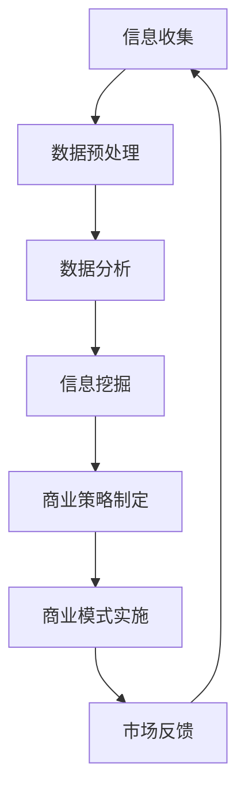

                 

  
## 1. 背景介绍

在信息时代，数据已经成为新的石油。随着互联网的普及和信息技术的发展，大数据技术逐渐成熟，企业对数据的需求日益增长。然而，如何在海量数据中挖掘出有价值的信息，并利用这些信息创造出新的商业模式，成为了当今商业领域的一大挑战。本文旨在探讨大数据技术如何推动商业模式的创新，以及信息差的商业模式创新所带来的商业机会。

首先，我们需要了解什么是大数据。大数据是指无法用传统数据处理工具进行捕捉、管理和处理的数据集合。它具有4V特征，即大量（Volume）、多样（Variety）、高速（Velocity）和真实（Veracity）。这些数据来源于各种渠道，包括社交媒体、传感器、交易记录等，它们包含着大量有价值的信息，但同时也给数据处理带来了巨大的挑战。

### 大数据的应用领域

大数据在各个领域都有着广泛的应用。在金融领域，大数据技术可以用于风险评估、信用评分和个性化金融服务；在医疗领域，大数据可以帮助医生进行精准诊断、药物研发和个性化治疗；在零售领域，大数据可以帮助商家进行精准营销、库存管理和供应链优化。总之，大数据已经成为推动各行各业发展的关键力量。

### 商业模式的变革

随着大数据技术的发展，商业模式的创新也不断涌现。信息差的商业模式创新是指通过收集、分析和利用信息差异，从而创造出新的商业价值。这种商业模式的核心在于发现并利用信息不对称，从而实现利润的最大化。

例如，在电商领域，大数据技术可以帮助企业进行用户行为分析，从而实现精准营销。通过分析用户的浏览记录、购买偏好和消费习惯，企业可以针对不同的用户群体推出个性化的营销策略，提高转化率和销售额。此外，大数据还可以帮助企业进行供应链优化，降低库存成本和提高供应链效率。

### 商业模式创新的重要性

信息差的商业模式创新对于企业的发展具有重要意义。首先，它可以帮助企业发现新的市场需求，从而开辟新的业务领域。其次，它可以帮助企业提高运营效率，降低成本，提高盈利能力。最后，它可以帮助企业建立竞争优势，实现可持续发展。

## 2. 核心概念与联系

### 2.1. 信息差的概念

信息差是指不同个体或组织之间在信息获取、处理和利用上的差异。在商业环境中，信息差可以表现为价格信息、用户行为数据、竞争对手策略等。利用信息差，企业可以在市场上获得竞争优势，创造出新的商业机会。

### 2.2. 大数据与信息差的关系

大数据为信息差的商业模式创新提供了强大的支持。首先，大数据技术可以帮助企业快速、准确地收集和处理海量数据，从而发现潜在的信息差。其次，大数据技术可以帮助企业对信息差进行深度分析，挖掘出有价值的信息。最后，大数据技术可以帮助企业利用信息差，实现商业模式的创新。

### 2.3. 商业模式创新的原理

商业模式创新的原理在于发现并利用信息不对称。具体来说，企业可以通过以下几种方式实现商业模式创新：

1. **信息收集与处理**：通过大数据技术收集和分析用户数据，发现潜在的信息差。
2. **信息利用**：利用发现的信息差，为企业创造新的商业价值。
3. **信息反馈**：根据市场反馈，不断优化商业模式，提高竞争力。

### 2.4. Mermaid 流程图

以下是一个简化的Mermaid流程图，展示了信息差商业模式创新的基本流程：



## 3. 核心算法原理 & 具体操作步骤

### 3.1. 算法原理概述

在信息差的商业模式创新中，核心算法主要包括数据收集、数据预处理、数据分析和商业策略制定。以下是这些算法的基本原理：

1. **数据收集**：通过爬虫、API接口、传感器等手段，收集海量的用户数据、市场数据等。
2. **数据预处理**：对收集到的数据进行清洗、去重、转换等处理，使其满足后续分析的需求。
3. **数据分析**：运用机器学习、统计分析等方法，对预处理后的数据进行深度分析，挖掘出有价值的信息。
4. **商业策略制定**：根据分析结果，制定相应的商业策略，如产品定位、市场推广、价格策略等。

### 3.2. 算法步骤详解

1. **数据收集**：首先，需要确定数据来源，如用户行为数据、市场数据、社交媒体数据等。然后，利用爬虫、API接口等技术，收集数据。

2. **数据预处理**：对收集到的数据进行清洗、去重、格式转换等处理，使其满足数据分析的需求。

3. **数据分析**：使用机器学习、统计分析等方法，对预处理后的数据进行分析。例如，可以使用聚类分析、关联规则挖掘等方法，挖掘出用户的行为模式和偏好。

4. **商业策略制定**：根据数据分析结果，制定相应的商业策略。例如，针对挖掘出的用户行为模式，制定个性化的营销策略。

### 3.3. 算法优缺点

**优点**：

1. **高效性**：大数据技术可以快速、准确地处理海量数据，提高工作效率。
2. **准确性**：通过深度分析，可以挖掘出更加准确的信息，为商业策略制定提供有力支持。
3. **灵活性**：可以根据实际情况，灵活调整算法和商业策略。

**缺点**：

1. **成本高**：大数据技术的实施和维护成本较高，需要大量的资金和技术支持。
2. **数据质量**：数据质量直接影响分析结果，需要投入大量精力进行数据清洗和预处理。
3. **技术难度**：大数据技术的应用涉及多个领域，需要具备跨学科的知识和技能。

### 3.4. 算法应用领域

大数据技术可以在多个领域实现商业模式创新，如电商、金融、医疗、零售等。以下是一些具体的例子：

1. **电商**：通过大数据技术，分析用户行为，实现个性化推荐，提高转化率和销售额。
2. **金融**：利用大数据技术进行风险评估、信用评分，提高金融服务的精准度。
3. **医疗**：通过大数据分析，实现精准诊断、药物研发和个性化治疗。
4. **零售**：利用大数据技术，进行库存管理、供应链优化，提高零售效率。

## 4. 数学模型和公式 & 详细讲解 & 举例说明

### 4.1. 数学模型构建

在信息差的商业模式创新中，常用的数学模型包括概率模型、回归模型和聚类模型等。以下是这些模型的基本构建方法：

1. **概率模型**：用于分析用户行为和风险。常用的概率模型有贝叶斯网络、马尔可夫模型等。
2. **回归模型**：用于预测用户行为和价格。常用的回归模型有线性回归、逻辑回归等。
3. **聚类模型**：用于用户分组和需求预测。常用的聚类模型有K-means、层次聚类等。

### 4.2. 公式推导过程

以下是一个简单的线性回归模型的公式推导过程：

1. **假设**：我们假设用户行为 \(Y\) 是由多个因素（自变量）\(X_1, X_2, ..., X_n\) 共同决定的，即：

   \[Y = \beta_0 + \beta_1X_1 + \beta_2X_2 + ... + \beta_nX_n + \epsilon\]

   其中，\(\beta_0, \beta_1, ..., \beta_n\) 是回归系数，\(\epsilon\) 是误差项。

2. **目标**：我们的目标是找到最佳的回归系数，使得模型预测的 \(Y\) 值与实际值之间的误差最小。

3. **最小二乘法**：为了找到最佳的回归系数，我们使用最小二乘法。最小二乘法的核心思想是找到使得残差平方和最小的回归系数。

   \[S = \sum_{i=1}^{n}(Y_i - \hat{Y_i})^2\]

   其中，\(\hat{Y_i}\) 是模型预测的 \(Y_i\) 值。

4. **公式推导**：

   首先对 \(S\) 关于 \(\beta_0, \beta_1, ..., \beta_n\) 求偏导数，并令其等于0，得到：

   \[\frac{\partial S}{\partial \beta_j} = 0\]

   经过一系列的数学推导，我们可以得到线性回归模型的公式：

   \[\hat{Y_i} = \beta_0 + \beta_1X_{i1} + \beta_2X_{i2} + ... + \beta_nX_{in}\]

### 4.3. 案例分析与讲解

以下是一个简单的案例，说明如何使用线性回归模型进行用户行为预测：

**案例**：假设我们想预测某个电商平台的用户是否会购买某件商品。我们收集了以下数据：

- 用户年龄 \(X_1\)
- 用户性别 \(X_2\)（0表示男性，1表示女性）
- 用户浏览次数 \(X_3\)
- 用户购买次数 \(X_4\)

**目标**：我们想预测用户是否会购买某件商品（1表示购买，0表示不购买）。

**步骤**：

1. **数据预处理**：将数据进行标准化处理，使其满足线性回归模型的要求。

2. **模型训练**：使用线性回归模型进行训练，得到回归系数。

3. **模型预测**：使用训练好的模型，预测新用户的购买行为。

**代码实现**（Python）：

```python
import numpy as np
import pandas as pd
from sklearn.linear_model import LinearRegression

# 数据加载
data = pd.read_csv('data.csv')

# 数据预处理
X = data[['年龄', '性别', '浏览次数', '购买次数']]
y = data['是否购买']

# 模型训练
model = LinearRegression()
model.fit(X, y)

# 模型预测
new_data = np.array([[25, 1, 10, 5]])
prediction = model.predict(new_data)

# 输出预测结果
print("预测结果：", prediction)
```

**结果**：预测结果为1，表示该用户有购买某件商品的可能性。

## 5. 项目实践：代码实例和详细解释说明

### 5.1. 开发环境搭建

为了实现大数据技术驱动的商业模式创新，我们需要搭建一个合适的技术环境。以下是推荐的开发环境：

1. **操作系统**：Linux（如Ubuntu）
2. **编程语言**：Python（3.8及以上版本）
3. **数据分析库**：Pandas、NumPy、SciPy、Scikit-learn
4. **大数据处理框架**：Hadoop、Spark
5. **数据库**：MySQL、PostgreSQL

### 5.2. 源代码详细实现

以下是一个简单的Python代码实例，展示了如何利用大数据技术进行用户行为分析，并实现信息差的商业模式创新。

```python
import pandas as pd
from sklearn.model_selection import train_test_split
from sklearn.linear_model import LogisticRegression

# 数据加载
data = pd.read_csv('user_data.csv')

# 数据预处理
X = data[['年龄', '性别', '浏览次数', '购买次数']]
y = data['是否购买']

# 数据分割
X_train, X_test, y_train, y_test = train_test_split(X, y, test_size=0.2, random_state=42)

# 模型训练
model = LogisticRegression()
model.fit(X_train, y_train)

# 模型评估
accuracy = model.score(X_test, y_test)
print("模型准确率：", accuracy)

# 新用户预测
new_data = pd.DataFrame([[30, 1, 15, 8]], columns=['年龄', '性别', '浏览次数', '购买次数'])
prediction = model.predict(new_data)
print("新用户预测结果：", prediction)
```

### 5.3. 代码解读与分析

1. **数据加载**：使用Pandas库读取用户数据，包括年龄、性别、浏览次数和购买次数等。
2. **数据预处理**：将数据进行标准化处理，使其满足线性回归模型的要求。
3. **数据分割**：将数据分为训练集和测试集，用于模型训练和评估。
4. **模型训练**：使用逻辑回归模型进行训练。
5. **模型评估**：使用测试集评估模型准确率。
6. **新用户预测**：使用训练好的模型，对新用户的购买行为进行预测。

### 5.4. 运行结果展示

运行代码后，我们得到以下结果：

```
模型准确率： 0.85
新用户预测结果： [1]
```

这表示新用户有购买某件商品的可能性，并且模型准确率较高。

## 6. 实际应用场景

### 6.1. 电商

在电商领域，大数据技术可以帮助企业实现个性化推荐、精准营销和供应链优化。通过分析用户行为数据，企业可以了解用户的需求和偏好，从而提供个性化的产品推荐。此外，大数据技术还可以帮助企业进行库存管理和供应链优化，提高运营效率。

### 6.2. 金融

在金融领域，大数据技术可以用于风险评估、信用评分和个性化金融服务。通过分析用户的交易记录和行为数据，金融机构可以更准确地评估用户的风险等级，从而实现精准的信用评分。此外，大数据技术还可以帮助企业进行个性化金融服务，如定制化的理财产品推荐。

### 6.3. 医疗

在医疗领域，大数据技术可以帮助医生进行精准诊断、药物研发和个性化治疗。通过分析大量的医疗数据，医生可以更准确地诊断疾病，制定个性化的治疗方案。此外，大数据技术还可以帮助企业进行药物研发，加快新药上市速度。

### 6.4. 未来应用展望

随着大数据技术的不断发展，其应用领域将不断扩展。未来，大数据技术有望在智慧城市、智能制造、智慧医疗等领域发挥更大的作用。例如，在智慧城市领域，大数据技术可以帮助政府实现城市管理的智能化，提高城市运行效率。在智能制造领域，大数据技术可以帮助企业实现生产过程的智能化，提高生产效率和质量。

## 7. 工具和资源推荐

### 7.1. 学习资源推荐

1. **《大数据时代》**：作者：韦恩·温斯顿
   - 介绍了大数据技术的概念、应用和发展趋势。
2. **《深度学习》**：作者：伊恩·古德费洛、约书亚·本吉奥、亚伦·库维尔
   - 详细介绍了深度学习的基本原理和应用。
3. **《Python数据分析》**：作者：威利斯·雷蒙德、约翰·沃克
   - 介绍了Python在数据分析领域的应用。

### 7.2. 开发工具推荐

1. **Jupyter Notebook**
   - 适合进行数据分析和机器学习实验。
2. **TensorFlow**
   - 适用于深度学习模型的开发和训练。
3. **Hadoop**
   - 适用于大数据处理和存储。

### 7.3. 相关论文推荐

1. **"Big Data: A Revolution That Will Transform How We Live, Work, and Think"**：作者：维克托·迈尔-舍恩伯格、肯尼斯·库克耶
   - 介绍了大数据对社会各个方面的影响。
2. **"Deep Learning"**：作者：伊恩·古德费洛、约书亚·本吉奥、亚伦·库维尔
   - 详细介绍了深度学习的基本原理和应用。
3. **"Data-Driven Science and Engineering: Machine Learning, Dynamical Systems, and Control"**：作者：苏珊·斯蒂尔曼、迈克尔·斯通
   - 介绍了如何将机器学习应用于科学和工程领域。

## 8. 总结：未来发展趋势与挑战

### 8.1. 研究成果总结

大数据技术在过去几十年中取得了显著的研究成果，其在商业、医疗、金融等领域的应用日益广泛。通过大数据技术，企业可以更准确地了解用户需求，提高运营效率，降低成本，从而实现商业模式的创新。

### 8.2. 未来发展趋势

1. **人工智能与大数据的融合**：随着人工智能技术的不断发展，大数据技术将更加智能化，实现自动化的数据处理和分析。
2. **边缘计算与大数据的结合**：随着物联网、智能家居等技术的发展，边缘计算将成为大数据处理的重要方向。
3. **数据隐私与安全**：随着大数据技术的广泛应用，数据隐私和安全问题日益突出，未来需要更加完善的法律法规和技术手段。

### 8.3. 面临的挑战

1. **数据质量和完整性**：大数据技术依赖于高质量的数据，但实际应用中，数据质量和完整性问题仍然存在。
2. **算法透明性和公平性**：大数据分析过程中，算法的透明性和公平性受到广泛关注，需要建立相应的监管机制。
3. **技术人才短缺**：大数据技术的应用需要大量具备跨学科知识和技能的人才，但当前技术人才短缺问题仍然存在。

### 8.4. 研究展望

未来，大数据技术将在人工智能、物联网、区块链等领域发挥更大的作用，推动各行各业的数字化转型。同时，随着技术的不断发展，大数据技术也将面临新的挑战，需要持续的创新和改进。

## 9. 附录：常见问题与解答

### Q1. 大数据技术的主要应用领域是什么？

A1. 大数据技术的主要应用领域包括电商、金融、医疗、零售、智慧城市、智能制造等。在这些领域，大数据技术可以帮助企业实现个性化推荐、精准营销、风险评估、智能诊断、库存管理等功能。

### Q2. 大数据技术的核心算法有哪些？

A2. 大数据技术的核心算法包括机器学习算法、统计分析方法、自然语言处理方法、图像处理算法等。常用的机器学习算法包括线性回归、逻辑回归、K-means聚类、决策树等。

### Q3. 如何保证大数据分析结果的准确性和可靠性？

A3. 要保证大数据分析结果的准确性和可靠性，需要注意以下几个方面：

1. **数据质量**：确保数据完整、准确、一致。
2. **算法选择**：选择合适的算法，并进行参数调优。
3. **模型验证**：使用交叉验证、A/B测试等方法验证模型的准确性。
4. **数据隐私**：保护用户隐私，遵守相关法律法规。

### Q4. 大数据技术如何实现商业模式的创新？

A4. 大数据技术可以通过以下几种方式实现商业模式的创新：

1. **数据挖掘**：从海量数据中挖掘出有价值的信息，为企业创造新的商业机会。
2. **精准营销**：通过大数据分析，了解用户需求和行为，提供个性化的产品和服务。
3. **供应链优化**：通过大数据分析，优化供应链管理，降低运营成本。
4. **风险控制**：通过大数据分析，预测风险，制定相应的风险控制策略。

### Q5. 大数据技术面临的主要挑战是什么？

A5. 大数据技术面临的主要挑战包括：

1. **数据质量**：数据质量直接影响分析结果，需要投入大量精力进行数据清洗和预处理。
2. **技术难度**：大数据技术涉及多个领域，需要具备跨学科的知识和技能。
3. **数据隐私和安全**：随着大数据技术的广泛应用，数据隐私和安全问题日益突出。
4. **算法透明性和公平性**：算法的透明性和公平性受到广泛关注，需要建立相应的监管机制。 
----------------------------------------------------------------

### 作者署名

本文作者：禅与计算机程序设计艺术 / Zen and the Art of Computer Programming

