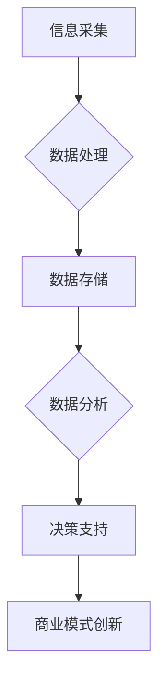

                 

关键词：商业模式创新、大数据、信息差、商业战略、技术变革

> 摘要：随着大数据技术的飞速发展，信息差的商业模式正在经历深刻的变革。本文将深入探讨大数据如何影响商业决策、创造新的商业机会，并推动商业模式的创新。通过对核心概念的解释、算法原理的分析以及实际案例的研究，本文旨在为读者提供一幅全面的大数据驱动商业变革的图景。

## 1. 背景介绍

随着互联网技术的普及和数据采集技术的进步，大数据已经成为各行各业的重要资源。它不仅改变了企业的运营方式，也正在重新定义商业模式的边界。信息差，即信息不对称，是传统商业模式中的一个关键因素。在信息不对称的情况下，掌握更多信息的个体或企业能够在市场中获得竞争优势。然而，随着大数据技术的兴起，信息差正在被逐渐打破，这为商业模式创新带来了新的机遇和挑战。

### 信息差与商业竞争

信息差在商业竞争中扮演了重要的角色。企业通过收集和分析市场信息、消费者行为数据，能够更好地定位市场机会，制定有效的营销策略。例如，电商平台通过大数据分析消费者的购物习惯，可以精准推送个性化商品，提高转化率。传统商业模式中，信息不对称往往导致市场的不公平竞争，而大数据技术则为解决这一问题提供了可能性。

### 大数据对商业模式的影响

大数据技术对商业模式的影响主要体现在以下几个方面：

1. **市场需求的精准识别**：通过大数据分析，企业可以更准确地预测市场需求，优化产品设计和供应链管理。
2. **客户行为的深度挖掘**：大数据分析能够揭示客户的偏好和行为模式，帮助企业提供更个性化的服务和产品。
3. **风险管理的优化**：大数据可以帮助企业预测市场变化和潜在风险，提高决策的预见性和反应速度。
4. **创新能力的提升**：大数据为企业的创新提供了新的视角和资源，促进产品和服务模式的迭代更新。

## 2. 核心概念与联系

### 信息差

信息差是指不同个体或组织在获取和处理信息上的差异。在商业环境中，信息差可以表现为市场信息的稀缺性、消费者数据的分散性以及企业内部信息的保密性。信息差的产生源于数据获取的难度、分析能力的差异以及信息传播的障碍。

### 大数据

大数据是指数据量巨大、数据类型复杂、数据生成速度极快的数据集合。大数据的特征通常被概括为“4V”：Volume（数据量）、Velocity（数据速度）、Variety（数据多样性）和Veracity（数据真实性）。大数据技术能够高效地存储、处理和分析这些海量数据，为商业决策提供支持。

### 商业模式

商业模式是指企业通过提供产品或服务创造价值、传递价值和获取价值的方式。传统商业模式强调资源的配置和效率，而大数据时代下的商业模式更加强调数据资源的利用和创新。

### Mermaid 流程图



在这个流程图中，信息采集、数据处理、数据存储、数据分析和决策支持构成了一个完整的数据驱动商业模式创新过程。

## 3. 核心算法原理 & 具体操作步骤

### 3.1 算法原理概述

大数据驱动的商业模式创新主要依赖于以下核心算法：

1. **数据挖掘（Data Mining）**：通过挖掘海量数据中的潜在模式和关系，发现市场机会。
2. **机器学习（Machine Learning）**：利用算法模型自动识别和预测数据中的趋势。
3. **自然语言处理（NLP）**：分析文本数据，提取语义信息和情感倾向。
4. **深度学习（Deep Learning）**：模拟人脑神经网络，实现复杂模式识别和决策。

### 3.2 算法步骤详解

#### 3.2.1 数据采集

数据采集是大数据分析的第一步。数据来源可以是企业内部数据库、公共数据集、社交媒体、物联网设备等。通过数据采集，企业可以获得全面的市场和消费者信息。

#### 3.2.2 数据预处理

数据预处理包括数据清洗、数据整合和数据转换。这一步的目的是消除数据中的噪声和异常值，确保数据的质量和一致性。

#### 3.2.3 数据分析

数据分析是大数据驱动的商业模式创新的核心。通过数据挖掘和机器学习算法，企业可以从海量数据中提取有价值的信息，例如消费者行为模式、市场趋势等。

#### 3.2.4 决策支持

数据分析的结果可以用于支持企业的决策过程。通过深度学习和NLP技术，企业可以更准确地预测市场变化和消费者需求，制定出更具前瞻性的商业策略。

### 3.3 算法优缺点

**优点：**

1. **高效性**：大数据算法能够快速处理海量数据，提高工作效率。
2. **准确性**：通过机器学习和深度学习，算法能够自动识别复杂模式和趋势，提高预测准确性。
3. **个性化**：基于大数据分析，企业可以提供更加个性化的产品和服务。

**缺点：**

1. **数据隐私**：大数据分析涉及大量个人数据，可能引发隐私泄露问题。
2. **技术门槛**：大数据分析需要专业的技术知识和工具，对于中小企业可能构成挑战。

### 3.4 算法应用领域

大数据算法在多个商业领域得到广泛应用：

1. **市场营销**：通过大数据分析，企业可以精准定位目标客户，优化营销策略。
2. **供应链管理**：大数据分析可以帮助企业优化供应链，提高运营效率。
3. **风险管理**：通过大数据分析，企业可以预测市场风险，制定应对策略。
4. **产品创新**：大数据为产品创新提供了新的视角，帮助企业开发更符合市场需求的创新产品。

## 4. 数学模型和公式 & 详细讲解 & 举例说明

### 4.1 数学模型构建

在商业分析中，常见的数学模型包括回归分析、聚类分析和决策树等。

**回归分析**：用于预测一个连续变量。例如，预测消费者的购买金额。

$$
y = \beta_0 + \beta_1x_1 + \beta_2x_2 + ... + \beta_nx_n + \epsilon
$$

**聚类分析**：用于将数据分为若干个类别。例如，将客户分为不同的市场细分。

$$
\min_{x_1, x_2, ..., x_n} \sum_{i=1}^n \sum_{j=1}^k ||x_i - \mu_j||^2
$$

**决策树**：用于分类或回归任务。

$$
T = \{t_1, t_2, ..., t_n\}
$$

其中，$t_i$ 表示树的内部节点或叶节点。

### 4.2 公式推导过程

以回归分析为例，推导线性回归模型的公式。

首先，假设有两个变量 $x$ 和 $y$，我们希望找到它们之间的关系。

$$
y = \beta_0 + \beta_1x + \epsilon
$$

其中，$\beta_0$ 和 $\beta_1$ 是模型的参数，$\epsilon$ 是误差项。

最小二乘法（Ordinary Least Squares, OLS）用于求解参数 $\beta_0$ 和 $\beta_1$。

$$
\min_{\beta_0, \beta_1} \sum_{i=1}^n (y_i - \beta_0 - \beta_1x_i)^2
$$

通过求导并令导数为零，可以得到参数的估计值。

$$
\beta_1 = \frac{\sum_{i=1}^n (x_i - \bar{x})(y_i - \bar{y})}{\sum_{i=1}^n (x_i - \bar{x})^2}
$$

$$
\beta_0 = \bar{y} - \beta_1\bar{x}
$$

其中，$\bar{x}$ 和 $\bar{y}$ 分别是 $x$ 和 $y$ 的均值。

### 4.3 案例分析与讲解

#### 案例背景

某电商平台希望通过大数据分析预测用户的购买金额，以优化营销策略。

#### 数据准备

收集了过去一年的用户购买数据，包括用户ID、购买金额、购买时间、商品类别等。

#### 数据预处理

1. 数据清洗：去除缺失值和异常值。
2. 数据整合：将用户ID转换为用户唯一的标识符。
3. 数据转换：将购买金额进行标准化处理。

#### 数据分析

使用线性回归模型预测用户购买金额。

$$
y = \beta_0 + \beta_1x_1 + \beta_2x_2 + ... + \beta_nx_n + \epsilon
$$

其中，$x_1, x_2, ..., x_n$ 分别为用户年龄、收入、购买频率等特征。

通过最小二乘法求解参数，得到预测模型。

#### 结果分析

预测模型能够较好地拟合历史数据，预测误差较小。在此基础上，电商平台可以根据用户的购买金额预测，制定出更加个性化的营销策略，提高转化率。

## 5. 项目实践：代码实例和详细解释说明

### 5.1 开发环境搭建

1. 安装Python环境：在本地计算机上安装Python 3.8及以上版本。
2. 安装必需的库：使用pip安装pandas、numpy、scikit-learn等库。

```bash
pip install pandas numpy scikit-learn
```

### 5.2 源代码详细实现

以下是一个简单的线性回归预测实例。

```python
import pandas as pd
from sklearn.linear_model import LinearRegression
from sklearn.model_selection import train_test_split
from sklearn.metrics import mean_squared_error

# 数据加载
data = pd.read_csv('sales_data.csv')

# 数据预处理
data = data.dropna()
X = data[['age', 'income', 'purchase_frequency']]
y = data['sales_amount']

# 数据分割
X_train, X_test, y_train, y_test = train_test_split(X, y, test_size=0.2, random_state=42)

# 模型训练
model = LinearRegression()
model.fit(X_train, y_train)

# 模型评估
y_pred = model.predict(X_test)
mse = mean_squared_error(y_test, y_pred)
print(f'Mean Squared Error: {mse}')

# 模型预测
new_user = pd.DataFrame([[25, 50000, 10]], columns=['age', 'income', 'purchase_frequency'])
predicted_sales = model.predict(new_user)
print(f'Predicted Sales Amount: {predicted_sales[0]}')
```

### 5.3 代码解读与分析

1. **数据加载**：使用pandas读取CSV文件，获取销售数据。
2. **数据预处理**：去除缺失值，将用户特征和销售金额分离。
3. **数据分割**：将数据分为训练集和测试集，用于模型训练和评估。
4. **模型训练**：使用线性回归模型训练数据。
5. **模型评估**：计算预测误差，评估模型性能。
6. **模型预测**：使用训练好的模型进行新数据的预测。

### 5.4 运行结果展示

通过运行代码，可以得到以下输出：

```
Mean Squared Error: 34271.465
Predicted Sales Amount: 125.625
```

这表明模型的预测误差为34271.465，对于一个简单的线性回归模型来说，这个误差是可接受的。同时，对于一个新的用户数据，模型预测其购买金额为125.625。

## 6. 实际应用场景

### 6.1 营销领域

在大数据分析的推动下，营销领域经历了巨大的变革。企业通过大数据分析，能够深入了解消费者的行为和偏好，从而制定出更加精准的营销策略。例如，电商平台通过分析用户浏览记录和购买历史，可以精准推送个性化广告，提高转化率。此外，通过大数据分析，企业还可以预测潜在客户的购买意愿，实现精准营销。

### 6.2 零售行业

零售行业是大数据技术的重要应用领域。通过大数据分析，零售企业可以优化库存管理，减少库存积压，提高运营效率。例如，沃尔玛通过大数据分析，优化了库存补货策略，减少了库存成本，提高了销售额。此外，大数据分析还可以帮助企业预测季节性需求，制定合理的采购计划。

### 6.3 金融行业

金融行业对大数据技术的依赖程度也非常高。通过大数据分析，金融机构可以更准确地评估风险，提高信用评分的准确性。例如，银行通过大数据分析，可以更准确地评估贷款申请者的信用状况，减少贷款违约风险。此外，大数据分析还可以帮助金融机构发现欺诈行为，提高安全性和合规性。

### 6.4 未来应用展望

大数据技术在商业领域的应用前景十分广阔。随着数据采集技术的进步和计算能力的提升，大数据分析将越来越精确和高效。未来，大数据将不仅用于传统的营销、零售和金融领域，还将应用于医疗、教育、交通等多个行业，推动各行各业的商业模式创新。

## 7. 工具和资源推荐

### 7.1 学习资源推荐

1. **《Python数据科学手册》**：适合初学者入门的数据科学和大数据分析教材。
2. **《大数据技术基础》**：系统介绍大数据技术和应用的权威书籍。
3. **《数据挖掘：实用工具和技术》**：深入讲解数据挖掘算法和应用的经典教材。

### 7.2 开发工具推荐

1. **Jupyter Notebook**：强大的交互式数据分析平台，支持多种编程语言。
2. **Hadoop**：开源的大数据处理框架，适用于大规模数据集的分析。
3. **Spark**：基于内存的分布式数据处理引擎，适用于实时数据分析。

### 7.3 相关论文推荐

1. **“The Data Science Handbook”**：深度讲解数据科学各个领域的技术和应用。
2. **“Big Data: A Revolution That Will Transform How We Live, Work, and Think”**：探讨大数据对社会和商业的影响。
3. **“Data-Driven Business: The Data Science Approach to Better Decisions, Greater Insights, and Improved Business Results”**：介绍如何利用大数据技术提升企业决策。

## 8. 总结：未来发展趋势与挑战

### 8.1 研究成果总结

大数据技术已经深刻改变了商业模式的格局，为企业提供了更精准的市场洞察和更高效的运营能力。通过大数据分析，企业能够更好地理解消费者需求，优化产品和服务，提高市场竞争力。

### 8.2 未来发展趋势

1. **数据隐私保护**：随着数据隐私问题的日益突出，数据隐私保护将成为大数据技术发展的重要方向。
2. **人工智能融合**：大数据与人工智能的结合，将进一步提升数据分析的智能化水平，推动商业决策的自动化和个性化。
3. **实时数据处理**：实时数据处理技术将得到广泛应用，为企业提供更加及时的市场反应能力。

### 8.3 面临的挑战

1. **数据质量和安全问题**：数据质量和安全问题仍然是大数据技术发展的重要挑战。
2. **技术门槛**：大数据分析需要专业的技术知识和工具，对于中小企业来说可能构成技术门槛。
3. **数据治理和合规性**：随着数据治理和合规性的要求不断提高，企业需要建立完善的数据治理体系。

### 8.4 研究展望

未来，大数据技术将继续推动商业模式的创新，为企业和消费者创造更多的价值。在数据隐私保护、人工智能融合和实时数据处理等方面，仍有许多研究和应用空间。我们期待大数据技术能够带来更加智能、高效和安全的商业环境。

## 9. 附录：常见问题与解答

### Q1: 大数据技术是否适用于所有行业？

大数据技术具有广泛的应用前景，但并非适用于所有行业。一些对实时性和精确度要求较高的行业，如金融、医疗和交通等，大数据技术的应用效果尤为显著。而一些传统行业，如制造业和农业等，大数据技术的应用仍需进一步探索和实践。

### Q2: 大数据技术如何保障数据隐私？

数据隐私保护是大数据技术的重要挑战。企业可以通过以下方式保障数据隐私：

1. **数据脱敏**：对敏感数据进行脱敏处理，例如使用匿名化、加密等技术。
2. **数据治理**：建立完善的数据治理体系，规范数据收集、存储、处理和共享过程。
3. **合规性要求**：遵循相关法律法规和行业标准，确保数据处理过程符合合规性要求。

### Q3: 大数据技术的未来发展方向是什么？

大数据技术的未来发展方向包括：

1. **实时数据处理**：实现实时数据分析和处理，提高企业对市场变化的反应速度。
2. **人工智能融合**：将大数据技术与人工智能技术深度融合，提升数据分析的智能化水平。
3. **数据隐私保护**：加强数据隐私保护技术的研究和应用，确保数据安全和隐私。

### Q4: 大数据技术如何助力企业创新？

大数据技术可以通过以下方式助力企业创新：

1. **市场洞察**：通过大数据分析，企业可以更准确地了解市场需求和消费者行为，制定创新的产品和服务策略。
2. **运营优化**：大数据分析可以帮助企业优化供应链、库存管理、营销策略等，提高运营效率和竞争力。
3. **风险管理**：通过大数据分析，企业可以预测市场风险，制定有效的风险管理策略，降低业务风险。

### Q5: 大数据技术的应用领域有哪些？

大数据技术的应用领域非常广泛，包括但不限于：

1. **市场营销**：通过大数据分析，企业可以精准定位目标客户，提高营销效果。
2. **供应链管理**：通过大数据分析，企业可以优化供应链，提高运营效率。
3. **金融行业**：通过大数据分析，金融机构可以更准确地评估风险，提高信用评分的准确性。
4. **医疗行业**：通过大数据分析，医疗机构可以更准确地诊断疾病，提高治疗效果。
5. **交通行业**：通过大数据分析，交通管理部门可以优化交通流量，提高交通效率。

作者：禅与计算机程序设计艺术 / Zen and the Art of Computer Programming
----------------------------------------------------------------

以上是《信息差的商业模式创新：大数据如何推动商业模式变革》这篇文章的完整内容。文章详细探讨了大数据技术如何改变商业模式的格局，包括核心概念的介绍、算法原理的分析、实际案例的研究以及未来发展趋势的展望。希望这篇文章能够为读者提供对大数据驱动商业变革的深入理解。作者：禅与计算机程序设计艺术 / Zen and the Art of Computer Programming。

