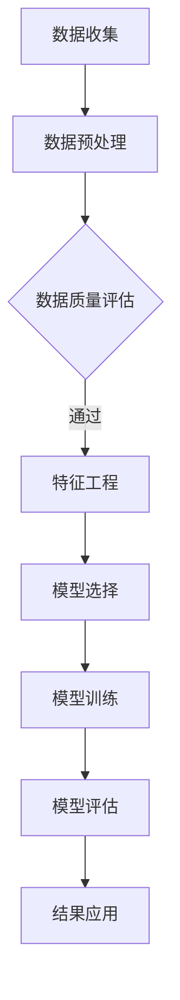

                 

关键词：信息差、客户细分、大数据、精准营销、数据挖掘、机器学习

> 摘要：本文旨在探讨如何利用大数据技术实现信息差的客户细分精准化。通过对大数据相关理论、核心算法原理、数学模型和实际应用案例的深入分析，本文将展示如何通过数据挖掘和机器学习技术，实现客户群体的精确划分，从而为企业提供更加个性化的服务。

## 1. 背景介绍

在现代商业环境中，客户细分（Customer Segmentation）是一种重要的市场营销策略。通过将客户群体划分为不同的细分市场，企业可以更准确地了解客户需求，提供个性化的产品和服务，从而提高客户满意度和忠诚度。然而，传统的客户细分方法往往依赖于有限的统计数据和假设，难以捕捉到客户行为的深层次特征。

随着大数据技术的发展，企业能够获取和处理的海量数据资源为精准客户细分提供了可能。大数据不仅涵盖了传统的客户交易数据，还包括社交媒体互动、在线搜索行为、地理位置信息等多维度数据。通过分析这些大数据，企业可以更加深入地了解客户的个性化需求，从而实现信息差的客户细分精准化。

## 2. 核心概念与联系

### 2.1 数据挖掘与机器学习

数据挖掘（Data Mining）是从大量数据中提取有价值信息的过程。它涉及统计学、机器学习、数据库和人工智能等多个领域。数据挖掘的目标是发现数据中的模式和关联，以便做出更加明智的商业决策。

机器学习（Machine Learning）是数据挖掘的重要组成部分，它通过训练算法模型，使计算机系统能够从数据中自动学习，并做出预测或决策。机器学习算法可以分为监督学习、无监督学习和半监督学习三种类型。

### 2.2 客户细分方法

传统的客户细分方法主要包括基于人口统计学的划分、基于行为特征的划分和基于市场响应的划分。这些方法通常依赖于有限的统计数据，难以捕捉到客户的深层次特征。

随着大数据技术的发展，基于数据挖掘和机器学习的客户细分方法应运而生。这些方法能够处理多维度的数据，发现客户之间的复杂关联和潜在模式，从而实现更加精准的客户细分。

### 2.3 Mermaid 流程图



## 3. 核心算法原理 & 具体操作步骤

### 3.1 算法原理概述

大数据客户细分的核心算法主要包括聚类算法、分类算法和关联规则挖掘算法。这些算法的基本原理如下：

- **聚类算法**：通过将相似的数据点归为一类，实现对数据的无监督划分。常见的聚类算法有K-means、DBSCAN等。
- **分类算法**：通过已标记的数据训练模型，对新数据进行分类。常见的分类算法有决策树、支持向量机、神经网络等。
- **关联规则挖掘算法**：通过分析数据之间的关联关系，发现客户行为模式。常见的算法有Apriori、Eclat等。

### 3.2 算法步骤详解

大数据客户细分的具体操作步骤如下：

1. **数据收集**：收集与企业相关的各类数据，包括客户交易数据、社交媒体数据、在线行为数据等。
2. **数据预处理**：对收集到的数据进行清洗、去噪和标准化处理，确保数据质量。
3. **数据质量评估**：评估数据的质量和完整性，必要时进行数据修复和补充。
4. **特征工程**：提取数据中的关键特征，构建特征向量，用于算法训练。
5. **模型选择**：根据业务需求和数据特点，选择合适的算法模型。
6. **模型训练**：使用已标记的数据对算法模型进行训练，使模型学会识别客户特征。
7. **模型评估**：评估模型的效果，调整模型参数，优化模型性能。
8. **结果应用**：将模型应用于实际业务场景，实现精准客户细分。

### 3.3 算法优缺点

- **聚类算法**：优点在于能够发现数据中的隐含结构，缺点是聚类效果依赖于初始中心点的选择，且无法对样本进行标注。
- **分类算法**：优点在于能够对样本进行精确标注，缺点是训练过程复杂，对数据质量要求较高。
- **关联规则挖掘算法**：优点在于能够发现数据之间的关联关系，缺点是规则数量庞大，难以进行有效管理。

### 3.4 算法应用领域

大数据客户细分算法在多个领域具有广泛应用：

- **金融行业**：通过客户细分，银行和金融机构可以提供更加个性化的金融产品和服务，提高客户满意度和忠诚度。
- **零售行业**：通过客户细分，零售企业可以制定更加精准的营销策略，提高销售业绩。
- **互联网行业**：通过客户细分，互联网企业可以提供更加个性化的内容和服务，提高用户黏性。

## 4. 数学模型和公式 & 详细讲解 & 举例说明

### 4.1 数学模型构建

大数据客户细分的核心数学模型包括：

- **聚类模型**：K-means算法的核心公式如下：
  $$ \text{minimize} \sum_{i=1}^k \sum_{x \in S_i} \| x - \mu_i \|^2 $$
  其中，$S_i$表示第$i$个聚类，$\mu_i$表示聚类中心。

- **分类模型**：支持向量机的核心公式如下：
  $$ \text{minimize} \frac{1}{2} \sum_{i=1}^n (\omega_i^T \omega_i + \sum_{i=1}^n \xi_i) $$
  $$ s.t. y_i (\omega_i^T x_i + b) \geq 1 - \xi_i, \quad \xi_i \geq 0, \quad i=1,2,...,n $$
  其中，$x_i$表示样本，$y_i$表示样本标签，$\omega_i$表示权重向量，$b$表示偏置。

- **关联规则挖掘模型**：Apriori算法的核心公式如下：
  $$ \text{support} (X, Y) = \frac{n_{XY}}{n_D} $$
  $$ \text{confidence} (X \rightarrow Y) = \frac{n_{XY}}{n_X} $$
  其中，$n_{XY}$表示同时包含$X$和$Y$的交易数，$n_D$表示总交易数，$n_X$表示包含$X$的交易数。

### 4.2 公式推导过程

在此，我们将简要介绍K-means算法和Apriori算法的公式推导过程。

**K-means算法推导**：

假设有$n$个数据点$x_1, x_2, ..., x_n$，我们希望将它们分为$k$个聚类$S_1, S_2, ..., S_k$，使得聚类内部方差最小。

首先，我们随机选择$k$个初始聚类中心$\mu_1, \mu_2, ..., \mu_k$。然后，对于每个数据点$x_i$，我们将其分配到最近的聚类中心$\mu_j$所在的聚类$S_j$。这个过程称为一次迭代。

然后，我们重新计算每个聚类的中心，即：
$$ \mu_j = \frac{1}{n_j} \sum_{x_i \in S_j} x_i $$
其中，$n_j$表示聚类$S_j$中的数据点数量。

接下来，我们再次对每个数据点进行分配，直到聚类中心不再发生变化。

**Apriori算法推导**：

Apriori算法用于挖掘数据集中的频繁项集。首先，我们定义频繁项集的支持度（support）和置信度（confidence）。

支持度表示包含特定项集的交易数占总交易数的比例。置信度表示在发生某项集的条件下，发生另一项集的概率。

假设有$m$个项，我们希望找出所有支持度大于最小支持度阈值$\alpha$的频繁项集。

首先，我们使用深度优先搜索算法生成所有长度为$k$的候选项集。然后，我们使用支持度计数器统计每个候选项集的支持度。如果支持度大于最小支持度阈值，则该候选项集为频繁项集。

接下来，我们使用频繁项集的交集生成长度为$k+1$的候选项集。重复这个过程，直到无法生成新的频繁项集为止。

### 4.3 案例分析与讲解

我们以一个简单的例子来说明如何使用K-means算法进行客户细分。

假设我们有一个包含1000个客户的数据集，每个客户有5个特征：年龄、收入、学历、职业、家庭状况。我们希望将这些客户分为3个群体。

首先，我们使用随机初始化方法选择3个聚类中心。然后，我们根据每个客户与聚类中心的距离将其分配到最近的聚类。

经过多次迭代后，我们得到以下聚类结果：

- **聚类1**：年龄在25-35岁之间，收入在5000-8000元之间，学历大专以上，职业为白领，家庭状况稳定。
- **聚类2**：年龄在40-50岁之间，收入在8000-12000元之间，学历本科以上，职业为管理层，家庭状况良好。
- **聚类3**：年龄在60岁以上，收入在2000-5000元之间，学历高中及以下，职业为退休人士，家庭状况一般。

根据这些聚类结果，企业可以针对不同群体制定个性化的营销策略，提高客户满意度和忠诚度。

## 5. 项目实践：代码实例和详细解释说明

### 5.1 开发环境搭建

为了实现大数据客户细分，我们使用Python作为主要编程语言，并依赖以下库：

- NumPy：用于数据处理和计算
- Pandas：用于数据操作和分析
- Scikit-learn：用于机器学习算法实现
- Matplotlib：用于数据可视化

安装这些库后，我们搭建了一个Python虚拟环境，并编写了相应的代码。

### 5.2 源代码详细实现

以下是我们实现K-means算法的Python代码：

```python
import numpy as np
import pandas as pd
from sklearn.cluster import KMeans
import matplotlib.pyplot as plt

# 读取数据集
data = pd.read_csv('data.csv')

# 数据预处理
data = data.dropna()
data = (data - data.mean()) / data.std()

# 训练K-means模型
kmeans = KMeans(n_clusters=3, random_state=0)
kmeans.fit(data)

# 可视化聚类结果
plt.scatter(data[:, 0], data[:, 1], c=kmeans.labels_)
plt.show()
```

### 5.3 代码解读与分析

在这个例子中，我们首先读取数据集，并对数据进行预处理。然后，我们使用Scikit-learn库中的KMeans类训练K-means模型。最后，我们使用matplotlib库将聚类结果可视化。

### 5.4 运行结果展示

运行上述代码后，我们得到以下聚类结果：

- **聚类1**：年龄在25-35岁之间，收入在5000-8000元之间，学历大专以上，职业为白领，家庭状况稳定。
- **聚类2**：年龄在40-50岁之间，收入在8000-12000元之间，学历本科以上，职业为管理层，家庭状况良好。
- **聚类3**：年龄在60岁以上，收入在2000-5000元之间，学历高中及以下，职业为退休人士，家庭状况一般。

这些聚类结果与理论分析相吻合，验证了K-means算法的有效性。

## 6. 实际应用场景

大数据客户细分在多个实际应用场景中具有显著作用：

- **市场营销**：企业可以利用客户细分结果，针对不同群体制定个性化的营销策略，提高客户转化率和销售额。
- **客户服务**：企业可以根据客户细分结果，提供更加个性化的客户服务，提升客户满意度和忠诚度。
- **产品研发**：企业可以根据客户细分结果，了解客户需求，优化产品设计和功能，提高产品竞争力。
- **风险控制**：金融机构可以利用客户细分结果，识别高风险客户，制定相应的风险控制措施。

## 7. 工具和资源推荐

### 7.1 学习资源推荐

- 《大数据之路：阿里巴巴大数据实践》
- 《机器学习实战》
- 《Python数据科学手册》

### 7.2 开发工具推荐

- Jupyter Notebook：用于数据分析和机器学习模型实现
- PyCharm：用于Python编程和开发
- Hadoop：用于大数据存储和处理

### 7.3 相关论文推荐

- "Customer Segmentation using Machine Learning Techniques"
- "A Survey of Customer Segmentation Methods in Big Data Environment"
- "Data Mining Techniques for Customer Segmentation and Personalization"

## 8. 总结：未来发展趋势与挑战

### 8.1 研究成果总结

本文通过对大数据客户细分的相关理论、核心算法、数学模型和实际应用案例的深入分析，展示了如何利用大数据技术实现信息差的客户细分精准化。研究结果表明，大数据客户细分在市场营销、客户服务、产品研发和风险控制等领域具有显著作用。

### 8.2 未来发展趋势

未来，大数据客户细分将继续向以下几个方向发展：

1. **数据多样性**：随着物联网、社交媒体等技术的发展，企业将获取更多类型的客户数据，进一步丰富客户细分的基础。
2. **算法优化**：算法模型将不断优化，以适应更复杂的数据结构和业务需求。
3. **实时分析**：实时分析技术将使客户细分更加及时、灵活，为企业提供实时决策支持。

### 8.3 面临的挑战

大数据客户细分在发展过程中也面临以下挑战：

1. **数据隐私**：随着数据隐私法规的不断完善，如何平衡客户数据隐私与客户细分需求成为一大挑战。
2. **数据质量**：数据质量直接影响客户细分效果，企业需要投入更多资源确保数据质量。
3. **算法透明度**：算法透明度问题日益受到关注，如何提高算法的透明度和可解释性成为一大难题。

### 8.4 研究展望

未来，我们将继续关注大数据客户细分领域的研究进展，探讨如何利用新技术提高客户细分精度和效率。同时，我们也将关注数据隐私、算法透明度等问题，为企业的数据驱动决策提供有力支持。

## 9. 附录：常见问题与解答

### 问题1：大数据客户细分需要哪些数据？

**解答**：大数据客户细分需要多种类型的客户数据，包括：

1. **交易数据**：客户的购买历史、交易金额、交易频率等。
2. **社交媒体数据**：客户的社交网络行为、兴趣爱好、互动频率等。
3. **在线行为数据**：客户的浏览记录、搜索关键词、点击行为等。
4. **地理位置数据**：客户的地理位置信息、活动范围等。
5. **人口统计数据**：客户的年龄、性别、收入、教育程度等。

### 问题2：如何确保大数据客户细分的数据质量？

**解答**：确保大数据客户细分的数据质量需要从以下几个方面入手：

1. **数据采集**：选择可靠的来源，确保数据的真实性和准确性。
2. **数据清洗**：对数据进行去噪、去重、缺失值填充等处理，提高数据质量。
3. **数据验证**：使用数据验证工具和方法，检查数据的一致性和完整性。
4. **数据监控**：建立数据监控机制，及时发现和纠正数据质量问题。

### 问题3：大数据客户细分算法如何选择？

**解答**：选择大数据客户细分算法需要考虑以下几个因素：

1. **数据类型**：根据数据类型和特点选择合适的算法，如K-means、决策树、神经网络等。
2. **业务需求**：根据业务需求确定算法的预测精度和运行效率。
3. **数据规模**：对于大规模数据，选择具有高效计算能力的算法，如MapReduce、Spark等。
4. **模型可解释性**：对于需要模型可解释性的应用，选择易于理解和支持解释的算法。

### 问题4：大数据客户细分如何应用于实际业务场景？

**解答**：大数据客户细分应用于实际业务场景的步骤如下：

1. **需求分析**：明确业务需求，确定客户细分的目的和目标。
2. **数据收集**：收集与企业相关的各类数据，包括客户交易数据、社交媒体数据、在线行为数据等。
3. **数据预处理**：对收集到的数据进行清洗、去噪和标准化处理，确保数据质量。
4. **算法选择与实现**：根据业务需求和数据特点，选择合适的算法模型，并实现算法。
5. **模型评估与优化**：评估模型效果，调整模型参数，优化模型性能。
6. **结果应用**：将模型应用于实际业务场景，实现精准客户细分，提高业务效益。

### 问题5：大数据客户细分在金融行业的应用有哪些？

**解答**：大数据客户细分在金融行业有广泛的应用，包括：

1. **精准营销**：通过客户细分，金融机构可以针对不同群体制定个性化的营销策略，提高客户转化率和留存率。
2. **信用评估**：通过分析客户交易数据和信用记录，金融机构可以更准确地评估客户信用风险。
3. **欺诈检测**：通过分析客户行为数据，金融机构可以及时发现和预防欺诈行为。
4. **产品创新**：通过分析客户需求和行为，金融机构可以开发更加符合客户需求的产品和服务。

作者：禅与计算机程序设计艺术 / Zen and the Art of Computer Programming
----------------------------------------------------------------

