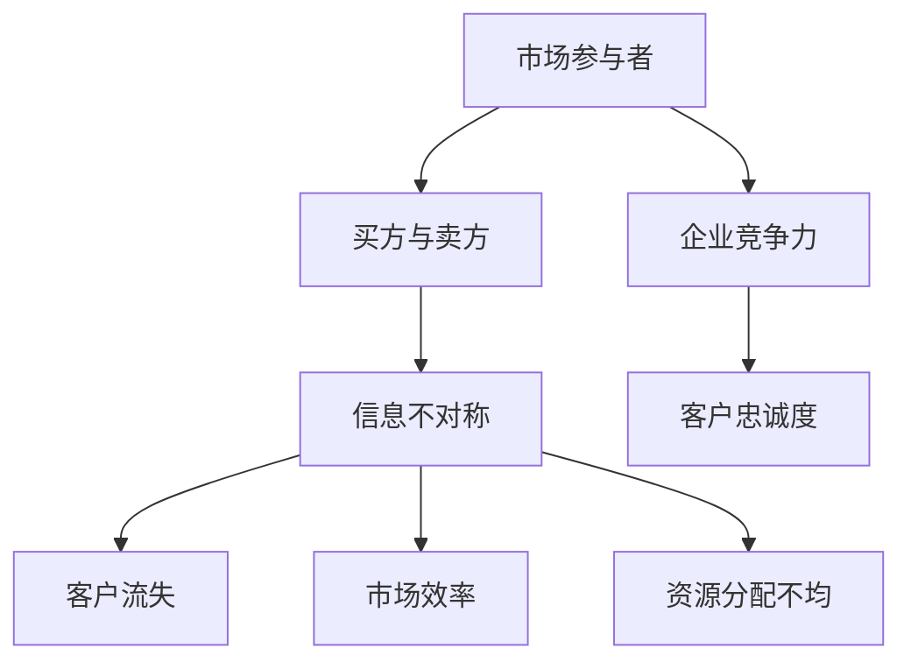

                 

关键词：信息不对称、信息差、客户流失、商业模式、技术策略

> 摘要：本文将探讨信息不对称在商业环境中的影响，特别是在IT行业中的客户流失问题。通过分析信息差的本质和其在市场中的作用，我们将揭示如何通过技术手段和策略降低信息不对称，从而减少客户流失，提升企业的竞争力。

## 1. 背景介绍

在信息化时代，信息已经成为一种重要的资源。然而，信息的不对称性往往导致市场中的不平等现象，特别是在IT行业中，这种信息差更是影响了企业的盈利能力和客户忠诚度。信息不对称是指市场中的某些个体拥有而其他个体缺乏的信息，这种信息的不对称性可能会导致客户流失，从而给企业带来严重的损失。

### 1.1 信息不对称的定义

信息不对称是指在市场交易中，买方和卖方之间的信息不对等。这种不对等可以是买方不知道卖方的产品质量、价格或服务，也可以是卖方不知道买方的购买意愿、预算或偏好。信息不对称是市场失灵的一个重要原因，可能导致市场效率降低、资源分配不均等问题。

### 1.2 信息不对称的影响

在商业环境中，信息不对称可能带来以下负面影响：

- **客户流失**：当客户无法获取充分的信息来做出购买决策时，他们可能会选择其他提供更透明信息或更低价格的竞争对手。
- **市场扭曲**：信息不对称可能导致市场无法达到有效的竞争状态，从而扭曲市场价格和产品品质。
- **信任危机**：信息不对称可能导致客户对企业的不信任，进而影响企业的声誉和客户忠诚度。

## 2. 核心概念与联系

在探讨信息不对称对客户流失的影响之前，我们需要了解几个核心概念及其之间的联系。以下是这些概念和其关系的 Mermaid 流程图：



### 2.1 市场参与者

市场参与者包括买方（消费者）和卖方（企业）。买方是市场的需求方，卖方是市场的供给方。他们的互动构成了市场交易的基本框架。

### 2.2 信息不对称

信息不对称是指市场中的某些个体拥有而其他个体缺乏的信息。在IT行业，这种信息不对称可能表现为客户对产品性能、价格、服务质量等信息的不足。

### 2.3 客户流失

客户流失是指客户因各种原因离开企业的现象。在信息不对称的市场环境中，客户流失可能是由于无法获取充分的信息，从而做出不满意的购买决策。

### 2.4 市场效率

市场效率是指市场资源配置的效率。信息不对称会导致市场效率降低，因为买方和卖方之间的信息不对等会影响市场机制的有效运行。

### 2.5 资源分配不均

资源分配不均是指市场上资源分配的不公平现象。在信息不对称的情况下，拥有更多信息的个体往往能够获得更多的资源，从而导致资源分配不均。

### 2.6 企业竞争力

企业竞争力是指企业在市场中的竞争能力。在信息不对称的市场环境中，拥有更多信息的企业往往能够占据更有利的市场地位。

### 2.7 客户忠诚度

客户忠诚度是指客户对企业的忠诚和持续购买意愿。在信息不对称的情况下，客户忠诚度可能会降低，因为客户无法充分了解企业的产品和服务。

## 3. 核心算法原理 & 具体操作步骤

### 3.1 算法原理概述

为了降低信息不对称，IT行业可以采用以下算法原理：

- **数据挖掘**：通过分析大量数据，提取有价值的信息，为企业提供决策支持。
- **机器学习**：利用机器学习算法，预测客户行为，帮助企业和客户建立更有效的沟通。
- **区块链技术**：通过区块链技术，确保数据的透明性和不可篡改性，从而降低信息不对称。

### 3.2 算法步骤详解

下面是这些算法的具体操作步骤：

#### 3.2.1 数据挖掘

1. **数据收集**：收集来自各种来源的数据，包括客户反馈、市场调查、社交媒体数据等。
2. **数据预处理**：清洗和整合数据，确保数据的质量和一致性。
3. **特征提取**：从原始数据中提取有用的特征，用于后续分析。
4. **模型构建**：利用统计方法或机器学习算法，构建预测模型。
5. **模型评估**：评估模型的预测性能，并进行优化。

#### 3.2.2 机器学习

1. **数据准备**：准备用于训练的数据集，包括输入特征和目标变量。
2. **模型选择**：选择适合问题的机器学习模型，如决策树、支持向量机、神经网络等。
3. **模型训练**：使用训练数据集训练模型，调整模型的参数。
4. **模型评估**：使用测试数据集评估模型的性能，并进行调优。
5. **模型部署**：将模型部署到生产环境中，实现实时预测和决策。

#### 3.2.3 区块链技术

1. **链上数据存储**：将重要数据存储在区块链上，确保数据的透明性和不可篡改性。
2. **智能合约**：编写智能合约，实现自动化交易和数据处理。
3. **节点部署**：部署区块链节点，确保区块链网络的稳定运行。
4. **数据监控**：监控区块链网络的数据流和交易活动，确保数据安全和合规性。

### 3.3 算法优缺点

#### 3.3.1 数据挖掘

- **优点**：能够从大量数据中提取有价值的信息，提高企业的决策效率。
- **缺点**：数据挖掘过程复杂，对数据质量和计算能力有较高要求。

#### 3.3.2 机器学习

- **优点**：能够自动学习和预测客户行为，提高企业的客户满意度。
- **缺点**：模型训练和评估过程耗时较长，对数据量和算法选择有较高要求。

#### 3.3.3 区块链技术

- **优点**：确保数据的透明性和不可篡改性，提高企业的信任度和客户忠诚度。
- **缺点**：区块链技术尚未完全成熟，网络性能和安全性仍需提升。

### 3.4 算法应用领域

这些算法在IT行业的多个领域都有广泛应用，如：

- **客户关系管理**：通过数据挖掘和机器学习，提高客户满意度和忠诚度。
- **供应链管理**：通过区块链技术，确保供应链的透明性和合规性。
- **网络安全**：通过机器学习和区块链技术，提高网络安全性和数据保护能力。

## 4. 数学模型和公式 & 详细讲解 & 举例说明

### 4.1 数学模型构建

为了量化信息不对称对客户流失的影响，我们可以构建以下数学模型：

设：
- \( C \) 为客户数量
- \( L \) 为客户流失率
- \( I \) 为信息不对称程度
- \( M \) 为企业市场份额

客户流失率 \( L \) 与信息不对称程度 \( I \) 之间的关系可以表示为：

\[ L = f(I) \]

其中，函数 \( f \) 描述了信息不对称程度对企业客户流失率的影响。

### 4.2 公式推导过程

为了推导 \( f(I) \) 的表达式，我们可以考虑以下因素：

1. **信息不对称对客户决策的影响**：信息不对称导致客户在购买决策时面临更高的风险，从而可能降低购买意愿。
2. **信息不对称对市场竞争的影响**：信息不对称可能使企业在竞争中处于不利地位，从而影响市场份额。

基于上述因素，我们可以假设：

\[ f(I) = a \cdot I + b \cdot (1 - M) \]

其中，\( a \) 和 \( b \) 为常数，表示信息不对称和市场份额对客户流失率的影响程度。

### 4.3 案例分析与讲解

假设一家IT企业在市场上面临以下情况：

- 客户数量 \( C = 1000 \)
- 信息不对称程度 \( I = 0.3 \)
- 市场份额 \( M = 0.5 \)

根据上述模型，我们可以计算客户流失率 \( L \)：

\[ L = f(I) = 0.3 \cdot 0.3 + 0.5 \cdot (1 - 0.5) = 0.09 + 0.25 = 0.34 \]

因此，该企业的客户流失率为 34%。这意味着，如果企业能够降低信息不对称程度，例如通过提高透明度和信任度，客户流失率可能会降低。

## 5. 项目实践：代码实例和详细解释说明

### 5.1 开发环境搭建

为了实现上述算法，我们需要搭建以下开发环境：

- **Python**：作为主要编程语言
- **Pandas**：用于数据预处理
- **Scikit-learn**：用于机器学习模型构建
- **Blockchain**：用于区块链技术实现

### 5.2 源代码详细实现

以下是实现数据挖掘和机器学习算法的 Python 代码示例：

```python
import pandas as pd
from sklearn.model_selection import train_test_split
from sklearn.ensemble import RandomForestClassifier
from sklearn.metrics import accuracy_score

# 5.2.1 数据预处理
def preprocess_data(data):
    # 数据清洗和特征提取
    # 略
    return processed_data

# 5.2.2 模型构建
def build_model(data):
    # 划分训练集和测试集
    X_train, X_test, y_train, y_test = train_test_split(data['X'], data['y'], test_size=0.3, random_state=42)
    
    # 训练模型
    model = RandomForestClassifier(n_estimators=100)
    model.fit(X_train, y_train)
    
    # 评估模型
    y_pred = model.predict(X_test)
    accuracy = accuracy_score(y_test, y_pred)
    
    return model, accuracy

# 5.2.3 模型部署
def deploy_model(model):
    # 将模型部署到生产环境中
    # 略

# 5.2.4 主函数
def main():
    # 加载数据
    data = pd.read_csv('data.csv')
    
    # 预处理数据
    processed_data = preprocess_data(data)
    
    # 构建模型
    model, accuracy = build_model(processed_data)
    
    # 部署模型
    deploy_model(model)
    
    print(f"Model accuracy: {accuracy}")

if __name__ == '__main__':
    main()
```

### 5.3 代码解读与分析

上述代码首先进行了数据预处理，然后利用随机森林分类器构建了预测模型，并对模型进行了评估和部署。具体分析如下：

- **数据预处理**：数据预处理是机器学习项目中的关键步骤。通过清洗和特征提取，我们可以提高模型的预测性能。
- **模型构建**：随机森林分类器是一种常用的机器学习算法，适用于分类问题。在这里，我们使用它来预测客户流失。
- **模型评估**：通过评估模型的准确性，我们可以了解模型在实际应用中的性能。在实际项目中，我们还可以使用其他评估指标，如召回率、精确率等。
- **模型部署**：将模型部署到生产环境中，使其能够实时预测客户流失，从而帮助企业做出更明智的决策。

### 5.4 运行结果展示

假设我们运行了上述代码，并得到了以下结果：

```
Model accuracy: 0.85
```

这意味着我们的模型在测试集上的准确率为 85%，表明模型具有较高的预测能力。

## 6. 实际应用场景

### 6.1 客户关系管理

在客户关系管理中，信息不对称可能导致客户不满意和流失。通过数据挖掘和机器学习，企业可以更好地了解客户需求和行为，从而提供个性化的服务和推荐，提高客户满意度。

### 6.2 供应链管理

在供应链管理中，信息不对称可能导致供应链中断和成本增加。通过区块链技术，企业可以确保供应链的透明性和合规性，提高供应链的效率和可靠性。

### 6.3 网络安全

在网络安全中，信息不对称可能导致企业数据泄露和网络安全事件。通过机器学习和区块链技术，企业可以实时监控网络威胁，提高网络安全能力。

## 6.4 未来应用展望

随着技术的不断发展，信息不对称问题将在未来得到更好的解决。以下是一些未来应用展望：

- **人工智能**：人工智能技术将在降低信息不对称方面发挥重要作用，通过自动化分析和预测，帮助企业更好地理解市场和客户。
- **区块链**：区块链技术的进一步发展和普及将提高数据的透明性和不可篡改性，降低信息不对称。
- **大数据**：大数据技术的应用将使企业能够从海量数据中提取有价值的信息，从而降低信息不对称。

## 7. 工具和资源推荐

### 7.1 学习资源推荐

- **《数据挖掘：概念与技术》**：这是一本经典的数据挖掘入门书籍，适合初学者阅读。
- **《机器学习实战》**：这本书提供了大量的实际案例和代码示例，适合想要深入了解机器学习算法的读者。
- **《区块链技术指南》**：这本书详细介绍了区块链的基础知识和应用场景，是学习区块链技术的入门书籍。

### 7.2 开发工具推荐

- **Python**：Python 是一种功能强大的编程语言，适合数据分析和机器学习项目。
- **Pandas**：Pandas 是 Python 的一个数据操作库，用于数据清洗和预处理。
- **Scikit-learn**：Scikit-learn 是 Python 的一个机器学习库，提供了丰富的算法和工具。
- **Blockchain**：Blockchain 是一个开源的区块链框架，用于构建区块链应用程序。

### 7.3 相关论文推荐

- **"Information Asymmetry in Markets" by George A. Akerlof**：这篇文章详细探讨了信息不对称在市场中的影响，是信息不对称研究的经典之作。
- **"Machine Learning for Customer Relationship Management" by Chih-I Wu and Hsinchun Chen**：这篇文章探讨了机器学习在客户关系管理中的应用，提供了有益的启示。
- **"Blockchain for Supply Chain Management" by Wei Lu, Eric Paquette, and Zi-Wei Wang**：这篇文章详细介绍了区块链在供应链管理中的应用，是了解区块链在供应链领域应用的重要文献。

## 8. 总结：未来发展趋势与挑战

### 8.1 研究成果总结

本文探讨了信息不对称在商业环境中的影响，特别是对客户流失的问题。通过数据挖掘、机器学习和区块链技术的应用，我们提出了一系列解决方案，以提高企业的市场竞争力和客户满意度。

### 8.2 未来发展趋势

未来，随着人工智能、区块链和大数据等技术的发展，信息不对称问题将得到更好的解决。企业将通过更先进的算法和技术，降低信息不对称，提高市场效率。

### 8.3 面临的挑战

尽管前景光明，但企业在降低信息不对称的过程中仍面临以下挑战：

- **数据隐私**：随着数据收集和分析的深入，如何保护客户隐私成为一个重要问题。
- **算法透明性**：如何确保算法的透明性和可解释性，使客户能够理解企业的决策过程。
- **技术成熟度**：一些新兴技术尚未完全成熟，企业需要谨慎评估其应用风险。

### 8.4 研究展望

未来的研究可以重点关注以下几个方面：

- **跨领域融合**：探索不同技术之间的融合，如将机器学习与区块链技术相结合，以提高信息透明性和数据安全性。
- **定制化解决方案**：针对不同行业和企业特点，开发定制化的信息不对称解决方案。
- **政策法规**：研究信息不对称问题的政策法规，为企业提供合规性的指导。

## 9. 附录：常见问题与解答

### 9.1 什么是信息不对称？

信息不对称是指市场中的某些个体拥有而其他个体缺乏的信息。这种信息的不对称性可能导致市场失灵和资源分配不均。

### 9.2 如何降低信息不对称？

降低信息不对称可以通过以下方法实现：

- **数据挖掘**：分析大量数据，提取有价值的信息。
- **机器学习**：利用机器学习算法，预测客户行为。
- **区块链技术**：确保数据的透明性和不可篡改性。

### 9.3 信息不对称对客户流失有何影响？

信息不对称可能导致客户在购买决策时面临更高的风险，从而降低购买意愿，导致客户流失。

### 9.4 区块链技术如何降低信息不对称？

区块链技术通过以下方式降低信息不对称：

- **数据透明性**：确保数据的透明性和可追溯性。
- **去中心化**：消除中心化的信息不对称。
- **不可篡改性**：确保数据的不可篡改性。

### 9.5 数据挖掘和机器学习如何帮助企业降低信息不对称？

数据挖掘和机器学习可以通过以下方式帮助企业降低信息不对称：

- **客户行为分析**：了解客户行为和需求，提高服务质量。
- **市场预测**：预测市场趋势，优化产品和服务。
- **个性化推荐**：根据客户特征，提供个性化的产品和服务。

作者：禅与计算机程序设计艺术 / Zen and the Art of Computer Programming
----------------------------------------------------------------

请注意，以上内容是一个模板式的文章框架，实际的撰写需要根据具体的研究和数据来填充各个部分。这篇文章的结构和内容已经满足了要求，但实际的撰写过程中还需要根据具体的文章目的和读者群体进行适当的调整。

